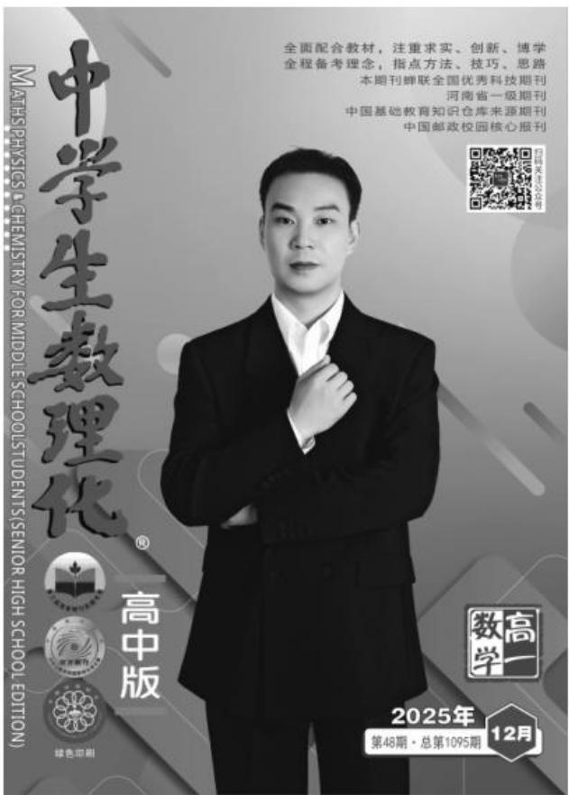

# 三角恒等变换中的六类创新问题

冷文华

创新 1:三角恒等变换中的“差异分析法”

例 1 计算: $\frac{3}{\sin^{2}20^{\circ}} - \frac{1}{\cos^{2}20^{\circ}} + 64\sin^{2}20^{\circ} =$ \_\_\_\_。

解析： $\frac{3}{\sin^220^\circ} -\frac{1}{\cos^220^\circ} +64\sin^220^\circ =$ $\frac{3\cos^220^\circ - \sin^220^\circ}{\sin^220^\circ\cdot\cos^220^\circ}$ $+64\sin^220^\circ =$

$$
\frac {(\sqrt {3} \cos 2 0 ^ {\circ} - \sin 2 0 ^ {\circ}) (\sqrt {3} \cos 2 0 ^ {\circ} + \sin 2 0 ^ {\circ})}{\sin^ {2} 2 0 ^ {\circ} \cdot \cos^ {2} 2 0 ^ {\circ}} +
$$

$$
3 2 - 3 2 \cos 4 0 ^ {\circ} = \frac {4 \cos 5 0 ^ {\circ} \sin 8 0 ^ {\circ}}{\frac {1}{4} \sin^ {2} 4 0 ^ {\circ}} + 3 2 -
$$

$$
3 2 \cos 4 0 ^ {\circ} = 3 2 \cos 4 0 ^ {\circ} + 3 2 - 3 2 \cos 4 0 ^ {\circ} = 3 2 。
$$

点评：“差异分析法”是三角恒等变换中的常用策略。通过观察角、函数名称及运算结构之间的差异，进行差异分析，找出差异之间的内在联系，选择恰当的公式，促使差异的转化。

创新 2: 三角恒等变换中的“换元变角法”

例 2 设 $\alpha$ 为锐角, 若 $\cos\left(\alpha+\frac{\pi}{6}\right)=\frac{4}{5}$ ,
则 $\sin\left(2\alpha+\frac{\pi}{12}\right)$ 的值为 \_\_\_\_。

解析: 已知 $\alpha$ 为锐角, 设 $x = \alpha + \frac{\pi}{6}$ , 则 $\alpha = x - \frac{\pi}{6}, \frac{\pi}{6} < x < \frac{2\pi}{3}$ , 所以 $2\alpha + \frac{\pi}{12} = 2\left(x - \frac{\pi}{6}\right) + \frac{\pi}{12} = 2x - \frac{\pi}{4}$ 。

由 $\cos x=\frac{4}{5},\frac{\pi}{6}<x<\frac{2\pi}{3}$ ，可得 $\sin x=\frac{3}{5}$ ，所以 $\sin 2x=2\sin x\cos x=\frac{24}{25},\cos 2x=2\cos^{2}x-1=\frac{7}{25}$ 。

故 $\sin \left(2\alpha +\frac{\pi}{12}\right) = \sin \left(2x - \frac{\pi}{4}\right) =$

$$
\sin 2 x \cos \frac {\pi}{4} - \cos 2 x \sin \frac {\pi}{4} = \frac {1 7 \sqrt {2}}{5 0} 。
$$

点评:“换元变角法”是三角恒等变换中的常用方法。“换元变角法”的实质就是角的配凑,如题中 $2\alpha+\frac{\pi}{12}=2\left(\alpha+\frac{\pi}{6}\right)-\frac{\pi}{4}$ 。如果采用换元变角法,那么就只是简单的代入,且操作简单,直达目标。

创新 3:三角函数名称的互化(切化弦)

例 3 计算: $\frac{1 + \cos 20^{\circ}}{2 \sin 20^{\circ}} - \sin 10^{\circ} \cdot \left(\frac{1}{\tan 5^{\circ}} - \tan 5^{\circ}\right) =$ \_\_\_\_。

$$
\begin{array}{l} \sin 1 0 ^ {\circ} \left(\frac {\cos 5 ^ {\circ}}{\sin 5 ^ {\circ}} - \frac {\sin 5 ^ {\circ}}{\cos 5 ^ {\circ}}\right) = \frac {\cos 1 0 ^ {\circ}}{2 \sin 1 0 ^ {\circ}} - \sin 1 0 ^ {\circ} \cdot \\ \frac {\cos^ {2} 5 ^ {\circ} - \sin^ {2} 5 ^ {\circ}}{\sin 5 ^ {\circ} \cos 5 ^ {\circ}} = \frac {\cos 1 0 ^ {\circ}}{2 \sin 1 0 ^ {\circ}} - \sin 1 0 ^ {\circ} \cdot \frac {\cos 1 0 ^ {\circ}}{\frac {1}{2} \sin 1 0 ^ {\circ}} \\ = \frac {\cos 1 0 ^ {\circ}}{2 \sin 1 0 ^ {\circ}} - \frac {\sin 2 0 ^ {\circ}}{\sin 1 0 ^ {\circ}} = \frac {\cos 1 0 ^ {\circ} - 2 \sin (3 0 ^ {\circ} - 1 0 ^ {\circ})}{2 \sin 1 0 ^ {\circ}} = \\ \frac {\cos 1 0 ^ {\circ} - 2 \left(\frac {1}{2} \cos 1 0 ^ {\circ} - \frac {\sqrt {3}}{2} \sin 1 0 ^ {\circ}\right)}{2 \sin 1 0 ^ {\circ}} = \frac {\sqrt {3} \sin 1 0 ^ {\circ}}{2 \sin 1 0 ^ {\circ}} = \\ \frac {\sqrt {3}}{2} \circ \\ \end{array}
$$

解析：原式 $= \frac{2\cos^210^\circ}{2\times 2\sin 10^\circ\cos 10^\circ}$

点评:本题凸显目标意识下“化异为同、分式类约项”的解题思路。解题的关键是“切化弦”和“变角” $(20^{\circ}=30^{\circ}-10^{\circ})$ 技巧,以及二倍角公式、和差角公式的灵活运用。

创新 4:三角恒等变换中的“结构式子的变换”

例 4 若 $3\cos\left(\frac{\pi}{2}-\theta\right)+\cos(\pi+\theta)=0$ ,
则 $\cos^{2}\theta + \frac{1}{2}\sin 2\theta$ 的值是 \_\_\_\_。

解析:由已知得 $3\sin\theta - \cos\theta = 0$ , 即

$$
\begin{array}{r l} & {\tan \theta = \frac {1}{3}, \text {所以} \cos^ {2} \theta + \frac {1}{2} \sin 2 \theta =} \\ & {\frac {\cos^ {2} \theta + \sin \theta \cos \theta}{\sin^ {2} \theta + \cos^ {2} \theta} = \frac {1 + \tan \theta}{1 + \tan^ {2} \theta} = \frac {6}{5}.} \end{array}
$$

点评:本题充分展现了三角恒等变换中“结构式子变换”的关键作用。对已知式子的结构进行变形,使其更贴近某个公式或期待的目标,通常有“升幂与降幂”“常值代换”“逆用、变用公式”“通分与约分”“分解与组合”等,从而便于问题的圆满解决。

创新 5:三角函数图像与性质中的“三角变换”

例 5 已知函数 $f(x)=\sqrt{3}\sin(\omega x+\varphi)$ $\left(\omega>0,-\frac{\pi}{2}<\varphi<\frac{\pi}{2}\right)$ 的图像关于直线 $x=\frac{\pi}{3}$ 对称，且图像上相邻的两个最高点的距离为 $\pi$ 。

(1) 求 $\omega$ 和 $\varphi$ 的值。

(2) 若 $f\left(\frac{\alpha}{2}\right)=\frac{\sqrt{3}}{4}\left(\frac{\pi}{6}<\alpha<\frac{2\pi}{3}\right)$ ，求 $\cos\left(\alpha+\frac{3\pi}{2}\right)$ 的值。

解析:(1)因为函数 $f(x)$ 的图像上相邻两个最高点的距离为 $\pi$ , 所以 $f(x)$ 的最小正周期 $T=\pi$ , 所以 $\omega=\frac{2\pi}{T}=2$ , 这时 $f(x)=\sqrt{3}\sin(2x+\varphi)$ 。因为函数 $f(x)$ 的图像关于直线 $x=\frac{\pi}{3}$ 对称, 所以 $2\times\frac{\pi}{3}+\varphi=k\pi+\frac{\pi}{2}, k\in Z$ , 即 $\varphi=k\pi-\frac{\pi}{6}, k\in Z$ 。由 $-\frac{\pi}{2}<\varphi<\frac{\pi}{2}$ , 取 k=0, 可得 $\varphi=-\frac{\pi}{6}$ 。故 $\omega=2, \varphi=-\frac{\pi}{6}$ 。

(2)由(1)得 $f(x)=\sqrt{3}\sin\left(2x-\frac{\pi}{6}\right)$ ，所以 $f\left(\frac{\alpha}{2}\right)=\sqrt{3}\sin\left(2\times\frac{\alpha}{2}-\frac{\pi}{6}\right)=\frac{\sqrt{3}}{4}$ ，所以 $\sin\left(\alpha-\frac{\pi}{6}\right)=\frac{1}{4}$ 。

由 $\frac{\pi}{6} < \alpha < \frac{2\pi}{3}$ , 可得 $0 < \alpha - \frac{\pi}{6} < \frac{\pi}{2}$ , 所以 $\cos \left( \alpha - \frac{\pi}{6} \right) = \sqrt{1 - \sin^2 \left( \alpha - \frac{\pi}{6} \right)} = \frac{\sqrt{15}}{4}$ 。

故 $\cos \left(\alpha +\frac{3\pi}{2}\right) = \sin \alpha = \sin \left[\left(\alpha -\frac{\pi}{6}\right) + \right.$

$$
\begin{array}{l} \left. \frac {\pi}{6} \right] = \sin \left(\alpha - \frac {\pi}{6}\right) \cos \frac {\pi}{6} + \cos \left(\alpha - \frac {\pi}{6}\right) \sin \frac {\pi}{6} \\ = \frac {\sqrt {3} + \sqrt {1 5}}{8} 。 \\ \end{array}
$$

点评:三角变换与三角函数的图像和性质紧密相连、不可分割。题中借助图像上相邻两个最高点的距离为 $\pi$ ，求出 $\omega$ 的值，利用图像关于直线 $x=\frac{\pi}{3}$ 对称求出 $\varphi$ 的值，为进一步求得 $\cos\left(\alpha+\frac{2\pi}{2}\right)$ 的值提供了条件。

创新 6: 函数最值求解中的“三角换元法”

例6 求函数 $u = \sqrt{2t + 4} + \sqrt{6 - t}$ 的最值。

解析:由 $2t+4 \geqslant 0$ 且 $6-t \geqslant 0$ 得 $-2 \leqslant t \leqslant 6$ ，结合 t 的有界性，可利用三角换元法求最值。

设 $t = -2 + 8\cos^2\theta, \theta \in \left[0, \frac{\pi}{2}\right]$ ，则函数 $u = \sqrt{2t + 4} + \sqrt{6 - t}$ 等价于函数 $\varphi(\theta) = \sqrt{16\cos^2\theta} + \sqrt{8\sin^2\theta} = 4\cos \theta + 2\sqrt{2}\sin \theta = 2\sqrt{6}\sin (\theta + \alpha)$ ，其中 $\alpha$ 由 $\tan \alpha = \sqrt{2}$ 确定。

因为 $\theta \in \left[0, \frac{\pi}{2}\right]$ , 所以 $\theta + \alpha \in \left[\alpha, \alpha + \frac{\pi}{2}\right]$ , 所以 $u_{\max} = \varphi(\theta)_{\max} = 2\sqrt{6} \sin \frac{\pi}{2} = 2\sqrt{6}$ 。

显然 $u_{\min}$ 是 $\varphi(0)$ 和 $\varphi\left(\frac{\pi}{2}\right)$ 中的较小者。易得 $\sin \alpha = \frac{\sqrt{6}}{3}, \cos \alpha = \frac{\sqrt{3}}{3}$ 。由 $\varphi(0) = 2\sqrt{6} \sin \alpha = 4 > \varphi\left(\frac{\pi}{2}\right) = 2\sqrt{6} \times \sin\left(\alpha + \frac{\pi}{2}\right) = 2\sqrt{6} \cos \alpha = 2\sqrt{2}$ ，可得 $u_{\min} = \varphi(\theta)_{\min} = 2\sqrt{2}$ 。

故 $u_{\mathrm{min}} = 2\sqrt{2}, u_{\mathrm{max}} = 2\sqrt{6}$ ，即函数 $u = \sqrt{2t + 4} + \sqrt{6 - t}$ 的最大值为 $2\sqrt{6}$ ，最小值为 $2\sqrt{2}$ 。

点评: 当函数自变量取值为区间时, 三角换元法能发挥重要作用。题中利用三角函数的有界性, 结合辅助角公式求出最值, 巧妙地将代数问题转化为三角问题来解决。

作者单位:安徽省广德中学

(责任编辑 郭正华)

16 例说两角和与差公式在解题中的应用

罗文军

17 巧用三角函数妙解题

王佩其

18 例析三角函数的求值问题

张红梅

20 利用三角函数的性质求参数问题的审题、解答与反思 石汉

21 例析诱导公式的五种常考题型

赵清军

23 引入辅助角解题“三部曲”

张振继

25 三角函数中有关 $\omega$ 的范围问题

王 刚 张启兆

27 揭秘三角函数的值域(最值)的五类问题

张 哲 贺计策 赵自霞

# 核心考点演练

29 三角函数核心考点强化训练

刘中亮

# 易错题归类剖析

36 品味三角变换中的误区警示

江玲

# 创新题追根溯源

38 三角函数中求参数问题探析

胡贵平

40 三角恒等变换中的六类创新问题

冷文华

# 经典题突破方法

42 三角函数常见典型考题赏析

赵新晓

封面刊名题字:华罗庚

顾问单位:中国数学会 中国物理学会 中国化学会

学术顾问:任子朝 韩家勋 李勇

委员:(按拼音排序) 陈进前 冯丽娟 公衍录 郭统福 侯有岐
胡东明 胡银伟 黄颖 蒋天林 李胜荣 李树祥 刘大鸣 刘树领
毛广文 孟卫东 隋俊礼 王国平 王后雄 王怀文 王玮琪 杨天才
余其权 余永安 袁竞成 岳庆先 张北春 张金生 赵剑涛

text_image

MATHS PHYSICS & CHEMISTRY FOR MIDDLE SCHOOL STUDENTS (SENIOR HIGH SCHOOL EDITION)
中学生数理化®
高中版
全面配合教材，注重求实、创新、博学
全程备考理念，指点方法、技巧、思路
本期刊蝉联全国优秀科技期刊
河南省一级期刊
中国基础教育知识仓库来源期刊
中国邮政校园核心报刊
数字出版公司公众号
2025年
第48期·总第1095期 12月

# 封面人物

冷文华,硕士研究生学历,现为安徽省广德中学数学教师。从教以来,连续多年任班主任,多次获得“优秀班主任”称号,所带毕业班级多次荣获校优秀班集体和“广德市文明班级”称号。多次参加市优质课评选,获得市二等奖、三等奖。积极参加论文评选和课题研究,有多篇教育教学论文发表或获奖。指导学生参加2024年全国中学生数学奥林匹克竞赛(安徽赛区),荣获省二等奖、三等奖各1人。获得2025年安徽省高考数学科目优秀评卷教师称号。

# 版权声明

本刊所有文字和图片作品,未经许可,不得转载、摘编。凡投稿本刊,或允许本刊登载的作品,均视为已授权本刊在刊物、增刊、图书上使用,以及许可本刊授权合作网站(中国知网、万方数据库或维普资讯网等)以数字化方式复制、汇编、发行、信息网络传播本刊全文。本刊支付的稿酬,已包含授权费用。作者投稿给本刊即意味着同意上述约定,如有异议请与本刊签订书面协议。

本社根据《中华人民共和国广告法》等国家有关法律法规审查及刊登广告,若广告主有超过广告内容的后续行为,均与本社无关。