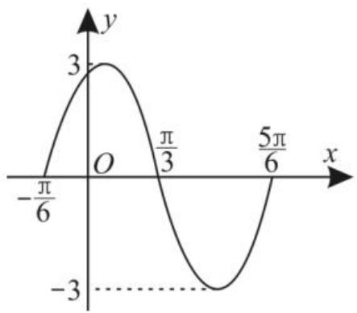

# 聚焦三角函数中的数学思想

# ■黄晓丽

natural_image

Illustration of a 3D figure examining a magnifying glass over files and a folder (no text or symbols)

# 聚焦一:数形结合思想

例 1 图 1 是函数 $y = A \sin(\omega x + \varphi)$ $(A > 0, \omega > 0, |\varphi| < \frac{\pi}{2})$ 图像的一部分，则此函数的解析式为 \_\_\_\_。

line

| x | y |
|---|---|
| -π/6 | 0 |
| 0 | 3 |
| π/3 | 0 |
| 5π/6 | -3 |

图1

解:(逐一定参数法)由图知 A=3, T= $\frac{5\pi}{6}-\left(-\frac{\pi}{6}\right)=\pi$ , 所以 $\omega=\frac{2\pi}{T}=2$ , 这时 y=3sin(2x+ $\varphi$ )。因为点 $\left(-\frac{\pi}{6},0\right)$ 在图像上, 所以 $0=3\sin\left(-\frac{\pi}{6}\times2+\varphi\right)$ , 所以 $-\frac{\pi}{6}\times2+\varphi=k\pi(k\in\mathbf{Z})$ , 即 $\varphi=\frac{\pi}{3}+k\pi(k\in\mathbf{Z})$ 。因为 $|\varphi|<\frac{\pi}{2}$ , 所以 $\varphi=\frac{\pi}{3}$ , 故函数 y=3sin $\left(2x+\frac{\pi}{3}\right)$ 。

（待定系数法）由图知 $A = 3$ 。因为图像过点 $\left(\frac{\pi}{3},0\right)$ 和 $\left(\frac{5\pi}{6},0\right)$ ，所以 $\left\{ \begin{array}{l} \frac{\pi\omega}{3} + \varphi = \pi, \\ \frac{5\pi\omega}{6} + \varphi = 2\pi, \end{array} \right.$ 解得 $\left\{ \begin{array}{l} \omega = 2, \\ \varphi = \frac{\pi}{3}, \end{array} \right.$ 所以函数 $y = 3\sin \left(2x + \frac{\pi}{3}\right)$ 。

（图像变换法）由 $A = 3, T = \pi$ ，点 $\left(-\frac{\pi}{6}, 0\right)$ 在图像上，可知图像是由 $y = 3\sin 2x$ 向左平移 $\frac{\pi}{6}$ 个单位长度得到的，所以 $y = 3\sin 2\left(x + \frac{\pi}{6}\right)$ ，即函数 $y = 3\sin \left(2x + \frac{\pi}{3}\right)$ 。

评注:对于三角函数的图像变换,要注意正确判断哪一个点是“第一零点”,同时要注意图像平移遵循“左加右减”的原则。

# 聚焦二:方程思想

例 2 已知 $\alpha\in\left(-\frac{\pi}{2},\frac{\pi}{2}\right)$ ，且 $\sin\alpha+$ $\cos\alpha=\frac{\sqrt{5}}{5}$ ，则 $\tan\alpha=$ \_\_\_\_。

解:(方法1)由 $\sin\alpha+\cos\alpha=\frac{\sqrt{5}}{5}$ ，平方得 $1+2\sin\alpha\cos\alpha=\frac{1}{5}$ ，所以 $\sin\alpha\cos\alpha=-\frac{2}{5}$ ，
所以 $\frac{\sin\alpha\cos\alpha}{\sin^{2}\alpha+\cos^{2}\alpha}=-\frac{2}{5}$ ，所以 $\frac{\tan\alpha}{\tan^{2}\alpha+1}=-\frac{2}{5}$ ，即 $2\tan^{2}\alpha+5\tan\alpha+2=0$ ，解得 $\tan\alpha=-\frac{1}{2}$ 或 $\tan\alpha=-2$ 。因为 $\alpha\in\left(-\frac{\pi}{2},\frac{\pi}{2}\right)$ ，且 $0<\sin\alpha+\cos\alpha=\frac{\sqrt{5}}{5}<1$ ，所以 $\cos\alpha>-\sin\alpha>0$ ，即 $\tan\alpha>-1$ ，所以 $\tan\alpha=-\frac{1}{2}$ 。

(方法 2) 由 $\sin\alpha+\cos\alpha=\frac{\sqrt{5}}{5}$ ，平方得 $1+2\sin\alpha\cos\alpha=\frac{1}{5}$ ，即 $2\sin\alpha\cos\alpha=-\frac{4}{5}$ ，所以 $(\sin\alpha-\cos\alpha)^{2}=1-2\sin\alpha\cos\alpha=\frac{9}{5}$ 。因为 $\alpha\in\left(-\frac{\pi}{2},\frac{\pi}{2}\right)$ ，且 $0<\sin\alpha+\cos\alpha=\frac{\sqrt{5}}{5}<1$ ，所以 $\cos\alpha>-\sin\alpha>0$ ，即 $\cos\alpha>0,\sin\alpha<0$ ，所以 $\sin\alpha-\cos\alpha=-\frac{3\sqrt{5}}{5}$ 。结合题设得 $\left\{\begin{aligned}\sin\alpha&=-\frac{\sqrt{5}}{5},\\ \cos\alpha&=\frac{2\sqrt{5}}{5},\end{aligned}\right.$ 所以 $\tan\alpha=\frac{\sin\alpha}{\cos\alpha}=-\frac{1}{2}$ 。

评注:方程思想是三角函数化简与求值中常用的重要数学思想。

# 聚焦三: 函数思想

例 3 函数 $y = \sin^{2}x + \sin x - 1$ 的值域是 \_\_\_\_。

解: 令 $t = \sin x$ ，则 $t \in [-1, 1]$ 。原函数等价于 $g(t) = t^{2} + t - 1 = \left(t + \frac{1}{2}\right)^{2} - \frac{5}{4}$ ， $t \in [-1, 1]$ 。所以当 $t = -\frac{1}{2}$ ，即 $\sin x = -\frac{1}{2}$ ， $x = 2k\pi - \frac{\pi}{6}(k \in \mathbf{Z})$ 或 $x = 2k\pi - \frac{5\pi}{6}(k \in \mathbf{Z})$ 时， $y_{\min} = -\frac{5}{4}$ ; 当 t = 1，即 $\sin x = 1, x = 2k\pi + \frac{\pi}{2}(k \in \mathbf{Z})$ 时， $y_{\max} = 1$ 。所以函数 $y = \sin^{2}x + \sin x - 1$ 的值域为 $\left[-\frac{5}{4}, 1\right]$ 。

评注: 求形如 $y = a \sin^{2} x + b \sin x + c$ , $a \neq 0, x \in R$ 的函数的值域或最值时, 可以通过换元, 令 $t = \sin x$ , 将原函数转化为关于 t 的二次函数, 利用配方法求值域或最值, 但不要忽视正弦函数的有界性。

# 聚焦四:分类讨论思想

例4 已知函数 $f(x) = \frac{\cos^2(n\pi + x) \cdot \sin^2(n\pi - x)}{\cos^2[(2n + 1)\pi - x]} (n \in \mathbf{Z})$ 。

(1)化简函数 $f(x)$ 的表达式。  
(2) 求 $f\left(\frac{2026\pi}{3}\right)$ 的值。

解:(1)当 n 为偶数, 即 $n=2k(k\in\mathbf{Z})$ 时,

$$
\begin{array}{l} f (x) = \frac {\cos^ {2} (2 k \pi + x) \cdot \sin^ {2} (2 k \pi - x)}{\cos^ {2} [ (4 k + 1) \pi - x ]} = \\ \frac {\cos^ {2} x \cdot \sin^ {2} (- x)}{\cos^ {2} (\pi - x)} = \frac {\cos^ {2} x \cdot (- \sin x) ^ {2}}{(- \cos x) ^ {2}} = \sin^ {2} x; \\ \end{array}
$$

当 n 为奇数, 即 $n=2k+1(k\in\mathbf{Z})$ 时, $f(x)$

$$
\begin{array}{l} = \frac {\cos^ {2} [ (2 k + 1) \pi + x ] \cdot \sin^ {2} [ (2 k + 1) \pi - x ]}{\cos^ {2} \left\{\left[ 2 (2 k + 1) + 1 \right] \pi - x \right\}} = \\ \frac {\cos^ {2} (\pi + x) \cdot \sin^ {2} (\pi - x)}{\cos^ {2} (\pi - x)} = \frac {(- \cos x) ^ {2} \sin^ {2} x}{(- \cos x) ^ {2}} = \\ \sin^ {2} x 。 \\ \end{array}
$$

综上得函数 $f(x) = \sin^2 x$ 。

(2)由(1)知 $f\left(\frac{2026\pi}{3}\right) = \sin^2{\frac{2026\pi}{3}} =$

$$
\begin{array}{l} \sin^ {2} \left(6 7 4 \pi + \pi + \frac {\pi}{3}\right) = \sin^ {2} \left(\pi + \frac {\pi}{3}\right) = \sin^ {2} \frac {\pi}{3} \\ = \frac {3}{4} 。 \\ \end{array}
$$

评注:分类讨论思想就是“化整为零,各个击破,再积零为整”的解题策略,同时要确保分类准确,且不重不漏。

# 聚焦五:转化与化归思想

例 5 已知 $\alpha, \beta \in \left(\frac{3\pi}{4}, \pi\right)$ ，且 $\sin(\alpha + \beta) = -\frac{3}{5}$ ， $\sin\left(\beta - \frac{\pi}{4}\right) = \frac{24}{25}$ ，则 $\cos\left(\alpha + \frac{\pi}{4}\right) =$ \_\_\_\_。

解:由题意知 $\alpha + \beta \in \left(\frac{3\pi}{2}, 2\pi\right)$ , $\sin(\alpha + \beta) = -\frac{3}{5} < 0$ , 所以 $\cos(\alpha + \beta) = \frac{4}{5}$ 。因为 $\beta - \frac{\pi}{4} \in \left(\frac{\pi}{2}, \frac{3\pi}{4}\right)$ , 所以 $\cos\left(\beta - \frac{\pi}{4}\right) = -\frac{7}{25}$ ,
所以 $\cos\left(\alpha+\frac{\pi}{4}\right)=\cos\left[(\alpha+\beta)-\left(\beta-\frac{\pi}{4}\right)\right]=\cos(\alpha+\beta)\cos\left(\beta-\frac{\pi}{4}\right)+\sin(\alpha+\beta)\cdot\sin\left(\beta-\frac{\pi}{4}\right)=-\frac{4}{5}$

评注: 常用的拆角与拼角技巧有 $2\alpha = (\alpha + \beta) + (\alpha - \beta)$ , $\alpha = (\alpha + \beta) - \beta = (\alpha - \beta) + \beta$ , $\beta=\frac{\alpha+\beta}{2}-\frac{\alpha-\beta}{2}=(\alpha+2\beta)-(\alpha+\beta),\alpha-\beta=$ $(\alpha-\gamma)+(\gamma-\beta),\frac{\pi}{4}+\alpha=\frac{\pi}{2}-\left(\frac{\pi}{4}-\alpha\right)$ 等。

# 聚焦六:整体思想

例 6 已知 $\alpha\in(0,\pi)$ ，且 $\sin\alpha+\cos\alpha=\frac{\sqrt{2}}{2}$ ，则 $\sin\alpha-\cos\alpha=$ \_\_\_\_。

解:由 $\sin\alpha+\cos\alpha=\frac{\sqrt{2}}{2}$ ，可得 $(\sin\alpha+\cos\alpha)^{2}=1+2\sin\alpha\cos\alpha=\frac{1}{2}$ ，即 $\sin\alpha\cos\alpha=-\frac{1}{4}<0$ ，结合 $\alpha\in(0,\pi)$ 得 $\sin\alpha>0,\cos\alpha<0$ ，所以 $\sin\alpha-\cos\alpha>0$ 。

因为 $(\sin \alpha - \cos \alpha)^2 = 1 - 2\sin \alpha \cos \alpha = \frac{3}{2}$ , 所以 $\sin \alpha - \cos \alpha = \frac{\sqrt{6}}{2}$ 。

评注:利用整体思想解题,可以降低解题的难度,达到快速解题的目的。

作者单位:湖北省恩施高中

(责任编辑 王琼霞)