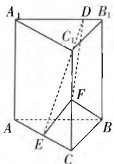

# 2021 年高考数学探究性试题的类型与评析\*

● 内江师范学院数学与信息科学学院 程雪莲 赵思林  
- 四川省广元市苍溪县石马镇初级中学校 李雪莲

# 一、探究的意义

探究是数学的核心. 杜威认为, 探究是指“从不确定的情境向确定情境”的转化, 获得“有根据的断言”. 获得“有根据的断言”有两层意思, 一是获得“断言”, 或者说是发现 (和提出) 了某个“猜想”, 这实质上是“探”; 二是所获得的断言要“有根据”, 这实质上是“究”, 或者说是对“猜想”的证明. 研究者认为, “探是探, 究是究, 探究是探究. 探究 = 探 + 究 + X.” 探究包括两个过程, 即“探”的过程和“究”的过程. “探”是指弄清楚“是什么”的过程, “究”是指弄清楚“为什么”的过程, “X”表示由“探”和“究”生成的情感、态度与价值观. 鉴于数学探究对培养创新人才的重要作用, 近年的高考数学试题注重对学生探究能力的考查. 借鉴赵思林、潘超等对高考数学探究性问题的类型研究, 将高考数学探究性问题的类型分为对象存在、结论 / 条件开放、规律发现、思路探索、反例构造、方案设计、实验操作、命题推广、条件追溯、结论探索、信息迁移、动态最值等 12 种类型. 本文拟对 2021 年高考数学试题中部分探究性试题作出分类及评析.

# 二、2021年高考数学探究性问题的类型与求解策略

# 1. 对象存在型

对象存在型试题是指具有“探究满足某些条件的数学对象(如点、线、面、体, 数、式等)是否存在, 若存在, 需找出; 若不存在, 需要说明理由”特征的问题.

例 1 （全国甲卷理科第 19 题）已知直三棱柱 $ABC-A_{1}B_{1}C_{1}$ 中，侧面 $AA_{1}B_{1}B$ 为正方形，AB=BC=2, E, F 分别为 AC 和 $CC_{1}$ 的中点，D 为棱 $A_{1}B_{1}$ 上的点， $BF \perp A_{1}B_{1}$ .

(1) 证明: $BF \perp DE$ ;   
(2) 当 $B_{1}D$ 为何值时, 面 $BB_{1}C_{1}C$ 与面 DFE 所成的二面角的正弦值最小?

评析: 本题以三棱柱为基架, 考查立体几何中异面直线关系、线面关系, 并探求二面角正弦值何时最小. 第(1)问要证明异面直线互相垂直, 可采取假设命题成立法, 通过证明线线垂直(可取 BC 的中点 M, 连接 EM, 借助 $BF \perp A_{1}B_{1}$ , 证明 $BF \perp B_{1}M$ ), 进一步证明线面垂直 ( $BF \perp$ 面 $EMB_{1}A_{1}$ ), 进而

text_image

A₁
D
B₁
C₁
F
A
E
C
B

图 1

证得命题成立；也可利用坐标法探究 $\overrightarrow{BF},\overrightarrow{DE}$ 之间的关系证得命题.第(2)问求当 $B_{1}D$ 为何值时二面角最小，究其逻辑本质，关键在于求得二面角的表达式，探求其与 $B_{1}D$ 的关系.解答时可设 $B_{1}D = t$ ，利用坐标法探求面 $BB_{1}C_{1}C$ 与面DFE的法向量分别为 $\pmb {m} = (0,1,$ $0),\pmb {n} = (1 + t,3,2 - t)$ ，将求二面角正弦值的最小值等价转化为求其余弦值的最大值，探得 $\cos \langle m,n\rangle =$ $\frac{1}{\sqrt{2t^2 - 2t + 14}}.$ 从而，通过探求最大值可得到：当 $B_{1}D = t = \frac{1}{2}$ 时，二面角的正弦值最小.

解题策略:对于高考立体几何中的对象存在性问题,有三种方法:(1)直接推证法,即利用已知条件直接推理探寻或构造满足条件的对象;(2)反证法,即假设对象存在(命题成立),推证假设对象(命题)所需满足的条件与已知条件是否存在矛盾;(3)反例法,即举出至少一个不满足条件的对象,此法尤其适合选择题.

# 2. 结论 / 条件开放型

数学开放性问题的显著特征是指问题的答案不唯一或不确定. 主要包括三种类型: 条件开放型问题 (结论明确, 条件不明确), 结论开放型问题 (条件明确, 结论不唯一), 条件和结论都开放问题 (条件与结论都明确, 但都具有灵活性).

例 2 （新高考 I 卷第 12 题）在正三棱柱 ABC-A₁B₁C₁ 中，AB = AA₁ = 1，点 P 满足 $\overrightarrow{BP} = \lambda \overrightarrow{BC} +$ $\mu\overrightarrow{BB_{1}}$ , 其中 $\lambda \in [0,1]$ , $\mu \in [0,1]$ , 则().

A. 当 $\lambda = 1$ 时, $\triangle AB_{1}P$ 的周长为定值  
B. 当 $\mu = 1$ 时, 三棱锥 $P - A_{1}BC$ 的体积为定值  
C. 当 $\lambda = \frac{1}{2}$ 时, 有且仅有一个点 $P$ , 使得 $A_{1}P \perp BP$   
D. 当 $\mu=\frac{1}{2}$ 时, 有且仅有一个点 P, 使得 $A_{1}B \perp$ 平面 $AB_{1}P$

评析:该题是一道多选题,所给条件具有开放性,属于条件和结论都开放型问题.对 $\lambda,\mu$ 分别施以值为1或 $\frac{1}{2}$ 的条件,运用数形结合的数学思想解决.当 $\lambda=1$ 时,借助平面展开图可探得 $B_{1}P+PA$ 在变,即 $\triangle AB_{1}P$ 的周长不是定值,故 A 错误;由 $\mu=1$ 可探知 P 到平面 $A_{1}BC$ 的距离为定值,且有 $\triangle A_{1}BC$ 的面积不变的条件,则 $V_{P-A_{1}BC}$ 的体积为定值,故 B 正确;将 $\lambda=\frac{1}{2}$ 代入,通过建立直角坐标系可探得 $\mu=1$ 或 0,则 C 错误;将 $\mu=\frac{1}{2}$ 代入,根据 $A_{1}B\perp$ 平面 $AB_{1}P$ 的条件有 $\overrightarrow{A_{1}B}\perp\overrightarrow{AB_{1}}\cdot\overrightarrow{A_{1}B}\perp\overrightarrow{AP}$ ,可探得 $\lambda=1$ (唯一),故 D 正确.具体过程略,所以答案选 BD.

解题策略:解答条件开放型问题,可以运用逆向思维,逆向反推探究所需条件.解答结论开放型问题,可运用顺向思维,探寻由条件可推知的结论.解答条件和结论都开放问题,可采取先假设某一条件,再利用顺向思维,运用直接法,推理得出在已知条件与假设条件下所能获得的结论.

# 3. 思路探索型

思路探索型试题是指需通过观察、分析、假设、尝试、猜想、顿悟、验证等探索过程寻求解决思路的问题.

例3（新高考I卷第17题）已知数列 $\{a_{n}\}$ 满足 $a_1 = 1,a_{n + 1} = \left\{ \begin{array}{l}a_n + 1,n$ 为奇数，\\ a\_n + 2,n为偶数.

(1) 记 $b_{n} = a_{2n}$ , 写出 $b_{1}, b_{2}$ , 并求数列 $\{b_{n}\}$ 的通项公式;

(2) 求 $\{a_{n}\}$ 的前 20 项和.

评析:本题考查数列知识,需要学生具备发现意识、规律意识和归纳意识,掌握思路探索方法.解答第(1)问需观察分析 $b_{n}$ 与 $a_{n}$ 的关系 $b_{n}=a_{2n}$ ,结合 $a_{n+1}$ 的表达式,尝试写出 $b_{1}=a_{2}=a_{1}+1=2,b_{2}=a_{4}=a_{3}+1=a_{2}+2+1=5$ ,并分析其特征,类比写出 $b_{n+1}$ 的表达式 $b_{n+1}=a_{2n}+3$ ,猜想 $b_{n},b_{n+1}$ 之间存在差为3的规律,根据定义特征验证数列 $\{b_{n}\}$ 为等差数列,再根据等差数列通项公式定义探得 $b_{n}=3n-1$ .第(2)问的解答要借助第(1)问的信息与结论加以分析,观察探得 $\{a_{n}\}$ 奇数项和偶数项都是以3为公差的等差数列,再根据分类思想按 $\{a_{n}\}$ 的奇数项和偶数项分类,探究写出 $\{a_{n}\}$ 的前20项和的表达式: $S_{20}=(a_{1}+a_{3}+\cdots+a_{19})+(a_{2}+a_{4}+\cdots+a_{20})$ ,计算得到300,即探得最终结果.

解题策略:解答思路探索型问题对逻辑思维的要求比较高,可以通过观察分析、类比推理、信息联想、直觉猜想等方式探究解题思路.

# 4. 反例构造型

反例构造型试题是考查逆向思维和创造性思维的良好方式,是指通过构造或举出反例证明条件、结论或命题不成立.反例的构造主要含有“探”的成分;判断反例的优(劣)需要“究”,即对反例的证明或证伪.

例 4 （全国甲卷理科第7题）等比数列 $\{a_{n}\}$ 的公比为q，前n项和为 $S_{n}$ ，设甲：q>0，乙： $\{S_{n}\}$ 是递增数列，则（）.

A. 甲是乙的充分条件但不是必要条件  
B. 甲是乙的必要条件但不是充分条件  
C. 甲是乙的充要条件  
D. 甲既不是乙的充分条件也不是乙的必要条件

评析:本题是一道典型的反例构造型试题,考查等比数列、递增数列的知识与关系,充分条件与必要条件之间的关系.分析题目信息,可探求辨别由甲不能推得乙,只需举出一个反例即可:若q=1,则 $S_{n}=na_{1}$ ,① $a_{1}>0$ ,则 $\{S_{n}\}$ 单调递增;② $a_{1}<0$ ,则 $\{S_{n}\}$ 单调递减.

由乙可通过逻辑推理得到甲. 即甲是乙的必要条件但不是充分条件, 故答案选 B.

解题策略: 解答这类试题需要运用逆向思维策略, 需要学生熟练掌握基础知识、特例. 根据命题, 若能够构造或举出一个反例, 便可说明命题为假.

# 5. 条件追溯型

条件追溯型试题是指根据给定的结论,确定需满足的条件.

例 5 （新高考 I 卷第 13 题）已知函数 $f(x)=x^{3}(a\cdot2^{x}-2^{-x})$ 是偶函数，则 a= \_\_\_\_.

评析:本题考查函数的奇偶性,根据所给函数是偶函数追溯其参数的具体数值,解答时利用偶函数的性质 $f(-x)=f(x)$ , 进行追溯推理,可求得 a=1.

解题策略:解答这类试题需采取“执果索因”的思维方法,根据结论逆向推导出条件.在推导的过程中要注意推理过程是否可逆.

2021年高考数学从多方位、多类型体现“探”与“究”的思维过程，问题的提出、结论的获得体现从发现、尝试、定位到精准的探究过程，引导考生通过动手、动脑探其然，究其所以然。探究是数学逻辑思维培养和发展的极佳活动方式。数学探究在2021年高考数学中的重点考查启发大家，今后教学时要更加重视数学探究意识的激发、探究方法的掌握、探究问题的编拟、探究能力的提升、探究经验的积累。F