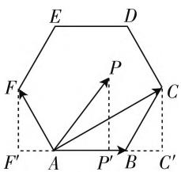
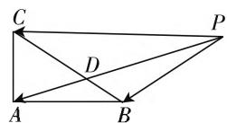
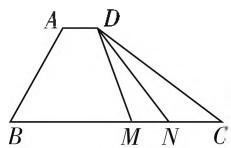
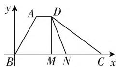
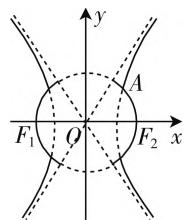

# 例谈高考中平面向量考查要点及复习建议\*

# ● 北京理工大学附属中学 王 慧 何拓程

新课标指出：“几何与代数”是高中数学课程的主线之一。应突出几何直观与代数运算之间的融合，即通过形与数的结合，感悟数学知识之间的关联，加强对数学整体性的理解。平面向量不可替代地成为联系中学数学知识中多项内容的媒介。因此，在高考命题中较为活跃，除了考查向量基本知识，更多的是考查与其他知识相结合。由于向量与函数、三角、数列、解析几何、立体几何等知识容易融合的特点，在复习时除了牢固掌握向量的基本概念、基本性质，还应关注向量与其他知识的结合。研究2020年全国各地的高考数学试卷，发现高考中平面向量综合考查有这样几个亮点：回归定义、“整合”平几、“牵手”函数、“交汇”三角、“联袂”解几。就此，笔者作出一些教学建议。

# 一、要点分析

# (一) 回归定义

数学概念是反映一类对象本质属性的思维形式，主要由原始概念和基本概念组成，是数学知识的最基本形式。张奠宙先生在《数学教育学》中写到：“每一个数学概念从本质上说都是嵌进了一些数学概念的体系中。它从一些基础数学概念中得来，又为建立别的数学概念作基础。”数学概念常以定义的形式描述，它蕴含着极其丰富的内涵。深刻理解定义，可抓住问题的实质，从而找到解决问题的有效途径。

例 1 （2020·新全国 1 山东）已知 P 是边长为 2 的正六边形 ABCDEF 内的一点，则 $\overrightarrow{AP} \cdot \overrightarrow{AB}$ 的取值范围是（）.

A. $(-2,6)$ B. $(-6,2)$ C. $(-2,4)$ D. $(-4,6)$

解析:首先根据题中所给的条件,结合正六边形的特征,得到 $\overrightarrow{AP}$ 在 $\overrightarrow{AB}$ 方向上的投影的取值范围是 $(-1,3)$ ,利用向量数量积的定义式,求得结果.

$\overrightarrow{AB}$ 的模为2，根据正六边形的特征，可以得到 $\overrightarrow{AP}$ 在 $\overrightarrow{AB}$ 方向上的投影的取值范围是(-1,3)，结合向量数量积的定义式，可知 $\overrightarrow{AP}\cdot\overrightarrow{AB}$ 等于 $\overrightarrow{AB}$ 的模与 $\overrightarrow{AP}$ 在 $\overrightarrow{AB}$ 方向上的投影的乘积，所以 $\overrightarrow{AP}\cdot\overrightarrow{AB}$ 的取值范围是(-2,6).

故选A.

评注: 将 $\overrightarrow{AP} \cdot \overrightarrow{AB}$ 按照数量积的定义展开, $\overrightarrow{AP} \cdot \overrightarrow{AB} =$

text_image

E
D
F
P
C
F'
A
P'
B
C'

图1

$|\overrightarrow{AP}||\overrightarrow{AB}|\cos\langle\overrightarrow{AP},\overrightarrow{AB}\rangle=|\overrightarrow{AP}|\cdot\cos\langle\overrightarrow{AP},\overrightarrow{AB}\rangle\cdot|\overrightarrow{AB}|$ ，再利用 $\overrightarrow{AP}$ 在 $\overrightarrow{AB}$ 方向上的投影的概念，有效地将双变量 $|\overrightarrow{AP}|$ 、 $\langle\overrightarrow{AP},\overrightarrow{AB}\rangle$ 转化为一个变量，这就是定义的功能。实际上是“消元”的思想。

# (二)“整合”平几

由于向量本身就具有几何特征,因此和平面几何“整合”是其自然的表现,充分利用平面几何的性质有助于向量问题的解决,同样,平面几何的有关知识也可以借助向量在此扎根.

例 2 （2020·江苏卷）在 $\triangle ABC$ 中，AB=4, AC=3, $\angle BAC=90^{\circ}$ , D 在边 BC 上，延长 AD 到 P，使得 AP=9，若 $\overrightarrow{PA}=m\overrightarrow{PB}+\left(\frac{3}{2}-m\right)\overrightarrow{PC}$ (m 为常数)，则 CD 的长度是 \_\_\_\_.

解析: 因为 A, D, P 三点共线, 所以可设 $\overrightarrow{PA} = \lambda \overrightarrow{PD} (\lambda > 0)$ , 因为 $\overrightarrow{PA} = m \overrightarrow{PB} + \left( \frac{3}{2} - m \right) \overrightarrow{PC}$ , 所以 $\lambda \overrightarrow{PD} =$

  
图2

$$
m \overrightarrow {P B} + \left(\frac {3}{2} - m\right) \overrightarrow {P C}, \text {即} \overrightarrow {P D} = \frac {m}{\lambda} \overrightarrow {P B} + \frac {\frac {3}{2} - m}{\lambda} \overrightarrow {P C}.
$$

若 $m \neq 0$ 且 $m \neq \frac{3}{2}$ , 则 $B, D, C$ 三点共线, 所以 $\frac{m}{\lambda}$

$$
+ \frac {\frac {3}{2} - m}{\lambda} = 1, \text {即} \lambda = \frac {3}{2}.
$$

因为 $AP = 9$ ，所以 $AD = 3$

因为 $AB = 4, AC = 3, \angle BAC = 90^{\circ}$ , 所以 $BC = 5$ .

设 $CD = x, \angle CDA = \theta$ ，则 $BD = 5 - x, \angle BDA = \pi - \theta$ .

所以根据余弦定理可得

$$
\cos \theta = \frac {A D ^ {2} + C D ^ {2} - A C ^ {2}}{2 A D \cdot C D} = \frac {x}{6},
$$

$$
\cos (\pi - \theta) = \frac {A D ^ {2} + B D ^ {2} - A B ^ {2}}{2 A D \cdot B D} = \frac {(5 - x) ^ {2} - 7}{6 (5 - x)}.
$$

因为 $\cos \theta + \cos (\pi - \theta) = 0$ ，所以 $\frac{x}{6} + \frac{(5 - x)^2 - 7}{6(5 - x)} = 0$ ，解得 $x = \frac{18}{5}$ ，所以 $CD$ 的长度为 $\frac{18}{5}$ .

当 $m = 0$ 时， $\overrightarrow{PA} = \frac{3}{2}\overrightarrow{PC},C,D$ 重合，此时 $CD$ 的长度为0.

当 $m = \frac{3}{2}$ 时， $\overrightarrow{PA} = \frac{3}{2}\overrightarrow{PB}, B, D$ 重合，此时 $PA = 12$ ，不合题意，舍去.

故答案为:0 或 $\frac{18}{5}$ .

评注: 将三点共线这样的平面几何问题用向量共线这一代数关系表示是几何问题和代数问题相结合的典范. 事实上, $\overrightarrow{PA} = \lambda \overrightarrow{PD}$ 是三点共线的充要条件, 因此, 将向量共线这样的代数关系赋予其几何特征, 这是能力的体现. 本题还需要注意的是极端情形 C, D 重合, 容易遗漏.

# (三)“牵手”函数

函数思想是中学数学教学的主线, 因此, 向量理所当然地和函数“牵手”. 以向量为背景的函数问题是考试的热点. 最基本的方法就是将向量分解成 x、y 方向的分量来进行运算, 实际上就是利用直角坐标系将二元向量问题转化成一维函数来解决.

例 3 （2020·天津卷）如图 3，在四边形 ABCD 中， $\angle B=60^{\circ}, AB=3, BC=6$ ，且 $\overrightarrow{AD}=\lambda\overrightarrow{BC}, \overrightarrow{AD}\cdot\overrightarrow{AB}=-\frac{3}{2}$ ，则实数 $\lambda$ 的值为 \_\_\_\_，若 M, N 是线段 BC 上的动点，且 $|\overrightarrow{MN}|=1$ ，则 $\overrightarrow{DM}\cdot\overrightarrow{DN}$ 的最小值为 \_\_\_\_。

解析: 因为 $\overrightarrow{AD} = \lambda \overrightarrow{BC}$ ，所以 $AD \parallel BC$ ，

所以 $\angle BAD = 180^{\circ} - \angle B = 120^{\circ}$

$$
\overrightarrow {A B} \cdot \overrightarrow {A D} = \lambda \overrightarrow {B C} \cdot \overrightarrow {A B} = \lambda | \overrightarrow {B C} | \cdot | \overrightarrow {A B} | \cos 1 2 0 ^ {\circ}
$$

  
图3

  
图4

$= \lambda \times 6 \times 3 \times \left(-\frac{1}{2}\right) = -9\lambda = -\frac{3}{2}$ , 解得 $\lambda = \frac{1}{6}$ ,

以点 B 为坐标原点, BC 所在直线为 x 轴建立如图 4 所示的平面直角坐标系 xBy.

因为 BC=6，所以 $C(6,0)$ .

因为 $|AB|=3,\angle ABC=60^{\circ}$ ，所以A的坐标为 $A\left(\frac{3}{2},\frac{3\sqrt{3}}{2}\right)$ .

又因为 $\overrightarrow{AD} = \frac{1}{6}\overrightarrow{BC}$ ，则 $D\left(\frac{5}{2},\frac{3\sqrt{3}}{2}\right)$

设 $M(x,0)$ ，则 $N(x + 1,0)$ （其中 $0\leqslant x\leqslant$ 5）， $\overrightarrow{DM} = \left(x - \frac{5}{2}, - \frac{3\sqrt{3}}{2}\right),\overrightarrow{DN} = \left(x - \frac{3}{2},\right.$

$$
\left. - \frac {3 \sqrt {3}}{2}\right), \overrightarrow {D M} \cdot \overrightarrow {D N} = \left(x - \frac {5}{2}\right) \left(x - \frac {3}{2}\right) + \left(\frac {3 \sqrt {3}}{2}\right) ^ {2} =
$$

$$
x ^ {2} - 4 x + \frac {2 1}{2} = (x - 2) ^ {2} + \frac {1 3}{2}.
$$

所以，当 $x = 2$ 时， $\overrightarrow{DM}\cdot \overrightarrow{DN}$ 取得最小值 $\frac{13}{2}$ 故答案为： $\frac{1}{6};\frac{13}{2}$

评注:本题建立平面直角坐标系,设点 $M(x,0)$ ,则点 $N(x+1,0)$ (其中 $0\leqslant x\leqslant5$ ),得出 $\overrightarrow{DM}\cdot\overrightarrow{DN}$ 关于x的函数表达式,利用二次函数的基本性质求得 $\overrightarrow{DM}\cdot\overrightarrow{DN}$ 的最小值.将向量的数量积与函数的解析式的化简交融在一起,把动点问题包装在一条直线的函数的背景下,可谓别具一格,匠心独运.

# (四)“交汇”三角

由于向量既有大小又有方向,因此,体现方向的角度自然而然地成为研究的重点,所以向量和三角函数“交汇”也在情理之中.中学数学中的许多知识,如极坐标、参数方程、平移与变换、复数等都可以以向量形式或向量方法通过三角函数的运算来建立联系.

例 4 （2020·浙江卷）设 $e_{1}, e_{2}$ 为单位向量，满足 $\left|2e_{1}-e_{2}\right|\leqslant\sqrt{2}, a=e_{1}+e_{2}, b=3e_{1}+e_{2}$ ，设 a, b 的夹角为 $\theta$ ，则 $\cos^{2}\theta$ 的最小值为 \_\_\_\_.

解析: 因为 $\left|2e_{1}-e_{2}\right|\leqslant\sqrt{2}$ ，所以 $4-4e_{1}\cdot e_{2}+1\leqslant2,e_{1}\cdot e_{2}\geqslant\frac{3}{4}$ .

$$
\begin{array}{l} \cos^ {2} \theta = \frac {(a \cdot b) ^ {2}}{a ^ {2} \cdot b ^ {2}} = \frac {(4 + 4 e _ {1} \cdot e _ {2}) ^ {2}}{(2 + 2 e _ {1} \cdot e _ {2}) (1 0 + 6 e _ {1} \cdot e _ {2})} \\ = \frac {4 \left(1 + \boldsymbol {e} _ {1} \cdot \boldsymbol {e} _ {2}\right)}{5 + 3 \boldsymbol {e} _ {1} \cdot \boldsymbol {e} _ {2}} = \frac {4}{3} \left(1 - \frac {2}{5 + 3 \boldsymbol {e} _ {1} \cdot \boldsymbol {e} _ {2}}\right) \geqslant \\ \frac {4}{3} \left(1 - \frac {2}{5 + 3 \times \frac {3}{4}}\right) = \frac {2 8}{2 9}. \\ \end{array}
$$

评注:本题利用向量模的平方等于向量的平方化简条件得 $e_{1} \cdot e_{2} \geqslant \frac{3}{4}$ ，再根据向量夹角公式求 $\cos^{2}\theta$ 函数关系式，根据函数单调性求最值。考查利用模求向量数量积、利用向量数量积求向量夹角、利用函数单调性求最值，考查综合分析求解能力，在知识网络的交汇点处考查学生的推理能力、运算能力和分析问题与解决问题的能力。

# (五)“联袂”解几

以向量形式表示曲线是几何图形代数化的一个重要范例. 而以向量为背景的解析几何问题是命题者最为衷爱的, 这不仅仅是表达形式的问题, 事实上, 向量和解析几何本质上都是在建立点与点之间的联系.

例5（2020·上海卷）双曲线 $C_1: \frac{x^2}{4^2} - \frac{y^2}{b^2} = 1$ ，圆$C_2: x^2 + y^2 = 4 + b^2 (b > 0)$ 在第一象限的交点为 $A, A(x_A, y_A)$ ，曲线

$$
\Gamma : \left\{ \begin{array}{l} \frac {x ^ {2}}{4} - \frac {y ^ {2}}{b ^ {2}} = 1, | x | > x _ {A}, \\ x ^ {2} + y ^ {2} = 4 + b ^ {2}, | x | > x _ {A}. \end{array} \right.
$$

text_image

y
A
F₁ O F₂ x
x

图5

(1) 若 $x_{A} = \sqrt{6}$ , 求 $b$ ;

(2) 若 $b = \sqrt{5}, C_2$ 与 $x$ 轴的交点

记为 $F_{1}, F_{2}, P$ 是曲线 $\Gamma$ 上一点，且在第一象限，并满足 $|PF_{1}| = 8$ ，求 $\angle F_{1}PF_{2}$   
(3) 过点 $S\left(0,2 + \frac{b^2}{2}\right)$ 且斜率为 $-\frac{b}{2}$ 的直线 $l$ 交曲线 $\Gamma$ 于 $M, N$ 两点，用 $b$ 的代数式表示 $\overrightarrow{OM} \cdot \overrightarrow{ON}$ ，并求出 $\overrightarrow{OM} \cdot \overrightarrow{ON}$ 的取值范围.

解析:(1) 若 $x_{A}=\sqrt{6}$ ，因为点 A 为曲线 $C_{1}$ 与曲线 $C_{2}$ 的交点，所以 $\left\{\begin{aligned}\frac{x_{A}^{2}}{4}-\frac{y^{2}}{b^{2}}=1,\\x_{A}^{2}+y^{2}=4+b^{2},\end{aligned}\right.$ 解得 $\left\{\begin{aligned}y=\sqrt{2},\\ b=2,\end{aligned}\right.$ 所以 b=2;

(2) 由题意易得 $F_{1}, F_{2}$ 为曲线的两焦点, 由双曲线定义知: $|PF_{2}| = |PF_{1}| - 2a$ ,

$$
\mid P F _ {1} \mid = 8, 2 a = 4, \text {所以} \mid P F _ {2} \mid = 4.
$$

又因为 $b = \sqrt{5}$ ，所以 $\left|F_1F_2\right| = 6.$

在 $\triangle PF_{1}F_{2}$ 中由余弦定理可得: $\cos \angle F_{1}PF_{2} = \frac{|PF_{1}|^{2} + |PF_{2}|^{2} - |F_{1}F_{2}|^{2}}{2 \cdot |PF_{1}| \cdot |PF_{2}|} = \frac{11}{16}$ .

(3) 略.

评注:本题是以平面向量的坐标运算为背景,着重考查平面解析几何中求解直线与二次曲线相交问题,平面向量的知识与解析几何的知识得到了很好的整合.解好本题,不但要具备一定的综合运用所学知识的能力,还需要能够正确地运用数形结合等数学思想,真正体现了高考“考素质、考综合能力”的命题思想,使知识和能力间的交叉渗透契合一致.

# 二、复习建议

由于平面向量需要从方向和数量两个角度来刻画,因此,虽然学生对向量的接触较早(初中物理中的矢量),但是由于受当时认知能力的限制,对这部分内容的学习多是机械的,难以从本质上加以理解,进入高中以后,虽然有较详细的研究,但因为初中留下的“难”的阴影不会很快消除,导致学生对向量的掌握不到位.因此,在学习的过程中思想上必须高度重视.

从 2020 年高考试题来看,一是注重基础性考查,多是以选择题、填空题为主;二是强调向量的工具性,注重与其他知识的综合;三是应用开放性,向量考题仍是探索开放、综合应用的热点内容,以向量为载体的立意新颖的应用问题为命题者所青睐.当然,这一部分知识最可能出现灵活性“难题”,因此,建议学习时应该控制在课本知识和难度上,从力、速度、位移等实际情境入手,从物理、几何、代数三个角度理解向量的概念与运算法则,引导学生运用类比的方法探索实数运算与向量运算的共性与差异.这样就能够适应未来高考命题趋势,通过思想方法的领悟去分解难点.复习时注意分解难点.在学习方法上,向量与其他知识交汇时,通常是最难的、综合性最强的题目,学生总是全神贯注聚精会神地听老师讲解、分析,师生交流讨论的参与度往往不高.可以将一个综合性的题目分解成若干个基本问题,学生对于提出的基本问题的解决方法给出了不同的想法,自然而然就能参与到问题的分析和解决之中,此时,难题已经不难了.

向量理论具有深刻的数学内涵、丰富的物理背景，是描述直线、曲线、平面、曲面以及高维度空间数学问题的工具，也是进一步学习和研究其他数学领域问题的基础，在解决实际问题中发挥着重要作用。因此，认真学好这部分知识是我们共同的愿望。F