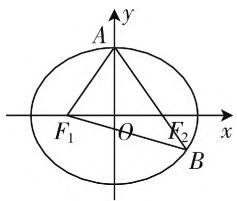
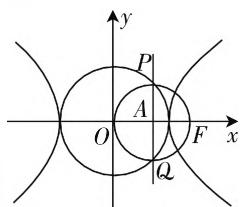
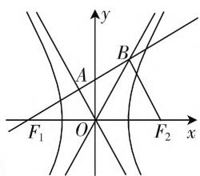

# 例谈高考圆锥曲线的几个考向

# ● 北京工业大学附属中学 杨冬梅

圆锥曲线是解析几何的核心内容,也是高考命题的核心考点之一,从数学核心素养的角度来看,该考点主要考查逻辑推理能力和数学运算能力.那么,从圆锥曲线的内容来看,高考对圆锥曲线的考查主要涉及哪些问题呢?以下作一分析!

# 一、考查圆锥曲线方程的求法

学习圆锥曲线从会求圆锥曲线的方程开始,高考对圆锥曲线的考查也是如此,此类问题往往出现在选择题或解答题的第一小问中,难度中等.主要考查圆锥曲线定义和待定系数法的应用.

例 1 已知 $F_{1}(-1,0)$ , $F_{2}(1,0)$ 是椭圆 C 的两个焦点，过 $F_{2}$ 的直线与 C 相交，交点为 A, B 两点，且满足 $\left|AF_{2}\right|=2\left|F_{2}B\right|$ , $\left|AB\right|=\left|BF_{1}\right|$ ，那么椭圆 C 的方程是（）.

分析:本题可依据椭圆的定义和余弦定理,通过解三角形来求出标准方程中的参数.

解法1:如图1,由已知可设 $|F_{2}B|=n$ ，则 $|AF_{2}|=2n$ ， $|BF_{1}|=|AB|=3n$ ，由椭圆的定义有 $2a=|BF_{1}|+|BF_{2}|=4n$ ，所以 $|AF_{1}|=2a-|AF_{2}|=2n$ .

text_image

A
y
F₁ O F₂ x
B

图1

在 $\triangle AF_{1}B$ 中，根据余弦定

理可得 $\cos \angle F_{1}AB = \frac{4n^{2} + 9n^{2} - 9n^{2}}{2\cdot 2n\cdot 3n} = \frac{1}{3}.$

在 $\triangle AF_{1}F_{2}$ 中，用余弦定理建立方程 $4n^{2} + 4n^{2} - 2\cdot 2n\cdot 2n\cdot \frac{1}{3} = 4$ ，可解得 $n = \frac{\sqrt{3}}{2}$

所以 $2a = 4n = 2\sqrt{3}$ ，所以 $a = \sqrt{3}$ ，所以 $b^{2} = a^{2} - c^{2} = 3 - 1 = 2$ ，所以椭圆 $C$ 的方程是 $\frac{x^2}{3} +\frac{y^2}{2} = 1.$

解法2:由已知可设 $|F_{2}B|=n$ ，则 $|AF_{2}|=2n$ ， $|BF_{1}|=|AF_{1}|=3n$ ，根据椭圆的定义有 $2a=|BF_{1}|+|BF_{2}|=4n$ ，所以 $|AF_{1}|=2a-|AF_{2}|=2n$ 。

在 $\triangle AF_{1}F_{2}$ 和 $\triangle BF_{1}F_{2}$ 中，由余弦定理得

$$
\left\{ \begin{array}{l} 4 n ^ {2} + 4 - 2 \cdot 2 n \cdot 2 \cdot \cos \angle A F _ {2} F _ {1} = 4 n ^ {2}, \\ n ^ {2} + 4 - 2 \cdot n \cdot 2 \cdot \cos \angle B F _ {2} F _ {1} = 9 n ^ {2}. \end{array} \right.
$$

又因为 $\angle AF_2F_1, \angle BF_2F_1$ 互补，所以 $\cos \angle AF_2F_1 + \cos \angle BF_2F_1 = 0$ ，将上面两式消去 $\cos \angle AF_2F_1$ ， $\cos \angle BF_2F_1$ ，得 $3n^2 + 6 = 11n^2$ ，于是可解得 $n = \frac{\sqrt{3}}{2}$ 所以 $2a = 4n = 2\sqrt{3}$ ，所以 $a = \sqrt{3}$ ，所以 $b^2 = a^2 - c^2 = 3 - 1 = 2$ ，所以椭圆 $C$ 的方程是 $\frac{x^2}{3} + \frac{y^2}{2} = 1.$

点评:本题重点考查利用定义法求椭圆标准方程,同时也考查了椭圆的简单性质,从解题方法层面上看,考查了数形结合思想和转化与化归思想,从命题的形式上看,它是一个与解三角形交汇的小综合题,体现了高考命题一题多考的原则.同时,该题体现了直观想象、逻辑推理等数学素养在高考命题中的落实,是一道经得起推敲的好题,这也体现了圆锥曲线中档题今后的命题趋势.

# 二、考查圆锥曲线的性质

圆锥曲线主要包括曲线的离心率, 准线和双曲线的渐近线, 以及圆锥曲线的图形的对称性, 尤其以离心率的计算问题最为常见, 一般出现在选择题或填空题中, 难度偏易或中等.

例2（1）已知 $F$ 是双曲线 $C: \frac{x^2}{a^2} - \frac{y^2}{b^2} = 1 (a > 0, b > 0)$ 的右焦点， $O$ 是坐标原点，以 $OF$ 为直径画一个圆，此圆与圆 $x^2 + y^2 = a^2$ 交于 $P, Q$ 两点。且满足 $|PQ| = |OF|$ ，那么双曲线 $C$ 的离心率的值是（ ）.

(2)(2019年高考江苏卷)平面直角坐标系 $xOy$ 中, 双曲线 $x^{2} - \frac{y^{2}}{b^{2}} = 1 (b > 0)$ 经过点(3,4), 那么此双曲线的渐近线方程为 \_\_\_\_.

解析:(1) 设 PQ 与 x 轴交于点 A, 由对称性可知 $PQ \perp x$ 轴, 又因为 $|PQ| = |OF| = c$ , 所以 $|PA| = \frac{c}{2}$ , 所以 PA 为以 OF 为直径的圆的半径, 所以$|OA|=\frac{c}{2}$ ，所以 $P\left(\frac{c}{2},\frac{c}{2}\right)$ .

又 $P$ 点在圆 $x^{2} + y^{2} = a^{2}$ 上，所以 $\frac{c^2}{4} +\frac{c^2}{4} = a^2$ ，即 $\frac{c^2}{2} =$ $a^2$ ，所以 $e^2 = \frac{c^2}{a^2} = 2.$ 所以 $e =$ $\sqrt{2}$

text_image

y
P
A
O
F x
Q

图2

(2) 由已知得 $3^{2} - \frac{4^{2}}{b^{2}} = 1$ ，解得 $b = \sqrt{2}$ 或 $b = -\sqrt{2}$ .

因为 $b > 0$ ，所以 $b = \sqrt{2}$ .因为 $a = 1$ ，所以双曲线的渐近线方程为 $y = \pm \sqrt{2} x.$

# 三、考查与平面向量或平面几何的综合

解析几何其实质是用代数的方法解决几何问题，问题的解决往往离不开几何图形的性质，而平面向量是数与形的统一，其可以与其他几乎任何知识交汇。将圆锥曲线与平面向量或平面几何交汇，一方面凸显命题的新颖性，另一方面体现了命题的综合性，这一特点在高考复习中应引起高度重视。

例3 已知 $F_{1}, F_{2}$ 分别是双曲线 $C: \frac{x^{2}}{a^{2}} - \frac{y^{2}}{b^{2}} = 1 (a > 0, b > 0)$ 的左、右两个焦点，有一条经过 $F_{1}$ 的直线，它与双曲线 $C$ 的两条渐近线相交，交点分别为 $A, B$ 两点。如果 $\overrightarrow{F_1A} = \overrightarrow{AB}, \overrightarrow{F_1B} \cdot \overrightarrow{F_2B} = 0$ ，那么该双曲线 $C$ 的离心率为 \_\_\_\_.

解析：如图3，由 $\overrightarrow{F_1A} = \overrightarrow{AB}$ ，得 $F_{1}A = AB.$ 又 $OF_{1} = OF_{2}$ ，得 $OA$ 是 $\triangle F_1F_2B$ 的中位线，即 $BF_{2} / / OA,BF_{2} = 2OA.$

由 $\overrightarrow{F_1B} \cdot \overrightarrow{F_2B} = 0$ ，得 $F_1B \perp F_2B$ ，所以 $OA \perp F_1A$ ，所以$OB = OF_{1},\angle AOB = \angle AOF_{1}$ ，又 $OA$ 与 $OB$ 都是双曲线的渐近线，所以 $\angle BOF_2 = \angle AOF_1$ ，于是 $\angle BOF_{2}+$ $\angle AOB + \angle AOF_{1} = \pi$ ，所以 $\angle BOF_{2} = \angle AOF_{1} =$ $\angle BOA = 60^{\circ}$ ，又因为渐近线 $OB$ 的斜率为 $\frac{b}{a} = \tan 60^{\circ}$ $= \sqrt{3}$ ，所以它的离心率是 $e = \frac{c}{a} = \sqrt{1 + \left(\frac{b}{a}\right)^2} =$ $\sqrt{1 + (\sqrt{3})^2} = 2.$

text_image

y
A
B
F₁ O F₂ x
x

图3

# 四、圆锥曲线的综合

对圆锥曲线的综合考查,在全国卷中出现在压轴题的位置上,主要考查和直线与圆锥曲线的位置关系有关的综合性问题,如最值问题,定值定点问题,是否存在性探究题等,体现出解析几何知识及方法与其他数学知识及方法的综合运用,考题灵活多变,计算量颇大,难度也较大.

例 4 已知抛物线 $C: x^{2} = -2py$ 经过定点 $P(2, -1)$ .

(1) 求该抛物线 C 的方程和准线方程；

(2) 设 $O$ 是坐标原点, 过该抛物线的焦点作一条不与 $x$ 轴平行的直线 $l$ , 该直线与抛物线 $C$ 相交于 $M, N$ 两点, 又直线 $y = -1$ 分别与 $OM, ON$ 交于 $A, B$ 两点, 求证: 以 $AB$ 为直径的圆必经过 $y$ 轴上的两个定点.

解析:(1) 将 $P(2, -1)$ 代入抛物线 C 的方程, 易得曲线 $C: x^{2} = -4y$ , 准线为 y = 1.

(2) 抛物线 $C$ 的焦点为 $F(0, -1)$ . 设直线 $l$ 的方程为 $y = kx - 1 (k \neq 0)$ .

由 $\left\{\begin{aligned}y=kx-1,\\ x^{2}=-4y\end{aligned}\right.$ 得 $x^{2}+4kx-4=0.$

设 $M(x_{1},y_{1}),N(x_{2},y_{2})$ ，则 $x_{1}x_{2} = -4.$

直线 $OM$ 的方程为 $y = \frac{y_1}{x_1} x$ . 令 $y = -1$ , 得点 $A$ 的横坐标 $x_A = -\frac{x_1}{y_1}$ .

同理得点 B 的横坐标 $x_{B} = -\frac{x_{2}}{y_{2}}$ .

设点 $D(0,n)$ ，则 $\overrightarrow{DA} = \left(-\frac{x_1}{y_1}, - 1 - n\right),\overrightarrow{DB} =$ $\left(-\frac{x_2}{y_2}, - 1 - n\right),\overrightarrow{DA}\cdot \overrightarrow{DB} = \frac{x_1x_2}{y_1y_2} +(n + 1)^2$

$$
= \frac {x _ {1} x _ {2}}{\left(- \frac {x _ {1} ^ {2}}{4}\right) \left(- \frac {x _ {2} ^ {2}}{4}\right)} + (n + 1) ^ {2}
$$

$$
= \frac {1 6}{x _ {1} x _ {2}} + (n + 1) ^ {2}
$$

$$
= - 4 + (n + 1) ^ {2}.
$$

令 $\overrightarrow{DA} \cdot \overrightarrow{DB} = 0$ ，即 $-4 + (n + 1)^2 = 0$ ，则 $n = 1$ 或 $n = -3$ . 故以 $AB$ 为直径的圆必经过 $y$ 轴上的定点，它们是 $(0,1)$ 和 $(0,-3)$ .

点评:本题以抛物线为背景,以直线与抛物线的位置关系为平台,考查了抛物线与圆的性质,韦达定理的综合应用,同时也是一类较为常见的定点问题,对考生的转化能力和计算求解能力有着较高的要求.不过从近几年的命题来看,这类问题的思维量依然较大,但运算量在逐年减少,体现了“多一点思考,少一点计算”的命题方向.

圆锥曲线高考考什么,怎么考,我们又该如何复习,或许以上几点分析对大家有所帮助. W