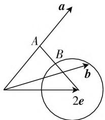

# 向量解题教学重在对语言的“翻译”

——由2021年高考浙江卷平面向量问题引发的思考

# ● 江苏省苏州中学园区校 陈园园

平面向量是沟通三角、代数、几何三大领域的桥梁，它既有数的属性，又有形的特征；既有代数运算，又有几何运算。因此，平面向量历来就是高考命题的热点。在高考中，平面向量虽然以小题的形式出现，但往往综合性较强，难度较高，历来是教学的难点、学生心中的痛点。因此，作为一线教师，我们不得不思考平面向量的解题策略。下面笔者就结合今年数学高考浙江卷第17题，谈谈对此的看法。

问题:(2021年高考浙江17)已知平面向量a,b,c(c≠0)满足 $|a|=1,|b|=2,a\cdot b=0,(a-b)\cdot c=0$ ，记平面向量d在a,b方向上的投影分别为x,y,d-a在c方向上的投影为z，则 $x^{2}+y^{2}+z^{2}$ 的最小值是\_\_\_\_.

# 一、解法分析

# (一) 几何视角

如图1, 设 $a = \overrightarrow{OA}, b = \overrightarrow{OB}, c = \overrightarrow{OC}, d = \overrightarrow{OD}$ ，则 $|\overrightarrow{OA}| = 1, |\overrightarrow{OB}| = 2, \overrightarrow{OA} \perp \overrightarrow{OB}, \overrightarrow{OC} \perp \overrightarrow{AB}$ ，过 D 分别作 OA, OB, OC, AB 的垂线，垂足分别为 G, F, H, E, OC 交 AB 于 I，则 $x = |OG| = |DF|$ ，$y = |OF| = |DG|, z = |HI| = |DE|$ ，所以 $x^{2} + y^{2} + z^{2} = |DF|^{2} + |DG|^{2} + |DE|^{2}$ . 又因为 $|DF|^{2} + |DG|^{2} = |OD|^{2}$ ，则 $x^{2} + y^{2} + z^{2} = |OD|^{2} + |DE|^{2} \geqslant \frac{(|OD| + |DE|)^{2}}{2} \geqslant \frac{|OE|^{2}}{2} = \frac{2}{5}$ ，当且仅当 $O, D$ ， $E$ 三点共线且 $OE \perp AB$ 时等号成立.

此法的关键是要把“d-a 在 c 方向上的投影为 HI”转化为“DE”，然后问题就转化为“点 D 到 $\triangle OAB$ 三条边距离平方和的最小值”.

# (二) 代数视角

设 $a = \overrightarrow{OA} = (1,0), b = \overrightarrow{OB} = (0,2), d = \overrightarrow{OD} = (x_0, y_0)$ . 易知直线 $OC$ 所在的直线方程为 $y = \frac{1}{2} x$ , 设 $c = \overrightarrow{OC} = (2t, t)$ , 则 $d - a = \overrightarrow{AD} = (x_0 - 1, y_0), z = \frac{\overrightarrow{OC} \cdot \overrightarrow{AD}}{|\overrightarrow{OC}|} = \frac{(2x_0 + y_0 - 2)t}{\sqrt{5} |t|}$ , 所以 $x^2 + y^2 + z^2 = x_0^2$

$$
+ y _ {0} ^ {2} + \frac {(2 x _ {0} + y _ {0} - 2) ^ {2}}{5}.
$$

于是，问题解决的关键是对 $x_0^2 + y_0^2 + \frac{(2x_0 + y_0 - 2)^2}{5}$ 进行科学的处理，这需要用到一些解题技巧，有以下几种方案可供参考：

方案 1: 配方.

$$
\begin{array}{l} x _ {0} ^ {2} + y _ {0} ^ {2} + \frac {(2 x _ {0} + y _ {0} - 2) ^ {2}}{5} = \frac {1}{5} (9 x _ {0} ^ {2} + 6 y _ {0} ^ {2} + 4 x _ {0} y _ {0} \\ - 8 x _ {0} - 4 y _ {0} + 4), 9 x _ {0} ^ {2} + 6 y _ {0} ^ {2} + 4 x _ {0} y _ {0} - 8 x _ {0} - 4 y _ {0} + 4 = \\ 6 y _ {0} ^ {2} + (4 x _ {0} - 4) y _ {0} + 9 x _ {0} ^ {2} - 8 x _ {0} + 4 = 6 \left(y _ {0} + \frac {x _ {0} - 1}{3}\right) ^ {2} \\ + \frac {1}{3} (5 x _ {0} - 2) ^ {2} + 2, \text {所以当且仅当} y _ {0} + \frac {x _ {0} - 1}{3} = 0, 5 x _ {0} \\ - 2 = 0 \text {时,} x ^ {2} + y ^ {2} + z ^ {2} \text {取到最小值} \frac {2}{5}. \\ \end{array}
$$

方案 2: 利用柯西不等式.

$$
\begin{array}{r l} & {\left[ x _ {0} ^ {2} + y _ {0} ^ {2} + \frac {(2 x _ {0} + y _ {0} - 2) ^ {2}}{5} \right] [ 2 ^ {2} + 1 ^ {2} + (- \sqrt {5}) ^ {2} ]} \\ & {\geqslant (2 x _ {0} + y _ {0} + 2 x _ {0} + y _ {0} - 2) ^ {2} = 4, \text {即} x ^ {2} + y ^ {2} + z ^ {2} \geqslant} \\ & {\frac {2}{5}, \text {当且仅当} x _ {0} = \frac {2}{5}, y _ {0} = \frac {1}{5} \text {时等号成立}.} \end{array}
$$

与前几年注重考查“数量积”“模”不同的是，此题考查的是学生对于“投影”概念的理解，并以此为认知的起点，考查学生综合运用知识的能力与数学运算核心素养，综合性强，立意高，入口宽，方法多是此题的特点.

# 二、向量难点分析

对于上述问题,虽然有这么多的方法可供选择,但向量问题复杂多变,常考常新,尽管经过了充分的复习与训练,但面对向量问题时,很多学生还是无从下手,那么向量的难点到底在哪?

# （一）向量运算的一般性与独特性并存

向量运算对象可以是向量与向量,比如,向量的加法与减法运算、数量积运算,也可以是向量与数量,比如,数乘运算;可以是点与点之间的运算,比如,坐标运算,也可以是符号与符号之间的运算,比如,把一个向量用其他向量表示.向量运算法则既具有一般性,比如,向量的加、减法运算与实数运算法则都满足分配律、结合律、交换律,运算法则又具有特殊性,比如,数量积运算就不满足结合律.向量运算有时是可逆的,比如,向量的加法与减法互为逆运算,但有时却不存在逆运算,比如,数量积运算就没有所谓的“除法”运算与它互为逆运算.向量运算的结果可以是向量,比如,向量的线性运算,又可以是数量,比如,数量积运算,即两个向量的“积”最后变为了数量.总而言之,向量运算有时与实数运算一致,有时又与实数运算矛盾,这种一般性与独特性并存的运算体系直接影响学生知识的迁移,从而造成认知上的困扰.

# （二）向量语言的简洁性与抽象性并存

数学语言是表达科学思想的通用语言和数学思维的最佳载体,实现有效交流的前提就是学习和掌握数学语言,而且从某种程度上讲,学习数学就是学习数学语言.向量既有代数属性,又有几何属性,因此,向量语言既可以表示代数关系,又可以表示几何性质.向量语言继承了数学语言简洁性的特点,能够用最简洁的方式表示复杂的几何关系.比如,在上述问题中,单从 $|a|=1,|b|=2$ 看,它们分别表示半径为1与2的两个圆,再结合 $a\cdot b=0$ ,就可以得到“a,b互相垂直”.又比如,在 $\triangle ABC$ 中,若 $\overrightarrow{GA}=\overrightarrow{GB}=\overrightarrow{GC}$ ,则G是 $\triangle ABC$ 的重心;若 $\overrightarrow{GA}\cdot\overrightarrow{GB}=\overrightarrow{GC}\cdot\overrightarrow{GB}=\overrightarrow{GA}\cdot\overrightarrow{GC}$ ,则G是 $\triangle ABC$ 的垂心.若 $\overrightarrow{GA}\cdot\left(\frac{\overrightarrow{AB}}{|\overrightarrow{AB}|}-\frac{\overrightarrow{AC}}{|\overrightarrow{AC}|}\right)=\overrightarrow{GB}$ . $\cdot\left(\frac{\overrightarrow{BA}}{|\overrightarrow{BA}|}-\frac{\overrightarrow{BC}}{|\overrightarrow{BC}|}\right)=\overrightarrow{GC}\cdot\left(\frac{\overrightarrow{CA}}{|\overrightarrow{CA}|}-\frac{\overrightarrow{CB}}{|\overrightarrow{CB}|}\right)=0$ ,则G是 $\triangle ABC$ 的内心.几何关系原本用自然语言表述需要洋洋洒洒数行,而用向量语言则只需寥寥几个符号串即可.数学中的简洁往往也意味着抽象,比如,对于向量关系式 $\overrightarrow{GA}\cdot\overrightarrow{GB}=\overrightarrow{GC}\cdot\overrightarrow{GB}=\overrightarrow{GA}\cdot\overrightarrow{GC}$ ,如果是第一次接触这样抽象的式子,如何知道它表示的是“垂心”呢?这就需要把上述式子进行变形,转化为熟悉的、易于理解的形式,因为 $\overrightarrow{GA}\cdot\overrightarrow{GB}-\overrightarrow{GC}\cdot\overrightarrow{GB}=0$ ,所以 $\overrightarrow{GB}\cdot(\overrightarrow{GA}-\overrightarrow{GC})=\overrightarrow{GB}\cdot\overrightarrow{CA}=0$ ,于是得到 $GB\perp CA$ ,同理也可以得到 $GA\perp CB,GC\perp BA$ ,则G是 $\triangle ABC$ 三条高线的交点,所以G是 $\triangle ABC$ 的垂心.用向量语言表述虽然简洁,但也更加抽象,有时甚至抽象得让人看不懂.

# 三、向量语言的“翻译”

向量语言的抽象难懂阻碍了学生对问题的深入理解,是导致学生无从下手的主要原因,因此让学生学会把抽象的向量语言表述“翻译”为易于理解的形式是破题的关键所在.

# （一）熟悉向量语言的基本表述

向量语言能够简洁地表述几何关系与图形轨迹，对于一些常见的、基本的表述一定要让学生掌握好.

比如, 常见的几何关系: 平行(共线) $\Leftrightarrow\overrightarrow{AB}=\lambda\overrightarrow{CD}$ ; 垂直 $\Leftrightarrow\overrightarrow{AB}\cdot\overrightarrow{CD}=0$ ; 共面 $\Leftrightarrow\overrightarrow{OB}=\lambda\overrightarrow{OA}+\mu\overrightarrow{OC}$ (若 $\lambda+\mu=1$ , 则 A, B, C 三点共线); 夹角 $\Leftrightarrow<\overrightarrow{AB},\overrightarrow{CD}>=\theta$ .

比如, 常见的曲线: $|a - b| = m (m > 0)$ , 若 $\pmb{b}$ 为定向量, 则 $\pmb{a}$ 的轨迹就是以 $\pmb{b}$ 为圆心, $m$ 为半径的圆; $|a - b| + |a + b| = m (m > 2|\pmb{b}|)$ , 若 $\pmb{b}$ 为定向量, 则 $\pmb{a}$ 的轨迹就是以 $\pmb{b}$ 与 $-\pmb{b}$ 为焦点, 长轴长为 $m$ 的椭圆.

很多复杂的几何关系,都是由这些简单的向量表述构成的,通过逐步“翻译”,就能理解其中的内涵.

例 已知 $a, b, e$ 是平面向量， $e$ 是单位向量，若非零向量 $a$ 与 $e$ 的夹角为 $\frac{\pi}{3}$ ，向量 $b$ 满足 $b^2 - 4e \cdot b + 3 = 0$ ，则 $|a - b|$ 的最小值 \_\_\_\_.

翻译: a 与 e 的夹角为 $\frac{\pi}{3} \Rightarrow \langle a, e \rangle = \frac{\pi}{3}, b^{2} - 4e \cdot b + 3 = 0 \Rightarrow |b - 2e| = 1$ (b 的轨迹是圆), 如图 2 所示.

text_image

a
A
B
b
2e

图2

显然， $\left|a-b\right|_{\min}=\sqrt{3}-1.$

# (二) 加强“双向翻译”训练

平常,我们在解向量问题时,实际上就是不断地经历把向量语言“翻译”成比较容易理解的自然语言或图形语言的过程,这是一种“兵来将挡水来土掩”的“单向翻译”,至于能否“翻译”成功,在很大程度上则取决于问题的难度.要改变这种被动的局面,则要让学生学会把自然语言或图形语言翻译成向量语言.

比如，“求圆外一点到圆上点的距离的最大值。”这是几何中最常见的一个问题，把它“翻译”成向量语言，有几种方法呢？

方法 1: 已知 a, b 是单位向量, 且 $a \cdot b = \frac{1}{2}$ , $|c - b| = \frac{1}{4}$ , 求 $|c|$ 的最大值;

方法2:已知a,b是单位向量,且 $a\cdot b=\frac{1}{2}$ , $(c-b)\cdot(c-a)=\frac{1}{4}$ ,求 $|c|$ 的最大值;

上面两种向量表述都可以表示“求圆外一点到圆上点的距离的最大值”这个几何问题，而且 $|c - b| = \frac{1}{4}, (c - b) \cdot (c - a) = \frac{1}{4}, |c - b| = \frac{1}{4} |c - a|$ ， $|c - b| = \frac{1}{4} |c - a|$ 这四个向量方程都表示“圆”.

对于 2021 高考浙江卷的第 17 题, 只要能够“翻译”正确, 接下来按照几何与代数两大视角, 要么借助图形直观, 要么通过坐标运算, 解题思路水到渠成. F