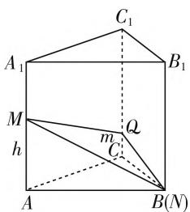
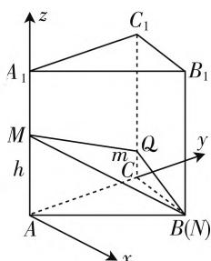
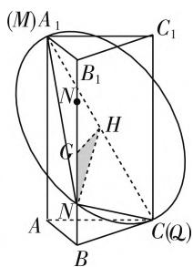

# 对一道立体几何截面题的探究

# 江苏省苏州市吴中区甪直高级中学 王晓炜

涉及立体几何的截面问题是历年高考中比较常见的热点考点之一，通过截面有效链接起立体几何中点、线、面的“动”与“静”之间的联系，考查方式多样，变化多端，问题设置新颖，创新性高，应用性强，能有效考查学生的逻辑推理能力、空间想象能力与创新意识，以及数形结合思想、函数与方程思想等，可以有效全面提升学生的思维能力和思维品质，培养学生的数学核心素养.

# 一、问题呈现

问题 已知正三棱柱 $ABC - A_{1}B_{1}C_{1}$ 的侧棱长为4，底面边长为2，用一个平面截此棱柱，与侧棱 $AA_{1},BB_{1},CC_{1}$ 分别交于点 $M,N,Q$ ，若 $\triangle MNQ$ 为直角三角形，则 $\triangle MNQ$ 面积的最大值为（ ）.

A. 3

B. $\sqrt{10}$

C. $\sqrt{17}$

D. $3\sqrt{2}$

此题以正三棱柱为问题背景,利用截面三角形的特征限制(直角三角形)来确定其面积的最大值问题.破解的关键就是将直角三角形中的垂直条件加以合理转化,或利用代数方法,或利用坐标思维,或结合图形特征,合理化归,进而结合所建立的代数关系式或立体几何图形的特征来分析与处理,从而得以求解相应的最值问题.

# 二、问题破解

# 思维角度一:代数思维

解析: 如图 1 所示, 不妨设点 N 在点 B 处,

设 $|AM|=h,\quad|CQ|=m,$ 不失一般性设 $0 < m \leqslant h \leqslant 4,$

$$
\begin{array}{r l} & {\text {则有} \mid M N \mid^ {2} = h ^ {2} + 4,} \\ & {\mid N Q \mid^ {2} = m ^ {2} + 4, \mid M Q \mid^ {2} = (h} \\ & {- m) ^ {2} + 4,} \end{array}
$$

text_image

A₁
M
h
C₁
B₁
Q
m
C₂
A
B(N)

图1

由 $|MN|^2 = |NQ|^2 + |MQ|^2$ ，整理可得 $m^2 - hm + 2 = 0$ ，则有 $h = \frac{m^2 + 2}{m} = m + \frac{2}{m}$ .

结合判别式 $\Delta = h^2 - 8 \geqslant 0$

则有 $h^2 \geqslant 8$ ，且 $h \leqslant 4$

即 $8 \leqslant h^{2} \leqslant 16$ .

而 $\triangle MNQ$ 的面积 $S = \frac{1}{2} \times |MQ| \times |NQ|$ ,

则有 $S^2 = \frac{1}{4} [(h - m)^2 + 4](m^2 + 4)$

$$
\begin{array}{l} = \frac {1}{4} \left[ \left(m + \frac {2}{m} - m\right) ^ {2} + 4 \right] (m ^ {2} + 4) \\ = 5 + \frac {4}{m ^ {2}} + m ^ {2} \\ = 5 + \left(\frac {2}{m} + m\right) ^ {2} - 4 \\ = 1 + \left(\frac {2}{m} + m\right) ^ {2} \\ = 1 + h ^ {2}, \\ \end{array}
$$

而 $8 \leqslant h^{2} \leqslant 16$

所以 $S^2 = 1 + h^2\in [9,17]$

那么 $S_{\mathrm{max}}^2 = 17$

即 $S_{\mathrm{max}} = \sqrt{17}$

此时 $h = 4, m = 2 \pm \sqrt{2}$ .

故选C.

点评:通过引入参数设出相应的边,结合正三棱柱的特征以及直角三角形的性质,找到相关边之间的等量关系式,借助三角形面积计算公式加以代数转化得到相应的关系式,利用代数关系式的特征,或直接利用二次函数的图像与性质来分析,或直接利用不等式的性质来分析,或引入函数利用导数来确定相关的单调性来分析,都可以达到确定相应的最值问题.

# 思维角度二:坐标思维

解析: 如图 2 所示, 以点 A 为坐标原点, AC, AA₁ 所在直线分别为 y 轴, z 轴建立空间直角坐标系, 不妨设点 N 在点 B 处,

设 $M(0,0,h)$ , $Q(0,2,m)$ ,
不失一般性设 $0 < m \leqslant h \leqslant 4$ .

而 $N(\sqrt{3}, 1, 0)$ ,

由 $\overrightarrow{QM} \cdot \overrightarrow{QN} = 0$ ，可得(0，

text_image

z
C₁
A₁
B₁
M
h
m
Q
C
y
A
B(N)
x

图2

$$
- 2, h - m) \cdot (\sqrt {3}, - 1, - m) = 0 \text {, 即} m (h - m) = 2,
$$

而 $\triangle MNQ$ 的面积 $S = \frac{1}{2} \times |\overrightarrow{QM}| \times |\overrightarrow{QN}|$ ,

则有 $S^2 = \frac{1}{4} [4 + (h - m)^2 ](4 + m^2)$

$$
\begin{array}{l} = \frac {1}{4} [ m ^ {2} (h - m) ^ {2} + 4 (h - m) ^ {2} + 4 m ^ {2} + 1 6 ] \\ = (h - m) ^ {2} + m ^ {2} + 5 \\ = h ^ {2} - 2 (h - m) m + 5 \\ = h ^ {2} + 1 \leqslant 1 7, \\ \end{array}
$$

那么 $S_{\mathrm{max}}^2 = 17$

即 $S_{\mathrm{max}} = \sqrt{17}$

此时 $h = 4, m = 2 \pm \sqrt{2}$ .

故选C.

点评:通过建立空间直角坐标系,设出相应的点的坐标后,结合直角三角形的性质可得 $\overrightarrow{QM}\cdot\overrightarrow{QN}=0$ ,进而得以确定 $m(h-m)=2$ ,接下来可以结合代数思维中的代数性质法、不等式法、导数法等方法处理,都可以达到求解的目的,这里只给出相应的不等式法.

# 思维角度三:几何思维

解析: 设平面 MNQ 与底面 ABC 所成的角为 $\theta, \theta \in \left(0, \frac{\pi}{2}\right)$ ,

则有 $\cos \theta = \frac{S_{\triangle ABC}}{S_{\triangle MNQ}}$

所以 $S_{\triangle MNQ}=\frac{S_{\triangle ABC}}{\cos\theta}=\frac{\sqrt{3}}{\cos\theta}$ ,

而要使得 $S_{\triangle MNQ}$ 更大, 只需要 $\cos\theta$ 更小, 即角 $\theta$ 更大即可,不失一般性设 $\angle MNQ = \frac{\pi}{2}$

text_image

(M)A₁
B₁
N
G
H
C₁
A
N
B
C(Q)

图3

由于 $\left|A_{1}B\right|^{2}+\left|BC\right|^{2}-\left|A_{1}C\right|^{2}=4>0,$ 则 $\angle A_{1}BC$ 为锐角，

则 $\triangle MNQ$ 不可能是截面 $\triangle A_{1}BC$

因此以 $A_{1}C$ 为直径的圆交 $BB_{1}$ 于点 N.

如图 3 所示, 分别取 $BB_{1}, A_{1}C$ 的中点 G, H,

连接 GH, NH,

则 $GH \perp BB_{1}$ ,

且 $|GH|=\sqrt{3}$ ， $|NH|=\frac{1}{2}|A_{1}C|=\sqrt{5}$ ，

可得 $|GN| = \sqrt{2}$

于是 $|BN| = 2 - \sqrt{2}$ 或 $|BN| = 2 + \sqrt{2}$ .

当 $|BN|=2-\sqrt{2}$ 时,可得:

$$
\mid M N \mid = \sqrt {2 ^ {2} + (2 + \sqrt {2}) ^ {2}} = \sqrt {1 0 + 4 \sqrt {2}},
$$

$$
\mid N Q \mid = \sqrt {2 ^ {2} + (2 - \sqrt {2}) ^ {2}} = \sqrt {1 0 - 4 \sqrt {2}},
$$

所以 $(S_{\triangle MNQ})_{\mathrm{max}} = \frac{1}{2}\times |MN|\times |NQ|$

$$
\begin{array}{l} = \frac {1}{2} \times \sqrt {1 0 + 4 \sqrt {2}} \times \sqrt {1 0 - 4 \sqrt {2}} \\ = \sqrt {1 7}. \\ \end{array}
$$

同理，当 $|BN| = 2 + \sqrt{2}$ 时， $(S_{\triangle MNQ})_{\max} = \sqrt{17}$ .

则 $\triangle MNQ$ 面积的最大值为 $\sqrt{17}$ .

故选C.

点评:通过立体几何思维,利用二面角的引入,结合投影将 $\triangle MNQ$ 面积的大小转化为二面角的关系式,通过分析相应的关系式,结合二面角的平面角的大小分析,数形结合,从而利用立体几何的图形特征找到满足条件的相应位置,得以求解相应的最值问题.

# 三、变式探究

变式 1: 已知正三棱柱 $ABC-A_{1}B_{1}C_{1}$ 的侧棱长为 4，底面边长为 2，用一个平面截此棱柱，与侧棱 $AA_{1}, BB_{1}, CC_{1}$ 分别交于点 M, N, Q，若 $\triangle MNQ$ 为直角三角形，则 $\triangle MNQ$ 面积的最小值为（）.

A. 3

B. $\sqrt{10}$

C. $\sqrt{17}$

D. $3 \sqrt{2}$

解析:根据以上问题的破解中的方法一,

则有 $S^2 = 1 + h^2$ ，而 $8\leqslant h^2\leqslant 16$

所以 $S^2 = 1 + h^2\in [9,17]$

那么 $S_{\min}^{2} = 9$ ，即 $S_{\min} = 3$

此时 $h = 2\sqrt{2}, m = \sqrt{2}$ .

故选A.

# 四、规律总结

涉及立体几何的截面面积的最值问题, 是各级各类考试中比较常见的一类热点题型, 一般的破解策略就是将截面几何图形的面积转化为相关边或角的函数关系式, 再从代数思维角度进行分析, 或通过基本初等函数的图像与性质、不等式性质以及导数思维等处理; 也可以通过建立空间直角坐标系, 结合坐标思维分析与处理, 同样可以将截面几何图形的面积转化为相关边或角的函数关系式, 也能得以解决; 还可以分析空间立体几何图形的特征, 结合逻辑推理以及数形结合来分析截面几何图形的特征, 确定相关面积达到最值时所对应的位置, 然后利用边、角关系分析与求解. 无论哪种思维方式, 都可以有效破解相关问题, 在具体的不同问题中, 可以采用不同的方法分析与处理. F