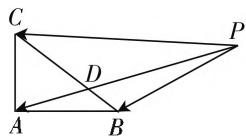
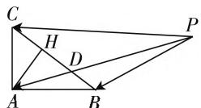

# 巧妙思维切入,分类讨论应用

# ● 江苏省宝应中学 刘智

高考数学命题主要以数学知识为载体, 以能力立意、思想方法为灵魂, 以数学核心素养为统领, 兼顾数学的基础性、综合性、应用性和创新性, 充分展现数学的科学价值和人文价值, 重点着眼于数学知识点新颖巧妙的组合以及对数学思想方法、数学能力的考查等. 其中, 分类讨论思想是高考数学中常用到的思想方法之一, 当问题的对象不能进行统一分析或研究时, 需对分析或研究的对象按某个标准进行合理分类, 然后对每一类分别研究, 给出每一类的结论, 最终综合各类结果得到整个问题的解答, 从而得以分析与破解.

# 一、由数学概念、公式、定理或法则、性质等引起的分类讨论

根据数学概念、公式、定理或法则、性质等本质对研究对象进行合理分类整合，如绝对值的定义、不等式的转化、等比数列 $\{a_{n}\}$ 的前n项和公式等，合理结合研究对象对每类问题进行分类与解决.

例 1 （2020 年高考数学北京卷第 9 题）已知 $\alpha, \beta \in R$ ，则“存在 $k \in Z$ ，使得 $\alpha = k\pi + (-1)^{k}\beta$ ”是“ $\sin\alpha = \sin\beta$ ”的（）.

A. 充分不必要条件

B. 必要而不充分条件

C. 充分必要条件

D. 既不充分也不必要条件

分析:根据充分条件、必要条件的定义,结合三角函数的概念与性质,以及诱导公式加以分类讨论,从不同角度确定命题的充分性与必要性,从而判断命题间的相应关系,得以正确分析与判断.

解析:(1)当存在 $k\in Z$ ,使得 $\alpha=k\pi+(-1)^{k}\beta$ 时,

若 $k$ 为偶数，则 $\sin \alpha = \sin (k\pi +\beta) = \sin \beta ;$

若 $k$ 为奇数，则 $\sin \alpha = \sin (k\pi -\beta) = \sin [(k - 1)\pi +(\pi -\beta)] = \sin (\pi -\beta) = \sin \beta .$

(2) 当 $\sin \alpha = \sin \beta$ 时, 可得 $\alpha = \beta + 2n\pi$ 或 $\alpha + \beta = \pi + 2n\pi, n \in \mathbf{Z}$ , 即 $\alpha = k\pi + (-1)^k\beta (k = 2n)$ 或 $\alpha = k\pi + (-1)^k\beta (k = 2n + 1)$ , 亦即存在 $k \in \mathbf{Z}$ , 使得 $\alpha = k\pi + (-1)^k\beta$ .

所以“存在 $k \in \mathbf{Z}$ , 使得 $\alpha = k\pi + (-1)^k\beta$ ”是“ $\sin \alpha = \sin \beta$ ”的充分必要条件.

故选择答案:C.

点评: 涉及数学概念、公式、定理或法则、性质等相关问题时, 要合理结合研究对象进行分类讨论. 特别是, 在解决一些创新问题时, 解题时应准确把握数学创新概念的本质, 根据需要对所有不同的情形进行合理的分类讨论.

# 二、由数学运算结果等引起的分类讨论

根据数学运算所产生的不同结果对研究对象进行合理分类整合,如三角函数求值、方程的解等,合理结合研究对象对每类问题进行分类与解决.

例2（2020年高考数学全国卷Ⅱ理科第5题，文科第8题）若过点(2,1)的圆与两坐标轴都相切，则圆心到直线 $2x - y - 3 = 0$ 的距离为（ ）.

A. $\frac{\sqrt{5}}{5}$

B. $\frac{2\sqrt{5}}{5}$

C. $\frac{3\sqrt{5}}{5}$

D. $\frac{4\sqrt{5}}{5}$

分析:由题意可知圆心在第一象限,设圆心的坐标为 $(a,a)$ ,a>0,可得圆的半径为a,写出圆的标准方程,利用点在圆上建立方程,进而确定实数a的值,通过分类讨论,结合运算的不同结果,利用点到直线的距离公式可求出圆心到直线的距离.

解析:由于圆上的点(2,1)在第一象限,若圆心不在第一象限,则圆至少与一条坐标轴相交,不合乎题意,所以圆心必在第一象限,设圆心的坐标为 $(a,a)$ ,a>0,则圆的半径为a,圆的标准方程为 $(x-a)^{2}+(y-a)^{2}=a^{2}$ ,由题意可得 $(2-a)^{2}+(1-a)^{2}=a^{2}$ ,可得 $a^{2}-6a+5=0$ ,解得a=1或a=5,所以圆心的坐标为(1,1)或(5,5).

当 a=1 时，圆心 $(1,1)$ 到直线 2x-y-3=0 的距离为 $d_{1}=\frac{|2\times1-1-3|}{\sqrt{5}}=\frac{2\sqrt{5}}{5}$ ;

当 $a = 5$ 时，圆心(5,5)到直线 $2x - y - 3 = 0$ 的距离为 $d_{2} = \frac{|2\times 5 - 5 - 3|}{\sqrt{5}} = \frac{2\sqrt{5}}{5}$

综上所述,圆心到直线 2x - y - 3 = 0 的距离为 $\frac{2\sqrt{5}}{5}$ .

故选择答案:B.

点评:根据方程的求解得到两个不同的实数解,通过分类讨论,借助点到直线的距离公式,确定在不同实数解的运算结果下对应的距离问题,很好地考查数学运算能力、分类讨论思想等.

# 三、由图形位置或形状引起的分类讨论

根据图形位置或形状所产生的不确定性对研究对象进行合理分类整合,如平面几何图形的不确定性形状、空间几何图形中点线面的位置关系、解析几何中直线与圆锥曲线的位置关系等,合理结合研究对象对每类问题进行分类与解决.

例 3 （2020 年高考数学江苏卷第 13 题）在 $\triangle ABC$ 中，AB=4, AC=3, $\angle BAC=90^{\circ}$ , D 在边 BC上，延长AD到P，使得AP=9，
若 $\overrightarrow{PA}=m\overrightarrow{PB}+\left(\frac{3}{2}-m\right)\cdot\overrightarrow{PC}(m$ 为常数)，则CD的长度是\_\_\_\_.

  
图1

分析:根据条件,结合平面向量的线性关系引入参数,结合三点共线模型的构造来确定对应的参数值,进而确定相应的线段长度,结合辅助线的构造,利用三角函数的定义加以转化,结合平面几何中点的位置关系加以分类讨论,通过解直角三角形来确定对应的长度问题.

解析: 由于 A, D, P 三点共线, 可设 $\overrightarrow{PA} = \lambda \overrightarrow{PD} (\lambda > 0)$ , 结合 $\overrightarrow{PA} = m \overrightarrow{PB} + \left( \frac{3}{2} - m \right) \overrightarrow{PC}$ , 可得 $\lambda \overrightarrow{PD} =$

  
图 2

$m\overrightarrow{PB}+\left(\frac{3}{2}-m\right)\overrightarrow{PC}$ ，即 $\overrightarrow{PD}=\frac{m}{\lambda}\overrightarrow{PB}+\frac{\frac{3}{2}-m}{\lambda}\overrightarrow{PC}$ ，结合B,D,C三点共线，可得 $\frac{m}{\lambda}+\frac{\frac{3}{2}-m}{\lambda}=1$ ，即 $\lambda=\frac{3}{2}$ ，由于AP=9，可得AD=3，而在 $\triangle ABC$ 中，AB=4，AC=3， $\angle BAC=90^{\circ}$ ，可得BC=5，过点A作AH⊥CD，垂足为H，利用三角函数的定义可得 $\cos\angle ACB=\frac{3}{5}$ ，由于AD=AC=3，若点D与点C重合，可得CD=0；若点D与点C不重合，可得CD=2CH=2AC $\cos\angle ACB=\frac{18}{5}$ .

综上分析,可得 CD 的长度是 0 或 $\frac{18}{5}$ .

故填答案:0 或 $\frac{18}{5}$ .

点评:根据平面几何中点线之间的位置关系加以分类讨论,直观简捷,操作方便.其实,在解决圆锥曲线的形状、焦点位置不确定时,立体几何中点、线、面的位置变化情况,以及三角形和平行四边形的不确定性等情况时都要进行合理的分类讨论.

# 四、由参数变化引起的分类讨论

根据参数变化所得到的不同结果对研究对象进行合理分类整合,如含参数的方程、不等式、函数、含参数的数列等,合理结合研究对象对每类问题进行分类与解决.

例 4 （2020 年高考数学新高考卷 I（山东卷）、新高考卷 II（海南卷）第 8 题）若定义在 R 上的奇函数 $f(x)$ 在 $(-∞,0)$ 上单调递减，且 $f(2)=0$ ，则满足 $xf(x-1)≥0$ 的 x 的取值范围是（）.

$$
[ - 1, 1 ] \cup [ 3, + \infty)
$$

$$
[ - 3, - 1 ] \cup [ 0, 1 ]
$$

$$
\mathrm{C.} [ - 1, 0 ] \cup [ 1, + \infty)
$$

$$
\mathrm{D.} [ - 1, 0 ] \cup [ 1, 3 ]
$$

分析:根据题目条件确定函数 $f(x)$ 在对应区间上的单调性以及零点,通过分类讨论,结合单调性的性质来确定函数值正负情况下的自变量的取值情况,利用抽象不等式的转化,通过分类讨论以及不等式组的建立来转化与求解,得以求解抽象不等式.

解析: 根据条件, 定义在 R 的奇函数 $f(x)$ 在 $(-∞,0)$ 上单调递减, 且 $f(2)=0$ , 可知函数 $f(x)$ 在 $(0,+∞)$ 上也是单调递减, 且 $f(-2)=0, f(0)=0$ ,

所以当 $x \in (-\infty, -2) \cup (0, 2)$ 时， $f(x) > 0$ ；当 $x \in (-2, 0) \cup (2, +\infty)$ 时， $f(x) < 0$ ，所以由 $xf(x - 1) \geqslant 0$ ，可得 $\left\{ \begin{array}{l} x < 0, \\ -2 \leqslant x - 1 \leqslant 0 \text{ 或 } x - 1 \geqslant 2, \end{array} \right.$ 或 $\left\{ \begin{array}{l} x > 0, \\ 0 \leqslant x - 1 \leqslant 2 \text{ 或 } x - 1 \leqslant -2 \text{ 或 } x = 0, \end{array} \right.$ 解得 $-1 \leqslant x \leqslant 0$ 或 $1 \leqslant x \leqslant 3$ ，所以满足 $xf(x - 1) \geqslant 0$ 的 $x$ 的取值范围是 $[-1, 0] \cup [1, 3]$ .

故选择答案:D.

点评:根据抽象函数的基本性质,借助自变量的分类讨论,双剑合璧,密切联合,综合应用.根据参数对题目结果的影响以及相关参数的意义进行合理的分类讨论是破解问题的关键.

分类讨论思想实质上就是“化整为零，各个击破，再集零为整”的数学思想与策略，合理凸现关键能力和学科素养。因而在平时数学教学过程中，重在领会、运用，合理归纳总结，提炼数学思想，创新运用，熟练掌握，实现对数学问题的认识、处理和解决，有效提升思维品质、培养关键能力、发展数学核心素养。W