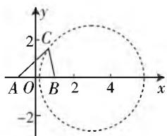

# 巧思维,妙方法

—— 一道解三角形最值题的精彩解法

# ● 安徽省桐城中学 王思思

解三角形问题一直是高考中一类比较常见的题型,而涉及解三角形中的最值问题,更是考查的热点与重点之一.此类涉及解三角形中的最值问题,背景多变,创新新颖,但其实质是以解三角形为背景,以最值的求解为目的,因而破解的思维往往离不开三角函数思维、解三角形思维、解析几何思维、平面几何思维以及导数思维等这些比较常规的基本方法与策略,借助三角形的相关性质、解三角形的相关公式以及最值的相关工具来综合分析与处理.

# 一、问题呈现

问题: (2020 年江苏省高考数学全真模拟试卷 (五) (南通教研室) · 14) 在 $\triangle ABC$ 中, 已知 $\sin B = \sqrt{2} \sin A$ , 则 $\frac{\sin A}{\sqrt{2} \cos A + \cos B}$ 的最大值是 \_\_\_\_.

此题是一道以解三角形为背景的三角最值问题，条件简单明了，内涵丰富创新，切入思维较宽，破解视角多样，问题难度适中。下面结合比较常见的四种思维视角：三角函数思维、解三角形思维、解析几何思维与导数思维等进行合理切入，结合相关的技巧方法加以处理。无论哪一种思维与方法，只要掌握正确的算理和合适的算法，结合相关的公式，有比较明确的转化方向和坚韧的信心，问题就能得以顺利破解。

# 二、问题破解

思维视角一:三角函数思维

解法 1: (三角恒等变换法) 由 $\sin B = \sqrt{2} \sin A$ ,

$$
\begin{array}{l} \text {可得} \frac {\sin A}{\sqrt {2} \cos A + \cos B} = \frac {\sin^ {2} A}{\sqrt {2} \sin A \cos A + \sin A \cos B} \\ = \frac {\sin^ {2} A}{\sin B \cos A + \sin A \cos B} = \frac {\sin^ {2} A}{\sin (A + B)} = \frac {\sin^ {2} A}{\sin C}. \\ \end{array}
$$

而由 $\sin B = \sqrt{2}\sin A$ ，可得 $\sin^2 B = 2\sin^2 A$

则有 $\sin^2 A = \sin^2 B - \sin^2 A = \sin (B + A)\sin (B - A) = \sin C\sin (B - A),$

所以 $\frac{\sin A}{\sqrt{2}\cos A + \cos B} = \frac{\sin^2A}{\sin C} = \frac{\sin C\sin(B - A)}{\sin C}$ $= \sin (B - A)\leqslant 1,$

当且仅当 $B - A = \frac{\pi}{2}$ 时等号成立，

因此 $\frac{\sin A}{\sqrt{2}\cos A + \cos B}$ 的最大值是1.

故填答案:1.

点评:根据条件对分式中的分子、分母同乘 $\sin A$ ，结合三角关系式的转化以及三角恒等变换公式的应用，利用条件中的三角关系式进行平方处理，并利用三角函数中的正弦平方差公式加以转化，从而得以化简相应的三角关系式，通过变形与转化，再利用正弦函数的有界性来确定最值问题。

思维视角二: 解三角形思维

解法 2: (解三角形法) 由 $\sin B = \sqrt{2} \sin A$ ,

$$
\begin{array}{l} \text {可得} \frac {\sin A}{\sqrt {2} \cos A + \cos B} = \frac {\sin^ {2} A}{\sqrt {2} \sin A \cos A + \sin A \cos B} \\ = \frac {\sin^ {2} A}{\sin B \cos A + \sin A \cos B} = \frac {\sin^ {2} A}{\sin (A + B)} = \frac {\sin^ {2} A}{\sin C}, \\ \end{array}
$$

而由 $\sin B=\sqrt{2}\sin A$ ，结合正弦定理可得 $b=\sqrt{2}a$ 。又由余弦定理得 $c^{2}=a^{2}+b^{2}-2ab\cos C$ ，

$$
\begin{array}{r l} & {\text {所以} \frac {\sin A}{\sqrt {2} \cos A + \cos B} = \frac {\sin^ {2} A}{\sin C} = \frac {\sin^ {2} A \sin C}{\sin^ {2} C} =} \\ & {\frac {a ^ {2} \sin C}{c ^ {2}} = \frac {a ^ {2} \sin C}{a ^ {2} + b ^ {2} - 2 a b \cos C} = \frac {\sin C}{3 - 2 \sqrt {2} \cos C}.} \end{array}
$$

而 $\sin C + 2\sqrt{2}\cos C = 3\sin (C + \varphi)\leqslant 3,$

其中 $\tan \varphi = 2\sqrt{2}$ ，则有 $3 - 2\sqrt{2}\cos C\geqslant \sin C$

可得 $\frac{\sin A}{\sqrt{2}\cos A + \cos B} = \frac{\sin C}{3 - 2\sqrt{2}\cos C} \leqslant \frac{\sin C}{\sin C} =$

1, 即 $\frac{\sin A}{\sqrt{2}\cos A + \cos B}$ 的最大值是 1.

故填答案:1.

点评:根据条件对分式中的分子、分母同乘 $\sin A$ ,结合关系式的转化以及三角恒等变换,再通过正弦定理与余弦定理的应用,结合三角恒等变换中的辅助角公式的应用,利用正弦函数的有界性来确定不等式,再利用不等式的性质来确定最值问题.

# 思维视角三:解析几何思维

解法3:(坐标法)由 $\sin B=\sqrt{2}\sin A$ ,结合正弦定理可得 $b=\sqrt{2}a$ ,不妨设c=2,以AB的中点O为坐标原点,AB所在直线为x轴建立平面直角坐标系.

设 $C(x,y)$ ，由 $b^{2} = 2a^{2}$ 可得 $(x + 1)^{2} + y^{2} = 2[(x - 1)^{2} +$ $y^{2}]$ ，整理有 $(x-3)^{2}+y^{2}=8(y\neq0)$ ,

即为点 C 的轨迹方程, 可得 $y^{2} \leqslant 8$ .

而 $\sin A = \frac{y}{\sqrt{(x + 1)^2 + y^2}},\cos A = \frac{x + 1}{\sqrt{(x + 1)^2 + y^2}},$ $\cos B = \frac{1 - x}{\sqrt{(x - 1)^2 + y^2}},$

又 $b = \sqrt{2} a$

可得 $\sqrt{(x + 1)^2 + y^2} = \sqrt{2}\cdot \sqrt{(x - 1)^2 + y^2}.$

代入并整理可得 $\frac{\sin A}{\sqrt{2}\cos A + \cos B} =$

$$
\frac {\frac {y}{\sqrt {(x + 1) ^ {2} + y ^ {2}}}}{\sqrt {2} \cdot \frac {x + 1}{\sqrt {(x + 1) ^ {2} + y ^ {2}}} + \frac {1 - x}{\sqrt {(x - 1) ^ {2} + y ^ {2}}}} = \frac {y}{2 \sqrt {2}} \leqslant 1,
$$

当且仅当 $C(3,2\sqrt{2})$ ，即 $\sin A = \frac{\sqrt{3}}{3},\cos A = \frac{\sqrt{6}}{3},\cos B$ $= -\frac{\sqrt{3}}{3}$ 时等号成立，

因此 $\frac{\sin A}{\sqrt{2}\cos A + \cos B}$ 的最大值是1.

故填答案:1.

点评:根据条件合理设置,从而构造相应的平面直角坐标系,利用条件并借助正弦定理的转化,结合两点间的距离公式的应用与转化来确定点C所对应“隐圆”的轨迹方程,利用三角函数的定义来确定对应的三角函数值,利用代数关系式的运算与转化,数形结合来确定最值问题.

# 思维视角四:导数思维

解法 4: (导数法) 由 $\sin B = \sqrt{2} \sin A \leqslant 1$ ,

可知 $b = \sqrt{2} a$ 且 $A\in \left(0,\frac{\pi}{4}\right]$

text_image

y
2 C
A O B 2 4 x
-2

图1

又由 $\sin B = \sqrt{2}\sin A$ ，可得 $\sin A = \frac{\sin B}{\sqrt{2}},\cos A =$ $\sqrt{1 - \sin^2A} = \sqrt{1 - \frac{\sin^2B}{2}}$

所以 $\frac{\sin A}{\sqrt{2}\cos A + \cos B} = \frac{\frac{\sin B}{\sqrt{2}}}{\sqrt{2 - \sin^2B} + \cos B} = \frac{\frac{\sqrt{2}}{2}\sin B}{\sqrt{2\cos^2B + \sin^2B} + \cos B} = \frac{\frac{\sqrt{2}}{2}}{\sqrt{\frac{2}{\tan^2B} + 1} + \frac{1}{\tan B}}.$

令 $t = \frac{1}{\tan B}$ ，则 $f(t) = \sqrt{2t^2 + 1} + t$ ，求导可得 $f^{\prime}(t) = \frac{2t}{\sqrt{2t^{2} + 1}} +1.$

由 $f^{\prime}(t) = 0$ ，解得 $t = -\frac{\sqrt{2}}{2}$ ，结合函数的单调性可知 $f(t)_{\min} = f\left(-\frac{\sqrt{2}}{2}\right) = \frac{\sqrt{2}}{2},$

可得 $\frac{\sin A}{\sqrt{2}\cos A + \cos B} = \frac{\frac{\sqrt{2}}{2}}{\sqrt{\frac{2}{\tan^2B} + 1} + \frac{1}{\tan B}} \leqslant$ $\frac{\frac{\sqrt{2}}{2}}{\frac{\sqrt{2}}{2}} = 1$ ，即 $\frac{\sin A}{\sqrt{2}\cos A + \cos B}$ 的最大值是1.

故填答案:1.

点评:根据条件中的三角关系式加以应用,把所求的三角关系式都转化为涉及角 B 的关系式,进而利用条件结合三角函数的相关知识以及对应的公式加以合理转化,进而合理引入参数,构造与之相应的函数关系式,通过求导以及导数零点的求解来确定相应的最小值,从而得以确定相应的最值问题.

# 三、解后反思

在解决解三角形中的最值问题时,经常借助三角函数思维、解三角形思维、解析几何思维与导数思维等几种常规的思维方式合理切入,并能有效“串联”起三角形、解三角形、函数与方程、三角函数、平面几何、解析几何、不等式、平面向量、导数等相关知识,通过数学知识的交汇与融合,融会贯通基本的数学知识与方法,有效培养良好的数学思维品质,提升解题能力,拓展数学应用,真正达到“在解中学”“在学中会”“在会中悟”“在悟中不断提升”的思维习惯,以不变应万变,提升解题思维与解题能力,培养核心素养. W