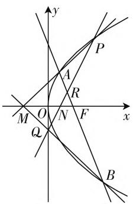
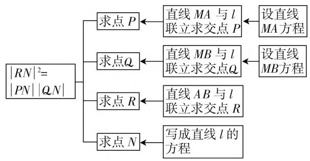
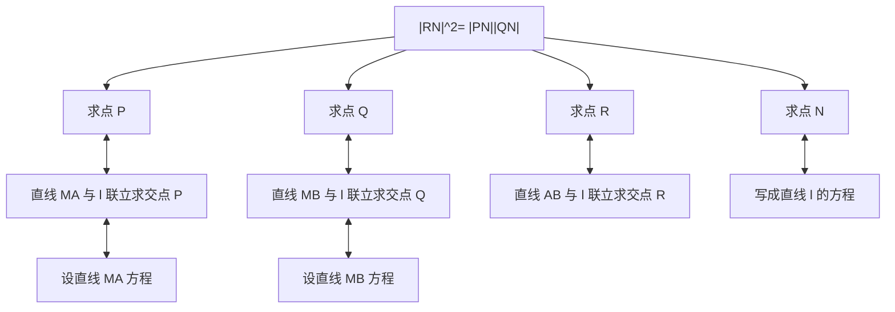

# 淡化技巧,重视通法

——由 2021 年高考浙江卷第 21 题引发的解题教学思考

# ● 江苏省苏州实验中学 严保静

今年的高考刚刚落下帷幕,专家对于本次的浙江数学高考卷的总体评价是“稳中有变,守正出新”,主要表现为总体平稳,难度控制合理、关注基础,注重通性通法、守正出新,导向核心素养.对此,笔者也感同身受,尤其是第21题圆锥曲线综合题,既考查数学运算素养,又凸显了解析几何的基本思想.这道题的答题情况,结果很不乐观.

问题:如图1,已知F是抛物线 $y^{2}=2px(p>0)$ 的焦点,M是抛物线的准线与x轴的交点,且 $|MF|=2$ .

(1) 求抛物线的方程；  
(2) 设过点 F 的直线交抛物线于 A、B 两点，斜率为 2 的直线 l 分别与直线 MA, MB, AB, x 轴交于点 P, Q, R, N，且 $\left|RN\right|^{2} = \left|PN\right| \cdot \left|QN\right|$ ，求直线 l 在 x 轴上截距的取值范围.

# 一、问题解析

虽然最近一直在复习圆锥曲线,但对于第(2)问,通过网上调查,有76.8%的学生感到无处下手,仅有12.7%的学生能够列出几个基本的代数式,比如,直线AB的方程、特征方程、韦达定理等,但都没有涉及问题的核心.笔者也尝试做了一遍,除了运算比较烦琐外,并没有涉及高深的解题技巧.

方法一：设直线 $AB$ 为 $x = ty + 1\left(t \neq \frac{1}{2}\right)$ ， $A(x_{1}, y_{1}), B(x_{2}, y_{2}), N(n, 0)$ .

由 $\left\{\begin{aligned}x&=ty+1,\\ y^{2}&=4x\end{aligned}\right.\Rightarrow y^{2}-4ty-4=0\Rightarrow\left\{\begin{aligned}y_{1}&+y_{2}=4t,\\ y_{1}y_{2}&=-4.\end{aligned}\right.$

设直线 $l: x = \frac{y}{2} + n (n \neq 1)$ .

text_image

y
P
A
R
M O N F x
Q
B

图1

因为 $|RN|^{2}=|PN|\cdot|QN|$ ,

则 $\left(\sqrt{1 + \frac{1}{4}}\mid y_R\mid\right)^2 = \sqrt{1 + \frac{1}{4}}\mid y_P\mid$

$$
\sqrt {1 + \frac {1}{4}} \left| y _ {Q} \right|,
$$

即 $|y_R|^2 = |y_P|\cdot |y_Q|$

直线 $MA:y = \frac{y_1}{x_1 + 1} (x + 1),$

则 $\left\{\begin{aligned}y&=\frac{y_{1}}{x_{1}+1}(x+1),\\ x&=\frac{y}{2}+n\end{aligned}\right.\Rightarrow y_{P}=\frac{2(n+1)y_{1}}{2x_{1}+2-y_{1}}.$

同理可得 $y_{Q}=\frac{2(n+1)y_{2}}{2x_{2}+2-y_{2}};\left\{\begin{aligned}x&=ty+1,\\ x&=\frac{y}{2}+n\end{aligned}\right.\Rightarrow y_{R}=$ $=\frac{2(n-1)}{2t-1}.$

所以 $\frac{4(n - 1)^2}{(2t - 1)^2} = \frac{2(n + 1)y_1}{2x_1 + 2 - y_1}\cdot \frac{2(n + 1)y_2}{2x_2 + 2 - y_2},$

化简得：

$$
\begin{array}{l} \frac {(n - 1) ^ {2}}{(n + 1) ^ {2}} = \frac {y _ {1} y _ {2} (2 t - 1) ^ {2}}{(2 x _ {1} + 2 - y _ {1}) (2 x _ {2} + 2 - y _ {2})} \\ = \frac {4 (2 t - 1) ^ {2}}{\left(\frac {y _ {1} ^ {2}}{2} + 2 - y _ {1}\right) \left(\frac {y _ {2} ^ {2}}{2} + 2 - y _ {2}\right)} = \frac {(2 t - 1) ^ {2}}{3 + 4 t ^ {2}}. \\ \end{array}
$$

令 2t-1=m，

则 $\frac{(2t - 1)^2}{3 + 4t^2} = \frac{m^2}{m^2 + 2m + 4} = \frac{1}{1 + \frac{2}{m} + \frac{4}{m^2}}$

$$
= \frac {1}{\left(\frac {2}{m} + \frac {1}{2}\right) ^ {2} + \frac {3}{4}} \leqslant \frac {4}{3},
$$

即 $\frac{(n - 1)^2}{(n + 1)^2} \leqslant \frac{4}{3}$ ,

解得 $n \in (-\infty, -7 - 4\sqrt{3}] \cup [7 - 4\sqrt{3}, 1) \cup (1,$

$$
+ \infty).
$$

此题的解题思路非常直接, 就是从结论入手, 把 $\left|RN\right|^{2}=\left|PN\right|\cdot\left|QN\right|$ 用代数式表示出来, 把所需要的参数设出来, 然后再消参、化简, 转化为求函数的值域问题即可, 具体解题思路如图 2 所示.

flowchart

图2

不难发现,与往年的圆锥曲线题目相比,今年解题思路虽然比较直接,但需要联立的方程比较多,不仅经历3次直线方程之间的联立,还要进行一次直线与抛物线方程之间的联立,涉及的参数也比较多,运算量无形中被放大了,这也是造成学生无从下手的一个重要原因.当然,上述解法还可以优化,适当地减少一些参数.

方法二: 注意到 $\tan\angle AMF=\frac{y_{1}}{x_{1}+\frac{p}{2}}=\frac{y_{1}}{|AF|}$

$$
\begin{array}{l} = \sin \angle B F M, \tan \angle B M F = \frac {y _ {2}}{x _ {2} + \frac {p}{2}} = \frac {y _ {2}}{| B F |} \\ = \sin \angle B F M, \\ \end{array}
$$

所以 $\angle AMF = \angle BMF.$

设 $\angle AMF = \alpha, \angle BFM = \beta (\tan \alpha = \sin \beta)$ ,

则可以设 $MA: x = y \cot \alpha - 1$

$$
M B: x = - y \cot \alpha - 1,
$$

$$
A B: x = y \cot \beta + 1,
$$

$$
P Q: x = \frac {y}{2} + n (n \neq 1),
$$

联立方程得 $y_{P}=\frac{2(n+1)}{2\cot\alpha-1},y_{Q}=\frac{2(n+1)}{-2\cot\alpha-1},y_{R}=\frac{2(n-1)}{2\cot\beta-1},$

所以 $\frac{2(n + 1)}{2\cot\alpha - 1} \cdot \frac{2(n + 1)}{-2\cot\alpha - 1} = \frac{4(n - 1)^2}{(2\cot\beta - 1)^2}$ ,

化简得 $\left(\frac{n + 1}{n - 1}\right)^2 = \frac{(2\cos\beta - \sin\beta)^2}{4 - \sin^2\beta}$

$$
= 3 - 4 \frac {\sin 2 \beta + 4}{\cos 2 \beta + 7}.
$$

令 $t = \frac{\sin 2\beta + 4}{\cos 2\beta + 7}$ ,

则 $t\cos 2\beta - \sin 2\beta = 4 - 7t \Rightarrow \sqrt{t^2 + 1} \geqslant 4 - 7t$

即 $\frac{5}{12} \leqslant t \leqslant \frac{3}{4}$ ,

所以 $n \in (-\infty, -7 - 4\sqrt{3}] \cup [7 - 4\sqrt{3}, 1) \cup (1, +\infty)$ .

方法二以直线的倾斜角为参数,把问题中的所有几何关系都用两个倾斜角表示,相对于方法一参数数量明显减少,解题的指向更加明确,但这两种方法的总体思路是一致的,在运算量上,两种方法差别也不大.

# 二、解题教学过于追求技巧的现状分析

综上可知,此题的解答并不需要多高深的解题技巧,也没有涉及一些所谓的“二级结论”,但为什么学生会感到“无从下手”呢?根源在于在平时的数学解题教学中,很多教师把教学的重心放在对解题技巧的获得上,过于强调“巧法”“妙法”,而对基本的解题思路重视不足,主要体现在以下两方面.

# 1. 拿来主义盛行

在当今互联网盛行的时代,没有什么数学解题技巧与方法,是用手机“扫一扫”“搜一搜”解决不了的,解题方法的获取比以往任何时候都来得便利.通常是前脚考试刚结束,后脚马上能够在网上找到现成的试题卷,马上会有人对试卷中的每道题进行细致解答,而且还是“一题多解”,还会有解题技巧的归纳.因此,教师根本不用自己耗时耗力去整理题目,研究解法,网上的东西都是现成的,拿来就行.由于缺少辨别的能力与耐心,面对眼花缭乱的各种解题技巧与套路,“拿来主义”变成了很多老师的不二选择,于是各种怪题、偏题、难题充斥着解题教学的课堂.不论方法的难易程度,也不管学生能否掌握,凡是自己认为好的“方法”就给学生讲,比如,“阿基米德三角形的11大性质”“阿波罗尼斯圆的应用”“椭圆的垂径定理”等.不可否认这些结论在解题中的价值,但我们知道,数学解题能力的提升不能寄希望于教师的灌输、纯粹的记忆与模仿,而是要立足学生的已有解题经验,触发对数学思维认知结构的意义建构,而无视学生的学情的“拿来主义”无法开启学生思维之门.

# 2. 教学专题泛滥

一般高三数学都采用专题化复习的方式，即把教学内容以专题的形式串联起来，然后集中火力，攻克难点，突破思维瓶颈。第一轮复习，往往采用的是大专题的形式，追求的是复习的广度与宽度，把各个知识点一网打尽，尽量做到不留死角；第二轮复习，往往采用微专题的形式，主要查漏补缺，突破重点、难点问题。除了常规的一些教学专题，很多学校和教师还设计一些个性化的专题，以满足学生的实际需求，但专题设计却呈现泛滥的趋势。一些专题是“可有可无”的存在，比如，“非对称韦达定理在圆锥曲线中的应用”专题，主要研究如何把 $\frac{x_{1}}{x_{2}}, x_{1} + 3x_{2}, \frac{x_{1}x_{2} - x_{1}}{x_{1}x_{2} - 2x_{2}}$ 等非对称的结构“凑配”成对称结构，然后用韦达定理替换。实际上，直接用求根公式表示比“凑配”更加简洁明了。还有一些专题是系统工程，不适合作为“专题”，比如，“圆锥曲线中同构思想”专题，“同构”是一种数学思想，不仅体现在圆锥曲线中，而且广泛存在于数学中，“同构”思想应该渗透在平时的教学中，不合适单独作为一个专题拎出来。专题泛滥的一个严重后果就是容易把“雕虫小技”当作“解题大略”、把“旁门左道”当作“不二法门”，使得解题教学背离初衷，被异化为“技能表演”“杂技比拼”。

# 三、解题教学要注重“通法”

解题教学不宜把追求“技巧”放在第一位，“技巧”可以锦上添花，但前提是必须要有“锦”，那添上的花才会好看，如果是块“破布头”，强行“添花”只能适得其反。因此，解题教学一定要注重通性通法。

# 1. 巩固已有的通性通法

通性通法之所以称为通性通法是因为它常常从基本概念、原理出发，以基础知识为依托、以基本方法为技能，按照既定的步骤，逐步推出问题和解答，解法思想顺乎一般思维规律，其具体操作过程易于为多数学生所掌握. 经过多年的数学学习, 学生头脑中已经具备了一系列行之有效的思想方法, 而面对问题, 最先想到的就是“通性通法”. 比如, 对于上述问题, 首先想到的应该是把几何关系 $|RN|^2 = |PN| \cdot |QN|$ 代数化, 要想实现代数化, 首先要把相应点的坐标求出来, 而要求点的坐标, 如果是“交点”的话, 要联立方程; 如果是一个相对独立的点, 那么就要“大胆”地设, “设参—消参”就是解圆锥曲线问题的基本方法. 因此在教学中, 教师要引导学生把题目中所蕴含的语义纳入已有解题经验中理解, 对题意进行加工, 从而建构起自己所理解的题意, 并在此过程中对题目进行模式识别, 在呈现通法产生的过程中让学生感受到自然的解题思路, 从而使头脑中的通性通法得到进一步的巩固.

# 2. 让越来越多的方法成为通性通法

除了通法, 还有一些“巧法”“妙法”如何让学生掌握? 其实所谓的“巧法”“妙法”与“通法”是相对的概念, 对于某些数学思维水平比较高的学生来说, 这些“巧法”“妙法”就是他们心目中的通法, 因为在解题中他们能够熟练运用这些方法; 而对于另外一些数学思维一般的学生来说, 掌握这些“巧法”“妙法”就比较困难, 即使上课能听懂, 在解题中也用不上. 因此, 解题教学的目的就是让更多的“巧法”“妙法”成为学生心目中的“通法”, 而要做到这一点, 必须要遵循螺旋上升的原则, 教学中切勿急功近利, 而要遵循学生的认知规律, 采取由易到难, 由具体到抽象的策略, 通过升级优化的方式把“巧法”“妙法”变为“通法”. 对于上述问题来说, $|RN|^2 = |PN| \cdot |QN|$ 如何转化是关键, “通法”是直接用两点间的距离公式代入, 显然非常复杂, 然后尝试用“坐标”表示距离, 即转化为 $y_R^2 = -y_P y_Q$ , 这就是“巧法”. 这种转化思想可以迁移到圆锥曲线中其他与“距离”有关的问题. 发现 $P, Q, R, N$ 四点共线, 也可以用向量 $\overrightarrow{RN^2} = -\overrightarrow{PN} \cdot \overrightarrow{QN}$ 表示原来的距离关系, 如此一来, 运算也得到一定的简化.