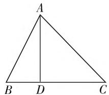

# 立足实际 夯实基础 培养能力

—— 浅谈高三数学一轮复习之我见

● 甘肃省永登县第二中学 李万良

纵观近几年高考试题,不难看出,各地的数学试题的内涵品质相较于之前有了很大的改变,更加注重对探究能力、综合分析能力和思维能力的考查,从而为高校选拔人才提供了更好的依据,更加利于新课程改革的纵深推进.众所周知,一轮复习是整个高三复习的基础,也是高三复习的根本所在,完成好一轮复习,可以帮助学生全面梳理已学知识,理清重点和难点,使学生更加系统化、全面化、扎实化地形成知识结构,进而为之后更好地深入复习奠定良好的基础.

# 一、一轮复习的现状与问题

由于一轮复习的主要任务是夯实基础,不少教师会选择“全面铺开”的复习方式来展开,从而在复习中试图做到不放过任何一个细节,牢牢把握住每一个知识点.而以这样的方式在半年内完成高一和高二全部的复习任务,难度之大可想而知.从而,不少教师选择采用课前预习,课堂梳理,训练巩固的复习方式.从理论上来看,该种复习模式可行度较大,而落实在实际复习过程中,却呈现这样的情境:对于教师而言,关注例习题的分析和讲解,注重知识网络的构建,强调思想方法的归纳,同时板书也是规范而条理,总之,复习教学要做到有条不紊;然而对于学生而言,忽视题型的记忆,忽略方法的领悟,忽视注意点的识记,总之,时间花得不少,收获甚微.导致如此现状的原因何在?笔者经过反复调研和深度反思,觉得正是由于多了课前预习的准备,使得不少学生对课堂教学丧失兴趣,认为例题分析就是“对对答案”,方法渗透就是“背诵识记”,这样的教学方式,难以调动学生的内驱力,弱化了知识的重认识,忽视了结构体系的再建构,忽略了思想方法的再优化,复习效果可想而知.

# 二、优化一轮复习的路径和方法

针对一轮复习的现状与问题,在优化复习教学指导下如何建设?笔者长期在高三复习教学的一线,也时常困惑于如何高效优质地进行一轮复习教学,不断探索“夯实基础的同时发展能力”的高三一轮复习的路径和方法，下面以“正弦定理、余弦定理及解三角形”的复习为例，谈谈自己的一些做法。

# （一）课前准备：自主学习，回归本质

高三学生由于数十年的积淀,不管在知识基础还是能力水平上都存在较大的差异性.为了缩小知识基础上的差距,教师以问题的形式编制预习导学单,并要求学生课前独立完成.这样一来,学生则可以在充足的时空内做好“准备活动”,很好地梳理需要掌握的概念、公式和定理,进而为课堂上的深入探究奠定良好的基础.

# (二) 课堂复习: 问题引领, 促进建构

为了在复习课中更好地践行“以生为本”，可以通过问题引领，促进师与生、生与生的积极互动，在合作交流中实现建构。由于有了“预习导学单”的引领，可以在教学中采取如下策略：

# 1. 通过生生互评培养反思能力

从课前热身到课中评价,预习导学单作用于课堂教学的整个过程,其作用不仅仅是夯实基础,还可以以生生互评的形式为学生的进一步合作学习搭建平台,进而激活学生的学习积极性,提升课堂复习的执行力,提升复习效率.

# 2. 通过一题多解培养发散思维

一轮复习与新授课在教学方式上存在着很大的差异,主要源于复习教学中更多的需要考虑知识的纵横联系,从而,倘若一轮复习中善于运用一题多解的训练,则会让学生受益匪浅.这样一来,可以让师生在共同探讨典型例题的多种解法中,打开封闭的思维状态,在多层次的思维过程中获得高水平的思维训练,更好地拓展思维的深度和广度,帮助学生充分掌握知识间的纵横联系,锻炼思维的发散性和灵活性,培养创新思维能力,更重要的是也强化了对典型问题的理解和认识.

例 1 如图 1, 已知 $\triangle ABC$ 的三边长分别为 a, b, c, 且 a = 8, b = 5, c = 7, 那么最长边上的高是多少?

学生经过自主探究后,形成以下多种多样的解法:

解法 1: 余弦定理.

在 $\triangle ABC$ 中， $\cos C = \frac{a^2 + b^2 - c^2}{2ab} = \frac{64 + 25 - 49}{2 \times 5 \times 8} = \frac{1}{2}$ ，因为 $C \in (0, \pi)$ , 所以 $\sin C = \frac{\sqrt{3}}{2}$ .

text_image

A
B D C

图 1

在 $\triangle ADC$ 中， $AD = AC\sin C = \frac{5\sqrt{3}}{2}$ .

解法 2: 面积法.

在 $\triangle ABC$ 中， $\cos C = \frac{a^2 + b^2 - c^2}{2ab} = \frac{64 + 25 - 49}{2 \times 5 \times 8}$ $= \frac{1}{2}$ ，因为 $C \in (0, \pi)$ ，所以 $\sin C = \frac{\sqrt{3}}{2}$ .

所以 $S_{\triangle ABC}=\frac{1}{2}ab\sin C=\frac{1}{2}\times5\times8\times\frac{\sqrt{3}}{2}=10\sqrt{3}$ $=\frac{1}{2}BC\cdot AD.$ 又因为 BC=8，所以 $AD=\frac{5\sqrt{3}}{2}.$

一题多解在一轮复习中运用的根本用意在于将问题做“深”、做“广”、做“透”，在分析多种解法优劣性的同时更好地梳理、分析和提炼解法，利于全面而系统地掌握知识，强化知识间的联系，深化知识系统，最终达到培养发散思维的目的.

# 3. 通过一题多变培养思辨能力

素质教育观提倡“以生为本”的大背景,教学中也越来越重视学生主动意识的培养,尤其是在一轮复习中,只有让学生真正参与到复习过程中去,才能真正意义上实现思维的运转.从而,教师作为一轮复习的践行者,可以通过一题多变的方式,为学生提供多角度、多层次分析问题的机会,促进学生思辨能力的提升.

例2 已知锐角 $\triangle ABC$ 中， $\angle A$ 的对边为 $a, \angle B$ 的对边为 $b$ ，且 $2a\sin B = \sqrt{3} b$ ，试求出 $\angle A$ 的度数.

变式1:已知 $\triangle ABC$ 中, $\angle A$ 的对边为 $a$ , $\angle B$ 的对边为 $b$ , 且 $2a\sin B = \sqrt{3} b$ , 试求出 $\angle A$ 的度数.

变式 2: 已知 $\triangle ABC$ 中, $\angle A$ 的对边为 a, $\angle B$ 的对边为 b, 且 $2a\sin B = \sqrt{3}b$ , $a\cos B = b\cos A$ , 试判断 $\triangle ABC$ 的形状.

变式3: 已知锐角 $\triangle ABC$ 中, $\angle A$ 的对边为 a, $\angle B$ 的对边为 b, 且 $2a\sin B = \sqrt{3}b$ , 试求出 $\sin B + \sin C$ 的最大值.

变式4:已知锐角 $\triangle ABC$ 中, $\angle A$ 的对边为a, $\angle B$ 的对边为 b，且 $2a \sin B = \sqrt{3}b$ ，若 $BC = \sqrt{3}$ ，试求出 $AB + 2AC$ 的最大值.

就这样，在一题多变的推动下，一轮复习不再是已有知识和方法的简单重复，而是知识的再创造、知识体系的再生长、数学思想方法的再优化，很好地培养了学生的数学思维能力.

# 4. 通过多题一解强化理解能力

所谓“多题一解”，就是通过一种数学思想去解决多个不同类型的问题，从而加深学生对这一数学思想的认识。一轮复习中，做题是必然的，但题海战术也是不可取的，如此蜻蜓点水的做题也仅仅是时间的耗费。而采用多题一解的训练，可以有效消除复习旧知带来的枯燥，促进学生反思问题的本质，加深学生对解法的认识和理解，强化数学理解能力，实现数学方法的融会贯通，从而提升一轮复习的效能。

例3 ①已知 $\triangle ABC$ 中， $\angle A$ 的对边为 $a, \angle B$ 的对边为 $b, \angle C$ 的对边为 $c$ ，若 $a^2 - b^2 = \sqrt{3}bc, \sin C = 2\sqrt{3}\sin B$ ，试求出 $\angle A$ 的度数.

② 已知 $\triangle ABC$ 中， $\angle A$ 的对边为 $a, \angle B$ 的对边为 $b, \angle C$ 的对边为 $c$ ，若 $8b = 5c, C = 2B$ ，试求出 $\cos C$ 的值.  
③ 已知 $\triangle ABC$ 中，有 $(a^2 + b^2)\sin (A - B) = (a^2 - b^2)\sin (A + B)$ ，试判断 $\triangle ABC$ 的形状.  
④ 已知 $\triangle ABC$ 中， $\angle A$ 的对边为 $a, \angle B$ 的对边为 $b, \angle C$ 的对边为 $c, 2a \sin A = (2b + c) \sin B + (2c + b) \sin C$ ，试求出 $\sin B + \sin C$ 的最大值.

观察上例中的题组,可以发现尽管各题的题设和问题完全不同,但解题思路均是转化已知等式中的边角关系.多题一解的目的并非做题,而是在做题中对一类问题的解法进行总结、提炼和反思,将其价值挖掘出来,“掌握规律”,“举一反三”才是复习的目的.

# 三、结语

总之,笔者在数学一线教学多年,在经历一次又一次的教学改革中,深刻感受到学生做题越来越多,教师上课越来越多,课堂容量越来越大,而对于课堂教学,尤其是复习课教学的研究越来越少,创新的、有营养的、深加工的复习课教学越发缺乏.从而,我们教师需努力在创新教育实践中探索教学规律,追求高效复习的策略,不断挖掘数学精髓,把握教学的智慧,关注到一轮复习的重要性,优化一轮复习的效能,将数学复习与夯实基础、能力培养和发展智力有机统一起来.