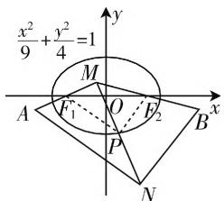
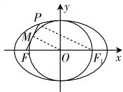
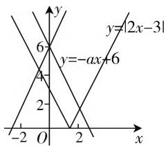

# 高中数学解析几何解题研究

——基于数形结合思想

● 江苏省张家港市暨阳高级中学 王德忠

高中数学几何部分是教学的核心内容之一,很多教师一直坚持以几何教学培养学生逻辑和空间想象相关的综合能力.无论是文科还是理科都要求学生掌握解决几何问题的相关能力,于是很多教学工作者对此进行了研究,提出了不少解析几何的教学策略和方法.数形结合思想是在学习数学的过程中,极为重要的解题思路,通过数形结合的方法可以提高解题的速度和准确率.本文基于前人研究的情况,探索了数形结合思想这一策略在高中数学中的解题运用,以实际案例进行了相关说明,从几方面对数形结合思想进行了整理和分析,用一些例子说明了此思想的科学依据性,以期为高中阶段的教学者和学习者提供一定经验.

在高中学习的科目之中, 高中数学的重要性显而易见, 但不少学生在面对解析几何时感到难度很大, 丢分是常事. 经过一系列的研究, 我发现了在数学解题时用数形结合思想是一个可行的解题思路. 从题干出发, 在解决问题时以图形的形式来解题, 可以在一定程度上提高解题的速度以及正确率, 逻辑思维较强的人更是可以通过图形的形式快速得到答案. 数形结合的核心就是数与形的转化. 下面来举几道例题说明数形结合思想的运用.

# 一、数形结合思想的渗透应做的准备

在高中数学教学中通过例题探究,有效渗透数学思想的方法就好比数学思想是数学知识和解决问题之间的纽带,学生在解决解析几何问题时,已经对椭圆、双曲线、几何体相关性质,面、线等的基本内容有一定的了解,但还是要提前熟悉空间几何的相关定理、几何体相关性质等内容,做到心里有数.学生提前熟悉相关知识,但是面对题目时还是不知如何解决,因此数形结合思想对学生解决问题有一定的指引作用,数形结合思想的中心思想就是以不变的数学定理、概念等去应对千变万化的题目,因此在数学解题教学中数形结合思想渗透还要引导学生认识题目相关条件的数形转化. 在高中数学学习空间几何时, 学生的逻辑思维能力跟不上容易出现学习困难, 这时引入数形结合思想能让学生在困惑中找到一条道路, 解题时能更有效果. 在教授数形结合思想时, 教师也要做好两手准备, 一是因势利导进行转化和化归思想的引入; 二是借助函数、分类讨论等思想引导学生展开计算和推导. 这样学生利用数形结合思想来解几何题目才能更有效率, 进而帮助学生学会自我探究和实践.

# 二、高中数学解析几何解题中数形结合思想的具体运用案例

# （一）在双曲线题目中应用数形结合思想的具体方法

在学习高中数学的时候,其中双曲线问题是高中数学中比较基础的一个知识点,也是高中数学中的一个重点内容.在学习双曲线知识点的时候,会发现无论是曲线焦点、抛物线的相关定理都有着共通之处,很多知识可以借助数形结合的思想变换条件,化烦琐为简洁,从而来分析题目解决问题.学生在解双曲线题目时运用恰当的数形结合可以很有效地提高解题正确率.而且数形结合的目的也是可以减少用其他方法所带来的复杂解题过程.于是,利用这种方法不仅让知识得以充分运用,还让学生在解题中减少了负担,增加学生的学习乐趣.当然,也会有比较难的数形结合问题,这时候引导学生在难题中磨练思维和综合计算能力就显得比较关键了.数形结合的核心就是数与形的转化,下列例题解答时就可以借助数形结合思想.

例 1 已知椭圆 $C: \frac{x^{2}}{9} + \frac{y^{2}}{4} = 1$ ，其焦点为 $F_{1}, F_{2}$ ，MA 关于 $F_{1}$ 对称，MB 关于 $F_{2}$ 对称，设点 P 在椭圆上，且平分线段 MN，则 $|AN| + |BN| = (\quad)$ .

第一步,理解题意画出题中描述的图形,画出辅助线: $PF_{1}$ 与 $PF_{2}$ .第二步,据图找数量,得出关系式.

这一步引导的关键在于让学生准确从图形和数量之间找出联系，从而优化自己数形结合的思想观念，形成基础认知。教师讲解这一步时要引导学生发现图中点 $A$ 与点 $M$ 关于 $F_{1}$ 对称的含义：

text_image

x²/9 + y²/4 = 1
y
M
F₁ O F₂
A P B x
N

图1

点 $F_{1}$ 平分AM, $F_{2}$ 平分线段 $MB$ ，点 $P$ 也是平分线段 $MN$ 的且点 $P$ 在椭圆 $C$ 上。在图中得知 $F_{1}, P, F_{2}$ 均为中点，由三角形的中位线知识就可以得到数量关系 $\left|F_{1}P\right| = \frac{1}{2}\left|AN\right|$ ， $\left|F_{2}P\right| = \frac{1}{2}\left|BN\right|$ 。这样又将形转化成数。最后由点 $P$ 在椭圆 $C$ 上，根据椭圆定义，问题就解决了。

例 2 已知椭圆 $\frac{x^{2}}{a^{2}}+\frac{y^{2}}{b^{2}}=1(a>b>0)$ 的左焦点为 F，若点 P 满足以椭圆短轴为直径的圆与线段 PF 相切，点 M 为中点，则椭圆的离心率为 \_\_\_\_.

A. $\frac{\sqrt{2}}{2}$

B. $\frac{2}{3}$

C. $\frac{5}{9}$

D. $\frac{\sqrt{5}}{3}$

这道例题从字面解答很困难,不妨引导学生采用数形结合思想画出图形进行解答.结合图形,可引导学生设右焦点为 $F_{1}$ ,然后连接 $PF_{1},OM$ ,为下一步分析和计算做准备.题

text_image

P
M
F
O
F₁
x
y

图2

目给出的椭圆短轴、点 $M$ 是中点、 $PF$ 与圆相切都是关键信息，要整合利用，从而得到隐含的三个信息，一是点 $M$ 是 $PF$ 的中点，二是 $OM$ 垂直于 $PF$ ，三是 $|OM| = b$ 。根据图形和椭圆相关定理，由椭圆性质可知点 $O$ 平分 $F_{1}F_{2}$ ，再借助中位线定理可得 $|PF_{1}| = 2b$ 。在由椭圆定义可知 $|PF| = 2a - 2b$ 。由 $M$ 是 $PF$ 的中点知 $|MF| = a - b$ 。在 Rt $\triangle OMF$ 中，由勾股定理就可以得到 $a, b, c$ 三者的关系，从而问题就解决了。

数形结合让前面看似复杂的题目经简单变化就成为了直观的图形,学生根据题目信息画出图形,既锻炼了题目信息分析能力,也充分理解了数形结合思想解题的奥妙,两道题的解法相似:第一步,根据题意画出题目描述的图形;第二步,分析图形,找出图形中隐藏的数量关系.并且这两道题都需要学生掌握递进式的求解方法.这两道题也有不同点:第一道题,是运用椭圆的定义来解决的,第二道题,不仅借助椭圆的定义,还涉及了其他知识.这说明圆锥曲线的题目,需要学生掌握和灵活运用各方面的知识.在教学中,教师也要给学生布置和讲解更多的典型例题. 讲解过程中, 教师要将运用同种解题方法的例题归纳在一起, 让学生的思维不至于太过跳跃, 牢牢地掌握各种例题的解法, 体会到数形结合思想的巧妙.

# （二）在函数问题中应用数形结合思想的具体方法

在高中数学中,有一个内容最让学生头疼,同时也是高中数学中最重要的一个内容之一,它也是在高考中占分数比最高和最耗费时间的问题,它就是函数问题.函数问题在高中数学的课本上占据了很大一部分内容,但是函数问题可以通过图形来解决,用图形表达出函数问题就很好理解它.在解决函数问题时,我也会同解决很多数学问题一样,使用数形结合的方式来解决.因为数形结合的思想可以从很多方面降低函数问题的难度,数形结合思想可以简化这些复杂问题,从而提高我们的解题速度和效率.比如以下例题的解答就需要用好数形结合思想才能高效率地解答:

已知 $|2x - 3| = -ax + 6, a$ 为常数. 若 $|2x - 3| = -ax + 6$ 恰好有两个不同的零点，求 $a$ 的取值范围.

根据 $y = |2x - 3|$ ，令 $y = -ax + 6$ ，借助数形结合思想作出两个函数的图像，如图3所示，可以看出当 $-2 < a < 2$ 时，函数的图像交点和零点也就非常明显了，即 $a$ 应在 $(-2, 2)$ 内取值.

text_image

y
6
y=2x-3
y=-ax+6
4
2
-2 O 2 x

图3

根据上述几道例题来看,高中数学中运用数形结合思想解决解析几何问题能让无数学生头疼的难题得到很好的简化,使得学生能在解题时选择数形结合解题方法有了一定的依据.教师在解析几何教学中也应该进一步引导学生发挥自己的思维能力,善于发现可以使用数形结合思想的题目和条件,从而更有针对性地运用这样的数学思维方法.

高中学习阶段, 数学占据了学生大部分学习时间, 这不仅仅是一门学科, 更是学生逻辑思维能力、现实问题解答能力提升的关键. 为此高中教师在解析几何教学时引导学生探究画图、数形结合训练等方面要下足功夫, 确保学生对数形结合条件的挖掘有深度、有技巧、有准备. 然后在试题训练中要针对性地培养学生探究的思维, 不能局限于做一题会一题, 而要确保学生能迁移发散自己的思维, 提高计算、分析、绘图、观察等综合素养, 这样才能有效提高学生数形结合的运用技巧和能力. W