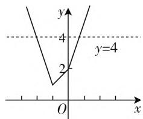
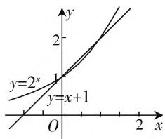
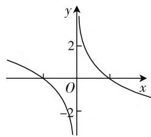
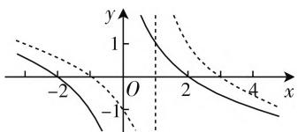

# 高考中几类不等式求解的类型与策略

# ● 江苏省灌云县第一中学 侍红杏

不等式的求解问题是每年高考中回避不了的一个基本知识点，也是每年高考中的热点问题之一。不等式的求解涉及的类型众多，可以是一次不等式、二次不等式、绝对值不等式、复合不等式以及抽象不等式的求解等，设置场所千奇百怪，可以以各种各样的面孔出现。下面结合2020年高考数学试卷中几类常见的不等式求解类型加以真题剖析，并结合不同类型的不等式求解策略加以分析，抛砖引玉。

# 一、二次不等式的求解

例 1 （2020 年高考数学全国卷 I 文科第 1 题）已知集合 $A=\{x \mid x^{2}-3x-4<0\}$ ， $B=\{-4,1,3,5\}$ ，则 $A \cap B=(\quad)$ .

A. $\{-4,1\}$ B. $\{1,5\}$ C. $\{3,5\}$ D. $\{1,3\}$

分析: 结合集合 A 中的二次不等式 $x^{2}-3x-4<0$ 进行因式分解处理, 进而求解相应的二次不等式, 再利用集合的交集运算与集合 B 的点集取公共部分, 即可求解 $A \cap B$ , 作出对应的判断.

解析:由不等式 $x^{2}-3x-4<0$ ,

可得 $(x - 4)(x + 1) < 0$ ，解得 $-1 < x < 4$

所以 $A \cap B = \{1, 3\}$ .

故选择答案:D.

点评:高考中的二次不等式,可以在各种各样的场合中出现,涉及集合的运算、函数的图像与性质、函数与方程问题、直线与圆锥曲线的位置关系等众多知识点,有时单独出现,有时融合在其他知识点中.求解二次不等式可通过转化为二次函数图像问题处理,可因式分解处理等方式来达到目的.

# 二、绝对值不等式的求解

例2（2020年高考数学江苏卷第21题 $C$ ）设 $x \in \mathbf{R}$ ，解不等式 $2|x + 1| + |x| < 4$ .

分析:可以根据绝对值所对应的零点-1与0进行分类讨论,在对应的条件下去掉绝对值符号,结合一次不等式的求解,综合各不同情况的并集来确定绝对值不等式的解集;也可以根据绝对值不等式确定相应的函数,结合分段函数的表示作出相应的图像,数形结合来求解绝对值不等式.

解法 1: 当 x > 0 时, 原不等式可化为 $2x + 2 + x < 4$ , 解得 $0 < x < \frac{2}{3}$ ;

当 $-1 \leqslant x \leqslant 0$ 时，原不等式可化为 $2x + 2 - x < 4$ ，解得 $-1 \leqslant x \leqslant 0$

当 $x < -1$ 时，原不等式可化为 $-2x - 2 - x < 4$ 解得 $-2 < x < -1$ .

综上,原不等式的解集为 $\left\{x\left|-2<x<\frac{2}{3}\right.\right\}$ .

解法2：作出函数 $f(x) = 2|x + 1| + |x| =$ $\left\{ \begin{array}{l} -3x - 2, x < -1, \\ x + 2, -1 \leqslant x \leqslant 0, \\ 3x + 2, x > 0 \end{array} \right.$ 的图像，

如图1所示，数形结合，可知原不等式的解集是函数 $f(x)$ 的图像在直线 $y = 4$ 的下面部分（不包括端点），由 $-3x - 2 = 4$ 解得 $x = -2$ ，由 $3x + 2 = 4$ 解得 $x = \frac{2}{3}$

text_image

y
4
y=4
2
O
x

图1

所以原不等式的解集为 $\left\{x\mid -2 <   x <   \frac{2}{3}\right\} .$

点评:高考中的绝对值不等式问题,经常把一次式、二次式等融合其中,结合绝对值式的加、减式所对应的不等式来设置问题.破解时可以通过绝对值所对应的零点进行分类讨论,分别求解相应的不等式再求对应的并集即可;也可以转化为相应的函数,利用分段函数的表示与图像的直观形式,数形结合来确定绝对值不等式的求解问题.

# 三、复合不等式的求解

例3（2020年高考数学北京卷第6题）已知函数 $f(x) = 2^{x} - x - 1$ ，则不等式 $f(x) > 0$ 的解集是（ ）.

A. $(-1,1)$

B. $(- \infty, -1) \cup (1, +\infty)$

C. $(0,1)$

D. $(- \infty, 0) \cup (1, +\infty)$

分析: 可以利用条件中的函数转化为两个基本初等函数, 结合基本初等函数的图像确定相应的位置关系后数形结合来确定相应的不等式的解集问题; 也可以通过构造特殊值来处理, 合理排除, 一步到位, 简单快捷.

解法1:在同一平面直角坐标系上作出函数 $y=2^{x}$ 与 $y=x+1$ 的图像,如图2所示,对应的交点为(0,1),(1,2),而不等式 $f(x)>0$ 的解集就是函数 $y=2^{x}$ 的图像在直线 $y=x+1$ 上面的部分,数形结合可知 x<0 或 x>1.

text_image

y
y=2^x
y=x+1
O
x

图2

故选择答案:D.

解法 2: 取特殊值 x = -1,

代入可得 $f(-1) = 2^{-1} - (-1) - 1 = \frac{1}{2} >0$

此时不等式 $f(x) > 0$ 成立，

结合各选项中的解集可以排除选项 A, B, C.

故选择答案:D.

点评:高考中的复合不等式问题,经常把根式、指数式、对数式与常见的二次式、一次式等加以复合.破解时可以通过转化为基本初等函数问题,借助函数图像加以直观分析;也可以通过题目的具体条件、特殊值排除、分类讨论等来处理.涉及根式、对数式等的不等式求解时,求解后要注意验证,排除定义域外的增根部分.

# 四、抽象不等式的求解

例 4 （2020 年高考数学新高考山东卷第 8 题）若定义在 R 上的奇函数 $f(x)$ 在 $(-∞,0)$ 上单调递减，且 $f(2)=0$ ，则满足 $xf(x-1)≥0$ 的 x 的取值范围是（）.

A. $[-1, 1] \cup [3, +\infty)$   
B. $[-3, -1] \cup [0, 1]$   
C. $[-1,0] \cup [1, +\infty)$   
D. $[-1,0] \cup [1,3]$

分析:可以根据函数的奇偶性与单调性来构造特殊函数图像,利用数形直观,通过自变量x的正负取值情况加以分类讨论,得以求解抽象不等式问题;也可以在构造特殊函数图像的基础上,借助抽象函数图像的平移变换来处理,更加方便快捷.

解法1:根据题意条件,作出满足条件的函数 $y=f(x)$ 的草图,如图3所示,则当 x<0 时,有 $-2\leqslant x-1\leqslant0$ , 解得 $-1\leqslant x<0$ ; 当 x>0 时,有 $0\leqslant x-1\leqslant2$ , 解得 $1\leqslant x\leqslant3$ ; 当 x=0 时,不等式显然成立.

line

| Point | x | y |
|---|---|---|
| 1 | -3.0 | 0 |
| 2 | 0 | 2 |
| 3 | 3.0 | -2 |

图3

综上分析, 满足 $xf(x-1) \geqslant 0$ 的 x 的取值范围是 $[-1,0] \cup [1,3]$ .

故选择答案:D.

解法2:根据题意条件,作出满足条件的函数 $y = f(x)$ 的草图,如图4中的实线部分,那么函数 $y = f(x - 1)$ 的图像是由函数 $y = f(x)$ 的图像向右平移1个单位长度得到的(如图中的虚线部分),数形结合,可知满足 $xf(x - 1) \geqslant 0$ 的 x 的取值范围是 $[-1, 0] \cup [1, 3]$ .

故选择答案:D.

text_image

Graph showing three curves with labeled x and y axes, including solid and dashed lines intersecting at key points.

图4

点评:高考中的抽象不等式问题,形式多样,种类众多,经常与函数的奇偶性、单调性、周期性等基本性质加以综合与应用.破解时要紧紧抓住其中函数的基本性质,或逻辑推理,或构造特殊函数模型,借助函数的单调性以及函数图像在x轴的上半部分与下半部分所表示的含义加以推理与分析.合理转化是破解的关键所在.

其实,求解不等式的理论依据是不等式的同解原理.而在实际求解相应的不等式问题中,除了可以等价转化为一元一次不等式(组)或一元二次不等式(组)来处理,也可以通过自变量的取值情况加以分类讨论,可以借助基本初等函数的图像与性质来逻辑推理与数形结合,还可以根据题目条件通过特殊值排除法、数形结合法等不同的策略来解决,有效综合知识,提升数学能力,拓展数学思维,培养数学核心素养.W