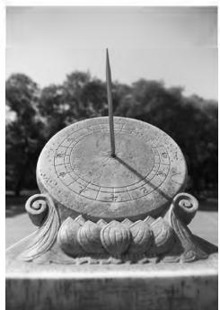
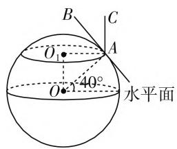
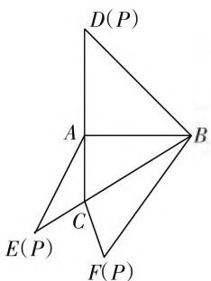
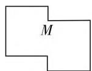
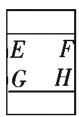
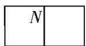
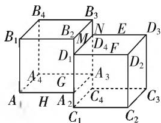
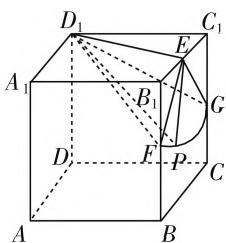

# 高考新思维,立几新动向

# ● 江苏省宜兴第一中学 万凌霞

高考数学坚决落实“立德树人”的根本任务，结合新高考的全面铺开、完善、推进，在考试基本内容、试题结构、题型创新以及整体难度调控等方面的改革都进行了积极的探索与创新，展开新思维，奠定坚实基础。特别是在立体几何的高考命题方面，呈现了新的动向，保留原来立体几何中考查空间几何体的表面积或体积、空间点线面的位置关系的判定与性质、空间线面的平行或垂直的证明以及空间角或空间距离的求解等，在此基础上充分把握数学考试的方向性、时代性、科学性、应用性等以及普通高校人才选拔功能的关系，体现空间想象能力等，正确把握高考数学中立体几何命题与高中数学课程标准、数学核心素养等之间的关系，充分发挥高考数学立体几何知识对中学数学教育教学的正确导向作用。

# 一、新颖背景

例 1 （2020 年高考数学新高考卷 I（山东卷）第 4 题）日晷是中国古代用来测定时间的仪器，利用与晷面垂直的晷针投射到晷面的影子来测定时间。把地球看成一个球（球心记为 O），地球上一点 A 的纬度是指 OA 与地球赤道所在平面所成角，点 A 处的水平面是指过点 A 且与 OA 垂直的平面，在点A 处放置一个日晷, 若晷面与赤道所在平面平行, 点 A 处的纬度为北纬 $40^{\circ}$ , 则晷针与点 A 处的水平面所成角为().

natural_image

Black-and-white photo of an ornate historical site sun with a central dial and decorative base (no visible text or symbols)

图1

A. $20^{\circ}$

B. $40^{\circ}$

C. $50^{\circ}$

D. $90^{\circ}$

分析:通过日晷仪器这一新颖的立体空间几何模型,进行合理模型化与抽象化,巧妙把球体中的知识转化为平面几何问题,合理融合立体几何与平面几何等相关知识,很好地考查空间想象能力以及数学建模与创新应用.

解析:如图2所示,其中 $\odot O$ 所在的平面为地球赤道所在的平面,而 $\odot O_{1}$ 所在的平面为点A处的日晷的晷面所在的平面,那么由点A处的纬度为北纬 $40^{\circ}$ ,可知 $\angle OAO_{1}=40^{\circ}$ ,又点A处的水平面与OA垂直,则知晷针AC与 $\odot O_{1}$ 所在的平面垂直,则有 $\angle CAB=\angle OAO_{1}=40^{\circ}$ ,故晷针AC与点A处的水平面所成角为 $40^{\circ}$ .

text_image

B
C
O₁
A
O
40°
水平面

图2

故选B.

点评:借助空间想象能力的应用,抓住新颖模型,以中国古代用来测定时间的仪器——日晷来巧妙设置几何问题,实现应用模型、立体几何、平面几何之间的有机联系,巧妙把数学文化与立体几何、平面几何等知识加以融合.

# 二、图形推理

例 2 （2020 年高考数学全国卷 I 理科第 16 题）如图 3，在三棱锥 P-ABC 的平面展开图中，AC=1, AB=AD= $\sqrt{3}$ , AB⊥AC, AB⊥AD, ∠CAE=30°，则 cos∠FCB= \_\_\_\_.

分析:通过在不同三角形中结合勾股定理或余弦定理确定相应的边长,利用空间几何体与平面展开图之间的图形推理,建立相应的边长关系,再利用余弦定理加以求解即可.

text_image

D(P)
A
B
C
E(P)
F(P)

图3

解析:由于 $AB \perp AC, AC=1, AB=\sqrt{3}$ ，结合勾股定理可得 $BC=\sqrt{AC^{2}+AB^{2}}=2$ ，同理得 $BD=\sqrt{6}$ ，则知 $BF=BD=\sqrt{6}$ .

在 $\triangle ACE$ 中， $AC = 1, AE = AD = \sqrt{3}, \angle CAE = 30^\circ$ ，结合余弦定理可得 $CE^2 = AC^2 + AE^2 - 2AC \cdot AE\cos 30^\circ = 1$ ，则知 $CF = CE = 1$ ，在 $\triangle BCF$ 中， $BC = 2, BF = \sqrt{6}, CF = 1$ ，结合余弦定理可得 $\cos \angle FCB = \frac{CF^2 + BC^2 - BF^2}{2CF \cdot BC} = -\frac{1}{4}$ .

故填答案: $-\frac{1}{4}$ .

点评:合理把平面几何图形与空间立体几何图形加以联系,结合图形中点、线、角之间的关系,合理推理,巧妙转化,借助解三角形等相关知识加以分析与运算,很好地创新考查数形结合、直观想象、代数运算等能力与核心素养.

# 三、视图还原

例 3 （2020 年高考数学全国卷Ⅱ 理科第 7 题）如图 4 是一个多面体的三视图，这个多面体某条棱的一个端点在正（主）视图中对应的点为 M，在俯视图中对应的点为 N，则该端点在侧（左）视图中对应的点为（ ）.

  
正视图

  
侧视图

  
俯视图  
图4

A. $E$

B. F

C. G

D. H

分析:根据对应多面体的三视图,还原视图,画出该多面体的立体图形,即可求得M点在侧(左)视图中对应的点,进而得以正确判断.

解析: 根据对应多面体的三视图, 还原视图, 作出该多面体的立体图形, 如图 5 所示, 那么直观图中, 棱 $D_{1}D_{4}$ 上的所有点在正(主)视图中对应的点为 M, 棱 $B_{3}C_{4}$ 上的所有点在俯视图

text_image

B4 B3
B1 B2 M N E D3
D1 D4 F
A4 G A3 D2
A1 H A2 C4 C3
C1 C2

图5

中对应的点为 N，则知同时满足在正(主)视图中的相应点 M，在俯视图中的相应点 N 的相应点为点 $D_{4}$ ，又在直观图中，棱 $D_{3}D_{4}$ 上的所有点在侧视图中对应的点为 E，所以点 $D_{4}$ 在侧视图中对应的点为 E，其即为满足条件的点.

故选A.

点评:巧妙根据空间几何的三视图来判断相应点的位置,解题关键是熟练掌握三视图与直观图之间的关系与相关的基础知识,根据对应的三视图正确合理还原对应的空间立体图形的直观图,并加以正确的分析与判断,很好考查了分析问题和解决问题的能力、空间想象能力,以及直观想象和逻辑推理等核心素养.

# 四、动点轨迹

例 4 （2020 年高考数学新高考卷 I（山东卷）第 16 题）已知直四棱柱 $ABCD-A_{1}B_{1}C_{1}D_{1}$ 的棱长均为 $2, \angle BAD=60^{\circ}$ . 以 $D_{1}$ 为球心， $\sqrt{5}$ 为半径的球面与侧面 $BCC_{1}B_{1}$ 的交线长为 \_\_\_\_.

分析:以直四棱柱为问题背景,通过相应的长度与角度元素的确定,利用球面与侧面的交线长这一轨迹,化“动”为“静”,结合直观想象,串联起空间问题与平面问题,合理破解立体几何中的轨迹及其应用问题.

解析:如图6所示,取 $B_{1}C_{1}$ 的中点为E, $BB_{1}$ 的中点为F, $CC_{1}$ 的中点为G,因为 $\angle BAD=60^{\circ}$ ,直四棱柱ABCD- $A_{1}B_{1}C_{1}D_{1}$ 的棱长均为2,所以 $\triangle B_{1}C_{1}D_{1}$ 为等边三角形,所以 $D_{1}E=\sqrt{3},D_{1}E\perp B_{1}C_{1}$ .

text_image

Geometric diagram of a cube with labeled vertices and internal points, used for spatial geometry problems.

图6

又四棱柱 $ABCD-A_{1}B_{1}C_{1}D_{1}$ 为直四棱柱，所以 $BB_{1}\perp$ 平面 $A_{1}B_{1}C_{1}D_{1}$ ，所以 $BB_{1}\perp D_{1}E$ .

因为 $BB_{1} \cap B_{1}C_{1} = B_{1}$ ，所以 $D_{1}E \perp$ 侧面 $BCC_{1}B_{1}$ .

设 P 为侧面 $BCC_{1}B_{1}$ 与球面的交线上的点，则 $D_{1}E \perp EP$ .

因为球的半径为 $D_{1}P = \sqrt{5}, D_{1}E = \sqrt{3}$ ，所以 $EP = \sqrt{D_{1}P^{2} - D_{1}E^{2}} = \sqrt{5 - 3} = \sqrt{2}$ ，所以侧面 $BCC_{1}B_{1}$ 与球面的交线上的点 $P$ 到点 $E$ 的距离为 $\sqrt{2}$ .

因为 $EF = EG = \sqrt{2}$ ，所以侧面 $BCC_{1}B_{1}$ 与球面的交线是扇形 EFG 的弧 FG.

因为 $\angle B_{1}EF = \angle C_{1}EG = 45^{\circ}$ ，所以 $\angle FEG = 90^{\circ}$ $= \frac{\pi}{2}$ ，所以根据弧长公式可得 $\widehat{FG} = \frac{\pi}{2}\times \sqrt{2} = \frac{\sqrt{2}\pi}{2}.$

故填答案: $\frac{\sqrt{2}\pi}{2}$ .

点评:通过立体几何的辅助线的构造,结合立体几何的直观分析与逻辑推理,利用几何元素之间的位置关系直接判断出所求的侧面 $BCC_{1}B_{1}$ 与球面的交线就是扇形 EFG 的弧 $\widehat{FG}$ , 进一步利用平面几何的相关知识来确定弧长所对应的圆心角大小, 再结合弧长公式来求解交线长即可.

高考数学立体几何试题能有效明确该部分知识在高考数学学科中的地位和作用，确定立体几何的考核目标和考查要求，把握改革精神，创新问题设置，综合能力提升，很好地把握了稳定与创新、稳定与改革、继承与创新等的关系，充分体现立体几何基本知识和基本能力的要求，以及数学核心素养的要求，对推进高考综合改革、引导中学数学教学等方面都发挥着积极的作用。F