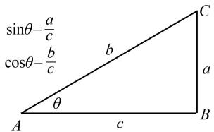
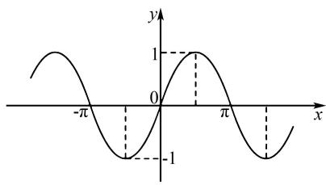
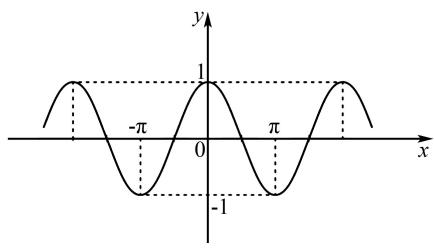

# 三角函数最值问题的解题技巧

朱佳丽

(江苏省南通市体育运动学校, 江苏 南通 226000)

摘 要:在中等职业学校数学教育中,三角函数是一个至关重要的知识点,学生不仅要学习三角函数的理论知识,更需要掌握解决相关问题的技巧和策略.文章探讨中职学生在解决三角函数最值问题时可能遇到的挑战,并提出相应的解题技巧和策略,以帮助他们更好地掌握这一复杂但实用的数学概念.

关键词:三角函数;最值问题;解题技巧

中图分类号：G632

文献标识码：A

在中等职业教育中,数学一直是一个重要且关键的学科.三角函数是数学中的一个重要分支,其应用范围广泛,涉及各个领域.在学习三角函数时,最值问题一直是学生感到困惑的一个环节,解决这类问题需要掌握一定的技巧和方法,以便快速、准确地求解 $^{[1]}$ .因此,教师需要详细地讲解中职数学中三角函数最值问题的解题技巧,并通过实例分析,帮助学生系统地理解并掌握解决这类问题的方法.

# 1 求解最值前提,了解函数性质

在学习三角函数最值前,教师必须先让学生了解函数的性质.三角函数是数学中重要且应用广泛的一类函数,它们在数理化等诸多领域都有着重要的作用.通过深入研究其性质,学生可以更好地理解三角函数的变化规律,从而求解函数的最值问题.

要让学生了解三角函数的性质并求解最值问题,教师可以先介绍正弦、余弦函数的定义及其在直角三角形中的含义,然后让学生提前预习,并在课堂上,随机提问学生对概念的理解.学生指出,正弦和余弦是三角函数中的两个重要函数(如图1),它们文章编号:1008-0333(2025)12-0029-03

通常用于描述直角三角形中的角度与边长之间的关系. 教师可以补充, 在定义正弦和余弦之前, 假设有一个直角三角形, 其中一个锐角的度数为 $\theta$ , 正弦函数通常表示为 $\sin \theta$ . 在一个直角三角形中, 对于一个锐角 $\theta$ , 正弦值定义为锐角 $\theta$ 的对边与斜边的比值. 余弦函数通常表示为 $\cos \theta$ , 在同样的直角三角形中, 余弦值定义为锐角的边与斜边的比值. 三角函数的最值通常是在特定的区间内求解, 教师出示例题: 正确绘制正弦余弦函数图象, 并指出其所在闭区间内的最值. 随后, 教师结合先前给学生补充的知识, 再为学生框定一个闭区间 $[0,2\pi]$ , 让学生主动观察并思考. 学生不难发现, 对于正弦函数和余弦函数, 它们在闭区间 $[0,2\pi]$ 内的特征丰富. 有学生认为, 正弦函数 $\sin x$ 在闭区间 $[0,2\pi]$ 内的最大值为 1, 最小值为 -1; 还有学生回答这是奇函数, 且在 $(0,\pi)$ 上单调递增, 在 $(\pi,2\pi)$ 上单调递减. 在学生与教师的配合下, 越来越多的学生逐渐领会了正余弦函数的最值性质, 有学生举一反三, 指出余弦函数 $\cos x$ 在闭区间 $[0,2\pi]$ 内的最大值为 1, 最小值为 -1, 且它是偶函数. 最后, 教师还可以简单介绍三角函数的周期性, 让学生理解函数的周期是如何影响函数图象的,并说明各三角函数的奇偶性质,帮助学生简化函数的运算和找到对称轴.再讲解三角函数间的基本关系,将其与三角函数的图象联系起来,利用函数的性质和图象找到函数在给定区间内的最值,让学生理解这个过程.

text_image

sinθ=a/c
cosθ=b/c
A
θ
b
c
B
a
C

图 1 锐角三角函数

通过本次学习,学生不仅掌握了三角函数的基本性质,还了解了如何在求解最值问题时运用这些性质.函数的最值问题是数学中常见且重要的问题之一,通过对函数性质的理解和分析,学生可以更加灵活地处理各种函数的最值问题,为其进一步学习数学奠定坚实的基础,进而帮助他们在今后的学习和实践中灵活运用所学知识,不断提高自己的数学建模能力,拓展数学应用领域.

# 2 熟悉最值特征,描述函数图象

在数学中,三角函数是一类重要且常见的函数,它们在几何、物理以及工程等多个领域中发挥着关键作用.其中,学生熟悉的正弦函数、余弦函数和正切函数都具有独有的特征,特别是它们的最值.教师通过介绍三角函数的最值特征,可以帮助学生更好地理解函数图象在坐标系中的表现,从而加深对这些函数的认识.

要让学生熟悉三角函数的特征并描述函数图象,教师可以让学生通过软件工具如 Geogebra 或者在线函数绘图工具,探索并绘制不同三角函数的图象. 可以让他们尝试改变函数的参数,观察图象如何变化,并总结规律,接着,教师可以出示例题引入探究:求函数 $y = 2 \cos x - 1$ 的最大值和最小值. 教师引导学生通过观察余弦函数的图象,尝试得出结果,在观察探究后,有学生发现此题隐藏了 $y = a \cos x + b$ 型的三角函数最值问题模型,教师肯定了学生的答案. 学生在教师的点拨下,回忆起了“换元法”,并设

$t = \cos x$ ,再结合其他学生的想法,由三角函数的有界性得 $t \in [-1,1]$ ,则 $y = 2t - 1 \in [-3,1]$ ,直接可以求出函数的最大值为 1,最小值为 -3. 根据学生的思维反应状况,教师可以给学生展示正弦函数图象(如图 2),巩固学生的基础知识,并强调说明正弦函数的周期性和取值范围在 -1 到 1 之间. 教师以如何画出函数 $y = \sin x$ 为例,当 $x_1 \in [-2\pi, 2\pi]$ 时,函数 $y = \sin x$ 从 0 开始,最大值为 1,最小值为 -1,并在 $0, \pi, 2\pi$ 等处交替达到最大值和最小值,接着再展示函数 $y = \cos x$ 的图象(如图 3),强调函数 $y = \cos x$ 与 $\sin x$ 的相似之处,但函数 $y = \cos x$ 在 $x = 0$ 时取最大值 1,说明函数 $y = \cos x$ 在 $-2\pi$ 到 $2\pi$ 的范围内的周期性,并提醒学生函数 $y = \cos x$ 的奇偶性质,让学生比较函数 $y = \sin x$ 和函数 $y = \cos x$ 的不同.

line

| x       | y     |
|---------|-------|
| -π      | 0     |
| 0       | 1     |
| π/2     | 0     |
| π/4     | -1    |
| 3π/2    | 0     |
| π       | 1     |

图2 $y = \sin x$ 图象

text_image

y
1
-π
0
π
x
-1

图3 $y = \cos x$ 图象

通过对三角函数最值特征的描述和函数图象的探讨,学生不仅能深入理解数学概念,更能发现数学世界的美妙之处.正是这些函数的特性和图象的展示,让学生能够在数学的海洋中探索前行,发现更多有趣而奇妙的现象.教师通过对三角函数图象的教学研究,不仅能够促进学生更加深入地理解数学的奥秘,也能够拓展他们对数学的认识,从而为其未来的探索和发现铺平道路.

# 3 掌握最值解法,运用单调性法

在解决三角函数最值问题时,掌握正确的解法对于数学学习至关重要.其中,利用单调性法可以帮助学生更加直观地理解三角函数的变化规律,从而寻找函数的极值点.通过这一方法,学生能够更高效地解决与三角函数相关的最值问题,从而提高解题的准确性和速度.

在使用单调性法解决三角函数最值的问题时, 教师在课堂上可以给定一个三角函数表达式, 如 $\sin x, \cos x$ , 要求找到其在特定区间内的最大值或最小值. 在鼓励学生充分了解函数单调性的基础上, 教师可以让学生通过小组合作, 讨论利用函数单调性解决最值问题的理论方法. 为了让学生更好地提炼方法, 教师可以带领学生实操一道例题:

已知 $w > 0$ ，函数 $f(x) = \sin (wx + \frac{\pi}{4})$ 在 $(\frac{\pi}{2},\pi)$ 单调递减，则 $w$ 的最大值为？

根据题目要求,教师圈画出限定条件,指出 w > 0,让学生注意到这个貌似不起眼的条件,在教师点拨下,大部分学生找到了课堂讨论的方向.经过分析,有学生得出,首先分析函数在所选区间内的单调性,如果函数在该区间内单调递增,则最大值在区间的端点处或者间断点处取得.教师可以给学生一定时间,让学生探索题目,不多时,有学生看出了函数 $f(x) = \sin\left( wx + \frac{\pi}{4}\right)$ 在 $\left(\frac{\pi}{2}, \pi\right)$ 内单调递减与 w > 0 的情况下,同时需要满足多个条件.首先需要验证函数的单调性,其次需要证明函数单调递减,其他小组学生成员补充,根据周期 $T = \frac{2\pi}{|w|}$ 的基础知识,可以先在区间内表示出 $\pi - \frac{\pi}{2}$ ,即区间端点的距离,然后再用 $\frac{1}{2}$ 个周期框定区间范围,则可以确保区间内的函数是单调的.接着,有学生指出若要证明单调递减的关系,只需要将两个端点代入函数表达式,用不等关系表示出来即可,也就是比较候选点处函数值,最后就能确定最值所在的位置了.在教师的帮助下,学生小组列出了如下不等式组,

$$
\left\{ \begin{array}{l} \pi - \frac {\pi}{2} \leqslant \frac {1}{2} \cdot \frac {2 \pi}{w}, \\ \frac {\pi}{2} w + \frac {\pi}{4} \geqslant 2 k \pi + \frac {\pi}{2} (k \in \mathbf {Z}), \\ \pi w + \frac {\pi}{4} \leqslant 2 k \pi + \frac {3 \pi}{2} (k \in \mathbf {Z}). \end{array} \right.
$$

解得 $\left\{\begin{aligned}0<w&\leqslant2,\\ w&\geqslant4k+\frac{1}{2}(k\in\mathbf{Z}),\\ w&\leqslant2k+\frac{5}{4}(k\in\mathbf{Z}).\end{aligned}\right.$

所以 $\frac{1}{2} \leqslant w \leqslant \frac{5}{4}$ , 即 $w$ 的最大值为 $\frac{5}{4}$ .

在这个步骤中,学生进一步强调了判断函数极值的方法,结合比较候选点处函数值与区间端点处的值,他们能更准确地确定函数在所选区间内的最值位置.

在数学学习中,熟练掌握三角函数的最值解法,尤其是单调性法,可以让学生更好地理解函数的性质,预测函数的变化趋势,从而有效解决各类最值问题.通过练习和应用,学生能够提升数学解题的技巧和能力,为更高层次的数学学习奠定坚实的基础 $^{[2]}$ .

# 4 结束语

综上所述,通过实例分析和推导,教师带领学生总结出了一系列解题技巧,包括但不限于利用单调性的方法求解临界点,借助函数图象和周期性质进行推理,通过简单了解三角函数之间的关系简化问题,最终以数学工具进行辅助计算.通过这些技巧学生能够高效解决各类三角函数最值问题,提高解题速度和准确性.同时,这些技巧也培养了学生的逻辑思维能力和数学建模能力,为学生未来的学习和工作打下了坚实的数学基础.

# 参考文献：

[1] 邱爽. 基于动态分层的中职数学作业设计实践探究 [J]. 新课程研究, 2022(03): 31-33.  
[2] 邱静捷. 核心素养下中职数学“三角函数”解题的有效策略 [J]. 数理化解题研究, 2021(13):

56 - 57.

[责任编辑:李慧娇]