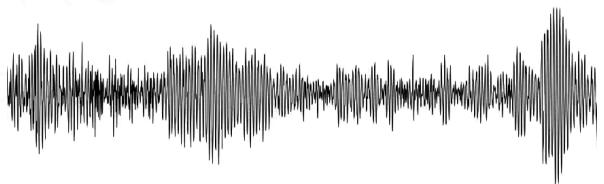

# “听见”函数:探秘音乐与正弦函数

# - 四川省双流中学文卫星数学工作室 余泳

《普通高中数学课程标准(2017年版2020年修订)》中指出“不断引导学生感悟数学的科学价值、应用价值、文化价值和审美价值”。“三角函数”这一章的阅读与思考材料“振幅、周期、频率、相位”，是对三角函数的一个拓展，主要讲音的四要素与正弦函数及其参数之间的关系。本文是笔者对该阅读材料内容的教学分析及教学过程，通过对声音与三角函数之间关系的深度研究和探索，力图让学生认识到数学在音乐发展中的重要作用，感受数学作为基础学科对社会其他领域发展的重要性，拓宽学生对数学学科与其他学科及与生活的多维联系和立体认知。

# 1 教学分析

# 1.1 教学目标

(1)通过探索音的四要素与正弦函数模型中参数、函数定义域、函数叠加之间的关系,进一步加强对正弦函数振幅、频率和函数定义域的直观理解.  
(2)通过对音乐中数学原理的了解,感受数学作为基础学科,对其他领域发展的重要性,提高学习数学的兴趣.  
(3)了解音乐律制的古今发展史,增强民族文化自信.

# 1.2 教学重难点

教学重点:知道声音的音调、响度、音长与纯音模型 $y = A \sin \omega t$ 中 $\omega, A, t$ 之间的关系, 感受音色与正弦函数叠加之间的关系.

教学难点:能选择正确的函数与正弦函数进行运算,以产生声音的不同效果.

# 1.3 学情分析

学生已经学习了三角函数的图象和性质,对三角函数的周期、频率、振幅、初相等都有系统的认识,对函数的图象变换也有一定的了解,具有探究音的四要素与正弦函数之间关系的相关基础.

# 2 教学过程

# 2.1 引入

通过 PPT 播放中国古代琵琶名曲《十面埋伏》中的一小节，并展示对应的波形图(图 1)，从而引入课题.

line

| Time | Amplitude |
|------|---------|
| 0    | 0       |
| 1    | 0.5     |
| 2    | -0.3    |
| 3    | 0.7     |
| 4    | -0.6    |
| 5    | 0.4     |
| 6    | -0.8    |
| 7    | 0.9     |
| 8    | -0.2    |
| 9    | 0.6     |
| 10   | -0.7    |
| 11   | 0.3     |
| 12   | -0.4    |
| 13   | 0.8     |
| 14   | -0.5    |
| 15   | 0.2     |
| 16   | -0.9    |
| 17   | 0.7     |
| 18   | -0.3    |
| 19   | 0.5     |
| 20   | -0.6    |
| 21   | 0.4     |
| 22   | -0.8    |
| 23   | 0.1     |
| 24   | -0.2    |
| 25   | 0.6     |
| 26   | -0.7    |
| 27   | 0.3     |
| 28   | -0.5    |
| 29   | 0.8     |
| 30   | -0.4    |
| 31   | 0.2     |
| 32   | -0.9    |
| 33   | 0.7     |
| 34   | -0.3    |
| 35   | 0.5     |
| 36   | -0.6    |
| 37   | 0.4     |
| 38   | -0.8    |
| 39   | 0.1     |
| 40   | -0.2    |
| 41   | 0.6     |
| 42   | -0.7    |
| 43   | 0.3     |
| 44   | -0.5    |
| 45   | 0.8     |
| 46   | -0.4    |
| 47   | 0.2     |
| 48   | -0.9    |
| 49   | 0.7     |
| 50   | -0.3    |
| 51   | 0.5     |
| 52   | -0.6    |
| 53   | 0.4     |
| 54   | -0.8    |
| 55   | 0.1     |
| 56   | -0.2    |
| 57   | 0.6     |
| 58   | -0.7    |
| 59   | 0.3     |
| 60   | -0.4    |
| 61   | 0.8     |
| 62   | -0.5    |
| 63   | 0.2     |
| 64   | -0.9    |
| 65   | 0.7     |
| 66   | -0.3    |
| 67   | 0.5     |
| 68   | -0.6    |
| 69   | 0.4     |
| 70   | -0.8    |
| 71   | 0.1     |
| 72   | -0.2    |
| 73   | 0.6     |
| 74   | -0.7    |
| 75   | 0.3     |
| 76   | -0.5    |
| 77   | 0.8     |
| 78   | -0.4    |
| 79   | 0.2     |
| 80   | -0.9    |
| 81   | 0.7     |
| 82   | -0.3    |
| 83   | 0.5     |
| 84   | -0.6    |
| 85   | 0.4     |
| 86   | -0.8    |
| 87   | 0.1     |
| 88   | -0.2    |
| 89   | 0.6     |
| 90   | -0.7    |
| 91   | 0.3     |
| 92   | -0.4    |
| 93   | 0.8     |
| 94   | -0.5    |
| 95   | 0.2     |
| 96   | -0.9    |
| 97   | 0.7     |
| 98   | -0.3    |
| 99   | -0.2    |
| 100  | -0.8    |

图1

师:大家喜欢听音乐吗?我们来听一段,当你沉浸在那些美妙的音乐声中时,是否想过为什么我们不用去音乐会现场,也能从手机、电脑等机器中听见音乐家们的演奏吗?其实,这是因为音乐先被转化为了数字信号,而这与我们所学过的某个函数密切相关,大家知道是哪个函数吗?

生:正弦函数.

师:那今天我们一起来“听一听”函数的声音,看看音乐与正弦函数到底有什么样的关系?

设计意图:通过古代琵琶名曲《十面埋伏》的声波视频导入,引发学生思考“为什么不需要在音乐会现场,也能从电脑中听见音乐家们的演奏”.激发学生的兴趣,引入课题.

# 2.2 环节一: 探究音调、响度与 $\omega, A$ 的关系

师:声音是由于物体的振动产生的能引起听觉的波,每一个音都是由纯音合成的,而纯音的数学模型就是 $y = A \sin \omega t$ , 不同的正弦函数到底能发出什么声音呢? 今天我们就来“听听”正弦函数,老师利用纯音的数学模型做了两个正弦型函数,一起来听一听.首先是 $f(x) = \sin x$ , 大家能听到吗? (几何画板展示.)

生:没有听到……(学生有点犹豫)

师:很诚实!那我们接着“听一听”第二个函数 $g(x)=\sin(400\cdot2\pi\cdot x)$ ，能听到吗?

生:哇!(惊叹声)听到了.

师:很神奇,我们居然真地“听”到了函数的声音,那为什么第一个函数听不到呢?这两个函数之间有什么区别吗?大家联系生活实际,思考一下这个问题.

生:它们的频率不一样！人能听到的声音频率是有范围的.

师: 对！大多数人能听到的声音频率是有范围的，在 20～20 000 Hz. 那么，根据这个频率，大家来思考一下， $\omega$ 设置在什么范围内，我们可能可以听到声音？

生 A: $40\pi \sim 40\ 000\pi$ .

师:为什么呢?

生 A: 因为 $\frac{2\pi}{|\omega|}=T=\frac{1}{f}$ ，所以 $|\omega|=2\pi f$ ，则 $|\omega|$ 的范围是 $40\pi\sim40\ 000\pi$ .

师:非常好！为了方便我们看频率,将之写成 $20\cdot2\pi\sim20\ 000\cdot2\pi$ .你们还想听哪个频率的声音?

生:20 Hz.

师:那我们来听一听,听到了吗?这个声音相较于 $g(x)$ ,听起来更怎么样呢?

生:更低沉!

师:大家还想听哪个频率?

生:20 000 Hz.

教师修改了 $\omega$ ，准备播放之前发现大部分学生捂着耳朵，笑着发问.

师:我看很多同学捂着耳朵,看来同学们已经猜到了,这个声音可能会怎样呢?

生:很尖锐!

师:我们听听看猜想是否正确,确实如此!再来听听不同频率的声音……这三个正弦函数的 $\omega$ 不同,声音听起来好像也不太一样,有什么规律吗?当改变 $\omega$ 时,声音的哪个要素发生了变化?

生:音调,音调与 $\omega$ 有关, $\omega$ 越小声音越低沉, $\omega$ 越大声音越尖利.

师: 是的！我们知道音的四要素是音调、响度、音长和音色，音调与 $\omega$ 有关， $\omega$ 越小声音越低沉， $\omega$ 越大声音越尖利.

设计意图:首先设置两个不同频率的的正弦函数让学生听声音,一个能听到,一个不能听到,两个对比让学生快速体会函数与听觉之间的直接联系.通过对人耳能听见的声音频率范围反推 $\omega$ 的取值,既复习了正弦函数中 $\omega$ 与T,f之间的关系,也为后面的教学做了铺垫.让学生自行选择想听的频率的声音,感受不同频率的正弦波发出的声音之间的差别,发现频率与声音四要素之一——音调之间的具体联系.

师:实际上,早在公元前6世纪毕达哥拉斯就发现了这个规律,他还发现当两个音的频率比是2∶1的时候,这两个音听起来几乎是一样的,所以将两个频率比是2∶1的音称为一个八度的关系.

毕达哥拉斯学派一直认为“万物皆数”，他们竭力用数字去表达世界，又发现频率比为3∶2的音也非常和谐悦耳，并由此作为生律要素，提出了五度相生律。

什么意思呢？就是在一个八度内，以1为基音，乘 $\frac{3}{2}$ 得到一个音，再乘 $\frac{3}{2}$ 就是 $\frac{9}{4}$ ，但是 $\frac{9}{4}$ 超过了2，在下一个八度里，该怎么办呢？前面我们讲，他们不是发现频率比为2：1的音听起来几乎是一模一样的吗，所以大家有什么好办法吗？

生 B: 让 $\frac{9}{4}$ 乘 $\frac{1}{2}$ .

师:太棒了! 当时的人们也和 B 同学一样聪明, 他们将 $\frac{9}{4}$ 乘 $\frac{1}{2}$ 就是 $\frac{9}{8}$ , 这样就回到了一个八度内, 然后又乘 $\frac{3}{2}$ ……依次类推, 就可以得到 1 个八度内的音, 这就是西方著名的五度相生律.

但是同学们,你们知道吗,实际上,早在我国春秋时期,管仲就在《管子·地员篇》中提到了此类算法,叫三分损益法.而当时咱们老祖宗自己原创的五个音阶就是宫、商、角、徵、羽,我们常说的五音不全就是这五音.这套规则被称为最和谐的规则.

但是后来由于复调音乐与和声的兴起,音乐家对五度相生律进行了调整,由此诞生了纯律.通过图表可以发现,纯律就是将五度相生律中一些复杂的数简单化,但是这样也丢掉了3:2的比例关系.

再后来音乐家巴赫引入了一套新的规则——十二平均律，这也是现在普遍流行的律制。十二平均律就是将一个八度内的音分为12份，这里运用了等比数列的知识，每个音阶之间的频率比都是 $2^{\frac{1}{12}}$ 。

我们很容易知道,频率成相同倍数的音听起来会更加和谐,所以,想到等比数列应该是很自然的,但是,事实上从纯律到十二平均律,音律的发展停滞了一千多年,这其中的原因是什么呢?其实最主要的原因是在很长的一段时间里, $2^{\frac{1}{12}}$ 算不出来,当时数学的发展没有跟上,所以同学们可以看到数学作为基础学科,其发展进步对社会各领域的发展都极为重要.

实际上，巴赫并不是第一个提出十二平均律的人，我国明朝皇族世子朱载堉就提出了十二平均律，当时叫做新法密律。大家猜这位世子是利用什么工具算出 $2^{\frac{1}{12}}$ 的？

生:(部分同学)算盘?

师:(惊喜)猜对了! 据说,朱载堉为了计算出 $2^{\frac{1}{12}}$ ,专门制作了一个81档的大算盘(如图2),他就凭借这样一个大算盘,将 $2^{\frac{1}{12}}$ 算到小数点后20几位,还算得十分精准.他的毅力和研究精神以及对事业的热爱,真是令人叹服!

  
图2

设计意图:通过对音乐中的生律制发展史的讲解,学生能体会到数学在音乐发展过程中每一个环节上的作用,感受数学作为基础学科对社会其他领域发展的重要性.同时,在讲到五度相生律和十二平均律时,用事实强调我国古代均能早先一步发现这些声音频率间的关系,以期在这个过程中能增强学生的民族文化自信.通过讲述朱载堉为了计算 $2^{\frac{1}{12}}$ ，用专制算盘夜以继日地计算，最终算出非常精确数值的故事，启发学生做事要有恒心和毅力.

师:有了这样的规律,在给定一个标准音的基础上,全世界就有统一的音调,而我们也能轻松找到某个音调的音的频率.下面用几何画板来感受一下……

利用几何画板做出“Do Re Mi Fa Sol La Xi”这几个音的函数，让学生逐一聆听。

学生:(惊讶)哇!

设计意图:用几何画板制作“Do Re Mi Fa Sol La Xi”这几个音的正弦函数并播放,让学生从历史故事回到课堂,从理论转换到实际,学以致用,真真切切直观感受频率对声音音调的影响,感受数学带来的音调美.

师:这是 $\omega$ 对音的影响,那 A 呢?通过 A 对正弦函数图象的影响,试着猜想一下,A 对声音的哪个要素有影响?

生:响度.

师:对！我们一起来感受一下.

教师用几何画板调节 A 值, 从而让学上感受到 A 对声音响度的影响.

设计意图:用连续和离散两种形式去调节纯音模型中的 A 值,让学生感受 A 对声音响度的影响.

# 2.3 环节二: 探究音长、音色与函数定义域和函数叠加之间的关系

师:我们现在知道音调和响度都和这个正弦函数的系数有关,那声音的音长呢?受什么影响呢?(学生讨论.)

生:时间 t.

师: 是的！因为这个函数的定义域是 R, 所以从我们按下按钮那一刻起, 一直能听到声音, 那该怎么做才能让我们只听到 2 秒的声音?

生:限定函数的定义域.

师:对!但是很可惜,几何画板没有自带的限定函数定义域的功能,但是它可以识别函数解析式,通过解析式自动算出函数的定义域.

根据几何画板的这个特性,如果想听 2 秒后的声音,可以怎么处理这个函数呢?(学生讨论.)

生 C: 给这个函数加上一个 $y = \sqrt{x - 2}$ .

师:你认为加上这个函数之后,声音播放会有什么特点?

生 C: (不太确定)应该会在 2 秒后播放吧?

师:那我们一起试一下,看看是不是这样的结果.
(播放几何画板.)

教师播放几何画板后,发现确实如此,学生很惊讶,没有想到定义域还有如此功能!

师:我们现在只想听前两秒的声音,有没有同学能给出解决方案?

生 D: 给这个函数加上一个 $y = \sqrt{x(-x + 2)}$ .

师:为什么是这个函数?

生 D: 因为这个函数可以让定义域为 $[0,2]$ .

师:我们一起听一听.(播放几何画板).确实如此!

设计意图:先让学生思考音长与什么有关,学生比较容易想到时间,进而想到定义域,然后让学生自己通过函数解析式去限函数的定义域.以往学生更多的是根据函数的解析式去求解函数的定义域,而这次是根据定义域去寻找满足的解析式,打破常规,这样的逆向思考可以让学生更好地把握各个函数需要满足的限制条件,使思维更灵活.

通过对音长和纯音模型中定义域的讨论,学生对函数定义域从以前图形上的视觉感受转到听得见的听觉感受,从不同的维度体会函数定义域对函数的影响,从而加深对函数定义域的理解.同时,进一步强化对函数定义域重要性的认识,提醒学生平时处理函数问题时一定要注意定义域.

师:我们发现改变函数定义域会改变声音的播放时长,但是大家仔细听听,虽然确实只播放了2秒,但是好像声音变味了,为什么呢?

生 E: 因为加了一个函数, 振幅会发生变化.

师:非常好!有同学想到了叠加一个函数后,这个函数的图象会发生变化,波形图发生改变,不再是以同一个频率输出,所以声音也发生了变化.

那怎么样才能让声音不变呢？还是保持相同的频率输出吗？

生:再减去 $y=\sqrt{x(-x+2)}$ .

师: 这个想法非常好! 我们来试一下……确实可以!

我们成功让声音只播放了 2 秒,但是这个声音是戛然而止的,听起来没有任何感情,大多数时候我们可能更希望声音是逐渐消失的,又该怎么办呢?(学生讨论.)

生 F: 可以给正弦函数乘一个递减的函数.

师:这个想法很有创造性,那你想乘哪个函数?

生 F: 可以乘 y = -x.

师:好的,那我们来试一下……咦?怎么和我们想的不一样,声音反而越来越高了,怎么回事?

学生都很诧异,部分学生小声嘀咕:绝对值越来越大……

师: 是的, x 从 0 增加到 2 时, 函数值确实是在减小, 但是其绝对值实际上在增大, 那为什么响度会越来越大呢?

生: 函数值的绝对值越来越大, 相当于振幅越来越大, 所以响度越来越大.

师:非常好！给函数乘2会让振幅变为原来的2倍,乘(-2)呢?振幅还是会变为原来的2倍,只是这个函数图象要比前一个乘2的函数图象多了一个变换步骤,就是,再将函数图象进行……?

生:翻折.

师:既然如此,这个函数就不能达到我们想要的效果,有选择其他函数的同学吗?

生 E: 我选的是 $y=\frac{1}{x}$ .

师:我们一起来试一下.(用几何画板制作后播放.)

生:(开心)哇!

师:我们成功了!声音逐渐在减小,只是为什么一开始的声音会那么大呢?

生:(部分同学)因为 x 趋向于 $0^{+}$ 时, $\frac{1}{x}$ 会趋向于正无穷, 所以一开始声音特别大.

师:嗯!有道理,那还有选择其他函数的吗?可以在0秒时,响度不变吗?

生:可以试一下指数函数 $y=\left(\frac{1}{2}\right)^{x}$ .

师:我们一起来试一下.非常好!声音逐渐减弱了,但是好像力度不够,所以最后听起来还是有点突然,怎么办?

生: 减小底数, 让函数减得更快点.

师:好的,我们一起来试一下 $y=\left(\frac{1}{5}\right)^{x}$ ……成功了! 这样的声音就非常自然,经过多次尝试和失败,我们终于找到了一个完美的解决方案.人生有时候也是这样,最开始的尝试可能会失败,但是只要我们坚持不懈,不断去尝试和修正,最终总能找到好的解决办法,走向成功.

实际上我们还可以用其他函数,也能达到这样的效果,比如……(举例符号函数等等)

通过调节函数的响度、初相等,我们还可以自己用几何画板制作一曲美妙的音乐.

用几何画板播放提前利用函数制作的《茉莉花》片段,学生感叹不已,情不自禁发出了掌声.

设计意图: 在学生已经能通过函数定义域限制声音播放时长以后, 又提出新的问题——函数的声音为什么听起来发生了改变? 如何修正这样的改变? 学生能够很容易联想到, 加上新的函数后函数图象发生了一些变化, 那么对应的波形图就会发生变化, 所以解决这个问题的办法就是再减去这个函数. 接着提出新的问题——如何让声音出现渐弱的效果, 学生会运刚刚所学到的响度与 A 之间的关系去思考, 可以利用减函数达到大家想要的效果, 这说明学生已经会用数学的眼光去看待问题. 然后用 y = -x, $y = \frac{1}{x}$ , y =

$\left(\frac{1}{2}\right)^{x}$ ……分别乘正弦函数.通过探究的方式,经历从失败到成功,一步一步找出最符合要求的函数,不仅让学生对函数的变换有更深刻的理解,也培养了学生勇于探索、屡败屡战的探究精神.

最后,教师通过提前利用几何画板制作好的《茉莉花》片段,让学生再次感受本节课所讲内容的实用性,进一步加深对数学广博应用的直观认识,激发对数学学习的兴趣.

现在,我们发现声音的三个要素都和数学有密切关系,那最后一个要素,音色呢,大家觉得它和数学有关吗?

部分同学说没有,部分同学认为有.

师:每种乐器都有自己特有的音色,但实际上我们听不同的物体发出的声音音色不同是因为物体振动时发出的波的振动特点不一样.著名数学家傅里叶发现,所有的声波都是由正弦波叠加而形成的,也就是说,我们现在听到的声音基本都是复合音,而这些复合音都是由纯音所组成的,当叠加不同频率的音时,所听到的声音就不太一样.下面我们一起来用GeoGebra感受下函数图象叠加的效果.

生:哇!

设计意图:在学了音的前三个要素和数学的关系后,以直接演示的方式,向学生展示大千世界五彩斑斓的音色是如何用数学来解构的.将一串复合音分解成多个纯音之后,再将这些纯音一个一个叠加上去,让学生在看到波形曲线一条一条增加的同时,能听到声音神奇地从一个单音逐渐变化、不断接近、最后变成最开始听到的复合音的神奇过程,让学生从视觉和听觉的角度去直观感受波的叠加的概念和效果,播下一颗好奇的种子,留下无尽的可能让学生去探索.

师:没想到吧,感性的音乐和理性的数学之间的联系竟然如此紧密,音的四要素居然都和数学有关.

生:太神奇了!

师:爱因斯坦曾经说过,这个世界可以由音乐的音符组成,也可由数学的公式组成.莱布尼茨曾说,音乐是数学在灵魂中无意识的运算.

本文通过展示和探究的方式,运用几何画板和GeoGebra等辅助教学工具,从音乐的四要素与正弦函数的各参数之间的关系展开神秘探究之旅,深化了学生对函数特性的认识,强化了学生对声音本质的认知,圆满实现了“引人注意、育人立德、文化自信、多元融合”的教学目标.当然,也正如课后老师的点评所提到的,课程在结尾处乐曲的正弦函数的叠加和展开中细化,以及课程的探究过程中学生自行运用软件来操作的比重提高等方面还有进一步优化提升的空间.Z