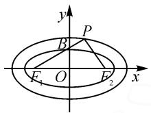
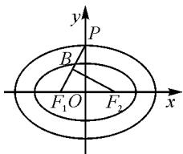
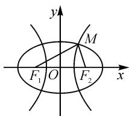

# 一道共焦点椭圆问题的解法探究

# 江苏省常州市金坛区第一中学 宫鸡明

涉及共焦点的圆锥曲线(包括椭圆、双曲线、抛物线等曲线自身或不同曲线之间)问题,场景创新新颖,问题小巧玲珑,知识融合度高,信息处理量大,成为综合考查圆锥曲线知识模块的“四基”与“四能”的一个重要载体,也是近年高考中比较常见的一类热点题型.

此类共焦点的圆锥曲线问题,经常以相关代数式的最值或取值范围等形式加以设置,解题时合理挖掘共焦点的圆锥曲线中对应曲线之间的位置关系,入口较宽、切入点多,解题思路宽阔,解法灵活多样,契合“三新”理念,备受命题者的青睐.

# 1 问题呈现

问题 如图1所示,椭圆 $C_{1}$ : $\frac{x^{2}}{a_{1}^{2}}+\frac{y^{2}}{b_{1}^{2}}=1(a_{1}>b_{1}>0)$ 和 $C_{2}$ $\frac{x^{2}}{a_{2}^{2}}+\frac{y^{2}}{b_{2}^{2}}=1(a_{2}>b_{2}>0)$ 有相同的焦点 $F_{1}, F_{2}$ , 离心率分别为 $e_{1}$ , $e_{2}, B$ 为椭圆 $C_{1}$ 的上顶点, $F_{2}P \perp F_{1}P, F_{1}, B, P$ 三点共线且垂足 $P$ 在椭圆 $C_{2}$ 上, 则 $\frac{e_{1}}{e_{2}}$ 的最大值是 \_\_\_\_.

  
图1

借助共焦点的两个椭圆之间的位置关系,通过对应焦半径之间的垂直关系创新设置,进而求解这两个椭圆的离心率比值的最值,合理融入平面解析几何与平面几何的相关知识与应用.

涉及圆锥曲线中的代数式的最值或取值范围问题,往往要借助条件场景的转化,落实到函数与方程、三角函数或不等式等知识上,进而选择合适的变量表达场景来分析与应用,这是破解问题中至关重要的一环.

# 2 问题破解

解法 1: 角参法.

设 $\angle PF_{1}F_{2} = \alpha, \alpha \in \left(0, \frac{\pi}{2}\right), |F_{1}F_{2}| = 2c$ ，由于 $F_{2}P \perp F_{1}P$ ，且 $B$ 为椭圆 $C_{1}$ 的上顶点，可得 $|PF_{1}| + |PF_{2}| = 2c (\cos \alpha + \sin \alpha), |BF_{1}| = a_{1} = \frac{c}{\cos \alpha}$ .

而椭圆 $C_{1}$ 和 $C_{2}$ 有相同的焦点 $F_{1}, F_{2}$ ，所以 $\frac{e_{1}}{e_{2}} = \frac{\frac{2c}{2a_{1}}}{\frac{2c}{2a_{2}}} = \frac{2a_{2}}{2a_{1}} = \frac{|PF_{1}| + |PF_{2}|}{2|BF_{1}|} = \frac{2c(\cos\alpha + \sin\alpha)}{\frac{2c}{\cos\alpha}} =$

$(\cos \alpha + \sin \alpha) \cos \alpha = \cos^2 \alpha + \sin \alpha \cos \alpha = \frac{1 + \cos 2\alpha}{2} + \frac{1}{2} \sin 2\alpha = \frac{\sqrt{2}}{2} \sin \left(2\alpha + \frac{\pi}{4}\right) + \frac{1}{2} \leqslant \frac{\sqrt{2} + 1}{2}$ , 当且仅当 $2\alpha + \frac{\pi}{4} = \frac{\pi}{2}$ , 即 $\alpha = \frac{\pi}{8}$ 时, 等号成立.

故 $\frac{e_{1}}{e_{2}}$ 的最大值是 $\frac{\sqrt{2}+1}{2}$ .

点评:根据题设场景引入角参,通过两直线垂直的关系,在相应的直角三角形内,结合三角函数的定义来合理表示对应的边长,进而将所求的代数式转化为有关角参的三角函数表达式,借助三角函数的图象与性质来确定对应的最值或取值范围.角参法的应用,往往依托直角三角形或解三角形(正弦定理或余弦定理)等思维来转化与应用,借助三角函数的图象与性质来实现问题的求解.

解法 2: 线参法 1.

设 $|PB|=m,|PF_{2}|=n$ ，而 $|F_{1}F_{2}|=2c$ ，设t= $\frac{e_{1}}{e_{2}}=\frac{\frac{2c}{2a_{1}}}{\frac{2c}{2a_{2}}}=\frac{a_{2}}{a_{1}}>0$ ，则 $a_{2}=ta_{1}$ .

在椭圆 $C_2$ 中，由椭圆的定义知 $\left|PF_1\right| + \left|PF_2\right| = m + a_1 + n = 2a_2$ ，即 $m + n = 2a_{2} - a_{1}$

由于 $F_{2}P \perp F_{1}P$ ，因此在 $Rt\triangle PBF_{2}$ 中，利用勾股定理可得 $m^{2} + n^{2} = a_{1}^{2}$ .

而 $\frac{(m + n)^2}{m^2 + n^2} = \frac{(2a_2 - a_1)^2}{a_1^2} = \frac{(2ta_1 - a_1)^2}{a_1^2} = (2t - 1)^2,$

利用基本不等式，可得 $(2t - 1)^{2} = \frac{(m + n)^{2}}{m^{2} + n^{2}} = 1+$ $\frac{2mn}{m^2 + n^2}\leqslant 1 + \frac{2mn}{2mn} = 2$ ，当且仅当 $m = n$ 时等号成立.

解不等式 $(2t - 1)^{2}\leqslant 2$ ，可得 $\frac{1 - \sqrt{2}}{2}\leqslant t\leqslant \frac{1 + \sqrt{2}}{2},$ 而 t>0，所以 $0<t\leqslant\frac{1+\sqrt{2}}{2}$ . 故 $\frac{e_{1}}{e_{2}}$ 的最大值是 $\frac{1+\sqrt{2}}{2}$ .

解法 3: 线参法 2.

以上部分同解法 2.

利用不等式的性质可得 $(m+n)^{2}\leqslant2(m^{2}+n^{2})$ ，当且仅当m=n时，等号成立.

所以 $\frac{e_1}{e_2} = \frac{\frac{2c}{2a_1}}{\frac{2c}{2a_2}} = \frac{a_2}{a_1} = \frac{m + n + a_1}{2\sqrt{m^2 + n^2}} =$

$$
\frac {m + n + \sqrt {m ^ {2} + n ^ {2}}}{2 \sqrt {m ^ {2} + n ^ {2}}} \leqslant \frac {\sqrt {2 (m ^ {2} + n ^ {2})} + \sqrt {m ^ {2} + n ^ {2}}}{2 \sqrt {m ^ {2} + n ^ {2}}} =
$$

$\frac{\sqrt{2}+1}{2}$ ，即 $\frac{e_{1}}{e_{2}}$ 的最大值是 $\frac{1+\sqrt{2}}{2}$ .

点评:根据题设场景引入线参,通过两直线垂直的关系,在相应的直角三角形内,利用勾股定理或解三角形思维来构建等量关系,合理变形并转化所求的代数式,结合关系式的结构特征,或利用基本不等式来合理放缩,或齐次化处理等通过函数与方程思维来处理等,从而得以确定对应的最值或取值范围.线参法的应用,往往依托直角三角形或代数式变形思维来转化与应用,借助函数与导数的综合应用、不等式思维等来实现问题的求解.

# 3 变式拓展

# 3.1 改变位置

变式 1 如图 2 所示, 椭圆 $C_{1}:\frac{x^{2}}{a_{1}^{2}}+\frac{y^{2}}{b_{1}^{2}}=1(a_{1}>b_{1}>0)$ 和

$C_{2}:\frac{x^{2}}{a_{2}^{2}} +\frac{y^{2}}{b_{2}^{2}} = 1(a_{2} > b_{2} > 0)$ 有相同的焦点 $F_{1}, F_{2}$ , 离心率分别为$e_{1},e_{2},P$ 为椭圆 $C_{2}$ 的上顶点， $PF_{1}$ 与椭圆 $C_{1}$ 交于点 B，若 $BF_{2}\perp PF_{1}$ ，则 $\frac{e_{1}}{e_{2}}$ 的最小值是 \_\_\_\_.

text_image

y
P
B
F₁O
F₂
x

图 2

解析: 设 $\angle PF_{1}F_{2}=\alpha, \alpha\in\left(0,\frac{\pi}{2}\right), |F_{1}F_{2}|=2c.$

由于 $P$ 为椭圆 $C_1$ 的上顶点， $BF_2 \perp PF_1$ ，则 $|BF_1| + |BF_2| = 2c(\cos \alpha + \sin \alpha), |PF_1| = a_2 = \frac{c}{\cos \alpha}$ . 而椭圆 $C_1$ 和 $C_2$ 有相同的焦点 $F_1, F_2$ ，所以

$$
\begin{array}{l} \frac {e _ {1}}{e _ {2}} = \frac {2 a _ {2}}{2 a _ {1}} \frac {\frac {2 c}{\cos \alpha}}{2 c (\cos \alpha + \sin \alpha)} = \frac {1}{(\cos \alpha + \sin \alpha) \cos \alpha} = \\ \frac {2}{\sqrt {2} \sin \left(2 \alpha + \frac {\pi}{4}\right) + 1}. \end{array}
$$

因为 $\alpha \in \left(0, \frac{\pi}{2}\right)$ , 则 $2\alpha + \frac{\pi}{4} \in \left(\frac{\pi}{4}, \frac{5\pi}{4}\right)$ , 于是 $\sin \left(2\alpha + \frac{\pi}{4}\right) \in \left(-\frac{\sqrt{2}}{2}, 1\right]$ , 可得 $\sqrt{2} \sin \left(2\alpha + \frac{\pi}{4}\right) + 1 \in (0, \sqrt{2} + 1]$ , 所以 $\frac{e_1}{e_2} = \frac{2}{\sqrt{2} \sin \left(2\alpha + \frac{\pi}{4}\right) + 1} \in \left[\frac{2}{\sqrt{2} + 1}, +\infty\right)$ .

故 $\frac{e_{1}}{e_{2}}$ 的最小值是 $\frac{2}{\sqrt{2}+1}=2\sqrt{2}-2.$

# 3.2 改变曲线

变式 2 如图 3 所示, 设 $F_{1}$ , $F_{2}$ 同时为椭圆 $C_{1}:\frac{x^{2}}{a^{2}}+\frac{y^{2}}{b^{2}}=1$ $(a>b>0)$ 与双曲线 $C_{2}:\frac{x^{2}}{a_{1}^{2}}-\frac{y^{2}}{b_{1}^{2}}=1(a_{1}>0,b_{1}>0)$ 的左、右焦

text_image

y
M
F₁ O F₂ x

图3

点，设椭圆 $C_1$ 与双曲线 $C_2$ 在第一象限内交于点 $M$ ，椭圆 $C_1$ 与双曲线 $C_2$ 的离心率分别为 $e_1, e_2, O$ 为坐标原点，若 $\left|F_1F_2\right| = 4\left|MF_2\right|$ ，则 $\frac{1}{e_1^2} + \frac{1}{e_2^2}$ 的取值范围是 \_\_\_\_.

# 4 教学启示

# 4.1 合理思路归纳,技巧方法总结

涉及共焦点的圆锥曲线(包括椭圆、双曲线、抛物线等曲线自身或不同曲线之间)问题,关键是抓住曲线之间的位置关系,通过圆锥曲线的定义以及相关公式,合理将各相应的参数加以巧妙联系,借助参数的引入或代数式的变形,合理进行消参处理,将问题转化为熟悉的函数与导数的综合应用、三角函数的解析式、不等式的基本性质等方面的问题,进而加以合理放缩与分析求解.

# 4.2 倡导“一题多解”, 培养核心素养

在平时的教学中,借助“一题多解”,可以很好地帮助学生拓展数学思维能力,发散数学思维,成为培养数学思维方面比较重要的一种教学方式.而基于典型问题的“一题多解”,又可以融合众多的数学知识与数学技能,促使学生有效感悟数学之美;又合理串联起“一题多变”,实现“一题多得”“一题多思”“多题一解”等方面的综合效果,从而更加有效地培养学生思维的发散性与开拓性,开拓学生视野,提升数学关键能力,优化数学思维品质,培养学生的核心素养.Z