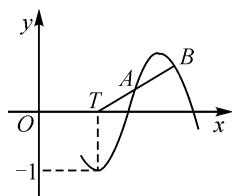

# 似繁实简巧创设,精彩思维妙切入

# ● 江苏省华罗庚中学 席国金

三角函数的图象与性质是三角函数模块知识的一个重点,是充分展示“数”与“形”的巧妙结合,也是解决三角函数综合应用问题中的一个重要切入点.借助三角函数图象的直观性,从“形”的特殊性中抽象出对应的“数”的属性,合理数形结合,成为解决此类问题的基本思维方式,也是每年高考命题与考查的一个重要方向,备受各方关注.

# 1 问题呈现

问题（2024届湖北省武汉市高中毕业生二月调研考试数学试卷·7）如图1，在函数 $f(x)=\sin(\omega x+\varphi)$ 的部分图象中，若 $\overrightarrow{TA}=\overrightarrow{AB}$ ，则点A的纵坐标为（ ）.

text_image

y
A
B
O
T
x
-1

图 1

A. $\frac{2-\sqrt{2}}{2}$

B. $\frac{\sqrt{3}-1}{2}$

C. $\sqrt{3}-\sqrt{2}$

D. $2 - \sqrt{3}$

此题以正弦型函数的部分图象为问题场景,利用x轴上的一点与正弦型函数图象上的两点所满足的平面向量关系式“ $\overrightarrow{TA}=\overrightarrow{AB}$ ”来合理创设,以图的形式来设置三点之间的位置关系,“数”与“形”巧妙结合,合理直观想象,进而确定对应三点中位于中间位置的点A的纵坐标.

以数形结合的形式加以直观设置,题目简洁明了,是一道全面考查能力立意的好题,其中涉及的数学知识层面包括三角函数的图象与性质、平面向量的线性关系、中点坐标公式以及三角恒等变换公式及其应用等,数学能力层面包括数形结合思想、化归与转化思想以及函数与方程思想等,是有效考查考生“四基”与“四能”的一道基本创新题,值得好好学习与探究.

# 2 问题破解

解法 1: 换元思维.

设 $\omega x + \varphi = t$ ，则 $f(x) = \sin(\omega x + \varphi) = \sin t = y$ .

由 $\sin t = -1$ ，可取 $t = \frac{3\pi}{2}$ 设 $A(\theta, \sin \theta)$ ，由 $\overrightarrow{TA} = \overrightarrow{AB}$ 可知， $A$ 是 $TB$ 的中点，所以 $x_B = 2\theta - \frac{3\pi}{2}$ ，

$$
y _ {B} = 2 y _ {A} = 2 \sin \theta .
$$

而 $2\sin \theta = y_{B} = \sin x_{B} = \sin \left(2\theta -\frac{3\pi}{2}\right) = \cos 2\theta =$ $1 - 2\sin^2\theta$ ，则有 $2\sin^2\theta +2\sin \theta -1 = 0$ ，解得 $\sin \theta =$ $\frac{\sqrt{3} - 1}{2}$ 或 $\sin \theta = \frac{-\sqrt{3} - 1}{2} <  - 1$ （舍去）.

故点 A 的纵坐标为 $\frac{\sqrt{3}-1}{2}$ . 故选: B.

解法 2: 整体思维.

不失一般性,不妨设 $\omega x + \varphi = \frac{3\pi}{2}$ , 解得 $x = \frac{3\pi}{2\omega} - \frac{\varphi}{\omega}$ , 即 $T\left(\frac{3\pi}{2\omega} - \frac{\varphi}{\omega}, 0\right)$ .

设 $A(x_{1},y_{1}), B(x_{2},y_{2})$ ，由 $\overrightarrow{TA}=\overrightarrow{AB}$ ，可得 $\left\{\begin{aligned}&x_{2}+\frac{3\pi}{2\omega}-\frac{\varphi}{\omega}\\&2\end{aligned}\right.$ = $x_{1}$ ，即 $\left\{\begin{aligned}x_{2}=2x_{1}-\frac{3\pi}{2\omega}+\frac{\varphi}{\omega},\\ y_{2}=2y_{1}.\end{aligned}\right.$

所以 $2y_{1} = y_{2} = f(x_{2}) = f\left(2x_{1} - \frac{3\pi}{2\omega} +\frac{\varphi}{\omega}\right) =$ $\sin \left[\omega \left(2x_1 - \frac{3\pi}{2\omega} +\frac{\varphi}{\omega}\right) + \varphi \right] = \sin \left(2\omega x_1 - \frac{3\pi}{2} +2\varphi\right) =$ $\cos (2\omega x_1 + 2\varphi) = \cos 2(\omega x_1 + \varphi) = 1 - 2\sin^2 (\omega x_1 + \varphi) =$ $1 - 2y_{1}^{2}$ ，即 $2y_{1}^{2} + 2y_{1} - 1 = 0$ ，解得 $y_{1} = \frac{\sqrt{3} - 1}{2}$ 或 $y_{1} =$ $\frac{-\sqrt{3} - 1}{2}$ （借助图形可知， $y_{1} > 0$ ，舍去）.

故点 A 的纵坐标为 $\frac{\sqrt{3}-1}{2}$ . 故选: B.

解法 3: 转化思维.

依题意,其可等价转化为如下背景更为简单的问题:在 $y = -\cos x$ 中,T 为坐标原点,若 $\overrightarrow{TA} = \overrightarrow{AB}$ , 求点 A 的纵坐标.

设 $A(\theta, -\cos \theta)$ , 由 $\overrightarrow{TA} = \overrightarrow{AB}$ 可知, $A$ 是 $TB$ 的中点, 则有 $B(2\theta, -2\cos \theta)$ .

而点 $B$ 在 $y = -\cos x$ 上，则有 $-2\cos \theta = -\cos 2\theta = 1 - 2\cos^2\theta$ ，即 $2\cos^2\theta - 2\cos \theta - 1 = 0$ ，解得

$\cos \theta = \frac{1 - \sqrt{3}}{2}$ 或 $\cos \theta = \frac{1 + \sqrt{3}}{2}$ （由于 $\frac{1 + \sqrt{3}}{2} > 1$ ，舍去）.

故点 A 的纵坐标为 $-\cos \theta = \frac{\sqrt{3} - 1}{2}$ . 故选: B.

解法 4: 特殊思维.

取特殊函数 $f(x)=\sin x$ ，则设 $T\left(\frac{3\pi}{2},0\right)$ ， $A(x_{1},\sin x_{1})$ ，结合 $\overrightarrow{TA}=\overrightarrow{AB}$ ，可求得点 B 的坐标为 $B\left(2x_{1}-\frac{3\pi}{2},\sin\left(2x_{1}-\frac{3\pi}{2}\right)\right)$ .

由 $\overrightarrow{TA} = \overrightarrow{AB}$ 可知， $A$ 是 $TB$ 的中点，于是有 $\sin \left(2x_{1} - \frac{3\pi}{2}\right) = 2\sin x_{1}$ ，即 $\cos 2x_{1} = 2\sin x_{1}$ ，亦即 $1 - 2\sin^2 x_1 = 2\sin x_1$ ，解得 $\sin x_1 = \frac{-1 + \sqrt{3}}{2}$ 或 $\sin x_1 = \frac{-1 - \sqrt{3}}{2}$ （由于 $\frac{-1 - \sqrt{3}}{2} < -1$ ，舍去）.

故点 A 的纵坐标为 $\sin x_{1}=\frac{\sqrt{3}-1}{2}$ . 故选: B.

点评:以上方法中,解法1的换元思维与解法2的整体思维基本相似,均是借助中点坐标公式加以巧妙转化,借助二倍角公式建立对应的方程来转化与应用;而解法3是基于问题求解对应点的纵坐标,对正弦型函数的图象进行必要的平移转化来达到目的;而解法4是在解法3思维的基础上进一步加以特殊化处理,从而得以快捷分析与处理.各种方法各有各的技巧与策略,成就此题的精彩与创新特色.

解法 1 中的换元思维, 巧在复杂问题简单化, 将正弦型函数问题转化为简单的正弦函数问题, 处理起来更加简单快捷; 解法 2 中的整体思维, 其巧妙之处与解法 1 类似, 破解的关键在于化复杂的三角函数问题为简单的三角函数问题, 使得问题处理更加精炼; 解法 3 中的转化思维, 巧在挖掘问题本质, 合理进行三角函数问题的巧妙变形与转化, 给问题的切入与应用创造条件; 解法 4 中的特殊思维, 是“小题小做”的重要体现, 巧在不失一般性, 借助特殊三角函数的应用来分析与应用, 给问题的解决创造更加简捷的条件.

根据正弦型函数部分图象的场景设置,而求解的只是其中一个点的纵坐标,这就给问题的切入提供了更多的创新思维,其中最为常见的是以上不同解决方法中的换元思维、整体思维、转化思想以及特殊思维等,各自从不同层面加以合理切入,综合利用数学中相关的三角函数、平面向量、平面解析几何以及函数与方程等交汇知识点来分析与应用,实现问题的合理综合与巧妙应用.

# 3 变式拓展

# 3.1 关系变式

基于原问题及其解析过程,抓住题设条件中关系之间的变化加以合理变形与变式应用,得到以下对应的变式问题.

变式 1 如图 1(同原问题图), 在函数 $f(x)=\sin(\omega x+\varphi)$ 的部分图象中, 若 A 是 TB 的中点, 则点 A 的纵坐标为().(B)

A. $\frac{2-\sqrt{2}}{2}$

B. $\frac{\sqrt{3}-1}{2}$

C. $\sqrt{3}-\sqrt{2}$

D. $2-\sqrt{3}$

变式 2 如图 1(同原问题图), 在函数 $f(x)=\sin(\omega x+\varphi)$ 的部分图象中, 若 $2\overrightarrow{OA}=\overrightarrow{OT}+\overrightarrow{OB}$ , 则点 A 的纵坐标为().(B)

A. $\frac{2-\sqrt{2}}{2}$

B. $\frac{\sqrt{3}-1}{2}$

C. $\sqrt{3}-\sqrt{2}$

D. $2-\sqrt{3}$

解决变式 1 与变式 2 时,由于条件“A 是 TB 的中点”或“ $2\overrightarrow{OA}=\overrightarrow{OT}+\overrightarrow{OB}$ ”与原问题中的条件“ $\overrightarrow{TA}=\overrightarrow{AB}$ ”是等价的,只是用另一种方式来表达而已,因此变式 1 和变式 2 与原问题的解法一样.

# 3.2 表达式变形

基于原问题及其解析过程,抓住题设条件中表达式的形式,以另外一种方式来变化与应用,得到以下对应的变式问题.

变式 3 如图 1(同原问题图), 在函数 $f(x)=\sin(\omega x+\varphi)$ 的部分图象中, 若 $\overrightarrow{TA}=\frac{1}{2}\overrightarrow{AB}$ , 则点 A 的纵坐标为 \_\_\_\_. (答案:0.)

解决变式 3, 可直接通过数形结合即可得以分析与判断, 此时点 T, A, B 均在 x 轴上, 这里不多加展开.

当然,还可进一步深入探究,依托 $\overrightarrow{TA}$ 与 $\overrightarrow{AB}$ 之间的不同倍数关系来设置,只是在问题分析与三角关系式的变形过程中,数学运算量以及公式变换方面都有会有一定的困难,这里不再加以深化.

# 4 教学启示

在解决涉及三角函数的图象与性质的综合应用问题时,要从三角函数的图象的“形”的结构特征方面加以展开,合理回归三角函数“数”的基本属性,数形结合,巧妙应用.基于三角函数的图象与性质的综合应用,往往会巧妙整合平面向量、函数与方程、不等式、平面几何等其他相关知识,合理利用一些相关的交汇知识加以综合与应用,从而有效实现知识与技巧的融合,全面考查数学的“四基”,全面落实数学的“四能”,有效提升数学关键能力,养成良好的数学解题习惯,形成优良的数学思维品质,培养数学核心素养.Z