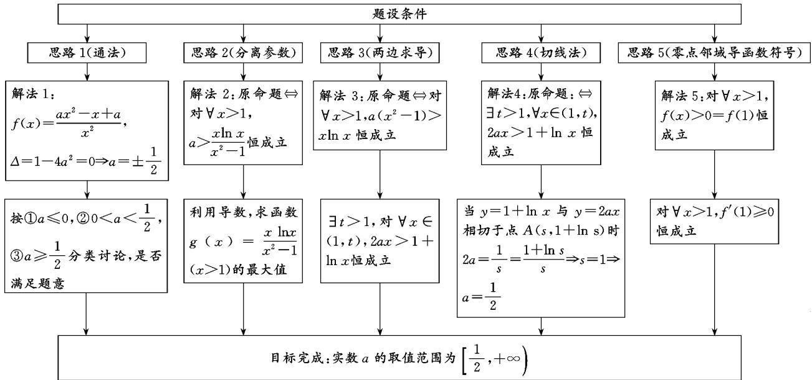
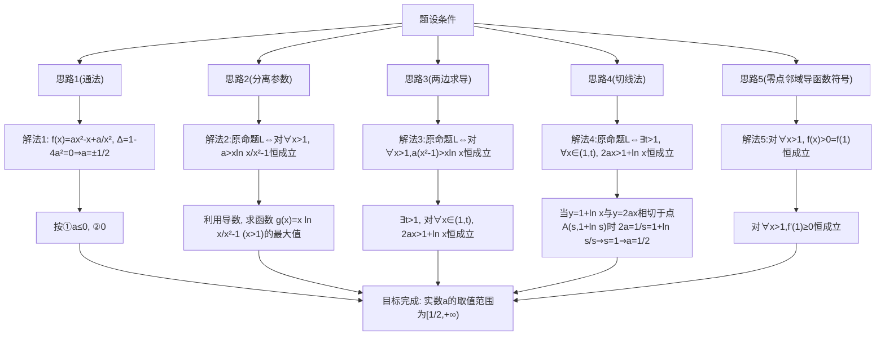

# 例谈用思维导图解压轴题

# 江苏省连云港市东海县石榴高级中学 龚本玉 王江苏

摘要:文中结合2023年连云港市高三第二次调研测试的压轴题,利用思维导图把思路可视化,给出了5种思路及对应的解法,展示了如何利用思维导图分析求解压轴题.

关键词: 思维导图; 压轴题

# 1题目

(2023年连云港市高三第二次调研测试第22题)已知函数 $f(x)=ax-\ln x-\frac{a}{x}$ .

(1) 若 $x > 1, f(x) > 0$ ，求实数 $a$ 的取值范围；  
(2) 设 $x_{1}, x_{2}$ 是函数 $f(x)$ 的两个极值点, 证明:

$$
\left| f \left(x _ {1}\right) - f \left(x _ {2}\right) \right| <   \frac {\sqrt {1 - 4 a ^ {2}}}{a}.
$$

考查目标: 考查不等式恒成立时参数的取值范围, 双极值、双零点问题, 以及绝对值不等式的证明问题. 涉及到等价转化、分类讨论、数形结合、函数与方程的数学思想方法. 难度极大.

# 2 解法分析及详解

本文中仅对第(1)问进行探讨.

思路 1:由于已知函数的导函数的分子为二次函数,其二次项系数含有参数,因此需依据二次项系数与判别式的具体情况分类讨论函数的单调性.

思路 2: 解决恒成立问题的基本思路是等价转化. 遇到含有参数的问题时, 能分离则尽量分离参数.

思路 3: 解决恒成立问题的基本思路是等价转化. 如果遇到形如“对 $\forall x \geqslant 0$ 时, $f(x) \geqslant g(x)$ 或 $f(x) \leqslant g(x)$ 恒成立, 其中 $g(x)$ 含有参数 a, 求参数 a 的范围”的问题, 可利用高等数学的有关结论快速解答.

思路 4: 解决恒成立问题的基本思路, 是等价转化. 如果遇到形如“ $ax + b \geqslant f(x)$ 或 $ax + b \leqslant f(x)$ 恒成立, 其中 a 为参数, 求参数 a 的范围”的问题, 可使用切线法探究参数范围, 涉及到数形结合的数学思想方法.

思路 5: 解决恒成立问题的基本思路是等价转化. 如果遇到形如“ $ax + b \geqslant f(x)$ 或 $ax + b \leqslant f(x)$ 恒成立, 其中 a 为参数, 求参数 a 的范围”的问题, 可借助零点邻域导函数符号探究参数范围, 涉及到数形结合的数学思想方法.

思维导图如图 1 所示.

flowchart

图1

解法 1: (通法——分类讨论)

依据题意,知 $f'(x)=a-\frac{1}{x}+\frac{a}{x^{2}}=\frac{ax^{2}-x+a}{x^{2}}$ . 当 $a\neq0$ 时,由函数 $y=ax^{2}-x+a$ 值的判别式 $\Delta=1-4a^{2}=0$ , 得 $a=\pm\frac{1}{2}$ .

① 当 $a \leqslant 0$ 时，由 $x > 1$ 知 $f'(x) < 0$ ，则 $f(x)$ 在 $(1, +\infty)$ 上单调递减， $f(x) < f(1) = 0$ ，即 $a \leqslant 0$ 不满足题意.

② 当 $0 < a < \frac{1}{2}$ 时，由 $f'(x) = 0$ ，得

$$
x _ {1} = \frac {1 - \sqrt {1 - 4 a ^ {2}}}{2 a} \in (0, 1),
$$

$$
x _ {2} = \frac {1 + \sqrt {1 - 4 a ^ {2}}}{2 a} \in (1, + \infty).
$$

所以 $\forall x\in(1,x_{2})$ 时， $f'(x)<0$ 则， $f(x)<f(1)=0$ ，不满足题意.

③当 $a \geqslant \frac{1}{2}$ 时， $\Delta = 1 - 4a^{2} < 0, f'(x) \geqslant 0$ ，则 $f(x)$ 在 $(1, +\infty)$ 上单调递增， $f(x) > f(1) = 0$ .

综上,实数 a 的取值范围为 $\left[\frac{1}{2},+\infty\right)$ .

解法 2: (等价转化——分离参数)

对 $\forall x>1, f(x)>0$ 恒成立

$\Leftrightarrow$ 对 $\forall x > 1, ax - \ln x - \frac{a}{x} > 0$ 恒成立

$\Leftrightarrow$ 对 $\forall x > 1, a\left(x - \frac{1}{x}\right) > \ln x$ 恒成立

$\Leftrightarrow \forall x > 1, a(x^{2} - 1) > x \ln x$ 恒成立

$\Leftrightarrow$ 对 $\forall x>1,a>\frac{x\ln x}{x^{2}-1}$ 恒成立

$\Leftrightarrow$ 对 $\forall x>1,a>g(x)$ 恒成立，

其中 $g(x)=\frac{x\ln x}{x^{2}-1}(x>1)$ ，则

$$
g ^ {\prime} (x) = \frac {(1 + \ln x) (x ^ {2} - 1) - (x \ln x) \cdot 2 x}{(x ^ {2} - 1) ^ {2}} =
$$

$$
\frac {x ^ {2} - 1 - \left(x ^ {2} + 1\right) \ln x}{\left(x ^ {2} - 1\right) ^ {2}} = \frac {p (x)}{\left(x ^ {2} - 1\right) ^ {2}},
$$

其中 $p(x) = x^{2} - 1 - (x^{2} + 1)\ln x(x > 1)$ ，则

$$
p ^ {\prime} (x) = 2 x - 2 x \ln x - \frac {x ^ {2} + 1}{x} = x - \frac {1}{x} - 2 x \ln x,
$$

$$
p ^ {\prime \prime} (x) = 1 + \frac {1}{x ^ {2}} - 2 (1 + \ln x) = \frac {1}{x ^ {2}} - 1 - 2 \ln x,
$$

$$
p ^ {\prime \prime \prime} (x) = - \frac {2}{x ^ {3}} - \frac {2}{x} <   0 (x > 1).
$$

（注：含有自然对数的线性函数，经过若干次求导之后，转化为基本初等函数，容易研究其符号。）

故 $p''(x)$ 在 $(1, +\infty)$ 上单调递减，则 $p''(x) < p''(1) = 0$ ，于是 $p'(x)$ 在 $(1, +\infty)$ 上单调递减，则

$$
p ^ {\prime} (x) <   p ^ {\prime} (1) = 0.
$$

所以 $p(x)$ 在 $(1, +\infty)$ 上为单调递减，则 $p(x) < p(1) = 0$ ，即 $g'(x) < 0$ 。

所以， $g(x)$ 在 $(1,+\infty)$ 上单调递减，则 $g(x)<\lim_{x\to1}g(x)=\lim_{x\to1}\frac{x\ln x}{x^{2}-1}=\lim_{x\to1}\frac{1+\ln x}{2x}=\frac{1}{2}.$

故 $a \geqslant \frac{1}{2}$ , 即实数 $a$ 的取值范围为 $\left[\frac{1}{2}, +\infty\right)$ .

解法 3: (等价转化——两边求导)

对 $\forall x>1, f(x)>0$ 恒成立

$\Leftrightarrow$ 对 $\forall x > 1, ax - \ln x - \frac{a}{x} > 0$ 恒成立

$\Leftrightarrow$ 对 $\forall x>1, a\left(x-\frac{1}{x}\right)>\ln x$ 恒成立

$\Leftrightarrow$ 对 $\forall x>1,a(x^{2}-1)>x\ln x$ 恒成立，

上式两边连续可导，且 $\lim_{x\to 1}[a(x^2 -1)] = \lim_{x\to 1}(x\ln x)^{[1]}$ ，则

$\exists t>1$ , 对 $\forall x\in(1,t),[a(x^{2}-1)]'\geqslant(x\ln x)'$ 恒成立

$\Leftrightarrow \exists t > 1, \forall x \in (1, t), 2ax > 1 + \ln x$ 恒成立

$\Leftrightarrow \exists t > 1, \forall x \in (1, t), 2a > \frac{1 + \ln x}{x}$ 恒成立

$\Leftrightarrow \exists t > 1, \forall x \in (1, t), 2a > h(x)$ 恒成立，

其中 $h(x)=\frac{1+\ln x}{x}, x \in (1, t)$ ，则

$$
h ^ {\prime} (x) = \frac {1 - (1 + \ln x)}{x ^ {2}} = \frac {- \ln x}{x ^ {2}} <   0.
$$

故 $h(x)$ 在 $(1, t)$ 上单调递减， $h(x) < h(1) = 1$ .

所以 $2a \geqslant 1$ ，即 $a \geqslant \frac{1}{2}$ .

综上,实数 a 的取值范围为 $\left[\frac{1}{2},+\infty\right)$ .

解法 4: (等价转化——两边求导+切线法)

对 $\forall x>1, f(x)>0$ 恒成立

$\Leftrightarrow$ 对 $\forall x > 1, ax - \ln x - \frac{a}{x} > 0$ 恒成立

$\Leftrightarrow$ 对 $\forall x>1, a\left(x-\frac{1}{x}\right)>\ln x$ 恒成立

$\Leftrightarrow$ 对 $\forall x>1, a(x^{2}-1)>x\ln x$ 恒成立，

上式两边连续可导，且 $\lim_{x\to 1}[a(x^2 -1)] = \lim_{x\to 1}(x\ln x)$ ，则

$\exists t>1$ , 对 $\forall x\in(1,t),[a(x^{2}-1)]'\geqslant(x\ln x)'$ 恒成立

$\Leftrightarrow \exists t > 1$ , 对 $\forall x \in (1, t)$ , $2ax > 1 + \ln x$ 恒成立

$\Leftrightarrow \exists t > 1$ ，对 $\forall x\in (1,t)$ ，函数 $y = 1 + \ln x$ 的图象始终在直线 $y = 2ax$ 的下方.

当曲线 $y=1+\ln x$ 与直线 y=2ax 相切于点 $A(s,1+\ln s)$ 时， $2a=\frac{1}{s}=\frac{1+\ln s}{s}$ ，得 s=1，则 2a=1，即 $a=\frac{1}{2}$ .

综上,实数 a 的取值范围为 $\left[\frac{1}{2}, +\infty\right)$ .

解析 5: (恒成立时零点邻域导函数符号)

$\forall x>1,f(x)>0=f(1)$ 恒成立

$\Leftrightarrow$ 对 $\forall x>1,f'(1)\geqslant0$ 恒成立

$\Leftrightarrow$ 对 $\forall x>1,f'(1)=2a-1\geqslant0$ 恒成立，

$\Leftrightarrow$ 对 $\forall x > 1, a \geqslant \frac{1}{2}$ 恒成立.

综上,实数 a 的取值范围为 $\left[\frac{1}{2},+\infty\right)$ .

# 3 相关链接

链接 1 （2021 年浙江 Z20 名校联盟高三第一次联考）已知函数 $f(x)=ae^{x}-x^{2}(a\in\mathbf{R})$ ，若 $f(x)$ 有两个不同的极值点 $x_{1}, x_{2}$ ，且 $x_{1} < x_{2}$ .

(1)求实数 a 的取值范围；

(2)(3)略.

链接 2 （2021 年浙江七彩阳光联盟高三联考）
已知函数 $F(x)=\frac{1}{2}x^{2}+(1-a)x-x\ln x+b(a,b\in\mathbf{R})$ 既有极大值点 $x_{1}$ ，又有极小值点 $x_{2}$ .

(1)求实数 a 的取值范围；

(2) 略.

# 参考文献：

[1] 张润平. 高考数学解答题破解策略 [M]. 哈尔滨: 哈尔滨工业大学出版社, 2020: 224. Z

# (上接第81页)

存在定理得,存在唯一 $x_{1}\in(-1,0)$ ,使得 $F(x_{1})=0$ .

取 $x_0 = 2\ln \left(-\frac{b}{2}\right)$ ，则 $F(x_0) = x_0\mathrm{e}^{x_0} - b = -2\cdot \frac{|x_0|}{2}\mathrm{e}^{x_0} - b > -2\mathrm{e}^{\frac{|x_0|}{2}}\mathrm{e}^{x_0} - b = -2\mathrm{e}^{\frac{x_0}{2}} - b = 0.$

又因为 $x_0 = 2\ln \left(-\frac{b}{2}\right) < -1$ ，所以存在唯一 $x_2 \in (-\infty, -1)$ ，使得 $F(x_2) = 0$ 。

所以当 $-\frac{1}{e}<b<0$ 时，直线y=b与曲线 $y=f(x)$ 有两个不同的交点.

同理可证，当 $-\frac{1}{\mathrm{e}} < b < 0$ 时，存在唯一 $x_{3} \in \left(0, \frac{1}{\mathrm{e}}\right)$ ，使得 $g(x_{3}) = b$ ，且存在唯一 $x_{4} \in \left(\frac{1}{\mathrm{e}}, +\infty\right)$ ，使得 $g(x_{4}) = b$ 。

故当 $-\frac{1}{e}<b<0$ 时，直线y=b与曲线 $y=g(x)$ 分别有两个不同的交点.

(Ⅱ) 方法 1: 由 $b = f(x)$ ，即 $x \mathrm{e}^{x} = b$ ，得 $\mathrm{e}^{x} = \frac{b}{x}$ .
同理，由 $b = g(x)$ ，得 $\ln x = \frac{b}{x}$ .

在同一直角坐标系中,作函数 $y=\frac{b}{x}(b<0)$ 的图象(见图 5).

设曲线 $y = \frac{b}{x} (-\frac{1}{\mathrm{e}} < b < 0)$ 与曲线 $y = \mathrm{e}^{x}$ 的两个交点分别为 $B_{1}(x_{1},y_{1})$ 和 $B_{2}(x_{2},y_{2})$ ，曲线 $y = \frac{b}{x} (-\frac{1}{\mathrm{e}} < b < 0)$ 与曲线 $y = \ln x$ 的两个交点分别为

$B_{3}(x_{3},y_{3})$ 和 $B_{4}(x_{4},y_{4})$ .

由函数及其反函数图象的对称性, 得 $x_{1}=y_{3}=\frac{b}{x_{3}}, x_{2}=y_{4}=\frac{b}{x_{4}}$ , 所以 $x_{1}x_{3}=x_{2}x_{4}$ .

方法 2: 因为 $f(x_{1}) = g(\mathrm{e}^{x_{1}}) = g(x_{3}) = b, x_{1} \in (-\infty, -1), x_{3} \in \left(0, \frac{1}{\mathrm{e}}\right)$ ，且当 $x \in \left(0, \frac{1}{\mathrm{e}}\right)$ 时， $g(x)$ 单调递减，所以 $e^{x_{1}} = x_{3}$ ，即 $x_{1} = \ln x_{3}$ .

同理 $e^{x_{2}}=x_{4}$ ，即 $x_{2}=\ln x_{4}$ .

所以 $x_{1}x_{3}=x_{3}\ln x_{3}=b, x_{2}x_{4}=x_{4}\ln x_{4}=b.$

故 $x_{1}x_{3} = x_{2}x_{4}$

点评:荷兰数学家和数学教育家弗赖登塔尔认为学习数学的唯一方法是实行“再创造”.数学的学习是在实践中结合已有经验进一步理解数学概念和数学思想方法.当教师引导学生发现了题目的本质和原理之后,学生能学以致用,教学和学习的效果便得到了进一步的提升.基于这种教学理念,笔者构造了命题1和命题2,希望提供更丰富的素材给学生研究学习.从运算的视角来看,两个新命题的条件和结论形式都是前后呼应的,即用乘法(除法)构造的函数,结论中根的关系也是积(商)的形式.如果我们将高考题的一般结论写成 $x_{3}-x_{1}=x_{4}-x_{2}$ (减法)的形式就会发现它与条件的运算也是首尾呼应的.那么如果用加法构造函数结论又会是怎样的呢?这些问题一定能引起学生浓厚的学习兴趣.教学中可以采用探究课的形式让学生自主探究,让学生经历发现、提出、分析和解决问题的完整过程,从而发展学生的数学思维和数学核心素养.

研究高考题,用好高考题,我们任重而道远.Z