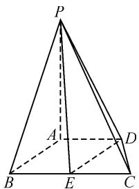
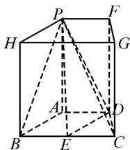
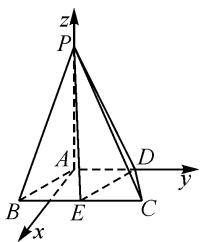
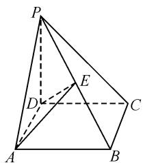
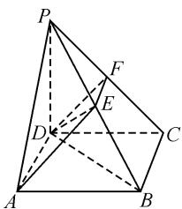

# 几何与坐标,巧思维切入

甘肃省武威市古浪县第一中学 周新军  
甘肃省武威市古浪县第六中学 李振兰

摘要:立体几何作为历年高考数学中最常见的基本内容之一,是综合考查逻辑推理、数学运算等核心素养比较常见的重要场所.借助新高考多选题的创新题型,以立体几何为背景来创设,紧扣立体几何中点、线、面位置关系的判定与证明以及线段长度、各类角的分析与求解等,更加综合地考查立体几何中的相关概念、定理、性质以及公式等,强化逻辑推理,强调数学运算,是一个不错的命题场所.

关键词: 几何; 坐标; 思维切入

# 1 问题呈现

问题〔江苏省南京市、盐城市2022届高三(上)学期期末考试(一模)数学试卷·12〕(多选题)如图1,在四棱锥P-ABCD中,已知PA⊥底面ABCD,底面ABCD为等腰梯形, $AD \parallel BC$ ,AB=AD=CD=1,BC=PA=2,记四棱锥P-ABCD的外接球为球O,平面PAD与平面 PBC 的交线为 l, BC 的中点为 E, 则( ).

text_image

Geometric diagram of a pyramid with labeled vertices and internal points, used for spatial geometry problems.

图1

A. $l \parallel BC$ B.AB⊥PC

C. 平面 $PDE \perp$ 平面 PAD

D. l 被球 O 截得的弦长为 1

# 2 解题策略

此题是一道立体几何多项选择问题.多项选择题是新高考新兴起的题型,相较于单项选择题,对学生的能力要求更高,立体几何是多项选择题中的常见考点.

解决此类问题一般有两种思路：

(1) 几何角度, 从立体几何的判定定理和性质定理出发, 解决证明问题和角度求解问题.  
(2)坐标角度,借助空间直角坐标系,通过坐标法解决问题(也可以通过三基底来分析与解决).

# 3 问题解决

方法 1: 几何角度——直接处理法.

解析: 对于选项 A, 由 $BC \parallel AD$ , 可得 $BC \parallel$ 平面 PAD, 而平面 $PAD \cap$ 平面 $PBC = l, BC \subset$ 平面 PBC, 所以 $l \parallel BC$ , 故选项 A 正确.

对于选项 B, 因为 AB = AD = CD = 1, BC = 2, 则 $AB \perp AC$ , 又由 $PA \perp$ 平面 ABCD, 可得 $PA \perp AB$ , 结

合 $PA \cap AC = A$ ，所以 $AB \perp$ 平面 PAC，则有 $AB \perp PC$ ，故选项 B 正确.

对于选项 C, 因为平面 $PAD \perp$ 平面 ABCD, 作 $EF \perp AD, FG \perp PD$ , 则 $\angle EGF$ 是平面 PDE 与平面 PAD 所成二面角的平面角, 显然 $\angle EGF \neq 90^{\circ}$ , 所以平面 PDE 与平面 PAD 不垂直, 故选项 C 错误.

对于选项 D, 球心 O 满足 $OE \perp$ 平面 ABCD, 且 OE = 1, 则由对称特征可知, l 被球 O 截得的弦长长度与 AD 相等, 长度为 1, 故选项 D 正确.

故选择答案: ABD.

方法 2: 几何角度——补形法.

解析: 如图 2 所示, 将四棱锥 P-ABCD 补成直四棱柱 PHGF-ABCD, 则平面 PAD 与平面 PBC 的交线 l 即为 PF, 且球的球心 O 在正方形 BCGH 的中心.

对于选项 A, BC // PF 可得 l // BC, 故选项 A 正确.

text_image

Geometric diagram of a cube with labeled vertices and internal points, showing solid and dashed edges for spatial relationships.

图2

对于选项 B, 因为 AB = AD = CD = 1, BC = 2, 则 $AB \perp AC$ , 又 $PA \perp$ 平面 ABCD, 可得 $PA \perp AB$ , 结合 $PA \cap AC = A$ , 所以 $AB \perp$ 平面 PAC, 则有 $AB \perp PC$ , 故选项 B 正确.

对于选项 C, 因为平面 $PAD \perp$ 平面 ABCD, 作 $EF \perp AD, FG \perp PD$ , 则 $\angle EGF$ 是平面 PDE 与平面 PAD 所成二面角的平面角, 显然 $\angle EGF \neq 90^{\circ}$ , 所以平面 PDE 与平面 PAD 不垂直, 故选项 C 错误.

对于选项 D, 球 O 的半径 $r = \sqrt{2}$ , 球心 O 到交线 l 的距离 $d = \sqrt{\left(\frac{\sqrt{3}}{2}\right)^{2} + 1^{2}} = \frac{\sqrt{7}}{2}$ , 则 l 被球 O 截得的弦长为 $2\sqrt{r^{2} - d^{2}} = 2\sqrt{(\sqrt{2})^{2} - \left(\frac{\sqrt{7}}{2}\right)^{2}} = 1$ , 故选项 D 正确.

故选择答案: ABD.

解后反思: 几何法是解决立体几何问题的基本方法, 考查学生对空间中线面关系的掌握情况, 即平行、垂直的判定定理和性质定理等, 以及会利用定理解决证明问题和求角问题, 对学生的基本功要求较高.

方法 3: 坐标角度——建系法.

解析: 如图 3, 建立空间直角坐标系 A-xyz, 则 $A(0,0,0)$ , $D(0,1,0)$ ,

$$
B \left(\frac {\sqrt {3}}{2}, - \frac {1}{2}, 0\right), C \left(\frac {\sqrt {3}}{2}, \frac {3}{2}, 0\right),
$$

$$
P (0, 0, 2), E \left(\frac {\sqrt {3}}{2}, \frac {1}{2}, 0\right).
$$

text_image

z
P
A
B
E
C
D
y
x

图3

对于选项 A, 由线面平行的性质定理和判定定理，由 $BC \parallel AD$ ，可得 $BC \parallel$ 平面PAD，而平面 $PAD \cap$ 平面 $PBC = l, BC \subset$ 平面 $PBC$ 所以 $l \parallel BC$ ，故选项A正确.

对于选项B，易得 $\overrightarrow{AB} = \left(\frac{\sqrt{3}}{2}, -\frac{1}{2},0\right),\overrightarrow{PC} =$ $\left(\frac{\sqrt{3}}{2},\frac{3}{2}, - 2\right)$ ，因为 $\overrightarrow{AB}\cdot \overrightarrow{PC} = 0$ ，所以 $AB\bot PC$ ，故选项B正确.

对于选项 C, 易得 $\overrightarrow{DP}=(0,-1,2),\overrightarrow{DE}=\left(\frac{\sqrt{3}}{2},-\frac{1}{2},0\right)$ .

设平面 PDE 的法向量为 $\boldsymbol{n}=(x,y,z)$ ，由 $\left\{\begin{aligned}\overrightarrow{DP}\cdot n=0,\\\overrightarrow{DE}\cdot n=0,\end{aligned}\right.$ 可得 $\left\{\begin{aligned}-y+2z=0,\\\frac{\sqrt{3}}{2}x-\frac{1}{2}y=0.\end{aligned}\right.$ 令 y=2，可得 $n=\left(\frac{2\sqrt{3}}{3},2,1\right)$ .

而平面 PAD 的一个法向量为 $m=(1,0,0)$ ，因为 $n \cdot m = \frac{2\sqrt{3}}{3} \neq 0$ ，即向量 n 与 m 不垂直，所以平面 PDE 与平面 PAD 不垂直，故选项 C 错误.

对于选项 D, 球心 O 满足 $OE \perp$ 平面 ABCD, 且 OE = 1, 则由对称特征可知, l 被球 O 截得的弦长长度与 AD 相等, 长度为 1, 故选项 D 正确.

故选择答案: ABD.

解后反思:坐标法的引入,大大降低了立体几何问题的求解难度,也是大部分学生更容易接受和掌握的方法,其充分体现了数形转化思想和解析几何思想.方法3利用坐标法验证选项B,C,用几何法验证选项A,D,相对来说,坐标法对已知的线面关系证明和角度求解更为方便,几何法对其他的计算证明更为方便.

# 4 变式拓展

变式〔2022届贵州省贵阳市五校高三(上)联考数学试卷(理科)(二)改编〕(多选题)如图4所示,四棱锥 P-ABCD 的底面为矩形， $PD \perp$ 底面 ABCD，AD=1, PD=AB=2, E 是 PB 的中点，过 A, D, E 三点的平面 $\alpha$ 与平面 PBC 的交线为 l，则下列结论中正确的有（）.

text_image

Geometric diagram of a pyramid with labeled vertices and internal points, including dashed lines indicating hidden edges.

图4

text_image

Geometric diagram of a pyramid with labeled vertices and internal points, used for spatial geometry problems.

图5

A. $l \parallel$ 平面 PAD

B.AE // 平面 PCD

C. 直线 PA 与 l 所成角的余弦值为 $\frac{\sqrt{5}}{5}$

D. 平面 $\alpha$ 截四棱锥 P-ABCD 所得的上、下两部分几何体的体积之比为 $\frac{3}{5}$

解析:如图 5, 取 PC 的中点 F, 连接 EF. 因为 E 是 PB 的中点, 所以 $AD \parallel EF$ , 则 A, D, E, F 四点共面, 即 l 为 EF.

对于选项 A, 因为 $EF \parallel AD$ , $EF \not\subset$ 平面 PAD, $AD \subset$ 平面 PAD, 所以 $EF \parallel$ 平面 PAD, 即 $l \parallel$ 平面 PAD, 故选项 A 正确.

对于选项 B, 因为 $EF \parallel AD$ , 若 $AE \parallel$ 平面 PCD, 则必有 $AE \parallel DF$ , 即四边形 ADFE 为平行四边形, 所以 AD = EF, 与 $AD \neq EF$ 矛盾, 故选项 B 错误.

对于选项 C, PA 与 l 所成的角即为 PA 与 EF 所成的角, 亦即 PA 与 AD 所成的角. 因为 $PD \perp$ 平面 ABCD, 则 $PD \perp AD$ , 所以 $\cos \angle PAD = \frac{AD}{AP} = \frac{\sqrt{5}}{5}$ , 故选项 C 正确.

对于选项 D, 连接 BD, $V_{P-ABCD} = \frac{1}{3} S_{矩形ABCD} \cdot$ $PD=\frac{1}{3}\times2\times1\times2=\frac{4}{3}$ ，则 $V_{ABCDEF}=V_{A-BDE}+V_{D-BCFE}=$ $\frac{1}{3}\times\frac{\sqrt{5}}{2}\times\frac{2}{\sqrt{5}}+\frac{1}{3}\times\frac{3\sqrt{2}}{4}\times\frac{2}{\sqrt{2}}=\frac{5}{6}$ ，所以 $\frac{V_{P-ADFE}}{V_{ABCDEF}}=\frac{\frac{4}{3}-\frac{5}{6}}{\frac{5}{6}}=\frac{3}{5}$ ，故选项 D 正确.

故选择答案: ACD.

在立体几何知识的教学过程中,要重点落实学生对立体几何的基础知识、基本方法等的理解与掌握,熟练掌握并应用立体几何中的概念、定理或结论进行一些基本的逻辑推理,应用一些基本的公式来加以数学运算等. Z