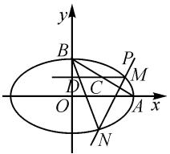

# 动态与静态融合,解几与数列交汇

# 山东省滕州市第一中学 仇召坤

摘要: 圆锥曲线的解答题一直是高考命题中全面考查“四基”与“四能”的一个重要载体, 成为高考中的一类基本考点. 依托一道高考模拟题中的圆锥曲线解答题, 借助问题的动态与静态的巧妙融合, 实现解几与数列的知识交汇, 开拓数学思维, 多技巧方法推理与运算, 归纳技巧方法, 引领并指导数学教学与解题研究.

关键词: 椭圆; 动态; 静态; 数列; 交汇

圆锥曲线的综合问题,一直是高考解答题的重要命题形式.此类问题以创新多样的形式设置,巧妙融合“动态”与“静态”的变化过程,借助“动点”与“定点”的灵活转化,达到“常值”与“最值”的合理过渡,实现解析几何与其他知识之间的交汇与应用,是高考命题的一类基本命题趋势与方向.

而此类圆锥曲线的综合问题,依托“数”的本质属性与“形”的几何特征,以新颖多变的形式设问,借助逻辑推理与数学运算等来实现知识的交汇与综合应用,全面考查学生的“四基”与“四能”,具有较高的区分度与较强的选拔性,成为培养数学核心素养的一个重要抓手.

# 1 问题呈现

问题 （2024 年湖南省长沙市四县区高三下学期 3 月调研考试数学试卷 · 18）如图 1 所示，已知 A, B 分别是椭圆 $E: \frac{x^{2}}{a^{2}} + \frac{y^{2}}{b^{2}} = 1$ (a > b > 0) 的右顶点和上顶点，椭圆 E 的离心率为 $\frac{\sqrt{3}}{2}$ ， $\triangle ABO$ 的面积为 1.

text_image

y
B
P
M
D
C
O
A x
N

图1

(1)求椭圆 E 的方程.  
(2)若过点 $P(a,b)$ 的直线与椭圆 E 相交于 M, N 两点, 过点 M 作 x 轴的平行线分别与直线 AB, NB 交于点 C, D. 证明: M, C, D 三点的横坐标成等差数列.

此题以椭圆为问题场景,第(1)问求椭圆 E 的方程的,是依托椭圆的离心率公式,三角形的面积公式以及参数之间的关系式等来分析与求解,属于简单题,给大部分考生一个切入的机会,也为问题设置一个良好的梯度.

第(2)问,以定点 P 所对应的动直线切入,结合动点 M,N 的确定,以此带动与之相关的动点 C,D,进而确定 M, C, D 三点的关系问题, 动点较多, 变化繁杂, 而最后的问题又归结为等差数列的基本性质问题, 充分体现解析几何与数列之间的融合. 而要证明 M, C, D 三点的横坐标成等差数列, 转化为对应坐标之间的关系问题, 进而通过分析法或直接法思维来逻辑推理与数学运算, 实现问题的证明与应用.

# 2 问题破解

解析:(1)依题可得 $\left\{\begin{aligned}\frac{1}{2}ab=1,\\ \frac{c}{a}&=\frac{\sqrt{3}}{2},\\ a^{2}&=b^{2}+c^{2},\end{aligned}\right.$ 解得 $\left\{\begin{aligned}a&=2,\\ b&=1,\\ c&=\sqrt{3}.\\\end{aligned}\right.$

所以椭圆 E 的方程为 $\frac{x^{2}}{4} + y^{2} = 1$ .

(2)证法1(分析法):设直线MN的方程为 $x=my+n$ ，由直线过点 $P(2,1)$ ，可得 $m+n=2$ 。

联立方程组 $\left\{ \begin{array}{l} x = my + n, \\ x^2 + 4y^2 = 4, \end{array} \right.$ 可得 $(m^2 + 4)y^2 + 2mny + n^2 - 4 = 0, \Delta = 4m^2n^2 - 4(m^2 + 4)(n^2 - 4) = 16(m^2 - n^2 + 4) > 0.$ 设 $M(x_1, y_1), N(x_2, y_2)$ ，则

$$
y _ {1} + y _ {2} = - \frac {2 m n}{m ^ {2} + 4}, y _ {1} y _ {2} = \frac {n ^ {2} - 4}{m ^ {2} + 4}.
$$

易得直线 AB 的方程为 $x + 2y - 2 = 0$ ，则 $C(2 - 2y_{1}, y_{1})$ 。又直线 BN 的方程为 $y = \frac{y_{2} - 1}{x_{2}}x + 1$ ，令 $y = y_{1}$ ，可得 $x_{D} = \frac{(y_{1} - 1)x_{2}}{y_{2} - 1}$ 。

下面证明： $x_{1} + x_{D} = 2x_{C}$

即证 $x_{1} + \frac{(y_{1} - 1)x_{2}}{y_{2} - 1} = 4 - 4y_{1}$ ，即证 $(my_1 + n)\cdot$ $(y_{2} - 1) + (y_{1} - 1)(my_{2} + n) = (4 - 4y_{1})(y_{2} - 1)$ ，整理可得即证 $(2m + 4)y_{1}y_{2} + (n - m - 4)(y_{1} + y_{2})-$ $2n + 4 = 0.$

亦即证明 $(2m + 4)\cdot \frac{n^2 - 4}{m^2 + 4} +(n - m - 4)\cdot$ $\left(-\frac{2mn}{m^2 + 4}\right) - 2n + 4 = 0$ ，即证 $4m^{2} + 8mn + 4n^{2} -$ $8(m + n) = 0$ ，即证 $(m + n)^{2} - 2(m + n) = 0.$

因为 $m+n=2$ ，所以上式成立，原式得证。

证法 2（直接法 1）: 设 $M(x_{1}, y_{1})$ , $N(x_{2}, y_{2})$ $(y_{1} \neq 1, y_{2} \neq 1)$ ，由 MD 平行于 x 轴，知 $D(x_{D}, y_{1})$ , $C(x_{C}, y_{1})$ . 设直线 MN 的方程为 $mx + n(y - 1) = 1$ ，由于直线 MN 过点 $P(2, 1)$ ，则有 2m = 1，解得 $m = \frac{1}{2}$ .

由方程组 $\left\{\begin{aligned}mx+n(y-1)&=0,\\ x^{2}+4y^{2}&=4\end{aligned}\right.$ 可得

$$
\left(\frac {x}{y - 1}\right) ^ {2} + 8 m \cdot \frac {x}{y - 1} + 4 + 8 n = 0.
$$

所以 $\frac{x_1}{y_1 - 1} +\frac{x_2}{y_2 - 1} = -8m = -4.$

又由 B, D, N 三点共线，可得 $\frac{x_{2}}{y_{2}-1} = \frac{x_{D}}{y_{1}-1}$ ，所以 $\frac{x_{1}}{y_{1}-1} + \frac{x_{D}}{y_{1}-1} = -4$ ，即 $x_{1} + x_{D} = -4(y_{1}-1)$ .

又因为点 $C(x_{C},y_{1})$ 在直线 $AB:\frac{x}{2} +y = 1$ 上，则有 $y_{1} - 1 = -\frac{x_{C}}{2}$ ，所以 $x_{1} + x_{D} = -4\times \left(-\frac{x_{C}}{2}\right)$ ，于是 $x_{1} + x_{D} = 2x_{C}$

故 M, C, D 三点的横坐标成等差数列.

证法 3(直接法 2): 设直线 MN 的方程为 $x = my + n$ ，而该直线过点 $P(2,1)$ ，可得 $m + n = 2$ 。

由方程组 $\left\{\begin{aligned}x&=my+n,\\ x^{2}&+4y^{2}=4,\end{aligned}\right.$ 可得

$$
(m ^ {2} + 4) y ^ {2} + 2 m n y + n ^ {2} - 4 = 0.
$$

设 $M(x_{1},y_{1}), N(x_{2},y_{2})(y_{1} \neq 1, y_{2} \neq 1)$ ，则

$$
y _ {1} + y _ {2} = - \frac {2 m n}{m ^ {2} + 4}, y _ {1} y _ {2} = \frac {n ^ {2} - 4}{m ^ {2} + 4}.
$$

所以 $\frac{x_1}{y_1 - 1} +\frac{x_2}{y_2 - 1} = \frac{x_1(y_2 - 1) + x_2(y_1 - 1)}{(y_1 - 1)(y_2 - 1)} =$ $\frac{(my_1 + n)(y_2 - 1) + (my_2 + n)(y_1 - 1)}{(y_1 - 1)(y_2 - 1)} = \frac{-8(m + n)}{(m + n)^2} =$ -4.

又由于 B, D, N 三点共线，所以 $\frac{x_{2}}{y_{2}-1} = \frac{x_{D}}{y_{1}-1}$ ，因此 $\frac{x_{1}}{y_{1}-1} + \frac{x_{D}}{y_{1}-1} = -4 = \frac{2}{k_{AB}} = 2 \cdot \frac{x_{C}}{y_{1}-1}$ .

所以 $x_{1}+x_{D}=2x_{C}$ .

故 M, C, D 三点的横坐标成等差数列.

总结:根据场景创设,从中明确相应的点、直线等之间的关系,这是进一步进行逻辑推理与数学运算的基础所在.而目标是证明“M,C,D三点的横坐标成等差数列”,即证坐标关系式“ $x_{M}+x_{D}=2x_{C}$ ”,进而根据问题的条件,合理进行多思维视角的转化,或分析法处理,或直接法应用,从而有效开拓数学思维,全面优化解题过程与数学应用.

# 3 拓展归纳

根据原问题及其解析过程,进一步加以合理归纳,将问题由具体情况转化为到一般情况,从而得到相应的一般性结论.

结论: 已知 A, B 分别是椭圆 $E: \frac{x^{2}}{a^{2}} + \frac{y^{2}}{b^{2}} = 1 (a > b > 0)$ 的右顶点和上顶点, 如果过点 $P(a, b)$ 的直线与椭圆 E 相交于 M, N 两点, 过点 M 作 x 轴的平行线分别与直线 AB, NB 交于点 C, D, 那么

(1)M,C,D三点的横坐标成等差数列；

(2) 线段 MD 的中点在直线 AB 上 (或线段 MD 的中点在定直线上);

(3) $\frac{|MC|}{|CD|}$ 的值恒为1.

该结论是基于原问题的解析过程得来的,证明过程可以参考原问题的解析,这里不再赘述.

# 4 教学启示

# 4.1 创新设置,巧妙融合

涉及圆锥曲线的综合问题,往往离不开动态与静态的融合与转化,特别是涉及一些多“动点”、多“动直线”等元素的场景创设,而在这些动态的过程中,有其静态的表现,借助代数方式来表征,合理通过数形结合与直观想象,实现静态的产物,如定值、定点或最值,或是代数形式的表达等,实现“动”与“静”的合理变化与转化,充分体现科学的唯物主义辩证思维与创新应用.

# 4.2 核心模块,知识交汇

作为高中数学核心内容之一的圆锥曲线,每年高考都会以解答题的形式出现,而基于圆锥曲线的考查,还可以巧妙交汇其他一些相关知识,如平面几何、平面向量、解三角形、函数与方程、数列、不等式等,借助合理的设问实现知识之间的无缝衔接,也提高了问题的综合性、应用性以及创新性等,成为更加全面、细致地考查学生的“四基”与“四能”的一种重要方式.