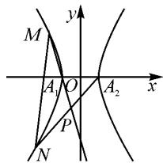
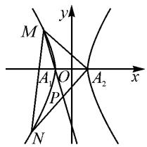
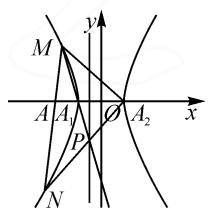

# 厘清转化 探究解法 透析本质

——以 2023 年高考新课标Ⅱ卷第 21 题为例

# ● 浙江省平湖中学 高玉良

摘要:文章对2023年高考新课标Ⅱ卷第21题的解答策略进行了多方位、深层次的剖析,从非对称表征、对称表征,线参、点参等多个角度给出多种解法.目的是反思教学中的问题,以期给高中数学教师的解题研究带来启发,为解题教学提供参考.

关键词: 定值; 一题多解; 非对称; 对称

圆锥曲线是高中数学的核心内容之一,是考查学生数学运算和逻辑推理素养的良好载体.2023年高考新课标Ⅱ卷第21题,以直线与双曲线为背景,考查求曲线方程及动点共线问题,是典型的定点定值问题.试题重视基础性的同时也突出了综合性、应用性,突出数学运算的同时,考查学生转化与化归、数形结合等思想.

# 1 试题呈现

(2023年高考新课标Ⅱ卷第21题)已知双曲线C的中心为坐标原点,左焦点为 $(-2\sqrt{5},0)$ ,离心率为 $\sqrt{5}$ .

(1) 求 C 的方程；  
(2) 记 C 的左、右顶点分别为 $A_{1}, A_{2}$ ，过点 $(-4, 0)$ 的直线与 C 的左支交于 M, N 两点，M 在第二象限，直线 $MA_{1}$ 与 $NA_{2}$ 交于点 P。证明：点 P 在定直线上。

# 2 解法赏析

《普通高中数学课程标准(2017年版2020修订)》(以下简称《课标》)在平面解析几何的学业要求中指出:“能够掌握平面解析几何解决问题的基本过程,能根据几何问题和图形的特点,用代数语言把几何问题转化成代数问题;根据对几何问题(图形)的分析,探索解决问题的思路;运用代数方法得到结论.”[1]本试题的命制很好地贯彻了《课标》的要求,第(1)问的准确求解(求得双曲线方程为 $\frac{x^{2}}{4}-\frac{y^{2}}{16}=1$ )可以认为学生达到《课标》数学运算素养水平一的要求,即“能够在熟悉的数学情境中,根据问题的特征形成合适的运算思路,解决问题”[1].第(2)问的准确求解可以认为学生达到《课标》数学运算素养水平二的要求,即“能够在关联的情境中确定运算对象,提出运算问题,合理选择运算方法,设计运算程序,解决问题”[1].

# 2.1 非对称韦达定理表征

# 2.1.1 设直线 MN 的“倒斜式”

解析:(2)由(1)可得 $A_{1}(-2,0)$ ， $A_{2}(2,0)$ .设 $M(x_{1},y_{1})$ ， $N(x_{2},y_{2})$ ，由图1，显然直线MN的斜率不为0，设直线MN的方程为x=my-4 $\left(-\frac{1}{2}<m<\frac{1}{2}\right)$ ，与 $\frac{x^{2}}{4}-\frac{y^{2}}{16}=1$ 联立得 $(4m^{2}-1)y^{2}-32my+48=0$ ， $\Delta=64(4m^{2}+3)>0$ ，则

text_image

M
y
A₁ O A₂ x
P
N

图1

$$
y _ {1} + y _ {2} = \frac {3 2 m}{4 m ^ {2} - 1}, y _ {1} y _ {2} = \frac {4 8}{4 m ^ {2} - 1}.
$$

设直线 $MA_{1}$ 的方程为 $y=\frac{y_{1}}{x_{1}+2}(x+2)$ ，直线 $NA_{2}$ 的方程为 $y=\frac{y_{2}}{x_{2}-2}(x-2)$ .

联立直线 $MA_{1}$ 与直线 $NA_{2}$ 的方程，消去 y 可得 $\frac{y_{1}}{x_{1}+2}(x+2)=\frac{y_{2}}{(x_{2}-2)}(x-2)$ ，消 $x_{1}, x_{2}$ 得 $\frac{y_{1}}{my_{1}-2}\cdot(x+2)=\frac{y_{2}}{my_{2}-6}(x-2)$ ，即 $(my_{1}y_{2}-6y_{1})\cdot(x+2)=(my_{1}y_{2}-2y_{2})(x-2)$ ，化简可得 $x_{P}=\frac{2my_{1}y_{2}-6y_{1}-2y_{2}}{3y_{1}-y_{2}}$ 。于是问题就转化为：已知 $y_{1}+y_{2}=\frac{32m}{4m^{2}-1}, y_{1}y_{2}=\frac{48}{4m^{2}-1}$ ，如何求交点 P 的横坐标 $\frac{2my_{1}y_{2}-6y_{1}-2y_{2}}{3y_{1}-y_{2}}$ 的值？

解法1: 直接用求根公式暴力求解 $y_{1}, y_{2}$ ，用 m 表征。由 $(4m^{2}-1)y^{2}-32my+48=0$ 且 $y_{1}>y_{2}$ ，得 $y_{1}=\frac{16m-4\sqrt{4m^{2}+3}}{4m^{2}-1}$ ， $y_{2}=\frac{16m+4\sqrt{4m^{2}+3}}{4m^{2}-1}$ ，则 $x_{P}=$

$$
\frac {\frac {9 6 m}{4 m ^ {2} - 1} - \frac {9 6 m - 2 4 \sqrt {4 m ^ {2} + 3}}{4 m ^ {2} - 1} - \frac {3 2 m + 8 \sqrt {4 m ^ {2} + 3}}{4 m ^ {2} - 1}}{\frac {4 8 m - 1 2 \sqrt {4 m ^ {2} + 3}}{4 m ^ {2} - 1} - \frac {1 6 m + 4 \sqrt {4 m ^ {2} + 3}}{4 m ^ {2} - 1}} =
$$

$\frac{-32m+16\sqrt{4m^{2}+3}}{32m-16\sqrt{4m^{2}+3}}=-1$ , 即 $x_{P}=-1$ . 据此可得点 P 在定直线 x=-1 上运动.

点评:从方程角度来看, $\frac{2my_{1}y_{2}-6y_{1}-2y_{2}}{3y_{1}-y_{2}}$ 含有三个参变量 $y_{1},y_{2},m$ ，不能直接求出比值，因此利用消元思想，将 $y_{1},y_{2}$ 用m表征即可求得正确结果，缺点是过程繁琐，计算量大.

解法 2: 配凑两根之和 $y_{1} + y_{2}$ ，用 $m, y_{2}$ （或 $y_{1}$ ）来表征，所以可得 $x_{P} = \frac{2my_{1}y_{2} - 6(y_{1} + y_{2}) + 4y_{2}}{3(y_{1} + y_{2}) - 4y_{2}} =$

$$
\frac {\frac {9 6 m}{4 m ^ {2} - 1} - \frac {1 9 2 m}{4 m ^ {2} - 1} + 4 y _ {2}}{\frac {9 6 m}{4 m ^ {2} - 1} - 4 y _ {2}} = - 1.
$$

解法 3: 利用韦达定理找到 $y_{1}y_{2}$ 与 $y_{1}+y_{2}$ 的关系, 化积为和, 用 $y_{1}, y_{2}$ 表征.

由 $y_{1} + y_{2} = \frac{32m}{4m^{2} - 1}, y_{1}y_{2} = \frac{48}{4m^{2} - 1}$ ，两式相除得 $2my_{1}y_{2} = 3(y_{1} + y_{2})$ ，则 $x_{P} = \frac{2my_{1}y_{2} - 6y_{1} - 2y_{2}}{3y_{1} - y_{2}} = \frac{3y_{1} + 3y_{2} - 6y_{1} - 2y_{2}}{3y_{1} - y_{2}} = \frac{-3y_{1} + y_{2}}{3y_{1} - y_{2}} = -1.$

点评:考虑到比值 $\frac{2my_{1}y_{2}-6y_{1}-2y_{2}}{3y_{1}-y_{2}}$ 为定值,三个参变量没法看出定值,那么两个参变量行不行呢?因此采用减元思想,通过韦达定理配凑 $y_{1}+y_{2}$ 或化积为和,实现分子分母的倍数化,简化了直接求根的繁琐运算过程.

解法 4: 上述解析中求直线 $MA_{1}$ 与 $NA_{2}$ 交点的运算量较大, 可以由比例关系消 y, 得

$$
\begin{array}{r l} \frac {x + 2}{x - 2} = & \frac {y _ {2} (x _ {1} + 2)}{y _ {1} (x _ {2} - 2)} = \frac {y _ {2} (m y _ {1} - 4 + 2)}{y _ {1} (m y _ {2} - 4 - 2)} = \\ \frac {m y _ {1} y _ {2} - 2 y _ {2}}{m y _ {1} y _ {2} - 6 y _ {1}}. \end{array}
$$

以下解法同上,可得 $\frac{x+2}{x-2}=-\frac{1}{3}$ ,则x=-1.

点评: 求两直线 $MA_{1}$ 与 $NA_{2}$ 交点的坐标转化为求 $\frac{x+2}{x-2}$ ，进一步简化运算.

解法 5: 先猜后证. 当斜率不存在时, 由对称性可知点 P 在垂直于 x 轴的直线上. 直线 MN 的方程为

$x = -4$ ，可得 $M(-4,4\sqrt{3}),N(-4,-4\sqrt{3})$ ，则直线 $A_{1}M$ 的方程为 $y = -2\sqrt{3}(x + 2)$ ，直线 $A_{2}N$ 的方程为 $y = \frac{2\sqrt{3}}{3} (x - 2)$ ，联立可得 $x = -1$ ，于是猜想点 $P$ 在定直线 $l:x = -1$ 上运动.下证三条直线 $A_{1}M$ $A_{2}N,l$ 共点.联立 $\left\{ \begin{array}{ll}y = \frac{y_1}{x_1 + 2} (x + 2),\\ x = -1, \end{array} \right.$ 得 $y = \frac{y_1}{x_1 + 2};$ 联立 $\left\{ \begin{array}{ll}y = \frac{y_2}{x_2 - 2} (x - 2),\\ x = -1, \end{array} \right.$ 得 $y = \frac{-3y_2}{x_2 - 2}$ 只需证明 $\frac{y_1}{x_1 + 2} =$ $\frac{-3y_2}{x_2 - 2}\Leftrightarrow \frac{y_1}{my_1 - 2} = \frac{-3y_2}{my_2 - 6}\Leftrightarrow 2my_1y_2 = 3(y_1 + y_2)$ ，由上述方法知其成立.

点评:由特殊到一般,既然点 P 在定直线 x = -1 上运动,事实上就是直线 $A_{1}M, A_{2}N, l$ 三线共点,利用方程 x = -1 的简单属性,减少了联立直线 $A_{1}M$ 与 $A_{2}N$ 方程的计算量.

# 2.1.2 设直线 MN 的点斜式

解法6: 当直线MN的斜率不存在时, 由上述解法知 $x_{P} = -1$ . 当直线MN的斜率存在时, 设方程为 $y = k(x + 4), k \in (-\infty, -2) \cup (2, +\infty)$ , 与 $\frac{x^2}{4} - \frac{y^2}{16} = 1$ 联立可得 $(4 - k^2)x^2 - 8k^2x - 16(k^2 + 1) = 0$ , $\Delta > 0$ 恒成立, 则 $x_{1} + x_{2} = \frac{8k^{2}}{4 - k^{2}}, x_{1}x_{2} = \frac{-16(k^{2} + 1)}{4 - k^{2}}$ . 联立直线 $MA_{1}$ 与 $NA_{2}$ 的方程, 得 $\frac{x + 2}{x - 2} = \frac{y_{2}(x_{1} + 2)}{y_{1}(x_{2} - 2)} = \frac{k(x_{2} + 4)(x_{1} + 2)}{k(x_{1} + 4)(x_{2} - 2)} = \frac{x_{1}x_{2} + 4x_{1} + 2x_{2} + 8}{x_{1}x_{2} - 2x_{1} + 4x_{2} - 8}$ . 于是问题就转化为: 已知 $x_{1} + x_{2} = \frac{8k^{2}}{4 - k^{2}}, x_{1}x_{2} = \frac{-16(k^{2} + 1)}{4 - k^{2}}$ , 如何求 $\frac{x_1x_2 + 4x_1 + 2x_2 + 8}{x_1x_2 - 2x_1 + 4x_2 - 8}$ ? 同上述解法都能求得正确结果. 同解法2(其他不再赘述)如下:

$$
\begin{array}{l} \frac {x + 2}{x - 2} = \frac {x _ {1} x _ {2} + 4 (x _ {1} + x _ {2}) - 2 x _ {2} + 8}{x _ {1} x _ {2} - 2 (x _ {1} + x _ {2}) + 6 x _ {2} - 8} \\ = \frac {\frac {- 1 6 \left(k ^ {2} + 1\right)}{4 - k ^ {2}} + \frac {3 2 k ^ {2}}{4 - k ^ {2}} - 2 x _ {2} + 8}{\frac {- 1 6 \left(k ^ {2} + 1\right)}{4 - k ^ {2}} - \frac {1 6 k ^ {2}}{4 - k ^ {2}} + 6 x _ {2} - 8} \\ = \frac {8 k ^ {2} + 1 6 - 2 x _ {2} (4 - k ^ {2})}{- 2 4 k ^ {2} - 4 8 + 6 x _ {2} (4 - k ^ {2})} \\ = - \frac {1}{3}. \\ \end{array}
$$

解得 x = -1，即 $x_{P} = -1$ 。

解后反思:所谓“非对称韦达定理”结构是指形如解题过程中出现的 $\frac{2my_{1}y_{2}-6y_{1}-2y_{2}}{3y_{1}-y_{2}},\frac{my_{1}y_{2}-2y_{2}}{my_{1}y_{2}-6y_{1}},\frac{x_{1}x_{2}+4x_{1}+2x_{2}+8}{x_{1}x_{2}-2x_{1}+4x_{2}-8}$ 等结构,这些结构中交换其中的 $x_{1}$ 与 $x_{2}$ (或 $y_{1}$ 与 $y_{2}$ )和原表达式并不相同,因此不能直接利用韦达定理化简,解题策略是利用减元思想,只要将参变量减少到两个或一个就能实现整体约分,求出定值.解题过程精准高效,真正做到会一题通一类,提升学生关键能力与素养.

# 2.2 转化为对称结构表征

# 2.2.1 利用线参运算

解法7:平方法.利用双曲线方程消参可以得到 $\left(\frac{x+2}{x-2}\right)^{2}=\frac{y_{2}^{2}(x_{1}+2)^{2}}{y_{1}^{2}(x_{2}-2)^{2}}=\frac{(4x_{2}^{2}-16)(x_{1}+2)^{2}}{(4x_{1}^{2}-16)(x_{2}-2)^{2}}=\frac{(x_{1}+2)(x_{2}+2)}{(x_{1}-2)(x_{2}-2)}$ ，代入韦达定理可得 $\left(\frac{x+2}{x-2}\right)^{2}=\frac{1}{9}$ ，由题意知 $\frac{x+2}{x-2}=\frac{1}{3}$ 应舍去，故 $\frac{x+2}{x-2}=-\frac{1}{3}$ ，以下同上.

点评:出现“不对称”问题的原因是设直线方程时选用两个不同的顶点引起的,因此借助双曲线方程自身的对称性,利用 $y_{1}^{2}=4x_{1}^{2}-16$ , $y_{2}^{2}=4x_{2}^{2}-16$ 将非对称性结构转化为对称结构.

解法8：以直线 $MA_{1}, MA_{2}$ 的方程展开运算. 设直线 $MA_{1}$ 的方程为 $x = m_{1}y - 2$ ，直线 $MA_{2}$ 的方程为 $x = m_{2}y + 2$ ，则 $m_{1}m_{2} < 0$ . 联立解得

$$
y _ {P} = \frac {4}{m _ {1} - m _ {2}}, x _ {P} = \frac {2 (m _ {1} + m _ {2})}{m _ {1} - m _ {2}}.
$$

将直线 $MA_{1}$ 与直线 $MA_{2}$ 分别与双曲线 $C$ 联立.由 $\left\{ \begin{array}{l}x = m_1y - 2,\\ 4x^2 -y^2 = 16, \end{array} \right.$ 得 $y_{M} = \frac{16m_{1}}{4m_{1}^{2} - 1},x_{M} = \frac{8m_{1}^{2} + 2}{4m_{1}^{2} - 1};$ 由 $\left\{ \begin{array}{l}x = m_2y + 2,\\ 4x^2 -y^2 = 16, \end{array} \right.$ 得 $y_{N} = \frac{-16m_{2}}{4m_{2}^{2} - 1},x_{N} = \frac{-8m_{2}^{2} - 2}{4m_{2}^{2} - 1}.$ 由 $M,N$ 与点 $(-4,0)$ 三点共线得 $(y_{M} - 0)(x_{N} + 4) =$ $(y_{N} - 0)(x_{M} + 4)$ ，则 $\frac{16m_1}{4m_1^2 - 1}\cdot \frac{8m_2^2 - 6}{4m_2^2 - 1} = \frac{-16m_2}{4m_2^2 - 1}\cdot$ $\frac{24m_1^2 - 2}{4m_1^2 - 1}$ 即 $m_{1}(4m_{2}^{2} - 3) = -m_{2}(12m_{1}^{2} - 1)$ ，化简得 $(3m_{1} + m_{2})(4m_{1}m_{2} - 1) = 0$ ，所以 $m_2 = -3m_1$

所以 $x_{P} = \frac{2(m_{1} - 3m_{1})}{m_{1} + 3m_{1}} = -1.$

解法 9: 利用双曲线的垂径定理将问题转化为三条直线 $MA_{1}, MA_{2}, NA_{2}$ 的斜率关系, 如图 2. 因为 $k_{MA_{1}} \cdot k_{MA_{2}} = \frac{y_{1}}{x_{1} + 2} \cdot \frac{y_{1}}{x_{1} - 2} = \frac{y_{1}^{2}}{x_{1}^{2} - 4} = \frac{4x_{1}^{2} - 16}{x_{1}^{2} - 4} = 4$ ,

$$
k _ {M A _ {2}} \cdot k _ {N A _ {2}} = \frac {y _ {1}}{x _ {1} - 2} \cdot \frac {y _ {2}}{x _ {2} - 2} =
$$

$$
\frac {y _ {1} y _ {2}}{\left[ (m y _ {1} - 4) - 2 \right] \left[ (m y _ {2} - 4) - 2 \right]} =
$$

$$
\frac {y _ {1} y _ {2}}{m ^ {2} y _ {1} y _ {2} - 6 m \left(y _ {1} + y _ {2}\right) + 3 6} =
$$

$$
\frac {\frac {4 8}{4 m ^ {2} - 1}}{\frac {4 8 m ^ {2}}{4 m ^ {2} - 1} - \frac {1 9 2 m ^ {2}}{4 m ^ {2} - 1} + 3 6} = \frac {4 8}{- 3 6} =
$$

text_image

M
y
A₁ O A₂ x
P
N

图2

$-\frac{4}{3}$ ，两式相比，得 $\frac{k_{MA_{1}}}{k_{NA_{2}}}=-3$ ，则 $m_{2}=-3m_{1}$ ，所以 $x_{P}=\frac{2(m_{1}-3m_{1})}{m_{1}+3m_{1}}=-1.$

点评: 解法 8、解法 9 本质均是通过双曲线的垂径定理 $k_{MA_{1}} \cdot k_{MA_{2}} = \frac{b^{2}}{a^{2}} = 4$ ，引入直线 $MA_{2}$ 将求直线 $MA_{1}$ 与 $NA_{2}$ 的斜率关系问题，转化为直线 $MA_{2}$ 与 $NA_{2}$ 的斜率关系问题，将不同的顶点转化到相同的顶点，形成对称结构.

解法10:利用曲线系方程.设直线 $MA_{1}$ 的方程为 $x=m_{1}y-2$ ，直线 $MA_{2}$ 的方程为 $x=m_{2}y+2$ ，直线MN的方程为x=my-4，直线 $A_{1}A_{2}$ 为y=0，因此存在 $\lambda\in R$ ，使得曲线系 $(x-m_{1}y+2)(x-m_{2}y-2)+\lambda y(x-my+4)=0$ 表示双曲线C，化简得 $x^{2}+(\lambda-m_{1}-m_{2})xy+(m_{1}m_{2}-m\lambda)y^{2}+(4\lambda+2m_{1}-2m_{2})y-4=0$ ，可得 $\left\{\begin{aligned}\lambda-m_{1}-m_{2}&=0,\\ 4\lambda+2m_{1}-2m_{2}&=0,\end{aligned}\right.$ 则 $m_{2}=-3m_{1}$ ，代入 $x_{P}=\frac{2(m_{1}-3m_{1})}{m_{1}+3m_{1}}$ ，得 $x_{P}=-1$ .

点评:利用双曲线 C 方程中不含 xy 与 y 的一次项的代数属性,构建 $m_{1}$ 与 $m_{2}$ 的关系,实现整体运算,缺点是曲线系方程并非高中课标内容,只适合少数学生.

# 2.2.2 利用点参运算

解法11: 设 $A(-4,0)$ , 则 $\overrightarrow{MA} = (-4 - x_1, -y_1)$ , $\overrightarrow{AN} = (x_2 + 4, y_2)$ . 设 $\overrightarrow{MA} = \lambda \overrightarrow{AN}$ , 于是可得 $\left\{ \begin{array}{l} x_1 + \lambda x_2 = -4(1 + \lambda), \\ y_1 + \lambda y_2 = 0, \end{array} \right.$ 由 $\left\{ \begin{array}{l} 4x_1^2 - y_1^2 = 16, \\ 4x_2^2 - y_2^2 = 16, \end{array} \right.$ 可得 $4x_1^2 - 4\lambda^2 x_2^2 = 16(1 - \lambda^2)$ , 则 $x_1 - \lambda x_2 = \lambda - 1$ . 所以 $x_1 = \frac{-3\lambda - 5}{2}, x_2 = \frac{-3 - 5\lambda}{2\lambda}$ . 故 $\frac{x + 2}{x - 2} = \frac{y_2(x_1 + 2)}{y_1(x_2 - 2)} = \frac{-\left(\frac{-3\lambda - 1}{2}\right)}{\lambda\left(\frac{9\lambda + 3}{2\lambda}\right)} = -\frac{1}{3}$ . 以下同上.

点评:定比点差法是处理三点共线问题的典型方法,将点的坐标转化为关于参变量 $\lambda$ 的表达式,破解多参变量问题,突出整体运算,技巧性较强.

解法 12: 由双曲线 $\frac{x^{2}}{4}-\frac{y^{2}}{16}=1$ 的参数方程 x= $\frac{2}{\cos\theta}=\frac{2\left(1+\tan^{2}\frac{\theta}{2}\right)}{1-\tan^{2}\frac{\theta}{2}}$ , $y=4\tan\theta=\frac{8\tan\frac{\theta}{2}}{1-\tan^{2}\frac{\theta}{2}}$ ，设 $M\left(\frac{2\left(1+t_{1}^{2}\right)}{1-t_{1}^{2}},\frac{8t_{1}}{1-t_{1}^{2}}\right)$ , $N\left(\frac{2\left(1+t_{2}^{2}\right)}{1-t_{2}^{2}},\frac{8t_{2}}{1-t_{2}^{2}}\right)$ ，计算得 $k_{MN}=\frac{2+2t_{1}t_{2}}{t_{1}+t_{2}}$ ，则直线 MN 的方程为 $y-\frac{8t_{1}}{1-t_{1}^{2}}=\frac{2+2t_{1}t_{2}}{t_{1}+t_{2}}\left(x-\frac{2+2t_{1}^{2}}{1-t_{1}^{2}}\right)$ 。由直线 MN 过点 $(-4,0)$ ，化简得 $t_{1}t_{2}=-3$ ，此时直线 $MA_{1}$ 的方程为 $y=2t_{1}(x+2)$ ，直线 $NA_{2}$ 的方程为 $y=\frac{2}{t_{2}}(x-2)$ ，解得 x=-1，即 $x_{P}=-1$ 。

点评: 利用双曲线参数方程, 将三个参变量转化为两个参变量 $t_{1}, t_{2}$ , 从而破解不对称问题, 缺点是双曲线参数方程较为繁琐, 求直线 MN 的方程计算量较大.

解后反思:由二次曲线本身的对称性可知,试题中所谓的“不对称”其实也是隐性的“对称”.只有我们透析试题本质,才能引导学生多角度、多层次思考问题,从而选择合适的运算方法,设计合理的运算程序,进而解决问题.正所谓“想得少一点,算得多一点;想得多一点,算得少一点”,达到会一题、懂一类的境界,减少机械刷题,减轻学生负担.以上两类方法均体现了转化与化归的数学思想,在圆锥曲线中这种非对称韦达定理的背景大部分都是高等几何中的极点极线知识,在最近几年的全国卷中多次出现.

# 2.3 极点极线

解法 13: 因为 A(-4,0) 不是圆锥曲线上的点, 过点 A 的两条直线依次交圆锥曲线 C 于 M, N, $A_{1}, A_{2}$ 四点, $MA_{1}, NA_{2}$ 交于点 P, 如图 3, 则点 P 在 A(-4,0) 对应的极线 $\frac{-4x}{4}-\frac{0\cdot y}{16}=1$ 上, 即在直线 x=-1 上.

text_image

M
y
A A₁
O A₂
x
P
N

图 3

点评:所谓站得高才能看得远.极点极线理论虽然在高中课标中没有要求,但作为圆锥曲线的一种基本特征,在高考试题中以此为背景的题目屡见不鲜.教师了解一些极点极线理论,引导学生用射影几何的方法处理中学解析几何问题,可以站在较高的观点去看待试题,有利于学生透析问题本质,更高层次理解中学数学内容.

# 3 反思感悟

# 3.1 重视教材,夯实基础,落实“四基”“四能”

高考对平面解析几何的考查,强调考查学生的数学基础知识、基本技能、基本思想和基本活动经验.因此,为了让学生高考中取得成功,首先要在基础问题的处理上下功夫,夯实基础知识与基本方法,确保达到《标准》水平一的要求.要通过基础题目的训练,确保学生能熟练掌握求曲线方程、离心率、弦长、面积及韦达定理应用等的基本方法,过好基础知识关.复习时,还要重视教材的基础作用和示范作用,重视教材中的基本概念、原理、方法等,引导学生养成利用教材中的基本概念去解决问题的习惯,落实“四基”“四能”.

# 3.2 重视本质,加强运算,做到“既懂”“又会”

在新高考的考查方式中,新题型、新情境有所增多,但万变不离其宗,针对解析几何的本质规律的考查是不会改变的.在解答题的考查中尤其突出对运算素养的检测,数学运算主要包括:理解运算对象,掌握运算法则,探究运算思路,选择运算方法,设计运算程序,求得运算结果 $^{[1]}$ .解析几何问题一般都是在几何分析的基础上通过运算解决的.在高三复习时,应该强调对数和式合理的变形、整理,对几何条件的合理转化、化归,课堂教学中留有足够的时间让学生运算、试错,对比方法优劣,在过程中体会运算、理解运算,使学生做到“既懂又会”“既快又好”.

# 3.3 重视通法,构建网络,聚焦“能力”“素养”

《中国高考评价体系》在高考考查要求中指出“高考考查具有综合性的特征，具体而言就是对同一层面的知识、能力、素养能够横向融会贯通，形成完整的知识结构、能力结构网络”[2].在高考复习过程中，教师应重视学生知识结构的建构，引导学生将零散的知识点连成线，形成面，组成体，从而构建一个系统、完整的数学知识体系.引导学生多视角、多方位思考一个问题，加强“一题多解、一题多变、多题一解”的训练.对解析几何中的一些经典问题，既重视通性通法的求解，又深入挖掘其本质，在问题解决中不断提升关键能力，提升学生逻辑推理、数学运算等核心素养.

# 参考文献：

[1]中华人民共和国教育部.普通高中数学课程标准(2017年版2020年修订)[S].北京:人民教育出版社,2020.  
[2]教育部考试中心.中国高考评价体系[M].北京:人民教育出版社,2019.Z