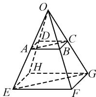
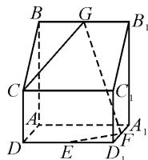
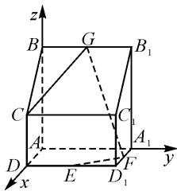
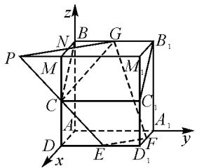
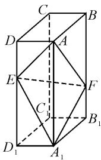

# 基于一道教材例题谈四点共面问题的解法

# 贵州省毕节市第二实验高中 张泽勇

摘要: 四点共面的问题在高考中是一个常规考点, 但是在高考备考复习的过程中很多学生掌握的四点共面问题的证明方法比较单一, 而新高考更加注重学生思维能力的考查, 所以对学生思维能力的培养是非常有必要的. 本文中基于一道教材例题, 通过一题多解探讨几种常见的证明四点共面的方法.

关键词: 四点共面; 思维能力; 一题多解

# 1 源于教材

题 1 [人教 A 版(2019)选择性必修第一册第 5 页例 1] 如图 1, 已知平行四边形 ABCD, 过平面 AC 外一点 O 作射线 OA, OB, OC, OD, 在四条射线上分别取点 E, F, G, H, 使 $\frac{OE}{OA} = \frac{OF}{OB} = \frac{OG}{OC} = \frac{OH}{OD} = k$ .

text_image

Geometric diagram of a pyramid with labeled vertices and internal points, showing solid and dashed edges for 3D perspective.

图1

求证: E, F, G, H 四点共面.

思路1: 欲证明 E, F, G, H 四点共面, 只需证明 $\overrightarrow{EH}, \overrightarrow{EF}, \overrightarrow{EG}$ 共面, 即证存在唯一的有序实数对 $(x, y)$ , 使得 $\overrightarrow{EG} = x \overrightarrow{EF} + y \overrightarrow{EH}$ 成立. 而由已知 $\overrightarrow{AD}, \overrightarrow{AB}, \overrightarrow{AC}$ 共面, 可以利用向量运算, 由 $\overrightarrow{AD}, \overrightarrow{AB}, \overrightarrow{AC}$ 共面的表达式推得 $\overrightarrow{EG} = x \overrightarrow{EF} + y \overrightarrow{EH}$ .

证法 1: 因为 $\frac{OE}{OA} = \frac{OF}{OB} = \frac{OG}{OC} = \frac{OH}{OD} = k$ ，所以 $\overrightarrow{OE} = k \overrightarrow{OA}, \overrightarrow{OF} = k \overrightarrow{OB}, \overrightarrow{OG} = k \overrightarrow{OC}, \overrightarrow{OH} = k \overrightarrow{OD}$ 。因为四边形 ABCD 是平行四边形，所以 $\overrightarrow{AC} = \overrightarrow{AB} + \overrightarrow{AD}$ 。

$$
\begin{array}{r l} & {\text {因此} \overrightarrow {E G} = \overrightarrow {O G} - \overrightarrow {O E} = k   \overrightarrow {O C} - k   \overrightarrow {O A} = k   \overrightarrow {A C} =} \\ & {k (\overrightarrow {A B} + \overrightarrow {A D}) = k   (\overrightarrow {O B} - \overrightarrow {O A} + \overrightarrow {O D} - \overrightarrow {O A}) = \overrightarrow {O F} -} \\ & {\overrightarrow {O E} + \overrightarrow {O H} - \overrightarrow {O E} = \overrightarrow {E F} + \overrightarrow {E H}.} \end{array}
$$

由向量共面的充要条件可知， $\overrightarrow{EH},\overrightarrow{EF},\overrightarrow{EG}$ 共面，又 $\overrightarrow{EH},\overrightarrow{EF},\overrightarrow{EG}$ 过同一点 E，从而 E,F,G,H 四点共面.

思路 2: 还可以用向量共面的充要条件的推论解决 E, F, G, H 四点共面的问题, 即证存在唯一的有序实数对 $(x, y, z)$ , 使得 $\overrightarrow{OG} = x \overrightarrow{OE} + y \overrightarrow{OF} + z \overrightarrow{OH}$ , $x + y + z = 1$ 成立.

证法 2: 因为

$$
\begin{array}{l} \overrightarrow {O G} = k \overrightarrow {O C} \\ = k (\overrightarrow {O A} + \overrightarrow {A C}) \\ = k \overrightarrow {O A} + k \overrightarrow {A C} \\ = \overrightarrow {O E} + k (\overrightarrow {A B} + \overrightarrow {A D}) \\ = \overrightarrow {O E} + k \overrightarrow {A B} + k \overrightarrow {A D} \\ \end{array}
$$

$$
\begin{array}{l} = \overrightarrow {O E} + k (\overrightarrow {O B} - \overrightarrow {O A}) + k (\overrightarrow {O D} - \overrightarrow {O A}) \\ = \overrightarrow {O E} + k \overrightarrow {O B} - k \overrightarrow {O A} + k \overrightarrow {O D} - k \overrightarrow {O A} \\ = \overrightarrow {O E} + \overrightarrow {O F} - 2 \overrightarrow {O E} + \overrightarrow {O H} \\ = - \overrightarrow {O E} + \overrightarrow {O F} + \overrightarrow {O H}, \text {且} - 1 + 1 + 1 = 1, \\ \end{array}
$$

所以 E, F, G, H 四点共面.

思路 3: 根据推论 3“经过两条平行直线有且只有一个平面”, 可知, 要证 E, F, G, H 四点共面, 只需要证明 $EF \parallel HG$ 即可.

证法 3: 因为 $\frac{OE}{OA} = \frac{OF}{OB} = k$ ，根据平行线分线段成比例定理的逆定理知， $AB \parallel EF$ 。同理可得， $DC \parallel HG$ 。由基本事实 4，可得 $EF \parallel HG$ 。根据推论 3 经过“两条平行直线有且只有一个平面”可得，E, F, G, H 四点共面。

归纳:证法 1 和证法 2 都需要先建立立体图形与空间向量的联系,用空间向量表示问题中涉及的点、直线,把立体几何问题转化为向量问题,然后通过向量的运算,再把向量运算的结果利用向量共面的充要条件或者推论“翻译”成 E,F,G,H 四点共面.证法 3 则是根据基本事实 1 和基本事实 2 得到的推论 3,证明两条直线平行,从而得到结论,这个方法一般在问题中涉及有中位线或者平行四边形的时候比较常用.

这道题源于人教 A 版(2019)选择性必修第一册第 5 页的例 1,从考查的知识点角度来看,已经达到了课程标准所要求的目的,但从高考备考复习来看,还需要进一步变式,通过一题多变、一题多解、多种变式的手段让高三学生能够深度学习,真正掌握四点共面的证明问题.下面,笔者将上题中的三棱锥变为直四棱柱,此时可以建立空间直角坐标系,从而能够用空间向量定量化地表达立体图形中的点、线、面,因此在解法上更加具有灵活性和多样性.

# 2 变式探究

题 2 如图 2 所示, 在直四棱柱 $ABCD-A_{1}B_{1}C_{1}D_{1}$ 中, $AB \parallel CD$ , $AB \perp AD$ , $AA_{1} = AB = 2AD =$

  
图 2

$2CD = 4, E, F, G$ 分别为棱 $DD_{1}, A_{1}D_{1}, BB_{1}$ 的中点，求证： $C, E, F, G$ 四点共面.

思路1:建立空间直角坐标系,将空间图形中的点、线用向量的坐标来表示.要证C,E,F,G四点共面,只需证明存在唯一的有序实数对 $(m,n)$ ,使得 $\overrightarrow{CF}=m\overrightarrow{CE}+n\overrightarrow{CG}$ 成立即可.

证法 1: 以 A 为原点, 建立如图 3 所示的空间直角坐标系.

于是 $C(2,0,2)$ , $E(2,2,0)$ , $F(1,4,0), G(0,2,4).$

所以 $\overrightarrow{CG} = (-2,2,2),\overrightarrow{CF} = (-1,4, - 2),\overrightarrow{CE} = (0,2, - 2)$ 则 $\overrightarrow{CG}$ 与 $\overrightarrow{CE}$ 不共线.

text_image

z
B G B₁
C C₁
A A₁
D E D₁ y
x

图3

令 $\overrightarrow{CF} = m\overrightarrow{CE} + n\overrightarrow{CG}$ ，则可得 $(-1,4, - 2) =$ $m(0,2, - 2) + n(-2,2,2) = (-2n,2m + 2n, - 2m + 2n).$

于是有 $\left\{\begin{aligned}-1&=-2n,\\ 4&=2m+2n,\\ -2&=-2m+2n,\end{aligned}\right.$ 解得 $\left\{\begin{aligned}m&=\frac{3}{2},\\ n&=\frac{1}{2}.\end{aligned}\right.$

所以 $\overrightarrow{CF} = \frac{3}{2}\overrightarrow{CE} +\frac{1}{2}\overrightarrow{CG}.$

由向量共面的充要条件可知，C,E,F,G 四点共面.

思路 2: 要证 C, E, F, G 四点共面, 根据向量共面的充要条件的推论, 只需证 $\overrightarrow{AG} = x \overrightarrow{AE} + y \overrightarrow{AF} + z \overrightarrow{AC} (x + y + z = 1)$ 即可.

证法 2: 以 A 为原点, 建立如图 3 所示的空间直角坐标系, 则 $A(0,0,0)$ , $C(2,0,2)$ , $E(2,2,0)$ , $F(1,4,0)$ , $G(0,2,4)$ .

所以 $\overrightarrow{AG} = (0,2,4),\overrightarrow{AE} = (2,2,0),\overrightarrow{AF} = (1,4,0),$ $\overrightarrow{AC} = (2,0,2).$

令 $\overrightarrow{AG} = x\overrightarrow{AE} +y\overrightarrow{AF} +z\overrightarrow{AC}$ ，则

$$
\begin{array}{c} (0, 2, 4) = x (2, 2, 0) + y (1, 4, 0) + z (2, 0, 2) = \\ (2 x + y + 2 z, 2 x + 4 y, 2 z). \end{array}
$$

所以 $\left\{\begin{aligned}0&=2x+y+2z,\\ 2&=2x+4y,\quad 解得 x=-3,y=2,z=2.\\ 4&=2z,\end{aligned}\right.$

因此 $\overrightarrow{AG}=-3\overrightarrow{AE}+2\overrightarrow{AF}+2\overrightarrow{AC}$ ，且 $-3+2+2=1$ .

根据向量共面的充要条件的推论可知，C, E, F, G 四点共面.

思路 3: 欲证 C, E, F, G 四点共面, 可先在 GF 上取一点 P, 使得 $CP \parallel EF$ 成立, 即 CP 与 EF 确定一个平面 $\alpha$ , 再证 $G \in \alpha$ 即可.

证法 3: 以 A 为原点, 建立如图 3 所示的空间直角坐标系, 则 $A(0,0,0)$ , $C(2,0,2)$ , $E(2,2,0)$ , $F(1,4,0)$ , $G(0,2,4)$ .

所以 $\overrightarrow{CG} = (-2,2,2),\overrightarrow{EF} = (-1,2,0),\overrightarrow{GF} = (1,2,-4)$ . 在 $GF$ 上取一点 $P$ ，使得 $\overrightarrow{GP} = \lambda \overrightarrow{GF}$ ，则$\overrightarrow{AP} = \overrightarrow{AG} +\overrightarrow{GP} = \overrightarrow{AG} +\lambda \overrightarrow{GF} = (0,2,4) + \lambda (1,2, - 4) =$ $(\lambda ,2 + 2\lambda ,4 - 4\lambda)$

所以点 P 坐标为 $(\lambda, 2 + 2\lambda, 4 - 4\lambda)$ ，则 $\overrightarrow{CP} = (\lambda - 2, 2 + 2\lambda, 2 - 4\lambda)$ .

若 $\overrightarrow{CP} \parallel \overrightarrow{EF}$ ，则存在唯一的实数t，使得 $\overrightarrow{CP}=$ $t\overrightarrow{EF}$ ，即 $\left\{\begin{aligned}\lambda-2&=-t,\\ 2+2\lambda&=2t,\\ 2-4\lambda&=0,\end{aligned}\right.$ 解得 $\left\{\begin{aligned}\lambda&=\frac{1}{2},\\ t&=\frac{3}{2}.\end{aligned}\right.$

所以 $\overrightarrow{CP} = \frac{3}{2}\overrightarrow{EF}$ , 即 $\overrightarrow{CP} // \overrightarrow{EF}$ , 故 $CP // EF$ . 由推论 3“经过两条平行直线有且只有一个平面”可知, $CP$ 与 $EF$ 确定一个平面 $\alpha$ . 又 $G \in PF$ , 由基本事实 2 可知, $G \in \alpha$ .

故 C, E, F, G 四点共面.

思路 4: 欲证 C, E, F, G 四点共面, 根据推论 2“经过两条相交直线有且只有一个平面”可知, 只需证 GC 与 EF 相交于点 P 即可.

证法 4: 以 A 为原点, 建立如图 3 所示的空间直角坐标系, 则 $A(0,0,0)$ , $C(2,0,2)$ , $E(2,2,0)$ , $F(1,4,0)$ , $G(0,2,4)$ . 所以 $\overrightarrow{GC} = (2, -2, -2)$ , $\overrightarrow{FE} = (1, -2, 0)$ .

假设 $GC$ 与 $EF$ 相交于点 $P$ , 则存在唯一的实数 $m, n$ , 使得 $\overrightarrow{GP} = m\overrightarrow{GC}, \overrightarrow{FP} = n\overrightarrow{FE}$ 成立.

于是 $\overrightarrow{AP} = \overrightarrow{AG} +\overrightarrow{GP} = \overrightarrow{AG} +m\overrightarrow{GC} = (0,2,4) + m(2, - 2, - 2) = (2m,2 - 2m,4 - 2m)$ ，所以点 $P$ 的坐标为（ $2m,2 - 2m,4 - 2m)$ .又 $\overrightarrow{AP} = \overrightarrow{AF} +\overrightarrow{FP} =$ $\overrightarrow{AF} +n\overrightarrow{FE} = (1,4,0) + n(1, - 2,0) = (1 + n,4 - 2n,0)$ 所以点 $P$ 的坐标为 $(1 + n,4 - 2n,0)$

所以 $\left\{\begin{aligned}&2m=1+n,\\ &2-2m=4-2n,\text{解得}m=2,n=3.\\ &4-2m=0,\end{aligned}\right.$

故存在 $\overrightarrow{GP} = 2\overrightarrow{GC},\overrightarrow{FP} = 3\overrightarrow{FE}$ ，使得 $GC$ 与 $EF$ 相交于点 $P(4, - 2,0)$ .由推论2“经过两条相交直线，有且只有一个平面”可知， $C,E,F,G$ 四点共面.

思路 5: 要证 C, E, F, G 四点共面, 只需证平面 EFC 与平面 GFC 重合, 即证平面 EFC 与平面 GFC 的法向量共线即可.

证法 5: 以 A 为原点, 建立如图 3 所示的空间直角坐标系, 则 $C(2,0,2)$ , $E(2,2,0)$ , $F(1,4,0)$ , $G(0,2,4)$ , 所以 $\overrightarrow{EF}=(-1,2,0)$ , $\overrightarrow{EC}=(0,-2,2)$ .

设平面 EFC 的法向量为 $\boldsymbol{n}=(x,y,z)$ ，则可得 $\left\{\begin{aligned}&n\cdot\overrightarrow{EF}=0,\\ &n\cdot\overrightarrow{EC}=0,\end{aligned}\right.$ 即 $\left\{\begin{aligned}-x+2y=0,\\ -2y+2z=0.\end{aligned}\right.$ 令 z=1，则 x=2,y=1，

所以平面 EFC 的一个法向量为 $\boldsymbol{n}=(2,1,1)$ . 同理可得平面 GFC 的一个法向量为 $\boldsymbol{m}=(4,2,2)$ . 所以 $m=2n$ , 即 $m \parallel n$ . 又平面 EFC 与平面 GFC 有公共点 C, 所以平面 EFC 与平面 GFC 重合.

故 C, E, F, G 四点共面.

思路 6: 要证 C, E, F, G 四点共面, 由基本事实 1, 可先确定平面 EFC, 再证明点 G 在平面 EFC 内, 只需证点 G 到平面 EFC 的距离为 0.

证法6:以A为原点,建立如图3所示的空间直角坐标系,则 $A(0,0,0)$ , $C(2,0,2)$ , $E(2,2,0)$ , $F(1,4,0)$ , $G(0,2,4)$ ,所以 $\overrightarrow{EG}=(-2,0,4)$ .

由证法 5 知平面 EFC 的一个法向量为 $\boldsymbol{n}=(2,1,1)$ ，则点 G 到平面 EFC 的距离为

$$
d = \frac {| \overrightarrow {E G} \cdot \boldsymbol {n} |}{| \boldsymbol {n} |} = \frac {| - 2 \times 2 + 0 \times 1 + 4 \times 1 |}{\sqrt {4 + 1 + 1}} = 0.
$$

所以点 G 在平面 EFC 内. 故 C, E, F, G 四点共面.

思路 7: 可先将直四棱柱 $ABCD-A_{1}B_{1}C_{1}D_{1}$ 补全为长方体 $ABMD-A_{1}B_{1}M_{1}D_{1}$ ，取 BM 的中点 N，连接 NG 并延长交 $M_{1}M$ 的延长线于点 P，连接 PE。要证 C, E, F, G 四点共面，先证 PE 在 E, F, G 所在的平面内，再证点 C 在 PE 上即可。

证法 7: 根据题意, 将直四棱柱 $ABCD-A_{1}B_{1}C_{1}D_{1}$ 补全为长方体 $ABMD-A_{1}B_{1}M_{1}D_{1}$ , 取 BM 的中点 N, 连接 GN 并延长交 $M_{1}M$ 的延长线于点 P, 连接 PE, 并以 A 为原点, 建立如图 4 所示的空间直角坐标系. 易证 PG // EF,

text_image

z
P
N
B
G
B₁
M
M₁
C
C₁
A₁
A
D
E
D₁
F
y
x

图4

且 $N$ 为 $PG$ 的中点，所以 $PG$ 与 $EF$ 确定一个平面 $\alpha$ 所以 $PE \subset \alpha$ . 又 $C(2,0,2), E(2,2,0), N(1,0,4), G(0,2,4)$ ，得 $P(2,-2,4)$ . 所以 $\overrightarrow{PC} = (0,2,-2)$ ， $\overrightarrow{PE} = (0,4,-4)$ ，则 $\overrightarrow{PE} = 2\overrightarrow{PC}$ ，即 $P,C,E$ 三点共线，所以 $C \in PE$ ，即 $C \in \alpha$ . 故 $C,E,F,G$ 四点共面.

从上述几种方法中可以看到,向量作为一个数学工具,它将几何问题代数化,在解决几何问题中起到了非常重要的作用,特别是当向量用坐标表示后,在解决空间中四点共面问题的方法上更加具有多样性和灵活性,不仅打开了学生的思维空间,更是提高了数学学习的深度.

# 3 解法总结

空间中四点共面的问题,通常可以采用以下方法进行证明:

方法 1: 根据推论 3“经过两条平行直线有且只有一个平面”, 即若直线 $PA \parallel BC$ , 则 P, A, B, C 四点共面.

方法 2: 根据推论 2“经过两条相交直线有且只有一个平面”，即若直线 PA 与 BC 相交，则 P, A, B, C 四点共面 $^{[1]}$ .

方法 3: 利用结论“空间一点 P 位于平面 ABC 内

的充要条件是存在有序实数对 $(x,y)$ ，使 $\overrightarrow{AP}=x\overrightarrow{AB}+y\overrightarrow{AC}$ ”.

方法 4: 利用结论“已知空间任意一点 O 和不共线的三点 A, B, C，满足向量关系式 $\overrightarrow{OP} = x \overrightarrow{OA} + y \overrightarrow{OB} + z \overrightarrow{OC}$ （其中 $x + y + z = 1$ ）的 P 与 A, B, C 四点共面” $^{[2]}$ .

方法 5: 若平面 PAB 与平面 ABC 的法向量共线，且有公共点 A，则平面 PAB 与平面 ABC 重合，可得 P, A, B, C 四点共面.

方法6: 若点 P 到平面 ABC 的距离为 0, 则 P, A, B, C 四点共面.

方法 7: 可根据图形特点先补形为特殊几何体, 如长方体, 再将四点共面问题用上述方法 1\~6 解决, 将会事半功倍.

# 4 试题链接

题 3 （2020 年全国卷Ⅲ理科数学第 19 题）如图 5，在长方体 ABCD- $A_{1}B_{1}C_{1}D_{1}$ 中，点 E, F 分别在棱 $DD_{1}, BB_{1}$ 上，且 $2DE = ED_{1}, BF = 2FB_{1}$ .

(1) 证明: 点 $C_{1}$ 在平面 AEF 内;

(2) 若 AB=2, AD=1, $AA_{1}=3$ ,
求二面角 $A-EF-A_{1}$ 的正弦值.

# 5 教学启示

text_image

C
D
A
B
E
F
C
B₁
D₁
A₁

图 5

四点共面问题的证明主要考查学生对基本事实1和基本事实2及其推论2与推论3，共面向量充要条件定理及其推论的掌握情况，以及一些其他证明四点共面的方法。对于四点共面问题，大部分师生在高考备考复习中不够重视，教师缺少引导学生深入理解和掌握基本事实及其推论的相关结论，导致学生没有真正掌握四点共面问题的证明方法。特别是近年来在“三新”背景下，考题更加具有灵活性和多样性，我们更应该注重教材的导向作用，高考备考复习应当回归教材，立足课程标准，打开学生的思维和提升学生的探究能力，强化基础性、综合性、应用性、创新性[3]意识，培养学科素养、核心价值观等，让学生真正学会学习。

# 参考文献：

[1] 张彩霞. 一道四点共面试题的解法探究 [J]. 数学爱好者 (高考版), 2008(11): 39.

[2]林国红.巧用向量法证明四点共面——以2020年高考全国卷Ⅲ理科第19题为例[J].中学生理科应试,2021(4):1-2.

[3]王雅贞.一道高考立体几何试题的评析及教学反思[J].中学数学,2020(3):41-42.Z