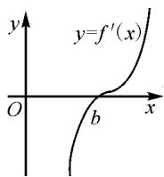

# 导数压轴,三招拿下

# ● 甘肃省静宁县威戎中学 张丛丛

导数问题常处于高考的压轴题位置,扑朔迷离,难度较大,题型灵活多变,可谓高考试卷的天花板!

通常是教师讲了一道又一道导数例题,给出了一个又一个的解题方法与解题技巧,学生似乎都记住了,但在高考中遇到新的导数题,有部分学生觉得原来学过的解题方法、技巧又不管用了.这种情况的出现往往是因为学生只机械地记住了解题方法与技巧,并没有形成数学思维.

在导数的教学中,教师不仅应该在战术层面上讲技巧和方法,更应该在战略层面上培养学生的数学思想,从而提升数学素养!这样才能避免上述情况的出现,这才是数学教学的更高境界 $^{[1]}$ .

对于导数解答题,若能熟练掌握下面三种方法,很好地理解其数学思想,则在求解此类题目时就能根据情况灵活加以应用.下面,笔者通过一道高考导数解答题的解法探究,对这三种方法做一诠释!

# 1 试题呈现

(2020年新高考Ⅰ卷节选)已知函数 $f(x)=a\mathrm{e}^{x-1}-\ln x+\ln a$ 若 $f(fx)\geqslant1$ 恒成立, 求实数 a 的取值范围.

# 2 解法探究

# 2.1 方法一: 隐零点法

隐零点是指函数在某一点处的导数等于零,但该点不能用具体或显性的表达式来表示,实际上就是指一个函数 $f(x)$ 可以利用零点的判断原理知道它在某个区间上有一个零点.隐零点的存在可以对函数的性质和变化趋势产生影响,需要结合具体场景进行分析和应用.

导函数中隐蔽,原函数中显形,探寻最终真相.

解析:由题意,可知 x>0,a>0.

由 $f(x)=a\mathrm{e}^{x-1}-\ln x+\ln a$ , 得

$$
f ^ {\prime} (x) = a \mathrm{e} ^ {x - 1} - \frac {1}{x}, f ^ {\prime \prime} (x) = a \mathrm{e} ^ {x - 1} + \frac {1}{x ^ {2}} > 0.
$$

所以 $f'(x)$ 在 $(0, +\infty)$ 上单调递增.

因为 $\lim_{x\to0}f'(x)=-\infty,\lim_{x\to+\infty}f'(x)=+\infty$ ，则 $f'(x)$ 在 $(0,+\infty)$ 有且只有一个零点，如图 1.

不妨设 $f'(b)=0, b\in(0,+\infty)$ ,
则 $a e^{b-1}=\frac{1}{b}.$

这里的 b 值不能求得,所以称为隐零点.

在定义域内,原函数、导函数随自变量的变化: 在 $(0, b)$ 上, $f'(x) < 0$ , $f(x)$ 单调递减; 在 $[b, +\infty)$ 上, $f'(x) \geqslant 0$ , $f(x)$ 单调递增. 因此 $f(x)$ 有最小值 $f(b) = a e^{b-1} - \ln b + \ln a$ .

  
图1

又因为 $a e^{b-1}=\frac{1}{b}$ ，所以可得

$$
\ln a + b - 1 = \ln \frac {1}{b}.
$$

于是 $\ln a = \ln \frac{1}{b} + 1 - b$ ，因此

$$
f (b) = \frac {1}{b} - \ln b + \ln \frac {1}{b} + 1 - b = 2 \ln \frac {1}{b} + \frac {1}{b} - b + 1.
$$

若 $f(x)\geqslant 1$ 恒成立，必有 $f(x)_{\min} = f(b)\geqslant 1$ ，则有

$$
\frac {1}{b} + 2 \ln \frac {1}{b} - b \geqslant 0.
$$

令 $g(x)=\frac{1}{x}+2\ln\frac{1}{x}-x$ ，显然 $g(x)$ 在 $(0,+\infty)$ 上单调递减.

又有 $g(1)=0$ ，则可推出 $b \leqslant 1$ 时， $\frac{1}{b} + 2\ln \frac{1}{b} - b \geqslant 0$ 恒成立.

由 $a\mathrm{e}^{b - 1} = \frac{1}{b}$ ，可推出

$$
a = \frac {\mathrm{e}}{b \mathrm{e} ^ {b}} \geqslant \frac {\mathrm{e}}{1 \times \mathrm{e}} = 1.
$$

综上，a 的取值范围为 $[1, +\infty)$ .

# 2.2 方法二: 异构函数法

异构函数法是一种通过变换定理和结构,从而将复杂的数学问题转化为简单已处理问题的方法.主要依赖于对一些已知的数学结构进行分析,将它们与目标问题的结构进行比较和映射,从而实现转化的目的.

如本题则可利用图象的单调性和凹凸性,切线放缩、端点效应,在坐标系中一见高下.

一次求导之后,原函数的单调性取决于导函数的正负.那么二次求导之后,一次导函数的单调性就依赖于二次导函数的正负,即原函数图象切线的斜率越来越陡还是越来越缓,也就是函数的凹凸性.如果二次求导得正,原函数图象为凹形;如果二次求导后得负,原函数为凸形 $^{[2]}$ .所以,我们利用一次求导定增减,二次求导定凹凸,来确定参变量的范围,这是一种用途十分广泛的方法.

解析: 令 $F(x)=a\mathrm{e}^{x-1}+\ln a-1$ , $G(X)=\ln x$ ,
其中 x>0, a>0，则

$$
F ^ {\prime} (x) = a \mathrm{e} ^ {x - 1} > 0, F ^ {\prime \prime} (x) = a \mathrm{e} ^ {x - 1} > 0,
$$

$$
G ^ {\prime} (x) = \frac {1}{x}, G ^ {\prime \prime} (x) = - \frac {1}{x ^ {2}} <   0.
$$

所以 $F(x)$ 在 $(0, +\infty)$ 上为单调递增的凹函数，而 $G(x) = \ln x$ 在 $(0, +\infty)$ 上为单调递增的凸函数.

要使得 $F(x) \geqslant G(x)$ 恒成立, $F(x)$ 随着 a 的变化而变化.

在这一过程中, 设 $F(x)$ 的图象与 $G(x)$ 的图象相切于点 $P(b, \ln b)$ .

由 P 在 $F(x)$ 上，可得 $\ln b = a e^{b-1} + \ln a - 1$ .

由 P 在 $F'(x)$ , $G'(x)$ 上, 可得 $a e^{b-1} = \frac{1}{b}$ .

联立上述两式, 得 $\frac{1}{b} + 2\ln \frac{1}{b} - b = 0$ .

由前面解法知,方程有唯一解 b=1.

于是由 $a e^{b-1}=\frac{1}{b}$ ，得 a=1。

欲使 $F(x)=ae^{x-1}\geqslant G(x)$ ，应有 $a\geqslant1$ .

故 a 的取值范围为 $[1, +\infty)$ .

# 2.3 方法三: 同构函数法

同构是通过合理的整理变形使函数的解析式变形成为我们熟悉的函数，或者把题干中的方程、不等式通过合理变形使得代数式的两边呈现出相同的结构，即把代数式变为 $f[g(x)]$ 与 $f[h(x)]$ 的关系，则可根据相同的结构构造函数 $f(x)$ ，进而利用函数 $f(x)$ 的单调性、最值等解决问题。其本质是复合函数的拆分，在解题中一个式子中出现两个变量，适当变形后，两边结构相同；或两个式子也可适当变形，使其结构相同，然后构造函数，利用函数的单调性解题；或运用同一方程代入求解，可以运用同构函数法。本题运用同构函数法求解，左右统一成为一个函数，由函数值的大小确定自变量的大小，从而得到参变量的范围。

解析：由 $a = \mathrm{e}^{\ln a}$ 可得 $\mathrm{e}^{\ln a}\mathrm{e}^{x - 1} - \ln x + \ln a - 1\geqslant 0.$

若 $a\mathrm{e}^{x - 1} - \ln x + \ln a\geqslant 1(x > 0,a > 0)$ 恒成立，则只需 $\mathrm{e}^{\ln a + x - 1} + \ln a - 1\geqslant \ln x$ 恒成立.

两边同时加 $x$ ，得 $\mathrm{e}^{\ln a + x - 1} + x + \ln a - 1\geqslant x + \ln x,$ 即 $\mathrm{e}^{\ln a + x + 1} + \ln a + x - 1\geqslant \mathrm{e}^{\ln x} + \ln x.$

令 $F(x)=\mathrm{e}^{x}+x$ ，则 $F'(x)=\mathrm{e}^{x}+1>0$ ，可知 $F(x)$ 在 $(0,+\infty)$ 上单调递增.

由 $F(\ln a + x - 1) \geqslant F(\ln x)$ , 可得

$$
\ln a + x - 1 \geqslant \ln x,
$$

则有 $\ln a \geqslant \ln x - x + 1$ .

再令 $H(x)=\ln x-x+1$ ，则有

$$
H ^ {\prime} (x) = \frac {1}{x} - 1 = \frac {1 - x}{x}.
$$

在 $(0,1)$ 上， $H'(x)>0$ ，函数 $H(x)$ 单调递增；在 $[1,+\infty)$ 上， $H'(x)\leqslant0$ ，函数 $H(x)$ 单调递减.

因此 $H(x)_{\max}=H(1)=\ln1-1+1=0.$

所以 $\ln a \geqslant 0$ ，即 $a \geqslant 1$ 。

综上，a 的取值范围为 $[1, +\infty)$ .

# 3 方法总结,思维提升

比较这三种方法,第三种同构之法,应该更加清晰简明.同构法在近几年的模拟考试中频繁出现,把等式或不等式两边变形为两个形式一样的结构,利用函数的单调性转化成比较大小,或者解恒成立、求最值等问题.同构法在使用时,考验“眼力”,面对复杂的结构,仔细观察灵活变形,使式子两侧的结构一致,进而构造函数.

第二种方法的异构,适用范围更加广泛,但解题过程要求较高.将原函数对应的一阶导函数所形成的多项式,称为原函数的导数多项式,它是一种更明确而游刃有余的导数表示方法,适用于各种数学问题的解决.

第一种方法的隐零点,则是解决导数问题最常用的工具,但不是所有的指对数含参问题都可以同构.因此要根据具体问题,选择恰当的解题方法,数学高考,取得好成绩不是梦想,只要努力和掌握正确的方法!

导数是大学数学课程的基础,在高中阶段,也是研究函数的图象和性质的重要工具,因此,高考命题者非常重视对导数内容的考查,把导数的应用作为高考命题的重点和必考点,且常考常新.导数的学习有利于提升学生的综合素养,利于培养学生良好的思维能力和解决问题的能力.

# 参考文献：

[1] 沐方华. 结构视域下的高中数学课堂教学实践——以“简单复合函数的导数”教学设计为例 [J]. 上海中学数学, 2022(Z2): 70-72.

[2]王学建.高中数学“学科育人”的五个维度——以“导数在函数单调性中的应用”教学为例[J].中学教学参考,2022(20):5-7,20.Z