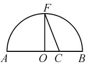
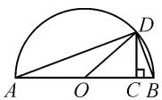
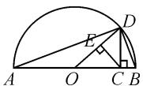
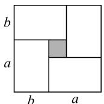
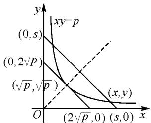
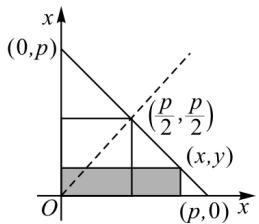

# 巧借无字证明 彰显数学之美

# ● 江苏省昆山中学 沈艳虹

无字证明,指的是仅用图象而无需文字解释就能不证自明的数学命题.无字证明提供的是可视化思维,借助图形的直观可以使数学知识变得更加生动具体,更易于学生理解和接受.下面笔者以“不等式”复习课为例,谈谈如何借助“无字证明”,达到“无声胜有声”的效果,彰显数学之美.

# 1 呈现问题

例 1 《几何原本》卷 2 的几何代数法(以几何方法研究代数问题)成了后世西方数学家处理问题的重要依据,通过这一原理,很多的代数的公理或定理都能够通过图形实现证明，也称为无字证明。如图1，点 $F$ 在半圆 $O$ 上，且 $OF \perp AB$ ，点 $C$ 在直径 $AB$ 上，设 $AC = a, BC = b$ ，该图形可以完成的无字证明是（ ）.

  
图1

A. $\frac{a+b}{2}\geqslant\sqrt{ab}(a>0,b>0)$   
B. $a^2 + b^2 \geqslant 2\sqrt{ab} (a > 0, b > 0)$   
C. $\frac{2ab}{a + b} \leqslant \sqrt{ab} (a > 0, b > 0)$   
D. $\frac{a + b}{2} \leqslant \sqrt{\frac{a^2 + b^2}{2}} (a > 0, b > 0)$

给出例 1 后, 笔者让学生独立求解, 从学生解题反馈来看, 大多数学生并没有得到正确的答案. 调查发现, 学生对无字证明的接触较少, 无法从图形中读取有效的信息, 所有没有找到解决问题的突破口, 从而引发错误. 因此在实际教学中, 教师应从学生实际情况出发, 引导学生经历问题解决的全过程, 让学生更好理解“无字证明”, 提升数学素养.

# 2 解决问题

针对学生对此类题目比较陌生的情况,笔者采用合作学习的方式展开教学,以期通过师生、生生的有效互动撬动学生的思维,帮助学生突破障碍,提高教学有效性.教学片断如下:

师:很多学生因为不理解“无字证明”而感觉无从下手,我们先从“无字证明”谈起,谁来说说你是如何理解“无字证明”的？

生 1: 我感觉就是不用文字, 用图形来证明命题.

师:确实如此,现在我们从熟悉的基本不等式出发,尝试完成无字证明.如图2,设AC=a,BC=b,如何证明 $\sqrt{ab}\leqslant\frac{a+b}{2}(a>0,b>0)$ ?

  
图2

这一问题是学生比较熟悉的内容,教师先让学生独立求解,然后呈现学生的思考过程.

生 2: 如图 2, $OD = \frac{a + b}{2}$ , 根据 $\triangle ACD \sim \triangle DCB$ , 所以有 $\frac{AC}{CD} = \frac{CD}{BC}$ , 则 $CD = \sqrt{ab}$ . 在 Rt $\triangle OCD$ 中, OD 是斜边, CD 是直角边, 则有 $\sqrt{ab} \leqslant \frac{a + b}{2}$ , 当且仅当 D 是弧 AB 的中点时, 等号成立.

师:很好! 大家结合已有知识和已有经验在图形中分别找到了 $\frac{a+b}{2}$ 和 $\sqrt{ab}$ ，利用它们的长短关系顺利地证明了结论。结合上面无字证明过程，请说说你的体会。

生 3: 证明过程简洁明了, 更易于理解和接受.

师:确实,无字证明使数学问题的解决变得更加直观、简洁.现在再来挑战一个新问题“设a>0,b>0,则 $\frac{2ab}{a+b}$ 为a,b的调和平均数”.如图

  
图3

3, 已知 AB 为半圆 O 的直径, C 是 AB 上一点, 过点 C 作 AB 的垂线交半圆 O 于点 D, 连接 OD, AD, BD. 过点 C 作 OD 的垂线, 垂足为 E. 设 AC = a, BC = b, 请在图形中分别找到可以表示 a, b 的算术平均数、几何平均数和调和平均数的线段.

给出问题后,学生很快给出线段 OD 的长度为 a, b 的算术平均数, CD 的长度为 a, b 的几何平均数, 问题的焦点主要集中在调和平均数的探究上. 教师鼓励学生以合作的方式共同探索该问题, 学生很快就有了发现.

生 4: $OD = \frac{a + b}{2}$ , $CD = \sqrt{ab}$ , 根据 $\triangle OCD \sim$

$\triangle CED$ ，可得 $\frac{OD}{CD} = \frac{CD}{ED}$ 即 $\frac{\frac{a + b}{2}}{\sqrt{ab}} = \frac{\sqrt{ab}}{DE}$ 所以有 $DE = \frac{2ab}{a + b}$ ，也就是说线段 $DE$ 的长是 $a,b$ 的调和平均数.

师:非常棒,你们能进一步说明三者存在怎样的大小关系吗?

生 $5:\frac{2ab}{a+b}\leqslant\sqrt{ab}\leqslant\frac{a+b}{2}$ ，当且仅当点 O 和点 C 重合时，等号成立.

师:非常好,大家不仅找到了符合条件的对应线段,又给出了具体证明过程,说明大家有着较强的观察能力和推理能力,值得表扬.另外,借助图形的直观,根据线段的长短比较,得到了三个平均数之间的大小关系,有效规避了代数法的冗长证明,更易于我们理解和掌握.

教师继续出示问题:借助图 4,你能证明以下两个式子吗?

(1) $(a + b)^2 -(a - b)^2 = 4ab$ ;   
(2) $\frac{a + b}{2} \geqslant \sqrt{ab}$ .

学生看到图 4 后容易联想到长方形和正方形的面积, 结合图形易于发现: 大正方形的面积为 $(a+b)^{2}$ , 小正方形(阴影正方形)的面积为 $(a-b)^{2}$ , 而二者的差正好为 4 个小长方形的面积之和, 由此可以确定结论(1). 对于

  
图 4

第(2)问,结合已有条件不难发现,大正方形的面积大于或等于四个长方形的面积之和,也即 $(a+b)^{2}\geqslant4ab$ ,又a>0,b>0,开方后易得 $\frac{a+b}{2}\geqslant\sqrt{ab}$ .

师:这样借助图形轻松地证明了蕴含其中的相等关系和不等关系,可见无字证明更加简洁、高效,合理的利用可以有效规避繁琐的代数证明,从而将数学的简约之美展现得淋漓尽致.接下来看看以下两个结论是否也可以利用无字证明来实现呢?教师继续出示问题:

(1)已知 $x > 0, y > 0$ ，若 $xy = p$ ，则 $x + y \geqslant 2\sqrt{p}$ ，当且仅当 $x = y$ 时，等号成立.  
(2)已知 x>0, y>0，若 $x+y=p$ ，则 $xy \leqslant \frac{p^{2}}{4}$ ，当且仅当 x=y 时，等号成立.

生 6: 对于第(1)问, 根据已知易于联想 xy = p 为双曲线的右支. 如图 5, $(x, y)$ 为双曲线 xy = p 上一动点, 令 $x + y = s$ , 则 s 可以看成直线在 y 轴上的截距, 当直线与双曲线相切时,切点坐标为 $(\sqrt{p},\sqrt{p})$ ,此时s取最小,其最小值为 $2\sqrt{p}$ .

师:非常好,借助双曲线顺利地解决了问题.对于第(2)问,你又想如何解决呢?

text_image

xy=p
(0,s)
(0,2√p)
(√p,√p)
(x,y)
O
(2√p,0)
(s,0)
x
y

图5

生7:由“定和”易于联想到直线.如图6, $(x,y)$ 是直线 $x+y=p$ 上一动点,S=xy可以看成图6阴影四边形的面积,显然它的面积不大于大三角形面积的一半,只有点 $(x,y)$ 在 $\left(\frac{p}{2},\frac{p}{2}\right)$ 时,阴影部分的面积为两坐标轴所围的三角形面积的一半,由此问题得证.

text_image

(0,p)
(p/2, p/2)
(x,y)
O
(p,0) x

图6

师:非常好,结合数的特征联想到了我们熟悉的形,巧妙地借助图形证明了“积定和最小”与“和定积最大”等问题.现在我们重新回归例1,你的答案是什么呢?

有了前面的探究基础,学生很快就有了答案,教师点明让一位基础相对薄弱的学生作答,学生给出如下说明:由图1可知, $OF=\frac{1}{2}AB=\frac{1}{2}(a+b)$ , $OC=\frac{1}{2}(a+b)-b=\frac{1}{2}(a-b)$ ,在Rt△OCF中,根据勾股定理易得 $CF=\sqrt{\left(\frac{a+b}{2}\right)^{2}+\left(\frac{a-b}{2}\right)^{2}}=\sqrt{\frac{a^{2}+b^{2}}{2}}$ ,又 $CF\geqslant OF$ .所以 $\frac{a+b}{2}\leqslant\sqrt{\frac{a^{2}+b^{2}}{2}}$ ,故答案选项为D.

师:通过经历以上探究过程,谈谈你有哪些收获?

......

# 3 教学反思

数学知识的抽象性、复杂性使得学生在理解时容易遇到障碍，进而影响学习信心和学习兴趣。而无字证明具有简洁、直观等特点，在数学教学中合理地加以应用往往可以使那些抽象的、难以理解的定理、公式等变得更加形象直观，学生理解起来更加轻松自如。因此在实际教学中，教师应重视开展无字证明，让学生主动用图形去解释复杂的代数问题，学会用几何方法研究代数问题，增强转化意识和数形结合意识，提升数学素养。Z