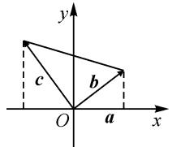
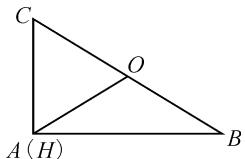
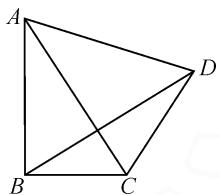
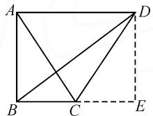
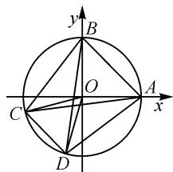

# 巧借特殊思维,妙解平面向量

# 江苏省江阴市澄西高级中学 金益锋

摘要: 特殊思维是一般思维的极端形式,也是数学客观题破解的一种“巧技妙法”.借助特殊思维,合适构建或选取平面向量问题中的特殊模型,以特殊元素、特殊图形或特殊性质等方式来应用,优化解题过程,减少逻辑推理与数学运算,指导师生的数学教学以及解题研究.

关键词: 思维; 平面向量; 元素; 图形

一般思维与特殊思维是辩证思维模式的基本方式,二者是辩证统一的.利用特殊思维来解决数学中的一些客观题,借助一般性问题的特殊化,通过特殊情况的研究与分析来判断一般性的规律,对于问题的快速有效破解起到关键的作用.“一般”中寻找“特殊”,“特殊”中呈现“一般”,优化解题过程,提升解题效益.

而在处理平面向量问题中,借助平面向量自身同时兼备“数”与“形”的双重特征,从“数”的视角或“形”的视角巧妙切入,合理利用特殊思维,通过特殊元素、特殊图形或特殊性质等方面来应用,对于巧妙解决问题至关重要.

# 1 特殊元素

在一些平面向量问题中,借助问题场景中的一般平面向量问题,通过构造或选取特殊的关系,包括特殊点、特殊位置、特殊向量等特殊元素的确定,化“动”为“静”,化“相对变化”为“相对静止”,化“陌生”为“熟悉”等,以特殊元素形式来分析与解决一般问题.

例 1 [福建省泉州市 2023 届高中毕业班质量监测(三)数学试卷(2023 年 3 月)]已知平面向量 a, b, c 满足 $\left|a\right|=1, b \cdot c=0, a \cdot b=1, a \cdot c=-1$ ，则 $\left|b+c\right|$ 的最小值为（）.

A.1

B. $\sqrt{2}$

C.2

D.4

分析:根据题目条件中向量的模,构建特殊向量,化“相对变化”为“相对静止”,进而引入并构建平面直角坐标系,结合其他相关向量的坐标设置,借助平面向量的数量积公式加以变形与转化,确定对应变量的关系式,利用平面向量的模公式以及基本不等式进行合理放缩处理.

解析: 在平面直角坐标系 xOy 中, 选择特殊向量 $\boldsymbol{a} = (1, 0)$ , 设 $\boldsymbol{b} = (x_{1}, y_{1}), \boldsymbol{c} = (x_{2}, y_{2})$ , 如图 1 所示.

text_image

y
c
b
O
a
x

图1

因为 $a \cdot b = 1, a \cdot c = -1, b \cdot c = 0$ ，所以 $x_{1} = 1, x_{2} = -1, x_{1}x_{2} + y_{1}y_{2} = 0$ ，则 $y_{1}y_{2} = 1$ 。

利用基本不等式,可得

$$
\begin{array}{l} \left| \boldsymbol {b} + \boldsymbol {c} \right| \\ = \sqrt {(x _ {1} + x _ {2}) ^ {2} + (y _ {1} + y _ {2}) ^ {2}} \\ = \sqrt {y _ {1} ^ {2} + y _ {2} ^ {2} + 2} \\ \geqslant \sqrt {2 y _ {1} y _ {2} + 2} = 2, \\ \end{array}
$$

当且仅当 $y_{1}=y_{2}=1$ 或 $y_{1}=y_{2}=-1$ 时，等号成立.

因此 $|b+c|$ 的最小值为2.

故选：C.

点评:根据平面向量的“数”的结构属性,通过平面直角坐标系的构建,借助特殊思维与特殊向量的选取,合理引入平面向量的坐标,利用平面向量中的相关要素,转化为涉及坐标的函数、方程或不等式等,进而从代数视角来数学运算与逻辑推理.

# 2 特殊图形

在一些平面向量问题中,借助问题场景中的一般平面几何图形,通过构造或选取特殊的直角三角形(往往涉及向量的垂直)、圆(往往涉及向量的模)、平行四边形(往往涉及向量的运算)等特殊图形,直观形象地来简单分析与解决问题.

例 2 [2023 届湖北省襄阳四中高三上学期周考 (8) 数学试卷] 在 $\triangle ABC$ 中，点 O、点 H 分别为 $\triangle ABC$ 的外心和垂心， $|AB|=5, |AC|=3$ ，则 $\overrightarrow{OH} \cdot \overrightarrow{BC}=$ \_\_\_\_.

分析:根据三角形中的相邻两边为定值的条件,合理构建特殊图形进行特殊思维,结合直角三角形的创设,快速确定对应的外心与垂心,结合平面向量的线性运算与数量积公式加以转化与应用.

解析:由于 $\triangle ABC$ 不能明确确定,而解题目标是求解平面向量的数量积 $\overrightarrow{OH} \cdot \overrightarrow{BC}$ 的值,可以借助特殊思维,选取特殊图形,视 $\triangle ABC$ 为直角三角形(此时

$AB \perp AC)$ ，则 $\triangle ABC$ 的外心 O 是 BC 的中点， $\triangle ABC$ 的垂心 H 与点 A 重合，如图 2 所示.

text_image

C
O
A (H)
B

图2

结合 $|AB|=5,|AC|=3,$ 可以得到 $\overrightarrow{OH}\cdot\overrightarrow{BC}=\overrightarrow{OA}\cdot\overrightarrow{BC}=$

$$
\begin{array}{l} \overrightarrow {A O} \cdot \overrightarrow {C B} = \frac {1}{2} (\overrightarrow {A B} + \overrightarrow {A C}) \cdot (\overrightarrow {A B} - \overrightarrow {A C}) = \\ \frac {1}{2} (\overrightarrow {A B ^ {2}} - \overrightarrow {A C ^ {2}}) = \frac {1}{2} (5 ^ {2} - 3 ^ {2}) = 8. \end{array}
$$

故填:8.

例 3 （2023 届福建省高三质检数学试题）如图 3，在平面四边形 ABCD 中， $\angle ABC = 90^{\circ}$ ， $\angle DCA = 2\angle BAC$ ，如果 $\overrightarrow{BD} = x\overrightarrow{BA} + y\overrightarrow{BC}, x, y \in R$ ，则 x - y 的值为 \_\_\_\_.

natural_image

Geometric diagram of a quadrilateral ABCD with diagonals AC and BD intersecting (no labels or text)

图3

分析:根据题设条件,利用相关点的一般性变化及其规律,借助特殊化思维,合理构建特殊图形——矩形及其相关边上的中点,综合平面向量相关的运算与几何意义等来分析与解决确定数值的相关问题.

解析:借助特殊思维选取特殊图形,在矩形ABED中,C是BE的中点,如图4所示,此时 $\angle ABC=90^{\circ},\angle DCA=2\angle BAC$ ,满足题设条件.

  
图4

结合 $\overrightarrow{BD}=x\overrightarrow{BA}+y\overrightarrow{BC}$ ，利用平面向量的线性运算与分解，数形结合可知x=1,y=2.

所以 $x - y = -1$

故填：-1.

点评: 特殊思维是破解确定值问题中比较常用的一种技巧与方法, 这里通过特殊图形, 以变化的形式选取其中具有特殊意义或方便操作、运算、直观等方面的特殊图形来直接确定. 在实际解题过程中, 经常选取吻合题设条件的特殊三角形、四边形或圆等特殊图形, 结合题设条件来合理配凑与直观应用.

# 3 特殊性质

在一些平面向量问题中,借助问题场景中的一般图形或一般关系式的结构特征等,通过构建特殊的性质关系、特征应用等,如对应向量的垂直关系、平行关系、对称关系、运算关系以及数量积关系式等特殊形式,进而加以特殊化处理与解决.

例 4 [2023 届山东省潍坊市高考模拟考试数学试卷(2023 潍坊东营一模)] 单位圆 $O: x^{2} + y^{2} = 1$ 上有两定点 A(1,0), B(0,1) 及两动点 C, D，且 $\overrightarrow{OC} \cdot$

$\overrightarrow{OD}=\frac{1}{2}$ ，则 $\overrightarrow{CA}\cdot\overrightarrow{CB}+\overrightarrow{DA}\cdot\overrightarrow{DB}$ 的最大值是().

$$
\mathrm{A.} 2 + \sqrt {6} \quad \mathrm{B.} 2 + 2 \sqrt {3} \quad \mathrm{C.} \sqrt {6} - 2 \quad \mathrm{D.} 2 \sqrt {3} - 2
$$

分析:根据题设条件,所求平面向量关系式中的轮换结构特征,吻合特殊思维中的对称性思维,结合单项选择题的特点,借助特殊思维,从对称性来分析,利用特殊位置,并结合图形直观以及向量的运算,实现问题的简化与求解.

解析:由题知, $|\overrightarrow{OC}|=|\overrightarrow{OD}|=1.$

由 $\overrightarrow{OC} \cdot \overrightarrow{OD} = \frac{1}{2}$ , 可得

$$
| \overrightarrow {O C} | | \overrightarrow {O D} | \cos \angle C O D = \cos \angle C O D = \frac {1}{2}.
$$

所以 $\angle COD = \frac{\pi}{3}$

根据所求关系式 $\overrightarrow{CA}\cdot\overrightarrow{CB}+\overrightarrow{DA}\cdot\overrightarrow{DB}$ 的结构特征,结合特殊思维中的对称性,可知当 $AB\parallel CD$ 时取得最值,如图5所示,此时 $\angle ACB=\frac{\pi}{4},\angle BOC=\frac{7\pi}{12}$ ,而

text_image

y
B
O
A
x
C
D

图5

$$
\mid \overrightarrow {O A} + \overrightarrow {O B} \mid = \sqrt {2}.
$$

所以， $\overrightarrow{CA}\cdot\overrightarrow{CB}+\overrightarrow{DA}\cdot\overrightarrow{DB}$ 的最大值为

$$
\begin{array}{l} 2 \overrightarrow {C A} \cdot \overrightarrow {C B} \\ = 2 (\overrightarrow {O A} - \overrightarrow {O C}) \cdot (\overrightarrow {O B} - \overrightarrow {O C}) \\ = 2 \left[ \overrightarrow {O A} \cdot \overrightarrow {O B} + \overrightarrow {O C ^ {2}} - \overrightarrow {O C} \cdot (\overrightarrow {O A} + \overrightarrow {O B}) \right] \\ = 2 \left[ 1 - 1 \times \sqrt {2} \times \cos \left(\frac {\pi}{4} + \frac {7 \pi}{1 2}\right) \right] \\ = 2 + \sqrt {6}. \\ \end{array}
$$

故选：A.

点评:当然,在实际利用特殊性质处理问题时,要利用特殊思维的不同应用与特殊场景加以展开与分析.在以上问题中,只是利用特殊思维处理时,要注意不同特殊场景的应用,以上图形中所求关系式取得最大值,而当 $AB \parallel CD$ 且 CD 位于第一象限时取得最小值,为该问题的进一步拓展与提升提供条件.

特殊思维经常用于一些平面向量中含有某些不确定的量的场合，通过特殊元素、特殊图形、特殊性质等特殊思维的应用，可将题目中变化的不定量选取一些符合条件的特殊情况来进行处理，从而得出所要探求的结论。借助特殊思维处理，合理构建与选取特殊情况，使得问题更加熟悉、更加简洁、更加简单，可以大大地简化推理、论证的过程，减少数学运算，优化解题效益。Z