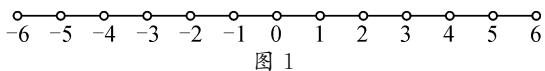

# 探究二项分布的三类概率最大值问题\*

# ● 福建省南安第一中学 陈佳祥

摘要:二项分布是重要的概率模型,二项分布概率公式含有三个参数 n,k,p,固定其中两个参数,探究二项分布三类最大值模型,并理论系统分析,从不同的视角再创造课本习题,结合案例综合应用,尝试在数学教学实践中培养学生的数学运算与推理素养.

关键词:二项分布;概率;最大值

二项分布最早出现在 1654 年法国数学家帕斯卡与费马关于“点子问题”的通讯里；1713 年伯努利给出了独立事件的概率乘法定理，严格证明了二项分布概率公式 $^{[1]}$ ，将符合这种条件的试验模型称为伯努利概型。二项分布是一类重要的伯努利模型，而二项分布概率最大值问题模型综合性强，是考查的重难点，2019 普通高中教科书选择性必修第三册（人教 A 版）给出了二项分布性质的部分研究。本文中从教材的二项分布概率最大值模型出发，从不同的视角审视一道习题，从知识融会贯通的高度，对课本习题进行变形探究、演绎推广、深化拓展，再创造，再发现。

# 1 二项分布的概念

一般地,在 n 重伯努利试验中,设每次试验中事件 A 发生的概率为 $p(0<p<1)$ ,用 X 表示事件 A 发生的次数,则 X 的分布列为

$$
P (X = k) = \mathrm{C} _ {n} ^ {k} p ^ {k} 1 - p) ^ {n - k}, k = 0, 1, 2, \dots \dots , n.
$$

如果随机变量 X 的分布列具有上式的形式, 则称随机变量 X 服从二项分布, 记作 $X \sim B(n, p)$ , 并称 p 为成功概率.

注： $C_{n}^{k}p^{k}(1-p)^{n-k}, k=0,1,2,\cdots,n$ 是二项式 $[(1-p)+px]^{n}$ 的展开式中 $x^{k}$ 项的系数，故称为二项分布。特别地，当 n=1 时，二项分布 $P(X=k)=p^{k}(1-p)^{1-k}, k=0,1$ 就是两点分布。

若 $X \sim B(n, p)$ , 则 $E(X) = np, D(X) = np(1 - p)$ .

# 2 二项分布的三类最大值

教材中固定 n, p, 类比函数, 研究二项分布 $f(k)=P(X=k)$ 的单调性和最值性质, 如下情形 1.2018年全国高考Ⅰ卷第20题固定n,k，亦考查二项分布最大值.其实仔细观察会发现， $C_{n}^{k}p^{k}(1-p)^{n-k}$ 本身含有三个参数n,p,k，若固定其中两个参数，另外一个参数取何值时对应的二项分布概率最大有如下三类情形.

# 2.1 情形 1: 给定 n, p

当 n, p 给定时, 可以得到函数 $f(k) = \mathrm{C}_{n}^{k} p^{k} \cdot (1 - p)^{n-k}, k = 0, 1, 2, \cdots, n$ , 这个是数列的最值问题.

$$
\begin{array}{c} \frac {p _ {k}}{p _ {k - 1}} = \frac {\mathrm{C} _ {n} ^ {k} p ^ {k} (1 - p) ^ {n - k}}{\mathrm{C} _ {n} ^ {k - 1} p ^ {k - 1} (1 - p) ^ {n - k + 1}} = \frac {(n - k + 1) p}{k (1 - p)} = \\ \frac {k (1 - p) + (n + 1) p - k}{k (1 - p)} = 1 + \frac {(n + 1) p - k}{k (1 - p)} (k \in \mathbf {N} ^ {*}). \end{array}
$$

分析: 当 $k<(n+1)p$ 时, $p_{k}>p_{k-1}$ , $p_{k}$ 随 k 值的增大而增大; 当 $k>(n+1)p$ 时, $p_{k}<p_{k-1}$ , $p_{k}$ 随 k 值的增大而减小. 若 $(n+1)p$ 为正整数, 当 $k=(n+1)p$ 时, $p_{k}=p_{k-1}$ , 此时这两项概率均为最大值. 若 $(n+1)p$ 为非整数, k 取 $(n+1)p$ 的整数部分, 则 $p_{k}$ 是唯一的最大值.

使 $P(X=k)$ 取最大值的项 $P(X=m)$ 称为 $P(X=k)$ 的中心项，而称 m 为最可能成功次数，若 $(n+1)p$ 是整数，则也是最可能成功次数.

注:在二项分布中,若数学期望为整数,则当随机变量 k 等于期望时,概率最大.

# 2.2 情形 2: 给定 n, k

当 n, k 给定时, 可以得到函数 $f(p) = \mathrm{C}_{n}^{k} p^{k} \cdot (1 - p)^{n-k}, p \in (0, 1)$ , 这个是函数的最值问题, 可以用导数求函数最值与最值点.

分析: $f'(p)=C_{n}^{k}[kp^{k-1}(1-p)^{n-k}-p^{k}(n-k)\cdot(1-p)^{n-k-1}]=C_{n}^{k}p^{k-1}(1-p)^{n-k-1}[k(1-p)-$

$$
(n - k) p ] = \mathrm{C} _ {n} ^ {k} p ^ {k - 1} (1 - p) ^ {n - k - 1} (k - n p).
$$

当 $p < \frac{k}{n}$ 时， $f'(p) > 0, f(p)$ 单调递增；当 $p > \frac{k}{n}$ 时， $f'(p) < 0, f(p)$ 单调递减。故当 $p = \frac{k}{n}$ 时， $f(p)$ 取得最大值， $f(p)_{\max} = f\left(\frac{k}{n}\right)$ 。又当 $p \to 0, f(p) \to 1$ ，当 $p \to 1$ 时， $f(p) \to 0$ ，从而 $f(p)$ 无最小值。

# 2.3 情形 3: 给定 k, p

当 k, p 给定时, 可得到函数 $f(n) = C_{n}^{k} p^{k} \cdot (1 - p)^{n-k}, k = 0, 1, 2, \cdots, n$ , 这个是数列的最值问题.

$$
\begin{array}{l} \frac {f (n + 1)}{f (n)} = \frac {\mathrm{C} _ {n + 1} ^ {k} p ^ {k} (1 - p) ^ {n + 1 - k}}{\mathrm{C} _ {n} ^ {k} p ^ {k} (1 - p) ^ {n - k}} \\ = \frac {(n + 1) (1 - p)}{n + 1 - k} \\ = 1 + \frac {k - p (n + 1)}{(n + 1 - k)}. \\ \end{array}
$$

分析: 当 $n < \frac{k}{p} - 1$ 时, $f(n + 1) > f(n)$ , $f(n)$ 随着 n 值的增大而增大; 当 $n > \frac{k}{p} - 1$ 时, $f(n + 1) < f(n)$ , $f(n)$ 随着 n 值的增大而减小. 记 $m = \left[\frac{k}{p}\right]$ , 则 $f(n)_{\max} = f(m)$ .

# 3 典例分析

题源 （教材第 81 页练习 3）如图 1, 一个质点在随机外力的作用下, 从原点 0 出发, 每隔 1 s 等可能地向左或向右移动一个单位, 共移动 6 次. 求下列事件的概率.

text_image

-6 -5 -4 -3 -2 -1 0 1 2 3 4 5 6
图 1

(1)质点回到原点；

(2)质点位于4的位置.

例 1 （改编）一质点从数轴上的原点出发每次只能向左或向右移动一个单位长度，且每次运动方向相互独立，质点向右运动的概率为 $p(0 < p < 1)$ .

(1)设质点运动9次后,所在位置对应的数为-3的概率为 $f(p)$ ,求 $f(p)$ 的最大值点 $p_{0}$ .  
(2)以(1)中确定的 $p_{0}$ 值为 p 的值, 设运动 n 次后质点所在位置对应的数为随机变量 $\xi_{n}$ .

①若 n=2023，求质点最有可能运动到的位置对应的数，并说明理由；

②求 $E(\xi_{n})-D(\xi_{n})$ 的值.

解:(1)因为质点运动9次后,所在位置对应的数为-3,所以质点向右运动3次,向左运动6次,在一次运动中，质点向右运动的概率为 $p$ ，故 $f(p) = \mathrm{C}_9^3 p^3\cdot (1 - p)^6$ ，则 $f^{\prime}(p) = 3\mathrm{C}_{9}^{3}p^{2}(1 - p)^{5}(1 - 3p)(0 <   p <   1).$

当 $0 < p < \frac{1}{3}$ 时， $f'(p) > 0$ ; 当 $\frac{1}{3} < p < 1$ 时， $f'(p) < 0$ . 所以函数 $f(p)$ 在 $\left(0, \frac{1}{3}\right)$ 上单调递增，在 $\left(\frac{1}{3}, 1\right)$ 上单调递减，故当 $p = \frac{1}{3}$ 时， $f(p)$ 有最大值，即 $p_{0} = \frac{1}{3}$ .

(2)①设运动 2023 次中有 X 次向右运动，则 $X \sim B\left(2023, \frac{1}{3}\right)$ , $\xi_{2023} = 2X - 2023$ .

所以 $P(X=k)=P(\xi_{2023}=2k-2023)=C_{2023}^{k}\cdot\left(\frac{1}{3}\right)^{k}\left(\frac{2}{3}\right)^{2023-k}.$

问题等价于 k 取何值时, $P(X=k)=\mathrm{C}_{2023}^{k}\left(\frac{1}{3}\right)^{k}\cdot\left(\frac{2}{3}\right)^{2023-k}$ 取得最大值.

法 1: 由

$$
\left\{ \begin{array}{l} C _ {2 0 2 3} ^ {k} \left(\frac {1}{3}\right) ^ {k} \left(\frac {2}{3}\right) ^ {2 0 2 3 - k} \geqslant C _ {2 0 2 3} ^ {k - 1} \left(\frac {1}{3}\right) ^ {k - 1} \left(\frac {2}{3}\right) ^ {2 0 2 4 - k}, \\ C _ {2 0 2 3} ^ {k} \left(\frac {1}{3}\right) ^ {k} \left(\frac {2}{3}\right) ^ {2 0 2 3 - k} \geqslant C _ {2 0 2 3} ^ {k + 1} \left(\frac {1}{3}\right) ^ {k + 1} \left(\frac {2}{3}\right) ^ {2 0 2 2 - k}, \end{array} \right.
$$

解得 $673 \frac{2}{3} \leqslant k \leqslant 674 \frac{2}{3}$ .

又因为 $k \in \mathbf{N}$ , 所以 $k = 674$ 时, $P(X = k)$ 最大, 即 $P(\xi_{2023} = 2k - 2023)$ 最大, 此时 $\xi_{2023} = -675$ .

故 n=2023 时, 质点最有可能运动到的位置对应的数为 -675.

法 2: $\frac{P(X=k)}{P(X=k-1)} = \frac{(n-k+1)p}{k(1-p)} = 1 + \frac{(n+1)p-k}{k(1-p)}$ .

由情形1知， $P(X = k)$ 在 $(0,(n + 1)p)$ 上单调递增，在 $((n + 1)p,n)$ 上单调递减.代入数据得 $(n + 1)p = 2024\times \frac{1}{3} = 674\frac{2}{3}$ ，又因为 $k\in \mathbf{N}$ ，所以 $P(X = 674)>$ $P(X = 673)$ 且 $P(X = 674) > P(X = 675)$ ，故当 $k =$ 674时， $P(X = k)$ 取最大值，接下来同上.

②设运动 n 次中有 r 次向右运动，则 $\xi_{n}=2r-n$ ， $r\sim B\left(n,\frac{1}{3}\right)$ 。由 $E(r)=\frac{1}{3}n,D(r)=\frac{1}{3}\times\frac{2}{3}n=\frac{2}{9}n$ ，可得 $E(\xi_{n})=E(2r-n)=2E(r)-n=-\frac{1}{3}n$ ， $D(\xi_{n})=D(2r-n)=4D(r)=\frac{8}{9}n.$

所以 $E(\xi_{n})-D(\xi_{n})=-\frac{1}{3}n-\frac{8}{9}n=-\frac{11}{9}n.$

评析:从题源每次向右的概率为 $p=\frac{1}{2}$ 的二项分布模型,拓展为向右的概率为 $p(0<p<1)$ 的二项分布最大值模型.本题的设计源于教材高于教材,关注数学的实际应用,考查学生分析、解决问题的能力.解题的关键是构建二项分布数学模型,灵活运用概率最大值问题求解.

第(1)问列出质点向右运动3次、向左运动6次的概率表达式 $f(p)=\mathrm{C}_{9}^{3}p^{3}(1-p)^{6}$ ，这类问题如情形2，求导可得 $f'(p)$ ；求出导数 $f'(p)$ 的零点，并结合 $f'(p)$ 在定义域内各区间上的正负判断 $f(p)$ 的单调性，即可求得 $f(p)$ 的极大值点.

第(2)①问由 $X \sim B\left(2023, \frac{1}{3}\right)$ , 求 $P(X = k)$ 的最大值, 如情形 1. 其中法 1 是常规解法, 根据二项分布概率公式建立关于 $k$ 的不等式组, 比较麻烦, 计算量较大, 容易出错; 而法 2 结合数列单调性, 由 $n = 2023, p = \frac{1}{3}$ , 可得最可能成功次数为 $[(n + 1)p] = \left[674\frac{2}{3}\right] = 674$ , 即当 $k = 674, P(X = k)$ 取最大值, 特别在选择题或者填空题, 有助于学生简捷求解有关问题. 第(2)②问根据二项分布的期望、方差公式及期望、方差的性质求解.

例 2 已知 $X \sim N(\mu, \sigma^{2})$ ，则 $P(\mu - \sigma \leqslant X \leqslant \mu + \sigma) \approx 0.6827$ ， $P(\mu - 2\sigma \leqslant X \leqslant \mu + 2\sigma) \approx 0.9545$ ， $P(\mu - 3\sigma \leqslant X \leqslant \mu + 3\sigma) \approx 0.9973$ 。今有一批数量庞大的零件，假设这批零件的某项质量指标（单位：mm）服从正态分布 $N(5.40, 0.05^{2})$ ，现从中随机抽取 M 个，这 M 个零件中恰有 K 个的质量指标 $\xi$ 位于区间 (5.35, 5.55)。若 K = 45，试以使得 $P(K = 45)$ 最大的 M 值作为 M 的估计值，则 M 为（）。

A.45

B.53

C.54

D.90

解:由已知,可得

$$
\begin{array}{l} P (5. 3 5 <   \xi <   5. 5 5) \\ = P (5. 4 0 - 0. 0 5 <   \xi <   5. 4 0 + 3 \times 0. 0 5) \\ = P (\mu - \sigma <   X <   \mu + 3 \sigma). \\ \end{array}
$$

又 $P(\mu -\sigma < X <   \mu +3\sigma) = \frac{1}{2} [P(\mu -\sigma < X <   \mu +\sigma) +$

$$
P (\mu - 3 \sigma <   X <   \mu + 3 \sigma) ] \approx \frac {0 . 6 8 2 7 + 0 . 9 9 7 3}{2} = 0. 8 4,
$$

所以 $K \sim B(M, 0.84)$ ，则

$$
P (K = 4 5) = \mathrm{C} _ {M} ^ {4 5} \cdot 0. 8 4 ^ {4 5} \cdot 0. 1 6 ^ {M - 4 5}.
$$

设 $f(x) = \mathrm{C}_{x}^{45}\cdot 0.84^{45}\cdot 0.16^{x - 45}$ ，则 $\frac{f(x + 1)}{f(x)} =$

$$
\frac {\mathrm{C} _ {x + 1} ^ {4 5} \cdot 0 . 8 4 ^ {4 5} \cdot 0 . 1 6 ^ {x - 4 4}}{\mathrm{C} _ {x} ^ {4 5} \cdot 0 . 8 4 ^ {4 5} \cdot 0 . 1 6 ^ {x - 4 5}} = 0. 1 6 \cdot \frac {\frac {(x + 1) !}{(x - 4 4) ! 4 5 !}}{\frac {x !}{(x - 4 5) ! 4 5 !}} =
$$

$$
0. 1 6 \cdot \frac {x + 1}{x - 4 4} > 1.
$$

解得 $x < \frac{1104}{21} = 52 + \frac{4}{7}$ ，所以 $f(53) > f(52)$ .

又 $\frac{f(x)}{f(x - 1)} = \frac{\mathrm{C}_{x}^{45}\cdot0.84^{45}\cdot0.16^{x - 45}}{\mathrm{C}_{x - 1}^{45}\cdot0.84^{45}\cdot0.16^{x - 46}} = 0.16$

$$
\frac {\frac {x !}{(x - 4 5) ! 4 5 !}}{\frac {(x - 1) !}{(x - 4 6) ! 4 5 !}} = 0. 1 6 \cdot \frac {x}{x - 4 5} <   1, \text {解得} x > \frac {3 7 5}{7} =
$$

$53+\frac{4}{7}$ ，所以 $f(53)>f(54)$ .

因此，以使得 $P(K=45)$ 最大的 M 值作为 M 的估计值，则 M 为 53.

故选：B.

评析:本题以零件的某项质量指标为载体,考查正态分布、二项分布、数列的单调性等基础知识,以及运算求解能力和逻辑推理能力等.由已知以及正态分布的对称性,可求得 $P(5.35<\xi<5.55)\approx0.84$ , 然后根据已知, 可得 $K\sim B(M,0.84)$ , 得出 $P(K=45)=C_{M}^{45}\cdot0.84^{45}\cdot0.16^{M-45}$ , 如情形 3, 利用数列求出 M 的最大值. 若误用二项式系数的性质, M=2K=90, 则会误选 D. 若熟悉最大值条件 $m=\left[\frac{k}{p}\right]=\left[\frac{45}{0.84}\right]=\left[53\frac{4}{7}\right]=53$ , 则可以快速解得.

从三种角度探究服从二项分布概率最大值问题，以二项分布列 $P(X = k) = \mathrm{C}_n^k p^k (1 - p)^{n - k}$ 为本质，三个参数 $n,k,p$ 中知二求一的最值问题，转为为函数或者数列最值，本质是利用函数（数列）的单调性，但是求解思路不一样，一种是用导数求函数最值，另一种是通过作商比较大小等方法求最值.对教材课后习题进行开发，源于教材，充分挖掘课本题的特殊背景，体现数学的应用.对于二项分布中的概率最大问题，需要关注理论推导过程，强化学生推理运算能力和逻辑推理能力，并能解决实际数学应用题.

# 参考文献：

[1] 张雪媛. 二项分布及其应用的历史研究 [D]. 天津: 天津财经大学, 2015. Z