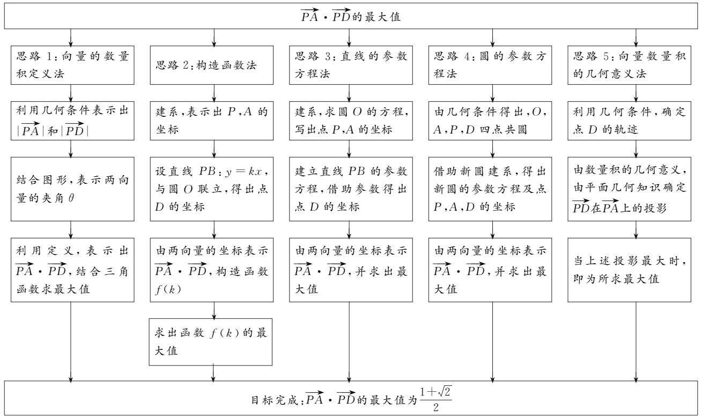
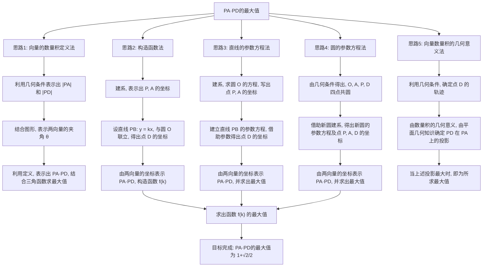
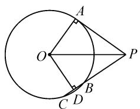
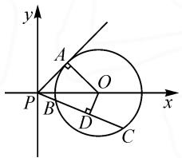
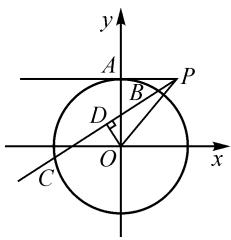
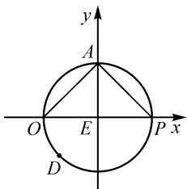
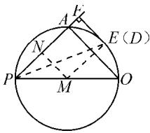
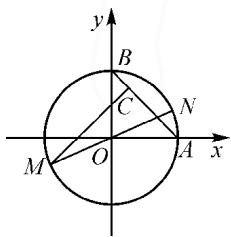
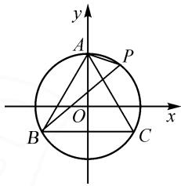

2023年讲题比赛获奖论文之十：

# 素养导向,深度探究

——2023年全国乙卷第12题的多维度思考与探究

陕西省定边县定边中学 李光博 齐静 刘小艳

向量既是代数研究对象,也是几何研究对象,是沟通代数和几何的桥梁,在高中数学中有着举足轻重的地位,是近年高考的热点.2023年高考数学全国乙卷理科第12题,以直线和圆为载体,考查向量数量积的最值问题.本文中从向量数量积的定义、坐标表示和图形的几何特征等不同方向作为思维的切入点,深度探究了该题的数学本质与多种解法.

# 1 原题呈现

(2023 全国乙卷理科第 12 题) 已知 $\odot O$ 的半径为 1, 直线 $PA$ 与 $\odot O$ 相切于点 $A$ , 直线 $PB$ 与 $\odot O$ 交于 $B, C$ 两点, $D$ 为 $BC$ 的中点. 若 $|PO| = \sqrt{2}$ , 则 $\overrightarrow{PA} \cdot \overrightarrow{PD}$ 的最大值为 ( ).

# 2 试题分析

本题以直线与圆为载体,考查向量数量积的最值问题.从数的方面考虑:一是利用数量积的定义,如思路1.二是建立坐标系,把问题转化为向量数量积的坐标运算.本题中,首先借助圆的几何性质,取特殊点P,A,找出 $\overrightarrow{PA},\overrightarrow{PD}$ 的坐标;其次根据直线与圆的关系,联立方程构造关于直线PB斜率k的函数求最值,如思路2;由平面几何相关知识再分别利用直线、圆的参数方程,写出点D的坐标,进一步转化为三角函数求最值如思路3,4.三是利用数量积的几何意义,根据图形的几何特征,寻找向量投影的最值以达到目的,如思路5.

# 3 思维导图

A. $\frac{1 + \sqrt{2}}{2}$ B. $\frac{1 + 2\sqrt{2}}{2}$ C. $1 + \sqrt{2}$ D. $2 + \sqrt{2}$

本题思维导图如图 1 所示.

flowchart

图1

# 4 试题解答

上述试题解答如下.

解法一: 如图 2, 由题意, 知 $\left|PO\right|=\sqrt{2},\left|OA\right|=1,\angle PAO=\frac{\pi}{2}$ , 所以 $\left|PA\right|=1,\angle APO=\frac{\pi}{4}$ .

text_image

A
O
P
B
C D

图2

设 $\angle OPD = \theta, \theta \in \left(-\frac{\pi}{4}, \frac{\pi}{4}\right)$ , 由 $OD \perp PD$ , 得 $|PD| = \sqrt{2} \cos \theta$ .

所以 $\overrightarrow{PA} \cdot \overrightarrow{PD} = \sqrt{2} \cos \theta \cdot \cos \left( \theta + \frac{\pi}{4} \right)$

$$
\begin{array}{l} = \frac {\sqrt {2}}{2} \left[ \cos \left(2 \theta + \frac {\pi}{4}\right) + \cos \frac {\pi}{4} \right] \\ = \frac {\sqrt {2}}{2} \cos \left(2 \theta + \frac {\pi}{4}\right) + \frac {1}{2}. \\ \end{array}
$$

当 $2\theta + \frac{\pi}{4} = 0$ ，即 $\theta = -\frac{\pi}{8}$ 时， $\overrightarrow{PA} \cdot \overrightarrow{PD}$ 取得最大值 $\frac{\sqrt{2} + 1}{2}$ .

解法二: 如图 3, 以 P 为原点建立平面直角坐标系, 则 $O(\sqrt{2}, 0)$ , 圆 O 的方程为 $(x - \sqrt{2})^{2} + y^{2} = 1$ , $A\left(\frac{\sqrt{2}}{2}, \frac{\sqrt{2}}{2}\right)$ , $P(0, 0)$ .

text_image

y
A
O
P
B
D
C
x

图 3

设直线 $PB$ 的方程为 $y = kx$ ， $-1 < k < 1.$

由 $\left\{\begin{aligned}y=kx,\\ (x-\sqrt{2})^{2}+y^{2}=1,\end{aligned}\right.$ 整理得

$$
(1 + k ^ {2}) x ^ {2} - 2 \sqrt {2} x ^ {2} + 1 = 0.
$$

设 $B(x_{1},y_{1}),C(x_{2},y_{2})$ .由韦达定理，得 $x_{1}+$ $x_{2} = \frac{2\sqrt{2}}{1 + k^{2}}$ ，故 $y_{1} + y_{2} = k(x_{1} + x_{2}) = \frac{2\sqrt{2}k}{1 + k^{2}}.$ 因此，点 $D$ 的坐标为 $\left(\frac{\sqrt{2}}{1 + k^2},\frac{\sqrt{2}k}{1 + k^2}\right).$

所以 $\overrightarrow{PA} \cdot \overrightarrow{PD} = \left( \frac{\sqrt{2}}{2}, \frac{\sqrt{2}}{2} \right) \cdot \left( \frac{\sqrt{2}}{1 + k^{2}}, \frac{\sqrt{2}k}{1 + k^{2}} \right) = \frac{1 + k}{1 + k^{2}}.$

设 $f(k) = \frac{1 + k}{1 + k^2}$ ，则 $f'(k) = \frac{-k^2 - 2k + 1}{(1 + k^2)^2}$ .

令 $f^{\prime}(k) = 0$ ，得 $k_{1} = -1 - \sqrt{2}$ （舍去）， $k_{2} = -1 + \sqrt{2}$ 当 $x\in (-1,k_2)$ 时， $f^{\prime}(k) > 0,f(k)$ 单调递增；当 $x\in (k_2,1)$ 时， $f^{\prime}(k) <   0,f(k)$ 单调递减.

所以 $f(k)_{\max} = f(k_2) = \frac{\sqrt{2}}{1 + (-1 + \sqrt{2})^2} = \frac{\sqrt{2} + 1}{2}.$

故 $\overrightarrow{PA}\cdot\overrightarrow{PD}$ 取得最大值 $\frac{\sqrt{2}+1}{2}(f(k))$ 的最大值也可以利用双勾函数、判别式法和基本不等式等方法求解).

解法三: 如图 4, 以 O 为原点, 建立平面直角坐标系, 设 $\odot O$ 的方程为 $x^{2} + y^{2} = 1$ .

取 $P(1,1)$ ，直线 PA 与 $\odot O$ 相切于点 A，则 $A(0,1)$ ，直线 PB 与 $\odot O$ 相交于 B，C 两点.

设直线 $PB$ 的参数方程为 $\left\{ \begin{array}{l}x = 1 + t\cos \alpha ,\\ y = 1 + t\sin \alpha \end{array} \right.$ （ $t$ 为参数），其中$\alpha$ 为直线 PB 的倾斜角 $\left(0<\alpha<\frac{\pi}{2}\right)$ .

text_image

y
A
P
B
D
O
x
C

图 4

设点 B, C 对应的参数为 $t_{1}, t_{2}$ ，则 BC 的中点 D 对应的参数为 $\frac{t_{1} + t_{2}}{2}$ ，将直线 PB 的参数方程代入 $\odot O$ 的方程，得 $t^{2} + 2(\sin \alpha + \cos \alpha)t + 1 = 0$ ，则 $t_{1} + t_{2} = -2(\sin \alpha + \cos \alpha)$ ，即 $\frac{t_{1} + t_{2}}{2} = -(\sin \alpha + \cos \alpha)$ 。所以 $D(1 - \cos \alpha (\sin \alpha + \cos \alpha), 1 - \sin \alpha (\sin \alpha + \cos \alpha))$ 。所以 $\overrightarrow{PA}=(-1,0)$ ,

$$
\overrightarrow {P D} = (- \cos \alpha (\sin \alpha + \cos \alpha), - \sin \alpha (\sin \alpha + \cos \alpha)),
$$

$$
\overrightarrow {P A} \cdot \overrightarrow {P D} = \cos \alpha \cdot (\sin \alpha + \cos \alpha) = \frac {1}{2} \cdot \sin 2 \alpha +
$$

$$
\frac {1}{2} \cos 2 \alpha + \frac {1}{2} = \frac {\sqrt {2}}{2} \sin \left(2 \alpha + \frac {\pi}{4}\right) + \frac {1}{2}.
$$

由 $0 < \alpha < \frac{\pi}{2}$ , 得 $\frac{\pi}{4} < 2\alpha + \frac{\pi}{4} < \frac{5\pi}{4}$ .

当 $2\alpha + \frac{\pi}{4} = \frac{\pi}{2}$ , 即 $\alpha = \frac{\pi}{8}$ 时, $\overrightarrow{PA} \cdot \overrightarrow{PD}$ 的最大值为 $\frac{\sqrt{2} + 1}{2}$ .

解法四:由题意知,O,A,P,D四点共圆,且该圆直径为OP,故取OP的中点为E,以E为原点,建立平面直角坐标系,如图5.由 $|OP|=\sqrt{2}$ ,可知 $\odot E$ 的半径 $|EP|=\frac{\sqrt{2}}{2}$ , $P\left(\frac{\sqrt{2}}{2},0\right)$ ,

$A\left(0, \frac{\sqrt{2}}{2}\right)$ . 设 $D\left(\frac{\sqrt{2}}{2} \cos \alpha, \frac{\sqrt{2}}{2} \sin \alpha\right)$ $\left(\alpha \text{为参数}, \alpha \in \left(\frac{\pi}{2}, \frac{3\pi}{2}\right)\right)$ .

text_image

y
A
O E P x
D

图5

所以 $\overrightarrow{PA} = \left(-\frac{\sqrt{2}}{2},\frac{\sqrt{2}}{2}\right),$

$$
\overrightarrow {P D} = \left(\frac {\sqrt {2}}{2} \cos \alpha - \frac {\sqrt {2}}{2}, \frac {\sqrt {2}}{2} \sin \alpha\right).
$$

因此 $\overrightarrow{PA} \cdot \overrightarrow{PD} = -\frac{1}{2} \cdot \cos \alpha + \frac{1}{2} \cdot \sin \alpha + \frac{1}{2} = \frac{\sqrt{2}}{2} \sin \left( \alpha - \frac{\pi}{4} \right) + \frac{1}{2}$ .

当 $\sin\left(\alpha-\frac{\pi}{4}\right)=-1$ 即 $\alpha=\frac{3\pi}{4}$ 时， $\overrightarrow{PA}\cdot\overrightarrow{PD}$ 取得最大值 $\frac{\sqrt{2}+1}{2}$ .

解法五:由题意知,O,A,P,D四点共圆,点D在以OP为直径的圆M的右半圆周上运动.

要使 $\overrightarrow{PA}\cdot\overrightarrow{PD}$ 取得最大值,只需 $\overrightarrow{PD}$ 在 $\overrightarrow{PA}$ 上的投影最大.

如图 6 所示, 当点 D 在点 E 处时, $EF \perp PA$ , 垂足为 F, 且 EF 与圆 M 相切于点 E. 此时, $\overrightarrow{PD}$ 在 $\overrightarrow{PA}$ 上的投影最大, 即 $|PF|$ 为所求投影的最大值.

text_image

A
F
E (D)
N
P
M
O

图6

过点 M 作 $MN \perp PA$ 于点

N, 连接 ME. 在等腰直角三角形 PMN 中, $PM = \frac{\sqrt{2}}{2}$ ,
则 $PN = MN = \frac{1}{2}$ .

又 $ME = NF = \frac{\sqrt{2}}{2}$ ，所以 $PF = PN + NF = \frac{\sqrt{2} + 1}{2}$

故 $\overrightarrow{PA}\cdot\overrightarrow{PD}$ 的最大值为 $\frac{\sqrt{2}+1}{2}$ .

# 5 链接练习

(1)(2022·湖北模拟)已知 A, B 是单位圆上的两点, O 为圆心, 且 $\angle AOB = 90^{\circ}$ , MN 是圆 O 的一条直径, 点 C 在圆内, 且满足 $\overrightarrow{OC} = \lambda \overrightarrow{OA} + (1 - \lambda) \overrightarrow{OB} (\lambda \in \mathbb{R})$ , 则 $\overrightarrow{CM} \cdot \overrightarrow{CN}$ 的最小值为().

A. $-\frac{1}{2}$

B. $-\frac{1}{4}$

C. $-\frac{3}{4}$

D.-1

解法一: 建立如图 7 所示的平面的平面直角坐标系.

由 $\overrightarrow{OC} = \lambda \overrightarrow{OA} + (1 - \lambda)\overrightarrow{OB}$ ( $\lambda \in \mathbf{R}$ ), 得 $A, B, C$ 三点共线.

设 $C(a,1-a)(0<a<1)$ , $M(\cos\theta,\sin\theta),N(-\cos\theta,\sin\theta).$

所以 $\overrightarrow{CM} \cdot \overrightarrow{CN} = (\cos \theta - a,$

text_image

y
B
C
N
M
O
A x

图7

$$
\begin{array}{l} \sin \theta + a - 1) \cdot (- \cos \theta - a, - \sin \theta + a - 1) = \\ - \cos^ {2} \theta + a ^ {2} + (a - 1) ^ {2} - \sin^ {2} \theta = 2 a ^ {2} - 2 a. \end{array}
$$

当 $a = \frac{1}{2}$ 时， $\overrightarrow{CM} \cdot \overrightarrow{CN}$ 取得最小值为 $-\frac{1}{2}$ .

解法二: 由 $\overrightarrow{OC} = \lambda \overrightarrow{OA} + (1 - \lambda) \overrightarrow{OB} (\lambda \in \mathbb{R})$ ，得 A, B, C 三点共线.

因为点 C 在圆内, 则点 C 在线段 AB 上, O 为线段 MN 的中点, 所以

$$
\begin{array}{l} \overrightarrow {C M} \cdot \overrightarrow {C N} = \frac {(\overrightarrow {C M} + \overrightarrow {C N}) ^ {2} - (\overrightarrow {C M} - \overrightarrow {C N}) ^ {2}}{4} \\ = \overrightarrow {O C} ^ {2} - \frac {1}{4} \overrightarrow {N M} ^ {2} \\ = \overrightarrow {O C} ^ {2} - 1 \\ \geqslant \left(\frac {\sqrt {2}}{2}\right) ^ {2} - 1 \\ = - \frac {1}{2}. \\ \end{array}
$$

(2)(2022·重庆模拟)正三角形 ABC 边长等于 $\sqrt{3}$ ，点 P 在其外接圆上运动，则 $\overrightarrow{AP} \cdot \overrightarrow{PB}$ 的取值范围是().

A. $\left[-\frac{3}{2},\frac{3}{2}\right]$

B. $\left[-\frac{3}{2},\frac{1}{2}\right]$

C. $\left[-\frac{1}{2},\frac{3}{2}\right]$

D. $\left[-\frac{1}{2},\frac{1}{2}\right]$

解法一: 边长为 $\sqrt{3}$ 的正三角形的外接圆半径为 1. 建立如图 8 所示的平面直角坐标系, 则 A(0,1),

$$
B \left(- \frac {\sqrt {3}}{2}, - \frac {1}{2}\right).
$$

设 $P(\cos \theta, \sin \theta), \theta \in [0, 2\pi)$ , 则

text_image

y
A
P
O
B
C
x

图8

$$
\overrightarrow {A P} \cdot \overrightarrow {P B} = (\cos \theta , \sin \theta - 1) \cdot
$$

$$
\left(- \frac {\sqrt {3}}{2} - \cos \theta , - \frac {1}{2} - \sin \theta\right) = - \frac {\sqrt {3}}{2} \cos \theta - \cos^ {2} \theta -
$$

$$
\left(\sin^ {2} \theta - \frac {1}{2} \sin \theta - \frac {1}{2}\right) = \sin \left(\theta - \frac {\pi}{3}\right) - \frac {1}{2}.
$$

因为 $\theta \in [0,2\pi)$ ，所以 $\theta - \frac{\pi}{3} \in \left[-\frac{\pi}{3}, \frac{5\pi}{3}\right)$ .

所以 $\overrightarrow{AP} \cdot \overrightarrow{PB} \in \left[-\frac{3}{2}, -\frac{1}{2}\right]$ .

解法二: 取 D 为线段 AB 的中点, 则

$$
\overrightarrow {A P} \cdot \overrightarrow {P B} = - \left(\overrightarrow {P D ^ {2}} - \frac {1}{4} \overrightarrow {A B ^ {2}}\right) = - \overrightarrow {P D ^ {2}} + \frac {3}{4}.
$$

由 $|\overrightarrow{PD}| \in \left[\frac{1}{2}, \frac{3}{2}\right]$ , 得 $|\overrightarrow{PD}|^2 \in \left[\frac{1}{4}, \frac{9}{4}\right]$ .

所以 $\overrightarrow{AP} \cdot \overrightarrow{PB} \in \left[-\frac{3}{2}, \frac{1}{2}\right]$ . Z