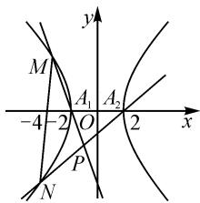

# 结合圆锥曲线高考题谈突破运算障碍的整体意识\*

# 北京市通州区潞河中学 白志峰 祁京生 白杰

摘要: 培养新疆内高班学生在整体视角下从数、形、思维等角度入手, 调整运算程序、优化运算方法、突破运算障碍的意识和能力, 是提升数学运算素养的有效手段.

关键词: 整体视角; 突破障碍; 运算素养; 教学感悟

在解答圆锥曲线问题时,新疆内高班学生普遍存在“想不到、消不去、算不对”的困惑,常有“会而不对、对而不全、全而不优”的现象,有的学生甚至不得已中断解题.其原因是多方面的,但缺乏在整体视角下调整运算程序、优化运算方法、突破运算障碍的意识和能力,是没有顺利、准确求得运算结果的重要的因素.本文中以2023年全国高考新课标Ⅱ卷中的圆锥曲线题为例,谈谈从整体视角突破运算障碍的体会,供参考.

# 1 例题及分析

例 已知双曲线 C 的中心为坐标原点, 左焦点为 $(-2\sqrt{5}, 0)$ , 离心率为 $\sqrt{5}$ .

(1) 求 C 的方程；

(2) 记 C 的左、右顶点分别为 $A_{1}, A_{2}$ ，过点 $(-4,0)$ 的直线与 C 的左支交于 M, N 两点，点 M 在第二象限，直线 $MA_{1}$ 与 $NA_{2}$ 交于点 P。证明：点 P 在定直线上。

第(1)问比较简单,求得 C 的方程为 $\frac{x^{2}}{4}-\frac{y^{2}}{16}=1$ .

第(2)问不难得到有效的解题思路: 探求点 P 坐标的特征, 而点 P 是两直线的交点, 所以首先写出直线 $MA_{1}$ 和 $NA_{2}$ 的方程.

当直线 MN 的斜率存在时, 设 $MN: y = k(x + 4)$ , $M(x_{1}, y_{1}), N(x_{2}, y_{2})$ .

由 $\left\{\begin{aligned}\frac{x^{2}}{4}-\frac{y^{2}}{16}=1,\\ y=k(x+4),\end{aligned}\right.$ 得

$$
(4 - k ^ {2}) x ^ {2} - 8 k ^ {2} x - 1 6 k ^ {2} - 1 6 = 0. \tag {①}
$$

由题意, $\Delta>0$ ,且 $k^{2}\neq4$ .

由韦达定理,得

$$
x _ {1} + x _ {2} = \frac {8 k ^ {2}}{4 - k ^ {2}}, x _ {1} x _ {2} = \frac {- 1 6 k ^ {2} - 1 6}{4 - k ^ {2}}.
$$

由题意可得, 直线 $MA_{1}$ 的方程为 $y=\frac{y_{1}}{x_{1}+2}(x+2)$ ,
直线 $NA_{2}$ 的方程为 $y=\frac{y_{2}}{x_{2}-2}(x-2)$ .

联立直线 $MA_{1}$ 与 $NA_{2}$ 的方程, 可以解出点 P 的坐标, 但运算复杂; 也可以先解出含 x 的式子 $\frac{x+2}{x-2}$ . 这里取后者:

$$
\frac {x + 2}{x - 2} = \frac {k (x _ {2} + 4) (x _ {1} + 2)}{k (x _ {1} + 4) (x _ {2} - 2)} = \frac {x _ {1} x _ {2} + 4 x _ {1} + 2 x _ {2} + 8}{x _ {1} x _ {2} + 4 x _ {2} - 2 x _ {1} - 8}. \tag {②}
$$

如何继续运算呢?

# 2 整体意识

# 2.1 以代数式结构的整体特征为突破口

证法 1:②式虽然没有完整的标准化的对称结构,但我们依然可以顺应已有的思维,试图直接用韦达定理.观察代数式结构的整体特征,配凑出部分对称结构:

$$
\frac {x + 2}{x - 2} = \frac {x _ {1} x _ {2} + 4 (x _ {1} + x _ {2}) - 2 x _ {2} + 8}{x _ {1} x _ {2} - 2 (x _ {1} + x _ {2}) + 6 x _ {2} - 8}.
$$

代入韦达定理,整体约分,得 $\frac{x+2}{x-2}=-\frac{1}{3}$ ,进而解得x=-1.

当直线 MN 的斜率不存在时,验证成立.

所以点 P 在定直线 x = -1 上.

# 2.2 以几何图形的整体特征为突破口

解析几何的基本思想是用代数的方法研究几何问题.其运算必然需要关注几何图形的特征.当直线 MN 的斜率不存在时,可求得点 P 的横坐标为 -1.从不同角度重复画图,如图 1,可以合理猜测点 P 在直线 x = -1 上, 于是转而证明 $x_{P} + 1 = 0$ .

text_image

y
M
A₁ A₂
-4 -2 O 2 x
P
N

图1

证法2：由 $\frac{x + 2}{x - 2} = \frac{x_1x_2 + 4x_1 + 2x_2 + 8}{x_1x_2 + 4x_2 - 2x_1 - 8}$ ，直接解出 $x$ ，或者利用比例性质整体运算求解 $x.$ 这里采取后者.

由比例性质, 得 $\frac{x+2}{2x}=\frac{x_{1}x_{2}+4x_{1}+2x_{2}+8}{2x_{1}x_{2}+6x_{2}+2x_{1}}$ ,

$$
\frac {x + 2}{4} = \frac {x _ {1} x _ {2} + 4 x _ {1} + 2 x _ {2} + 8}{- 2 x _ {2} + 6 x _ {1} + 1 6}.
$$

两式作商，得 $x=\frac{2x_{1}x_{2}+2x_{1}+6x_{2}}{-x_{2}+3x_{1}+8}$ .

所以，可得 $x + 1 = \frac{2x_{1}x_{2} + 2x_{1} + 6x_{2}}{-x_{2} + 3x_{1} + 8} + 1 = \frac{2x_{1}x_{2} + 5(x_{1} + x_{2}) + 8}{-x_{2} + 3x_{1} + 8}.$

分子“ $2x_{1}x_{2}+5(x_{1}+x_{2})+8$ ”，结构对称，代入韦达定理得 $x+1=0$ ，所以x=-1。

下略.

# 2.3 以思维结构的整体特征为突破口

代数运算的思维特征是化简,化简之道在于减元降次,②式的难点在于变量多且次数不一.

证法 3: 减元视角 1——分别将表示 $x_{1}$ 与 $x_{2}$ 用第三个变量 k 表达出来.

由方程①求出两根,不妨取

$$
x _ {1} = \frac {4 k ^ {2} - 4 \sqrt {4 + 3 k ^ {2}}}{4 - k ^ {2}}, x _ {2} = \frac {4 k ^ {2} + 4 \sqrt {4 + 3 k ^ {2}}}{4 - k ^ {2}}.
$$

然后代入②式, 得 $\frac{x+2}{x-2}=-\frac{1}{3}$ .

下略.

此方法容易想到,但运算量较大,可能浅尝辄止,仍然不太理想.继续调整运算思路,优化运算程序,从更高的维度加以思考.

证法 4: 减元视角 2——分别将表示 $x_{1}$ 与 $x_{2}$ 用第三个变量 $\lambda$ 表达出来.

设 $B(-4,0)$ ，由 B, M, N 三点共线，可设 $\overrightarrow{NB} = \lambda \overrightarrow{BM}$ .

又 $\overrightarrow{NB} = (-4 - x_2, -y_2),\overrightarrow{BM} = (x_1 + 4,y_1)$ ，所以 $-4 - x_{2} = \lambda (x_{1} + 4), - y_{2} = \lambda y_{1}$

因为点 $(x_{2},y_{2})$ 满足双曲线方程,所以

$$
\frac {\left[ - 4 - \lambda \left(x _ {1} + 4\right) \right] ^ {2}}{4} - \frac {\left(- \lambda y _ {1}\right) ^ {2}}{1 6} = 1,
$$

$$
\frac {x _ {1} ^ {2}}{4} - \frac {y _ {1} ^ {2}}{1 6} = 1.
$$

整理可得

$$
\lambda^ {2} \left(\frac {x _ {1} ^ {2}}{4} - \frac {y _ {1} ^ {2}}{1 6}\right) + \frac {2 \lambda x _ {1} (4 + 4 \lambda) + 1 6 + 3 2 \lambda + 1 6 \lambda^ {2}}{4} = 1.
$$

结合 $\frac{x_1^2}{4} -\frac{y_1^2}{16} = 1$ ，解得

$$
x _ {1} = - \frac {5 \lambda + 3}{2 \lambda}, x _ {2} = - \frac {3 \lambda + 5}{2}.
$$

代入②式,得

$$
\frac {x + 2}{x - 2} = \frac {x _ {1} x _ {2} + 4 x _ {1} + 2 x _ {2} + 8}{x _ {1} x _ {2} + 4 x _ {2} - 2 x _ {1} - 8} = - \frac {1}{3}.
$$

下略.

证法 5: 降次视角——将 $x_{1}x_{2}$ 用 $x_{1}+x_{2}$ 线性表达出来.

不妨设 $x_{1}x_{2}=A(x_{1}+x_{2})+B$ ，即

$$
\frac {- 1 6 k ^ {2} - 1 6}{4 - k ^ {2}} = \frac {8 k ^ {2} A}{4 - k ^ {2}} + B,
$$

解得 A = -2.5, B = -4.

所以 $x_{1}x_{2}=-2.5(x_{1}+x_{2})-4$ ，代入②式，得

$$
\begin{array}{l} \frac {x + 2}{x - 2} = \frac {- 2 . 5 (x _ {1} + x _ {2}) - 4 + 4 x _ {1} + 2 x _ {2} + 8}{- 2 . 5 (x _ {1} + x _ {2}) - 4 + 4 x _ {2} - 2 x _ {1} - 8} \\ = - \frac {1}{3}. \\ \end{array}
$$

下略.

# 3 教学感悟

整体意识在代数运算中可以起到宏观的指导与把控作用.以整体意识反观韦达定理,其本质是将 $x_{1}+x_{2}$ 与 $x_{1}x_{2}$ 整体用第三个变量表示,所以韦达定理不外乎是一种整体的减元手段而已.当坐标不对称时,我们要把握好代数运算“减元降次”的本质要求,立足整体视角,突破思维定势,优化运算方法,实现问题的解决.

新课标要求“通过运算促进数学思维发展,形成规范化思考问题的品质,养成一丝不苟、严谨求实的科学精神”[1].所以解题教学中面对学生的困惑或障碍,教师引导学生沉着应对,突破障碍,优化解法,获得成功之喜悦,进而悦纳、乐学,无疑具有良好的育人价值.

新高考数学试题对学生关键能力的考查呈现综合性的特征 $^{[2]}$ . 解析几何的综合性决定了它在高考试题中肩负着考查关键能力的功能. 教学实践中, 教师从代数、几何等不同角度引导学生, 以整体的视角看待数学问题, 所体现的是学科的整体观、思维的整体观. 这样有助于新疆内高班学生将所学知识从整体高度融会贯通, 开阔视野, 提高思维品质.

# 参考文献：

[1]中华人民共和国教育部.普通高中数学课程标准(2017年版)[S].北京:人民教育出版社,2018.  
[2]刘再平,刘祖希.新高考背景下高考数学研究述评与展望[J].数学通报,2023,62(4):1-9,62.Z