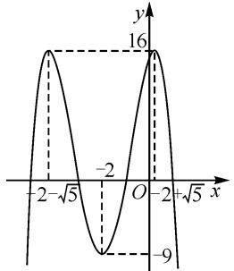
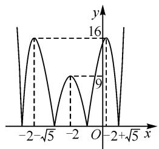
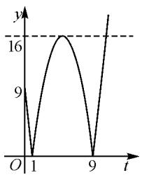
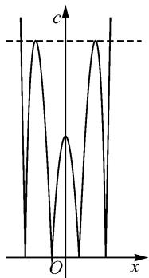

# 追根溯源,发散思维,深入拓展

# 江西省彭泽县第一中学 艾文宇

含参函数的综合问题,是高考数学试卷中最为基础,且综合性强、难度高的一类基本常见题型,备受命题者青睐.此类综合问题,场景创新新颖,设问方式多变,可以很好地融合函数中众多的基本概念以及其他模块的基本数学知识,同时又合理交汇一些相关的数学思想方法与基本技能等,是全面考查考生数学能力的重要载体,具有较高的选拔性与区分度,颇受各方关注.下面以“一道零点题的探秘”为例,追根溯源,发散思维,深入拓展.

# 1 问题呈现

问题（2024届济南市高三上学期开学摸底考试·16)若函数 $f(x) = |(1 - x^2)(x^2 + ax + b)| - c (c \neq 0)$ 的图象关于直线 $x = -2$ 对称，且 $f(x)$ 有且仅有4个零点，则 $a + b + c$ 的值为 \_\_\_\_.

此题将函数的图象与函数的零点相结合,问题表面形式上让人觉得复杂多变,无法下笔切入.充分分析题设条件,挖掘条件内涵,剖析函数的信息特征,就可以很好揭示问题的本质,得以很好分析与解决.

细细品味并剖析该问题, 可知该题以函数的解析式为问题切入点, 巧妙融入绝对值及其应用、函数的图象与性质(对称性)、函数的零点等众多函数基本知识点, 构勤一幅完美的“画卷”.

# 2 追根溯源

其实,以上问题改编于 2013 年高考数学全国新课标 I 卷中的试题,在高考真题的基础上进一步构造绝对值的问题场景,同时引入第三个参数变量,并巧妙融入函数的零点,进而借助三个参数变量的和式的值来创设与应用.

链接高考（2013年高考数学全国新课标Ⅰ卷理科·16)若函数 $f(x)=(1-x^{2})(x^{2}+ax+b)$ 的图象关于直线 x=-2 对称，则 $f(x)$ 的最大值为 \_\_\_\_.

解析:依题知,函数 $f(x)=(1-x^{2})(x^{2}+ax+b)$ 的图象关于直线 x=-2 对称,而 $f(-1)=f(1)=0$ ,由对称性可知, $f(-5)=f(1)>0,f(-3)=f(-1)=0$ ,即-5,-3 是方程 $x^{2}+ax+b=0$ 的两个实根,由韦达定理,可得 $\left\{\begin{aligned}-5-3&=-a,\\ -5\times(-3)&=b.\end{aligned}\right.$ 解得 $\left\{\begin{aligned}a&=8,\\ b&=15.\end{aligned}\right.$

故 $f(x) = (1 - x^2)(x^2 + 8x + 15) = -(x + 1)\cdot (x - 1)(x + 3)(x + 5) = -(x^2 + 4x + 3)(x^2 + 4x - 5).$

令 $t=x^{2}+4x-5=(x+2)^{2}-9\geqslant-9$ ，则函数 $f(x)$ 可等价转化为 $y=-t(t+8)=-(t+4)^{2}+16(t\geqslant-9)$ ，则当 t=-4 时，y 取得最大值 16，即函数 $f(x)$ 的最大值为 16。故填：16。

以一道高考真题的熟悉场景,巧妙融入其他相关的函数知识加以交汇整合,从“双变量”的函数应用问题改编成以上“三变量”的函数综合问题,很好实现对数学“四基”的把握情况与数学能力的全面考查,是一道非常不错的改编题,值得很好深入研究、细细品鉴.

# 3 问题破解

方法 1: 导数法.

解析: 令 $f(x)=|(1-x^{2})(x^{2}+ax+b)|-c=0$ ,
可得 $|(1-x^{2})(x^{2}+ax+b)|=c.$

构建函数 $g(x)=\left|(1-x^{2})(x^{2}+ax+b)\right|$ .

由于函数 $f(x) = |(1 - x^2)(x^2 + ax + b)| - c$ ( $c \neq 0$ ) 的图象关于直线 $x = -2$ 对称，因此 $g(x) = |(1 - x^2)(x^2 + ax + b)|$ 的图象也关于直线 $x = -2$ 对称.

显然-1,1为函数 $g(x)$ 的两个零点，故由对称性可知，函数 $g(x)$ 的另外两个零点分别为-5,-3，即-5,-3是方程 $x^{2}+ax+b=0$ 的两个实根.

由韦达定理，可得 $\left\{\begin{aligned}-5-3&=-a,\\ -5\times(-3)&=b,\end{aligned}\right.$ 解得 $\left\{\begin{aligned}a&=8,\\ b&=15.\end{aligned}\right.$

故函数 $g(x)=|(1-x^{2})(x^{2}+8x+15)|$ .

构建 $h(x)=(1-x^{2})(x^{2}+8x+15)$ ，则 $h'(x)=(-2x)(x^{2}+8x+15)+(1-x^{2})(2x+8)=-4x^{3}-24x^{2}-28x+8=-4(x^{3}+6x^{2}+7x-2)=-4(x+2)\cdot(x^{2}+4x-1)$ .

令 $h'(x)=0$ ，解得 x=-2, $x=-2+\sqrt{5}$ 或 $x=-2-\sqrt{5}$ ，则当 $x<-2-\sqrt{5}$ 或 $-2<x<-2+\sqrt{5}$ 时， $h'(x)>0$ ，函数 $h(x)$ 单调递增；当 $-2-\sqrt{5}<x<-2$ 或 $x>-2+\sqrt{5}$ 时， $h'(x)<0$ ，函数 $h(x)$ 单调递减。

故 $h(-2-\sqrt{5})=h(-2+\sqrt{5})=16$ ，此为极大值； $h(-2)=-9$ ，此为极小值。作出函数 $h(x)=(1-x^{2})\cdot(x^{2}+8x+15)$ 的大致图象如图 1。

line

| x | y |
|---|---|
| -2√5 | 16 |
| -2 | -9 |
| 0 | 16 |
| +√5 | 16 |

图 1

line

| x | y |
|---|---|
| -2 | 16 |
| -√5 | 9 |
| -2 | 7 |
| 0 | 16 |
| -2+√5 | 9 |

图 2

故函数 $g(x) = |(1 - x^2)(x^2 + 8x + 15)|$ 的图象是将函数 $h(x) = (1 - x^2)(x^2 + 8x + 15)$ 的图象位于 $x$ 轴下方部分沿着 $x$ 轴翻折到 $x$ 轴上方， $x$ 轴上方保持不变，如图2所示.

要使得函数 $f(x)$ 有且仅有4个零点，且 $c \neq 0$ ，则 $c = 16$ ，所以 $a + b + c = 8 + 15 + 16 = 39.$ 故填：39.

解后反思: 导数法解决含参函数的图象与基本性质问题, 是解决此类函数综合问题中最为常用的一种基本方法. 导数法可以比较精确地确定相应函数的图象变化趋势(单调性)、最值(极值性)以及其他相关的基本性质等, 对于深入研究与细致分析有很大的帮助. 只是导数法解决问题时, 有时数学运算量较大, 解题过程比较烦琐, 用于解决小题(选择题或填空题)时, 有时浪费较多宝贵时间.

方法 2: 函数图象特征法.

解析: 以上部分同方法 1, 可得函数 $g(x)=|(1-x^{2})(x^{2}+8x+15)|$ .

所以， $f(x)=|(x-1)(x+1)(x+3)(x+5)|-c=|(x^{2}+4x+3)(x^{2}+4x-5)|-c.$

令 $t = (x + 2)^2 \geqslant 0$ ，则 $y = |(t - 1)(t - 9)| - c = |(t - 5)^2 - 16| - c, c \neq 0$ .

设函数 $y=|(t-5)^{2}-16|>0$ , $t \geqslant 0$ ，对应的图象如图3所示.

数形结合可知，当 $y = 16$ 时，此时直线 $y = 16$ 与函数 $y = |(t - 5)^2 - 16| > 0, t \geqslant 0$ 的图象只有2个交点，即满足方程 $|(t - 5)^2 - 16| = 0$ 有2个实根，对应方程

line

| t | y |
|---|---|
| 1 | 9 |
| 1 | 0 |
| 9 | 0 |
| 9 | 16 |

图3

$$
\left| \left(1 - x ^ {2}\right) \cdot \left(x ^ {2} + 8 x + 1 5\right) \right| = c, c \neq 0
$$

有 4 个实根, 亦即此时才能满足函数 $f(x)$ 有且仅有 4 个零点, 则 c=16. 所以 $a+b+c=8+15+16=39$ . 故填: 39.

解后反思:本方法的关键在于将复杂的函数转化为比较熟悉的基本初等函数,进而利用基本初等函数的图象与性质来直观分析与应用.往往在解题过程中会借助配方法、换元法、整体法、变换法等基本数学技巧方法,同时注意在化归与转化过程中,保证等价性.

方法 3: 函数图象平移法.

解析: 以上部分同方法 1, 可得函数 $g(x)=|(1-x^{2})(x^{2}+8x+15)|$ .

所以 $f(x) = |(x - 1)(x + 1)(x + 3)(x + 5)| - c$ 的图象关于直线 $x = -2$ 对称，则知函数 $f(x - 2) = |(x - 3)(x - 1)(x + 1)(x + 3)| - c$ 的图象关于直线 $x = 0(y$ 轴)对称，而函数 $f(x)$ 有且仅有4个零点，即 $c = |(x - 3)(x - 1)(x + 1)(x + 3)| = |(x^2 -9)(x^2 -1)| = |(x^2 -5)^2 -16|$ 有4个不同的零点.

作出函数 $c = \left| (x^{2} - 5)^{2} - 16 \right|$ 的图象, 如图 4 所示.

由图可知，当 c=16 时，直线 c=16 与函数 $c=(x^{2}-5)^{2}-16|$ 的图象只有 4 个交点，满足题设条件，则 c=16。所以 $a+b+c=8+15+16=39$ 。故填：39。

解后反思:该法与方法2的解题思路基本相当,只是切入视角不同,借助合理配方,通过函数图象的合理平移变换解决问题.合理借助函数图象的对称性,加以巧妙的函数图象平移变换,可以更加快捷地得到函数的图象.

text_image

c
O
x

图4

# 4 变式拓展

(1) 若函数 $f(x)=|(1-x^{2})(x^{2}+ax+b)|-c$ 的图象关于直线 x=-2 对称，且 $f(x)$ 有且仅有 4 个零点，则 $a+b+c$ 的值为 \_\_\_\_.

(2) 若函数 $f(x)=|(1-x^{2})(x^{2}+ax+b)|-c$ 的图象关于直线 x=-2 对称，且 $f(x)$ 有且仅有 7 个零点，则 $a+b+c$ 的值为 \_\_\_\_.

参考答案:(1)23 或 39;(2)32.

# 5 教学启示

涉及含参函数的零点综合问题,可以很好地融合基本初等函数(指数函数、对数函数、幂函数、三角函数等)、函数的图象与性质、分段函数与绝对值函数、函数的零点等知识,实现众多概念与基础知识的交汇与融合,很好考查考生的综合数学能力等.