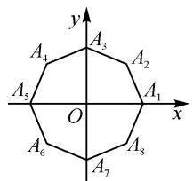
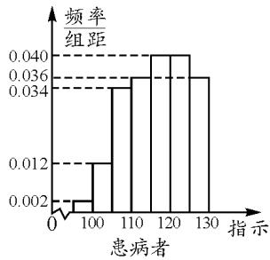
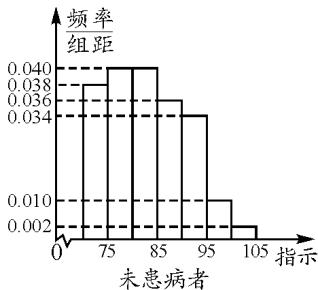
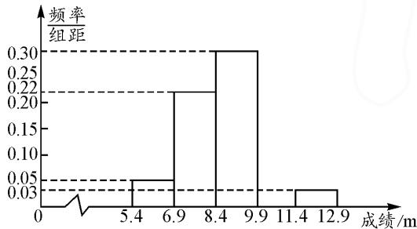

# 高考概率题型答题思路与方法初探

# 浙江省杭州市萧山区第五高级中学 王燕燕

摘要：“概率与统计”是高中数学学习的重要内容，也是近年来数学高考的常考知识点，分值在5～12分之间，其中综合类解答题大多包含有2～3道小题，涉及到的知识点多，属于难度较大的题型。因此，熟悉与概率相关的常见题型，掌握其常用的解题思路与方法，既有助于考生在考场上顺利答题，又能让学生领会概率问题中“动”与“静”的辩证统一关系，拓宽解题思路，提高解题效率。

关键词: 古典概型; 随机事件的概率; 分布列与期望; 频率分布直方图

概率是高中数学(人教 A 版必修 3)中重要的学习内容,也是高考的一个重要考点,近年的全国甲卷、乙卷,新高考Ⅰ卷、Ⅱ卷均对概率问题进行了考查.本文中以近两年的高考真题或模拟题为例,就概率问题的常考题型作初步探讨,供参考.

# 1 古典概型的概率

首先要判断是否为古典概型,然后算出基本事件的总个数 n 和事件 A 包含的基本事件的个数 m,最后运用公式 $P(A)=\frac{m}{n}$ 即可求出事件 A 的概率.在高考中,求古典概型的概率问题常以选择题或填空题的形式出现,分值在 5 分左右.

例 1 （2023 年浙江省杭州市育才中学高考模拟试题）如图 1，在平面直角坐标系 xOy 中，O 是正八边形 $A_{1}A_{2}A_{3}\cdots\cdots A_{8}$ 的中心， $A_{1}(1,0)$ . 任意取不同的两点 $A_{i}, A_{j}$ ，点 P 满足 $\overrightarrow{OP} + \overrightarrow{OA_{i}} + \overrightarrow{OA_{j}} = 0$ ，求点 P 落在第一象限的概率.

text_image

y
A₄ A₃ A₂
A₅ O A₁
x
A₆ A₇ A₈

图1

解析:根据题意,如果点 P 在第一象限,那么向量 $\overrightarrow{OA_{i}} + \overrightarrow{OA_{j}}$ 就落在第三象限.易知基本事件的总个数为 $C_{8}^{2} = 28$ .由 $\overrightarrow{OA_{i}} + \overrightarrow{OA_{j}} = -\overrightarrow{OP}$ ,设 $\overrightarrow{OQ} = -\overrightarrow{OP}$ ,它应该在第三象限.接下来先看 $A_{3}$ ,发现 $\overrightarrow{OA_{3}}$ 无论加上什么向量都不可能在第三象限;对于 $A_{4}$ ,首先 $\overrightarrow{OA_{5}}$ 不成立,又有 $(A_{4}, A_{6})$ 不成立,且 $(A_{4}, A_{8})$ 也不成立,但发现 $(A_{4}, A_{7})$ ,是成立的;对于 $A_{5}$ ,我们发现 $(A_{5}, A_{6})$ , $(A_{5}, A_{7})$ , $(A_{5}, A_{8})$ 均成立;对于 $A_{6}$ ,会发现 $(A_{7}, A_{6})$ 成立;对于 $A_{7}$ , $\overrightarrow{OA_{7}}$ 无论和谁相加都不成立.所以点 P 落在第一象限的有 $(A_{4}, A_{7})$ , $(A_{5}, A_{6})$ , $(A_{5}, A_{7})$ , $(A_{5}, A_{8})$ , $(A_{6}, A_{7})$ ,故可求得点 P 落在第一象限的概率为 $\frac{5}{28}$ .

思路与方法:本题侧重考查学生对古典概型的理解与掌握情况,要能够根据题意准确判断出每种情况下的各种可能性,经过比较才能得出结果.特别是要掌握建立平面直角坐标系、灵活运用向量、概率公式以及求解的方法与步骤等技巧.

例 2 （2023 浙江省台州市第 3 次高考模拟题）张三、李四两个学生玩某种游戏，规则是由张三、李四各伸出 1 到 5 根手指头，如果和为偶数就算张三赢，反之算李四赢.

(1)用 A 表示和为 6 的事件,求事件 A 的样本点;

(2)假设两人玩了三次,张三至少赢一次的事件用 B 表示,李四至少赢两次的事件用 C 表示,B 与 C 是否为互斥事件? 理由是什么?

(3)这种游戏规则公平吗？为什么？

解析:(1)用 x,y 分别表示张三、李四各伸出的手指头数,那么 $(x,y)$ 就表示这个试验的一个样本点,所以该实验的样本空间为

$S=\{(x,y)\mid x\in\mathbf{N}^{*},y\in\mathbf{N}^{*},1\leqslant x\leqslant5,1\leqslant y\leqslant5\}$ ，共有25个样本点，其中事件A包含的样本点共5个，即 $(1,5),(2,4),(3,3),(4,2),(5,1)$ .

(2)根据题意可知,事件 B 与 C 可以同时发生,例如张三赢一次或李四赢两次,所以事件 B 与 C 不是互斥事件.

(3)由题意可知，“和为偶数”的样本点有(1,1)，(1,3)，(1,5)，(2,2)，(2,4)，(3,1)，(3,3)，(3,5)，(4,2)，(4,4)，(5,1)，(5,3)，(5,5)共13个，根据古典概型概率计算公式可求得，张三赢的概率为 $\frac{13}{25}$ ，李四赢的概率为 $\frac{12}{25}$ 。因为 $\frac{13}{25}>\frac{12}{25}$ ，所以张三赢的概率大，李四赢的概率小，因此这种游戏规则不公平。

思路与方法:本题属于综合性的古典概型的概率问题,需要列出样本点、辨析事件、求概率等.判断游戏的公平性,主要是按所给规则,求出双方的获胜概率,再据此作出判断 $^{[1]}$ .

# 2 随机事件的概率、分布列与期望

求随机事件的概率(互斥事件、独立事件、n 次独立重复试验等的概率)以及根据概率求分布列、期望等问题,大多与现实生活相关,日常生活中的很多随机现象问题都可化为概率模型来求解.解答这类问题常用的公式有:(1)若 A,B 互斥,则 $P(A+B)=P(A)+P(B)$ ;(2)两个相互独立事件 A,B 同时发生的概率为 $P(AB)=P(A)P(B)$ ;(3)n 次独立重复试验中事件 A 恰好发生 k 次的概率为 $p_{n}(k)$ ,设在一次试验中 A 发生的概率为 p,则 $p_{n}(k)=C_{n}^{k}p^{k}(1-p)^{n-k}$ .

例 3 （2022 年浙江卷高考试题）现有 7 张卡片，分别写上数字 1, 2, 2, 3, 4, 5, 6. 如果从这 7 张卡片中随机抽取 3 张，记所抽取卡片上数字的最小值为 $\xi$ ，则 $P(\xi=2)=$ \_\_\_\_， $E(\xi)=$ \_\_\_\_.

解析:根据题意,从7张卡片中任取3张,共有 $C_{7}^{3}$ 种取法,其中卡片上数字的最小值为2的取法有 $C_{4}^{1}+C_{2}^{1}C_{4}^{2}$ 种,所以 $P(\xi=2)=\frac{C_{4}^{1}+C_{2}^{1}C_{4}^{2}}{C_{7}^{3}}=\frac{16}{35}.$

由已知可得 $\xi$ 的取值有 $1,2,3,4$ ，则

$$
P (\xi = 1) = \frac {\mathrm{C} _ {6} ^ {2}}{\mathrm{C} _ {7} ^ {3}} = \frac {1 5}{3 5}, P (\xi = 2) = \frac {1 6}{3 5},
$$

$$
P (\xi = 3) = \frac {\mathrm{C} _ {3} ^ {2}}{\mathrm{C} _ {7} ^ {3}} = \frac {3}{3 5}, P (\xi = 4) = \frac {1}{\mathrm{C} _ {7} ^ {3}} = \frac {1}{3 5}.
$$

所以 $E(\xi)=1\times\frac{15}{35}+2\times\frac{16}{35}+3\times\frac{3}{35}+4\times\frac{1}{35}=\frac{12}{7}$ .

故答案为: $\frac{16}{35},\frac{12}{7}$ .

思路与方法:首先利用古典概型概率公式求出 $P(\xi=2)$ ，再由条件求 $\xi$ 的分布列，最后由期望公式求其期望.

例 4 （2023 浙江省金华市高考仿真试题）为了深入开展学习贯彻习近平新时代中国特色社会主义思想主题教育理论学习活动，市一中校党委举行了“主题教育应知应会”知识竞赛活动，规则为：

①竞赛试题分为选择和填空两种类型,每位选手按照先答选择题后答填空题的顺序进行,每次答题的结果正确与否相互独立;  
②选择题包含3道题目,如果前两道题均回答正确,即可终止选择题解答,直接进入填空题解答,否则需要回答3道选择题;  
③填空题也包含3道题目,如果第一道填空题回答正确,且连同选择题共答对3道题目,则结束答题,否则需要解答完3道填空题;  
④若整个竞赛中答题总数为3道,即可获得一等奖,奖金为100元;若答题总数为4道或5道,则可获得二等奖,奖金为50元;其余情况可获得参与奖,奖金为20元.

张贵同志代表教科室党支部参加了此项竞赛,已知张贵答对每道题的概率均为 $\frac{2}{3}$ .

(1)求张贵获得一等奖的概率;

(2) 判断张贵获得奖金的期望能否超过 50 元, 并说明理由.

解析:(1)记“张贵获得一等奖”为事件A,则

$$
P (A) = \frac {2}{3} \times \frac {2}{3} \times \frac {2}{3} = \frac {8}{2 7}.
$$

(2) 记答题总数为 X，则 X 的所有可能取值为 3, 4, 5, 6，

$$
P (X = 3) = P (A) = \frac {8}{2 7},
$$

$$
P (X = 4) = \mathrm{C} _ {2} ^ {1} \times \frac {1}{3} \times \frac {2}{3} \times \frac {2}{3} \times \frac {2}{3} = \frac {1 6}{8 1},
$$

$$
P (X = 5) = \frac {2}{3} \times \frac {2}{3} \times \frac {1}{3} = \frac {4}{2 7},
$$

$$
P (X = 6) = 1 - \frac {8}{2 7} - \frac {1 6}{8 1} - \frac {4}{2 7} = \frac {2 9}{8 1}.
$$

设张贵获得的奖金为 Y 元, 则

$$
P (Y = 1 0 0) = P (X = 3) = \frac {8}{2 7},
$$

$$
P (Y = 5 0) = P (X = 4) + P (X = 5) = \frac {2 8}{8 1},
$$

$$
P (Y = 2 0) = P (X = 6) = \frac {2 9}{8 1},
$$

所以 $E(Y)=\frac{8}{27}\times100+\frac{28}{81}\times50+\frac{29}{81}\times20=\frac{4380}{81}>50.$

故张贵获得奖金的期望能超过50元.

思路与方法:(1)根据随机事件概率的定义与公式即可求出获得一等奖的概率;(2)根据答题总数的所有可能取值对应的概率,由期望的定义即可求出张贵获得奖金的期望 $E(Y)$ .

# 3 频率分布直方图问题

解决有关频率分布直方图类问题时,经常用到两个公式:①频数=频率×样本容量;②频率= $\frac{频率}{组距}$ ×组距.根据频率分布直方图计算平均值的方法:先求每个矩形的面积(即频率)×该分组的自变量的中间值,再求和 $^{[2]}$ .

例 5 （2023 年全国新高考Ⅱ卷试题）某县卫生防疫站经过调研，发现新冠病毒的患病者与未患病者的某项医学指标有明显差异，并得到患病者和未患病者该指标的频率分布直方图(图 2):

histogram

| 患病者 | 频率组距 |
| :--- | :--- |
| 0-100 | 0.002 |
| 100-110 | 0.012 |
| 110-120 | 0.036 |
| 120-130 | 0.040 |
| 130+ | 0.036 |

histogram

| 指示 | 频率组距 |
| :--- | :--- |
| 0-75 | 0.038 |
| 75-85 | 0.040 |
| 85-95 | 0.036 |
| 95-105 | 0.010 |
| 105+ | 0.002 |

图 2

根据该指标制定一个检测标准,需要确定临界值c,将该指标大于c的人判定为阳性,小于或等于c的人判定为阴性.此检测标准的漏诊率是将患病者判定为阴性的概率,记为 $p(c)$ ;误诊率是将未患病者判定为阳性的概率,记为 $q(c)$ .假设数据在组内均匀分布,以事件发生的频率作为相应事件发生的概率.

(1) $p(c)=0.5\%$ 时,求临界值c和误诊率 $q(c)$ ;   
(2) 设函数 $f(c) = p(c) + q(c)$ ，当 $c \in [95, 105]$ 时，求 $f(c)$ 的解析式，并求 $f(c)$ 在区间[95, 105]的最小值.

解析:(1)当 $p(c)=0.5\%$ 时,由患病者频率分布直方图可求得第一个小矩形的面积为 $0.002\times5=0.01$ ,所以临界值 $c=\frac{95+100}{2}=97.5$ .

再由未患病者频率分布直方图,可求得误诊率 $q(c)=0.01\times(100-97.5)+0.002\times5=0.035=3.5\%$ .

(2) 当 $c \in [95, 100)$ 时，有 $p(c) = (c - 95) \times 0.002, q(c) = (100 - c) \times 0.01 + 0.01$ ，所以可得 $f(c) = -0.008c + 0.82 > 0.02$ .

当 $c \in [100, 105]$ 时， $p(c) = 5 \times 0.002 + (c - 100) \times 0.012, q(c) = (105 - c) \times 0.002$ ，所以 $f(c) = 0.01c - 0.98 \geqslant 0.02$ .

所以 $f(c)=\left\{\begin{aligned}-0.008c+0.82,c&\in[95,100),\\0.01c-0.98,c&\in[100,105].\end{aligned}\right.$

故当 c=100 时，函数 $f(c)$ 取最小值，最小值为 $f(100)=0.02$ .

思路与方法:(1)根据患病者频率分布直方图先求出小矩形的面积,然后再求出临界值,最后根据未患病者频率分布直方图即可求出误诊率;(2)先根据题意确定分段点,求出解析式,再运用分段函数求最值的方法即可获解.

例 6 （2022 年湖南省岳阳市高考模拟试题）我市教育局为了检测各校“创建体育传统特色学校”活动成果，从市一中高二年级的 18 个班中随机抽取了一个班的男生进行投掷 3 kg 实心铅球测试，成绩在 6.9 m 以上的认定为合格。将测试数据分成五组，并画出频率分布直方图（图 3），已知成绩在 [9.9, 11.4) 的频率是 4。

histogram

| 成绩/m | 频率组距 |
| ------ | -------- |
| 5.4    | 0.05     |
| 6.9    | 0.22     |
| 8.4    | 0.30     |
| 9.9    | 0.03     |
| 11.4   | 0.03     |
| 12.9   | 0.03     |

图3

(1)求这次铅球测试成绩合格的人数；  
(2)假如从高二年级中随机抽取2名男生,成绩不合格的人数用 $\xi$ 表示,利用样本估计总体,求 $\xi$ 的分布列.

解析:(1)由频率分布直方图可知,成绩在 $[9.9,11.4)$ 的频率为 $1-(0.05+0.22+0.30+0.03)\times1.5=0.1$ .

根据成绩在[9.9,11.4)的频数是4，可求出抽取的总人数为 $\frac{4}{0.1} = 40$ ；因为成绩在 $6.9\mathrm{m}$ 以上的为合格，所以铅球测试成绩合格的人数为 $40 - 0.05\times 1.5\times$ $40 = 37$ （人）.  
(2) 因为 $\xi$ 的所有可能取值为 0, 1, 2，所以从高二男生中随机抽取一名成绩合格的概率为 $\frac{37}{40}$ ，而成绩不合格的概率为 $1 - \frac{37}{40} = \frac{3}{40}$ ，所以 $\xi \sim B\left(2, \frac{3}{40}\right)$ ，则

$$
P = (\xi = 0) = \mathrm{C} _ {2} ^ {0} \times \left(\frac {3 7}{4 0}\right) ^ {2} = \frac {1 3 6 9}{1 6 0 0}, P = (\xi = 1) =
$$

$$
\mathrm{C} _ {2} ^ {1} \times \frac {3}{4 0} \times \frac {3 7}{4 0} = \frac {1 1 1}{8 0 0}, P = (\xi = 2) = \mathrm{C} _ {2} ^ {2} \times \left(\frac {3}{4 0}\right) ^ {2} = \frac {9}{1 6 0 0}.
$$

故所求分布列为：

<table><tr><td>ξ</td><td>0</td><td>1</td><td>2</td></tr><tr><td>P</td><td> $\frac{1\ 369}{1\ 600}$ </td><td> $\frac{111}{800}$ </td><td> $\frac{9}{1\ 600}$ </td></tr></table>

思路与方法:(1)首先根据频率分布直方图求出成绩在 $[9.9,11.4)$ 的频率与频数,再算出抽取的总人数,最后用总人数减去不合格的人数即可.

(2)先根据 $\xi$ 的取值范围,分别求出抽取一名成绩合格与不合格的概率,再分别求出 $\xi=0,\xi=1,\xi=2$ 的值,即可得到 $\xi$ 的分布列.

高考对概率内容的考查大多以实际生活应用为背景，且综合类题型的分值较高，这既是由这类问题的特点决定的，也符合高考“由考知识向考思维、考能力转变”的新趋势 $^{[3]}$ .通过上述实例的解析，我们可以看到，解答概率问题的思路是先提出数学模型，然后去研究它的特征和规律.所以在学习概率的过程中，教师应有意识地培养学生判断、构建模型和合情推理的能力，让学生在熟悉概率思维方式特点的基础上，结合高考真题的实战演练，逐步实现从单纯的“解题”到“解决问题”，全面提高综合素质的转变.

# 参考文献：

[1]赵小强,张海营.理解原理强素养 研究解题提能力——2023年高考“概率与统计”专题解题分析[J].中国数学教育,2023(Z4):88-96.  
[2]项丽红.2023年高考数学卷“概率统计”试题分析及教学思考[J].中学数学教学,2023(4):63-67.  
[3]周远方,向立政,张伟.深化基础考查核心素养落实“双减”促进教考衔接——2023年高考数学试题命题分析及复习教学建议[J].中国数学教育,2023(18):4-14.Z