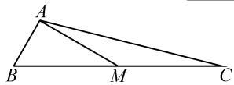
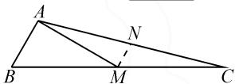
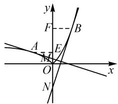
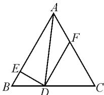
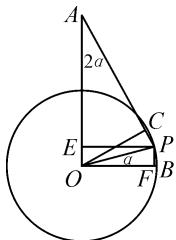

# “平几”知识巧辅助,高考问题妙破解

# ●安徽省宿城第一中学 陈玉龙

平面几何作为初中数学的一个重要组成部分，特别是其中平行直线、三角形、平面四边形、圆等相关的平面几何知识，更是高中数学问题非常常用的问题背景、知识载体与辅助手段等。在破解一些高考真题时，也经常会回归到初中平面几何知识，渗透平面几何思维与方法等来分析与求解，真正实现初、高中数学知识之间的连续性与延伸性。下面结合2021年高考真题，就平面几何在破解高考数学问题中的辅助应用加以分类剖析。

# 1 巧借直线知识辅助破解

直线知识主要包括平面内两直线平行、垂直的判定与性质等相关知识点，结合直线间位置关系的转化，确定边、角、线段长度等之间的关系，更加方便处理一些与平面几何图形有关的高中数学问题.

例 1 （2021 年高考数学浙江卷第 14 题）如图 1，在 $\triangle ABC$ 中， $\angle B = 60^{\circ}$ ，AB = 2，M 是 BC 的中点， $AM = 2\sqrt{3}$ ，则 AC = \_\_\_\_； $\cos \angle MAC =$ \_\_\_\_ .

  
图 1

  
图 2

分析:通过平面几何图形的直观性,取相应边的中点,结合平面几何知识确定线段长度关系与平行关系;利用解三角形思维与勾股定理的应用来确定垂直关系,通过平行线的性质转化垂直关系,确定对应的线段长度;结合解直角三角形来达到目的.

解析:如图2所示,取AC的中点N,连接MN.因为M是BC的中点,所以 $MN=\frac{1}{2}AB=1$ ,且 $MN\parallel AB$ .

在 $\triangle ABM$ 中,由余弦定理,可得 $AM^{2}=BA^{2}+BM^{2}-2BA\cdot BM\cos60^{\circ}$ ,则有 $(2\sqrt{3})^{2}=2^{2}+BM^{2}-2\times2\times\frac{1}{2}BM$ ,整理得 $BM^{2}-2BM-8=0$ ,解得 $BM=4$ 或 $-2$ (舍去).

由 $AB^{2}+AM^{2}=BM^{2}$ ，知 $\angle BAM=90^{\circ}$ .

结合 $MN \parallel AB$ ，可得 $MN \perp AM$ 。

所以 $AN = \sqrt{AM^2 + MN^2} = \sqrt{13}$ ，从而 $AC = 2AN = 2\sqrt{13}$ 。在 Rt△AMN 中， $\cos \angle MAC = \frac{AM}{AN} = \frac{2\sqrt{3}}{\sqrt{13}} = \frac{2\sqrt{39}}{13}$ 。

故填答案: $2\sqrt{13}$ ; $\frac{2\sqrt{39}}{13}$ .

点评:借助平面几何的相关知识与思想方法,合理添加辅助线,更加直观形象;通过平面几何中平行线、三角形的相关知识来辅助转化与应用,综合解三角形的相关知识来分析与处理,逻辑推理与直观想象核心素养得以更好地体现.

# 2 巧借三角形知识辅助破解

三角形知识是破解高中数学问题最常用的基本知识之一,包括三角形的内角和定理、中线定理、三角形相似与全等、直角三角形等众多知识点,都可用于破解与之相关的高中数学问题.

例 2 （2021 年高考数学新高考Ⅱ卷第 16 题）已知函数 $f(x)=\left|e^{x}-1\right|$ , $x_{1}<0$ , $x_{2}>0$ ，函数 $f(x)$ 的图象在点 $A(x_{1},f(x_{1}))$ 和点 $B(x_{2},f(x_{2}))$ 的两条切线互相垂直，且分别交 y 轴于 M, N 两点，则 $\frac{|AM|}{|BN|}$ 的取值范围是 \_\_\_\_.

分析:结合分段函数的表示以及求导处理,利用导数的几何意义确定两切线的斜率;根据两切线相互垂直,得到对应参数之间的关系式;结合平面几何知识,通过两直角三角形相似的判断与性质建立对应的比值关系式;结合斜率的定义来确定线段相关比值的取值范围问题.

解析:由题意可得 $f(x)=\left\{\begin{aligned}\mathrm{e}^{x}-1,x&\geqslant0,\\-\mathrm{e}^{x}+1,x&<0,\end{aligned}\right.$ 求导
可得 $f'(x)=\left\{\begin{aligned}\mathrm{e}^{x},&x\geqslant0,\\-\mathrm{e}^{x},&x<0,\end{aligned}\right.$ 则知 $k_{AM}=-\mathrm{e}^{x_{1}},k_{BN}=\mathrm{e}^{x_{2}}$

由于函数 $f(x)$ 的图象在 A, B 两点处的切线互相垂直，因此 $AM \perp BN$ ，则有 $k_{AM} \cdot k_{BN} = -e^{x_{1} + x_{2}} = -1$ ，可得 $e^{x_{1} + x_{2}} = 1$ ，即 $x_{1} + x_{2} = 0$ 。

如图3所示，作 $AE$ 垂直 $y$ 轴于点 $E, BF$ 垂直 $y$ 轴于点 $F$ 易得 $\triangle AEM \sim \triangle NFB, |BF| = |AE|$ ，则有 $\frac{|AM|}{|BN|} = \frac{|ME|}{|BF|}$ .

由题意得切线 AM 的方程为 $y + e^{x_{1}} - 1 = -e^{x_{1}} (x - x_{1})$ ，所以 $y_{M} = x_{1} e^{x_{1}} - e^{x_{1}} + 1$ .

text_image

y
F
B
A
E
M
O
x
N

图3

故 $|ME|=|y_{E}-y_{M}|=-x_{1}e^{x_{1}}$

又 $|BF|=x_{2}=-x_{1}$ ，所以可得

$$
\frac {| A M |}{| B N |} = \frac {- x _ {1} \mathrm{e} ^ {x _ {1}}}{- x _ {1}} = \mathrm{e} ^ {x _ {1}} \in (0, 1).
$$

故填答案:(0,1).

点评:结合函数图象的直观性,回归平面几何图形的直观形象,通过直线的垂直关系构建相应的三角形,借助直角三角形相似的判定与性质巧妙转化线段长度的比值问题,有效破解.

# 3 巧借平面四边形知识辅助破解

平面四边形知识主要包括正方形、长方形、平行四边形、菱形、梯形等一些常见的平面图形及其相关几何性质，通过合理过渡，巧妙转化，与三角形、直线、角等相关知识加以融合，实现平面四边形辅助破解的良好效果.

例 3 （2021 年高考数学天津卷第 15 题）如图 4，已知等边三角形 ABC 的边长为 1，D 在线段 BC 上，且 $DE \perp AB$ 于点 E， $DF \parallel AB$ 交 AC 于点 F，则 $\left|2\overrightarrow{BE}+\overrightarrow{DF}\right|=\underline{\quad}$ ; $(\overrightarrow{DE}+\overrightarrow{DF})\cdot\overrightarrow{DA}$ 的最小值为 \_\_\_\_.

text_image

Geometric diagram of triangle ABC with internal points D, E, F and connecting line segments

图4

分析:通过平面几何图形的直观性,以等腰梯形作为过渡,引入参数,结合正三角形的性质以及直线的垂直、平行关系确定各对应线段的长度,直观确定对应向量线性关系式的模;结合向量的投影以及余弦定理的向量式,得到含参的二次函数关系式,即可确定对应的最值问题.

解析:由题意可知,四边形 ABDF 是等腰梯形, $\triangle CDF$ 是正三角形.

设 $|BD|=2t,2t\in(0,1)$ ，即 $t\in\left(0,\frac{1}{2}\right)$ ，则有 $|BE|=t,|DE|=\sqrt{3}t,|AE|=1-t,|DF|=|FC|=$ $|DC|=1-2t,|AF|=2t.$

所以 $\left|2\overrightarrow{BE}+\overrightarrow{DF}\right|=2t+1-2t=1.$

在 Rt△AED 中, 可得

$$
\left| D A \right| = \sqrt {3 t ^ {2} + (1 - t) ^ {2}} = \sqrt {4 t ^ {2} - 2 t + 1}.
$$

结合余弦定理的向量式,可得

$$
\begin{array}{l} (\overrightarrow {D E} + \overrightarrow {D F}) \cdot \overrightarrow {D A} \\ = \overrightarrow {D E} \cdot \overrightarrow {D A} + \overrightarrow {D F} \cdot \overrightarrow {D A} \\ = \overrightarrow {D E ^ {2}} + \frac {\left| D F \right| ^ {2} + \left| D A \right| ^ {2} - \left| A F \right| ^ {2}}{2} \\ = 3 t ^ {2} + \frac {(1 - 2 t) ^ {2} + 4 t ^ {2} - 2 t + 1 - 4 t ^ {2}}{2} \\ = 5 t ^ {2} - 3 t + 1 \\ = 5 \left(t - \frac {3}{1 0}\right) ^ {2} + \frac {1 1}{2 0}. \\ \end{array}
$$

所以当 $t=\frac{3}{10}$ 时， $(\overrightarrow{DE}+\overrightarrow{DF})\cdot\overrightarrow{DA}$ 的最小值为 $\frac{11}{20}$ .

故填答案:1; $\frac{11}{20}$ .

点评:借助平面几何图形的直观性,通过三角形与等腰梯形的问题背景,没有添加任何辅助线,直观形象分析对应的边、角、线段等之间的关系,结合平面向量、二次函数等相关知识,实现巧妙处理,有效破解.

# 4 巧借圆的知识辅助破解

圆作为初中平面几何中一个特殊几何图形,在高中解题中经常用到的涉及圆知识的内容主要包括:圆的定义或性质,直径所对的圆周角为直角,圆幂定理,垂径定理,相交弦定理,切线长定理或切割线定理,等等.往往借助圆的平面几何性质,厘清图形特征和数量关系,实现有效转化,巧妙破解.

例 4 （2021 年高考数学全国甲卷理科第 9 题）若 $\alpha\in\left(0,\frac{\pi}{2}\right)$ ， $\tan2\alpha=\frac{\cos\alpha}{2-\sin\alpha}$ ，则 $\tan\alpha=(\quad)$ .

A. $\frac{\sqrt{15}}{15}$

B. $\frac{\sqrt{5}}{5}$

C. $\frac{\sqrt{5}}{3}$

D. $\frac{\sqrt{15}}{3}$

分析:巧妙构建对应的平面几何图形,以圆为背景,利用矩形以及几何图形中边与角的关系,并结合解直角三角形加以合理转化与应用,利用平面几何知识的辅助来达到破解三角函数求值的目的.

解析:如图5所示,点B,P在单位圆O上,且OA⊥OB, $|OA|=2$ , $\angle POB=\alpha$ .

四边形 OFPE 为矩形，点 C 在直线 AP 上，且 $\angle POC = \angle POB = \alpha$ ，则有 $|PE| = |OF| = \cos \alpha, |OE| = |PF| = \sin \alpha$ ，可得 $|AE| = 2 - \sin \alpha$ .

text_image

A
2a
E
O
C
P
a
F
B

图5

于是 $\tan\angle PAE=\frac{|PE|}{|AE|}=$ $\frac{\cos\alpha}{2-\sin\alpha}=\tan2\alpha$ ，即 $\angle PAE=2\alpha$ .

又 $\angle PAE = 2\alpha = \angle COB$ ，则 $\angle ACO = \angle AEP = 90^{\circ}$ ，且 $|OC| = |OF| = \cos \alpha .$

在 Rt△ACO 中，由 $\sin 2\alpha = \frac{\cos \alpha}{2}$ ，得 $2\sin \alpha \cos \alpha = \frac{\cos \alpha}{2}$ ，即 $\sin \alpha = \frac{1}{4}$ .

利用平方关系, 可得 $\cos\alpha=\sqrt{1-\sin^{2}\alpha}=\frac{\sqrt{15}}{4}$ .

所以 $\tan\alpha=\frac{\sin\alpha}{\cos\alpha}=\frac{\sqrt{15}}{15}.$

故选择答案:A.

点评:借助圆等相关平面几何知识加以数形结合,巧妙构建单角与双角之间的联系,以及对应的三角函数值之间的比值与转化,数形直观,逻辑推理.虽然过程比较繁杂,但变化多端的平面几何图形及其相关性质,对于学生来说也是一个很好的拓展与延伸.

在解决高中数学中三角函数、平面向量、函数、解析几何、立体几何等相关问题时，要充分挖掘问题中相应的平面几何知识、思想方法等，借助类比、降维等推理分析以及平面几何的相关知识与几何直观，通过数形结合、定理转化、代数运算、推理分析等手段来巧妙辅助破解，直观形象，回归本质，有效拓展解题思路，缩小思维步骤，优化解题过程，提升解题效益，提高数学能力，培养核心素养. Z