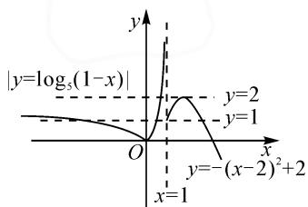
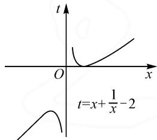

# 多选题在高中数学中的应用探究

# ●甘肃省平凉市静宁县威戎中学 吕双鹏

摘要: 多选题是高中数学中考查学生学习能力的一个重要题型. 多选题能够从不同层次来区分学生对基础知识和基本技能的掌握, 很好地突出了新高考的育人功能和选拔专业人才的功能, 对一些数学基础较好的学生而言, 多选题比单选题应该更具有挑战性, 它要求学生掌握的知识完整度更高, 细致性更强、范围更全面.

关键词: 多选题; 应用策略

选择题是针对基础知识的检测,新高考模式下多选题不但考查学生对基础知识的掌握情况,还要求学生对基本观点和原理的记忆、理解、分析、比较、判断和归纳更全面.

# 1 多选题中的函数零点问题

函数的零点问题是高考常考考点, 函数 $F(x)=f(x)-g(x)$ 有零点, 对应方程 $F(x)=f(x)-g(x)=0$ 有实数根, 等价于方程组 $\left\{\begin{aligned}y_{1}&=f(x),\\ y_{2}&=g(x)\end{aligned}\right.$ 有实数根. 其零点是函数 $F(x)=f(x)-g(x)$ 的图象与 x 横轴交点的横坐标或函数 $y_{1}$ 和 $y_{2}$ 图象交点的横坐标. 这里存在转化思想、方程思想和数形结合思想, 若含有参数也会用到分类讨论思想.

例 1 已知 $f(x)=\left\{\begin{aligned}\left|\log_{5}(1-x)\right|,&x<1,\\-(x-2)^{2}+2,&x\geqslant1,\end{aligned}\right.$ 则关于 x 的方程 $f\left(x+\frac{1}{x}-2\right)=a(a<1)$ 的实根个数可能为（）.

A.2

B.3

C.4

D.5

分析:画出 $f(x)$ 的图象,如图 1,由 a<1,可分类讨论 0<a<1,a=0,a<0 三种情况.令 $t=x+\frac{1}{x}-2$ ,画出其图象,如图 2.结合函数图象及 $f\left(x+\frac{1}{x}-2\right)=a$ ,判断出实根个数.

解: 由 $\left|\log_{5}(1-t)\right|=1$ ，解得 $t_{1}=-4, t_{2}=\frac{4}{5}$ ; 由 $-(t-2)^{2}+2=1$ ，解得 $t_{3}=1, t_{4}=3$ .

由 $|\log_5(1 - t)| = 0$ ，解得 $t_5 = 0$ ；由 $-(t - 2)^2 + 2 = 1 (t \geqslant 1)$ ，解得 $t_6 = 2 + \sqrt{2}$

①当 0 < a < 1 时， $f(t) = a$ ，有三解，且 -4 < t < 0

或 $0 < t < \frac{4}{5}$ 或 $3 < t < 2 + \sqrt{2}$ . 结合 $t = x + \frac{1}{x} - 2$ 的图象可知， $-4 < t < 0$ 时没有 $x$ 与其对应。 $0 < t < \frac{4}{5}$ 或 $3 < t < 2 + \sqrt{2}$ 时，每个 $t$ 有两个 $x$ 与其对应，故此时有4个实数根。

② 当 a=0 时， $f(t)=a$ 有两解，且 t=0 或 $t=2+\sqrt{2}$ . t=0 有一个 x=1 与其对应， $t=2+\sqrt{2}$ 有两个 x 与其对应. 故此时有 3 个实数根.  
③当 a<0 时， $f(t)=a$ ，有一解，且 $t>2+\sqrt{2}$ 。结合图象可知，每个 t 有两个 x 与其对应。故此时有 2 个实数根。

综上所述, $f\left(x+\frac{1}{x}-2\right)=a$ 的实数根个数为2个,3个或4个.

故选答案: ABC.

line

| x | y |
|---|---|
| 0 | 0 |
| 1 | 0 |
| 2 | 0 |
| 3 | 0 |
| 4 | 0 |
| 5 | 0 |
| 6 | 0 |
| 7 | 0 |
| 8 | 0 |
| 9 | 0 |
| 10 | 0 |
| 11 | 0 |
| 12 | 0 |
| 13 | 0 |
| 14 | 0 |
| 15 | 0 |
| 16 | 0 |
| 17 | 0 |
| 18 | 0 |
| 19 | 0 |
| 20 | 0 |
| 21 | 0 |
| 22 | 0 |
| 23 | 0 |
| 24 | 0 |
| 25 | 0 |
| 26 | 0 |
| 27 | 0 |
| 28 | 0 |
| 29 | 0 |
| 30 | 0 |
| 31 | 0 |
| 32 | 0 |
| 33 | 0 |
| 34 | 0 |
| 35 | 0 |
| 36 | 0 |
| 37 | 0 |
| 38 | 0 |
| 39 | 0 |
| 40 | 0 |
| 41 | 0 |
| 42 | 0 |
| 43 | 0 |
| 44 | 0 |
| 45 | 0 |
| 46 | 0 |
| 47 | 0 |
| 48 | 0 |
| 49 | 0 |
| 50 | 0 |
| 51 | 0 |
| 52 | 0 |
| 53 | 0 |
| 54 | 0 |
| 55 | 0 |
| 56 | 0 |
| 57 | 0 |
| 58 | 0 |
| 59 | 0 |
| 60 | 0 |
| 61 | 0 |
| 62 | 0 |
| 63 | 0 |
| 64 | 0 |
| 65 | 0 |
| 66 | 0 |
| 67 | 0 |
| 68 | 0 |
| 69 | 0 |
| 70 | 0 |
| 71 | 0 |
| 72 | 0 |
| 73 | 0 |
| 74 | 0 |
| 75 | 0 |
| 76 | 0 |
| 77 | 0 |
| 78 | 0 |
| 79 | 0 |
| 80 | 0 |
| 81 | 0 |
| 82 | 0 |
| 83 | 0 |
| 84 | 0 |
| 85 | 0 |
| 86 | 0 |
| 87 | 0 |
| 88 | 0 |
| 89 | 0 |
| 90 | 0 |
| 91 | 0 |
| 92 | 0 |
| 93 | 0 |
| 94 | 0 |
| 95 | 0 |
| 96 | 0 |
| 97 | -1.5 (x-2)^2 + -2.5 (y-1) / (x-2)^2 + -2.5 (y-1)^2 + -2.5 (y-1)^2 + -2.5 (y-1)^2 + -2.5 (y-1)^2 + -2.5 (y-1)^2 + -2.5 (y-1)^2 + -2.5 (y-1)^2 + -2.5 (y-1)^2 + -2.5 (y-1)^2 + -2.5 (y-1) + -2.5 (y-1)^2 + -2.5 (y-1)^2 + -2.5 (y-1)^2 + -2.5 (y-1)^2 + -2.5 (y-1)^2 + -2.5 (y-1)^2 + -2.5 (y-1)^2 + -2.5 (y-1)^2 + -2.5 (y-1)^2 < x = -2^(-x/4)^2 + x = -x/4^(-x/4)^2 + x = -x/4^(-x/4)^2 + x = -x/4^(-x/4)^2 + x = -x/4^(-x/4)^2 + x = -x/4^(-x/4)^2 + x = -x/4^(-x/4)^2 + x = -x/4^(-x/4)^2 + x = -x/4^-(x/4)^2 + x = -x/4^-(x/4)^2 + x = -x/4^-(x/4)^2 + x = -x/4^-(x/4)^2 + x = -x/4^-(x/4)^2 + x = -x/4^-(x/4)^2 + x = -x/4^-(x/4)^2 + x = -x/4^-(x / -x)^2 + x = -x / -x)^2 + x = -x / -x)^2 + x = -x / -x)^2 + x = -x / -x)^2 + x = -x / -x)^2 + x = -x / -x)^2 + x = -x / -x)^2 + x = -x / -x)^2 + x = -x / -x)^2 + x = -x / -x)^2 + x = x^(-1)^2 + x = x^(-1)^2 + x = x^(-1)^2 + x = x^(-1)^2 + x = x^(-1)^2 + x = x^(-1)^2 + x = x^(-1)^2 + x = x^(-1)^2 + x = x^(-1)^2 + x = x^(-1)^2 + x = x^(-1)^2 + x = x^(-1) + x = x^(-1)^2 + x = x^(-1)^2 + x = x^(-1)^2 + x = x^(-1)^2 + x = x^(-1)^2 + x = x^(-1)^2 + x = x^(-1)^2 + x = x^(-1)^2 + x = x^(-1)^2 + x = x^(-1)^2 + x = x^(-1)^2

图 1

text_image

t
O
x
t=x+\frac{1}{x}-2

图 2

点评:本题考查函数的零点个数问题以及参数的分类讨论,应用数形结合和分类讨论数学思想方法.解决零点个数问题的最好办法有如下几种.(1)方程思想:直接解方程得到方程的根;(2)分离参数法:先将参数分离,转化成求函数值域的问题求解;(3)数形结合:先对解析式变形,进而构造两个函数,在同一平面直角坐标系中画出两函数图象,利用数形结合法求解.

# 2 多选择题中的三角函数问题

多选择题中的三角函数问题主要考查三角函数的图象与性质,往往结合诱导公式、和差角的正余弦公式、二倍角公式、降幂公式、辅助角公式等考查学生的化简运算能力.

例 2 函数 $f(x)=\sin\left(2x-\frac{\pi}{6}\right)-2\sin\left(x+\frac{\pi}{4}\right)\cdot\cos\left(x+\frac{\pi}{4}\right)(x\in\mathbf{R})$ ，则下列命题正确的是（）.

A. 函数 $f(x)$ 的最小正周期是 $2\pi$

B. 函数 $f(x)$ 的最大值是 $\sqrt{3}$

C. 函数 $f(x)$ 在 $\left[-\frac{\pi}{4}, \frac{\pi}{4}\right]$ 上单调递增

D. 将函数 $f(x)$ 图象向右平移 $\frac{\pi}{12}$ 个单位长度, 得到函数解析式为 $g(x) = -\sqrt{3} \cos 2x$

分析:由三角恒等变换,得 $f(x)=\sqrt{3}\sin\left(2x-\frac{\pi}{3}\right)$ , 再根据函数的性质判断选项 A 与 B, 选项 C 中要熟悉正弦函数 $y=\sin x$ 的单调递增区间, 选项 D 考查函数图象的平移变换.

解: $f(x)=\frac{\sqrt{3}}{2}\sin 2x-\frac{1}{2}\cos 2x-\sin\left(2x+\frac{\pi}{2}\right)$

$$
= \frac {\sqrt {3}}{2} \sin 2 x - \frac {3}{2} \cos 2 x
$$

$$
= \sqrt {3} \sin \left(2 x - \frac {\pi}{3}\right).
$$

根据三角函数性质, 得函数 $f(x)$ 的最小正周期 $T=\pi$ , 选项 A 错误; 函数 $f(x)$ 的最大值为 $\sqrt{3}$ , 选项 B 正确.

当 $2x - \frac{\pi}{3} \in \left[-\frac{\pi}{2} + 2k\pi, \frac{\pi}{2} + 2k\pi\right] (k \in \mathbf{Z})$ 时，函数 $f(x)$ 在 $\left[-\frac{\pi}{12} + k\pi, \frac{5\pi}{12} k\pi\right] (k \in \mathbf{Z})$ 上单调递增，故选项C错误.

将函数 $f(x)$ 图象向右平移 $\frac{\pi}{12}$ 个单位长度, 可得到 $g(x)=\sqrt{3}\sin\left[2\left(x-\frac{\pi}{12}\right)-\frac{\pi}{3}\right]=-\sqrt{3}\cos2x$ , 所以选项 D 正确.

故选: BD.

点评:本题主要考查三角恒等变换和三角函数图象的基本性质,考查全面.若学生遗忘了哪个知识点则该题得分较低.

# 3 多选题中的数列问题

多选题中的数列问题,常考的知识点有:等比(差)数列的证明;等比(差)数列的性质、前n项和;求解一般数列的通项公式、数列求和方法;等等.主要考查学生对公式、性质的应用能力,准确计算以及逻辑推理能力.

例 3 在递增的等比数列 $\{a_{n}\}$ 中, 已知公比为 q, $S_{n}$ 是其前 n 项的和, 若 $a_{1}a_{4}=32, a_{2}+a_{3}=12$ , 则下列说法正确的是().

$$
\mathrm{A}. q = 2
$$

B. 数列 $\{S_{n}+2\}$ 是等比数列

$$
\mathrm{C}. S _ {8} = 5 1 0
$$

D. 数列 $\{\lg a_{n}\}$ 是公差为 2 的等差数列

分析:由题意可得 q=2，则 $S_{8}=510$ ，所以数列 $\{S_{n}+2\}$ 的通项公式为 $S_{n}+2=2^{n+1}$ ，即以 4 为首项，2 为公比的等比数列，选项 A, B, C 正确。数列 $\{\lg a_{n}\}$ 是以 $\lg 2$ 为首项， $\lg 2$ 为公差的等差数列，所以选项 D 错误。

解: $\{a_{n}\}$ 是递增的等比数列, $a_{1}a_{4}=32,a_{2}+a_{3}=12$ ,得 $\left\{\begin{aligned}a_{2}&=4,\\ a_{3}&=8,\end{aligned}\right.$ 或 $\left\{\begin{aligned}a_{2}&=8,\\ a_{3}&=4\end{aligned}\right.$ （舍）,从而 $a_{n}=2^{n}$ .

所以 q=2，选项 A 正确；

由 $a_{n}=2^{n}$ ，得 $S_{n}=2^{n+1}-2$ ，故 $S_{8}=510$ ，选项 C 正确；

又 $S_{n}+2=2^{n+1}$ ，则数列 $\{S_{n}+2\}$ 是以 4 为首项，2 为公比的等比数列，选项 B 正确；

又因为 $\lg a_{n} = \lg 2^{n} = n \lg 2$ ，所以数列 $\{\lg a_{n}\}$ 是以 $\lg 2$ 为首项， $\lg 2$ 为公差的等差数列，选项 D 错误.

故选:ABC.

点评:数列计算中公式是关键.等比(差)数列证明的常见方法有定义法、通项公式法、等比(差)中项法、前n项和公式法.数列求和在这道问题中有些简单,但常用的数列求和方法(倒序相加法、错位相减法,裂项相消法,分组求和法)也是我们需要重点掌握的.

多选题的解题方法注重知识点之间的联系,但也可采用直接选择法、排除法、比较法和逻辑推理法.学生在做多选题时,一定要慎重,对有把握的正确选项可以先选;对没有把握的选项最好不选,保证得分也不能失分.Z