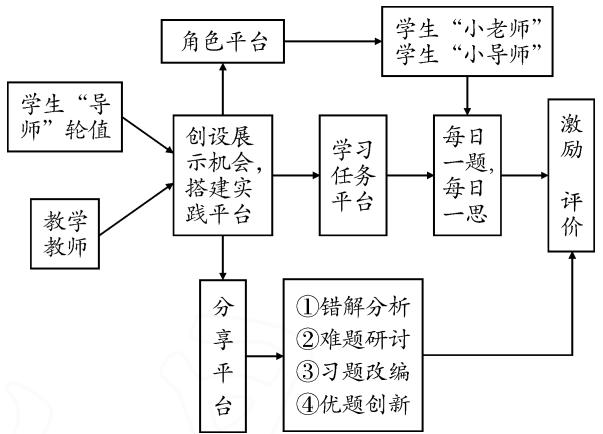
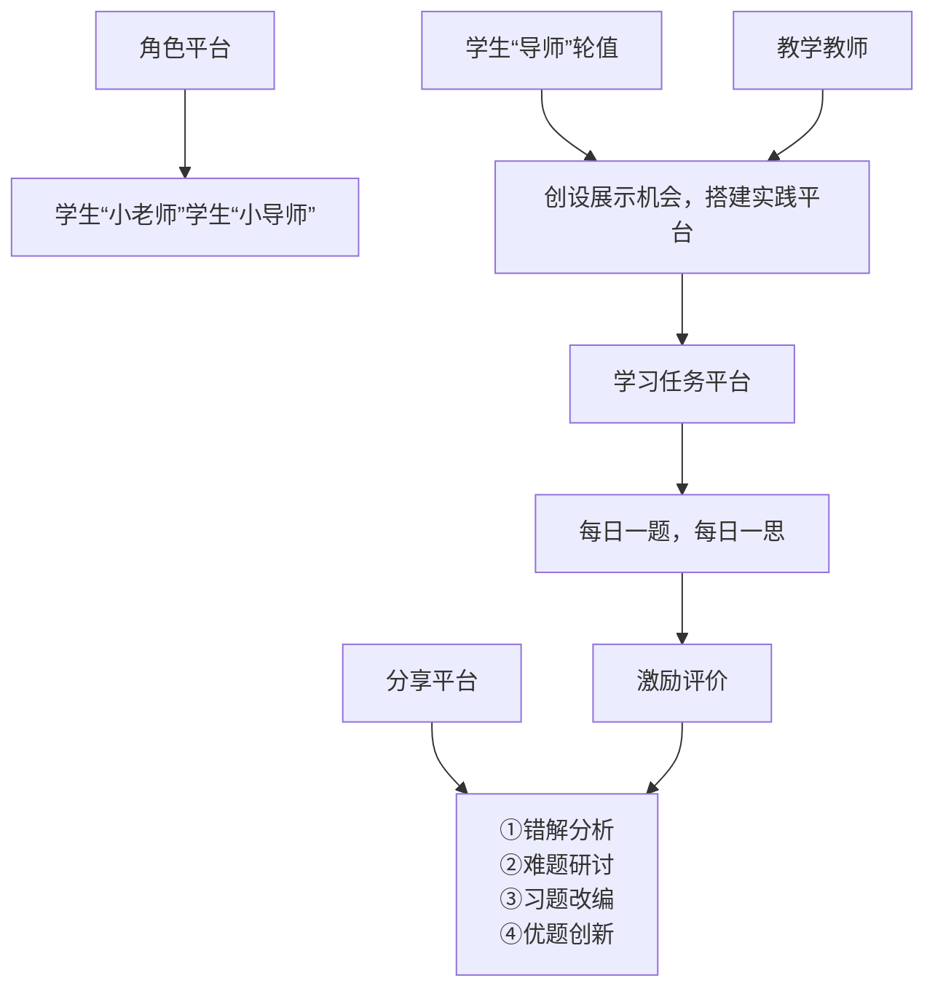

# 构建学生主体习题课堂,培养学生高阶思维能力

●广东省广州市第一中学 贺小意

摘要: 在高中数学教学活动中,习题课教学课堂是最为基本的组成部分,是高中学生理解和应用数学思想的重要阵地.教师通过组织习题的讲评、练习以及指导学生解题,构建以学生为主体的数学习题课堂平台,可以促进学生高阶思维的生成.教师搭建好有利于学生展示、实践、探究的“脚手架”,激发学生深度学习,形成分析、评价、创造、批判等高阶思维.本研究将"高阶思维能力的培养”与“高中数学习题教学的课堂构建”结合起来,构建不同形式的学生主体数学习题教学课堂,培养学生高阶思维能力.

关键词: 高阶思维; 高中数学习题教学; 学生主体习题课堂

# 1 培养学生高阶思维能力的内在需要

# 1.1 培养学生高阶思维能力是新课程的要求

新课程理念注重对学生数学能力的培养.高阶思维能力是学生数学能力的重要部分.培养学生高阶思维能力是新时代国家教育发展方向,也是社会的需要.当前数学课堂依然存在大部分以教师为主体的课堂,以及对学生的关注,缺乏对学生高阶思维培养的关注.教师教给学生的单一的数学结论和公式,往往忽略知识生成的过程,忽略了知识的思辨性和探究性.学生在这样的课堂更难培育出自己的主动思考和创新思维.因此,构建培育学生高阶思维能力的数学课堂迫在眉睫.

# 1.2 培养数学高阶思维能力需要以习题课为载体

习题是数学知识的载体,也是培养学生高阶思维能力的载体.高中数学习题教学中,教师搭建学生展示、探究平台,让学生在数学实践活动中经历“解决问题”的过程[1].学生在数学实践过程中容易对自己的思维活动进行分析、反思、评价,产生创新思维的火花,同时还能指导同伴在实践中提升高阶思维能力.因此,数学高阶思维能力的培养需要习题课作为载体.基于高阶思维培养视角的习题教学如何通过实践过程提升学生的数学思维,促使学生形成数学高阶思维?笔者通过数学习题课教学实践研究,谈谈数学高阶思维的培养策略.

# 2 高阶思维视角下数学课堂的基本环节

教学基本环节中,笔者以高阶思维培养为视角,以学生为主体进行“脚手架”搭建.图1是笔者在数学习题课堂中设计的教学基本环节.

flowchart

图1

# 3 构建学生主体习题课堂,培养高阶思维能力

笔者构建数学习题课堂的基本环节后，思考构建以学生为主体的习题课课堂形式，在课堂中发挥学生主体作用，开展“做数学”实践活动提升高阶思维能力的探索。《普通高中数学课程标准（2017年版）》提出：学生的数学学习活动不应只限于对概念、结论和技能的记忆、模仿与接受，独立思考、自主探索、动手实践、合作交流、预阅读自学等都是学习数学的重要方式。笔者把学习个体在数学实践操作中“独立思考、自主探索、动手实践、合作交流”归为“做数学”的范畴。在数学学科教育中，笔者致力于“做数学”的实践研究，即以学生为主体开展数学学习活动。在上述“数学习题教学课堂基本环节”的基础上，笔者创设了不同形式的学生主体习题课堂，培养学生的高阶思维能力 $^{[2]}$ 。

# 3.1 开放研讨式习题教学,以“思”提高高阶思维能力

如何让学生在短短 40 分钟的课堂提高高阶思维能力呢？很多教师采用变式教学。但很多学生只是看到变过的试题，经历知识层层递进的应用，而没有经历变的过程，很多时候还是被动地接受知识。在研究中，笔者把一节轨迹问题的高三一轮复习传统习题课改为开放式研讨课。下面是该节开放式研讨课的其中一个例题。

例 1 △ABC 的内角 A, B, C 的对边分别为 a, b, c，若边 c = 8，\_\_\_\_，请你在横线上填上一个适当的条件，求顶点 C 的轨迹方程.

课堂上学生先自主思考或者小组合作研讨解决该问题,然后展示自己的思维成果.学生经过自主思考和小组讨论得到以下添加条件:

条件一: 边 c 的中线长为 5.

学生解答:以线段 AB 中点 O 为原点,AB 所在直线为 x 轴,建立平面直角坐标系,显然容易得到点 C 的轨迹为圆(去掉 A,B 两点).

条件二: $C=\frac{\pi}{2}$ .学生得到的轨迹同上.

条件三： $|CA|=|CB|$ . 由该条件得到了点 C 的轨迹为一条直线. 当学生展示这一条件后，有好几位同学受到启发把条件变为 $|CA|=2|CB|$ ，从而得到“阿波罗尼斯圆”问题.

条件四： $\left|CA\right|+\left|CB\right|=10.$

条件五： $\left|CA\right|-\left|CB\right|=6.$

对于条件四和条件五,学生都能建立坐标系得到相应椭圆和双曲线的轨迹方程.但对于条件五中,有学生提出:这种条件下点 C 的轨迹是双曲线的一支.学生的批判性思维在这里得到了良好的展现.

教师与学生交流后,发现学生在寻找添加条件时采用了正向思维和逆向思维的思考问题方式.这是高阶思维能力中经常谈到的技能与知识迁移问题,学生在这样的课堂能够比较顺利地用到“顺向迁移”和“逆向迁移”.

本节课上,笔者使用了培养高阶思维能力的一个策略,即鼓励学生使用“提问—回答”和“自我解释”的策略.笔者认为发展学生高阶思维能力还需要“高路迁移”.心理学家萨洛蒙认为:在高路迁移中,个体有目的地、有意识地将一些在一种情景中已经学会的一般性的知识、策略或原理应用到不同情景中.下面是一个小组讨论出来的添加条件.

条件六: 直线 AC 和直线 CB 的斜率之积是常数 t. 以线段 AB 中点 O 为原点, AB 所在直线为 x 轴, 建立直角坐标系.

一个学生代表上讲台完成‘自我解释’后,全班同学为之鼓掌称赞.这个条件根据 t 的不同取值,可以得到圆、椭圆、双曲线等相关的轨迹.这位学生已经具备“高路迁移”能力.听完该学生完成‘自我解释’后,学生 E 马上提出问题:刚才大家给出的条件得到的曲线有直线、圆、椭圆、双曲线,能否添加一个条件,使顶点 C 的轨迹是抛物线或者其他曲线?提出问题后,下课铃声响起.我提议同学们课后解决学生 E 的问题.虽然问题没有在课堂上解决,但这个问题把这堂课推向了高潮,激发了很多学生的求知欲.开放研讨式课堂是学生高阶思维发展和提升的肥沃土壤.学生的思维经历“做数学”的实践活动后在肥沃土壤中生长,学生的创新能力、评价能力、分析能力以及批判性思维在土壤中得到培养和发展 $^{[3]}$ .

# 3.2 学生主讲式习题教学,以“讲”促进高阶思维培养

高阶思维的培养需要以探索问题最佳解法的习题课为载体[4].教师需要设计一些一题多解的问题，引导学生从各种不同的角度，运用不同的思维方法去解决同一个问题，锻炼学生的发散思维能力.在教学中，教师以学生为主体，多给学生一些展示讲评的机会，让学生在探索中提高解决实际问题的能力，找到自己成功的喜悦感.学生主讲式习题课堂教学，有利于充分调动学生思维的积极性，锻炼学生思维的广阔性，培养和发挥学生的创造性.在圆锥曲线定义的应用这节习题课中，笔者设计的例题为：

例 2 已知抛物线 C: $y^{2}=6x$ 的焦点为 F，准线为 l, P 是 l 上一点，Q 是直线 PF 与 C 的一个交点，若 $\overrightarrow{FP}=3\overrightarrow{FQ}$ ，则 $|QF|=$ \_\_\_\_.

A. $\frac{3}{2}$

B.1

C.2

D.3

学生 A 讲评了他的解法：

设 $Q(x_{0},y_{0})$ , $P\left(-\frac{3}{2},y\right)$ ，则 $\overrightarrow{FP}=(-3,y)$ , $\overrightarrow{FQ}=\left(x_{0}-\frac{3}{2},y_{0}\right)$ . 由 $\overrightarrow{FP}=3\overrightarrow{FQ}$ ，可得 $Q\left(\frac{1}{2},\sqrt{3}\right)$ ，
所以 $|QF|=2.$

笔者根据学生的解法设计了问题 1:

问题 1 学生 A 的解法应用了什么知识解决了例题中的长度问题？

待学生回答后,提出了如下问题2.

问题 2 本题还有没有其他解法？有关焦点的问题,我们可以从哪些思维角度思考问题?

学生回答问题的积极性很高.学生 B 是本节课轮

值的小老师,他提供了第二种解法:

设直线 l 与 x 轴的交点为 K，作 $QE \perp l$ 于点 E，则 QE 平行于 x 轴。故 $\frac{|QE|}{|FK|} = \frac{|PQ|}{|PF|} = \frac{2}{3}$ 。由 $|FK| = 3$ ，可得 $|QE| = 2$ 。由抛物线定义知 $|QE| = |QF|$ ，所以 $|QF| = 2$ 。

小老师 B 完成解答后,他提出了问题 3 和问题 4:

问题3 已知直线 $y = k(x + 2)(k > 0)$ 与抛物线 $C: y^2 = 8x$ 相交于 $A, B$ 两点， $F$ 为 $C$ 的焦点，若 $|FA| = 2|FB|$ ，则 $k =$ \_\_\_\_.

问题4 已知抛物线 $C: y^{2} = 4x$ 焦点为 $F$ , 过点 $F$ 的直线 $l$ 与 $C$ 交于 $A, B$ 两点, 交 $y$ 轴于点 $P$ . 若 $|\overrightarrow{AB}| = 3|\overrightarrow{BP}|$ , 求直线 $l$ 的方程.

笔者看出小老师 B 提供的题不是他的原创,但是他能够在老师的问题基础上提出两个问题给班上同学,这需要从本质上理解这是同一类问题.在思维能力方面,该同学达到了高阶思维阶段.

数学学习的知识点多,学生会感觉到零乱.教师通过精心设计数学概念、定理等问题,由学生对问题进行主讲,提高了学生“潜心概括”的能力,加深了对数学知识的理解应用,并促使学生自觉地储存,同时培养了学生数学思维的深度,促进高阶思维的形成.

# 3.3 纠错型习题教学,以“变”促进高阶思维培养

纠错型习题教学课堂,指的是针对学生学习过程中出现的问题,大胆启用小组教学,由小组长带领组员对错题进行二次编题,然后在课堂展示与讲评.笔者在“直线与圆”的高三第一轮复习中,发现下面一道题学生在课堂上做得不理想:

P 是圆 $M: x^{2} + (y - 3)^{2} = 4$ 上的动点，则点 P 到直线 l: x - y - 3 = 0 的最短距离为 \_\_\_\_.

通过习题教学后,学生进行纠错型课堂展示,下面是几位组长根据错题进行二次改编的问题:

问题 1 P 是圆 $M: x^{2} + (y - 3)^{2} = 4$ 上的动点，Q 是直线 l: x - y - 3 = 0 上的动点，则 P, Q 两点的最短距离为 \_\_\_\_.

问题 2 P 是椭圆 $\frac{x^{2}}{4} + \frac{y^{2}}{3} = 1$ 上的动点，则点 P 到直线 l: x - y - 3 = 0 的最短距离为 \_\_\_\_.

问题 3 P 是直线 l: x - y - 3 = 0 上的动点, 过点 P 向圆 $M: x^{2} + (y - 3)^{2} = 4$ 作切线, 切点是 Q, 则 P, Q 两点的最短距离为 \_\_\_\_.

问题 4 已知直线 $l: y = k(x + 4)$ 与圆 $(x + 2)^{2} + y^{2} = 4$ 相交于 A, B 两点, M 是线段 AB 的中点, 则点

M 到直线 3x-4y-6=0 的距离最大值为 \_\_\_\_.

学生经过合作、探究编制的错题二次改编题，对自己的高阶思维能力是一次提高，同时对其他同伴更是一次提高。学生的思维创新性和思维发散性都得到了很好的锤炼。

数学是思维的体操.教师在教学中针对学生的错误资源,进行“错题二次改编”,适当布置一些开放性作业或随堂练习,以促进学生“反思”,引导学生学会思考.同时,开放性的作业也易促进学生数学思维的开放性、灵活性和探究性.

教师在习题教学中,应多关注学生的体验以及高质量作业或习题的布置,促使学生在高质量的习题中形成必备的学习“品格”.纠错型习题教学课堂是能较好引导学生进行数学体验的课型.纠错型习题教学课堂中,教师构建起以学生为主体的平台,易激发学生学习数学的兴趣,提升数学高阶思维.

建构主义理论认为,学习过程不是学习者被动地接受知识,而是积极地建构知识的过程.通过实践,笔者认为习题教学中“纠错型习题教学”的课堂构建与普通的变式教学课堂截然不同.“纠错型习题教学”的课堂更注重问题之间的联系,问题的层次,问题的深度,问题的适度.“纠错型习题教学”的课堂更注重学生主体.学生带着问题去改编,主动理解知识,构建知识体系,有助于高阶思维的形成.

关于知识构建和思维储存，皮亚杰认为：“如果需要取得更佳的效果，与他人观点的交换和合作应该是在同伴之间进行。”通过高中数学习题教学实践的研究，笔者认为教师以学生同伴的身份构建课堂，构建以学生为主体的数学习题课堂，以培养高阶思维为视角，创设学生同伴之间进行的“做数学”实践活动非常必要，且非常有效。思维离不开“训练”。培养学生高阶思维能力，教师需精心搭建基于学生主体、基于高阶思维视角的数学习题课堂“脚手架”。

# 参考文献：

[1] Lisa Bohlin, Cheryl Ciseero Durwin. 教育心理学: 激发自主学习的兴趣 [M]. 北京: 机械工业出版社, 2018.  
[2]史宁中,王尚志.普通高中数学课程标准(2017年版)解读[M].北京,高等教育出版社,2018.  
[3]贺小意.高阶思维培养视角下“做数学”的探究[J].中学数学,2019(13):93-95.  
[4]戴再平.数学习题理论[M].上海:上海教育出版社,1996.Z