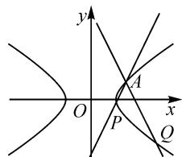
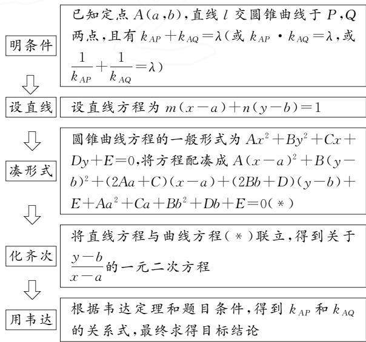

# 谈齐次化构造法解决两直线的斜率和与积问题

——以 2022 年新高考 I 卷圆锥曲线为例

●华南师范大学 叶晓茵 陈伟连

摘要:本文中以2022年新高考Ⅰ卷第21题为切入点,运用齐次化构造法解决斜率和与斜率积的问题,并将问题推广到更加一般的情况,得到曲线外的点和曲线上的点与曲线上两点连线的斜率和与积的一些有趣结论.

关键词: 齐次化构造法; 定点; 定值; 定斜率

# 1 试题呈现

如图 1, 已知点 A(2,1) 在双曲线 $C: \frac{x^{2}}{a^{2}} - \frac{y^{2}}{a^{2} - 1} = 1 (a > 1)$ 上, 直线 l 交 C 于 P, Q 两点, 直线 AP, AQ 的斜率之和为 0.

(1) 求 l 的斜率;

text_image

y
A
O
x
P
Q

图1

(2) 若 $\tan \angle PAQ = 2\sqrt{2}$ ，求 $\triangle PAQ$ 的面积.

# 2 试题剖析

本题考查椭圆方程的求法,直线和椭圆的交点与曲线上的点连接的斜率和问题,涉及转化和化归能力以及代数运算能力.第(1)问可以用常规方法设直线,再运用韦达定理,算出点P,Q的坐标,运用条件化简得到关于直线l斜率的式子就可以解决,但是这种方法运算量偏大,出错率高.本文中应用齐次化构造法来解决这类斜率和与积的问题进行解决,以彰显这种方法处理该类问题的强大之处.

# 3 试题第(1)问的解答

利用齐次化构造法解答第(1)问的过程如下: 易求得 C 的方程为 $\frac{x^{2}}{2}-y^{2}=1$ .

因为直线 l 不过点 A(2,1)，所以设直线 l 的方程为 $m(x-2)+n(y-1)=1$ .

由 $\frac{x^2}{2} - y^2 = 1$ ，得 $\frac{(x - 2 + 2)^2}{2} - (y - 1 + 1)^2 = 1$ .

联立 $\left\{\begin{aligned}m(x-2)+n(y-1)=1,\\ \frac{(x-2)^{2}}{2}+2(x-2)-(y-1)^{2}-2(y-1)=0,\end{aligned}\right.$ 齐次化整理得 $-(2n+1)\left(\frac{y-1}{x-2}\right)^{2}+(2n-2m)\left(\frac{y-1}{x-2}\right)+$

$\left(2m + \frac{1}{2}\right) = 0$ ，即 $-(2n + 1)k^2 +(2n - 2m)k+$ $(2m + \frac{1}{2}) = 0.$ 由韦达定理，得

$$
k _ {A P} + k _ {A Q} = \frac {y _ {1} - 1}{x _ {1} - 2} + \frac {y _ {2} - 1}{x _ {2} - 2} = - \frac {2 n - 2 m}{- (2 n + 1)} = 0.
$$

所以 $m = n$ . 故直线 $l$ 的斜率为 $-\frac{m}{n} = -1$ .

评注: 解决此类有关斜率的问题, 常用的方法有点差法、设一直线法、设两直线法、设三直线法、对偶法以及齐次化构造法. 对比这些解法, 齐次化构造法的计算量最小. 学生如果能够理解并运用齐次化构造法, 将会节省计算时间, 快速解决有关斜率和与积的问题.

# 4 使用步骤

为方便大家更好地利用齐次化构造法解决解析几何中以上类型问题,笔者总结归纳了使用该方法的步骤,如图2所示.

text_image

已知定点A(a,b),直线l交圆锥曲线于P,Q
两点,且有kAP+kAQ=λ(或kAP·kAQ=λ,或
1/kAP+1/kAQ=λ)
设直线方程为m(x-a)+n(y-b)=1
圆锥曲线方程的一般形式为Ax²+By²+Cx+
Dy+E=0,将方程配凑成A(x-a)²+B(y-
b)²+(2Aa+C)(x-a)+(2Bb+D)(y-b)+
E+Aa²+Ca+Bb²+Db+E=0(*)
将直线方程与曲线方程(*)联立,得到关于
y-b/a的一元二次方程
根据韦达定理和题目条件,得到kAP和kAQ
的关系式,最终求得目标结论

图2

# 5 结论推广

# 5.1 类别一: 点 M 在曲线上

探究 1 已知圆锥曲线过点 $M(m,n)$ ，直线 l 交圆锥曲线于 P, Q 两点，且有 $k_{MQ} + k_{MP} = 0$ ，求直线 l 的斜率.

结论 1: 对圆锥曲线进行分类, 得到如表 1 所示的关于直线 l 斜率 k 的结论.

表 1

<table><tr><td>圆锥曲线方程</td><td> $k_{MP} + k_{MQ} = 0$ </td></tr><tr><td> $\frac{x^{2}}{a^{2}} + \frac{y^{2}}{b^{2}} = 1$ </td><td> $k = \frac{m}{n} \cdot \frac{b^{2}}{a^{2}}$ </td></tr><tr><td> $\frac{x^{2}}{a^{2}} - \frac{y^{2}}{b^{2}} = 1$ </td><td> $k = -\frac{m}{n} \cdot \frac{b^{2}}{a^{2}}$ </td></tr><tr><td> $y^{2} = 2px$ </td><td> $k = -\frac{p}{n}$ </td></tr></table>

说明: 若点 $M(m,n)$ 在圆锥曲线上, 不过点 M 的直线 l 交曲线于 P, Q 两点. 直线 l 的斜率与直线 MP, MQ 的斜率之和与积的结论详见参考文献 $^{[1-2]}$ .

# 5.2 类别二: 点 M 不在曲线上

由于 $m = 0, p = 0$ 或直线 $l$ 斜率不存在，这种方法没有明显优势，因此以下的讨论都是基于 $p \neq 0, m \neq 0, p \neq m$ ，且直线 $l$ 的斜率均存在的情况.

探究 2 （点 M 在 x 轴上）设曲线 C，点 $M(m,0)$ 不在曲线 C 上，过点 $F(p,0)$ 的直线 l 交曲线于 A, B 两点， $p \neq m \neq 0$ ，探求 $k_{MA} + k_{MB}, k_{MA} k_{MB}$ 的值.

解: 以曲线 $C: \frac{x^{2}}{a^{2}} + \frac{y^{2}}{b^{2}} = 1$ 为例. 平移 M 到原点, 将 $\left\{\begin{aligned} x &= x_{1} + m, \\ y &= y_{1} \end{aligned}\right.$ 代入曲线 C 的方程, 得

$$
\frac {x _ {1} ^ {2} + m ^ {2} + 2 m x _ {1}}{a ^ {2}} + \frac {y _ {1} ^ {2}}{b ^ {2}} = 1.
$$

设直线 l 为 $cx_{1} + dy_{1} = 1$ ，且过 $F_{1}(p - m, 0)$ ，则 $c = \frac{1}{p - m}$ .

齐次化，得 $\left(Ad^2 +\frac{1}{b^2}\right)\left(\frac{y_1}{x_1}\right)^2 +\left(2Acd + \frac{2md}{a^2}\right)\cdot$ $\frac{y_1}{x_1} +\frac{1 + 2mc}{a^2} +Ac^2 = 0$ ，其中 $A = \frac{m^2}{a^2} -1.$

若 $k_{MA} + k_{MB} = -\frac{2Acd + \frac{2md}{a^2}}{Ad^2 + \frac{1}{b^2}} = \lambda$ ，当 $\lambda = 0$ 时， $a^2 = mp.$

若 $k_{MA}k_{MB} = \frac{\frac{1 + 2mc}{a^2} + Ac^2}{Ad^2 + \frac{1}{b^2}} = \lambda$ ，当 $\lambda = 0$ 时， $p^2 = a^2$

结论 2: 以下将列出其他曲线的情况, 得到如表 3 所示的关于直线 l 的斜率与直线 MA, MB 的斜率之和与积的结论.

表 2

<table><tr><td>圆锥曲线方程</td><td> $k_{MA} + k_{MB} = \lambda$ </td><td> $k_{MA}k_{MB} = \lambda$ </td></tr><tr><td> $C: \frac{x^{2}}{a^{2}} + \frac{y^{2}}{b^{2}} = 1$ </td><td>当  $\lambda = 0$  时, $a^{2} = mp$ </td><td> $\lambda = 0, p^{2} = a^{2}$ </td></tr><tr><td> $C: \frac{x^{2}}{a^{2}} - \frac{y^{2}}{b^{2}} = 1$ </td><td>当  $\lambda = 0$  时, $a^{2} = mp$ </td><td> $\lambda = 0, p^{2} = a^{2}$ </td></tr><tr><td> $C: y^{2} = 2p_{1}x$ </td><td>当  $\lambda = 0$  时, $p + m = 0$ </td><td>无类似性质</td></tr></table>

探究 3 （点 M 在 y 轴上）设曲线 C，点 $M(0, n)$ 不在曲线 C 上，过点 $F(p, 0)$ 的直线 l 交曲线于 A, B 两点，探求 $k_{MA} + k_{MB}, k_{MA} k_{MB}$ 的值.

结论 3: 以下将列出其他曲线的情况, 得到如表 4 所示的关于直线 l 的斜率与直线 MA, MB 斜率之和与积的结论.

表 3

<table><tr><td>圆锥曲线方程</td><td> $k_{MA} + k_{MB} = \lambda$ </td><td> $k_{MA}k_{MB} = \lambda$ </td></tr><tr><td> $C : \frac{x^{2}}{a^{2}} + \frac{y^{2}}{b^{2}} = 1$ </td><td>无类似性质</td><td> $\lambda \neq 0$ ,当 $\lambda = \frac{n^{2}}{p^{2}}$ 时, $k = -\frac{3na^{2} + np}{p(a^{2} + p^{2})}$ </td></tr><tr><td> $C : \frac{x^{2}}{a^{2}} - \frac{y^{2}}{b^{2}} = 1$ </td><td> $\lambda \neq 0, 2n + \lambda p = 0$ 时, $k = -\frac{b^{2} + n^{2}(1 - p)}{pn(1 - p)}$ </td><td> $\lambda \neq 0, \lambda = \frac{n^{2}}{p^{2}}$ 时, $k = -\frac{n(a^{2} + p^{2})}{p(p^{2} - a^{2})}$ </td></tr><tr><td> $C : y^{2} = 2p_{1}x$ </td><td>当 $\lambda \neq 0, p\lambda + 2n = 0$ , $\lambda^{2} = \frac{4n^{2}}{p} - 2p_{1}$ </td><td> $\lambda = 0, n^{2} = 2p_{1}$ </td></tr></table>

结合以上性质,可以对 2022 年高考题进行以下变式:

变式 1 设曲线 $C: \frac{x^{2}}{a^{2}} + \frac{y^{2}}{b^{2}} = 1$ ，点 $M(m,0)$ 不在曲线 C 上，直线 l 交曲线于 A, B 两点， $k_{MA} + k_{MB} = 0$ .
求证：直线 l 过定点.

变式 2 设曲线 $C: \frac{x^{2}}{a^{2}} + \frac{y^{2}}{b^{2}} = 1$ ，点 $M(0, n)$ 不在曲线 C 上，过点 $F(p, 0)$ 直线 l 交曲线于 A, B 两点，且有 $k_{MA} k_{MB} = \lambda$ 。当 $\lambda = \frac{n^{2}}{p^{2}}$ 时，求直线 l 的斜率。

通过上面高考题的两道变式我们发现,在解析几何中,涉及曲线上的点 M 与曲线上两个点连线的斜率和与积的问题,或者在 x 轴或 y 轴上且不在曲线上的点 M 与曲线上两点连线的斜率和与积的问题,都可以运用齐次化构造法.

# 参考文献：

[1]刘大鹏.斜率和(或积)为定值条件下圆锥曲线的性质[J].中学数学研究(华南师范大学版),2020(5):44-45.  
[2]陈斌,杨彩清.对椭圆、双曲线中两直线斜率乘积为定值的探究[J].中学数学研究(华南师范大学版),2017(7):42-43,50.Z