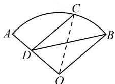
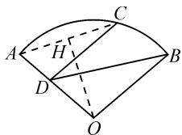
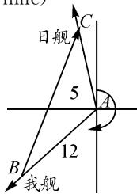
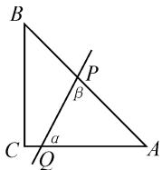
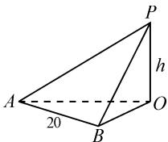

# 运用数学建模解三角形应用题“四法”

# ●广西河池高级中学 农建 韦昌勤

摘要: 数学建模就是把需要解决的问题加以提炼, 转化为某种熟悉的数学模型, 通过明确问题、大胆假设、合理建模、准确求解、仔细分析、严格检验等过程, 最终圆满地解决问题. 本文中结合典型实例, 探讨和总结了运用数学建模解决三角形应用题的四种方法与技巧.

关键词: 添加辅助线法; 构造图形法; 优选变量法; 化归三角法

解三角形在我们日常生活中的应用十分广泛，例如测量、航海、生产、商务、教学等，解三角形的过程中就贯穿着数学建模的思想[1].运用数学建模解题的关键是“转化”.首先要对已知条件进行准确分析，找出其内在联系，以确定选择适合的数学模型；其次要进行合理设计，以确定最佳解题方案并准确求解；最后将结果代回原题进行严格检验，并总结作答.下面通过典型例题来了解和掌握运用数学建模解决三角形应用题的方法与技巧.

# 1 添加辅助线法

解决与三角形有关的应用问题,通常是在理解题意的基础上,画出示意图,通过添加辅助线,将原问题巧妙地转化为解三角形问题,求解过程中经常会用到正弦、余弦定理.

例 1 某市莲湖公园是一个形似扇形 AOB 的荷花池, 其中 A, B 是公园的两个出入口, C, D 是两个供游人休息的凉亭, OA, OB 是池边的两条人行便道, CD 是横穿荷花池且与 BO 平行的一条观景水上廊桥. 经某游客测量得知, 圆心角 $AOB = 120^{\circ}$ , 从 C 沿着 CD 步行到 D 用了 10 min, 从 D 沿着 DA 步行到 A 用了 6 min. 若该游客步行的速度为 50 m/min, 求该荷花池半径 OA 的长(精确到 1 m).

解法 1: 如图 1, 设该扇形的半径为 r, 连接 CO. 由题意, 得 $CD = 50 \times 10 = 500, DA = 50 \times 6 = 300, \angle CDO = 180^{\circ} - 120^{\circ} = 60^{\circ}$ .

在 $\triangle CDO$ 中， $CD^2 + OD^2 - 2 \cdot CD \cdot OD \cdot \cos 60^\circ = OC^2$ ，即$500^{2}+(r-300)^{2}-2\times500\times(r-300)\times\frac{1}{2}=r^{2}$ ，解得 $r=\frac{4\ 900}{11}\approx445(m).$

  
图1

故该荷花池的半径 OA 的长约为 445 m.

解法 2: 如图 2, 连接 AC, 作 $OH \perp AC$ 交 AC 于点H.由题意得, $CD=50\times10=500$ , $DA=50\times6=300,\angle CDA=120^{\circ}.$

在 $\triangle ACD$ 中， $AC^2 = CD^2 + AD^2 - 2 \cdot CD \cdot AD \cdot \cos 120^\circ = 500^2 + 300^2 + 2 \times 500 \times 300 \times \frac{1}{2} = 700^2$ .

  
图 2

解得 $AC=700(m)$ .

所以 $\cos\angle CAD=\frac{AC^{2}+AD^{2}-CD^{2}}{2\cdot AC\cdot AD}=\frac{11}{14}.$

在 Rt△HAO 中，AH = 350， $\cos\angle HAO=\frac{11}{14}$ ，所以 $OA=\frac{AH}{\cos\angle HAO}=\frac{4900}{11}\approx445(m)$ .

故该荷花池的半径的 OA 的长约为 445 m.

方法与技巧:根据题意,结合图形将实际问题转化为解三角形问题.本题通过添加辅助线,把形似扇形的荷花池半径问题转化为解三角形问题,利用正弦、余弦定理简捷地求出三角形的某条边长.

# 2 构造图形法

对于一些较复杂的航海类(包括赶超、追击)问题，在弄清楚速度、路程、距离、方位等各种关系的基础上，可以将其转化为较简单的解斜三角形问题来解决.

例 2 一艘日本舰艇由 A 海岛出发, 沿 $350^{\circ}$ 的方位角航行, 企图窥扰我沿海某渔场, 今测得其航速为 10 n mile/h, 已知我军舰对岛的方位角是 $230^{\circ}$ , 与 A 海岛的距离是 12 n mile, 问我舰要用多大的速度前进, 才能在 0.5 h 内追上日舰? (精确到 1 n mile)

解:根据题意构图(如图3),在点A作方位线, $\angle BAC=350^{\circ}-230^{\circ}=120^{\circ}$ .设经过0.5 h在点C追上日舰,则AB=12, $AC=10\times\frac{1}{2}=5$ .在 $\triangle ABC$ 中,由余弦定理,可得 $BC^{2}=12^{2}+5^{2}-2\times12\times5\times\cos120^{\circ}=229$ ,解得 $BC \approx 15$ (n mile).

text_image

日舰
C
5
A
12
B
我舰

图 3

因为这是 0.5 h 航行的距离, 所以我舰要以大于 30 n mile/h 的速度航行, 才能在 0.5 h 之内追上日舰.

方法与技巧:本题属于航海追击问题,根据题意构建图形(要注意方位线、方位角和我舰与日舰前进的方向),将其转化为解斜三角形问题即可求解.

# 3 优选变量法

对于有些求最值的问题,可以择优选取一个恰当的角或者长度作为变量,把各有关元素表示出来,并构建函数表达式,然后再根据表达式的特征,选用相应的求最值方法完成.

例 3 某公司要悬挂一块直角三角形的铝塑广告牌, 已知 AC 边长 4 m, BC 边长 3 m, 除 A, B, C 三处需要固定外, 还计划沿线段 PQ 用铁丝将其固定, 要求 PQ 把广告牌分成面积相等的两部分, 求 PQ 的最小值.

解法 1: 如图 4, 在 $\triangle APQ$ 中, 由余弦定理, 得

$$
P Q ^ {2} = A P ^ {2} + A Q ^ {2} - 2 A P \cdot A Q \cos A.
$$

由 $S_{\triangle ABC} = \frac{1}{2}\times 4\times 3 = 6$ ，得

$$
S _ {\triangle A P Q} = \frac {1}{2} A P \cdot A Q \cdot \sin A = 3.
$$

因为 $\sin A=\frac{3}{5}$ ，所以可得 $AP\cdot AQ=10$ .

  
图4

又 $\cos A = \frac{4}{5}$ ，所以

$$
P Q ^ {2} = A P ^ {2} + A Q ^ {2} - 2 \times 1 0 \times \frac {4}{5} = A P ^ {2} + A Q ^ {2} -
$$

$$
1 6 \geqslant 2 A P \cdot A Q - 1 6 = 4,
$$

当且仅当 AP=AQ 时, 上式等号成立.

即 $PQ \geqslant 2$ ，所以 PQ 的最小值为 2 m.

解法 2: 如图 4, 由 AC = 4, BC = 3, AB = 5, 得 $S_{\triangle ABC} = 6$ , $S_{\triangle APQ} = 3$ .

选 $\angle AQP=\alpha,\angle APQ=\beta$ 为参变量.

设 $PQ = x$ ，则 $S_{\triangle APQ} = \frac{x^2\sin\alpha\sin\beta}{2\sin(\alpha + \beta)}.$

因为 $\sin(\alpha+\beta)=\sin(\pi-A)=\sin A=\frac{3}{5}$ ，所以由 $\frac{x^{2}\sin\alpha\sin\beta}{2\sin(\alpha+\beta)}=3$ ，得

$$
\begin{array}{l} x ^ {2} = \frac {1 8}{5 \sin \alpha \sin \beta} \\ = \frac {1 8}{\frac {5}{2} [ \cos (\alpha - \beta) - \cos (\alpha + \beta) ]} \\ = \frac {3 6}{5 \cos (\alpha - \beta) + 4}. \\ \end{array}
$$

当 $\alpha=\beta$ 时， $\cos(\alpha-\beta)$ 有最大值 1，此时 $x^{2}$ 有最小值 4，x 有最小值 2.

所以 PQ 的最小值为 2 m.

方法与技巧:本题解法1选取长度为变量,运用余弦定理和三角形面积公式来求解;解法2选取了角度为参变量,运用三角函数和三角形面积公式来求解.这两种解法充分显示了运用优选变量法解决问题的优越性.

# 4 化归三角法

对于某些测量建筑物高度的典型问题,可以依据题意,作出草图帮助分析,最后将其化归为三角形问题来解决.

例 4 某中学准备更换校园内的旗杆, 如图 5, 为了测得它的高度, 先在地面选了一条长 20 m 基线 AB, 然后在基线的端点 A 处测得旗杆顶点的仰角为 $30^{\circ}$ , 又到基线的终点 B 处测得旗杆顶点的仰角为 $45^{\circ}$ ，同时测得 $\angle AOB = 60^{\circ}$ ，试求旗杆的高度（精确到整数部分）.

  
图 5

解: 设旗杆高度为 h, 已知 AB 为 20 m, $\angle OAP = 30^{\circ}$ , $\angle OBP = 45^{\circ}$ , $\angle AOB = 60^{\circ}$ .

在 Rt△AOP 中， $OA = OP \cdot \cot 30^{\circ} = \sqrt{3} h$ .

在 Rt△BOP 中， $OB=OP\cdot\cot45^{\circ}=h$ .

在 Rt△AOB 中，由余弦定理，得 $AB^{2}=OA^{2}+OB^{2}-2OA\cdot OB\cdot\cos\angle AOB$ ，整理得 $400=3h^{2}+h^{2}-\sqrt{3}h^{2}$ ，即 $400=(4-\sqrt{3})h^{2}$ .

所以 $h=\frac{20}{\sqrt{4-\sqrt{3}}}\approx13(m)$ .

故旗杆的高度约为 13 m.

方法与技巧:测量问题其实就是解三角形问题.本题就是典型的测量顶部不能到达的高度问题,我们根据题意画出草图,让旗杆与地面测量基线构成直角,将它化归为直角三角形,最后运用勾股定理和余弦定理求出其直角边即可.

从上述各例题的方法与技巧分析中可以看出,运用数学建模法解三角形应用题,关键是要领会题目中“数”的本质,找准变量之间的关系 $^{[2]}$ ,根据它们之间的相互联系来确定选什么样的三角形为模型;在解模的过程中需要用到哪些相关的性质与定理,除了准确求解,还要进行合理化检验.

# 参考文献：

[1]耿朝霞.数学建模法及应用[J].成才之路,2008(3):48.

[2]钱海涛.一道高三模拟题解法中的数学建模[J].延边教育学院学报,2019(4):159-161.Z