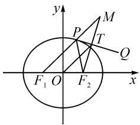
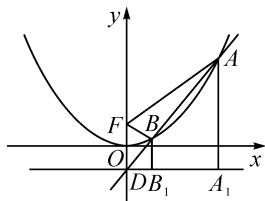
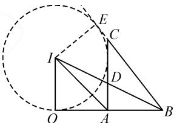
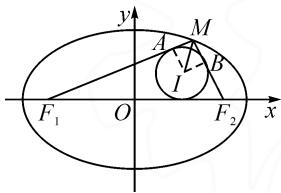
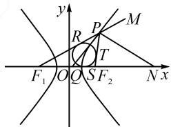

# 高中数学角平分线相关问题的解法探究

# ●南京市金陵中学河西分校 王金辉

摘要: 思维是数学素养的灵魂, 方法是数学学习的法宝. 在高三数学一轮复习中, 不少学生在解决与角平分线有关的解三角形、平面向量和解析几何等问题时, 感觉困难重重, 本文中通过四种常用解法的讲解, 梳理了与角平分线相关的几种题型, 帮助学生建构思维系统, 提升数学核心素养.

关键词:高中数学;核心素养;角平分线

角平分线作为刻画三角形的一个重要要素，在高中数学解三角形、平面向量、解析几何等问题中常有出现。本文中尝试用微专题的方式，从等面积法、向量的线性运算和数量积运算、角平分线的性质和几何对称性等方面展开思考，对学生解决相关问题有明显的指导作用。

# 1 利用等面积法求解角平分线长

在解三角形中,经常遇到与角平分线长度相关的问题,等面积法是一种常用且简便的方法.

例 1 （2022 南京师大附中模拟预测 · 14）在 $\triangle ABC$ 中，AC=2, AB=1，点 D 为 BC 边上的点，AD 是 $\angle BAC$ 的角平分线，则 AD 的取值范围 \_\_\_\_.

分析:本题涉及三角形的两边及夹角,求该角的角平分线长,可以考虑由三个三角形的面积建立等量关系,求出角平分线长度的表达式.

解: 设 $\angle BAD = \angle CAD = \theta$ ，则 $\angle BAC = 2\theta$ ，且 $\theta \in \left(0, \frac{\pi}{2}\right)$ .

由 $S_{\triangle ABD} + S_{\triangle ACD} = S_{\triangle ABC}$ ，得

$$
\frac {1}{2} | A B | \cdot | A D | \cdot \sin \theta + \frac {1}{2} | A C | \cdot | A D | \cdot
$$

$$
\sin \theta = \frac {1}{2} | A B | \cdot | A C | \cdot \sin 2 \theta .
$$

所以 $3 \left| AD \right| \sin \theta = 2 \sin 2\theta$ ，即 $\left| AD \right| = \frac{4 \cos \theta}{3}$ .

故 AD 的取值范围是 $\left(0, \frac{4}{3}\right)$ .

变式 在 $\triangle ABC$ 中, $AC = 2$ , $AB = 1$ , 点 $D$ 为 $BC$ 边上的点, $AD$ 三等分 $\angle BAC$ , $D$ 靠近点 $B$ , 则 $AD$ 的取值范围是 \_\_\_\_.

分析: 将例 1 的平分角改编为三等分角, 依然涉及三角形的两边及夹角, 考虑由三个三角形的面积建立等量关系, 结合二倍角公式和三倍角公式的应用, 求出三等分角的平分线长度的表达式.

解: 设 $\angle ABD = \alpha, \angle ACD = 2\alpha$ ，则 $\angle BAC = 3\alpha$ .
由 $0<3\alpha<\pi$ ，得 $\alpha\in\left(0,\frac{\pi}{3}\right)$ .

由 $S_{\triangle ABD} + S_{\triangle ACD} = S_{\triangle ABC}$ ，得

$$
\frac {1}{2} | A B | \cdot | A D | \cdot \sin \alpha + \frac {1}{2} | A C | \cdot | A D | \cdot
$$

$$
\sin 2 \alpha = \frac {1}{2} | A B | \cdot | A C | \cdot \sin 3 \alpha .
$$

解得 $|AD| = \frac{2\sin 3\alpha}{\sin \alpha + 2\sin 2\alpha} = \frac{2(4\cos^2\alpha - 1)}{1 + 4\cos \alpha}$ .

令 $t=1+4\cos\alpha, t\in(3,5)$ ，则

$$
\mid A D \mid = \frac {1}{2} \left(t - \frac {3}{t} - 2\right).
$$

设 $f(t)=\frac{1}{2}\left(t-\frac{3}{t}-2\right)$ ，则 $f(t)$ 在 $(3,5)$ 单调递增.

又 $t = 3$ 时， $f(3) = \frac{1}{2}\left(3 - \frac{3}{3} - 2\right) = 0; t = 5$ 时， $f(5) = \frac{1}{2}\left(5 - \frac{3}{5} - 2\right) = \frac{6}{5}$ .

所以 AD 的取值范围为 $\left(0, \frac{6}{5}\right)$ .

点评:例1和变式均为等分角的等分线长度相关问题,通过等面积法寻找等量关系,再结合三角函数及解三角形等相关知识解决.当然,如果对两个分角任意赋值,不一定n等分角,但等面积法依然适用,它是这一类问题的常用方法.

# 2 利用角平分线的对称性解题

角的一边上任一点关于角平分线的对称点一定在角的另一条边上.利用这一对称性质可以巧妙解决解析几何中与角平分线相关的一类问题.

例 2 已知三角形的一个顶点 $A(4,-1)$ ，它的两条内角平分线所在的直线方程分别为 $l_{1}:x-y-1=0$ 和 $l_{2}:x-1=0$ ，则 BC 边所在直线的方程为 \_\_\_\_.

分析: 利用三角形的顶点 A 关于另外两个顶点的内角平分线的对称点均在 BC 上, 可求出 BC 上两个点的坐标, 进而求出直线 BC 的方程.

解: 易知点 A 不在 $l_{1}$ 和 $l_{2}$ 上. 因为 $l_{1}, l_{2}$ 为 $\angle B$ , $\angle C$ 的平分线, 所以点 A 关于 $l_{1}, l_{2}$ 的对称点均在 BC

边所在的直线上.

易求得点 A 关于 $l_{1}$ 的对称点为 $A_{1}(0,3)$ ，点 A 关于 $l_{2}$ 的对称点为 $A_{2}(-2,-1)$ .

所以 BC 边所在直线的方程为 $\frac{y-3}{-1-3}=\frac{x-0}{-2-0}$ ，即 $2x-y+3=0$ 。

例 3 （2022 深圳高二期末 · 7）已知 $F_{1}, F_{2}$ 分别为椭圆 $\frac{x^{2}}{4} + \frac{y^{2}}{3} = 1$ 的左、右焦点，P 为椭圆上除左右顶点外的任一点，PT 为 $\triangle F_{1}PF_{2}$ 的外角平分线， $F_{2}T \perp PT$ ，求点 T 的轨迹方程.

分析: 利用三角形的顶点 $F_{2}$ 关于外角平分线的对称点在 $F_{1}P$ 的延长线上, 结合椭圆的定义, 可求出 $MF_{1}$ 为定长, 进而得出中位线 OT 为定长.

解:如图1所示,延长 $F_{2}T$ 交 $F_{1}P$ 的延长线于点M.

因为 PT 为 $\angle F_{1}PF_{2}$ 的外角平分线， $F_{2}T \perp PT$ ，所以由对称性可得 $\left|PF_{2}\right| = \left|PM\right|$ ， $\left|TF_{2}\right| = \left|TM\right|$ .

text_image

y
P
M
T
Q
F₁ O
F₂
x

图 1

由椭圆的定义, 得 $\left|MF_{1}\right|=$ $\left|PF_{1}\right|+\left|PM\right|=\left|PF_{1}\right|+\left|PF_{2}\right|=4.$

又 T 为 $F_{2}M$ 的中点，O 为 $F_{1}F_{2}$ 的中点，所以在 $\triangle F_{1}F_{2}M$ 中， $|OT|=\frac{1}{2}|MF_{1}|=2$ .

故点 T 的轨迹方程是 $x^{2} + y^{2} = 4 (y \neq 0)$ .

点评:对称性是角平分线的重要几何性质,在解三角形和解析几何问题中,利用这个性质,结合圆锥曲线的相关定义,可以解决许多点、直线、圆和圆锥曲线的相关问题.

# 3 利用“三角形内角平分线定理”解题

三角形内角平分线定理: 在 $\triangle ABC$ 中, $\angle A$ 的平分线交 BC 于点 D, 则有 $\frac{BD}{DC} = \frac{AB}{AC}$ . (苏教版高中数学教材必修二第 93 页例 5.)

例 4 [山西吕梁 2022 届高三模拟(一)理·10] 已知抛物线 C: $x^{2}=4y$ 的焦点为 F, C 的准线与对称轴交于点 D, 过 D 的直线 l 与 C 交于 A, B 两点, 且 $\overrightarrow{AB}=m\overrightarrow{BD}(m>0)$ , 若 FB 为 $\angle DFA$ 的角平分线, 则 $|BF|=(\quad)$ .

A.m B. $\frac{2m}{m + 1}$ C. $\frac{2m + 1}{m}$ D. $\frac{m + 1}{2m}$

分析:利用“三角形内角平分线定理”,结合抛物线的定义和相似三角形的相似比,可巧妙地将线段的比例关系梳理清楚,进而问题得到解决.

解: 抛物线 $C: x^{2} = 4y$ ，则 $F(0,1)$ ， $D(0,-1)$ ，所以 $|DF| = 2$ 。过点 A，B 分别作准线的垂线，垂足分别为 $A_{1}, B_{1}$ ，如图 2，则 $BB_{1} \parallel AA_{1}$ 。因为 FB 为 $\angle DFA$

的平分线，则有 $\frac{|AB|}{|BD|}=$ $\frac{|AF|}{|DF|}$ ，又 $\overrightarrow{AB}=m\overrightarrow{BD}$ ，所以 $\frac{|AF|}{|DF|}=\frac{|AB|}{|BD|}=m.$

于是 $|AA_{1}| = |AF| = m|DF| = 2m.$

又 $\frac{\left|BB_{1}\right|}{\left|AA_{1}\right|}=\frac{\left|DB\right|}{\left|DA\right|}=\frac{1}{m+1}$ ，所以

$$
\mid B F \mid = \mid B B _ {1} \mid = \frac {1}{m + 1} \mid A A _ {1} \mid = \frac {2 m}{m + 1}.
$$

故选：B.

text_image

y
A
F
B
O
O
D B₁
A₁
x

图 2

点评:“三角形内角平分线定理”是解决定比分点相关问题的常用知识点,熟练使用这个定理,结合解析几何中圆锥曲线的定义、方程和几何性质,在解决有关解三角形、解析几何等问题时可提速增效.

# 4 利用平面向量解决角平分线相关问题

平面向量作为数学解题的工具,在很多领域有广泛应用.其中,单位向量、向量的数量积不仅是高中数学向量教学的重点和难点,有时在解决三角形的角平分线相关问题时也有巧妙的应用.

例 5 （2022 厦门一中高一阶段测试 · 16）已知 $\triangle ABC, D$ 为线段 AC 上一点，BD 是 $\angle ABC$ 的角平分线，I 为直线 BD 上一点，满足 $\overrightarrow{AI} = \lambda \left( \frac{\overrightarrow{AC}}{|\overrightarrow{AC}|} - \frac{\overrightarrow{AB}}{|\overrightarrow{AB}|} \right) (\lambda > 0)$ ， $|\overrightarrow{CA}| + |\overrightarrow{CB}| = 6, |\overrightarrow{CA} - \overrightarrow{CB}| = 2$ ，则 $\overrightarrow{BI} \cdot \overrightarrow{BA} =$ \_\_\_\_.

分析:两个单位向量的和向量与差向量分别对应以这两个向量所在线段为邻边的菱形的两条对角线,利用菱形对角线互相垂直且平分对角的特征,得到两条角平分线交点为三角形旁心的结论,再结合平面向量数量积的几何意义可破解该题.

解: 如图 3 所示, 由 $\frac{\overrightarrow{AC}}{|\overrightarrow{AC}|}, \frac{\overrightarrow{AB}}{|\overrightarrow{AB}|}$ 为 $\overrightarrow{AC}, \overrightarrow{AB}$ 方向上的单位向量, 易知 AI 是 $\angle BAC$ 外角的角平分线, 又 BD 是 $\angle ABC$ 的角平分线, 即 I 为 $\triangle ABC$ 的旁

text_image

Geometric diagram with labeled points and lines, including a circle and triangle constructions

图3

作 $IO \perp BA$ ，垂足为点 $O$ ，由 $|\overrightarrow{CA}| + |\overrightarrow{CB}| = 6$ ， $|\overrightarrow{CA} - \overrightarrow{CB}| = |\overrightarrow{BA}| = 2$ ，可得 $|\overrightarrow{BO}| = \frac{1}{2}\left(|\overrightarrow{AB}| + |\overrightarrow{AC}| + |\overrightarrow{BC}|\right) = 4.$

由数量积的几何意义,可得

$$
\overrightarrow {B I} \cdot \overrightarrow {B A} = \overrightarrow {B A} \cdot \overrightarrow {B O} = 2 \times 4 \times \cos 0 = 8.
$$

例 6 （山东实验中学 2019 届高三二模理 · 20 改编）设椭圆 $C: \frac{x^{2}}{4} + y^{2} = 1$ 的左、右焦点分别为 $F_{1}, F_{2}$ ，M 为椭圆 C 上异于长轴端点的一点， $\angle F_{1}MF_{2} = 2\theta$ ， $\triangle MF_{1}F_{2}$ 的内心为 I，则 $\overrightarrow{MI} \cdot \overrightarrow{MF_{1}} + \overrightarrow{MI} \cdot \overrightarrow{MF_{2}} =$ \_\_\_\_.

分析:三角形的内心是其角平分线的交点,且过圆外一点作内切圆的两条切线,切线长相等;结合椭圆的定义,可得切线长 $|MA|$ ,再利用平面向量数量积的几何意义,轻松破解.

解:由题意,可得

$$
\left| M F _ {1} \right| + \left| M F _ {2} \right| = 4, \left| F _ {1} F _ {2} \right| = 2 \sqrt {3}.
$$

设圆 I 与 $MF_{1}, MF_{2}$ 分别切于点 A, B, 连接 IA, IB, 如图 4. 根据切线长定理, 可得 $\left|F_{1}F_{2}\right| = \left|F_{1}A\right| + \left|F_{2}B\right| = 2\sqrt{3}$ . 又 $\left|MF_{1}\right| + \left|MF_{2}\right| = 4$ , 所以 $\left|MA\right| = \left|MB\right| = \frac{4 - 2\sqrt{3}}{2} = 2 - \sqrt{3}$ .

text_image

y
A
M
B
I
F₁ O F₂ x

图4

由平面向量数量积的几何意义,可得

$$
\begin{array}{c} \overrightarrow {M I} \cdot \overrightarrow {M F _ {1}} + \overrightarrow {M I} \cdot \overrightarrow {M F _ {2}} = \overrightarrow {M A} \cdot \overrightarrow {M F _ {1}} + \overrightarrow {M B} \cdot \\ \overrightarrow {M F _ {2}} = | M A | \cdot | M F _ {1} | + | M B | \cdot | M F _ {2} | = 4 (2 - \sqrt {3}). \end{array}
$$

点评:结合菱形的对角线平分对角这一特点,可以将“三角形角平分线定理”和向量问题有机结合起来,考查学生综合应用知识的能力;利用三角形内角平分线定理和向量数量积的几何意义,结合解析几何中相关定义、几何性质,对学生的数学综合能力提出了更高的要求.合理构建知识结构,熟练使用常用规律和方法,是解决这类问题的良好途径.

# 5 综合应用

例 7 （湖南衡阳 2022 届高三下学期二模·11）已知 $F_{1}, F_{2}$ 分别是双曲线 $C: x^{2} - \frac{y^{2}}{2} = 1$ 的左、右焦点，点 P 为 C 在第一象限上的点，点 M 在 $F_{1}P$ 的延长线上，点 Q 的坐标为 $\left(\frac{\sqrt{3}}{3}, 0\right)$ ，且 PQ 为 $\angle F_{1}PF_{2}$ 的平分线，则下列正确的是（）.

$$
\mathrm{A.} \frac {\left| P F _ {1} \right|}{\left| P F _ {2} \right|} = 2
$$

B. $\angle F_{2}PM$ 的角平分线所在直线的倾斜角为 $150^{\circ}$

C. $\triangle F_{1}PF_{2}$ 的内心坐标为 $(1,\sqrt{2}-1)$

D.PQ 与双曲线相切

解: 在双曲线 C 中, $a=1, b=\sqrt{2}$ , 则 $c=\sqrt{3}$ .

因为 $F_{1}(-\sqrt{3},0), F_{2}(\sqrt{3},0)$ ，所以

$$
\mid Q F _ {1} \mid = \frac {4 \sqrt {3}}{3}, \mid Q F _ {2} \mid = \frac {2 \sqrt {3}}{3}.
$$

于是 $\frac{|PF_{1}|}{|PF_{2}|}=\frac{|QF_{1}|}{|QF_{2}|}=2$ ，故选项A正确.

由 $\left\{\begin{aligned}|PF_{1}|&=2\mid PF_{2}\mid,\\ |PF_{1}|-\mid PF_{2}|&=2,\end{aligned}\right.$ 得 $\left\{\begin{aligned}|PF_{1}|&=4,\\ |PF_{2}|&=2.\end{aligned}\right.$

设点 P 的坐标为 $(x_{0}, y_{0})(x_{0} > 0, y_{0} > 0)$ ，则由 $\left\{\begin{aligned}x_{0}^{2}-\frac{y_{0}^{2}}{2}&=1,\\ (x_{0}-\sqrt{3})^{2}+y_{0}^{2}&=4,\end{aligned}\right.$ 解得 $\left\{\begin{aligned}x_{0}&=\sqrt{3},\\ y_{0}&=2.\end{aligned}\right.$

如图 5, 设 $\angle F_{2}PM$ 的角平分线交 x 轴于点 N, 则得到 $\angle QPF_{2} + \angle NPF_{2} = \frac{1}{2} \cdot (\angle F_{1}PF_{2} + \angle F_{2}PM) = 90^{\circ}$ , 所以 $PN \perp PQ$ .

text_image

y
R
P
M
T
F₁ O Q S F₂ N x

图5

由 $k_{PQ} = \sqrt{3}$ ，可得 $k_{PN} = -\frac{1}{k_{PQ}} = -\frac{\sqrt{3}}{3}$ 所以 $\angle F_2PM$ 的角平分线所在直线的倾斜角为 $150^{\circ}$ ，故选项B正确.

设 $\triangle F_{1}PF_{2}$ 的内切圆 $H$ 与三边分别切于点 $R, S, T$ , 如图5, 由内切圆性质, 得 $|PR| = |PT|$ , $|RF_{1}| = |F_{1}S|$ , $|F_{2}T| = |F_{2}S|$ , 则 $|PF_{1}| - |PF_{2}| = |SF_{1}| - |SF_{2}| = 2a$ .

设 $H(x_0,y_0)$ ，则 $S(x_0,0),|SF_1| - |SF_2| = [x_0 - (-\sqrt{3})] - (\sqrt{3} -x_0) = 2x_0 = 2a.$

所以 $x_{0}=a=1$ ，即 $H(1,y_{0})$ ，代入直线 PQ 的方程 $y=\sqrt{3}x-1$ 中，得 $H(1,\sqrt{3}-1)$ ，故选项 C 错误.

联立 $\left\{ \begin{array}{l} y = \sqrt{3} x - 1, \\ x^2 - \frac{1}{2} y^2 = 1, \end{array} \right.$ 得 $x^2 - 2\sqrt{3} x + 3 = 0$ . 由 $\Delta = 0$ 可知，直线 $PQ$ 与双曲线相切，故选项D正确.

故选: ABD.

点评:该题综合应用“角平分线定理”、内外角平分线互相垂直的性质研究了双曲线的焦点三角形内心的特点,验证了圆锥曲线的光学性质——从双曲线的一个焦点发出的光线,经双曲线反射后,反射光线的反向延长线过双曲线的另一个焦点.由此可得,过双曲线上任意一点的切线,平分该点与两焦点连线的夹角.本题综合性较强,是圆锥曲线中融合角平分线问题的典型例子.

在新高考背景下,新课程强调对学生核心素养的培养.在高三数学一轮复习中,通过穿插微专题的方式,针对三角形角平分线的相关问题,深入探讨相关题型,多视角、多策略地处理一类问题,可以调动学生学习的积极性,帮助学生发现一类问题的解决方向和策略,构建完整的知识系统,从而培养学生良好的思维品质,提高分析问题和解决问题的能力. Z