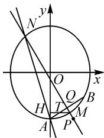

# 高观点下的高考数学试题研究

# ●北京师范大学贵阳附属中学 张兴

摘要:以近几年高考数学中的压轴题为例,从“高观点”的角度分析这类题目命制背景、解题思路,以此突出“高观点”的思维在解决高考压轴题中的优势.

关键词: 高考数学; 高观点; 解题思路

高考作为高等学校选拔人才的主要形式,数学在高考中发挥着基础学科的独特作用,它是衡量一个人思维能力的重要学科.纵观近几年的高考试题,经常从高等数学的背景命题来考查学生的数学知识和思维能力,这类题目往往就成为了压轴题,学生的得分率通常比较低.掌握这类题目的命制背景,对广大高三师生的备考复习显得至关重要.

# 1 “高观点”的概念界定

本文中的“高观点”是指运用高等数学和现代数学的经典知识、方法和思想去分析、解决初等数学问题的思路和策略，不追求严谨的推理与证明，突出高等数学的思想和方法。

# 2 “高观点”下的高考试题

# 2.1 以洛必达法则为背景

例 1 （2018 年全国高考数学Ⅱ理科第 21 题）已知函数 $f(x)=\mathrm{e}^{x}-ax^{2}$ .

(1) 若 a=1，证明：当 $x \geqslant 0$ 时， $f(x) \geqslant 1$ ;  
(2) 若 $f(x)$ 在 $(0, +\infty)$ 只有一个零点，求 a.

解析:(1)当 a=1 时, $f(x)\geqslant1$ 等价于 $\frac{e^{x}}{x^{2}+1}\geqslant1$ .

设 $g(x)=\frac{\mathrm{e}^{x}}{x^{2}+1}-1$ , 则 $g'(x)=\frac{\mathrm{e}^{x}(x-1)^{2}}{(x^{2}+1)^{2}}$

所以 $g'(x) \geqslant 0$ ，当且仅当 x = 1 时等号成立，则 $g(x)$ 在 $(0, +\infty)$ 单调递增。而 $g(0) = 0$ ，故当 $x \geqslant 0$ 时， $g(0) \geqslant 0$ ，即 $f(x) \geqslant 1$ 。

(2) $f(x)$ 在 $(0,+\infty)$ 只有一个零点，当且仅当 $f(x)=0(x>0)$ ，即 $e^{x}-ax^{2}=0(x>0)$ 只有一个实数根.

显然 $x = 0$ 不是 $f(x)$ 的零点，故可转化为方程 $\frac{\mathrm{e}^x}{x^2} = a(x > 0)$ 只有一个实根.

令 $h(x) = \frac{\mathrm{e}^x}{x^2}$ ，则问题等价于当函数 $h(x)$ 的图象与直线 $y = a$ 只有一个交点时，求 $a$ 的值.

由 $h'(x)=\frac{\mathrm{e}^{x}x^{2}-2\mathrm{e}^{x}x}{x^{4}}=\frac{\mathrm{e}^{x}}{x^{3}}(x-2)$ ，可知当 $x\in$

(0,2)时, $h'(x)<0$ ;当 $x\in(2,+\infty)$ 时, $h'(x)>0$ .所以 $h(x)$ 在(0,2)上单调递减,在 $(2,+\infty)$ 上单调递增.故 $h(2)=\frac{\mathrm{e}^{2}}{4}$ 是 $h(x)$ 在 $(0,+\infty)$ 的最小值.

当 $x \to 0$ 时， $x^2 \to 0, \mathrm{e}^x \to 1$ ，则 $h(x) \to +\infty$ .

又 $\lim_{x\to +\infty}\frac{\mathrm{e}^x}{x^2} = \lim_{x\to +\infty}\frac{\mathrm{e}^x}{2x} = \lim_{x\to +\infty}\frac{\mathrm{e}^x}{2} = +\infty .$

所以，当 $a < \frac{e^{2}}{4}$ ， $h(x)$ 与 y = a 无交点；

当 $a = \frac{\mathrm{e}^2}{4}, h(x)$ 与 $y = a$ 只有一个交点；

当 $a > \frac{\mathrm{e}^2}{4}, h(x)$ 与 $y = a$ 有两个交点.

综上， $f(x)$ 在 $(0, +\infty)$ 只有一个零点时， $a = \frac{e^{2}}{4}$ .

评析:第(2)问的解题思路有好几种,如果运用初等数学的思想和方法,需要对参数a进行分类讨论,但是分类讨论对大多数高中生来说是一个难点.因此,在“高观点”的角度下只需要学生对洛必达法则有一定认识就可以掌握,整个思路严谨连贯,顺理成章.

# 2.2 以拉格朗日中值定理为背景

例 2 （2018 年全国高考数学 I 理科第 21 题）已知函数 $f(x)=\frac{1}{x}-x+a\ln x$ .

(1) 讨论 $f(x)$ 的单调性；

(2) 若 $f(x)$ 存在两个极值点 $x_{1}, x_{2}$ ，证明： $\frac{f(x_{1})-f(x_{2})}{x_{1}-x_{2}}<a-2.$

解析:(1) $f(x)$ 的定义域为 $(0,+\infty)$ ，且

$$
f ^ {\prime} (x) = - \frac {1}{x ^ {2}} - 1 + \frac {a}{x} = - \frac {x ^ {2} - a x + 1}{x ^ {2}}.
$$

(i) 若 $a \leqslant 2$ ，则 $f'(x) \leqslant 0$ ，当且仅当 $a = 2, x = 1$ 时 $f'(x) = 0$ ，所以 $f(x)$ 在 $(0, +\infty)$ 单调递减.

(ii) 若 $a > 2$ ，令 $f'(x) = 0$ ，得 $x = \frac{a \pm \sqrt{a^2 - 4}}{2}$ .

当 $x \in \left(0, \frac{a - \sqrt{a^2 - 4}}{2}\right) \cup \left(\frac{a + \sqrt{a^2 - 4}}{2}, +\infty\right)$

时， $f'(x) < 0$ ; 当 $x \in \left( \frac{a - \sqrt{a^2 - 4}}{2}, \frac{a + \sqrt{a^2 - 4}}{2} \right)$ 时， $f'(x)>0.$

故函数 $f(x)$ 在 $\left(\frac{a - \sqrt{a^2 - 4}}{2},\frac{a + \sqrt{a^2 - 4}}{2}\right)$ 上单调递增，在 $\left(0,\frac{a - \sqrt{a^2 - 4}}{2}\right)$ 上单调递减.

(2)根据拉格朗日中值定理可知,若函数 $f(x)$ 在闭区间 $[a,b]$ 上连续,且在开区间 $(a,b)$ 内可导,则在 $(a,b)$ 内至少存在一点 $\xi$ ,使得 $f'(\xi)=\frac{f(b)-f(a)}{b-a}$ 成立.

由(1)知， $f(x)$ 存在两个极值点，当且仅当 a>2.

不妨设 $f(x)$ 的两个极值点 $x_{1}, x_{2}$ 满足 $x_{1} < x_{2}$ . 因为 $f(x)$ 在区间 $[x_{1}, x_{2}]$ 上连续，在区间 $(x_{1}, x_{2})$ 内可导，所以存在 $\xi \in (x_{1}, x_{2})$ ，使得 $f'(\xi) = \frac{f(x_{1}) - f(x_{2})}{x_{1} - x_{2}}$ . 因此只需证明 $f'(\xi) < a - 2$ .

令 $g(\xi) = f'(\xi) = -\frac{1}{\xi^2} - 1 + \frac{a}{\xi}$ , 则

$$
g ^ {\prime} (\xi) = \frac {2}{\xi^ {3}} - \frac {a}{\xi^ {2}} = \frac {2 - a \xi}{\xi^ {3}}.
$$

当 $\xi<\frac{2}{a}$ 时， $g'(\xi)>0$ ，函数 $g(\xi)$ 为增函数；

当 $\xi > \frac{2}{a}$ 时， $g'(\xi) < 0$ ，函数 $g(\xi)$ 为减函数。

所以 $g(\frac{2}{a})=\frac{(a+2)(a-2)}{4}$ 为函数 $g(\xi)$ 在区间 $[x_{1},x_{2}]$ 上的最大值.

又因为 a > 2，所以 $\frac{a + 2}{4} > 1$ 。故 $g(\xi) < a - 2$ ，即 $f'(\xi) < a - 2$ 。

所以 $\frac{f(x_{1})-f(x_{2})}{x_{1}-x_{2}}<a-2.$

评析:本题第(1)问比较常规,考查运用导数研究函数的单调性,只要合理进行分类讨论就可以解决问题;第(2)问是函数与不等式的有机融合,解答思路比较广阔,可以充分去想象,但是需要打破常规思路,利用化归与转化的思想将不等式的证明转化为单变量函数进行研究,这对很多学生来说很难想到.但是,如果了解拉格朗日中值定理,就可以将不等式的证明转化为拉格朗日中值定理进行求解,思路清晰、计算量小,容易理解.

# 2.3 以泰勒展开式为背景

例 3 （2022 年全国高考甲卷数学理科第 12 题）
已知 $a=\frac{31}{32}$ , $b=\cos\frac{1}{4}$ , $c=4\sin\frac{1}{4}$ ，则（）.

$$
\mathrm{A.} c > b > a
$$

$$
\mathrm{B}. b > a > c
$$

$$
\mathrm{C.} a > b > c \quad \mathrm{D.} a > c > b
$$

该题若将目光转向“泰勒公式”—— $\cos x = 1 - \frac{x^2}{2!} + \frac{x^4}{4!} - \frac{x^6}{6!} + \cdots\cdots, \sin x = x - \frac{x^3}{3!} + \frac{x^5}{5!} - \frac{x^7}{7!} + \cdots\cdots,$ 则可以快速判断.

解析:由泰勒公式,易知 $b=\cos\frac{1}{4}=1-\frac{1}{4^{2}\times2!}+\frac{1}{4^{4}\times4!}-\cdots>1-\frac{1}{32}=\frac{31}{32}=a$ , 即 b>a;

$c=4\sin\frac{1}{4}=4\left(\frac{1}{4}-\frac{1}{4^{3}\times6}+\frac{1}{4^{5}\times5!}-\cdots\cdots\right)>$ $4\left(\frac{1}{4}-\frac{1}{4^{3}\times6}\right)=1-\frac{1}{6\times16}>1-\frac{1}{2\times16}=a$ ，即c>a；

因为 $\frac{c}{b}=4\tan\frac{1}{4}>4\times\frac{1}{4}=1$ ，所以c>b.

综上 $c > b > a$

评析:此题如果运用高中数学知识求解,对学生的综合能力要求比较高,需要具备一定的视野.其实,泰勒公式对学生并不陌生,在人民教育出版社2019版普通高中教科书数学必修第一册第256页第26题已经提到英国数学家泰勒发现了公式 $\sin x=x-\frac{x^{3}}{3!}+\frac{x^{5}}{5!}-\frac{x^{7}}{7!}+\cdots\cdots,\cos x=1-\frac{x^{2}}{2!}+\frac{x^{4}}{4!}-\frac{x^{6}}{6!}+\cdots\cdots$ ,其中 $n!=1\times2\times3\times4\times\cdots\cdots\times n$ .

例 4 （2020 年全国高考数学 I 理科第 21 题）已知函数 $f(x)=\mathrm{e}^{x}+ax^{2}-x$ .

(1) 当 a=1 时, 讨论 $f(x)$ 的单调性;  
(2) 当 $x \geqslant 0$ 时, $f(x) \geqslant \frac{1}{2}x^{3} + 1$ , 求 a 的取值范围.

解析:(1)略

(2) 当 $x \geqslant 0$ 时, $f(x) \geqslant \frac{1}{2} x^3 + 1$ 等价于

$$
\mathrm{e} ^ {x} - \frac {1}{2} x ^ {3} - x - 1 \geqslant - a x ^ {2}. \tag {①}
$$

(i) 当 x=0 时, 不等式①恒成立, 即 $a \in R$ ;  
(ii) 当 x > 0 时，有 $\frac{e^{x}}{x^{2}} - \frac{1}{2}x - \frac{1}{x} - \frac{1}{x^{2}} \geqslant -a$ .

令 $g(x)=\frac{\mathrm{e}^{x}}{x^{2}}-\frac{1}{2}x-\frac{1}{x}-\frac{1}{x^{2}}(x>0)$ ，则

$$
\begin{array}{l} g ^ {\prime} (x) = \frac {2 \mathrm{e} ^ {x} (x - 2) - x ^ {3} + 2 x + 4}{2 x ^ {3}} \\ = \frac {2 \mathrm{e} ^ {x} (x - 2) - (x - 2) \left(x ^ {2} + 2 x + 2\right)}{2 x ^ {3}} \\ = \frac {(x - 2) (2 \mathrm{e} ^ {x} - x ^ {2} - 2 x - 2)}{2 x ^ {3}}. \\ \end{array}
$$

由泰勒公式有 $e^{x}=1+x+\frac{x^{2}}{2!}+\frac{x^{3}}{3!}+\cdots\cdots\frac{x^{n}}{n!}+o(x^{n})$ ，得 $e^{x}-1-x-\frac{x^{2}}{2!}=\frac{x^{3}}{3!}+\cdots\cdots\frac{x^{n}}{n!}+o(x^{n})$ .

显然 $\mathrm{e}^x - 1 - x - \frac{x^2}{2} > 0$ ，则 $2\mathrm{e}^x - 2 - 2x - x^2 > 0$ .

所以当 $x \in (0,2)$ 时， $g'(x) < 0$ ；当 $x \in (2, +\infty)$ 时， $g'(x) > 0$ 。

故函数 $g(x)$ 在 $(0,2)$ 上单调递减，在 $(2,+\infty)$ 上单调递增.

所以 $g(2)=\frac{\mathrm{e}^{2}-7}{4}$ 为函数 $g(x)$ 在区间 $(0,+\infty)$ 上的最小值.于是 $-a\leqslant\frac{e^{2}-7}{4}$ ，即 $a\geqslant\frac{7-e^{2}}{4}$ .

综上,实数 a 的取值范围为 $\left[\frac{7-\mathrm{e}^{2}}{4},+\infty\right)$ .

评析:根据泰勒公式 $e^{x}=1+x+\frac{x^{2}}{2!}+\frac{x^{3}}{3!}+\cdots\cdots$ $\frac{x^{n}}{n!}+o(x^{n})$ ，可得 $e^{x}-1-x=\frac{x^{2}}{2!}+\frac{x^{3}}{3!}+\cdots\cdots+\frac{x^{n}}{n!}+o(x^{n})$ 。当 x>0 时，等式两边同时除以 $x^{2}$ ，可得 $\frac{e^{x}-1-x}{x^{2}}=\frac{1}{2}+\frac{x}{6}+\cdots\cdots$ ，令 $h(x)=\frac{e^{x}-1-x}{x^{2}}$ ，则函数 $h(x)$ 在 x=2 处的切线方程为 $y=\frac{1}{2}x+\frac{e^{2}-7}{4}$ 。通过 Geogebra 软件画出函数 $h(x)$ 的图象和在 x=2 处的切线，发现函数 $h(x)$ 的图象恒在切线 $y=\frac{1}{2}x+$ $\frac{\mathrm{e}^2 - 7}{4}$ 的上方（如图1），也即 $\frac{\mathrm{e}^x - 1 - x}{x^2} \geqslant \frac{1}{2} x + \frac{\mathrm{e}^2 - 7}{4}$ ，变形得 $\mathrm{e}^x \geqslant \frac{1}{2} x^3 + \frac{\mathrm{e}^2 - 7}{4} x^2 + x + 1.$ 我们把$\frac{\mathrm{e}^2 - 7}{4}$ 换为 $a$ ，则 $\mathrm{e}^x \geqslant \frac{1}{2} x^3 + ax^2 + x + 1.$ 这就是本题的来源背景.事实上，通过分析新课改以来的高考导数解答题，发现大多数题目的命制背景都是泰勒展开式，因此了解泰勒展开式的知识，可以避免转太多的弯路，从而快速找到解题的思路.

# 2.4 以极点、极线为背景

例 5 （2022 年全国高考数学乙卷理科第 20 题）已知椭圆 E 的中心为坐标原点，对称轴为 x 轴、y 轴，且过 A(0, -2)，B( $\frac{3}{2}$ , -1) 两点.

(1) 求 E 的方程；

(2)设过点 $P(1,-2)$ 的直线交 E 于 M, N 两点，过 M 且平行于 x 轴的直线与线段 AB 交于点 T，点 H 满足 $\overrightarrow{MT} = \overrightarrow{TH}$ . 证明：直线 HN 过定点.

评析：(1) 设出椭圆的一般方程 $mx' + ny' = 1$ (m, n > 0)，再将点 A, B 坐标代入方程，即可求出椭

圆的方程.

(2) 本题的背景就是椭圆的极点和极线理论. 如图 2, 因为点 $P(1, -2)$ 对应的极线为 $l: \frac{x}{3} + \frac{(-2)y}{4} = 1$ , 即 $2x - 3y = 6$ , 即为直线 $AB$ . 过点 $P$ 的直线与椭圆交于 $M, N$ 两点, 则 $P, M, N$ 以及 $AB$ 所在的直线与 $MN$ 所在的直线的交点 $Q$ 构成一组调和

text_image

y
N
O
x
H
T
Q
B
M
A
P

图2

点列，在直线外取一点 A，则直线 AP, AM, AQ, AN 构成一族调和线束。因为 AP // MH，则 MH 与三条直线 AM, AT, AH 交于三点，且 T 为 M, H 中点，因此可以推断 AM, AT, AH 也为一簇调和线束，则有 AN, AH 共线，所以直线恒过点 A。故直线 HN 过点 $(0, -2)$ 。

近年来,高考数学中的很多圆锥曲线的试题的背景可以归结为极点极线理论,因此掌握一些极点极线的知识,可以从“高观点”的角度看待圆锥曲线的有关问题,更容易抓住问题的本质.虽然在书写解答过程时不能直接用相关的结论,但是可以先猜出结果,然后用初等数学的方法书写解答过程,这种先猜再证的想法是比较常见的.

# 3 教学建议

高中数学承载着立德树人、为国育才之责，对很多学生来说，是一门学不懂的科目。作为一线教师，我们有义务反思我们的教学，让每一位学生都获得应有的数学教育。《普通高中数学课程标准（2017年版2020年修订）》强调要教给学生真正的数学[1]，题海战术和机械记忆只会加重学生学习数学的负担，对培养数学学科核心素养毫无帮助；只有教师抓住了数学的本质，让学生知道知识点的来龙去脉，编织知识的网络，才能教给学生真正的数学。近几年的高考压轴题呈现出起点高、落点低的特征，试题的背景源于高等数学，但运用高中所学的数学知识和方法就可以解决。站在“高观点”的角度去看待高中数学知识和方法，会看得更远更透。一线教师了解一些“高观点”的知识和方法，可以达到登高望远，以较高的观点去看待高考题目的效果，有利于中学数学的教学，并没有任何将高等数学引进高考的误导[2]。学生了解一些“高观点”的知识和方法，可以快速找到题目的证明方向或猜出答案，再运用初等数学的知识和方法完善解答过程，缩短思考时间，提高解题效率。

# 参考文献：

[1]中华人民共和国教育部.普通高中数学课程标准(2017年版2020年修订)[S].北京:人民教育出版社,2020.

[2]白志锋. 评析高考数学试题中的高观点题[J]. 数学通报, 2002(8):37-39. Z