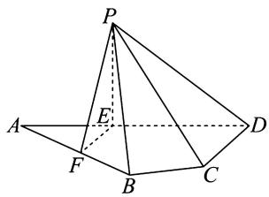
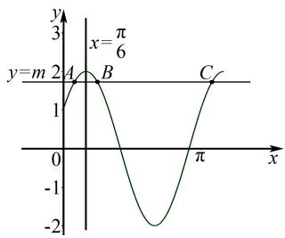
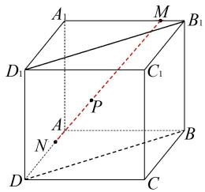
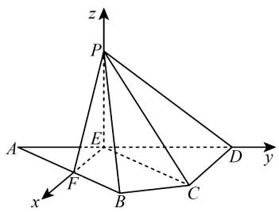

# 2025 年高考数学模拟卷(一)

# 李鸿昌

(北京师范大学贵阳附属中学, 贵州 贵阳 550081)

中图分类号：G632

文献标识码:A

文章编号:1008-0333(2025)13-0053-10

# 第Ⅰ卷(选择题)

# 一、选择题(本题共8小题,每小题5分,共40分.在每小题给出的四个选项中,只有一项是符合题目要求的)

1. 已知集合 $A = \{x \mid -1 \leqslant x \leqslant 3\}$ , $B = \{x \mid x \leqslant 0, x \in \mathbf{Z}\}$ , 则 $A \cap B = (\quad)$ .

A. $[-1,0]$

B. $\{0,1,2,3\}$

C. $[0,3]$

D. $\{-1,0\}$

2. 复数 $Z = \frac{1 + i}{i}$ 的实部为().

A. 1

B. -1

C. 0

D. i

3. 已知向量 $\boldsymbol{a}=(1,2)$ , $\boldsymbol{b}=(2,x^{2})$ ，则“ $(\boldsymbol{a}+\boldsymbol{b})$ // $(\boldsymbol{a}-\boldsymbol{b})$ ”是“x=2”的（）.

A. 充分不必要条件

B. 必要不充分条件

C. 充要条件

D. 既不充分也不必要条件

4. 已知数列 $\{a_{n}\}$ 的前 n 项和 $S_{n}=n^{2}+n$ ，则 $a_{3}=(\quad)$ .

A. 6

B. 11

C. 12

D. 2

5. 为了解某学校学生每周阅读课外书籍的数量,采用样本量比例分配的分层随机抽样方法. 现抽取高一学生 20 人,其每周阅读课外书籍数量的均值

为4本,方差为4;抽取高二学生30人,其每周阅读课外书籍数量的均值为3本,方差为2.则该学校高一高二学生每周阅读课外书籍数量的总体均值和方差分别是().

A. 总体平均数为 3.4 本, 总体方差为 3.24  
B. 总体平均数为 3.5 本, 总体方差为 3.04  
C. 总体平均数为 3.4 本, 总体方差为 3.04  
D. 总体平均数为 3.5 本, 总体方差为 3.24

6. 已知 F 为双曲线 $C: \frac{x^{2}}{a^{2}} - \frac{y^{2}}{b^{2}} = 1 (a > 0, b > 0)$ 的右焦点, A, B 是双曲线 C 上两点且满足 $\overrightarrow{FA} = 4\overrightarrow{FB}, |AB| = 3b$ , 则双曲线 C 的离心率为().

A. $\frac{7}{5}$

B. $\frac{7\sqrt{5}}{5}$

C. $\frac{\sqrt{55}}{3}$

D. $\frac{\sqrt{73}}{3}$

7. 若直线 y = m 与曲线 $f(x) = 2\sin\left(2x + \frac{\pi}{6}\right)$ ， $x \in [0, \frac{7\pi}{6}]$ . 从左往右仅相交于 A, B, C 三点，且 $5|AB| = |BC|$ ，则实数 m 的值为（）.

A. $\frac{\sqrt{2}}{2}$

B. $\sqrt{2}$

C. $\sqrt{3}$

D. $\frac{\sqrt{3}}{2}$

8. 若对任意 $x \in [e, +\infty)$ ，满足 $e^{-\frac{m}{x^{2}}}\ln x - \frac{m}{x^{3}} \geqslant 0$ 恒成立，则实数 m 的取值范围是( ).

A. $(-∞,e]$

B. $(-∞,e^{2}]$

C. $\left[e^{2},+\infty\right)$

D. $[e, +\infty)$

二、选择题(本题共3小题,每小题6分,共18分.在每小题给出的选项中,有多项符合题目要求.全部选对的得6分,部分选对的得部分分,有选错的得0分)

9. 直线 $l:2x+y=5$ 与圆 $O:x^{2}+y^{2}=25$ 交于 A, B 两点, 则下列说法正确的是().

A. 点 O 到直线 l 的距离为 $\sqrt{5}$

B. 线段 $\left|AB\right|=4\sqrt{5}$

C. $\cos \angle AOB = -\frac{3}{5}$

D. $\triangle OAB$ 的面积是 20

10. 已知 $a, b > 0$ ，且 $a + b = 1$ ，则下列说法正确的是（ ）.

A. ab 的最大值是 $\frac{1}{4}$

B. $a^2 + b^2$ 的最大值是 $\frac{1}{2}$

C. $\frac{1}{a} + \frac{1}{b}$ 的最小值是 4

D. $\sqrt{a} + \sqrt{b}$ 的最小值是 $\sqrt{2}$

11. 已知点 $P_{1}(3\sqrt{3},3)$ 在抛物线 $C: y^{2} = \sqrt{3}x$ 上，按照如下方法依次构造点 $P_{n}(n=1,2,3,4,\cdots)$ ，过点 $P_{n}$ 作斜率为 $-3\sqrt{3}$ 的直线与抛物线 C 交于另一点 $Q_{n}$ ，令 $P_{n+1}$ 为 $Q_{n}$ 关于 x 轴的对称点，记 $P_{n}$ 的坐标为 $(x_{n},y_{n})$ 。则（）.

A. 数列 $\{x_{n}\}$ 是等差数列

B. 数列 $\{y_{n}\}$ 是等差数列

C. $\triangle P_{n}P_{n+1}P_{n+2}$ 的面积为 $\frac{\sqrt{3}}{81}$

D. 抛物线 $C$ 上存在一点 $T$ , 使得 $\triangle TP_{n}Q_{n}$ 为等边三角形

# 第Ⅱ卷(非选择题)

# 三、填空题(本题共3小题,每题5分,共15分)

12. 已知数列 $\{a_{n}\}$ 满足 $a_{1} + 2a_{2} + 2^{2}a_{3} + \cdots$

$+2^{n-1}a_{n}=2n-2$ , 则 $a_{n}=$ \_\_\_\_.

13. 写出一个满足下列条件的函数(答案不唯一,可以任填一个)\_\_\_\_.

① $f(-x) = -f(x)$

② $f(\pi + x) = f(x)$

③ $|f(x)|\leqslant2$

14. 已知正方体 $ABCD - A_{1}B_{1}C_{1}D_{1}$ 的棱长为 3，点 M 在 $A_{1}B_{1}$ 上运动，点 N 在棱 AD 上运动，MN 上有一点 P 满足 $\overrightarrow{MP} = 2\overrightarrow{PN}$ ，且 $MN = 3\sqrt{2}$ ，则动点 P 到平面 $B_{1}D_{1}DB$ 距离的最小值为 \_\_\_\_

# 四、解答题(本题共5小题,共77分. 解答应写出文字说明、证明过程或演算步骤.)

15. (13 分) 在 $\triangle ABC$ 中, 角 A, B, C 所对的边分别为 a, b, c, 且 $a \sin A + b \sin C = c \sin C + b \sin B$ .

(1) 求角 A 的大小;

(2) 求 $\sin B + \sin C$ 的取值范围.

16. (15 分) 如图 1, 平面四边形 ABCD 中, AB = 8, $CD = 3\sqrt{3}$ , ED = 9, $\angle ADC = 90^{\circ}$ , $\angle BAD = 30^{\circ}$ , 点 E, F 满足 $\overrightarrow{AE} = \frac{2}{3}\overrightarrow{ED}$ , $\overrightarrow{AF} = \frac{\sqrt{3}}{2}\overrightarrow{AB}$ , 将 $\triangle AEF$ 沿 EF 翻折至 $\triangle PEF$ , 使得 PC = 12.

text_image

Geometric diagram of a pyramid with labeled vertices and internal points, used in spatial geometry problems.

图1 第16题图

(1) 证明: $EF \perp PD$ ;
(2) 求直线 CD 与平面 PBF 所成角的余弦值.

17. (15 分) 已知函数 $f(x) = (x + a)\ln x - 2(x - 1)$ .

(1) 若 a=1，求 $f(x)$ 的单调区间；
(2) 当 x > 1 时, $f(x) > 0$ , 求 a 的取值范围.

18. (17 分) 已知椭圆 $\Gamma: \frac{x^2}{a^2} + \frac{y^2}{b^2} = 1 (a > b > 0)$

上的一点 P 向 x 轴作垂线, 垂足恰为右焦点 $F_{2}$ . 椭圆 $\Gamma$ 与 x 轴负半轴的交点为 A, 与 y 轴正半轴的交点为 B, 且 $AB \parallel OP$ (O 为坐标原点), $|F_{2}A| = 2 + 2\sqrt{2}$ .

(1)求椭圆的方程;

(2) 经过点 $(-2,0)$ 的直线 l 与椭圆 $\Gamma$ 相交于 C, D 两点, 点 P 到直线 l 的距离为 $2\sqrt{3}$ , 求 $\triangle PCD$ 的面积;

(3) 若椭圆 $\Gamma$ 上任意三点 $E, F, G$ 满足 $AB \parallel EF, BP \parallel FG$ , 且点 $F$ 在第四象限, 求证: $AG \parallel PE$ .

19.(17分)错排问题最早由伯努利与欧拉系统研究,历史上称为伯努利—欧拉的装错信封问题.现在定义错排数 $F(n,m)$ 为将编号为1,2,3,…,n共n个小球放入编号为1,2,3,…,n共n个盒子中,每个盒子中恰有一个小球,其中有m个小球不在其对应的盒子中的情况数(编号为i的小球对应的盒子为编号为i的盒子, $i\in N^{*},1\leqslant i\leqslant n$ ).容易得到, $F(1,1)=0,F(2,2)=1,F(3,3)=2$ ,规定 $F(0,0)=1$ .

(1) 计算 $F(4,4)$ , $F(5,5)$ .

(2) 在概率论和统计学中用协方差来衡量两个变量的总体误差, 对于离散型随机变量 X, Y, 定义协方差为 $\operatorname{Cov}(X, Y) = E\{[X - E(X)] [Y - E(Y)]\}$ . 当 n = 4 时, 记所放小球号码与盒子号码相同的个数为 X, 不同的个数为 Y, 求证: $\operatorname{Cov}(X, Y) < 0$ , 并结合实例, 解释协方差的实际含义.

(3)定义错排概率 $P(n,m)$ 为随机将编号为 1, 2, 3, …, n 共 n 个小球放入编号为 1, 2, 3, …, n 共 n 个盒子中, 其中有 m 个小球不在其对应的盒子中的概率, 证明: $P(n,m)=\frac{1}{(n-m)!}\cdot\sum_{i=0}^{m}\frac{(-1)^{i}}{i!}$ .

# 参考答案

1. 因为集合 B 是所有非正整数集，

所以 $A \cap B = \{-1, 0\}$ .

故选 D.

2. 因为 $Z = \frac{1 + i}{i} = \frac{(1 + i)(-i)}{i(-i)} = -i - i^{2}$ =1-i,所以Z的实部为1.

故选 A.

3. 由已知得, $a+b=(3,2+x^{2})$ , $a-b=(-1,2-x^{2})$ .

若 $(a+b)\parallel(a-b)$ ，则 $6-3x^{2}+2+x^{2}=0$ ，解得 $x=\pm2$ .

所以“ $x = 2$ ” $\Rightarrow$ “ $(a + b) / / (a - b)$ ”，但“ $(a + b) / / (a - b)$ ” $\Rightarrow$ “ $x = 2$ ”.

所以“ $(a+b)\parallel(a-b)$ ”是“x=2”的必要不充分条件.

故选 B.

4. 法 $1:a_{3}=S_{3}-S_{2}=(3^{2}+3)-(2^{2}+2)=6.$

法 2: 因为 $S_{n}=n^{2}+n$ ，所以数列 $\{a_{n}\}$ 是以 2 为首项，2 为公差的等差数列.

于是 $a_{3} = 2 + 2 \times (3 - 1) = 6$

故选 A.

5. 高一学生人数 m = 20，均值 $\overline{x}_{1} = 4$ ，方差 $s_{1}^{2} = 4$ 。高二学生人数 n = 30，均值 $\overline{x}_{2} = 3$ ，方差 $s_{2}^{2} = 2$ 。所以总体均值 $\overline{x} = \frac{m \overline{x}_{1} + n \overline{x}_{2}}{m + n} = \frac{20 \times 4 + 30 \times 3}{20 + 30} = 3.4$ 。

总体方差

$$
\begin{array}{l} s ^ {2} = \frac {m}{m + n} \left[ s _ {1} ^ {2} + \left(\bar {x} _ {1} - \bar {x} _ {2}\right) \right] + \frac {n}{m + n} \left[ s _ {2} ^ {2} + \left(\bar {x} _ {2} - \bar {x}\right) ^ {2} \right] \\ = \frac {2 0}{2 0 + 3 0} [ 4 + (4 - 3. 4) ^ {2} ] + \frac {3 0}{2 0 + 3 0} [ 2 + (3 - 3. 4) ^ {2} ] \\ = \frac {2}{5} \times 4. 3 6 + \frac {3}{5} \times 2. 1 6 = 3. 0 4. \\ \end{array}
$$

故选 C.

6. 设双曲线左焦点为 $F_{1}$ , 连接 $AF_{1}, BF_{1}$ , 因为 $\overrightarrow{FA} = 4\overrightarrow{FB}, |AB| = 3b$ , 所以 $A, B, F$ 三点共线, $|FB| = b, |FA| = 4b$ .

根据双曲线的定义可知 $|F_{1}B|=2a+b,|F_{1}A|=4b-2a,|F_{1}F|=2c.$

在 $\triangle F_{1}BF,\triangle F_{1}AF$ 中,由余弦定理可得

$$
\begin{array}{l} \cos \angle F _ {1} F B = \frac {b ^ {2} + 4 c ^ {2} - (2 a + b) ^ {2}}{4 b c} \\ = \frac {1 6 b ^ {2} + 4 c ^ {2} - (4 b - 2 a) ^ {2}}{1 6 b c}. \\ \end{array}
$$

又 $c^{2}=a^{2}+b^{2}$ ，整理化简可得 $\frac{b}{a}=\frac{8}{3}$ .

所以 $e = \sqrt{\frac{c^2}{a^2}} = \sqrt{1 + \frac{b^2}{a^2}} = \frac{\sqrt{73}}{3}.$

故选 D

7. 作出函数 $f(x)$ 在 $[0, \frac{7\pi}{6}]$ 上的图象, 如图2所示.

line

| Point | x-axis (x) | y-axis (y) |
|---|---|---|
| A | 0 | 2 |
| B | π/6 | 3 |
| C | π | -3 |

图2 第7题解析图

设 $A(x_{1},y_{1}),B(x_{2},y_{2}),C(x_{3},y_{3})$ ,

由 $5|AB|=|BC|$ ，得

$$
x _ {2} - x _ {1} = \frac {1}{6} T = \frac {\pi}{6}. \tag {①}
$$

又因为 A, B 两点关于直线 $x = \frac{\pi}{6}$ 对称, 则

$$
x _ {1} + x _ {2} = \frac {\pi}{3}. \tag {②}
$$

由①②可得 $x_{1}=\frac{\pi}{12}$ .

于是 $m = f(x_{1}) = 2\sin \left(2\times \frac{\pi}{12} +\frac{\pi}{6}\right) = \sqrt{3}.$

故选 C.

8. 由 $\mathrm{e}^{-\frac{m}{x^2}}\ln x - \frac{m}{x^3}\geqslant 0(x\geqslant \mathrm{e})$ ，得 $x\ln x\geqslant \frac{m}{x^2}\mathrm{e}^{\frac{m}{x^2}}.$

即 $\mathrm{e}^{\ln x}\ln x\geqslant \frac{m}{x^2}\mathrm{e}^{\frac{m}{x^2}}$

令 $f(x)=xe^{x}$ ，则 $f(\ln x)\geqslant f(\frac{m}{x^{2}})$ 恒成立.

利用函数 $f(x) = x\mathrm{e}^{x}$ 的单调性可知 $\ln x \geqslant \frac{m}{x^2}$ 恒成立，即 $m \leqslant x^2 \ln x (x \geqslant e)$ .

令 $g(x)=x^{2}\ln x(x\geqslant e)$ ，则 $g'(x)=2x\ln x+x\geqslant0.$

所以 $g(x)$ 在 $[e, +\infty)$ 上单调递增.

所以 $g(x)_{\min}=g(e)=e^{2}$ .

所以 $m \leqslant e^{2}$ .

故选 B.

9. 点 O 到直线 l 的距离为 $d = \frac{5}{\sqrt{1^{2} + 2^{2}}} = \sqrt{5}$ ，故选项 A 正确；

线段 $|AB|=2\sqrt{25-5}=4\sqrt{5}$ ，故选项B正确；

$\cos \angle AOB = 2 \cdot (\frac{1}{\sqrt{5}})^2 - 1 = -\frac{3}{5}$ , 故选项 C 正确;

$\triangle OAB$ 的面积是 $\frac{1}{2} \cdot |AB| \cdot d = \frac{1}{2} \times 4\sqrt{5} \times \sqrt{5} = 10 \neq 20$ ，故选项 D 错误.

故选 ABC

10. $ab \leqslant \left(\frac{a + b}{2}\right)^{2} = \frac{1}{4}$ ，当且仅当 $a = b = \frac{1}{2}$ 时，等号成立，故选项 A 正确；

$a^{2}+b^{2}\geqslant2\cdot\left(\frac{a+b}{2}\right)^{2}=\frac{1}{2}$ ，故选项B错误；

$\frac{1}{a}+\frac{1}{b}\geqslant\frac{4}{a+b}=4$ , 当且仅当 $a=b=\frac{1}{2}$ 时, 等号成立, 故选项 C 正确;

$\sqrt{a}+\sqrt{b}\leqslant2\cdot\sqrt{\frac{a+b}{2}}=\sqrt{2}$ ，故选项D错误.

故选 AC.

11. 设直线 $P_{n}Q_{n}$ 方程为 $y = -3\sqrt{3}(x - x_{n}) + y_{n}$ ， $P_{n}(x_{n}, y_{n}), Q_{n}(x_{n+1}, -y_{n+1})$ ，则

$$
\left\{ \begin{array}{l} y = - 3 \sqrt {3} (x - x _ {n}) + y _ {n}, \\ y ^ {2} = \sqrt {3} x. \end{array} \right.
$$

整理可得 $3y^{2} + y - (3\sqrt{3}x_{n} + y_{n}) = 0.$

由根与系数关系可得

$$
y _ {n} - y _ {n + 1} = - \frac {1}{3}.
$$

即 $y_{n+1}-y_{n}=\frac{1}{3}.$

所以数列 $\{y_{n}\}$ 为等差数列.

所以 $y_{n}=\frac{n+8}{3}$ .

所以 $x_{n} = \frac{\sqrt{3}(n + 8)^{2}}{27}$

所以数列 $\{x_{n}\}$ 不是等差数列. 故A错误，B正确.

所以 $P_{n}\left(\frac{n + 8}{3},\frac{\sqrt{3}}{27} (n + 8)^{2}\right)$

$$
P _ {n + 1} \left(\frac {n + 9}{3}, \frac {\sqrt {3}}{2 7} (n + 9) ^ {2}\right),
$$

$$
P _ {n + 2} \left(\frac {n + 1 0}{3}, \frac {\sqrt {3}}{2 7} (n + 1 0) ^ {2}\right),
$$

$$
\overrightarrow {P _ {n} P _ {n + 1}} = \left(\frac {1}{3}, \frac {\sqrt {3}}{2 7} (2 n + 1 7)\right),
$$

$$
\overrightarrow {P _ {n} P _ {n + 2}} = \left(\frac {2}{3}, \frac {\sqrt {3}}{2 7} (4 n + 3 6) \right..
$$

所以 $S_{\triangle P_nP_{n + 1}P_{n + 2}} = \frac{1}{2} |\overrightarrow{P_nP_{n + 1}}\times \overrightarrow{P_nP_{n + 2}}|$

$$
= \frac {1}{2} \left| \frac {2}{3} \times \frac {\sqrt {3}}{2 7} (2 n + 1 7) - \frac {1}{3} \times \frac {\sqrt {3}}{2 7} (4 n + 3 6) \right| = \frac {\sqrt {3}}{8 1}.
$$

故 C 正确.

假设在抛物线上存在点 $T(x_{0}, y_{0})$ ，使得 $\triangle TP_{n} Q_{n}$ 为等边三角形.

记直线 $P_{n}Q_{n}$ 的倾斜角为 $\alpha$ ，则 $\tan\alpha = -3\sqrt{3}$ ，直线 $P_{n}T$ 倾斜角为 $\alpha - \frac{\pi}{3}$ ，直线 $Q_{n}T$ 倾斜角为 $\alpha + \frac{\pi}{3}$ .

所以 $\tan \alpha = -3\sqrt{3} = \frac{y_n + y_{n+1}}{x_n - x_{n+1}} = \frac{\sqrt{3}}{y_n - y_{n+1}}.$

则 $y_{n + 1} - y_n = \frac{1}{3}$ ③

$$
\tan \left(\alpha + \frac {\pi}{3}\right) = \frac {- 3 \sqrt {3} + \sqrt {3}}{1 + 9} = \frac {y _ {0} + y _ {n + 1}}{x _ {0} - x _ {n + 1}} = \frac {\sqrt {3}}{y _ {0} - y _ {n + 1}}.
$$

则 $y_{n+1}-y_{0}=5$ ，④

$$
\tan \left(\alpha - \frac {\pi}{3}\right) = \frac {- 3 \sqrt {3} - \sqrt {3}}{1 - 9} = \frac {y _ {0} - y _ {n}}{x _ {0} - x _ {n}} = \frac {\sqrt {3}}{y _ {0} + y _ {n}}.
$$

则 $y_{0} + y_{n} = 2$ ⑤

由④+⑤,得 $y_{n}+y_{n+1}=7$ .

再结合③式, 得 $y_{n}=\frac{10}{3}$ .

即 $y_{2}=\frac{10}{3},y_{0}=\frac{-4}{3}.$

故存在三点 $P_{2}\left(\frac{100\sqrt{3}}{27},\frac{10}{3}\right)$ ， $Q_{2}\left(\frac{121\sqrt{3}}{27},\frac{11}{3}\right)$ ， $T(\frac{16\sqrt{3}}{27},\frac{-4}{3})$ 构成等边三角形.

故 D 正确.

12. 因为 $a_{1} + 2a_{2} + 2^{2}a_{3} + \cdots + 2^{n-1}a_{n}$

$$
= 2 (n - 1), \tag {6}
$$

当 n=1 时, $a_{1}=2\times0=0$ ;

当 $n \geqslant 2$ 时，

$$
a _ {1} + 2 a _ {2} + 2 ^ {2} a _ {3} + \dots + 2 ^ {n - 2} a _ {n - 1} = 2 (n - 2), \tag {⑦}
$$

⑥ - ⑦ 可得 $2^{n-1}a_{n}=2$ .

则 $a_{n} = \frac{1}{2^{n - 2}}$

且 $a_{1}=0$ ，不符合上式，

所以 $a_{n}=\left\{\begin{aligned}&0,n=1,\\ &\frac{1}{2^{n-2}},n\geqslant2.\end{aligned}\right.$

13. 由 $f(-x) = -f(x)$ 知 $f(x)$ 是奇函数，由 $f(\pi + x) = f(x)$ 知 $f(x)$ 的周期为 $\pi$ ，再由 $|f(x)| \leqslant 2$ 知 $f(x)$ 的最大值不大于 2，所以可考虑选择周期为 $\pi$ ，最大值为 2 的正弦型函数.

所以本题答案为 $f(x)=2\sin2x$ .

14. 如图 3 所示, 以 A 为原点, AD, AB, $AA_{1}$ 所在直线分别为 x 轴, y 轴, z 轴建立空间直角坐标系, 所以 $A(0,0,0)$ , $B(0,3,0)$ , $C(3,3,0)$ , $D(3,0,0)$ ,

$$
A _ {1} (0, 0, 3), B _ {1} (0, 3, 3), M (0, b, 3), N (a, 0, 0).
$$

text_image

Geometric diagram of a cube with labeled vertices and internal points, including dashed lines and a red dotted line.

图 3 第 14 题解析图

则 $\overrightarrow{AM}=(0,b,3)$ ,

$$
\overrightarrow {A N} = (a, 0, 0),
$$

$$
\begin{array}{l} M N = \sqrt {(0 - a) ^ {2} + (b - 0) ^ {2} + (3 - 0) ^ {2}} \\ = \sqrt {a ^ {2} + b ^ {2} + 9} = 3 \sqrt {2}. \\ \end{array}
$$

即 $a^2 + b^2 = 9(a, b \in [0,3])$ .

连接 AM, 因为 $\overrightarrow{MP} = 2 \overrightarrow{PN}$ ,

所以 $\overrightarrow{AP} = \frac{1}{3}\overrightarrow{AM} +\frac{2}{3}\overrightarrow{AN}$

$$
= \frac {1}{3} (0, b, 3) + \frac {2}{3} (a, 0, 0)
$$

$$
= \left(\frac {2 a}{3}, \frac {b}{3}, 1\right).
$$

则 $P(\frac{2a}{3} a, \frac{b}{3}, 1), \overrightarrow{DP}(\frac{2a}{3} - 3, \frac{b}{3}, 1)$ .

因为 $\left\{\begin{aligned}AC\perp BD,\\ DD_{1}\perp AC,\\ DD_{1}\cap BD=D,\\ DD_{1},BD\subset\text{平面}DD_{1}B_{1}D,\end{aligned}\right.$

所以 $AC \perp$ 平面 $B_{1}D_{1}DB$ .

所以 $\overrightarrow{AC}=(3,3,0)$ 是平面 $B_{1}D_{1}DB$ 的一个法向量.

设 P 到平面 $B_{1}D_{1}DB$ 距离为 d, 则

$$
d = \left| \overrightarrow {D P} \cdot \frac {\overrightarrow {A C}}{| \overrightarrow {A C} |} \right|
$$

$$
= \left| \left(\frac {2 a}{3} - 3, \frac {b}{3}, 1\right) \cdot \frac {(3 , 3 , 0)}{\sqrt {3 ^ {2} + 3 ^ {2} + 0}} \right|
$$

$$
= \left| \frac {2 a - 9 + b}{\sqrt {1 8}} \right|
$$

$$
= \left| \frac {2 a - 9 + b}{3 \sqrt {2}} \right|.
$$

由题设 $a = 3\cos \theta, b = 3\sin \theta (0 \leqslant \theta \leqslant \frac{\pi}{2})$ ，则

$$
d = \left| \frac {6 \cos \theta - 9 + 3 \sin \theta}{3 \sqrt {2}} \right|
$$

$$
= \left| \frac {2 \cos \theta - 3 + \sin \theta}{\sqrt {2}} \right|
$$

$$
= \left| \frac {- 3 + \sqrt {5} \sin (\theta + \varphi)}{\sqrt {2}} \right| (\cos \varphi = \frac {1}{\sqrt {5}}, \sin (\theta + \varphi)
$$

$$
\begin{array}{l} \in \left[ \frac {2}{\sqrt {5}}, 1 \right]) \\ \leqslant \frac {3 - \sqrt {5}}{\sqrt {2}} \\ = \frac {3 \sqrt {2} - \sqrt {1 0}}{2}. \\ \end{array}
$$

15.(1)由正弦定理可得

$$
a ^ {2} + b c = c ^ {2} + b ^ {2}.
$$

又因为 $a^{2}=b^{2}+c^{2}-2bc\cos A$ ,

所以 $\cos A = \frac{1}{2}$ .

又 $A \in (0, \pi)$ , 所以 $A = \frac{\pi}{3}$ .

(2)由 $A+B+C=\pi$ ,得

$C=\frac{2\pi}{3}-B$ , 且 $B\in(0,\frac{2\pi}{3})$ .

所以 $\sin B + \sin C = \sin B + \sin\left(\frac{2\pi}{3} - B\right)$

$$
\begin{array}{l} = \frac {3}{2} \sin B + \frac {\sqrt {3}}{2} \cos B \\ = \sqrt {3} \sin \left(B + \frac {\pi}{6}\right). \\ \end{array}
$$

因为 $B + \frac{\pi}{6}\in \left(\frac{\pi}{6},\frac{5\pi}{6}\right),$

所以 $\sqrt{3}\sin (B + \frac{\pi}{6})\in (\frac{\sqrt{3}}{2},\sqrt{3} ].$

所以 $\sin B + \sin C$ 的取值范围是 $\left(\frac{\sqrt{3}}{2}, \sqrt{3}\right]$ .

16.(1)由题意可知, $AE=\frac{2}{3}ED=6$ , $AF=\frac{\sqrt{3}}{2}AB$

$$
= 4 \sqrt {3} \text {, 又} \angle B A D = 3 0 ^ {\circ},
$$

所以由余弦定理得

$$
E F ^ {2} = A E ^ {2} + A F ^ {2} - 2 A E \cdot A F \cdot \cos 3 0 ^ {\circ} = 1 2.
$$

故 $EF = 2\sqrt{3}$

又 $EF^{2} + AE^{2} = AF^{2}$ ,

所以 $EF \perp AE.$

由 $EF \perp AE$ 及翻折的性质知

$$
E F \perp P E, E F \perp E D.
$$

又 $ED \cap PE = E, ED, PE \subset$ 面 PED,

所以 $EF \perp$ 面 PED.

又 $PD \subset$ 面 PED, 所以 $EF \perp PD$ .

(2) 如图 4, 连接 CE, 由题可知 DE = 9, CD = $3\sqrt{3}$ , $\angle CDE = 90^{\circ}$ .

故 $CE = \sqrt{DE^2 + CD^2} = 6\sqrt{3}$ .

又 $PE = AE = 6, PC = 12$

所以 $PE^{2} + CE^{2} = PC^{2}$ .

故 $PE \perp CE.$

又 $PE \perp EF, CE \cap EF = E, CE, EF \subset$ 面 ABCD,

所以 $PE \perp$ 面 ABCD.

以 E 为原点, EF, ED, PE 所在直线分别为 x, y, z 轴建立空间直角坐标系, 则 $P(0,0,6)$ , $D(0,9,0)$ , $F(2\sqrt{3},0,0)$ , $A(0,-6,0)$ , $C(3\sqrt{3},9,0)$ .

由 $\overrightarrow{AF} = \frac{\sqrt{3}}{2}\overrightarrow{AB}$ ，得 $B(4,4\sqrt{3} -6,0)$

则 $\overrightarrow{CD} = (-3\sqrt{3}, 0, 0), \overrightarrow{PF} = (2\sqrt{3}, 0, -6), \overrightarrow{PB} = (4, 4\sqrt{3} - 6, -6)$ .

设面 PBF 的法向量为 $\boldsymbol{n}=(x,y,z)$ ，则

$$
\left\{ \begin{array}{l} \boldsymbol {n} \cdot \overrightarrow {P F} = 0, \\ \boldsymbol {n} \cdot \overrightarrow {P B} = 0, \end{array} \right.
$$

可取 $\boldsymbol{n}=(\sqrt{3},-1,1)$ .

设直线 CD 与平面 PBF 所成角为 $\theta$ ,

所以 $\sin\theta=|\cos<\overrightarrow{CD},n>|$

$$
= \frac {| \overrightarrow {C D} \cdot \boldsymbol {n} |}{| \overrightarrow {C D} | \cdot | \boldsymbol {n} |} = \frac {\sqrt {1 5}}{5}.
$$

所以 $\cos\theta=\frac{\sqrt{10}}{5}.$

故直线 CD 与平面 PBF 所成角的余弦值为 $\frac{\sqrt{10}}{5}$ .

text_image

z
P
A
E
F
B
C
D
y
x

图 4 第 16 题解析图

17. (1) 当 $a = 1$ 时, $f(x) = (x + 1)\ln x - 2(x - 1)$ 的定义域为 $(0, +\infty), f'(x) = \ln x + \frac{1}{x} - 1$ , 显然 $f'(1) = 0$ .

令 $g(x)=f'(x)=\ln x+\frac{1}{x}-1$ ,

则 $g'(x)=\frac{1}{x}-\frac{1}{x^{2}}=\frac{x-1}{x^{2}}.$

令 $g'(x)=0$ ，则 x=1。

当 $x \in (0,1)$ 时， $g'(x) < 0, g(x)$ 在 $(0,1)$ 单调递减， $g(x) > g(1) = 0$ ，所以 $f'(x) > 0$ .

当 $x \in (1, +\infty)$ 时， $g'(x) > 0, g(x)$ 在 $(1, +\infty)$ 单调递增， $g(x) > g(1) = 0$ ，所以 $f'(x) \geqslant 0$ .

所以 $f(x)$ 在 $(0, +\infty)$ 上单调递增, 没有递减区间.

(2) $f'(x)=\ln x+\frac{a}{x}-1$ ，因为 $f(1)=0$ ，所以要使当x>1时， $f(x)>0$ ，则必须满足 $f'(1)=a-1\geqslant0$ ，即 $a\geqslant1$ 。下面证明 $a\geqslant1$ 。

①当 $a \geqslant 1$ 时，

$$
f (x) = (x + a) \ln x - 2 (x - 1)
$$

$$
\geqslant (x + 1) \ln x - 2 (x - 1).
$$

令 $h(x)=(x+1)\ln x-2(x-1)$ ，由（1）知，

$h(x)$ 在 $(1, +\infty)$ 单调递增.

所以 $h(x) > h(1) = 0.$

所以当 x > 1 时, $f(x) \geqslant h(x) > h(1) = 0$ .

②当 a<1 时, $f'(x)=\ln x+\frac{a}{x}-1$ .

又因为 x > 1，所以 $f''(x) = \frac{x - a}{x^{2}} > 0.$

故 $f'(x)$ 在 $(1, +\infty)$ 上单调递增.

当 $0 \leqslant a < 1$ 时, $f'(1) = a - 1 < 0$ , $f'(e^2) = 1 + \frac{a}{e^2} > 0$ , 所以存在 $x_0 \in (1, e^2)$ , 使得 $f'(x_0) = 0$ .

又 $f'(x)$ 在 $(1, +\infty)$ 上单调递增, 所以当 $x \in (1, x_0)$ 时 $f'(x) < 0$ , 即 $f(x)$ 在 $(1, x_0)$ 上单调递减, 所以 $f(x) < f(1) = 0$ .

$$
\begin{array}{r l} & {\text {当} a <   0 \text {时}, f (2) = (2 + a) \ln 2 - 2 <   2 \ln 2 - 2} \\ & {= \ln 4 - 2 = \ln \frac {4}{e ^ {2}} <   \ln 1 = 0.} \end{array}
$$

所以当 a<1 时, $f(x)>0$ 不恒成立.

综上所述,实数 a 的取值范围是 $a \geqslant 1$ .

18.(1)依题意可得 $A(-a,0)$ , $B(0,b)$ , $F_{2}(c,0)$ , $P(c,\frac{b^{2}}{a})$ .

因为 $AB \parallel OP$ ，所以 b = c.

又因为 $\left|F_{2}A\right|=a+c=2+2\sqrt{2},a^{2}=b^{2}+c^{2}$

所以 $a=2\sqrt{2}, b=c=2.$

故椭圆的方程为 $\frac{x^{2}}{8}+\frac{y^{2}}{4}=1$ .

(2)由(1)可知 $P(2,\sqrt{2})$ ，依题可知直线 l 的斜率存在且不为零，设直线为 $x+ty+2=0$ ，则点 $P(2,\sqrt{2})$ 到直线 l 的距离为

$$
d = \frac {\left| 2 + \sqrt {2} t + 2 \right|}{\sqrt {t ^ {2} + 1}} = 2 \sqrt {3},
$$

解得 $t=\sqrt{2}$ 或 $-\frac{\sqrt{2}}{5}$ .

设 $C(x_{1},y_{1}),D(x_{2},y_{2})$ ，由

$$
\left\{ \begin{array}{l} x + t y = 2, \\ \frac {x ^ {2}}{8} + \frac {y ^ {2}}{4} = 1, \end{array} \right.
$$

得 $(t^{2}+2)y^{2}-4ty-4=0.$

由根与系数关系可得

$$
y _ {1} + y _ {2} = \frac {4 t}{t ^ {2} + 2}, y _ {1} y _ {2} = \frac {- 4}{t ^ {2} + 2}.
$$

$$
\mid C D \mid = \sqrt {1 + t ^ {2}} \cdot \sqrt {\left(y _ {1} + y _ {2}\right) ^ {2} - 4 y _ {1} y _ {2}}
$$

$$
= \sqrt {\frac {3 2 (t ^ {2} + 1) ^ {2}}{(t ^ {2} + 2) ^ {2}}}
$$

$$
= \frac {4 \sqrt {2} (t ^ {2} + 1)}{t ^ {2} + 2}.
$$

当 $t = \sqrt{2}$ 时，

$$
\mid C D \mid = 3 \sqrt {2}, S _ {\Delta P C D} = \frac {1}{2} \mid C D \mid \times d = 3 \sqrt {6},
$$

当 $t = -\frac{\sqrt{2}}{5}$ 时， $|CD| = \frac{27\sqrt{2}}{13}$ ,

$$
S _ {\triangle P C D} = \frac {1}{2} | C D | \times d = \frac {2 7 \sqrt {6}}{1 3}.
$$

综上, $\triangle PCD$ 的面积为 $3\sqrt{6}$ 或 $\frac{27\sqrt{6}}{13}$ .

(3) 由题可知 $t_1 = k_{AB} = \frac{\sqrt{2}}{2}, t_2 = k_{PB} = \frac{\sqrt{2} - 2}{2}$ .

设 $F(x_{0},y_{0}),E(x_{3},y_{3}),G(x_{4},y_{4})$ ,

设直线 EF 为 $y = t_{1}(x - x_{0}) + y_{0}$ ，则

$$
\left\{ \begin{array}{l} y = t _ {1} \left(x - x _ {0}\right) + y _ {0}, \\ \frac {x ^ {2}}{8} + \frac {y ^ {2}}{4} = 1. \end{array} \right.
$$

整理化简, 得 $(2t_{1}^{2} + 1)x^{2} - 4t_{1}(t_{1}x_{0} - y_{0})x + 2(t_{1}x_{0} - y_{0})^{2} - 8 = 0.$

由根与系数关系可得 $x_{0} + x_{3} = \frac{4t_{1}(t_{1}x_{0} - y_{0})}{2t_{1}^{2} + 1}$ .

则 $x_{3} = \frac{4t_{1}(t_{1}x_{0} - y_{0})}{2t_{1}^{2} + 1} - x_{0}$

$$
= \frac {\left(2 t _ {1} ^ {2} - 1\right) x _ {0} - 4 t _ {1} y _ {0}}{2 t _ {1} ^ {2} + 1} = - \sqrt {2} y _ {0},
$$

$$
y _ {3} = \frac {- (2 t _ {1} ^ {2} - 1) y _ {0} - 2 t _ {1} x _ {0}}{2 t _ {1} ^ {2} + 1} = - \frac {\sqrt {2}}{2} x _ {0}.
$$

同理可得点 $G$ 的坐标

则 $k_{AG} - k_{PE} = \frac{y_4}{x_4 + 2\sqrt{2}} -\frac{y_3 - \sqrt{2}}{x_3 - 2}$

$$
\begin{array}{l} x _ {4} = \frac {\left(2 t _ {2} ^ {2} - 1\right) x _ {0} - 4 t _ {2} y _ {0}}{2 t _ {2} ^ {2} + 1} = - \frac {\sqrt {2}}{2} x _ {0} + y _ {0}, \\ y _ {4} = \frac {- (2 t _ {2} ^ {2} - 1) y _ {0} - 2 t _ {2} x _ {0}}{2 t _ {2} ^ {2} + 1} = \frac {1}{2} x _ {0} + \frac {\sqrt {2}}{2} y _ {0}. \\ = \frac {x _ {0} / 2 + \sqrt {2} x _ {0} / 2}{- \sqrt {2} x _ {0} / 2 + y _ {0} + 2 \sqrt {2}} - \frac {- \sqrt {2} x _ {0} / 2 - \sqrt {2}}{- \sqrt {2} y _ {0} - 2} \\ = \frac {x _ {0} + \sqrt {2} y _ {0}}{2 y _ {0} - \sqrt {2} x _ {0} + 4 \sqrt {2}} - \frac {x _ {0} + 2}{2 y _ {0} + 2 \sqrt {2}} \\ = \frac {\left(x _ {0} + \sqrt {2} y _ {0}\right) \left(2 y _ {0} + 2 \sqrt {2}\right) - \left(x _ {0} + 2\right) \left(2 y _ {0} - \sqrt {2} x _ {0} + 4 \sqrt {2}\right)}{\left(2 y _ {0} - \sqrt {2} x _ {0} + 4 \sqrt {2}\right) \left(2 y _ {0} + 2 \sqrt {2}\right)} \\ = \frac {\sqrt {2} x _ {0} ^ {2} + 2 \sqrt {2} y _ {0} ^ {2} - 8 \sqrt {2}}{\left(2 y _ {0} - \sqrt {2} x _ {0} + 4 \sqrt {2}\right) \left(2 y _ {0} + 2 \sqrt {2}\right)} \\ = 0. \\ \end{array}
$$

所以 $AG \parallel PE$ ，即命题成立.

19.(1)1号球可以放入2,3,4号盒子中,有 $C_{3}^{1}$ 种排法.

不妨设 1 号球放在 2 号盒子中,接下来讨论 2 号球的放置方法.

当 2 号球放在 1 号盒子中时,剩下两个小球只有 1 种方法.

当 2 号球不放在 1 号盒子中时, 可以排在 3 号盒子与 4 号盒子中, 有 $C_{2}^{1}$ 种情况.

当 2 号球放在 3 号盒子中时,剩下两个小球只有 1 种方法.

所以 $F(4,4)=\mathrm{C}_{3}^{1}(1+\mathrm{C}_{2}^{1}\times1)=9.$

1 号球可以放入 2,3,4,5 号盒子中,有 $C_{4}^{1}$ 种情况.

不妨设 1 号球放在 2 号盒子中,接下来讨论 2 号球的放置方法.

当 2 号球放在 1 号盒子中时, 剩下的三个小球分别不放在3,4,5号盒子中,则3,4,5号球的不同放置方法有 $F(3,3)=2$ (种).

当 2 号球不放在 1 号盒子中时, 剩下的三个小球分别不放在 3,4,5 号盒子中, 共有 $F(4,4)$ 种放置方法.

故 $F(5,5) = \mathrm{C}_4^1 [2 + F(4,4)] = 4\times (2 + 9) = 44.$

(2)由题意知 X 的所有可能取值为 0,1,2,4,且 $X + Y = 4$ ,

$$
P (X = 0) = \frac {\mathrm{C} _ {3} ^ {1} \mathrm{C} _ {3} ^ {1}}{\mathrm{A} _ {4} ^ {4}} = \frac {3}{8}, P (X = 1) = \frac {8}{\mathrm{A} _ {4} ^ {4}} = \frac {1}{3}, P (X
$$

$$
= 2) = \frac {\mathrm{C} _ {4} ^ {2}}{\mathrm{A} _ {4} ^ {4}} = \frac {1}{4}, P (X = 4) = \frac {1}{\mathrm{A} _ {4} ^ {4}} = \frac {1}{2 4},
$$

故 $X$ 的分布列为

<table><tr><td>X</td><td>0</td><td>1</td><td>2</td><td>4</td></tr><tr><td>P</td><td>3/8</td><td>1/3</td><td>1/4</td><td>1/24</td></tr></table>

所以 $E(X)=0\times\frac{3}{8}+1\times\frac{1}{3}+2\times\frac{1}{4}+4\times\frac{1}{24}$

$$
= 1, E (Y) = E (4 - X) = 4 - E (X) = 3.
$$

法 1 因为 $X + Y = 4$ ，所以 $[X - E(X)][Y]$

$$
- E (Y) ] = (X - 1) (1 - X) = - (X - 1) ^ {2}.
$$

令 $Z=\left[X-E(X)\right]\left[Y-E(Y)\right]$ ，则 Z 的分布列为

<table><tr><td>Z</td><td>-1</td><td>0</td><td>-9</td></tr><tr><td>P</td><td> $\frac{5}{8}$ </td><td> $\frac{1}{3}$ </td><td> $\frac{1}{24}$ </td></tr></table>

则 $\operatorname{Cov}(X,Y) = -\frac{5}{8} -\frac{9}{24} = -1 < 0.$

解法 2 因为 X + Y = 4，所以 X = 0 时，Y = 4，X = 4 时，Y = 0，则 $P(XY = 0) = \frac{3}{8} + \frac{1}{24} = \frac{5}{12}$ ，

X=1 时, Y=3, 则 $P(XY=3)=\frac{1}{3}$ ,

X=2 时, Y=2, 则 $P(XY=4)=\frac{1}{4}$ .

故 $E(XY) = 0 \times \frac{5}{12} + 3 \times \frac{1}{3} + 4 \times \frac{1}{4} = 2.$

则 $\mathrm{Cov}(X,Y)=E\left\{\left[X-E(X)\right]\left[Y-E(Y)\right]\right\}$

$$
\begin{array}{l} = E \left[ X Y - Y E (X) - X E (Y) + E (X) E (Y) \right] \\ = E (X Y) - E [ Y E (X) ] - E [ X E (Y) ] \\ + E [ E (X) E (Y) ] \\ = E (X Y) - E (X) E (Y) - E (X) E (Y) + E (X) E (Y) \\ = E (X Y) - E (X) E (Y) \\ = 2 - 3 = - 1 <   0. \\ \end{array}
$$

令 $Z = [X - E(X)] [Y - E(Y)]$ ,

可知当 Z > 0 时, X 和 Y 同时大于或同时小于各自的数学期望.

当 Z<0 时, X 和 Y 相对于各自数学期望的大小情况相反.

因此, $\mathrm{Cov}(X,Y)$ 刻画了X和Y之间的变化趋势:

如果 $\mathrm{Cov}(X,Y)>0$ , 表示 X 和 Y 的变化趋势相同;

如果 $\mathrm{Cov}(X,Y)<0$ , 表示 X 和 Y 的变化趋势相反.

$\text{Cov}(X,Y)<0$ 表示“所放小球号码与盒子号码相同”的个数和“所放小球号码与盒子号码不同”的个数的变化趋势相反,与实际情况相吻合.

(3) 回到定义, 当 $n \geqslant 3$ 时, 对于 $F(n, n)$ , 不妨从 1 号球开始放置.

设 1 号球放在 $k(2 \leqslant k \leqslant n)$ 号盒子中, 有 n - 1 种放法. 接下来讨论 k 号球,

当 k 号球放在 1 号盒子中时, 剩下 2, 3, …, k -1, k +1, …, n 共 n -2 个球分别不在 2, 3, …, k -1, k +1, …, n 盒子中, 共有 $F(n-2, n-2)$ 种排法.

当 k 号球不放在 1 号盒子中时, 因为 $2,3,\cdots,k-1,k+1,\cdots,n$ 号球分别不在 $2,3,\cdots,k-1,k+1,\cdots,n$ 号盒子中, 所以 $2,3,\cdots,k-1,k,k+1,\cdots,n$ 共 n-1 个小球分别不在 $2,3,\cdots,k-1,1,k+1,\cdots,n$ 号盒子中, 共有 $F(n-1,n-1)$ 种排法.

所以 $F(n,n)=(n-1)\left[F(n-1,n-1)+F(n-2,n-2)\right](n\geqslant3)$ .

第(1)问中对于 $F(n,n)$ 的递推关系以及证明有所提示, $F(4,4)=3\left[F(2,2)+F(3,3)\right]$ , $F(5,5)$

$= 4[F(3,3) + F(4,4)]$ ，可以从第(1)问的计算方法入手，得出递推关系.

所以 $F(n+1,n+1)=n\left[F(n,n)+F(n-1,n-1)\right],n\geqslant2,$

即 $n = \frac{F(n + 1,n + 1)}{F(n,n) + F(n - 1,n - 1)}, n \geqslant 2.$

根据定义, $P(n,m)=\frac{F(n,m)}{A_{n}^{n}}=\frac{F(n,m)}{n!}$ .

先从 n 个元素中选出 m 个元素, 再对它们进行排列, 并使它们均不排在对应位置上,

所以 $F(n,m)=\mathrm{C}_{n}^{m}F(m,m)$ .

所以 $P(n,m)=\frac{F(m,m)}{m!(n-m)!}$ .

不妨记 $F(m,m) = D_m$ ，则 $D_{m} = (m - 1)(D_{m - 1} + D_{m - 2})$ ，且 $D_0 = 1,D_1 = 0,m\geqslant 2$ ，得

$$
D _ {m + 2} = (m + 1) \left(D _ {m + 1} + D _ {m}\right).
$$

则 $D_{m + 2} - (m + 2)D_{m + 1} = -[D_{m + 1} - (m + 1)D_m]$ .

故 $\{D_{m + 1} - (m + 1)D_m\}$ 是等比数列，且公比为-1.

又 $D_{2} - 2D_{1} = 1$ ，所以

$$
D _ {m + 1} - (m + 1) D _ {m} = (- 1) ^ {m - 1} = (- 1) ^ {m + 1}.
$$

变形,得 $\frac{D_{m+1}}{(m+1)!}-\frac{D_{m}}{m!}=\frac{(-1)^{m+1}}{(m+1)!}.$

则当 $m \geqslant 2$ 时， $\frac{D_{m}}{m!} - \frac{D_{m-1}}{(m-1)!} = \frac{(-1)^{m}}{m!}, \cdots, \frac{D_{3}}{3!} - \frac{D_{2}}{2!} = \frac{(-1)^{3}}{3!}, \frac{D_{2}}{2!} - \frac{D_{1}}{1!} = \frac{(-1)^{2}}{2!}.$

累加, 得 $\frac{D_{m}}{m!} = \sum_{i=2}^{m} \frac{(-1)^{i}}{i!} = \sum_{i=0}^{m} \frac{(-1)^{i}}{i!}$ .

经检验 $D_{0}, D_{1}$ 也符合上式.

所以 $F(m,m)=D_{m}=m!\sum_{i=0}^{m}\frac{(-1)^{i}}{i!}$ .

所以 $P(n,m)=\frac{F(m,m)}{m!(n-m)!}$

$$
= \frac {1}{(n - m) !} \sum_ {i = 0} ^ {m} \frac {(- 1) ^ {i}}{i !}.
$$