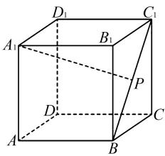
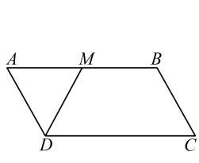
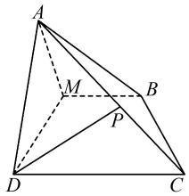
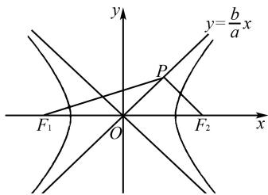
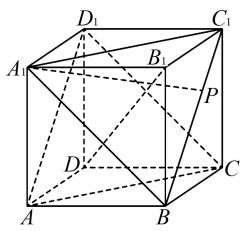
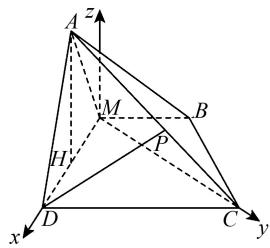

# 2025 年高考数学模拟卷(三)

# 李鸿昌

(北京师范大学贵阳附属中学, 贵州 贵阳 550081)

中图分类号：G632

文献标识码:A

文章编号:1008-0333(2025)13-0071-08

# 第Ⅰ卷(选择题)

一、选择题(本题共8小题,每小题5分,共40分.在每小题给出的四个选项中,只有一项是符合题目要求的)

1. 某校男生与女生人数之比为 3:2, 为了解该校学生的体重情况, 按性别采用分层随机抽样的方法从该校学生中抽样 120 人进行调查, 则该校女生被抽取的人数是().

A. 48

B. 24

C. 36

D. 56

2. 在数列 $\{a_{n}\}$ 中, $a_{1} = 1$ , 点 $P(a_{n}, a_{n+1})$ 在直线 $y = 2x$ 上, 则 $a_{5} = (\quad)$ .

A. 8

B. 16

C. 32

D. 64

3. 向量 $\boldsymbol{a} = (6, 2)$ 在向量 $\boldsymbol{b} = (2, -1)$ 上的投影向量为().

A. $(2, -1)$

B. $(1,-\frac{1}{2})$

C. $(4,-2)$

D. $(3,1)$

4. 已知 $a, b \in (0, +\infty)$ , 函数 $f(x) = a \log_2 x + b$ 的图象经过点 $(4, 1)$ , 则 $\frac{1}{a} + \frac{2}{b}$ 的最小值为（ ）.

A. $6 - 2\sqrt{2}$

B. 6

C. $4 + 2\sqrt{2}$

D. 8

5. 设 $l, l + 1, l + 2$ 是钝角三角形的三边长，则 l 的取值范围是().

A. $0 < l < 1$

B. 1 < l < 3

C. 3 < l < 4

D. 4 < l < 6

6. $(1-x+x^{2})(1+x)^{10}$ 的展开式中 $x^{5}$ 的系数为().

A. 252

B. 162

C. 126

D. 36

7. 设 $F_{1}, F_{2}$ 分别是双曲线 $C: \frac{x^{2}}{a^{2}} - \frac{y^{2}}{b^{2}} = 1 (a > 0, b > 0)$ 的左、右焦点，O 是坐标原点。过点 $F_{2}$ 作一条渐近线的垂线，垂足为点 P。若 $\angle F_{1}PO = \frac{\pi}{6}$ ，则 C 的离心率为（）.

A. $\frac{\sqrt{7}}{2}$

B. $\frac{\sqrt{21}}{2}$

C. $\sqrt{7}$

D. $\frac{\sqrt{21}}{3}$

8. 若关于 $x$ 的不等式 $a\mathrm{e}^{x} - \ln (x - 1) - 1 \geqslant 0$ 在区间 $(1, +\infty)$ 上恒成立，则实数 $a$ 的取值范围为（ ）.

A. $\left[\frac{1}{e^{2}},+\infty\right)$

B. $\left[\frac{1}{e},+\infty\right)$

C. $\left[1,+\infty\right)$

D. $[e, +\infty)$

二、选择题(本题共3小题,每小题6分,共18分.在每小题给出的选项中,有多项符合题目要求.全部选对的得6分,部分选对的得部分分,有选错的得0分)

9. 下列说法正确的是( ).

A. $y = |\sin x| + \cos x$ 为偶函数

B. $1 + \tan 65^{\circ}\tan 20^{\circ} + \tan 20^{\circ} = \tan 65^{\circ}$

收稿日期:2025-02-05

作者简介: 李鸿昌, 本科, 二级教师, 从事高中数学教学研究.

C. $-\sin2x + \sqrt{3}\cos2x = 2\sin\left(2x + \frac{2}{3}\pi\right)$

D. $y = \sin^2 x + 4\cos x$ 的最大值为5

10. 如图 1, 在棱长为 1 的正方体 ABCD - $A_{1}B_{1}C_{1}D_{1}$ 中, 点 P 在线段 $BC_{1}$ 上运动, 则().

text_image

D₁
C₁
A₁
B₁
P
D
C
A
B

图1 第10题示意图

A. $A_{1}P \parallel$ 面 $ACD_{1}$

B. $A_{1}P \perp B_{1}D$

C. 三棱锥 $D_{1} - APC$ 的体积是 $\frac{1}{6}$

D. 异面直线 $A_{1}P$ 与 $AD_{1}$ 所成角的取值范围是 $\left[\frac{\pi}{4}, \frac{\pi}{2}\right]$

11. 抛物线 $\Gamma$ 的焦点在 x 轴正半轴上, 焦点到准线距离为 2, 点 $P(4, y_{0}) (y_{0} > 0)$ 是 $\Gamma$ 上一点. 设直线 l 斜率存在且与 $\Gamma$ 相交于 A, B 两点, 则

A. 抛物线方程为 $y^{2} = 8x$   
B. 直线 $l$ 的斜率为 $\frac{4}{y_A + y_B}$   
C. 若 AP 与 BP 的斜率互为相反数, 则 l 的斜率为 $-\frac{1}{2}$   
D. 若 l 过焦点, 倾斜角为 $60^{\circ}$ , 则 $\triangle PAB$ 面积为 $3\sqrt{3}$ 第Ⅱ卷(非选择题)

# 三、填空题(本题共3小题,每小题5分,共15分)

12. 已知复数 z 满足 $zi = 1 + i$ ，则 z = \_\_\_\_.  
13. 已知集合 $A = \{1, 2, 4\}$ , $B = \{(x, y) \mid x \in A, y \in A, x - y \in A\}$ , 则集合 $B$ 的元素个数为 \_\_\_\_.  
14. 某班级准备了五种课外活动供同学们选择，活动时间分别为 15min, 20min, 25min, 30min, 35min，现有三位同学依次选择一种活动并完成，要求三位同

学所选活动不同. 记 m 表示前两位同学选择的活动时间的平均数, 记 n 表示三位同学选择的活动时间的平均数, 则 m 与 n 的比值大于 1 的概率为 \_\_\_\_.

# 四、解答题(本题共5小题,共77分. 解答应写出文字说明、证明过程或演算步骤)

15.(13 分)癌症术后五年存活率是判断癌症治疗效果的重要指标,某医院通过统计癌症患者手术后五年的生存情况得到列联表(见表 1):

表 1 癌症患者手术后五年的生存情况列联表

<table><tr><td>术后五年情况\术时所处阶段</td><td>前中期</td><td>晚期</td><td>合计</td></tr><tr><td>存活</td><td>800</td><td>200</td><td>1 000</td></tr><tr><td>死亡</td><td>200</td><td>s</td><td>t</td></tr><tr><td>合计</td><td>1 000</td><td>m</td><td>1 600</td></tr></table>

(1) 求 s, t, m;   
(2) 根据小概率值 0.001 的独立性检验, 能否认为癌症术后五年存活率主要与患者手术时癌症所处阶段有关? (卡方分布临界值, 见表 2).  
(3) 结合上述情况, 对科学预防和治疗癌症提出合理建议.

附： $\chi^2 = \frac{n(ad - bc)^2}{(a + b)(c + d)(a + c)(b + d)})$

表 2 卡方分布临界值表

<table><tr><td> $P(\chi^{2} \geqslant k_{0})$ </td><td>0.10</td><td>0.05</td><td>0.01</td><td>0.005</td><td>0.001</td></tr><tr><td> $k_{0}$ </td><td>2.706</td><td>3.841</td><td>6.635</td><td>7.879</td><td>10.828</td></tr></table>

16. (15 分) 已知等差数列 $\{a_{n}\}$ 满足 $a_{2n} = 2a_{n} + 1$ ，且 $a_{1} + 1, a_{2} + 1, a_{3} + 3$ 为等比数列.

(1)求数列 $\{a_{n}\}$ 的通项公式；  
(2) 若 $b_{n}=3^{n-1}a_{n}$ ，求数列 $\{b_{n}\}$ 的前 n 项和 $S_{n}$ .

17. (15 分) 在 $\square ABCD$ 中, 如图 2(a), $AB = 2BC = 2$ , $M$ 为 $AB$ 的中点, 将等边 $\triangle ADM$ 沿 $DM$ 折起, 连接 $AB, AC$ , 且 $AC = 2$ , 如图 2(b).

(1) 求证: $CM \perp$ 平面 ADM;  
(2) P 为线段 AC 上的动点(不含端点), DP 能否与平面 ABM 平行? 说明理由;

(3) 求直线 AD 与平面 ABM 所成角的正弦值.

text_image

A M B
D C

(a)

text_image

Geometric diagram of a tetrahedron with labeled vertices A, B, C, D and internal points M, P, showing solid and dashed edges.

(b)   
图 2 第 17 题示意图

18. (17 分) 设 CD 和 MN 是椭圆 $E: \frac{x^{2}}{4} + \frac{y^{2}}{3} = 1$ 的两条经过坐标原点 O 的弦, 且直线 CD 和 MN 的斜率之积为 $-\frac{3}{4}$ .

(1) 求 $OD^{2} + ON^{2}$ 的值;  
(2) 设 T 是线段 DN 的中点, 求 T 的轨迹方程 $E_{1}$ ;  
(3) 设 P 是曲线 $E_{1}$ 上的动点, 过 P 作 $E_{1}$ 的切线交 E 于 A, B 两点. 证明: $\triangle AOB$ 的面积是定值.
(参考公式:椭圆 $\frac{x^{2}}{a^{2}}+\frac{y^{2}}{b^{2}}=1(a>b>0)$ 在其上一点 $(x_{0},y_{0})$ 处的切线方程为 $\frac{x_{0}x}{a^{2}}+\frac{y_{0}y}{b^{2}}=1$   
19. (17 分) 设 $f(x) = \mu \tan x + \lambda \sin x - (\mu + \lambda)x$ , $x \in (0, \frac{\pi}{2})$ , 其中 $\mu, \lambda \in R$ .

(1) 若 $\mu=0, \lambda=1$ ，记 $g(x)=f(x)+x^{3}-\sin x$ ，求 $g(x)$ 在 x=1 处的切线方程；  
(2) 若 $\mu=2,\lambda=3$ , 证明: $f(x)>0$ ;  
(3) 若 $\mu = 5, \lambda > 0$ ，且 $f(x) > 0$ 恒成立，求 $\lambda$ 的最大值.

# 参考答案

1. 由分层抽样定义可知被抽取到的女学生人数是 $120 \times \frac{2}{3 + 2} = 48$ .

故选 A.

2. 因为 $a_1 = 1$ ，点 $P(a_n, a_{n+1})$ 在直线 $y = 2x$ 上，则 $a_{n+1} = 2a_n$ . 可知数列 $\{a_n\}$ 是以首项为 1，公比为 2 的等比数列. 所以 $a_5 = 2^{5-1}a_1 = 16a_1 = 16$ .

故选 B.

3. 向量 a 在向量 b 上的投影向量为 $\frac{a \cdot b}{|b|^{2}} \cdot b = \frac{6 \times 2 - 2}{5} \cdot (2, -1) = (4, -2)$ .

故选 C.

4. 函数 $f(x) = a \log_2 x + b$ 的图象经过点(4,1)，则 $a \log_2 4 + b = 1$ . 即 $2a + b = 1$ .

又 $a, b \in (0, +\infty), \frac{1}{a} + \frac{2}{b} = (2a + b)(\frac{1}{a} + \frac{2}{b}) = 4 + \frac{b}{a} + \frac{4a}{b} \geqslant 4 + 2\sqrt{\frac{b}{a} \times \frac{4a}{b}} = 8,$

当且仅当 $\frac{b}{a}=\frac{4a}{b}$ ，即 $a=\frac{1}{4},b=\frac{1}{2}$ 时取等号.

故选 D.

5. 由于 $l, l + 1, l + 2$ 是钝角三角形的三边长，所以 $l > 0$ ，且 $l + 2 < l + l + 1$ ，所以 $l > 1$ .

设最长边 $l+2$ 对的角为 C, 则

$\cos C = \frac{l^{2} + (l + 1)^{2} - (l + 2)^{2}}{2 \cdot l \cdot (l + 1)} = \frac{(l - 3)(l + 1)}{2 \cdot l \cdot (l + 1)} < 0,$ 解得 $1 < l < 3$ .

故选 B.

6. 由 $(1 - x + x^2)(1 + x)^{10}$ , 则涉及 $x^5$ 的项为 $\mathrm{C}_{10}^{5}1^{5}x^{5} - x\mathrm{C}_{10}^{4}1^{6}x^{4} + x^{2}\mathrm{C}_{10}^{3}1^{7}x^{3}$ , 则 $x^5$ 的系数为 $\mathrm{C}_{10}^{5} - \mathrm{C}_{10}^{4} + \mathrm{C}_{10}^{3} = 162$ .

故选 B.

7. 不妨设点 P 在第一象限, 由题意可知 $PF_{2}$ 与渐近线 bx - ay = 0 垂直, 如图 3 所示,

text_image

y
y=b/a x
P
F₁ O F₂ x

图 3 第 7 题解析图

故 $\angle F_{1}PF_{2} = \frac{2\pi}{3}$

由点到直线的距离公式可得

$$
\left| P F _ {2} \right| = \frac {\left| b c - 0 \cdot a \right|}{\sqrt {a ^ {2} + b ^ {2}}} = \frac {b c}{c} = b.
$$

又 $\left|OF_{2}\right|=c$ ，故 $\left|OP\right|=a.$

设 $P(x,y)$ ，则 $S_{\triangle OPF_2} = \frac{1}{2} ab = \frac{1}{2} cy.$

所以 $y=\frac{ab}{c}, x=\frac{a^{2}}{c}.$

由 $S_{\triangle F_1PF_2} = \frac{1}{2} b|PF_1|\sin \frac{2\pi}{3} = \frac{1}{2}\cdot 2cy$ ，解得 $\mid PF_1\mid = \frac{4a}{\sqrt{3}}.$

由 $S_{\triangle OPF_{1}} = S_{\triangle OPF_{2}}$ ，得 $\frac{1}{2}a \cdot PF_{1}\sin\frac{\pi}{6} = \frac{1}{2}ab$ ，解得 $PF_{1} = 2b$ .

从而可得 $\frac{b}{a}=\frac{2}{\sqrt{3}}.$

所以离心率 $e = \sqrt{1 + \frac{b^2}{a^2}} = \sqrt{\frac{7}{3}} = \frac{\sqrt{21}}{3}$ .

故选 D.

8. 当 $a \leqslant 0$ 时, $f(2) = a\mathrm{e}^2 - 1 < 0$ , 不满足题意, 舍去, 所以 $a > 0$ .

令 $f(x)=ae^{x}-\ln(x-1)+1(x>1)$ ，则

$$
f ^ {\prime} (x) = a \mathrm{e} ^ {x} - \frac {1}{x - 1} = \frac {\mathrm{e} ^ {x}}{x - 1} [ a (x - 1) - \mathrm{e} ^ {- x} ].
$$

令 $g(x)=a(x-1)-\mathrm{e}^{-x}$ ，则 $g'(x)=a+\mathrm{e}^{-x}>0$ ，则 $g(x)$ 在 $(1,+\infty)$ 上单调递增，

又 $g(1) = -\frac{1}{\mathrm{e}} < 0, g(x) = a(x - 1) - \frac{1}{\mathrm{e}^x} > a(x - 1) - \frac{1}{\mathrm{e}},$ 则 $g(1 + \frac{1}{ae}) > 0.$

所以存在唯一 $x_{0} \in (1, 1 + \frac{1}{ae})$ 使得 $g(x_{0}) = 0$ .

即 $a(x_0 - 1) = \frac{1}{\mathrm{e}^{x_0}}$ 则 $a\mathrm{e}^{x_0} = \frac{1}{x_0 - 1}$ .

当 $x \in (1, x_{0})$ 时， $g(x) < 0$ ，则 $f'(x) < 0$ ，则 $f(x)$ 单调递减；

当 $x \in (x_{0}, +\infty)$ 时, $g(x) > 0$ , 则 $f'(x) > 0$ , 则 $f(x)$ 单调递增.

所以 $f(x)_{\min} = f(x_0) = ae^{x_0} - \ln (x_0 - 1) - 1$ $= \frac{1}{x_0 - 1} -\ln (x_0 - 1) - 1\geqslant 0$ 恒成立.

令 $h(x) = \frac{1}{x - 1} -\ln (x - 1) - 1,x\in (1, + \infty)$ 则 $h^{\prime}(x) = -\frac{1}{(x - 1)^{2}} -\frac{1}{x - 1} < 0.$

所以 $h(x)$ 在 $(1, +\infty)$ 上单调递减.

又 $h(2) = 0$ ，所以 $f(x_0)\geqslant 0\Leftrightarrow h(x_0)\geqslant h(2).$

所以 $1 < x_{0} \leqslant 2$ .

又因为 $a = \frac{1}{\mathrm{e}^{x_0}(x_0 - 1)}$ ，且 $\varphi (x) = \frac{1}{\mathrm{e}^x(x - 1)}$ 在(1,2]上单调递减，所以 $a\in [\frac{1}{\mathrm{e}^2}, + \infty)$

故选 A.

9. 由 $y = |\sin x|$ 为偶函数, $y = \cos x$ 为偶函数, 则 $y = |\sin x| + \cos x$ 为偶函数, 即 A 正确.

$$
\begin{array}{l} \text {由} \quad 1 = \tan 4 5 ^ {\circ} = \tan (6 5 ^ {\circ} - 2 0 ^ {\circ}) \\ = \frac {\tan 6 5 ^ {\circ} - \tan 2 0 ^ {\circ}}{1 + \tan 6 5 ^ {\circ} \tan 2 0 ^ {\circ}}, \\ \end{array}
$$

整理, 得 $1 + \tan65^{\circ}\tan20^{\circ} + \tan20^{\circ} = \tan65^{\circ}$ ,

即 B 正确.

由 $-\sin2x + \sqrt{3}\cos2x = 2\left(-\frac{1}{2}\sin2x + \frac{\sqrt{3}}{2}\cos2x\right)$

$$
= 2 \left(\cos \frac {2 \pi}{3} \sin 2 x + \sin \frac {2 \pi}{3} \cos 2 x\right)
$$

$$
= 2 \sin \left(2 x + \frac {2}{3} \pi\right),
$$

即 C 正确.

由 $y = \sin^2 x + 4\cos x = -\cos^2 x + 4\cos x + 1$ ，令 $t = \cos x \in [-1, 1]$ ，则 $y = -t^2 + 4t + 1$ ，得当 $t = 1$ 时 $y = \sin^2 x + 4\cos x$ 取最大值为 4，故 D 错误.

故选 ABC.

10. 对于 A 选项, 如图 4, 连接 $A_{1}B, A_{1}C_{1}, AC, AD_{1}, D_{1}C$ , 由正方体的性质可知 $AC \parallel A_{1}C_{1}$ .

又 $AC \not\subset$ 平面 $A_{1}BC_{1}, A_{1}C_{1} \subset$ 平面 $A_{1}BC_{1}$ ,

所以 $AC \parallel$ 平面 $A_{1}BC_{1}$ .

同理可证 $AD_{1} \parallel$ 平面 $A_{1}BC_{1}$ .

text_image

Geometric diagram of a cube with labeled vertices and internal diagonals, used for spatial geometry problems.

图4 第10题解析

又因为 $AD_{1} \cap AC = A$ ，且 $AC, AD_{1} \subset$ 平面 $ACD_{1}$ ，所以平面 $A_{1}BC_{1} //$ 平面 $ACD_{1}$ 。因为 $A_{1}P \subseteq$ 平面 $A_{1}BC_{1}$ ，所以 $A_{1}P //$ 平面 $ACD_{1}$ ，故 A 正确。

对于 B 选项, 因为 $DD_{1} \perp$ 平面 $A_{1}B_{1}C_{1}D_{1}, A_{1}C_{1} \subset$ 平面 $A_{1}B_{1}C_{1}D_{1}$ , 所以 $DD_{1} \perp A_{1}C_{1}$ . 又因为 $A_{1}C_{1} \perp B_{1}D_{1}, B_{1}D_{1} \cap DD_{1} = D_{1}, B_{1}D_{1}, DD_{1} \subset$ 平面 $DD_{1}B_{1}$ , 所以 $A_{1}C_{1} \perp$ 平面 $DD_{1}B_{1}$ . 又因为 $B_{1}D \subset$ 平面 $DD_{1}B_{1}$ , 所以 $A_{1}C_{1} \perp B_{1}D$ . 同理可证 $BC_{1} \perp$ 平面 $A_{1}B_{1}CD$ . 又因为 $B_{1}D \subset$ 平面 $A_{1}B_{1}CD$ , 所以 $BC_{1} \perp B_{1}D$ . 又因为 $BC_{1} \cap A_{1}C_{1} = C_{1}, BC_{1}, A_{1}C_{1} \subset$ 平面 $BA_{1}C_{1}$ , 所以 $B_{1}D \perp$ 平面 $BA_{1}C_{1}$ . 因为 $A_{1}P \subseteq$ 平面 $A_{1}BC_{1}$ , 所以 $B_{1}D \perp A_{1}P$ , 故 B 正确.

对于 C 选项, 因为平面 $A_{1}BC_{1} \parallel$ 平面 $AD_{1}C$ , 所以 $BC_{1} \parallel$ 平面 $AD_{1}C$ . 所以 $V_{D_{1}-APC} = V_{P-AD_{1}C} = V_{B-AD_{1}C} = V_{D_{1}-ABC} = \frac{1}{3} \times \frac{1}{2} \times 1^{2} \times 1 = \frac{1}{6}$ , 故 C 正确.

对于 D 选项, 因为 $AD_{1} \parallel BC_{1}$ , 所以 $A_{1}P$ 与 $BC_{1}$ 所成角为异面直线 $A_{1}P$ 与 $AD_{1}$ 所成角. 连接 $A_{1}C_{1}$ , $A_{1}B$ , 可得 $\triangle A_{1}BC_{1}$ 为等边三角形, 此时 $A_{1}P$ 与 $BC_{1}$ 所成角最小, 可得 $A_{1}P$ 与 $BC_{1}$ 所成角的范围是 $\left[\frac{\pi}{3}, \frac{\pi}{2}\right]$ , 故 D 不正确.

故选 ABC.

11. 抛物线方程为 $y^{2}=4x$ , A 错误.

直线 l 斜率为 $\frac{y_{A}-y_{B}}{y_{A}^{2}/4-y_{B}^{2}/4}=\frac{4}{y_{A}+y_{B}}$ ，B 正确.

设 l 方程为 $y = kx + b$ ，与抛物线联立得 $k^{2}x^{2} + (2kb - 4)x + b^{2} = 0$ ，可得 $x_{1} + x_{2} = \frac{4 - 2kb}{k^{2}}, x_{1}x_{2} = \frac{b^{2}}{k^{2}}$ .

由斜率互为相反数可得 $\frac{kx_{1}+b-4}{x_{1}-4}+\frac{kx_{2}+b-4}{x_{2}-4}=0.$ 通分后代入韦达定理，可得 $k=-\frac{1}{2}$ ，C正确.

因为 l 过焦点, 所以 l 方程为 $y = \sqrt{3}(x - 1)$ , 联立可得 AB 长为 $\frac{16}{3}$ , 点 P 到 AB 距离为 $\frac{3\sqrt{3} - 4}{2}$ , 故面积为 $\frac{12\sqrt{3} - 16}{3}$ , D 错误.

故选 BC

12. $z = \frac{1 + \mathrm{i}}{\mathrm{i}} = 1 - \mathrm{i}.$

13. 当 $x = 1$ 时, $y = 1,2,4,x - y$ 分别为 $0, - 1,$ $-3$ ，均不能满足 $x - y\in A$ ；当 $x = 2$ 时， $y = 1$ 时可满足 $x - y = 1\in A;x = 2$ 时， $y = 2,x - y = 0,x = 2$ 时， $y = 4,x - y = -2$ 均不满足 $x - y\in A.$

当 x=4 时, y=2 可满足 $x-y=2\in A$ ; 当 x=4 时, y=1, x-y=3; 当 x=4 时, y=4, x-y=0 均不满足 $x-y\in A$ . 所以 $B=\{(2,1),(4,2)\}$ .

故集合 B 的元素有 2 个.

14. 记 3 位同学选择的活动时间依次为 a, b, c，则共有 $A_{5}^{3} = 60$ 种情况.

由题可令 $\frac{n}{m}=\frac{2(a+b+c)}{3(a+b)}<1$ ，即 $a+b>2c$ .

当 c=15 时, $a+b>30$ , 满足不等式的 a,b 数组有 $(20,25)$ , $(20,30)$ , $(20,35)$ , $(25,30)$ , $(25,35)$ , $(30,35)$ , 共 $6A_{2}^{2}=12$ 种情况;

当 c=20 时, $a+b>40$ , 满足不等式的 a,b 数组有 $(15,30)$ , $(15,35)$ , $(25,30)$ , $(25,35)$ , $(30,35)$ , 共 $5A_{2}^{2}=10$ 种情况;

当 c=25 时, $a+b>50$ , 满足不等式的 a,b 数组有 $(20,35)$ , $(30,35)$ , 共 $2A_{2}^{2}=4$ 种情况;

当 c=30 时, $a+b>60$ ,不存在满足不等式的 a,b 数组;

当 c=35 时, $a+b>70$ , 不存在满足不等式的 a,b 数组.

综上,满足条件的共有26种情况,故 $P=\frac{26}{60}=\frac{13}{30}$ .

15. (1) s = 400, t = 600, m = 600.

(2)零假设为 $H_{0}$ : 癌症术后五年存活率与患者手术时癌症所处阶段无关联.

根据列联表中的数据 n = 1600, a = 800, b = 200, c = 200, d = 400, 计算可得 $\chi^{2} = 348.444 > 10.828 = x_{0.001}$ .

根据小概率值 0.001 的独立性检验,我们推断 $H_{0}$ 不成立,即认为癌症术后五年存活率主要与患者手术时癌症所处阶段有关,此推断犯错误的概率不大于 0.001.

(3)前中期癌症患者术后五年存活率显著高于晚期患者术后五年存活率,所以应当规律体检,及早发现癌症,尽量在前中期进行手术.

16. (1) 由 $\{a_{n}\}$ 为等差数列, 则 $a_{n} = dn + k$ , 其中 $d, k$ 为常数.

由 $a_{2n}=2a_{n}+1$ ，即 $d\times2n+k=2(dn+k)+1$ 对任意的 $n\in N^{*}$ 均成立.

则 $k=2k+1$ , 得 k=-1 .

故 $a_{n} = dn - 1$

由 $a_1 + 1, a_2 + 1, a_3 + 3$ 为等比数列，即 $d, 2d, 3d + 2$ 为等比数列，得 $d = 2$ ，故 $a_n = 2n - 1$ .

(2)由 $a_{n}=2n-1$ , 得

$$
b _ {n} = 3 ^ {n - 1} a _ {n} = (2 n - 1) 3 ^ {n - 1}.
$$

则 $S_{n}=1\times3^{0}+3\times3^{1}+5\times3^{2}+\cdots+(2n-3)\times3^{n-2}+(2n-1)\times3^{n-1}$ ,

得 $3S_{n}=1\times3^{1}+3\times3^{2}+5\times3^{3}+\cdots+(2n-3)\times3^{n-1}+(2n-1)\times3^{n}$ ,

将两式左右两边分别相减得 $-2S_{n}=1\times3^{0}+2\times3^{1}+2\times3^{2}+\cdots+2\times3^{n-1}-(2n-1)\times3^{n}$ .

则 $-2S_{n}=1+2\times\frac{3(1-3^{n-1})}{1-3}-(2n-1)\times3^{n}.$

整理, 得 $S_{n}=1+(n-1)3^{n}$ .

17. (1) 连接 CM,

在 $\triangle CBM$ 中, 因为 $BC = BM = 1$ , $\angle CBM = \frac{2\pi}{3}$ ,

故 $CM = \sqrt{1^2 + 1^2 - 2 \times 1 \times 1 \times (-\frac{1}{2})} = \sqrt{3}$ .

在 $\triangle CMD$ 中, 因为 $DM^{2} + CM^{2} = CD^{2}$ , 所以 $DM \perp CM$ .

同理可得 $CM \perp AM$ .

因为 $\left\{\begin{aligned}CM\perp DM,\\ CM\perp AM,\\ AM\cap DM=M,\\ AM,DM\subset\text{平面}ADM,\end{aligned}\right.$

所以 $CM \perp$ 平面 ADM.

(2) DP 不可能与平面 ABM 平行, 理由如下:

假设 $DP \parallel$ 平面 $ABM$ , 又因为 $DC \parallel MB, DC \not\subset$ 平面 $ABM, MB \subset$ 平面 $ABM$ ,

所以 $DC \parallel$ 平面ABM.

因为 $DC \cap DP = D, DC \subset$ 平面 ADC, DP $\subset$ 平面 ADC,

从而有平面 ADC // 平面 ABM, 这显然不成立, 所以 DP 不可能与平面 ABM 平行.

(3)设 H 为 DM 的中点,所以 $AH \perp DM$ .

因为 $CM \perp$ 平面 ADM, $CM \subset$ 平面 BCDM,

所以平面 $ADM \perp$ 平面 BCDM.

又因为平面 $ADM \cap$ 平面 $BCDM = DM, AH \subset$ 平面 ADM, 所以 $AH \perp$ 平面 BCDM. 所以以点 M 为坐标原点, 直线 MD 为 x 轴, 直线 MC 为 y 轴, 过点 M 且平行于 AH 的直线为 z 轴建立如图 5 所示的空间直角坐标系,

所以 $M(0,0,0)$ , $D(1,0,0)$ , $C(0,\sqrt{3},0)$ , $B(-\frac{1}{2}$ , $\frac{\sqrt{3}}{2}$ , 0), $H(\frac{1}{2},0,0)$ , $A(\frac{1}{2},0,\frac{\sqrt{3}}{2})$ .

所以 $\overrightarrow{AD}=(\frac{1}{2},0,-\frac{\sqrt{3}}{2})$ .

设平面 ABM 的法向量为 $\boldsymbol{m}=(x_{1},y_{1},z_{1})$ ,

因为 $\overrightarrow{AB} = (-1, \frac{\sqrt{3}}{2}, -\frac{\sqrt{3}}{2}), \overrightarrow{AM} = (-\frac{1}{2}, 0, -\frac{\sqrt{3}}{2})$

所以 $\left\{ \begin{array}{l} \boldsymbol{m} \cdot \overrightarrow{AB} = -x_1 + \frac{\sqrt{3}}{2} y_1 - \frac{\sqrt{3}}{2} z_1 = 0, \\ \boldsymbol{m} \cdot \overrightarrow{AM} = -\frac{1}{2} x_1 - \frac{\sqrt{3}}{2} z_1 = 0. \end{array} \right.$

取 $x_{1} = \sqrt{3}$ ，所以 $\pmb {m} = (\sqrt{3},1, - 1)$

设直线 AD 与平面 ABM 所成角为 $\theta$ ，则

$$
\sin \theta = | \cos \overrightarrow {A D}, \boldsymbol {m} | = \frac {| \overrightarrow {A D} \cdot \boldsymbol {m} |}{| \overrightarrow {A D} | \cdot | \boldsymbol {m} |} = \frac {\sqrt {1 5}}{5}.
$$

text_image

A
z
M
B
H
P
D
C
y
x

图5 建立坐标系

18. (1) 设 $D(2\cos \theta, \sqrt{3}\sin \theta)$ , 根据 $k_{OD} \cdot k_{ON} = -\frac{3}{4}$ , 可得 $N(-2\sin \theta, \sqrt{3}\cos \theta)$ .

所以 $OD^{2} + ON^{2} = 4\cos^{2}\theta + 3\sin^{2}\theta + 4\sin^{2}\theta + 3\cos^{2}\theta = 7.$

(2) 设 $T(x, y)$ ，由(1)可得

$$
\left\{ \begin{array}{l} x = \cos \theta - \sin \theta = \sqrt {2} \cos \left(\theta + \frac {\pi}{4}\right), \\ y = \frac {\sqrt {3}}{2} (\sin \theta + \cos \theta) = \frac {\sqrt {6}}{2} \sin \left(\theta + \frac {\pi}{4}\right), \end{array} \right.
$$

整理, 得 $\frac{x^{2}}{2} + \frac{y^{2}}{1.5} = 1$ .

所以 T 的轨迹方程 $E_{1}$ 为 $\frac{x^{2}}{2} + \frac{y^{2}}{1.5} = 1$ .

(3) 设 $P(x_{0}, y_{0})$ 是椭圆 $E_{1}:\frac{x^{2}}{2}+\frac{y^{2}}{1.5}=1$ 上一点，则有 $3x_{0}^{2}+4y_{0}^{2}=6$ ，且由参考公式知，椭圆 $E_{1}$ 在点 $P(x_{0}, y_{0})$ 处的切线方程为 $\frac{x_{0}x}{2}+\frac{2y_{0}y}{3}=1$ ，即 $3x_{0}x+4y_{0}y-6=0$ ，易知 $y_{0}\neq0$ ，所以其斜率 $k=-\frac{3x_{0}}{4y_{0}}$ .

联立 $\left\{\begin{aligned}&3x_{0}x+4y_{0}y-6=0,\\ &\frac{x^{2}}{4}+\frac{y^{2}}{3}=1,\end{aligned}\right.$

得 $3x^{2}-6x_{0}x+6-8y_{0}^{2}=0.$

设 $A(x_{1},y_{1}),B(x_{2},y_{2})$ ，则

$$
x _ {1} + x _ {2} = 2 x _ {0}, x _ {1} x _ {2} = \frac {6 - 8 y _ {0} ^ {2}}{3}.
$$

所以 $|AB| = \sqrt{1 + k^2} \cdot \sqrt{(x_1 + x_2)^2 - 4x_1x_2}$

$$
= \sqrt {1 + k ^ {2}} \cdot \sqrt {4 x _ {0} ^ {2} - \frac {2 4 - 3 2 y _ {0} ^ {2}}{3}}
$$

$$
= \sqrt {1 + k ^ {2}} \cdot \frac {4 | y _ {0} |}{\sqrt {3}}.
$$

原点 O 到切线 $AB: y = kx - kx_{0} + y_{0}$ 的距离

$$
d = \frac {\left| y _ {0} - k x _ {0} \right|}{\sqrt {1 + k ^ {2}}} = \frac {\left| y _ {0} + 3 x _ {0} ^ {2} / \left(4 y _ {0}\right) \right|}{\sqrt {1 + k ^ {2}}} = \frac {3}{2 \left| y _ {0} \right| \sqrt {1 + k ^ {2}}}.
$$

所以 $\triangle AOB$ 的面积为

$$
S = \frac {1}{2} | A B | d
$$

$$
= \frac {1}{2} \sqrt {1 + k ^ {2}} \cdot \frac {4 | y _ {0} |}{\sqrt {3}} \cdot \frac {3}{2 | y _ {0} | \sqrt {1 + k ^ {2}}} = \sqrt {3}.
$$

故 $\triangle AOB$ 的面积是定值 $\sqrt{3}$ .

19.（1）由已知， $g(x)=x^{3}-x,x\in(0,\frac{\pi}{2})$ . 则 $g'(x)=3x^{2}-1$ ，所以直线的斜率为 $k=g'(1)=2$ .
又 $g(1)=0$ ，所以直线过点 $(1,0)$ .

因此 $g(x)$ 在 x=1 处的切线方程为 2x-y-2=0.

(2) 当 $\mu = 2, \lambda = 3$ 时, $f(x) = 2\tan x + 3\sin x - 5x$ , $x \in (0, \frac{\pi}{2})$ .

则 $f'(x)=\frac{2}{\cos^{2}x}+3\cos x-5=\frac{3\cos^{3}x-5\cos^{2}x+2}{\cos^{2}x}.$

下面用两种方法来证明 $f'(x)>0$ .

方法 1 构造函数.

令 $h(x)=3\cos^{3}x-5\cos^{2}x+2,0<x<\frac{\pi}{2},$

因为 $0 < \cos x < 1, 0 < \sin x < 1$ ,

$$
\begin{array}{r l} & {\text {所以} h ^ {\prime} (x) = 9 \cos^ {2} x (- \sin x) - 1 0 \cos x (- \sin x)} \\ & {= \sin x \cos x (1 0 - 9 \cos x) > 0.} \end{array}
$$

所以 $h(x)$ 在 $(0, \frac{\pi}{2})$ 上单调递增. 则 $h(x) >$

$h(0)=0.$ 即 $f'(x)>0.$ 所以 $f(x)$ 在 $(0,\frac{\pi}{2})$ 上单调递增. 故 $f(x)>f(0)=0.$

方法 2 换元 + 因式分解.

令 $t = \cos x\in (0,1)$ ，则

$$
3 t ^ {3} - 5 t ^ {2} + 2 = (t - 1) (3 t ^ {2} - 2 t - 2) > 0.
$$

这是因为当0<t<1时, $3t^{2}-2t-2<0$ .

因此, $f'(x)>0$ ,所以 $f(x)$ 在 $(0,\frac{\pi}{2})$ 上单调递增.故 $f(x)>f(0)=0$ .

(3) 当 $\mu = 5, \lambda > 0$ 时, $f(x) = 5 \tan x + \lambda \sin x - (5 + \lambda)x, x \in (0, \frac{\pi}{2})$ .

下面用三种方法来求当 $f(x)>0$ 恒成立时 $\lambda$ 的最大值.

方法 1 分类讨论.

因为 $f(x)=5\tan x+\lambda\sin x-(5+\lambda)x,x\in(0,\frac{\pi}{2})$ ,

所以 $f'(x) = \frac{5}{\cos^2 x} + \lambda \cos x - (5 + \lambda)$

$$
= \frac {\lambda \cos^ {3} x - (5 + \lambda) \cos^ {2} x + 5}{\cos^ {2} x}.
$$

令 $\cos x = t \in (0,1)$ , $g(t) = \lambda t^{3} - (5 + \lambda)t^{2} + 5$ , $t \in (0,1)$ ，则

$$
g ^ {\prime} (t) = 3 \lambda t ^ {2} - 2 (5 + \lambda) t = t (3 \lambda t - 2 \lambda - 1 0).
$$

①若 $\lambda\leqslant10$ ，则 $g'(t)=t(3\lambda t-2\lambda-10)<t(3\lambda-2\lambda-10)=t(\lambda-10)\leqslant0.$

所以 $g(t)$ 在 $(0,1)$ 上单调递减.

故 $g(t) > g(1) = 0$ . 于是 $f'(x) > 0$ .

因此 $f(x)$ 在 $(0,\frac{\pi}{2})$ 上单调递增.

故 $f(x)>f(0)=0.$

②若 $\lambda > 10$ ，则 $0 < \frac{2}{3} + \frac{10}{3\lambda} < 1$ 。所以当 $t > \frac{2}{3} + \frac{10}{3\lambda}$ 时， $g'(t) = t(3\lambda t - 2\lambda - 10) > 0$ 。

所以 $g(t)$ 在 $\left(\frac{2}{3}+\frac{10}{3\lambda},1\right)$ 上单调递增.

于是，当 $t \in \left(\frac{2}{3} + \frac{10}{3\lambda}, 1\right)$ 时， $g(t) < g(1)$

=0, 即 $f'(x) < 0$ . 所以 $f(x)$ 在 $(0, \arccos(\frac{2}{3} + \frac{10}{3\lambda}))$ 上单调递减, 此时 $f(x) < f(0) = 0$ , 这与 $f(x) > 0$ 恒成立矛盾.

综上, $\lambda\leqslant10$ . 故 $\lambda$ 的最大值等于 10.

方法 2 分离参数 + 不等式放缩.

当 $x \in (0, \frac{\pi}{2})$ 时, $f(x) > 0$ 恒成立等价于 $\lambda < \frac{5(\tan x - x)}{x - \sin x}$ 恒成立.

先证明: 当 $x \in (0, \frac{\pi}{2})$ 时, 有 $\tan x > x + \frac{1}{3}x^{3}$ 和 $\sin x > x - \frac{1}{6}x^{3}$ .

证明 设 $h(x) = \tan x - x - \frac{1}{3} x^3, x \in (0, \frac{\pi}{2})$ ，则

$h'(x) = \frac{1}{\cos^{2} x} - 1 - x^{2} = 1 + \tan^{2} x - 1 - x^{2} = \tan^{2} x - x^{2} > 0$ （这是因为 $\tan x > x$ ）.

所以 $h(x)$ 在 $(0, \frac{\pi}{2})$ 上单调递增.

故 $h(x) > h(0) = 0$ ，即 $\tan x > x + \frac{1}{3} x^3.$

设 $m(x)=\sin x-x+\frac{1}{6}x^{3},x\in(0,\frac{\pi}{2})$ ,

则 $m'(x) = \cos x - 1 + \frac{1}{2}x^2.$

又因为 $m''(x) = x - \sin x > 0$ ,

所以 $m(x)$ 在 $(0, \frac{\pi}{2})$ 上单调递增，

故 $m(x) > m(0) = 0$ .

即 $\sin x > x - \frac{1}{6}x^{3}$ .

于是, 当 $x \in (0, \frac{\pi}{2})$ 时, 有 $\tan x - x > \frac{1}{3}x^{3}$ 和 $0 < x - \sin x < \frac{1}{6}x^{3}$ .

由此可得, $\frac{5(\tan x-x)}{x-\sin x}>\frac{5\times x^{3}/3}{x^{3}/6}=10.$

故 $\lambda \leqslant 10$ , 即 $\lambda$ 的最大值为 10.