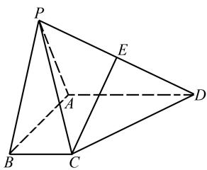
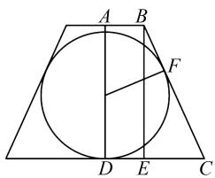
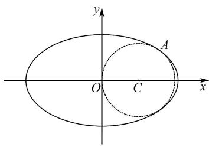
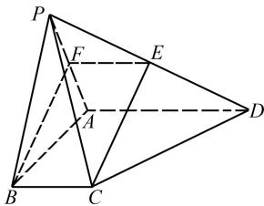
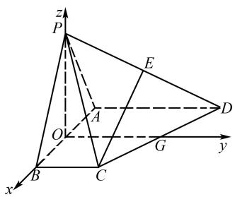

# 2025 年高考数学模拟卷(二)

# 李鸿昌

(北京师范大学贵阳附属中学, 贵州 贵阳 550081)

中图分类号：G632

文献标识码:A

文章编号:1008-0333(2025)13-0063-08

# 第Ⅰ卷(选择题)

一、选择题(本题共8小题,每小题5分,共40分.在每小题给出的四个选项中,只有一项是符合题目要求的)

1. 已知集合 $A = \{x \mid 1 - x \geqslant 0\}$ , $B = \left\{x \mid \frac{x - 2}{x} \leqslant 0\right\}$ , 则 $A \cap B = (\quad)$ .

A. $[0,1]$

B. $\left[-1,0\right)$

C. $(1,2)$

D. $(0,1]$

2. 函数 $y = \tan \frac{x}{2}$ 是( ).

A. 最小正周期为 $4 \pi$ 的奇函数

B. 最小正周期为 $2 \pi$ 的奇函数

C. 最小正周期为 $4 \pi$ 的偶函数

D. 最小正周期为 $2 \pi$ 的偶函数

3. 已知 $\boldsymbol{a} = (1, \sqrt{3})$ , $|b| = 2$ , 若 $\boldsymbol{a} \perp (\boldsymbol{a} - 2\boldsymbol{b})$ , 则 a, b 的夹角为().

A. $\frac{\pi}{6}$

B. $\frac{\pi}{4}$

C. $\frac{\pi}{3}$

D. $\frac{2\pi}{3}$

4. 数列递推指的是通过数列第 n 项与前几项或者后几项的关系, 计算出数列的任一项. 若数列 $a_{n}$ 满足 $a_{1}=\frac{1}{2}, a_{2}=1, a_{1}a_{3}=(a_{2})^{2}, a_{1}a_{4}=(a_{3})^{2}, a_{1}a_{5}=(a_{4})^{2}, \cdots$ , 则 $a_{2025}=(\quad)$ .

A. $2^{2023}$

B. $2^{2024}$

C. $2^{(2^{2}023}-1)}$

D. $2^{(2^{2}024}-1)}$

5. 设 $f(x)$ 是 R 上的可导函数, 甲: “ $f(x)$ 在区间

D 上存在极值”，乙：“ $\exists x_{0}\in D$ ，使得 $f'(x_{0})=0$ ”，则（）.

A. 甲是乙的充要条件

B. 甲是乙的充分不必要条件

C. 甲是乙的必要不充分条件

D. 甲是乙的既不充分又不必要条件

6. 设函数 $f(x) = \ln(1 + x^{2}) - \frac{1}{1 + 2025|x|}$ ，则不等式 $f(2x) > f(x + 1)$ 的解集为（）.

A. $\left(-\frac{1}{3},1\right)$

B. $(-\infty, -\frac{1}{3}) \cup (\frac{1}{3}, +\infty)$

C. $\left(-\frac{1}{3},\frac{1}{3}\right)$

D. $(-\infty, -\frac{1}{3}) \cup (1, +\infty)$

7. 数论领域的四平方和定理最早由欧拉提出，后被拉格朗日等数学家证明. 四平方和定理的内容是: 任意正整数都可以表示为不超过四个自然数的平方和, 例如正整数 $12 = 3^{2} + 1^{2} + 1^{2} + 1^{2} = 2^{2} + 2^{2} + 2^{2} + 0^{2}$ . 设 $25 = a^{2} + b^{2} + c^{2} + d^{2}$ , 其中 $a, b, c, d$ 均为自然数, 则满足条件的有序数组 $(a, b, c, d)$ 的个数是( ).

A. 28

B. 24

C. 20

D. 16

8. 设 $f(x)$ 为定义在整数集上的函数, $f(1)=1$ , $f(2)=0$ , $f(-1)<0$ , 对任意的整数 x, y 均有 $f(x+y)=f(x)f(1-y)+f(1-x)f(y)$ , 则 $\sum_{i=1}^{2025}f(i^{2})=(\quad)$ .

收稿日期:2025-02-05

作者简介: 李鸿昌, 本科, 二级教师, 从事高中数学教学研究.

A. 0 B. 1 013 C. 2 025 D. 4 050

二、选择题(本题共3小题,每小题6分,共18分.在每小题给出的选项中,有多项符合题目要求.全部选对的得6分,部分选对的得部分分,有选错的得0分)

9. 下列关于正态分布说法正确的有( ).

A. 正态分布常见于离散型随机变量  
B. 均值为 0, 标准差为 1 的正态分布称为标准正态分布  
C. 若变量 $X \sim N(6,4)$ ，则 X 的绝大部分样本点分布在 0 到 12 之间  
D. 若变量 X 服从正态分布, X 的均值为 6, 且 $P(X \leqslant 9) = 0.8$ , 则 $P(3 \leqslant X \leqslant 6) = 0.2$

10. 设 $z_{1}, z_{2}$ 为复数, 则下列说法正确的是().

A. $z_{1}\cdot \bar{z}_{1} = |z_{1}|^{2}$

B. $\left|z_{1}z_{2}\right|=\left|z_{1}\right|\left|z_{2}\right|$

C. 若 $z_{1}^{3} = -8$ ，则 $z_{1}$ 的值只能取 -2

D. 若 $z_{1}, z_{2}$ 为实系数一元二次方程 $ax^{2} + bx + c = 0 (a \neq 0)$ 的两虚根，则 $z_{1} = \bar{z}_{2}$

11. 已知数列 $\{a_{n}\}$ 的首项 $a_{1}=\frac{3}{4}$ ，且满足 $a_{n+1}=\frac{3a_{n}}{2a_{n}+1}$ ，则（）.

A. $\left\{\frac{1}{a_n} - 1\right\}$ 为等差数列

B. $a_{n}=\frac{3^{n}}{3^{n}+1}$

C. 数列 $\{a_{n}\}$ 为递增数列

D. 数列 $\left\{\frac{2n - 1}{a_n}\right\}$ 的前 $n$ 项和为 $n^2 + 1 - \frac{n + 1}{3^n}$

# 第Ⅱ卷(非选择题)

# 三、填空题(本题共3小题,每小题5分,共15分)

12. $\left(\frac{y}{x} +\frac{x}{y} +1\right)(x + y)^4$ 展开后 $x^{2}y^{2}$ 的系数为

13. 已知一个圆台的上、下底面半径分别为 1 和

3, 高为 $2\sqrt{3}$ . 若圆台内有一个球, 则该球体积的最大值为 \_\_\_\_. (球的厚度可忽略不计)

14. 已知椭圆 $E: \frac{x^{2}}{25} + \frac{y^{2}}{9} = 1$ ，则在椭圆 E 短轴的右侧与短轴相切且在椭圆 E 内部（包括边界）的最大圆的方程为 \_\_\_\_.  
四、解答题(本题共5小题,共77分. 解答应写出文字说明、证明过程或演算步骤)  
15. (13 分) 经过抛物线 $y^{2}=8x$ 焦点的直线 l 交该抛物线于 A, B 两点.

(1) 若直线 l 的斜率是 $2\sqrt{2}$ ，求 $|AB|$ 的值；

(2) 若 O 是坐标原点, 求 $\overrightarrow{OA} \cdot \overrightarrow{OB}$ 的值.

16. (15 分) 连续抛掷一枚质地均匀的骰子 $n(n \in \mathbf{N}^*)$ 次. 第 $k(k \leqslant n, k \in \mathbf{N}^*)$ 次抛掷落地时朝上的点数记为 $a_k$ , 且 $a_k \in \{1, 2, 3, 4, 5, 6\}$ .

(1) 记事件 A 为 “ $a_{1} + a_{2} \leqslant 5$ ”, 事件 B 为 “ $|a_{1} - a_{2}| = 3$ ”, 求 $P(B|A)$ ;  
(2) 若 $n = 4$ , 记事件 $C$ 为“ $a_i \leqslant a_{i+1} (i = 1, 2, 3)$ ”, 求 $P(C)$ .  
17. (15 分) 在四棱锥 $P - ABCD$ 中, 底面 $ABCD$ 为直角梯形, $AD \parallel BC$ , $AD \perp AB$ , $AD = 2BC$ , $E$ 为 $PD$ 的中点, 如图 1 所示.

text_image

Geometric diagram of a tetrahedron with labeled vertices P, A, B, C, D, E and dashed/solid edges indicating hidden edges.

图 1 第 17 题图

(1) 证明: $CE \parallel$ 平面 PAB;  
(2) 若 $\Delta PAB$ 为等边三角形, 平面 $PAB \perp$ 平面 ABCD, AB = AD = 2, 求二面角 P - AC - E 的余弦值.  
18. (17 分) 在斜三角形 ABC 中, 内角 A, B, C 的对边分别为 a, b, c, 记 $\lambda = \frac{a + b}{c}$ .

(1) 若 $\lambda = 2$ , 求 $\cos C$ 的最小值;

(2) 若 $\cos(A - B) - \cos C = \frac{\sqrt{3}}{\tan A + \tan B}$ , 且 $C$ 为钝角, 求 $\lambda$ 的最大值;

(3) 直接写出两个函数 $f(\lambda)$ 与 $g(\lambda)$ 的解析式，使得对于一切满足条件的 $\lambda$ ，都有 $\tan \frac{A}{2} \tan \frac{B}{2} = f(\lambda)$ ，且代数式 $\frac{\cos A + \cos B + g(\lambda)}{g(\lambda) \cos A \cos B}$ 恒为定值.

19. (17 分) 定义双曲正弦函数 $\sinh x = \frac{e^{x} - e^{-x}}{2}$ ,
双曲余弦函数 $\cosh x = \frac{e^{x} + e^{-x}}{2}$ ，双曲正切函数 $\tanh x = \frac{\sinh x}{\cosh x}$ .

(1) 证明: $\sinh(2x)=2\sinh x\cosh x;$

(2) 证明: 当 $x \in [0, +\infty)$ 时, $x \cosh x \geqslant \sinh x$ ;

(3) 证明: $\ln (\cosh x) > \frac{x}{\tan hx} - 1$ .

# 参考答案

1. 不等式 $\frac{x - 2}{x} \leqslant 0 \Leftrightarrow \begin{cases} x(x - 2) \leqslant 0, \\ x \neq 0 \end{cases} \Rightarrow 0 < x \leqslant 2.$

所以 $B = \left\{x\mid \frac{x - 2}{x}\leqslant 0\right\} = (0,2]$

又 $A = \{x\mid 1 - x\geqslant 0\} = (-\infty ,1]$

所以 $A \cap B = (0,1]$ .

故选 D.

2. 函数 $f(x) = \tan \frac{x}{2}$ ,

定义域为 $\{x\mid x\neq\pi+2k\pi,k\in Z\}$ ,

$$
f (- x) = \tan \left(\frac {- x}{2}\right) = - \tan \frac {x}{2} = - f (x),
$$

所以函数为奇函数，

其最小正周期 $T = \frac{\pi}{1 / 2} = 2\pi .$

故选 B.

3. 由 $a \perp (a - 2b)$ , 得

$$
\boldsymbol {a} \cdot (\boldsymbol {a} - 2 \boldsymbol {b}) = 0.
$$

即 $a^{2}-2a\cdot b=0.$

所以 $\cos\langle a,b\rangle=\frac{1}{2}.$

则 a, b 的夹角为 $\frac{\pi}{3}$ .

故选 C.

4. 由题意可得

$$
\frac {a _ {3}}{a _ {2}} = 2 ^ {(2 ^ {0})}, \frac {a _ {4}}{a _ {3}} = 2 ^ {(2 ^ {1})}, \dots , \frac {a _ {2 0 2 5}}{a _ {2 0 2 4}} = 2 ^ {(2 ^ {2 0 2 2})},
$$

相乘可得 $a_{2025} = 2^{(2^2023 - 1)}$

故选 C.

5. 因为 $f(x)$ 是 R 上的可导函数, 根据极值的定义可知, 若 $f(x)$ 在区间 D 上存在极值, 则 $\exists x_{0} \in D$ , 使得 $f'(x_{0}) = 0$ , 所以甲是乙的充分条件.

若 $\exists x_0 \in D$ ，使得 $f'(x_0) = 0$ ，则 $f(x)$ 在区间 $D$ 上不一定存在极值，比如 $f(x) = x^3$ ，有 $f'(0) = 0$ ，但其不存在极值。所以甲不是乙的必要条件。

故选 B.

6. 函数 $f(x) = \ln (1 + x^2) - \frac{1}{1 + 2025|x|}$ 的定义域为 R，且 $f(-x) = \ln (1 + x^2) - \frac{1}{1 + 2025|x|} = f(x)$ ，即 $f(x)$ 为偶函数.

当 x > 0 时 $y = 1 + x^{2}$ 与 $y = \ln x, y = -\frac{1}{x}$ 与 y = 1 + 2025x 均在 $(0, +\infty)$ 上单调递增，

所以 $y = \ln(1 + x^{2})$ 与 $y = -\frac{1}{1 + 2025|x|}$ 均在 $(0, +\infty)$ 上单调递增.

所以 $f(x)$ 在 $(0, +\infty)$ 上单调递增. 则不等式 $f(2x) > f(x + 1)$ 等价于 $|2x| > |x + 1|$ .

即 $(2x)^{2}>(x+1)^{2}$ ，解得x>1或 $x<-\frac{1}{3}$ .

即不等式 $f(2x) > f(x + 1)$ 的解集为 $(- \infty, -\frac{1}{3}) \cup (1, +\infty)$ .

故选 D.

7. 显然 a, b, c, d 均为不超过 5 的自然数, 下面

进行讨论.

①最大数为 5 的情况：

$25=5^{2}+0^{2}+0^{2}+0^{2}$ ，此时共有 $A_{4}^{1}=4$ 种情况；

②最大数为 4 的情况：

$25=4^{2}+3^{2}+0^{2}+0^{2}$ ，此时共有 $A_{4}^{2}=12$ 种情况；

$25=4^{2}+2^{2}+2^{2}+1^{2}$ ，此时共有 $A_{4}^{2}=12$ 种情况.

③当最大数为 3 时, $3^{2}+3^{2}+2^{2}+2^{2}>25>3^{2}+3^{2}+2^{2}+1^{2}$ ,故没有满足题意的情况.

综上,满足条件的有序数组 $(a,b,c,d)$ 的个数是 $4+12+12=28$ .

故选 A.

8. 令 $x = y = 1$ ，则

$$
f (2) = 2 f (1) f (0) = 2 f (0) = 0.
$$

所以 $f(0)=0.$

令 $x = 2, y = -1$ ，则

$$
f (1) = [ f (2) ] ^ {2} + [ f (- 1) ] ^ {2} = [ f (- 1) ] ^ {2} = 1.
$$

又因为 $f(-1)<0$ ,

所以 $f(-1) = -1$ .

令 y=1，则 $f(x+1)=f(-x+1)$ .

所以函数 $f(x)$ 的图象关于直线x=1对称.

$$
\begin{array}{r l} & {\text {令} y = - 1, \text {则} f (x - 1) = f (x) f (2) + f (1} \\ & {- x) f (- 1) = - f (1 - x).} \end{array}
$$

所以 $f(x) = -f(-x)$ .

所以 $f(x)$ 的图象关于点 $(0,0)$ 对称.

所以 $f(x+2)=f(-x)=-f(x)=f(x-2)$ .

所以 $f(x)$ 是周期 T=4 的函数.

又 $f(0)=0,f(1)=1,f(2)=0,f(-1)=-1,$

当 x 为偶数时, $f(x)=0$ .

当 n 为偶数时, $n^{2}$ 也为偶数,此时 $f(n^{2})=0$ ;

$$
\begin{array}{r l} & {\text {当} n \text {为奇数时}, \text {令} n = 2 k + 1, k \in \mathbf {Z}, \text {则} f (n ^ {2})} \\ & {= f (4 k ^ {2} + 4 k + 1) = f (1) = 1.} \end{array}
$$

$$
\begin{array}{r l} & {\text {所以} f (1 ^ {2}) + f (2 ^ {2}) + \dots + f (2 0 2 4 ^ {2})} \\ & {+ f (2 0 2 5 ^ {2}) = 1 0 1 3.} \end{array}
$$

故选 B.

9. 正态分布常见于连续性随机变量, A 错误.

B 为标准正态分布定义, B 正确.

正态分布的绝大部分样本点在 $\mu - 3\delta$ 到 $\mu + 3\delta$ 之间, C 正确.

根据正态分布图象对称性, $P(3 \leqslant X \leqslant 6) = 0.3$ ,
D 错误.

故选 BC.

10. 设 $z_{1} = a + b\mathrm{i}(a, b \in \mathbf{R})$ ，则 $z_{1} \cdot \bar{z}_{1} = |z_{1}|^{2} = a^{2} + b^{2}$ . 选项A正确.

设 $z_{1} = r_{1}\left(\cos \alpha +\mathrm{i}\sin \alpha\right),z_{2} = r_{2}\left(\cos \beta +\mathrm{i}\sin \beta\right)$ 则 $z_{1}z_{2} = r_{1}r_{2}\big[\cos (\alpha +\beta) + \mathrm{i}\sin (\alpha +\beta)\big].$

故 $\left|z_{1}z_{2}\right|=r_{1}r_{2}=\left|z_{1}\right|\left|z_{2}\right|$ .选项B正确.

若 $z_{1}^{3} = -8$ ，则 $z_{1}$ 的值可以是 $-2, 1 + \sqrt{3}i$ ，或 $1 - \sqrt{3}i$ 。选项 C 错误。

由求根公式可得 $z_{1}=\frac{-b-\sqrt{-\Delta}\cdot i}{2a}$ ， $z_{2}=\frac{-b+\sqrt{-\Delta}\cdot i}{2a}$ ，故 $z_{1}=\bar{z}_{2}$ . 选项 D 正确.

故选 ABD.

11. 由 $a_{n+1} = \frac{3a_n}{2a_n + 1}$ , 得

$$
\frac {1}{a _ {n + 1}} = \frac {2}{3} + \frac {1}{3} \times \frac {1}{a _ {n}}.
$$

则 $\frac{1}{a_{n + 1}} - 1 = \frac{1}{3} \times \left(\frac{1}{a_n} - 1\right)$ .

即 $\left\{\frac{1}{a_n} - 1\right\}$ 为等比数列. 故A错误

由 $a_1 = \frac{3}{4}$ , 得 $\frac{1}{a_1} - 1 = \frac{1}{3}$ .

则 $\left\{\frac{1}{a_n} - 1\right\}$ 是首项为 $\frac{1}{3}$ , 公比为 $\frac{1}{3}$ 的等比数列.

则 $\frac{1}{a_n} - 1 = \frac{1}{3} \times \left(\frac{1}{3}\right)^{n-1} = \frac{1}{3^n}$ .

整理, 得 $a_{n}=\frac{3^{n}}{3^{n}+1}$ . 故 B 正确.

由 $a_{n} = \frac{3^{n}}{3^{n} + 1}$ 得 $a_{n} = \frac{1}{1 + 1 / 3^{n}}.$

则数列 $\{a_{n}\}$ 为递增数列.故C正确.

由 $a_{n} = \frac{3^{n}}{3^{n} + 1}$ ，得

$$
\begin{array}{l} \frac {2 n - 1}{a _ {n}} = (2 n - 1) \frac {3 ^ {n} + 1}{3 ^ {n}} \\ = 2 n - 1 + \frac {2 n - 1}{3 ^ {n}}. \\ \end{array}
$$

则数列 $\{2n - 1\}$ 的前 $n$ 项和为 $n^2$ ，数列 $\left\{\frac{2n - 1}{3^n}\right\}$ 的前 $n$ 项和为 $1 - \frac{n + 1}{3^n}$ . 故D正确.

故选 BCD.

12. 展开后含 $x^{2}y^{2}$ 的项为 $\frac{y}{x}C_{4}^{1}x^{3}y + \frac{x}{y}C_{4}^{3}xy^{3} + C_{4}^{2}x^{2}y^{2} = 14x^{2}y^{2}$ ，故系数为 14.  
13. 当球与下底面和侧面相切时, 圆台及其内切球的轴截面如图 2 所示.

text_image

A B
F
D E C

图 2 第 13 题解析图

由题意可知,设 A, D 分别梯形的上下底的中点,连接 AD, 如图 2, 作 $BE \parallel AD$ , 交 DC 于点 E, 点 F 为侧面的切点, 则 BE = AD.

则 AB = 1, DC = 3, EC = DC - AB = 2.

则 $BC = \sqrt{BE^2 + EC^2} = \sqrt{(2\sqrt{3})^2 + 2^2} = 4.$

因为 FC = DC = 3，所以 BF = BC - FC = 4 - 3 = 1。

又因为 AB = 1，

所以球与上底面也相切.

故内切球的半径为 $R = \frac{BE}{2} = \sqrt{3}$ ，此时为圆台内的最大的球.

所以内切球的体积

$$
V = \frac {4}{3} \pi R ^ {3} = \frac {4}{3} \pi \cdot (\sqrt {3}) ^ {3} = 4 \sqrt {3} \pi .
$$

14. 根据圆的位置及圆的对称性, 可知圆心的坐标为 $C(r,0)$ , 故可设圆 C 的方程为 $(x-r)^{2} + y^{2}$

$= r^{2}$ ，显然 $0 < r < \frac{5}{2}$

要求最大圆,即求半径 r 的最大值.

如图 3 所示, 设椭圆 E 右半侧上点 A 的坐标为 $A(5\cos\theta, 3\sin\theta)$ , 则 $-\frac{\pi}{2} \leqslant \theta \leqslant \frac{\pi}{2}$ .

text_image

y
A
O C x

图 3 第 14 题解析图

由于椭圆 E 右半侧上点 A 只能在圆 C 外或者圆 C 上, 所以有

$$
(5 \cos \theta - r) ^ {2} + (3 \sin \theta) ^ {2} \geqslant r ^ {2}.
$$

对 $r \in (0, \frac{5}{2})$ 及 $\theta \in (-\frac{\pi}{2}, \frac{\pi}{2})$ 恒成立. 因此

$$
\begin{array}{l} (5 \cos \theta - r) ^ {2} + (3 \sin \theta) ^ {2} - r ^ {2} = 1 6 (\cos \theta - \frac {5}{1 6} r) ^ {2} \\ + 9 - \frac {2 5}{1 6} r ^ {2}. \\ \end{array}
$$

在 $\theta \in (-\frac{\pi}{2}, \frac{\pi}{2})$ 内的最小值 $T \geqslant 0$ .

因为 $r \in (0, \frac{5}{2})$ ，所以 $\frac{5r}{16} \in (0, \frac{25}{32}) \subseteq (0, 1)$ .

所以当 $\cos\theta=\frac{5r}{16}$ 时有最小值 $T=9-\frac{25}{16}r^{2}\geqslant0$

解得 $r \leqslant \frac{12}{5}$ .

故所求最大圆的方程为 $\left(x-\frac{12}{5}\right)^{2}+y^{2}=\frac{144}{25}$ .

即 $x^{2} + y^{2} - \frac{24}{5}x = 0.$

15.(1)因为抛物线 $y^{2}=8x$ ,

所以抛物线的焦点是(2,0).

因为直线 l 的斜率是 $2\sqrt{2}$ ,

所以直线 l 方程是 $y=2\sqrt{2}(x-2)$ .

联立直线 l 与抛物线方程, 得

$$
x ^ {2} - 5 x + 4 = 0,
$$

解得 $x_{1}=1, x_{2}=4.$

所以 $\left|AB\right|=x_{1}+x_{2}+4=9.$

(2) 当 $l$ 垂直于 $x$ 轴时, $A(2,4), B(2,-4)$ , $\overrightarrow{OA} \cdot \overrightarrow{OB} = 2 \times 2 + 4 \times (-4) = -12$ .

当 l 不垂直于 x 轴时, 设 $l: y = k(x - 2), k \neq 0$ , 将 $x = \frac{y^{2}}{8}$ , 代入, 得 $\frac{k}{8}y^{2} - y - 2k = 0$ .

所以 $y_{1}y_{2}=\frac{-2k}{k/8}=-16.$

从而 $x_{1}x_{2} = \frac{y_{1}^{2}}{8}\cdot \frac{y_{2}^{2}}{8} = \frac{(y_{1}y_{2})^{2}}{64} = 4.$

故 $\overrightarrow{OA} \cdot \overrightarrow{OB} = x_{1}x_{2} + y_{1}y_{2} = -12.$

综上, $\overrightarrow{OA}\cdot\overrightarrow{OB}=-12.$

16.(1)将事件 A 用有序数对 $(a_{1},a_{2})$ 表示,则满足 $a_{1}+a_{2}\leqslant5$ 的事件 A 可以为:(1,1),(1,2),(1,3),(1,4),(2,1),(2,2),(2,3),(3,1),(3,2),(4,1),共10种,即 $n(A)=10$ .

满足 $\left|a_{1}-a_{2}\right|=3$ 的事件B为(1,4)，(4,1)，共2种，即 $n(B)=2$ .

所以可得 $P(B|A)=\frac{n(AB)}{n(A)}=\frac{2}{10}=\frac{1}{5}.$

(2)依题意事件 C 为“ $a_{i}\leqslant a_{i+1}(i=1,2,3)$ ，需先确定 n=4 时骰子上出现的点数的数字个数，然后再从小到大排序即可.

则事件 $C$ 包含以下4种情况：

第一种: 抛掷 4 次出现的点数完全相同, 共有 $C_{6}^{1}=6$ 种.

第二种:抛掷4次出现的点数有2个数字,共有 $C_{6}^{2}=15$ 种.

以出现的数字为 1,2 为例,则有 1,1,1,2;1,1,2,2;1,2,2,2,共 3 种排序方式.

所以共有 $3C_{6}^{2}=45$ .

第三种: 抛掷 4 次出现的点数有 3 个数字, 共有 $C_{6}^{3}=20$ 种.

以出现的数字为 1,2,3 为例,则有 1,1,2,3;1,2,2,3;1,2,3,3,共3种排序方式.

所以共有 $3C_{6}^{3}=60$ 种.

第四种:抛掷4次出现的点数有4个数字,共有 $C_{6}^{4}=15$ 种,依次按从小到大顺序排列即可.

抛掷 4 次出现的总的情况为 $6^{4}$ 种, 所以可得

$$
P (C) = \frac {6 + 4 5 + 6 0 + 1 5}{6 ^ {4}} = \frac {7}{7 2}.
$$

17.(1)如图4,取PA的中点F,连接BF,EF.

text_image

Geometric diagram of a tetrahedron with labeled vertices and internal points, used for spatial geometry problems.

图 4 构造平行四边形

由 E, F 分别为 PA, PD 的中点, 则

$$
E F \parallel A D, A D = 2 E F.
$$

因为 $AD \parallel BC, AD = 2BC,$

所以 $EF \parallel BC, EF = BC.$

即四边形 BCEF 为平行四边形.

所以 $CE \parallel BF$ .

而 $BF \subset$ 平面 PAB, CE $\not\subset$ 平面 PAB,

故 $CE \parallel$ 平面 PAB.

(2) 取 AB 的中点 O, CD 的中点 G, 连接 PO, 由 $\triangle PAB$ 为等边三角形, 则 $PO \perp AB$ .

由平面 $PAB \perp$ 平面 ABCD, 平面 $PAB \cap$ 平面 ABCD = AB, $PO \subset$ 平面 PAB,

故 $PO \perp$ 平面 ABCD.

由底面 ABCD 为直角梯形, $AD \parallel BC$ , $AD \perp AB$ ,

以 O 为坐标原点, OB, OG, OP 分别为 x, y, z 轴建立如图 5 所示的空间直角坐标系.

由 AB = AD = 2 及 AD = 2BC，则 A(-1,0,0)， $C(1,1,0)$ , $D(-1,2,0)$ , $P(0,0,\sqrt{3})$ .

由 E 为 PD 的中点得 $E(-\frac{1}{2},1,\frac{\sqrt{3}}{2})$ .

则 $\overrightarrow{AC} = (2,1,0),\overrightarrow{PC} = (1,1, - \sqrt{3}),\overrightarrow{AE} = (\frac{1}{2},$

text_image

z
P
E
A
O
D
G
y
B
C
x

图5 建立坐标系

$1, \frac{\sqrt{3}}{2}$ .

设平面 PAC 的法向量为 $\boldsymbol{m}=(a,b,c)$ ，则

$$
\left\{ \begin{array}{l} \overrightarrow {A C} \cdot \boldsymbol {m} = 0, \\ \overrightarrow {P C} \cdot \boldsymbol {m} = 0. \end{array} \right.
$$

即 $\left\{\begin{aligned}2a+b=0,\\ a+b-\sqrt{3}c=0.\end{aligned}\right.$

取 b=2 , 得 a=-1 , $c=\frac{\sqrt{3}}{3}$ .

则 $\boldsymbol{m}=(-1,2,\frac{\sqrt{3}}{3})$ .

设平面 ACE 的法向量为 $\boldsymbol{n}=(d,e,f)$ ,

则 $\left\{\begin{aligned}\overrightarrow{AC}\cdot\boldsymbol{n}&=0,\\\overrightarrow{AE}\cdot\boldsymbol{n}&=0.\end{aligned}\right.$

即 $\left\{\begin{aligned}&2d+e=0,\\ &\frac{1}{2}d+e+\frac{\sqrt{3}}{2}f=0.\end{aligned}\right.$

取 $e = -2$ ，得 $d = 1, f = \sqrt{3}$ . 则 $\pmb{n} = (1, -2, \sqrt{3})$

设二面角 P-AC-E 的平面角为 $\theta$ ,

由图形知, $\cos\theta=-\cos\langle m,n\rangle$

$$
= - \frac {- 1 \times 1 - 2 \times 2 + (\sqrt {3} / 3) \times \sqrt {3}}{\sqrt {1 + 4 + 1 / 3} \times \sqrt {1 + 4 + 3}} = \frac {\sqrt {6}}{4}.
$$

故二面角 P - AC - E 的余弦值为 $\frac{\sqrt{6}}{4}$ .

18.(1) 因为 $\lambda=2$ , 所以 $a+b=2c$ .

所以由余弦定理得

$$
\cos C = \frac {a ^ {2} + b ^ {2} - c ^ {2}}{2 a b}
$$

$$
= \frac {a ^ {2} + b ^ {2} - [ (a + b) / 2 ] ^ {2}}{2 a b}
$$

$$
\begin{array}{l} = \frac {3 (a ^ {2} + b ^ {2}) / 4 - a b / 2}{2 a b} \\ \geqslant \frac {(3 / 4) \times 2 a b - a b / 2}{2 a b} = \frac {1}{2}, \\ \end{array}
$$

当且仅当 a=b 时取等号，

所以 $\cos C$ 的最小值为 $\frac{1}{2}$ .

(2) 因为 $\cos(A-B)-\cos C=\frac{\sqrt{3}}{\tan A+\tan B}$ ,

所以 $\cos (A - B) - \cos [\pi - (A + B)]$

$$
= \frac {\sqrt {3}}{(\sin A) / (\cos A) + (\sin B) / (\cos B)}.
$$

所以 $\cos(A-B)+\cos(A+B)$

$$
= \frac {\sqrt {3}}{(\sin A \cos B + \sin B \cos A) / (\cos A \cos B)}.
$$

所以 $2\cos A\cos B=\frac{\sqrt{3}}{[(\sin(A+B)]/(\cos A\cos B)}$ .

所以 $2\sin (A + B) = \sqrt{3}$ .

所以 $\sin C = \frac{\sqrt{3}}{2}.$

因为 $\frac{\pi}{2}<C<\pi$ ,所以 $C=\frac{2\pi}{3}$ .

由余弦定理可得

$$
c ^ {2} = a ^ {2} + b ^ {2} - 2 a b \cos C
$$

$$
= a ^ {2} + b ^ {2} + a b.
$$

所认 $\lambda^{2}=\frac{(a+b)^{2}}{c^{2}}$

$$
= \frac {a ^ {2} + b ^ {2} + 2 a b}{a ^ {2} + b ^ {2} + a b}
$$

$$
= 1 + \frac {a b}{a ^ {2} + b ^ {2} + a b}
$$

$$
= 1 + \frac {1}{a / b + b / a + 1}
$$

$$
\leqslant 1 + \frac {1}{2 \sqrt {(a / b) \times (b / a)} + 1} = \frac {4}{3},
$$

当且仅当 a=b 时取等号.

所以 $\lambda \leqslant \frac{2\sqrt{3}}{3}$ .

所以 $\lambda$ 的最大值为 $\frac{2\sqrt{3}}{3}$ .

(3) 存在 $f(\lambda) = \frac{\lambda - 1}{\lambda + 1}$ , $g(\lambda) = \frac{-2\lambda}{\lambda^{2} + 1}$ 使代数式 $\frac{\cos A + \cos B + g(\lambda)}{g(\lambda)\cos A\cos B}$ 恒为定值 -1，理由如下：

因为 $a + b = \lambda c$ ，所以由正弦定理可得

$$
\sin A + \sin B = \lambda \sin C.
$$

于是 $\sin \left(\frac{A + B}{2} +\frac{A - B}{2}\right) + \sin \left(\frac{A + B}{2} -\frac{A - B}{2}\right)$ $= \lambda \sin (A + B).$

则 $2\sin\frac{A+B}{2}\cos\frac{A-B}{2}=2\lambda\sin\frac{A+B}{2}\cos\frac{A+B}{2}.$

所以 $\cos\frac{A-B}{2}=\lambda\cos\frac{A+B}{2}.$

则 $\cos\frac{A}{2}\cos\frac{B}{2}+\sin\frac{A}{2}\sin\frac{B}{2}=\lambda\left(\cos\frac{A}{2}\cos\frac{B}{2}-\sin\frac{A}{2}\sin\frac{B}{2}\right)$ .

所以 $(\lambda + 1) \sin \frac{A}{2} \sin \frac{B}{2} = (\lambda - 1) \cos \frac{A}{2} \cos \frac{B}{2}$ .

所以 $\tan\frac{A}{2}\tan\frac{B}{2}=\frac{\lambda-1}{\lambda+1}.$

所以 $f(\lambda) = \tan \frac{A}{2}\tan \frac{B}{2} = \frac{\lambda - 1}{\lambda + 1}$ .

$$
\begin{array}{l} = \frac {(1 - \cos A) (1 - \cos B)}{(1 + \cos A) (1 + \cos B)} \\ = \frac {1 - \cos A - \cos B + \cos A \cos B}{1 + \cos A + \cos B + \cos A \cos B}. \\ \end{array}
$$

所以 $(\frac{\lambda - 1}{\lambda + 1})^2 = \frac{\sin^2(A / 2)\sin^2(B / 2)}{\cos^2(A / 2)\cos^2(B / 2)}$

即 $\frac{1-\cos A-\cos B+\cos A\cos B}{1+\cos A+\cos B+\cos A\cos B}=\frac{\lambda^{2}-2\lambda+1}{\lambda^{2}+2\lambda+1}.$

所以 $4\lambda - 2(\lambda^2 + 1)(\cos A + \cos B)$

$$
= - 4 \lambda \cos A \cos B.
$$

所以 $\frac{\cos A + \cos B + (-2\lambda) / (\lambda^2 + 1)}{(-2\lambda) / (\lambda^2 + 1)\cos A\cos B} = -1.$

即 $g(\lambda)=\frac{-2\lambda}{\lambda^{2}+1}$ 时,代数式 $\frac{\cos A+\cos B+g(\lambda)}{g(\lambda)\cos A\cos B}$

恒为定值 -1.

19. (1) $2\sinh x\cosh x = 2\times \frac{\mathrm{e}^x - \mathrm{e}^{-x}}{2}\cdot \frac{\mathrm{e}^x + \mathrm{e}^{-x}}{2}$

$$
= \frac {\mathrm{e} ^ {2 x} - \mathrm{e} ^ {- 2 x}}{2} = \sin h (2 x).
$$

(2) 注意到 $(\sin hx)' = \cosh x, (\cosh x)' = \sin hx$ 且 $\sin h0 = 0, \cosh 0 = 1$ .

设 $h(x)=x\cosh x-\sinh x(x\geqslant0)$ ，则

$$
h ^ {\prime} (x) = x \sinh x.
$$

因为 $\sin hx$ 是增函数, 所以当 x > 0 时, $\sin hx > \sin h0 = 0$ .

从而当 x > 0 时, $h'(x) = x \sinh x > 0$ , 即 $h(x)$ 在 $(0, +\infty)$ 上单调递增. 所以 $h(x) \geqslant h(0) = 0$ .

所以 $x\cosh x \geqslant \sinh x$ ，当且仅当 x = 0 时等号成立。

(3) $\ln (\cosh x) > x\coth x - 1$

$$
\Leftrightarrow \ln \frac {\mathrm{e} ^ {x} + \mathrm{e} ^ {- x}}{2} > x \left(\frac {\mathrm{e} ^ {x} + \mathrm{e} ^ {- x}}{\mathrm{e} ^ {x} - \mathrm{e} ^ {- x}}\right) - 1
$$

$$
\Leftrightarrow \ln \frac {\mathrm{e} ^ {2 x} + 1}{2 \mathrm{e} ^ {x}} > x \left(1 + \frac {2}{\mathrm{e} ^ {2 x} - 1}\right) - 1 = x + \frac {2 x}{\mathrm{e} ^ {2 x} - 1} - 1
$$

$$
\Leftrightarrow \ln \frac {\mathrm{e} ^ {2 x} + 1}{2} - \frac {1}{2} \ln \mathrm{e} ^ {2 x} > \frac {1}{2} \ln \mathrm{e} ^ {2 x} + \frac {\ln \mathrm{e} ^ {2 x}}{\mathrm{e} ^ {2 x} - 1} - 1
$$

$\Leftrightarrow \ln \frac{u + 1}{2} - \ln u - \frac{\ln u}{u - 1} + 1 > 0$ （其中 $u = \mathrm{e}^{2x} > 1$ ）.

令 $f(u)=\ln\frac{u+1}{2}-\ln u-\frac{\ln u}{u-1}+1$ （u>1），由罗必达法则易知 $f(1)=\lim_{u\to1^{+}}f(u)=0.$

因为 $f'(u)=\frac{2}{u+1}\times\frac{1}{2}-\frac{1}{u}-\frac{1}{u(u-1)}+\frac{\ln u}{(u-1)^{2}}$

$$
= \frac {1}{(u - 1) ^ {2}} (\ln u - \frac {2 u - 2}{u + 1}).
$$

令 $g(u)=\ln u-\frac{2u-2}{u+1}=\ln u+\frac{4}{u+1}-2(u>1)$ ,

则 $g'(u)=\frac{1}{u}-\frac{4}{(u+1)^{2}}=\frac{(u-1)^{2}}{u(u+1)^{2}}>0.$

所以 $g(u)$ 在 $(1, +\infty)$ 上单调递增. 所以 $g(u) > g(1) = 0$ , 进而 $f'(u) > 0$ . 所以 $f(u)$ 在 $(1, +\infty)$ 上单调递增, 所以 $f(u) > f(1) = 0$ .

故 $\ln (\cosh x) > \frac{x}{\tanh x} - 1.$