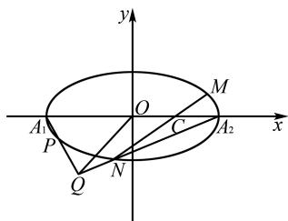

# 一道“斜率比”定值题的解法与推广

# 韩培杰

(安徽省含山中学, 安徽 含山 238100)

摘 要: 在圆锥曲线中, “斜率比”定值问题是高考或各地模拟考试中的重点题型. 文章通过一道高三模拟题, 探究了这类题型解法, 并将试题进行推广和类比得到一般性结论.

关键词: 斜率比; 定值; 解法; 推广

中图分类号：G632

文献标识码:A

文章编号:1008-0333(2025)13-0037-05

江西省南昌市 2024 届高三一模的第 22 题是以椭圆为载体, 探究斜率比是否为定值的经典试题, 下面在探究试题解法的基础上, 将试题结论进行推广和类比, 得到这类问题的一般性结论.

# 1 试题呈现

题目 已知椭圆 $E: \frac{x^2}{a^2} + \frac{y^2}{b^2} = 1 (a > b > 0)$ 的离心率为 $\frac{\sqrt{3}}{2}$ , 左右两顶点分别为 $A_1, A_2$ , 过点 $C(1,0)$ 作斜率为 $k_1 (k_1 \neq 0)$ 的动直线与椭圆 $E$ 相交于 $M, N$ 两点. 当 $k_1 = 1$ 时, 点 $A_1$ 到直线 $MN$ 的距离为 $\frac{3\sqrt{2}}{2}$ .

(1) 求椭圆 E 的标准方程;  
(2)如图1,设点M关于原点的对称点为P,设直线 $A_{1}P$ 与直线 $A_{2}N$ 相交于点Q,设直线OQ的斜率为 $k_{2}$ ,试探究 $\frac{k_{2}}{k_{1}}$ 是否为定值,若为定值,求出定值并说明理由.

text_image

y
O
M
A₁ O C A₂ x
P
Q N

图1 题目图

# 2 解法探究

# 2.1 第(1)问解析

解析 设椭圆 E 的焦距为 $2c(0 < c < a)$ ，依题意得 $\frac{c}{a} = \frac{\sqrt{3}}{2}$ .

由 $k_{1}=1$ ，则直线 MN 的方程为 x-y-1=0.

因为点 $A_{1}$ 到直线 MN 的距离为 $\frac{3\sqrt{2}}{2}$ ,

所以 $\frac{|a + 1|}{\sqrt{2}} = \frac{3\sqrt{2}}{2}$ , 解得 $a = 2$ . 所以 $c = \sqrt{3}$ .

所以 $b^{2}=a^{2}-c^{2}=4-3=1$ .

故椭圆 E 的方程为 $\frac{x^{2}}{4} + y^{2} = 1$ .

# 2.2 第(2)问解析

解法 1 （直曲联立, 韦达代入）设直线 MN 的方程为 $x = my + 1$ , 此时 $k_{1} = \frac{1}{m}$ .

由 $\left\{\begin{aligned}x&=my+1,\\ \frac{x^{2}}{4}&+y^{2}=1,\end{aligned}\right.$ 消去x,整理,得

$$
(m ^ {2} + 4) y ^ {2} + 2 m y - 3 = 0.
$$

设 $M(x_{1},y_{1}), N(x_{2},y_{2}), P(-x_{1},-y_{1})$ ,

则 $\left\{\begin{aligned}y_{1}+y_{2}&=\frac{-2m}{m^{2}+4},\\ y_{1}y_{2}&=\frac{-3}{m^{2}+4}.\end{aligned}\right.$

由题意知 $A_{1}(-2,0)$ , $A_{2}(2,0)$ .

所以直线 $A_{1}P$ 的方程为 $y=\frac{y_{1}}{x_{1}-2}(x+2)$ .

即 $y=\frac{y_{1}}{my_{1}-1}(x+2)$ .

同理直线 $A_{2}N$ 的方程为 $y=\frac{y_{2}}{my_{2}-1}(x-2)$ .

设 $Q(x_0, y_0)$ , 则两直线方程联立, 得

$$
x _ {0} = \frac {2 \left(y _ {1} + y _ {2}\right) - 4 m y _ {1} y _ {2}}{y _ {2} - y _ {1}},
$$

$$
y _ {0} = \frac {y _ {1}}{m y _ {1} - 1} \left(x _ {0} + 2\right) = \frac {4 y _ {1} y _ {2}}{y _ {1} - y _ {2}}.
$$

所以 $k_{2}=\frac{y_{0}}{x_{0}}=\frac{4y_{1}y_{2}/(y_{1}-y_{2})}{[2(y_{1}+y_{2})-4my_{1}y_{2}]/(y_{2}-y_{1})}$

$$
= \frac {4 y _ {1} y _ {2}}{4 m y _ {1} y _ {2} - 2 \left(y _ {1} + y _ {2}\right)} = \frac {3}{2 m}.
$$

又 $k_{1}=\frac{1}{m}$ ，所以 $\frac{k_{2}}{k_{1}}=\frac{3/(2m)}{1/m}=\frac{3}{2}$ 为定值.

解法 2 （设点代入, 截距点差）设 $M(x_{1}, y_{1})$ , $N(x_{2}, y_{2})$ , 则 $P(-x_{1}, -y_{1})$ .

因为 M, C, N 三点共线, 所以 $k_{CM} = k_{CN}$ .

所以 $\frac{y_1}{x_1 - 1} = \frac{y_2}{x_2 - 1}$

即 $x_{1}y_{2} - x_{2}y_{1} = y_{2} - y_{1}$

因为 $\frac{x_{1}^{2}}{4}+y_{1}^{2}=1,\frac{x_{2}^{2}}{4}+y_{2}^{2}=1,$

所以 $x_{1}^{2}=4\left(1-y_{1}^{2}\right)$ , $x_{2}^{2}=4\left(1-y_{2}^{2}\right)$ .

所以 $x_{1}y_{2} + x_{2}y_{1} = \frac{x_{1}^{2}y_{2}^{2} - x_{2}^{2}y_{1}^{2}}{x_{1}y_{2} - x_{2}y_{1}}$

$$
\begin{array}{l} = \frac {4 \left(1 - y _ {1} ^ {2}\right) y _ {2} ^ {2} - 4 \left(1 - y _ {2} ^ {2}\right) y _ {1} ^ {2}}{y _ {2} - y _ {1}} \\ = 4 y _ {2} + 4 y _ {1}. \\ \end{array}
$$

由 $\left\{\begin{aligned}x_{1}y_{2}-x_{2}y_{1}&=y_{2}-y_{1},\\ x_{1}y_{2}+x_{2}y_{1}&=4y_{2}+4y_{1},\end{aligned}\right.$

所以 $\left\{ \begin{array}{l} x_{1}y_{2} = \frac{5}{2} y_{2} + \frac{3}{2} y_{1}, \\ x_{2}y_{1} = \frac{3}{2} y_{2} + \frac{5}{2} y_{1}. \end{array} \right.$

直线 $A_{1}P$ 的方程为 $y=\frac{-y_{1}}{-x_{1}+2}(x+2)$ ,

直线 $A_{2}N$ 的方程为 $y=\frac{y_{2}}{x_{2}-2}(x-2)$ ,

设 $Q(x_0,y_0)$ ，将两直线方程联立，得

$$
\frac {x _ {0} - 2}{x _ {0} + 2} = \frac {y _ {1} (x _ {2} - 2)}{y _ {2} (x _ {1} - 2)} = \frac {x _ {2} y _ {1} - 2 y _ {1}}{x _ {1} y _ {2} - 2 y _ {2}} = \frac {3 y _ {2} + y _ {1}}{y _ {2} + 3 y _ {1}}.
$$

所以 $x_{0}=\frac{4(y_{2}+y_{1})}{y_{1}-y_{2}}.$

代入直线 $A_{2}N$ ，得

$$
y _ {0} = \frac {y _ {2}}{x _ {2} - 2} (x _ {0} - 2) = \frac {y _ {2}}{x _ {2} - 2} \cdot \frac {6 y _ {2} + 2 y _ {1}}{y _ {1} - y _ {2}}.
$$

所以 $k_{2} = \frac{y_{0}}{x_{0}}$

$$
= \frac {y _ {2} / \left(x _ {2} - 2\right) \cdot \left(6 y _ {2} + 2 y _ {1}\right) / \left(y _ {1} - y _ {2}\right)}{4 \left(y _ {2} + y _ {1}\right) / \left(y _ {1} - y _ {2}\right)}
$$

$$
= \frac {y _ {2}}{x _ {2} - 2} \cdot \frac {6 y _ {2} + 2 y _ {1}}{4 (y _ {1} + y _ {2})}
$$

$$
= \frac {y _ {2}}{x _ {2} - 2} \cdot \frac {y _ {1} + 3 y _ {2}}{2 \left(y _ {1} + y _ {2}\right)}.
$$

所以 $\frac{k_{2}}{k_{1}} = \frac{y_{2}/(x_{2}-2) \cdot (y_{1}+3y_{2})/[2(y_{1}+y_{2})]}{y_{1}/(x_{1}-1)}$

$$
= \frac {y _ {1} + 3 y _ {2}}{2 \left(y _ {1} + y _ {2}\right)} \cdot \frac {x _ {1} y _ {2} - y _ {2}}{x _ {2} y _ {1} - 2 y _ {1}} = \frac {y _ {1} + 3 y _ {2}}{2 \left(y _ {1} + y _ {2}\right)} \cdot \frac {3 \left(y _ {1} + y _ {2}\right)}{y _ {1} + 3 y _ {2}}
$$

$= \frac{3}{2}$ 为定值.

解法 3 （设点代入, 定比点差）设 $M(x_{1}, y_{1})$ ,

$N(x_{2},y_{2})$ ，则 $P(-x_{1},-y_{1})$ .

又因为 $C(1,0)$ ,

所以 $\overrightarrow{MC} = (1 - x_1, -y_1), \overrightarrow{CN} = (x_2 - 1, y_2)$ .

设 $\overrightarrow{MC}=\lambda\overrightarrow{CN}$ ，则 $\left\{\begin{aligned}1-x_{1}&= \lambda(x_{2}-1),\\ -y_{1}&= \lambda y_{2}.\end{aligned}\right.$

所以 $\left\{\begin{aligned}x_{1}+\lambda x_{2}&=1+\lambda,\\ y_{1}+\lambda y_{2}&=0.\end{aligned}\right.$

又因为 $\left\{\begin{aligned}\frac{x_{1}^{2}}{4}+y_{1}^{2}&=1,\\ \frac{x_{2}^{2}}{4}+y_{2}^{2}&=1,\end{aligned}\right.$ ①
②

所以由①-②× $\lambda^{2}$ ,得

$$
\frac {x _ {1} ^ {2} - \lambda^ {2} x _ {2} ^ {2}}{4} + y _ {1} ^ {2} - \lambda^ {2} y _ {2} ^ {2} = 1 - \lambda^ {2}.
$$

即 $\frac{(x_1 + \lambda x_2)(x_1 - \lambda x_2)}{4} + (y_1 + \lambda y_2)(y_1 - \lambda y_2)$

$$
= 1 - \lambda^ {2}.
$$

将 $\left\{\begin{aligned}x_{1}+\lambda x_{2}&=1+\lambda,\\ y_{1}+\lambda y_{2}&=0\end{aligned}\right.$ 代入,得

$$
\frac {(1 + \lambda) (x _ {1} - \lambda x _ {2})}{4} = 1 - \lambda^ {2}.
$$

所以 $x_{1}-\lambda x_{2}=4-4\lambda.$

由 $\left\{\begin{aligned}x_{1}+\lambda x_{2}&=1+\lambda,\\ x_{1}-\lambda x_{2}&=4-4\lambda,\end{aligned}\right.$

解得 $\left\{\begin{aligned}x_{1}&=\frac{5}{2}-\frac{3\lambda}{2},\\ x_{2}&=\frac{5}{2}-\frac{3}{2\lambda}.\end{aligned}\right.$

直线 $A_{1}P$ 的方程为 $y=\frac{-y_{1}}{-x_{1}+2}(x+2)$ ,

直线 $A_{2}N$ 的方程为 $y=\frac{y_{2}}{x_{2}-2}(x-2)$ ,

设 $Q(x_0,y_0)$ ，将两直线方程联立，得

$$
\frac {x _ {0} - 2}{x _ {0} + 2} = \frac {y _ {1} (x _ {2} - 2)}{y _ {2} (x _ {1} - 2)}
$$

$$
= - \lambda \cdot \frac {5 / 2 - 3 / (2 \lambda) - 2}{5 / 2 - 3 \lambda / 2 - 2}
$$

$$
= \frac {3 - \lambda}{1 - 3 \lambda}.
$$

所以 $x_0 = \frac{4\lambda - 4}{1 + \lambda}$ .

代入直线 $A_{2}N$ ，得

$$
\begin{array}{l} y _ {0} = \frac {y _ {2}}{x _ {2} - 2} (x _ {0} - 2) \\ = \frac {y _ {2}}{x _ {2} - 2} \left(\frac {4 \lambda - 4}{1 + \lambda} - 2\right) \\ = \frac {y _ {2}}{x _ {2} - 2} \cdot \frac {2 \lambda - 6}{1 + \lambda}. \\ \end{array}
$$

由 $k_{1}=\frac{y_{2}}{x_{2}-1}$ ,

所以 $k_{2} = \frac{y_{0}}{x_{0}} = \frac{y_{2}}{x_{2} - 2}\cdot \frac{\lambda - 3}{2\lambda - 2}.$

所以 $\frac{k_2}{k_1} = \frac{y_2 / (x_2 - 2) \cdot (\lambda - 3) / (2\lambda - 2)}{y_2 / (x_2 - 1)}$

$$
= \frac {x _ {2} - 1}{x _ {2} - 2} \cdot \frac {\lambda - 3}{2 \lambda - 2} = \frac {5 / 2 - 3 / (2 \lambda) - 1}{5 / 2 - 3 / (2 \lambda) - 2} \cdot \frac {\lambda - 3}{2 \lambda - 2}
$$

$= \frac{3\lambda - 3}{\lambda - 3} \cdot \frac{\lambda - 3}{2\lambda - 2} = \frac{3}{2}$ 为定值.

解法 4 （设点对称, 斜率推证）设 $M(x_{1}, y_{1})$ , $N(x_{2}, y_{2})$ , 则 $P(-x_{1}, -y_{1})$ .

因为 M 与 P 关于原点对称, $A_{1}$ 与 $A_{2}$ 关于原点对称,所以 $PA_{1} \parallel MA_{2}$ .

设 $Q(x_0,y_0)$ ，则

$$
k _ {P A _ {1}} = k _ {Q A _ {1}} = k _ {M A _ {2}} = \frac {y _ {0}}{x _ {0} + 2},
$$

$$
k _ {N A _ {2}} = k _ {Q A _ {2}} = \frac {y _ {0}}{x _ {0} - 2}, k _ {2} = \frac {y _ {0}}{x _ {0}}.
$$

所以 $\frac{1}{k_{PA_1}} +\frac{1}{k_{NA_2}} = \frac{x_0 + 2}{y_0} +\frac{x_0 - 2}{y_0} = \frac{2x_0}{y_0} = \frac{2}{k_2}.$

所以 $\frac{2}{k_{2}}=\frac{1}{k_{PA_{1}}}+\frac{1}{k_{NA_{2}}}=\frac{x_{1}-2}{y_{1}}+\frac{x_{2}-2}{y_{2}}.$

又由 $\frac{x_1^2}{4} + y_1^2 = 1$ ，得 $\frac{x_1^2}{4} - 1 = -y_1^2.$

即 $x_{1}^{2} - 4 = -4y_{1}^{2}$

所以 $(x_{1} - 2)(x_{1} + 2) = -4y_{1}^{2}$ 所以 $\frac{x_1 - 2}{y_1} = \frac{-4y_1}{x_1 + 2}$ .

同理 $\frac{x_{2}-2}{y_{2}}=\frac{-4y_{2}}{x_{2}+2}.$

所以 $\left\{ \begin{array}{l} \frac{2}{k_2} = \frac{-4y_1}{x_1 + 2} + \frac{x_2 - 2}{y_2}, \\ \frac{2}{k_2} = \frac{x_1 - 2}{y_1} + \frac{-4y_2}{x_2 + 2}. \end{array} \right.$

由比例性质,得 $\frac{2}{k_{2}}=\frac{-4x_{1}+4x_{2}}{x_{1}y_{2}-x_{2}y_{1}+2y_{2}-2y_{1}}.$

由 $k_{MC} = k_{NC}$ ，得 $\frac{y_1}{x_1 - 1} = \frac{y_2}{x_2 - 1}$

所以 $x_{1}y_{2}-x_{2}y_{1}=y_{2}-y_{1}$ .

所以 $\frac{2}{k_2} = \frac{-4x_1 + 4x_2}{y_2 - y_1 + 2y_2 - 2y_1} = \frac{4(x_2 - x_1)}{3(y_2 - y_1)} = \frac{4}{3k_1}$ .

故 $\frac{k_{2}}{k_{1}}=\frac{3}{2}$ 为定值.

# 3 试题变式

已知双曲线 $E: \frac{x^{2}}{a^{2}} - \frac{y^{2}}{b^{2}} = 1 (a > 0, b > 0)$ 的离心率为 $\frac{\sqrt{5}}{2}$ ，左右两顶点分别为 $A_{1}, A_{2}$ ，过点 $C(1, 0)$ 作斜率为 $k_{1} (k_{1} \neq 0)$ 的动直线与双曲线 E 相交于 M, N 两点。当 $k_{1} = 1$ 时，点 $A_{1}$ 到直线 MN 的距离为 $\frac{3\sqrt{2}}{2}$ 。

(1) 求双曲线 E 的标准方程;  
(2)设点 M 关于原点的对称点为 P, 设直线 $A_{1}P$ 与直线 $A_{2}N$ 相交于点 Q, 设直线 OQ 的斜率为 $k_{2}$ , 试探究 $\frac{k_{2}}{k_{1}}$ 是否为定值, 若为定值, 求出定值并说明理由.

解析 (1) 设双曲线 $E$ 的焦距为 $2c(0 < c < a)$ , 依题意得 $\frac{c}{a} = \frac{\sqrt{5}}{2}$ .

由 $k_{1}=1$ ，则直线 MN 的方程为 x-y-1=0。

因为点 $A_{1}$ 到直线 MN 的距离为 $\frac{3\sqrt{2}}{2}$ ,

所以 $\frac{|a+1|}{\sqrt{2}}=\frac{3\sqrt{2}}{2}$ ，解得a=2，所以 $c=\sqrt{5}$ .

所以 $b^{2}=c^{2}-a^{2}=5-4=1$ .

故双曲线 E 的方程为 $\frac{x^{2}}{4}-y^{2}=1$ .

(2) 设直线 MN 的方程为 $x = my + 1$ ，则 $k_{1} = \frac{1}{m}$ .

由 $\left\{\begin{aligned}x&=my+1,\\ \frac{x^{2}}{4}-y^{2}&=1,\end{aligned}\right.$ 消去x,整理,得

$$
(m ^ {2} - 4) y ^ {2} + 2 m y - 3 = 0.
$$

设 $M(x_{1},y_{1}), N(x_{2},y_{2}), P(-x_{1},-y_{1})$ ,

则 $\left\{ \begin{array}{l} y_{1} + y_{2} = \frac{-2m}{m^{2} - 4}, \\ y_{1}y_{2} = \frac{-3}{m^{2} - 4}. \end{array} \right.$

由题意知 $A_{1}(-2,0)$ , $A_{2}(2,0)$ .

所以直线 $A_{1}P$ 的方程为 $y=\frac{y_{1}}{x_{1}-2}(x+2)$ .

即 $y=\frac{y_{1}}{my_{1}-1}(x+2)$ .

同理直线 $A_{2}N$ 的方程为 $y=\frac{y_{2}}{my_{2}-1}(x-2)$ .

设 $Q(x_{0},y_{0})$ ，则两方程联立解得

$$
x _ {0} = \frac {2 \left(y _ {1} + y _ {2}\right) - 4 m y _ {1} y _ {2}}{y _ {2} - y _ {1}},
$$

$$
y _ {0} = \frac {y _ {1}}{m y _ {1} - 1} \left(x _ {0} + 2\right) = \frac {4 y _ {1} y _ {2}}{y _ {1} - y _ {2}}.
$$

所以 $k_{2} = \frac{y_{0}}{x_{0}} = \frac{4y_{1}y_{2} / (y_{1} - y_{2})}{[2(y_{1} + y_{2}) - 4my_{1}y_{2}] / (y_{2} - y_{1})}$

$$
= \frac {4 y _ {1} y _ {2}}{4 m y _ {1} y _ {2} - 2 \left(y _ {1} + y _ {2}\right)} = \frac {3}{2 m}.
$$

又 $k_{1}=\frac{1}{m}$ ，所以 $\frac{k_{2}}{k_{1}}=\frac{3/(2m)}{1/m}=\frac{3}{2}$ 为定值.

# 4 结论推广

若将试题第(2)问的结论推广为一般椭圆的情形,可有:

结论 1 已知椭圆 $E: \frac{x^{2}}{a^{2}} + \frac{y^{2}}{b^{2}} = 1 (a > b > 0)$ 的左右两顶点分别为 $A_{1}, A_{2}$ ，过点 $C(\nu, 0)$ 作斜率为 $k_{1} (k_{1} \neq 0)$ 的动直线与椭圆 E 相交于 M, N 两点，设点 M 关于原点的对称点为 P，设直线 $A_{1}P$ 与直线 $A_{2}N$ 相交于点 Q，设直线 OQ 的斜率为 $k_{2}$ ，则 $\frac{k_{2}}{k_{1}} = \frac{\nu}{a} + 1$ .

证明 设直线 $MN$ 的方程为 $x = my + \nu$ ，此时 $k_{1} = \frac{1}{m}$

由 $\left\{\begin{aligned}x&=my+\nu,\\ \frac{x^{2}}{a^{2}}+\frac{y^{2}}{b^{2}}&=1,\end{aligned}\right.$ 消去x，整理得

$$
\left(a ^ {2} + b ^ {2} m ^ {2}\right) y ^ {2} + 2 m \nu b ^ {2} y + b ^ {2} \left(\nu^ {2} - a ^ {2}\right) = 0.
$$

设 $M(x_{1},y_{1}),N(x_{2},y_{2}),P(-x_{1}, - y_{1})$

则 $\left\{ \begin{array}{l} y_{1} + y_{2} = -\frac{2m\nu b^{2}}{a^{2} + b^{2}m^{2}}, \\ y_{1}y_{2} = \frac{b^{2}\left(\nu^{2} - a^{2}\right)}{a^{2} + b^{2}m^{2}}. \end{array} \right.$

由题意知 $A_{1}(-a,0)$ , $A_{2}(a,0)$ ，设 $Q(x_{0},y_{0})$ .

由 $k_{NA_{2}} = k_{QA_{2}}$ ，得 $\frac{y_{0}}{x_{0} - a} = \frac{y_{2}}{x_{2} - a}$ ;

由 $k_{PA_1} = k_{QA_1}$ ，得 $\frac{y_0}{x_0 + a} = \frac{y_1}{x_1 - a}$

所以 $\frac{x_0 - a}{y_0} = \frac{x_2 - a}{y_2} = \frac{my_2 + \nu - a}{y_2} = m + \frac{\nu - a}{y_2},$

$$
\frac {x _ {0} + a}{y _ {0}} = \frac {- x _ {1} + a}{- y _ {1}} = \frac {x _ {1} - a}{y _ {1}} = \frac {m y _ {1} + \nu - a}{y _ {1}} = m + \frac {\nu - a}{y _ {1}}.
$$

所以 $\frac{x_0}{y_0} -\frac{a}{y_0} = m + \frac{\nu - a}{y_2},\frac{x_0}{y_0} +\frac{a}{y_0} = m + \frac{\nu - a}{y_1}.$

两式相加,得

$$
\begin{array}{l} \frac {2 x _ {0}}{y _ {0}} = 2 m + \frac {(\nu - a) (y _ {1} + y _ {2})}{y _ {1} y _ {2}} \\ = 2 m + \frac {(\nu - a) (- 2 m \nu b ^ {2}) / (a ^ {2} + b ^ {2} m ^ {2})}{b ^ {2} (\nu^ {2} - a ^ {2}) / (a ^ {2} + b ^ {2} m ^ {2})} \\ = 2 m - \frac {(\nu - a) (2 m \nu)}{\nu^ {2} - a ^ {2}}. \\ \end{array}
$$

所以 $\frac{x_0}{y_0} = m - \frac{(\nu - a)(m\nu)}{\nu^2 - a^2} = m - \frac{m\nu}{\nu + a} = \frac{ma}{\nu + a}$ .

所以 $\frac{y_{0}}{x_{0}}=\frac{\nu+a}{ma}.$

因为 $k_{1}=\frac{1}{m}, k_{2}=\frac{y_{0}}{x_{0}}$ ,

所以 $k_{2}=k_{1}\cdot\frac{\nu+a}{a}$ .

故 $\frac{k_{2}}{k_{1}}=\frac{\nu+a}{a}=\frac{\nu}{a}+1.$

# 5 类比推广

椭圆与双曲线属于“姊妹”圆锥曲线,二者之间的许多性质相类似,类比椭圆的结论1,可以得到双曲线的相应结论.

结论2 已知双曲线 $E: \frac{x^2}{a^2} - \frac{y^2}{b^2} = 1 (a > 0, b > 0)$ 的左右两顶点分别为 $A_1, A_2$ ，过点 $C(\nu, 0)$ 作斜率为 $k_1 (k_1 \neq 0)$ 的动直线与双曲线 $E$ 相交于 $M, N$ 两点，设点 $M$ 关于原点的对称点为 $P$ ，设直线 $A_1 P$ 与直线 $A_2 N$ 相交于点 $Q$ ，设直线 $OQ$ 的斜率为 $k_2$ ，则 $\frac{k_2}{k_1} = \frac{\nu}{a} + 1$ .

按结论 1 的证明过程进行,这里从略.

# 6 结束语

大多经典的数学试题都蕴含着较为丰富的思想方法及规律,需要我们去挖掘、延伸.因此,在平时解题过程中,教师要不断地、适时地把试题推广为一般性结论,并用于解决有关问题,久而久之,就能逐步培养学生灵活多变的思维品质,培养其探索精神和创新意识,从而真正把对能力的培养落到实处,提高其数学学科素养 $^{[1]}$ .

# 参考文献：

[1] 朱彬, 胡晓静. 对一道椭圆联考题的解法与延伸 [J]. 中学数学研究, 2023(07): 56-58.

[责任编辑:李慧娇]