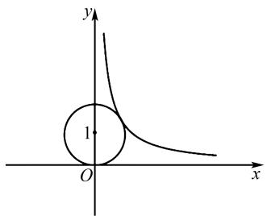
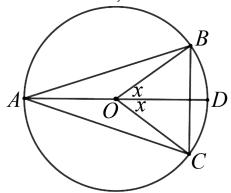

# 一道三角函数最值题的八种解法

# 胡桂东 $^{1}$ 王恩普 $^{2}$

(1. 淮安市教研室, 江苏 淮安 223001;

2. 江苏省淮阴中学教育集团淮安市新淮高级中学, 江苏 淮安 223001)

摘 要:文章对一道三角函数题的解法进行了深入探究,从多角度分析各种解法的形成与运用,提升学生分析问题、解决问题的能力.

关键词:三角函数;最值;解法;

中图分类号：G632

文献标识码:A

文章编号:1008-0333(2025)13-0006-04

近几年的高考试题着重突出了创新导向,加强对思维能力与思维过程的考查,尤其是对于一些重要题型,更是突出了基础知识之间、模块内容之间的融合,体现出对知识交叉、能力的复合考查,而这些能力的训练和提升不是一朝一夕的,是需要平时有意识地培养.本文就一道三角函数最值题,从多角度进行思考,旨在通过解法的探究培养学生的创新能力.

# 1 试题呈现

题目 求函数 $f(x)=2\sin x+\sin 2x$ 的最大值.

本题是在一轮复习过程中出现的一道题,由于已经学过高中数学所有内容,所以在解决本题的过程中,思路相对比较开阔,可以联系到的知识非常广泛,可以借助知识的融合对问题进行深入探究,因此文章从多个角度对问题进行全方位探讨.

# 2 解法探究

解法 1 导数法.

由于本题未能成功转化为 $f(x)=A\sin(\omega x+\varphi)+B$ 与 $f(x)=A\sin^{2}x+B\sin x+C$ 的形式求最值,因此可以借助导数来解决.

由题知 $2\pi$ 是 $f(x)$ 的一个周期，且 $f(x)$ 是奇函数，故只需研究 $f(x)$ 在 $[0, \pi]$ 上的最值.

$$
\begin{array}{l} f ^ {\prime} (x) = 2 \cos x + 2 \cos 2 x \\ = 2 \left(2 \cos^ {2} x + \cos x - 1\right) \\ = 2 (2 \cos x - 1) (\cos x + 1), x \in [ 0, \pi ]. \\ \end{array}
$$

令 $f'(x)=0$ , 得 $\cos x=\frac{1}{2}$ , 且 $\cos x+1\geqslant0$ , 则 $x=\frac{\pi}{3}$ .

当 $0 < x < \frac{\pi}{3}, f'(x) > 0$ ，当 $\frac{\pi}{3} < x < \pi, f'(x) < 0$

则 $f(x)_{\max}=f(\frac{\pi}{3})=\frac{3\sqrt{3}}{2}$ ,

$$
f (x) _ {\min} = f (0) = f (\pi) = 0.
$$

收稿日期:2025-02-05

作者简介:胡桂东,本科,高级教师,从事中学数学教学研究;

王恩普,本科,高级教师,从事中学数学教学研究.

又 $f(x)$ 是奇函数，

所以当 $x \in [-\pi, 0]$ 时， $f(x) \in [-\frac{3\sqrt{3}}{2}, 0]$ .

则有当 $x \in [-\pi, \pi]$ 时， $f(x) \in [-\frac{3\sqrt{3}}{2}, \frac{3\sqrt{3}}{2}]$ .

又 $2\pi$ 是 $f(x)$ 的一个周期,则

$$
f (x) \in \left[ - \frac {3 \sqrt {3}}{2}, \frac {3 \sqrt {3}}{2} \right].
$$

综上, $f(x)_{\max}=\frac{3\sqrt{3}}{2}.$

评注 用导数来处理函数的最值问题较为直接,但是要充分利用三角函数的周期性与奇偶性,这样有利于求函数的极值点及单调区间.

解法 2 万能公式 + 函数.

令 $\tan \frac{x}{2} = t, t \in \mathbf{R}$ , 则

$$
\sin x = \frac {2 t}{1 + t ^ {2}}, \cos t = \frac {1 - t ^ {2}}{1 + t ^ {2}}.
$$

则 $y=\frac{4t}{1+t^{2}}+\frac{4t}{1+t^{2}}\cdot\frac{1-t^{2}}{1+t^{2}}=\frac{8t}{(1+t^{2})^{2}}.$

由于本题求最大值,直接令 t > 0 即可,

$$
\begin{array}{l} y = \frac {8}{(1 / \sqrt {t} + \sqrt {t} \cdot t) ^ {2}} \\ = \frac {8}{\left[ 1 / (3 \sqrt {t}) + 1 / (3 \sqrt {t}) + 1 / (3 \sqrt {t}) + \sqrt {t} \cdot t \right]) ^ {2}} \\ \leqslant \frac {8}{\left. \left\{4 \sqrt [ 4 ]{\left[ 1 / (3 \sqrt {t}) \right] \cdot \left[ 1 / (3 \sqrt {t}) \right] \cdot \left[ 1 / (3 \sqrt {t}) \right] \cdot \sqrt {t} \cdot t} \right\}\right) ^ {2}} \\ = \frac {8}{1 6 \sqrt {1 / 2 7}} \\ = \frac {3 \sqrt {3}}{2}, \\ \end{array}
$$

当且仅当 $\frac{1}{3\sqrt{t}}=\sqrt{t}\cdot t$ ，即 $t=\frac{\sqrt{3}}{3}$ 时取等号.

即 $f(x)_{\max}=\frac{3\sqrt{3}}{2}.$

评注 解法 2 借助于万能公式统一了三角函数名称,通过换元建立起关于 t 的函数,在处理最值时,采用了基本不等式,当然也可以借助于导数来处理.

解法 3 基本不等式 + 辅助角公式.

$$
\begin{array}{l} f (x) = 2 \sin x (1 + \cos x) \\ = \frac {2}{\sqrt {3}} \times \sqrt {3} \sin x (1 + \cos x) \\ \leqslant \frac {2}{\sqrt {3}} \left(\frac {\sqrt {3} \sin x + 1 + \cos x}{2}\right) ^ {2} \\ = \frac {2}{\sqrt {3}} \left[ \frac {1 + 2 \sin (x + \pi / 6) ^ {2}}{2} \right] ^ {2} \\ \leqslant \frac {2}{\sqrt {3}} \cdot \left(\frac {3}{2}\right) ^ {2} \\ = \frac {3 \sqrt {3}}{2}, \\ \end{array}
$$

当且仅当 $\sin(x+\frac{\pi}{6})=1$ , 即 $x=\frac{\pi}{3}+2k\pi$ （ $k\in Z$ ）时取等号.

即 $f(x)_{\max} = \frac{3\sqrt{3}}{2}$

评注 解法3实际上是用了两次不等式放缩，需要保证取等的统一性，因此系数 $\sqrt{3}$ 的配凑显得有难度，而实际上可以用待定系数法来找到 $\sqrt{3}$ . 如果关注上述过程中的两次取等可以发现，假设配凑 $a\sin x(1 + \cos x)$ ，则第一个取等条件为 $a\sin x = (1 + \cos x)$ ，第二个取等条件来自于 $a\sin x + \cos x = \sqrt{a^2 + 1}\sin (x + \varphi)$ ，使得 $\sin (x + \varphi) = 1$ ，其中 $\tan \varphi = \frac{1}{a}$ ，即可解出 $a$ .

解法 4 基本不等式.

$$
f (x) = 2 \sin x (1 + \cos x)
$$

由于求最大值显然在 $\sin x > 0$ 时, 此时 $f(x) > 0$ .

$$
\begin{array}{l} f ^ {2} (x) = 4 \sin^ {2} x (1 + \cos x) ^ {2} \\ = 4 (1 + \cos x) (1 - \cos x) (1 + \cos x) (1 + \cos x) \\ = \frac {4}{3} (1 + \cos x) (3 - 3 \cos x) (1 + \cos x) (1 + \cos x) \\ \leqslant \frac {4}{3} \left(\frac {1 + \cos x + 3 - 3 \cos x + 1 + \cos x + 1 + \cos x}{4}\right) ^ {4} \\ \end{array}
$$

$$
= \frac {4}{3} \left(\frac {6}{4}\right) ^ {4},
$$

当且仅当 $1 + \cos x = 3 - 3\cos x$ ，即 $\cos x = \frac{1}{2}$ 时取等号.

即 $f(x)_{\max}=\frac{3\sqrt{3}}{2}.$

评注 解法 4 通过平方可以将 $\sin x$ 的形式全部用 $\cos x$ 来表示, 从而为后面使用基本不等式创造了条件.

解法 5 数形结合.

令 $m = \sin x, n = 1 + \cos x$ ，由于求最大值，可令 $m > 0$ ，则 $m^2 + (n - 1)^2 = 1$ .

令 s=2mn，即 $n=\frac{s}{2m}$ .

如图1,当曲线 $n = \frac{s}{2m}$ 与圆 $m^2 +(n - 1)^2 = 1$ 相切时， $s$ 取最大值.

text_image

y
1
O
x

图1 解法5示意图

设公共切点为 $P(x_{0},y_{0})$ ， $n'=-\frac{s}{2m^{2}}$

则 $k = -\frac{s}{2x_0^2}$ .

则曲线 $n=\frac{s}{2m}$ 在点 P 处的切线方程为

$$
y - \frac {s}{2 x _ {0}} = - \frac {s}{2 x _ {0} ^ {2}} (x - x _ {0}).
$$

即 $y = -\frac{s}{2x_0^2} x + \frac{s}{x_0}$ ，且与圆 $m^2 + (n - 1)^2 = 1$ 相切.

则 $d = \frac{|s / x_0 - 1|}{\sqrt{\left[s / (2x_0^2)\right]^2} + 1} = 1.$ ①

又 $x_0^2 +\left(\frac{s}{2x_0} -1\right)^2 = 1$ ， ②

由①②,得

$$
\left\{ \begin{array}{l} x _ {0} = \frac {\sqrt {3}}{2}, \\ s = \frac {3 \sqrt {3}}{2}. \end{array} \right.
$$

即 $s_{\max}=\frac{3\sqrt{3}}{2}.$

则 $f(x)_{\max}=\frac{3\sqrt{3}}{2}.$

评注 解法 5 巧妙地通过双换元得到了曲线方程, 将最值问题转化为曲线与曲线相切的情况, 从而得到解决.

解法 6 函数值域.

令 $m = \sin x, n = 1 + \cos x$ ，由于求最大值，可令 $m > 0$ ，则 $m^2 + (n - 1)^2 = 1$ .

令 s = 2mn，

则 $\left(\frac{s}{2n}\right)^2 + n^2 - 2n = 0$ .

即 $s^{2} + 4n^{4} - 8n^{3} = 0.$

即 $s^2 = 8n^3 -4n^4$ ， $n\geqslant 0$

令 $g(n)=8n^{3}-4n^{4}$ ，则

$$
g ^ {\prime} (n) = 2 4 n ^ {2} - 1 6 n ^ {3} = 8 n ^ {2} (3 - 2 n).
$$

令 $g'(n)=0$ , 得 $n=\frac{3}{2}$ .

当 $0 < n < \frac{3}{2}$ 时， $g'(n) > 0$

当 $n > \frac{3}{2}$ 时, $g'(n) < 0$ ,

则 $g(n)_{\max} = g(\frac{3}{2}) = 27 - \frac{81}{4} = \frac{27}{4}$ .

所以 $s_{\max}=\frac{3\sqrt{3}}{2}$ .

评注 解法 6 通过双换元得到与解法 5 一样的曲线方程,但是通过消元的方法将问题转化为求函数的值域,尤其是转化为 $g(n)=8n^{3}-4n^{4}$ 这样比较容易解决的函数,使得问题的解决相对容易.

解法 7 拉格朗日乘数法.

同解法6条件可转化为

$$
m ^ {2} + (n - 1) ^ {2} - 1 = 0.
$$

则 $z = g(m, n) = 2mn (m > 0, n > 0)$ ,

$$
\varphi (m, n) = m ^ {2} + (n - 1) ^ {2} - 1.
$$

记 $F(m,n,\lambda) = 2mn + \lambda [m^2 +(n - 1)^2 -1]$

对 m, n 求导, 得

$$
F _ {m} ^ {\prime} (m, n, \lambda) = 2 n + 2 \lambda m = 0, \tag {①}
$$

$$
F _ {n} ^ {\prime} (m, n, \lambda) = 2 m + 2 \lambda (n - 1) = 0, \tag {②}
$$

$$
F _ {\lambda} ^ {\prime} (m, n, \lambda) = m ^ {2} + (n - 1) ^ {2} - 1 = 0. \tag {③}
$$

由①②③可得 $\left\{\begin{aligned}m&=\frac{\sqrt{3}}{2},\\ n&=\frac{3}{2},\\ \lambda&=-\sqrt{3},\end{aligned}\right.$

则 $z_{\mathrm{max}} = g(\frac{\sqrt{3}}{2},\frac{3}{2}) = 2\times \frac{\sqrt{3}}{2}\times \frac{3}{2} = \frac{3\sqrt{3}}{2}.$

评注 对于已知条件二元方程 $\varphi(x,y)=0$ ，求目标函数 $f(x,y)$ 的极值问题，可以构造拉格朗日函数 $L(x,y,\lambda)=f(x,y)+\lambda\varphi(x,y)$ ，由方程$\left\{ \begin{array}{l} L_{x}^{\prime}(x,y,\lambda) = 0, \\ L_{y}^{\prime}(x,y,\lambda) = 0, \text{可以找出目标函数的极值点}^{[1]}, \\ L_{\lambda}^{\prime}(x,y,\lambda) = 0, \end{array} \right.$

进而求出极值.

解法 8 构造图形 + 琴生不等式.

由于求 $f(x)=2\sin x(1+\cos x)$ 的最大值, 可令 $\sin x>0$ , 由周期性可设 $x\in(0,\pi)$ , 则 $f(x)=2\sin x+\sin2x$ .

如图 2 构造单位圆, 且 AD 为直径, $\angle BOD = \angle COD = x$ , 则 $\angle BOC = 2x$ , $\angle AOB = \angle AOC = \pi - x$ .

text_image

A
O
x
x
B
D
C

图 2 解法 8 示意图

则 $S_{\triangle ABC} = S_{\triangle BOC} + S_{\triangle AOB} + S_{\triangle AOC}$

$$
= \frac {1}{2} \sin 2 x + \frac {1}{2} \sin (\pi - x) + \frac {1}{2} \sin (\pi - x)
$$

$$
= \frac {1}{2} \sin 2 x + \sin x.
$$

由琴生不等式知

$$
\frac {3}{2} \left[ \frac {1}{3} \sin x + \frac {1}{3} \sin (\pi - x) + \frac {1}{3} \sin (\pi - x) \right]
$$

$$
\leqslant \frac {3}{2} \cdot \sin \frac {2 x + \pi - x + \pi - x}{3}
$$

$$
= \frac {3}{2} \times \frac {\sqrt {3}}{2}
$$

$$
= \frac {3 \sqrt {3}}{4},
$$

当且仅当 $2x = \pi - x$ ，即 $x = \frac{\pi}{3}$ 时取等号.

故 $f(x) = 2\sin x + \sin 2x$ 的最大值为 $2\times \frac{3\sqrt{3}}{4} = \frac{3\sqrt{3}}{2}.$

评注 解法 8 的特色是将函数最值问题转化为面积最值问题,巧妙地将数转化为形的问题来处理,而三角形中内接三角形面积的最大值问题也有很多方式来处理,这里采用了琴生不等式来处理较为简洁.

# 3 结束语

在实际的教学过程中,往往对问题的解决仅停留在求出结果,并没有深入地思考.而如何能够对题目的多种解法进行研究,联系其他知识,将问题转化为学过的知识或是容易解决的另外的问题显得特别重要,尤其像本文中数向形的逆向转化,更能够培养学生的创新能力.

# 参考文献：

[1] 陶煜瑾. 例谈拉格朗日乘数法的初等化应用 [J]. 中学数学研究, 2022(12): 34-35.

[责任编辑:李慧娇]