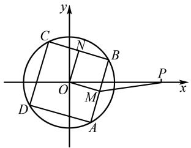
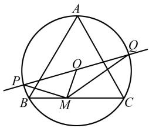
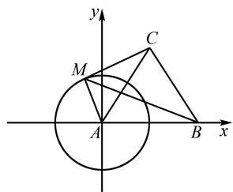
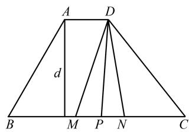

# 不同视角下的平面向量数量积的探究

肖英雪

(上海市陆行中学, 上海 201206)

摘 要:平面向量具有几何和代数的双重性,其涉及的知识点存在广泛交汇,与函数、数列、不等式、解析几何等均有联系.而向量数量积是向量中的重要内容,符合高中数学学科教学基本要求,因此成为考试命题的热点和难点.文章通过对2025年春考第12题的具体分析,体会在不同视角下平面向量数量积的常见解法,帮助学生更好地掌握此类问题的解决策略.

关键词: 向量的数量积; 直接法; 分解法; 投影法

中图分类号：G632

文献标识码:A

平面向量的引入,充分彰显了新教材改革的深度和广度.作为近一个世纪兴起的“向量数学”体系,凭借其优良的运算通性,将数学中的“数量”运算与物理中的“矢量”运算有机结合,充分说明数学作为一门基础性学科的重要地位.向量数量积的学习具有一定灵活性,能有效考查学生的数学核心素养,但如何从多角度、多方位突破难点,实现向量数量积从高维度向低维度的转化,成为教学与学习中的关键要点 $^{[1]}$ .

# 1 试题呈现

题目（2025年上海春考第12题）在平面中， $e_{1}$ 和 $e_{2}$ 是互相垂直的单位向量，向量 a 满足 $|a - 4e_{1}| = 2$ ，向量 b 满足 $|b - 6e_{2}| = 1$ ，求 b 在 a 方向上的数量投影的最大值 \_\_\_\_.

# 2 试题分析

由于 $a, b, e_{1}, e_{2}$ 都不确定, 根据向量模的确定性, 故可采用设向量的方法.

设 $a - 4e_{1} = 2m, b - 6e_{2} = n$ ，则

$$
\boldsymbol {b} \cdot \boldsymbol {a} = 4 \boldsymbol {e} _ {1} \cdot \boldsymbol {n} + 1 2 \boldsymbol {e} _ {2} \cdot \boldsymbol {m} + 2 \boldsymbol {m} \cdot \boldsymbol {n},
$$

文章编号:1008-0333(2025)13-0016-04

$$
\left| \boldsymbol {a} \right| = 2 \sqrt {5 + 4 \boldsymbol {e} _ {1} \cdot \boldsymbol {m}}.
$$

因此 $\frac{\pmb{b}\cdot\pmb{a}}{|\pmb{a}|} = \frac{2e_1\cdot n + 6e_2\cdot m + m\cdot n}{\sqrt{5 + 4e_1\cdot m}}$

$$
\leqslant \frac {\sqrt {5 + 4 e _ {1} \cdot m} + 6 e _ {2} \cdot m}{\sqrt {5 + 4 e _ {1} \cdot m}}
$$

$$
= 1 + \frac {3}{2} \cdot \frac {4 e _ {2} \cdot m}{\sqrt {5 + 4 e _ {1} \cdot m}}
$$

$$
\leqslant 1 + 3 = 4.
$$

即 b 在 a 方向上的数量投影的最大值为 4.

本题也可以根据向量的数量投影的定义,在变化过程中寻找最大值. 当 a 确定时, $6e_{2}$ 在 a 上的投影确定,则 $b-6e_{2}$ 与 a 同向时最大值为 1,而 a 最接近 $e_{2}$ 时, $6e_{2}$ 在 a 上投影最大值为 3,故 $\frac{b\cdot a}{|a|}=\frac{6e_{2}\cdot a}{|a|}+1\leqslant3+1=4.$

涉及向量数量积的问题,如何根据题目特征,从几何视角下,选择恰当的方法成为关键.为了更加深入地理解平面向量数量积,我们尝试用不同的方法来解决这个问题.下面通过一些题目,体会解决此类问题的方法和策略.

收稿日期:2025-02-05

作者简介: 肖英雪, 本科, 一级教师, 从事高中数学教学研究.

# 3 不同视角下的平面向量数量积的多样性和统一性

# 3.1 “直接”视角——直击核心,简洁有力

例 1 （2018 年上海高考第 8 题）在平面直角坐标系中，已知点 $A(-1,0)$ ， $B(2,0)$ ，E, F 是 y 轴上的两个动点，且 $\left|\overrightarrow{EF}\right|=2$ ，则 $\overrightarrow{AE} \cdot \overrightarrow{BF}$ 的最小值为 \_\_\_\_.

解析 由题可设 $E(0,y),F(0,y + 2),\overrightarrow{AE}\cdot \overrightarrow{BF}$ $= -2 + y(y + 2) = (y + 1)^{2} - 3\geqslant -3.$

例 2 在 $\triangle ABC$ 中, M 是 BC 的中点, $\angle A = 120^{\circ}, \overrightarrow{AB} \cdot \overrightarrow{AC} = -\frac{1}{2}$ , 则线段 AM 长的最小值为 \_\_\_\_.

解析 由 $\angle A = 120^{\circ}, \overrightarrow{AB} \cdot \overrightarrow{AC} = -\frac{1}{2}$ 可知

$$
| \overrightarrow {A B} | \cdot | \overrightarrow {A C} | = 1.
$$

所以 $|\overrightarrow{AB}|^2 + |\overrightarrow{AC}|^2 \geqslant 2$ .

所以 $|\overrightarrow{AM}|^2 = \left[\frac{1}{2} (\overrightarrow{AB} +\overrightarrow{AC})\right]^2$

$$
= \frac {1}{4} \left[ | \overrightarrow {A B} | ^ {2} + | \overrightarrow {A C} | ^ {2} + 2 \times \left(- \frac {1}{2}\right) \right] ^ {2} \geqslant \frac {1}{4}.
$$

所以 $|AM|$ 的最小值为 $\frac{1}{2}$ .

感悟 数学知识多源于概念. 就向量而言, 我们从其概念出发, 将相关问题转化为代数式, 进行数量化的整理和化简, 再利用相关知识点解决问题, 这一过程体现出简洁高效的美感.

# 3.2 “平方”视角——平方之力,化繁为简

例 3 已知向量 a, b 满足 $\left|a\right|=1$ , a 与 b 的夹角是 $\frac{\pi}{3}$ ，若对于任意实数 x， $\left|xa+2b\right|\geqslant\left|a+b\right|$ 恒成立，则 $\left|b\right|$ 的取值范围是 \_\_\_\_.

解析 由已知易得: $a \cdot b = \frac{1}{2} |b|$ .

要使 $|xa+2b|^{2}\geqslant|a+b|^{2}$ 恒成立，

即 $x^{2}+2|b|x+3|b|^{2}-|b|-1\geqslant0$ 恒成立.

则 $4|\pmb {b}|^{2} - 4(3|\pmb {b}|^{2} - |\pmb {b}| - 1)\leqslant 0.$

所以 $|b|\geqslant1$ .

例 4 已知 a, b, c 为单位向量, 且满足 $3a + \lambda b$

+7c=0,a与b的夹角为 $\frac{\pi}{3}$ ,则实数 $\lambda=$ \_\_\_\_.

解析 由 $3a + \lambda b + 7c = 0$ ，得 $-7c = 3a + \lambda b$ .

两边平方, 得 $49c^{2}=9a^{2}+\lambda^{2}b^{2}+6\lambda a\cdot b$ .

因为 a, b, c 为单位向量，

所以 $49 = 9 + \lambda^2 +6\lambda \cos \frac{\pi}{3}.$

即 $\lambda^{2}+3\lambda-40=0.$

解得 $\lambda = -8$ 或 5.

感悟 若是与向量的模有关的问题,常常可以将向量平方,因为 $a^{2}=|a|^{2}$ .通过这种方式,能够将向量转化为实数进行运算,从而巧妙地把复杂问题简单化,展现出数学中的对称与平衡之美.

# 3.3 “投影”视角——投影几何,直观透视

例 5 若 A, B, C 三点在圆 O 上, 且 AB = 3, AC = 5, 则 $\overrightarrow{AO} \cdot \overrightarrow{BC}$ 的值是 \_\_\_\_.

解析 因为 O 是三角形的外心, 所以 $\overrightarrow{AO}$ 在 $\overrightarrow{AB}$ 上的数量投影是 $\frac{1}{2}|\overrightarrow{AB}|$ , 在 $\overrightarrow{AC}$ 上的数量投影是 $\frac{1}{2}\overrightarrow{AC}$ .

所以 $\overrightarrow{AO}\cdot\overrightarrow{BC}=\overrightarrow{AO}\cdot(\overrightarrow{AC}-\overrightarrow{AB})$

$$
= \frac {1}{2} | \overrightarrow {A C} | ^ {2} - \frac {1}{2} | \overrightarrow {A B} | ^ {2} = 8.
$$

例 6 在 Rt△ABC 中, AB = 3, AC = 4, BC = 5, 点 M 是 Rt△ABC 外接圆上任意一点, 则 $\overrightarrow{AB} \cdot \overrightarrow{AM}$ 的最大值为 \_\_\_\_.

解析 因为外接圆圆心 O 是 Rt△ABC 斜边上中点, 所以

$$
\begin{array}{l} \overrightarrow {A B} \cdot \overrightarrow {A M} = \overrightarrow {A B} \cdot (\overrightarrow {A O} + \overrightarrow {O M}) \\ = \overrightarrow {A B} \cdot \overrightarrow {A O} + \overrightarrow {A B} \cdot \overrightarrow {O M} \\ = \frac {1}{2} | \overrightarrow {A B} | ^ {2} + \frac {5}{2} \times 3 \cos <   \overrightarrow {A B} \cdot \overrightarrow {O M} > \\ \leqslant \frac {9}{2} + \frac {1 5}{2} = 1 2. \\ \end{array}
$$

感悟 当两个向量中一个不变,另一个在该向量上的投影向量易于分析时,采用投影法求数量积,能将抽象问题可视化,体现出几何与代数的完美结合.

# 3.4 “分解”视角——分而治之，化整为零

例 7 如图 1, 已知点 $P(2,0)$ , 正方形 ABCD 内接于圆 O, 半径为 1, M, N 分别是 AB, BC 的中点,当正方形 ABCD 绕圆心 O 旋转时， $\overrightarrow{PM} \cdot \overrightarrow{ON}$ 的取值范围是 \_\_\_\_.

text_image

y
C
N
B
O
M
P
x
D
A

图 1 例 7 图

解析 因为 $\overrightarrow{PM}\cdot\overrightarrow{ON}=(\overrightarrow{PO}+\overrightarrow{OM})\cdot\overrightarrow{ON}$

$$
= \overrightarrow {P O} \cdot \overrightarrow {O N} + \overrightarrow {O M} \cdot \overrightarrow {O N},
$$

又因为 $\overrightarrow{OM}\perp\overrightarrow{ON}$ ，所以 $\overrightarrow{OM}\cdot\overrightarrow{ON}=0.$

所以 $\overrightarrow{PM} \cdot \overrightarrow{ON} = \overrightarrow{PO} \cdot \overrightarrow{ON} \in [-\sqrt{2}, \sqrt{2}]$ .

例 8 如图 2, 已知 $\triangle ABC$ 是边长为 $2\sqrt{3}$ 的正三角形, PQ 为 $\triangle ABC$ 外接圆 O 的一条直径, M 为 $\triangle ABC$ 边上的动点, 则 $\overrightarrow{PM} \cdot \overrightarrow{MQ}$ 的最大值是 \_\_\_\_.

text_image

A
O
P
B
M
C
Q

图 2 例 8 图

解析 易知 $\triangle ABC$ 的外接圆半径 $r = 2$ ，所以

$$
\begin{array}{l} \overrightarrow {P M} \cdot \overrightarrow {M Q} = (\overrightarrow {P O} + \overrightarrow {O M}) \cdot (\overrightarrow {M O} + \overrightarrow {O Q}) \\ = \overrightarrow {P O} \cdot \overrightarrow {M O} + \overrightarrow {P O} \cdot \overrightarrow {O Q} + \overrightarrow {O M} \cdot \overrightarrow {M O} + \overrightarrow {O M} \cdot \overrightarrow {O Q} \\ = \overrightarrow {O M} \cdot (\overrightarrow {O Q} + \overrightarrow {O P}) + r ^ {2} - \overrightarrow {O M} ^ {2} \\ = 4 - \overrightarrow {O M} ^ {2} \leqslant 3. \\ \end{array}
$$

感悟 分解法的核心是选择两个既知道长度又知道角度的向量作为基底,一般会往特殊图形的边上进行分解.将向量分解为易于处理的分量,逐个击破,展现问题拆解的智慧.

# 3.5 “三点共线”视角——共线之力，一气呵成

例 9 已知 $\triangle ABC$ 是边长为 4 的等边三角形，D, P 是 $\triangle ABC$ 内部两点，且满足 $\overrightarrow{AD} = \frac{1}{4} (\overrightarrow{AB} + \overrightarrow{AC})$ ， $\overrightarrow{AP} = \overrightarrow{AD} + \frac{1}{8} \overrightarrow{BC}$ ，则 $\triangle ADP$ 的面积为（）.

A. $\frac{\sqrt{3}}{4}$

B. $\frac{\sqrt{3}}{3}$

C. $\frac{\sqrt{3}}{2}$

D. $\sqrt{3}$

解析 设 E 是 BC 中点, 所以

$$
\overrightarrow {A D} = \frac {1}{4} (\overrightarrow {A B} + \overrightarrow {A C}) = \frac {1}{2} \overrightarrow {A E}.
$$

因为 $\overrightarrow{AP}=\overrightarrow{AD}+\frac{1}{8}\overrightarrow{BC}$ ,

所以 $\overrightarrow{DP}=\frac{1}{8}\overrightarrow{BC}.$

因此 $\triangle ADP$ 的面积为

$$
\frac {1}{2} | \overrightarrow {A D} | | \overrightarrow {D P} | = \frac {\sqrt {3}}{2} \times \frac {1}{2} = \frac {\sqrt {3}}{4}.
$$

故选 A.

例 10 在 $\triangle ABC$ 中, $\angle A = 90^{\circ}$ , $\triangle ABC$ 的面积为 1. 若 $\overrightarrow{BM} = \overrightarrow{MC}, \overrightarrow{BN} = 4\overrightarrow{NC}$ , 则 $\overrightarrow{AM} \cdot \overrightarrow{AN}$ 的最小值为 \_\_\_\_.

解析 由题知 $S_{\triangle ABC} = \frac{1}{2} |\overrightarrow{AB}| \cdot |\overrightarrow{AC}| = 1.$

所以 $|\overrightarrow{AB}|\cdot|\overrightarrow{AC}|=2.$

因为 $\overrightarrow{BM}=\overrightarrow{MC},\overrightarrow{BN}=4\overrightarrow{NC},$

所以 $\overrightarrow{AM} = \frac{1}{2}\overrightarrow{AC} +\frac{1}{2}\overrightarrow{AB},$

$$
\overrightarrow {A N} = \frac {4}{5} \overrightarrow {A C} + \frac {1}{5} \overrightarrow {A B}.
$$

又因为 $\overrightarrow{AB}\cdot\overrightarrow{AC}=0$ ，

所以 $\overrightarrow{AM} \cdot \overrightarrow{AN} = \frac{2}{5}\overrightarrow{AC}^2 + \frac{1}{10}\overrightarrow{AB}^2$

$$
\geqslant 2 \sqrt {\frac {2}{5} \times \frac {1}{1 0}} \times | \overrightarrow {A C} | \cdot | \overrightarrow {A B} | = \frac {4}{5}.
$$

感悟 利用三点共线的几何性质. 三点共线法的关键在于寻找共线点, 得出系数之和为 1. 借助这一关系快速推导数量积, 体现出几何直观在解题中的巧妙应用.

# 3.6 “坐标”视角——坐标定位 精准求解

例 11 在 Rt △ABC 中, $\angle A = \frac{\pi}{2}$ , AB = 1, AC = 2, M 是 △ABC 内一点, 且 $AM = \frac{1}{2}$ , 若 $\overrightarrow{AM} = \lambda \overrightarrow{AB} + \mu \overrightarrow{AC}$ , 则 $\lambda + 2\mu$ 的最大值 \_\_\_\_.

解析 以点 A 为坐标原点, AB 为 x 轴正半轴, AC 为 y 轴正半轴建立平面直角坐标系.

设点 $M(x,y)$ ，则 $x^{2} + y^{2} = \frac{1}{4}$ 因为 $\overrightarrow{AM}=\lambda\overrightarrow{AB}+\mu\overrightarrow{AC},$

所以 $(x,y)=\lambda(1,0)+\mu(0,2)=(\lambda,2\mu)$ .

所以 $\left\{\begin{aligned}x&=\lambda,\\ y&=2\mu.\end{aligned}\right.$

所以 $\lambda^{2}+(2\mu)^{2}=\frac{1}{4}$ .

所以 $\lambda + 2\mu = \frac{1}{2}\cos \theta + \frac{1}{2}\sin \theta$

$$
= \frac {\sqrt {2}}{2} \sin \left(\theta + \frac {\pi}{4}\right) \leqslant \frac {\sqrt {2}}{2}.
$$

例 12 已知正 $\triangle ABC$ 的边长为 $\sqrt{3}$ ，点 M 是 $\triangle ABC$ 所在平面内的任一动点，若 $|\overrightarrow{MA}| = 1$ ，则 $|\overrightarrow{MA} + \overrightarrow{MB} + \overrightarrow{MC}|$ 的取值范围为 \_\_\_\_.

解析 如图 3, 以点 A 为坐标原点, AB 为 x 轴正半轴建立平面直角坐标系: $B(\sqrt{3}, 0)$ , $C(\frac{\sqrt{3}}{2}, \frac{3}{2})$ .

设点 $M(x,y)$ ，则 $x^{2}+y^{2}=1$ .

则点 M 在单位圆上.

所以 $|\overrightarrow{MA} + \overrightarrow{MB} + \overrightarrow{MC}| = 3\sqrt{(x - \frac{\sqrt{3}}{2})^2 + (y - \frac{1}{2})^2}$ $\in [0,6]$ .

text_image

y
C
M
A
B
x

图 3 例 12 坐标法示意图

感悟 在一些几何图形中研究向量数量积问题,若采用几何方法求解存在困难,可考虑建立坐标系,将问题转化为用向量的坐标运算来加以解决,展现出坐标系的强大工具性.

# 3.7 “极化恒等式”视角——极化恒等,揭示本质

例 13 已知: 在四边形 ABCD 中, $\angle B = 60^{\circ}$ , $AD \parallel BC, AB = 4$ , 若 M, N 是直线 BC 上的动点, 且 $|\overrightarrow{MN}| = 2$ , 则 $\overrightarrow{DM} \cdot \overrightarrow{DN}$ 的最小值为 \_\_\_\_.

解析 DM 与 DN 共起点,且底边长已知,符合极化恒等式的使用条件,先取中点,如图 4,设 MN 的中点为 P,由极化恒等式, $\overrightarrow{DM} \cdot \overrightarrow{DN} = |\overrightarrow{DP}|^{2}$

$-|\overrightarrow{MP}|^{2}=|\overrightarrow{DP}|^{2}-1$ , 当 $DP \perp BC$ 时, $|\overrightarrow{DP}|$ 最小, 所以 $|\overrightarrow{DP}|$ 的最小值即为平行线 AD 和 BC 之间的距离 d, 而 $d=|AB|\sin B=4\sin60^{\circ}=2\sqrt{3}$ .

所以 $\overrightarrow{DM} \cdot \overrightarrow{DN}$ 的最小值为 $(2\sqrt{3})^{2} - 1 = 11$ .

text_image

A
D
d
B
M
P
N
C

图 4 例 13 解析图

感悟 极化恒等式法常用于共起点、底边已知的两个向量的数量积. 运用极化恒等式, 揭示向量数量积的深层结构, 展现数学公式的深刻内涵.

# 4 结束语

综上所述,在求解向量数量积过程中,根据已知条件,尤其是图形的几何特征,选择合适的方法,用数学思想让新问题与已有的知识体系联系起来 $^{[2]}$ ,将陌生的问题转化为熟悉的问题,并严格推理计算,从而解决问题.数学的魅力在于其多样性和统一性,平面向量数量积的不同视角下的解法正是这种魅力的体现.作为数学知识体系中的一个重要组成部分,学习平面向量数量积不仅可以加深学生对数学基础知识的理解,还有助于培养学生严谨的逻辑推理能力,更有利于提高学生的计算水平,增强他们解决问题的能力.同时由于向量数量积在多个学科中有广泛应用,因此掌握这一概念可以帮助学生更好地理解和连接不同学科的知识体系,还能为他们今后的学习打下坚实的基础.

# 参考文献：

[1] 上海市教育委员会教学研究室. 上海市高中数学学科教学基本要求(试验本)[M]. 上海: 华东师范大学出版社. 2021.  
[2] 马烈. 培养发散思维 提升核心素养 [J]. 数理化解题研究, 2024(25): 37-39.

[责任编辑:李慧娇]