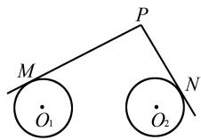
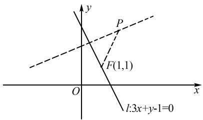
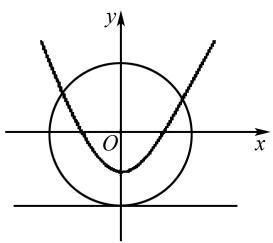
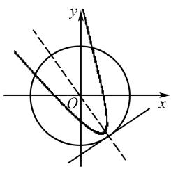

# 圆锥曲线中的动点轨迹问题解题研究

# 包 喜 卢秀敏

(永定第一中学, 福建 龙岩 364100)

摘 要: 解题是数学研究的基本活动, 析题是数学教师的基本功, 解题研究是数学教师必不可少的工作. 良好的解题策略分析与总结, 可以在课堂教学中顺利地引导学生学会思考、学会观察, 体会数学解题的技巧.

关键词: 解题探索; 动点轨迹; 圆锥曲线

中图分类号：G632

文献标识码:A

文章编号:1008-0333(2025)13-0020-04

轨迹问题本质上是对点的动态研究，“点”这一数学对象的本质特征可以有多种等价的表现形式,所以如何选择观察角度才更有利于我们展开对这个对象的研究?对这个问题的回答可能没有统一的标准.但是只要考虑学生的可接受性以及对“动点”认识的不同抽象层次,在分析时既讲清数学对象的本质特征,又能与学生的认知水平相适应,那么在很大程度上,教师的解题分析就是成功的.

# 1 真题再现

题 1 （2021 年全国 I 卷 21 题）在平面直角坐标系 xOy 中，已知点 $F_{1}(-\sqrt{17},0)$ ， $F_{2}(\sqrt{17},0)$ ，点 M 满足 $\left|MF_{1}\right|-\left|MF_{2}\right|=2$ 。记 M 的轨迹为 C.

(1) 求 C 的方程;  
(2) 设点 T 在直线 $x = \frac{1}{2}$ 上, 过点 T 的两条直线分别交 C 于 A, B 两点和 P, Q 两点, 且 $|TA| \cdot |TB| = |TP| \cdot |TQ|$ , 求直线 AB 的斜率与直线 PQ 的斜率之和.

分析 第(1)问入口较宽,很容易就找到解决问题的思路,可以运用定义法(双曲线的定义)和直接法(坐标运算).但是两种解法的运算量差异较大.

题 2 （2021 年浙江卷第 9 题）已知 $a, b \in R$ , ab > 0, 函数 $f(x) = ax^{2} + b (x \in \mathbf{R})$ . 若 $f(s - t)$ , $f(s), f(s + t)$ 成等比数列, 则平面上点 $(s, t)$ 的轨迹是 ( ).

A. 直线和圆

B. 直线和椭圆

收稿日期:2025-02-05

作者简介:包喜,高级教师,从事中学数学教学研究;

卢秀敏,高级教师,从事中学数学教学研究.

基建项目:福建省教育科学“十四五”规划2023年度常规课题项目“基于新课程理念下高中数学大单元教学及评价研究”(项目编号:FJJKZX23-566);2024年龙岩市基础教育教学研究课题项目“基于新教材运用的高中数学思维可视化教学策略研究”(项目编号:JKYJX24-069);2023年龙岩市永定区教育教学课题项目“生态课堂设问的有效预设与调控的研究”(项目编号:ydjxjky23-102).

C. 直线和双曲线

D. 直线和抛物线

分析 本题以二次函数及等比数列为载体,考查动点的轨迹的判定,考查数学运算能力和逻辑推理能力.

福建省于今年开始加入新高考改革行列，在新高考的新要求下，对高考真题的分析引用，有助于教师把握高考考向。笔者以全国Ⅰ卷的第21题和浙江卷第9题为引，对解析几何中的轨迹问题展开一轮复习专题教学。解析几何试题在中学数学中占据核心位置，既是难点也是重点，尤其强调综合应用能力，对学生的逻辑思维与运算技巧提出了较高的要求。探讨动点轨迹的过程，实质上是通过一系列数学运算和逻辑推理来表述数学关系。因此，深入剖析动点轨迹问题，并理清解题思路，对强化学生的逻辑思维和运算能力有着显著的促进作用。在教学中，教师应鼓励学生多做以运算为主体的练习，并培养他们严谨且系统的思维分析能力。

# 2 应用举例

例 1 （2021 年广东梅州模拟）已知动圆 C 过定点 $F(1,0)$ ，且与定直线 x = -1 相切，求动圆圆心 C 的轨迹 E 的方程.

解题缘起 动点轨迹的研究,体现了几何问题代数化的过程,是解析几何中的一种重要思维过程.课程标准要求以学习过的特殊曲线为主,感受数形结合的基本思想,应用逻辑推理、数学运算、直观想象等方法,建立研究模型.

解法 1 依题意可得动圆圆心 C 到定点 $F(1,0)$ 的距离与到定直线 x = -1 的距离相等, 动圆 C 的半径等于其圆心到直线 x = -1 的距离, 这恰好符合抛物线的定义. 因此, 所求轨迹 E 是一个抛物线, 它的焦点是 $F(1,0)$ , 准线是 x = -1, 轨迹方程是 $y^{2} = 4x$ .

此解法在课堂教学中,通常称之为“定义法”,即所研究的动点的轨迹满足已知曲线的定义(直

线、圆、椭圆、双曲线、抛物线），则可用曲线的定义直接写出方程.

解法 2 设动圆圆心 C 为 $(x, y)$ ，依题可得 $\sqrt{(x-1)^{2}+y^{2}} = |x+1|$ ，化简得 $y^{2} = 4x$ ，即为所求动点的轨迹方程.

此解法在课堂教学中,通常称之为“直接法”,即如果动点满足的几何条件是一些几何量的等量关系,则只需将这些等量关系转换为坐标运算,所得方程 $F(x,y)=0$ 即为所求动点轨迹方程.此法注重考查数学运算中的化简能力.

变式 1 求过点 $A(2,0)$ ，且与圆 $x^{2} + 4x + y^{2} - 32 = 0$ 相内切的圆的圆心轨迹方程.

答案 椭圆方程: $\frac{x^{2}}{9}+\frac{y^{2}}{5}=1.$

变式2 求与圆 $x^{2} + 4x + y^{2} + 3 = 0$ 相外切，且与圆 $x^{2} - 4x + y^{2} - 5 = 0$ 相外切的动圆圆心的轨迹方程.

答案 双曲线左支: $x^{2} - \frac{y^{2}}{3} = 1 (x < 0)$ .

变式 3 如图 1 所示, 已知两个单位圆 $O_{1}$ 和圆 $O_{2}$ 的圆心距为 4, P 是两圆外的动点, 过点 P 分别作两圆的切线, M, N 为切点, 使得 $\frac{|PM|}{|PN|} = \sqrt{2}$ . 请建立恰当的平面直角坐标系, 并求点 P 的轨迹方程.

text_image

M
P
N
O₁
O₂

图 1 变式 3 示意图

答案 圆: $(x-6)^{2}+y^{2}=33.$

轨迹的形成是动点遵循特定的规律(即轨迹条件)的移动. 当这个轨迹条件被转化为动点坐标的数学表达式时, 轨迹方程便应运而生. 求解动点轨迹方程是高考中的一个重要考点, 其关键在于将几何图形(形)转化为代数方程(数), 将“曲线”形转化为数学式, 以便通过对方程的分析来理解曲线的本质. 一个求解过程不仅促进了学生数形结合、函数与方程以及化归与转化等数学思想的运用,还锻炼了他们的直观想象、数学抽象、数学运算和数学建模等核心素养.

例 2 若动点 P 与定点 $F(1,1)$ 的距离和动点 P 与直线 $l:3x+y-4=0$ 的距离相等, 则动点 P 的轨迹方程是 \_\_\_\_.

解题缘起 解析几何是数学发展过程中的标志性成果,高中阶段主要研究直线、圆、椭圆、双曲线及抛物线这几个类型的特殊曲线及其基本几何性质.求动点的轨迹方程问题,是以圆锥曲线为背景,是对学生逻辑推理、数学运算、数学抽象、数学建模等能力的综合考查.

思路 1 本题显性条件为“动点到定点的距离等于动点到定直线的距离”，显然符合抛物线的定义，因此设定目标为抛物线方程。观察图 2，发现定点 $F(1,1)$ 不是坐标轴上的点，定直线 $l:3x+y-4=0$ 不是与坐标轴垂直的线，条件表明预设目标——抛物线的标准方程无法求出，需转换途径。

text_image

y
P
F(1,1)
O
x
l:3x+y-1=0

图 2 思路 1 观察图

思路 2 解题目标是“求动点的轨迹方程”，其一般解题步骤为建系设点、列关系式、代入化简、检验结论.

探究过程 设动点 P 坐标为 $(x, y)$ ,

则动点 $P$ 与定点 $F(1,1)$ 的距离为

$$
\left| P F \right| = \sqrt {(x - 1) ^ {2} + (y - 1) ^ {2}}.
$$

动点 P 与直线 $l:3x+y-4=0$ 的距离为

$$
d = \frac {| 3 x + y - 4 |}{\sqrt {3 ^ {2} + 1 ^ {2}}} = \frac {| 3 x + y - 4 |}{\sqrt {1 0}}.
$$

依题可知 $|PF|=d$ ，代入可得

$$
\sqrt {(x - 1) ^ {2} + (y - 1) ^ {2}} = \frac {| 3 x + y - 4 |}{\sqrt {1 0}}.
$$

去分母,得

$$
\sqrt {1 0} \cdot \sqrt {(x - 1) ^ {2} + (y - 1) ^ {2}} = | 3 x + y - 4 |.
$$

两边平方, 得 $10(x^{2}-2x+1+y^{2}-2y+1)=9x^{2}+y^{2}+16+6xy-24x-8y.$

移项,合并同类项得

$$
x ^ {2} + 9 y ^ {2} - 6 x y + 4 x - 1 2 y + 4 = 0.
$$

学生的思维及解题步骤基本上止步于此,将上述方程作为所求轨迹方程.

进一步研究就需得到教师的引导,分组配方可得 $(x-3y)^{2}+4(x-3y)+4=0$ .

再配方可得 $(x-3y+2)^{2}=0.$

故动点 P 的轨迹方程为 $x - 3y + 2 = 0$ .

探究失败后的思考 在数学解题中,部分人秉持“少思多算”这一并非普适的原则. 当解题过程缺乏严密推理仅侧重运算时,就会导致对学生的考查从思维能力转向单纯的数学运算能力. 如此一来,对大部分的学生来说,虽容易得到方程,但往往不是最终所需的方程.

策略转变 “多思少算” 是高考青睐的考查方向,本题展现出较有层次的运算要求,若我们从代数运算方向转移到几何分析,是否能降低解题难度并提高解题准确度呢?

思路3 观察图2, 抽象分析得出结论: 定点 $F(1,1)$ 恰好在直线 $l:3x+y-4=0$ 上, 若 $|PF|=d$ , 则所求动点 P 需在过点 $F(1,1)$ 且与直线 $l:3x+y-4=0$ 垂直的直线上, 故所求动点 P 的轨迹方程为 $y-1=\frac{1}{3}(x-1)$ .

转化条件是数学解题的基本能力要求,代数方法解决几何问题,几何眼光分析代数问题,这是解析几何模块的考查方向.以坐标法为核心和纽带,重视对研究对象几何特征的分析,使学生正确理解几何中的运算,深入理解平面解析几何所蕴含的数学思想,可以强化个人的直观想象能力、数学运算技巧、数学建模方法、逻辑推理能力以及数学抽象能力,从而实现素养的全面提升.

例 3 已知圆的方程为 $x^{2} + y^{2} = 4$ ，若抛物线过点 $A(-1,0)$ ， $B(1,0)$ ，且以圆的切线为准线，则抛物线的焦点的轨迹方程是 \_\_\_\_.

解法缘起 圆锥曲线是解析几何中的核心内容,它兼容着代数与几何的数学思维,对其基本性质的研究,应贯彻“先用几何眼光观察与思考,再用代数运算演绎推理过程”[1]的原则,进一步认识和应用圆锥曲线的基本几何性质,培养学生的直观想象、逻辑推理等素养及理性思维.

探究过程 特殊到一般,以运动的眼光想象、观察、分析研究对象.

诊断分析 目标模糊,代数运算方向不明,无从下手.

探究失败后的思考 常规的代数解法难以列出目标动点所满足的关系式,这促使我们将解题方向从代数运算转向几何分析.解析几何问题的核心在于其几何本质,我们通过直接利用题目中图形的几何性质进行解答,能够巧妙避开复杂的代数运算,进而高效精准地解决问题,实现事半功倍的效果.

策略转变 观察题设条件——圆、切线、抛物线上的点及准线,思考圆的切线的几何意义,以及抛物线定义,可作出图形,如图3、图4所示,进行思维可视化分析.

text_image

y
O
x

图 3 例 3 特殊位置

text_image

y
O
x

图 4 例 3 动点移动效果图

解析 设圆的任意一条切线为 $l$ ，过点 $A$ 作 $AA_{1} \perp l$ ，过点 $B$ 作 $BB_{1} \perp l$ ，过抛物线焦点 $F$ 作 $FF_{1} \perp l$ 则 $AA_{1} \parallel FF_{1} \parallel BB_{1}, FF_{1}$ 过圆心 O, $OF_{1}$ 为梯形 $AA_{1}B_{1}B$ 的中位线, 故

$$
\mid O F _ {1} \mid = \frac {1}{2} (\mid A A _ {1} \mid + \mid B B _ {1} \mid) = R = 2.
$$

所以 $\left|AA_{1}\right|+\left|BB_{1}\right|=4.$

根据抛物线定义可知 $|AF|=|AA_{1}|,|BF|=|BB_{1}|$ .

故 $|FA|+|FB|=|AA_{1}|+|BB_{1}|=4>|AB|=2.$

因此,动点 F 满足到两定点距离之和为常数(该常数大于两定点之间的距离),即符合椭圆定义,故动点 F 的轨迹为以 A,B 为焦点的椭圆,2a=4,2c=2,可易得椭圆方程为 $\frac{x^{2}}{4}+\frac{y^{2}}{3}=1$ . 经检验,F 与 A,B 三点共线时不合题意,舍去.

故所求轨迹方程是 $\frac{x^{2}}{4}+\frac{y^{2}}{3}=1(y\neq0)$ .

华罗庚教授说过,数缺形时少直观,形少数时难入微,数形结合千般好,数形分离万事休.通过“数”来分析“形”所具备的特征,同时,也能够通过图形直观地探索和呈现数量之间的关系.这种“数”与“形”相结合的理念,是从不同视角审视同一问题的两种手段,体现了“用‘数’描述‘形’、以‘形’诠释‘数’”的思维方式,对于激发学生的创新能力具有显著帮助.

# 3 结束语

数学是研究数量关系和空间形式的一门基础科学,具有明确的工具性,在思维转换、基本运算等方面有着明确的考查要求.解析几何内容作为高考六大主题之一,在“动点轨迹”知识块的考查,可难可易,弹性较大,在高二教学及一轮复习中,可将其作为一个微专题展开,既提升学生的逻辑思维能力,又锻炼学生的代数运算能力.

# 参考文献：

[1] 黄跃华. 感悟背景, 突出过程, 融入素养 [J]. 中学数学教学参考, 2019(25): 47-50.

[责任编辑:李慧娇]