# 用线面角推导三射线定理的启示与应用

闵道昱

(大连医科大学, 辽宁 大连 116044)

摘 要:文章通过用线面角证明三射线定理的方法,从证明过程中得到了一些对立体几何求角的新公式,并举例阐释了其应用.

关键词:高中数学;立体几何;三射线定理

中图分类号：G632 文献标识码：A

求空间角一直以来都是立体几何的重要课题.现如今,求空间角的方法主要有等体积法、作辅助线法、公式法(如三余弦定理、三射线定理等)、向量法、立体坐标法等,但是能够直接将条件角与要求的目标角直接联系起来的仅有公式法.本文将集中讨论公式法,用线面角推导三射线定理的同时推出新的求空间角公式.

# 1 预备知识

空间中有三条共起点且不共面的射线,我们不妨设为 OA, OB, OC(如图 1). 三条射线两两之间的夹角存在一种定量关系,而这种定量关系可用三射线定理 $^{[1]}$ 描述. 如果我们设 $\angle AOB = \alpha, \angle BOC = \beta, \angle AOC = \theta$ , 二面角 A - OB - C 为 $\gamma$ , 并且 $\angle AOB, \angle BOC$ 均为锐角, 那么存在关系:

$$
\cos \theta = \cos \alpha \cos \beta + \sin \alpha \sin \beta \cos \gamma . \tag {①}
$$

接下来,我们以线面角为桥梁推导三射线定理.

我们需要用到三余弦定理 $^{[2]}$ : 如果 O 是面上一点, 过点 O 的斜线 OA 在面上的射影为 OB (记点 A

文章编号:1008-0333(2025)13-0024-06

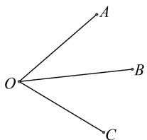

text_image

O
A
B
C

图 1 不共面的三条射线

在面上的投影为点 $A'$ ，OC 为面上的一条直线（如图2），设 $\angle AOB = \alpha, \angle BOC = \beta, \angle AOC = \theta, \angle AOB$ 和 $\angle BOC$ 只能是锐角，那么 $\angle AOC, \angle BOC, \angle AOB$ 三角的余弦关系为 $\cos\theta = \cos\alpha\cos\beta$ .

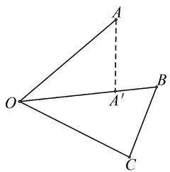

text_image

Geometric diagram showing triangle OAB with auxiliary point A' and extended line to C, labeled with vertices O, A, B, C, and A'.

图 2 三余弦定理模式图

为下文论证方便,我们再证明一个引理.

引理 如果 O 是面上一点, 过 O 的斜线 OA 在面上的射影为 OB, OC 为面上的一条直线(如图 3), 设 $\angle AOB = \alpha, \angle BOC = \beta, \angle AOC = \theta$ , 而且 $\theta < 90^{\circ}$ ,

收稿日期:2025-02-05

作者简介:闵道昱,本科在读.

$\alpha<90^{\circ}$ ，则有 $\beta<90^{\circ}$ ，并且 $\cos\theta=\cos\alpha\cos\beta.$

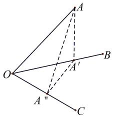

text_image

Geometric diagram showing triangle OAB with auxiliary points A, A', and C, including dashed lines indicating projections or transformations.

图 3 引理模式图

证明 作 $AA' \perp OB$ 于点 $A'$ ，再作 $AA'' \perp OC$ 于点 $A''$ ，连接 $A'A''$ .

因为 OB 是 OA 在平面 OBC 上的射影, $A' \in OB$ ,

所以 $AA' \perp$ 平面 OBC.

又因为 $OC \subset$ 平面 OBC,

所以 $AA' \perp OC.$

又因为 $AA' \perp OC, AA'' \perp OC$ ，且 $AA' \cap AA'' = A, AA', AA'' \subset$ 平面 $AA'A''$ ，得 $OA'' \perp$ 平面 $AA'A''$ .

又因为 $A'A'' \subset$ 平面 $AA'A''$ ,

所以 $OA'' \perp A'A''$ .

则 $\triangle OA'A'$ 是一个直角三角形,而在直角三角形中除了直角之外的另外两个内角均为锐角,也就是说 $\angle BOC<90^{\circ}$ ,即 $\beta<90^{\circ}$ .

由于 $\alpha < 90^{\circ}, \beta < 90^{\circ}, O$ 是面上一点, 过点 O 的斜线 OA 在面上的射影为 OB, 并且 OC 为面上的一条直线, 三余弦定理的条件已经满足, 则有 $\cos\theta = \cos\alpha\cos\beta$ .

# 2 推导三射线定理

下面,我们开始用线面角推导三射线定理.

已知空间中有三条共起点且不共面的射线,分别是 OA, OB, OC. 设 $\angle AOB = \alpha, \angle BOC = \beta, \angle AOC = \theta$ , 并且 $\angle AOB, \angle BOC$ 均为锐角, 即 $\alpha < 90^{\circ}, \beta < 90^{\circ}$ . 过 OB 作平面 AOB 的垂面 h. 这时候可分三种情况(如图 4,5,6):

(1) 射线 OC 和射线 OA 在平面 h 的异侧;  
(2) 射线 OC 和射线 OA 在平面 h 的同侧;

(3) 射线 OC 在平面 h 上.

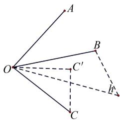

text_image

A
O
B
C'
C
h'

图 4 情况(1)示意图  
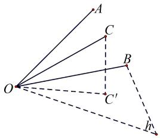

text_image

A
C
B
O
C'
H

图 5 情况(2)示意图  
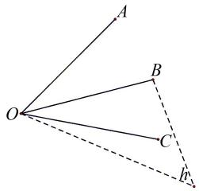

text_image

A
O
B
C
r

图6 情况(3)示意图

在前两种情况中,我们均作射线 OC 在平面 h 上的射影 $OC'$ , 并且设 $\angle COC' = \varphi$ . 于是, $\angle COC'$ 就是射线 OC 和平面 h 所成的线面角, 则 $\angle COC' < 90^{\circ}$ , 即 $\varphi < 90^{\circ}$ .

(i) 我们先讨论情况(1)(如图4).

分别在 OA, OC 上截取 OD = OE, 并设 OD = OE = x, 作 $DD' \perp OB$ 于点 $D'$ , 因为平面 $AOB \cap$ 平面 h = OB, 平面 $AOB \perp$ 平面 $h, DD' \subset$ 平面 AOB,

所以 $DD' \perp$ 平面 h.

作 $EE' \perp OC'$ 于点 $E'$ ，那么 $OE'$ 就是 OE 在平面 h 上的射影.

所以 $EE' \perp$ 平面 h.

连 $D'E'$ , DE(如图7), 设 $\angle D'OE' = \mu$ , 于是不难得到, 在 $\triangle ODD'$ 和 $\triangle OEE'$ 中有

$$
D D ^ {\prime} = O D \sin \angle A O B = x \sin \alpha ,
$$

$$
E E ^ {\prime} = O E \sin \angle C O C ^ {\prime} = x \sin \varphi ,
$$

$$
O D ^ {\prime} = O D \cos \angle A O B = x \cos \alpha ,
$$

$$
O E ^ {\prime} = O E \cos \angle C O C ^ {\prime} = x \cos \varphi .
$$

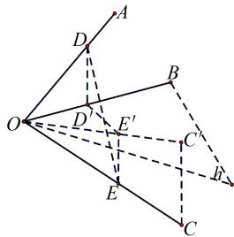

text_image

Geometric diagram with labeled points and dashed lines, likely from a math problem or proof

图 7 情况(1)的辅助线图示(1)

在 $\triangle OD'E'$ 中,由余弦定理知,

$$
D ^ {\prime} E ^ {2} = O D ^ {2} + O E ^ {2} - 2 O D ^ {\prime} \cdot O E ^ {\prime} \cos \angle D ^ {\prime} O E ^ {\prime}.
$$

即 $D'E'^{2}=x^{2}\cos^{2}\alpha+x^{2}\cos^{2}\varphi-2x^{2}\cos\alpha\cos\varphi\cos\mu.$

又因 $DD' \perp$ 平面 h, $EE' \perp$ 平面 h,

所以 $DD' \parallel EE'$ .

所以 $D, D', E, E'$ 四点共面.

于是有 $(DD'+EE')^{2}+D'E'^{2}=DE^{2}$ .

即 $(x\sin \alpha + x\sin \varphi)^2 + x^2\cos^2\alpha + x^2\cos^2\varphi - 2x^2\cos \alpha \cos \varphi \cos \mu = DE^2.$ ②

另外,在 $\triangle ODE$ 中,由余弦定理知,

$$
D E ^ {2} = O D ^ {2} + O E ^ {2} - 2 O D \cdot O E \cdot \cos \angle D O E.
$$

即 $DE^{2}=x^{2}+x^{2}-2x^{2}\cos\theta=2x^{2}-2x^{2}\cos\theta.$ ③

联立②③,得

$$
\cos \alpha \cos \varphi \cos \mu - \sin \alpha \sin \varphi = \cos \theta . \tag {4}
$$

由于 $\angle COC'$ , $\angle BOC$ 均为锐角, 即 $\varphi < 90^{\circ}, \beta < 90^{\circ}$ , 射线 $OC'$ 是射线 $OC$ 在平面 $h$ 上的射影, 射线 $OB$ 在平面 $h$ 上, 那么由上文所证明的引理知, $\angle BOC' = \mu < 90^{\circ}$ , 并且

$$
\cos \angle B O C = \cos \angle C O C ^ {\prime} \cdot \cos \angle B O C ^ {\prime}.
$$

即 $\cos\beta=\cos\varphi\cos\mu.$ ⑤

联立④⑤,得

$$
\cos \alpha \cos \beta - \sin \alpha \sin \varphi = \cos \theta . \tag {6}
$$

即 $\cos\angle AOB\cdot\cos\angle BOC-\sin\angle AOB\cdot\sin\angle COC'$

$$
= \cos \angle A O C.
$$

我们要证明的式子是

$$
\cos \theta = \cos \alpha \cos \beta + \sin \alpha \sin \beta \cos \gamma .
$$

该式子与⑥大体相似,都有 $\cos\theta$ 和 $\cos\alpha\cos\beta$ .

所以,我们需要证明 $\sin\alpha\sin\beta\cos\gamma + \sin\alpha\sin\varphi = 0.$

又因为 $\alpha < 90^{\circ}, \sin\alpha \neq 0$ ，所以我们仅需证明 $\sin\beta\cos\gamma + \sin\varphi = 0$ .

在射线 OA 上取一点 F, 作 $FG \perp OB$ 于点 G. 作 $GH \perp OB$ 并交射线 OC 于点 H, 再作 $HI \perp OC'$ 交射线 $OC'$ 于点 I (这里的射线 $OC'$ 和前文提及的射线 $OC'$ 一样, 都是射线 OC 在平面 h 上的射影), 连 GI (如图8).

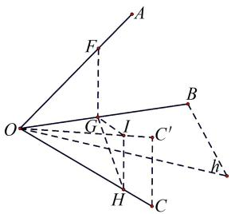

text_image

Geometric diagram with labeled points and lines, likely from a math problem or proof

图 8 情况(1)的辅助线图示(2)

设 OF = a, 因为平面 $AOB \cap$ 平面 h = OB, 平面 $AOB \perp$ 平面 h, $FG \subset$ 平面 $AOB, FG \perp OB$ ,

所以 $FG \perp$ 平面 h.

又因为 $FG \perp OB, GH \perp OB, FG \subset$ 平面 AOB, GH $\subset$ 平面 BOC, 平面 AOB $\cap$ 平面 BOC = OB,

所以 $\angle FGH$ 是半平面 AOB 和半平面 BOC 的二面角 A - OB - C.

设 $\angle FGH=\gamma$ , 因为 $HI\perp OC'$ , 而且射线 $OC'$ 是射线 $OC$ 在平面 $h$ 上的射影, $H\in$ 射线 $OC,I\in$ 射线 $OC'$ , 所以 $HI\perp$ 平面 $h$ .

在 $\triangle OFG$ 中,不难得到

$$
F G = O F \sin \angle A O B = a \sin \alpha ,
$$

$$
O G = O F \cos \angle A O B = a \cos \alpha .
$$

在 $\triangle OGH$ 中, $OH=\frac{OG}{\cos\angle BOC}=\frac{a\cos\alpha}{\cos\beta}$ ,

$$
G H = O G \tan \angle B O C = a \cos \alpha \tan \beta = \frac {a \cos \alpha \sin \beta}{\cos \beta}.
$$

在 $\triangle OHI$ 中, $HI=OH\sin\angle COC'=\frac{a\cos\alpha\sin\varphi}{\cos\beta}$ .

因为 $HI \perp$ 平面 h, $FG \perp$ 平面 h, 所以 $HI \parallel FG$ .

所以 F, G, H, I 四点共面.

又因为 $GI \subset$ 平面 h，

所以 $FG \perp GI.$

即 $\angle FGI = 90^{\circ}$ .

由此可知, $\angle IGH = \angle FGH - \angle FGI = (\gamma - 90)^{\circ}$ .

在 $\triangle IGH$ 中， $\sin \angle IGH = \sin (\gamma - 90)^{\circ} = -\cos \gamma = \frac{HI}{GH} = \frac{a\cos\alpha\sin\varphi/\cos\beta}{a\cos\alpha\sin\beta/\cos\beta} = \frac{\sin\varphi}{\sin\beta}$ .

由此我们得到 $-\cos\gamma=\frac{\sin\varphi}{\sin\beta}.$

也就是 $\sin\beta\cos\gamma + \sin\varphi = 0.$ ⑦

我们联立 ⑥ ⑦, 于是发现 $\cos\theta = \cos\alpha\cos\beta + \sin\alpha\sin\beta\cos\gamma$ 在情况(1)中成立, 即三射线定理在情况(1)中成立.

(ii) 我们来讨论情况(2)(如图5), 其方法与情况(1)类似.

同情况(1)，我们也分别在 OA, OC 上截取 OD = OE，并设 OD = OE = x.

同样作 $DD' \perp OB$ 于点 $D'$ ，因为平面 $AOB \cap$ 平面 h = OB，平面 $AOB \perp$ 平面 $h, DD' \subset$ 平面 AOB，

所以 $DD' \perp$ 平面 h.

作 $EE' \perp OC'$ 于点 $E'$ ，那么 $OE'$ 同样是 OE 在平面 h 上的投影，所以 $EE' \perp$ 平面 h.

连 $D'E'$ , DE(如图9), 同样设 $\angle D'OE' = \mu$ . 同情况 (1), 我们一样可以得到

$$
D D ^ {\prime} = O D \sin \angle A O B = x \sin \alpha ,
$$

$$
E E ^ {\prime} = O E \sin \angle C O C ^ {\prime} = x \sin \varphi ,
$$

$$
O D ^ {\prime} = O D \cos \angle A O B = x \cos \alpha ,
$$

$$
O E ^ {\prime} = O E \cos \angle C O C ^ {\prime} = x \cos \varphi .
$$

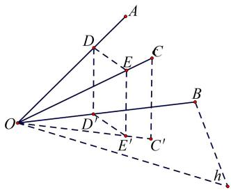

text_image

Geometric diagram with labeled points and dashed lines, likely from a math problem or proof

图 9 情况(2)的辅助线图示(1)

在 $\triangle OD'E'$ 中, $D'E'^{2}=OD'^{2}+OE'^{2}-2OD'\cdotOE'\cos\angle D'OE'$ ,即

$$
D ^ {\prime} E ^ {2} = x ^ {2} \cos^ {2} \alpha + x ^ {2} \cos^ {2} \varphi - 2 x ^ {2} \cos \alpha \cos \varphi \cos \mu .
$$

同理,因为 $DD' \perp$ 平面 h, $EE' \perp$ 平面 h,

所以 $DD' \parallel EE'$ .

所以 $D, D', E, E'$ 四点共面.

与情况(1)不同的是,这里我们得到的关系式是

$$
\left(D D ^ {\prime} - E E ^ {\prime}\right) ^ {2} + D ^ {\prime} E ^ {\prime 2} = D E ^ {2}.
$$

即 $(x\sin \alpha - x\sin \varphi)^2 + x^2\cos^2\alpha + x^2\cos^2\varphi - 2x^2\cos \alpha \cos \varphi \cos \mu = DE^2.$ ⑧

与②式差了一个运算符号.

在 $\triangle ODE$ 中,同情况(1)余弦定理,即

$$
D E ^ {2} = O D ^ {2} + O E ^ {2} - 2 O D \cdot O E \cdot \cos \angle D O E.
$$

即 $DE^{2}=x^{2}+x^{2}-2x^{2}\cos\theta=2x^{2}-2x^{2}\cos\theta.$ ③

联立③⑧可得

$\cos \alpha \cos \varphi \cos \mu + \sin \alpha \sin \varphi = \cos \theta.$ ⑨

也只是和④式差了一个运算符号.

同样因为 $\angle COC'$ , $\angle BOC$ 均为锐角, 即 $\varphi < 90^{\circ}$ , $\beta < 90^{\circ}$ , 而且 $OC'$ 也是 OC 在平面 h 上的射影, OB 在平面 h 上, 那么同情况 (1) 也可以由引理得到

$$
\angle B O C ^ {\prime} = \mu <   9 0 ^ {\circ},
$$

并且 $\cos\angle BOC=\cos\angle COC'\cdot\cos\angle BOC'$ .

即 $\cos\beta=\cos\varphi\cos\mu.$ ⑤

联立⑤⑦,得到

$\cos \alpha \cos \beta + \sin \alpha \sin \varphi = \cos \theta.$ ⑩

和⑥式只差了一个运算符号.

我们依然要证明：

$\cos \theta = \cos \alpha \cos \beta + \sin \alpha \sin \beta \cos \gamma.$ ①

⑩与①大体相似,都有 $\cos\theta$ 和 $\cos\alpha\cos\beta$ . 又因为 $\alpha<90^{\circ},\sin\alpha\neq0$ , 所以我们仅需证

$\sin \beta \cos \gamma = \sin \varphi.$ ⑪

同情况(1)的作法,在射线 OA 上取一点 F,作 $FG \perp OB$ 于点 G. 作 $GH \perp OB$ 并交射线 OC 于点 H,再作 $HI \perp OC'$ 交射线 $OC'$ 于点 $I$ (这里的射线 $OC'$ 也和前文提及的射线 $OC'$ 一样, 均为射线 $OC$ 在平面 $h$ 上的射影), 连接 $GI$ (如图10).

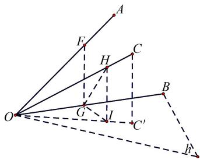

text_image

Geometric diagram with labeled points and lines, likely from a math problem or proof

图 10 情况(2)的辅助线图示(2)

同样设 OF = a，因为平面 $AOB \cap$ 平面 h = OB，平面 $AOB \perp$ 平面 h, FG ⊂ 平面 AOB, FG ⊥ OB，

所以我们同样得到 $FG \perp$ 平面 h.

又因为 $FG \perp OB, GH \perp OB, FG \subset$ 平面 AOB, GH $\subset$ 平面 BOC, 平面 AOB $\cap$ 平面 BOC = OB,

所以 $\angle FGH$ 是半平面 AOB 和半平面 BOC 的二面角 A - OB - C.

同样设 $\angle FGH = \gamma$ ，因为 $HI\perp OC^{\prime}$ ，而且射线 $OC^{\prime}$ 是射线 $OC$ 在平面 $h$ 上的射影， $H\in$ 射线 $OC,I\in$ 射线 $OC^{\prime}$ ，所以同样可得 $HI\perp$ 平面 $h$

在 $\triangle OFG$ 中同情况(1)有

$$
F G = O F \sin \angle A O B = a \sin \alpha ,
$$

$$
O G = O F \cos \angle A O B = a \cos \alpha .
$$

在 $\triangle OGH$ 中， $OH = \frac{OG}{\cos\angle BOC} = \frac{a\cos\alpha}{\cos\beta}$

$$
G H = O G \tan \angle B O C = a \cos \alpha \tan \beta = \frac {a \cos \alpha \sin \beta}{\cos \beta}.
$$

同样,在 $\triangle OHI$ 中,

$$
H I = O H \sin \angle C O C ^ {\prime} = \frac {a \cos \alpha \sin \varphi}{\cos \beta}.
$$

同情况(1)，因为 $HI \perp$ 平面 h, $FG \perp$ 平面 h，所以 $HI \parallel FG$ .

所以 F, G, H, I 四点共面.

又因为 $GI \subset$ 平面 h,

所以 $FG \perp GI.$

即 $\angle FGI = 90^{\circ}$ .

但此时与情况(1)略有不同的是，

$$
\angle I G H = \angle F G I - \angle F G H = (9 0 - \gamma) ^ {\circ}.
$$

在 $\triangle IGH$ 中, $\sin \angle IGH = \sin (90 - \gamma)^{\circ} = \cos \gamma$

$$
= \frac {H I}{G H} = \frac {a \cos \alpha \sin \varphi / \cos \beta}{a \cos \alpha \sin \beta / \cos \beta} = \frac {\sin \varphi}{\sin \beta}. \tag {②}
$$

由此得到 $\cos\gamma=\frac{\sin\varphi}{\sin\beta}.$

即 $\sin\beta\cos\gamma=\sin\varphi.$ ⑪

联立⑩⑪,我们就可以得到

$$
\cos \theta = \cos \alpha \cos \beta + \sin \alpha \sin \beta \cos \gamma . \tag {①}
$$

也就是说,①式在情况(2)中也成立.

(iii)我们再讨论情况(3)(如图6).

我们知道 $\angle AOB, \angle BOC$ 均为锐角，即 $\alpha < 90^{\circ}$ ， $\beta < 90^{\circ}$ ，并且平面 $AOB \perp$ 平面 $h, OB =$ 平面 $AOB \cap$ 平面 $h, OA \subset$ 平面 $AOB$ ，所以 $OB$ 其实与 $OA$ 在平面 $h$ 上的射影重合.

所以,这符合三余弦定理的情况:

$$
\cos \angle A O C = \cos \angle A O B \cdot \cos \angle B O C.
$$

即 $\cos\theta=\cos\alpha\cos\beta.$

而三余弦定理可以理解为当二面角 A - OB - C 为 $90^{\circ}$ 时①式的特殊情况, 即此时 $\cos\gamma = 0$ . 因此, 三射线定理在情况(3)中依然成立.

综上所述,如果空间中有三条共起点且不共面的射线,分别为 OA, OB, OC, 并且 $\angle AOB, \angle BOC$ 均为锐角(设 $\angle AOB = \alpha, \angle BOC = \beta, \angle AOC = \theta$ , 并且设二面角 A - OB - C 为 $\gamma$ ), 那么三射线定理成立: $\cos\theta = \cos\alpha\cos\beta + \sin\alpha\sin\beta\cos\gamma$ .

# 3 用线面角推导三射线定理的中间结论的应用

除了三射线定理,⑥式和⑩式给我们提供了另外一种三条射线两两夹角之间(三条射线不共面)的定量关系.下面以一道例题来展示⑥式的应用.

例题 一个几何体由四面体 $P - ABC$ 和四面体 Q-ABC 构成（如图 11），PA, AB, AC 两两垂直，并且 PA = AB = AC = 1。另外， $\angle BCQ = 45^{\circ}$ ，CQ = 1，并且平面 $BCQ \perp$ 平面 ABC。试求 $\angle PCQ$ 的余弦值。

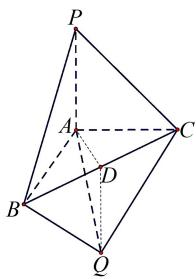

text_image

Geometric diagram of a tetrahedron with labeled vertices P, A, B, C, D, Q and solid/dashed edges indicating 3D perspective.

图11 例题图

解析 因为 PA, AB, AC 两两垂直,

又因为 PA = AB = AC = 1，

所以 $PC = \sqrt{2} PA = BC = \sqrt{2} AC = \sqrt{2}$ ,

$$
\angle P C A = \angle A C B = 4 5 ^ {\circ}.
$$

又因为 $BC = \sqrt{2}$ , $CQ = 1$ , $\angle BCQ = 45^{\circ}$ ,

可知 $BQ \perp CQ$ .

即 $\angle BQC = 90^{\circ}$

作 $QD \perp BC$ 于点 D, 那么 D 就是 BC 的中点.

又因为 AB = AC，

因此 $AD \perp BC.$

因为 $AD \perp BC, QD \perp BC, AD \subset$ 平面 ABC, $QD \subset$ 平面 BCQ, 平面 ABC $\cap$ 平面 BCQ = BC,

所以 $\angle ADQ$ 即为半平面 $ABC$ 和半平面 $BCQ$ 的二面角.

又平面 $BCQ \perp$ 平面 ABC, 则 $\angle ADQ = 90^{\circ}$ .

易知 $AD = QD = \frac{\sqrt{2}}{2}$ .

所以 $AQ = \sqrt{2}AD = 1$ .

于是 $AQ = AC = CQ = 1$ ， $\triangle ACQ$ 是个等边三角形，所以 $\angle ACQ = 60^{\circ}$ .

接下来用上文所说的⑥式来求 $\angle PCQ$ 的余弦值,但在此前必须先说明为什么能使用⑥式.

因为 $PA \perp AB, PA \perp AC, AB, AC \subset$ 平面 $ABC, AB$ $\cap AC = A$ , 所以 $PA \perp$ 平面 ABC.

又 $PA \subset$ 平面 PAC,

所以平面 PAC⊥平面 ABC.

又因为平面 $BCQ \perp$ 平面 ABC, $QD \subset$ 平面 BCQ, $QD \perp BC$ , 平面 $ABC \cap$ 平面 BCQ = BC,

所以 $QD \perp$ 平面 ABC.

因为 $BC \subset$ 平面 ABC,

所以 $\angle BCQ$ 即为 CQ 和平面 ABC 的线面角.

基于平面 $PAC \perp$ 平面 $ABC, \angle BCQ$ 为 $CQ$ 和平面 $ABC$ 的线面角, $PC, CQ$ 分居 $AC$ 的两侧, 以及 $\angle PCA, \angle ACQ, \angle BCQ$ 均为锐角, 我们可以用⑥式来求 $\angle PCQ$ 的余弦值.

于是我们可知

$\cos \angle PCQ = \cos \angle PCA \cdot \cos \angle ACQ - \sin \angle PCA \cdot \sin \angle BCQ.$

由上文我们已知 $\angle PCA = 45^{\circ}$ , $\angle ACQ = 60^{\circ}$ , $\angle BCQ = 45^{\circ}$ , 代入数据, 得 $\cos \angle PCQ = \frac{\sqrt{2} - 2}{4}$ .

# 4 结束语

本文创新性地利用线面角,为三射线定理的证明提供了一种新的方法,并且从中得到了除三射线定理之外的另一种三条射线两两夹角之间(三条射线不共面)的定量关系,为立体几何求角提供了一种新的思路.在立体几何求解中,若各条件角之间联系不明显,且三射线定理难以应用时,可以考虑本文提出的新的公式.

# 参考文献：

[1] 姚素娟, 蔡建华. 利用三射线定理巧求空间角 [J]. 高中数学教与学, 2022(03): 30-32.

[2] 吴江. 例谈应用三余弦定理突破立体几何结构难点 [J]. 数学通讯, 2022(13): 14-17.

[责任编辑:李慧娇]