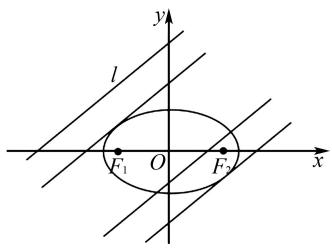
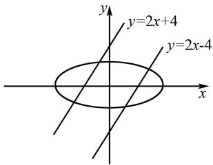

# 直线与椭圆综合问题的解题技巧

张明凤

(江苏省江阴市第二中学, 江苏 江阴 214400)

摘 要:在高中数学学习中,处理直线与椭圆的综合问题是一个关键,这些问题不仅考验学生对几何概念的理解和应用能力,还涉及代数运算和逻辑推理的深入掌握.文章通过对直线与椭圆综合问题的深入分析,探讨解题技巧,并提供具体的教学实践建议,以此提高学生的数学素养和解题能力.

关键词:高中数学;直线与椭圆;解题技巧;综合问题

中图分类号：G632

文献标识码：A

文章编号:1008-0333(2025)13-0047-03

高中数学中,直线与椭圆的综合问题一直是解析几何教学的重点和难点,通常涉及几何形状的位置关系、方程求解以及最值问题等 $^{[1]}$ . 掌握解题技巧对于学生来说至关重要,不仅能够帮助学生更有效地解决数学问题,还能够培养他们的逻辑思维和创新能力. 因此,系统研究直线与椭圆的综合问题及其解题技巧,对于数学学习和学生学科素养的提升具有重要的意义.

# 1 图形观察法

图形观察法是一种直观的解题方法,它主要依赖于对几何图形的观察和理解.在解决直线与椭圆的综合问题时,通过观察直线与椭圆相交、相切以及相离等情况,学生可以直观地感受并理解它们之间的关系 $^{[2]}$ .在某些情况下,也可以通过图形观察来将问题简化,比如通过平移、旋转翻折图形等方法来找到更简单的解题路径.

例如,已知平面中有一条直线 $l:4x-5y+m=0$

和一个椭圆 $C: \frac{x^{2}}{25} + \frac{y^{2}}{9} = 1$ ，请写出当参数 m 取不同的值时，直线 l 与椭圆 C 之间公共点的存在情况，如果有公共点，请求出公共点的坐标（如图 1）.

text_image

y
l
F₁ O F₂ x

图 1 直线 l 与椭圆 C 的位置关系

在处理这个问题时,图形观察法是一个非常直观高效的方法.如图1所示,首先,绘制出椭圆C和直线l的草图.由于椭圆C的长半轴长度为5,短半轴长度为3,可以在坐标系中画出椭圆的大致轮廓.直线l的倾斜程度也可以确定,将直线上下平移对比观察可以大概判断直线l与椭圆C的位置关系.直线l可以表示为 $y=kx+b$ 的形式,其中 $k=\frac{4}{5}$ 是斜率, $b=\frac{m}{5}$ 是纵轴上的截距.这样,就可以确定椭

收稿日期:2025-02-05

作者简介: 张明凤, 本科, 一级教师, 从事高中数学教学研究.

圆的大小、形状、位置以及直线 l 的倾斜程度. 接着平移直线 l, 通过比较观察直线 l 与椭圆 C 的特殊交点, 例如顶点或与坐标轴的交点等, 若 B = 0, 则直线 l 通过椭圆的中心; 若 $b = \pm 3$ , 则直线 l 将经过椭圆的上或下顶点. 下一步在图 1 中标出直线 l 与椭圆 C 的交点的大致位置, 联立方程组 $C: \frac{x^{2}}{25} + \frac{y^{2}}{9} = 1$ 和 $l: 4x - 5y + m = 0$ , 通过根的判别式来确定公共点的个数或者求出交点的具体坐标.

图形观察法是一种基于直观和经验的解题方法,它要求学生通过观察几何图形的位置关系来识别问题的关键特征和潜在的解题路径.一般情况下,需要根据题目条件先绘制一个与题意相符的草图,确定几何图形的大概位置与数量关系,再结合代数方法联立方程组、化简求值、回代找点来精确求解.掌握这种方法不但可以帮助学生加快解题速度,也可以帮助学生对抽象的几何图形有一个更直观深入的理解,进而提升学生的数学思维.

# 2 代数计算法

代数计算法是解决直线与椭圆的综合问题的根本与核心,它涉及方程的建立、消元和求解等多方面的问题.在解题时,首先根据直线与椭圆的定义建立相应的方程,再通过消元法,将问题转化为利用一元二次方程求解交点的坐标,利用根的判别式来判断直线与椭圆的位置关系,这样就可以将几何问题转化为代数问题,从而简单高效地找到问题的解决方法 $^{[3]}$ .

例如,已知平面内有一椭圆 C 的标准方程为 $\frac{x^{2}}{4} + \frac{y^{2}}{3} = 1$ , 过点 $P(2,1)$ 的一条直线 l 与椭圆 C 在第一象限相切于点 M, 请求出点 M 的坐标.

对于这个问题,由于直线 l 的位置以及倾斜程度都是不确定的,使用抽象的几何方法难度较大,所以可以转变思路,使用直截了当的代数方法,在此不

妨设切线 l 的解析式为 $y = kx + m$ ，又由于直线 l 过点 $P(2,1)$ ，可得 $1 = 2k + m$ 。接下来，将直线 l 的方程 $y = kx + m$ 与椭圆 C 的方程 $\frac{x^{2}}{4} + \frac{y^{2}}{3} = 1$ 联立，化简整理可以得到 $(3 + 4k^{2})x^{2} + 8kmx + 4m^{2} - 12 = 0$ 。此时，切忌急忙地计算出答案，而是应该先写出根的判别式 $\Delta = (8mk)^{2} - 4(3 + 4k^{2})(4m^{2} - 12)$ 。因为直线与椭圆相切，所以应该只有一个公共点，将文字语言转化为符号语言就是 $\Delta = 0$ ，将式子代入从而求得 $m^{2} = 3 + 4k^{2}$ 。此时将前面已经得到的 $1 = 2k + m$ 与 $m^{2} = 3 + 4k^{2}$ 两式联立计算可得到： $k = -\frac{1}{2}$ ，m = 2。将 $k = -\frac{1}{2}$ ，m = 2 代入未知的直线解析式 y = kx + m 中，得到切线的方程为 $y = -\frac{1}{2}x + 2$ 。进一步整理得到 $x^{2} - 2x + 1 = 0$ ，解得 x = 1。求得 x 的值后，我们需要将其回代到直线方程中求得对应的 y 值。这一步骤确保了我们找到的是直线与椭圆方程共同的解，即交点的坐标。将横坐标 x = 1 代入切线的方程可得纵坐标 $y = \frac{3}{2}$ ，即切点 $M(1, \frac{3}{2})$ ，所以直线 l 的方程为 $y = -\frac{1}{2}x + 2$ ，切点 M 的坐标 $(1, \frac{3}{2})$ 。

代数计算方法是解决直线与椭圆问题的核心技巧,它通过将几何问题转化为代数问题来求解.这种方法的优势在于其精确性和普适性,能够处理各种复杂的问题.在解析几何中,代数方法通常涉及以下步骤:建立方程组、消元、求解一元二次方程以及回代求解.使用代数方法,学生可以精确地找到直线与椭圆的交点,这种方法在解析几何中是解决此类问题的基础,同时掌握这种方法对于提高学生的数学思维和解题能力至关重要.

# 3 几何变换法

几何变换法是一种通过改变几何图形的形状、位置或大小来简化问题的方法 $^{[4]}$ . 在解决直线与椭圆的问题时,可以利用平移、旋转或缩放等变换,将复杂图形转化为更易于分析的形式.通过平移直线或椭圆,可以调整它们的位置关系,使交点更易求解;旋转则可以改变直线与椭圆的相对方向,有助于揭示隐藏的几何特性;缩放则可以调整图形的比例,便于观察和计算.这种方法有助于直观理解问题,提高学生的抽象思维能力.

例如,已知椭圆 $C:\frac{x^{2}}{16}+\frac{y^{2}}{9}=1$ , 以及一条直线 l: $y=2x+4$ , 请求出直线 l 关于原点 O 的对称直线 L 与椭圆 C 的交点(如图 2).

text_image

y
y=2x+4
y=2x-4
x

图 2 关于原点对称的两直线与椭圆

分析题目可以发现,题目中已知直线与要求的直线关于原点 O 对称,根据这一条件可以识别出此题需要使用到几何变换法中的反射变换.通过反射变换,我们可以找到对称直线 L 的方程,最后将对称直线 L 的方程代入椭圆 C 方程,求解交点.第一步我们需要利用直线的对称性求解对称直线的方程.因为直线 l 的方程为 $y = 2x + 4$ ,所以关于原点 C 对称的直线 L 将具有相同的斜率,即 k = 2,但纵轴截距变为相反数,即 b = -4.因此,对称直线 L 的方程为 y = 2x - 4.这一步也可以通过坐标的变换来验证.如果点 $(x, y)$ 在直线 l 上,那么点 $(-x, -y)$ 将在对称直线 L 上,这样就可以验证第一步反射变换的正确性.接下来将对称直线 L 的方程 y = 2x - 4 代入椭圆 C 方程 $\frac{x^{2}}{16} + \frac{y^{2}}{9} = 1$ 可以得到 $\frac{x^{2}}{16} + \frac{(2x - 4)^{2}}{9} = 1$ ,展开并化简上述方程,求出 x 值.在这一步一定要注意的是,不要忘记把根的判别式 $\Delta$ 列出来并与 0 作比较,从而确定对称直线 L 与椭圆 C 一定有公共点. 接下来进行求值, 求出 x 的值后, 回代到对称直线 L 的方程 y = 2x - 4 中, 得到交点坐标.

在解析几何中,几何变换法是一种强大的解题工具,它通过改变坐标系或图形的位置、形状来简化问题.几何变换具有很强的普适性,它不局限于对称性问题,还可以应用于平移、旋转等其他类型的变换.在处理直线与椭圆的综合问题时,首先考虑是否存在简化问题的几何变换,这可以大大减少计算量.灵活运用几何变换法可以使得问题变得更加易于处理,同时也能培养几何直觉和解决问题的能力.

# 4 结束语

总之,直线与椭圆的综合问题作为高中数学的重难点,其解题技巧的掌握对于提升学生的数学能力具有至关重要的作用 $^{[5]}$ .系统的理论分析和丰富的实例演示,能够揭示图形观察法、代数计算法和几何变换法在解决这类问题中的应用价值.希望本文的研究,能够为教师提供教学参考,在教学实践中帮助学生对这些方法做到融会贯通,更好地培养学生的数学思维和解题能力.

# 参考文献：

[1] 高成龙. 直线与圆锥曲线的几类综合题型 [J]. 高中数理化, 2023(21): 35-38.  
[2] 张国坤. 圆锥曲线综合问题的一项编制技术 [J]. 数学通讯, 2017(14):48-52.  
[3] 李传文. 解直线与椭圆综合问题通法探究 [J]. 高中数理化, 2016(04):9.  
[4] 邹少兰.“直线与椭圆综合问题中参量的选择”课例评析[J].中学数学月刊,2019(12):27-29.   
[5] 李燕祥, 叶朝伦. 对直线与椭圆综合问题的探究 [J]. 中学数学教学参考, 2021(06): 56-57.

[责任编辑:李慧娇]