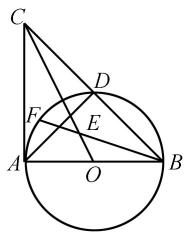
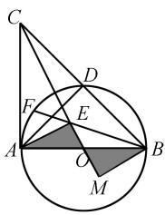
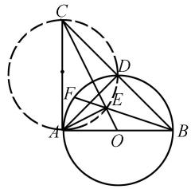
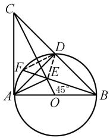
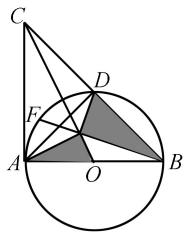
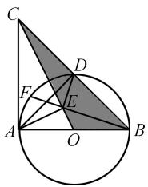
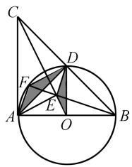

# “卷进”核心素养 突出能力考查

——2024 年福建省中考数学几何压轴题赏析

# 毛行锋

(闽清县城关中学, 福建 福州 350800)

摘 要:2024年福建省中考数学压轴题是一道经典的几何问题. 对于此题中的比值问题, 主要思考方向是相似三角形的对应边成比例、三角函数比值或比例的性质. 证相似时, 需找对应角证相等或对应边成比例, 再根据条件推导关键结论, 正推逆推相结合. 解答压轴题需要注重审题, 条件结论很重要, 多转化, 多迁移, 抽丝剥茧找关键; 分板块, 聚焦点, 集中火力攻难点. 压轴题是多个知识点的有机结合, 在解题过程中, 要先抽丝剥茧, 把思路搞清楚, 再把解题过程分成几个板块逐个击破, 对于一些关键难点, 还要把它先分割, 然后独立出来集中精力思考.

关键词: 压轴题; 几何问题; 核心素养; 解法; 赏析

中图分类号：G632

文献标识码：A

文章编号:1008-0333(2025)14-0063-03

2024 年福建中考数学第 25 题是一道几何压轴题,其综合性较强,承载着一定的选拔性功能,大部分学生感觉解题压力很大,甚至直接放弃解答.事实上,这道题的难度并不大,大部分学生通过适当的解题训练,就非常有可能正确解决此题.追“根”溯“源”,笔者发现这是一道好题,其命制和考查的目的在于“卷进”数学核心素养,突出几何综合能力考查,具有一定的研究价值.

# 1 原题再现

(2024年福建省中考数学第25题)如图1,在 $\triangle ABC$ 中, $\angle BAC=90^{\circ},AB=AC$ ,以 $AB$ 为直径的 $\odot O$ 交 $BC$ 于点 $D,AE\perp OC$ ,垂足为 $E,BE$ 的延长线 $\widehat{AD}$ 于点 $F$ .

(1) 求 $\frac{OE}{AE}$ 的值；  
(2) 求证: $\triangle AEB \sim \triangle BEC$ ;   
(3) 求证: AD 与 EF 互相平分.

text_image

Geometric diagram showing a circle with inscribed triangle and labeled points A, B, C, D, E, F, O

图 1 中考数学第 25 题图

# 2 思路分析

从图形结构特征可以看出, $\triangle ABC$ 是等腰直角三角形,AD是斜边上的高线.由此易知 $\triangle ABD$ 和 $\triangle ACD$ 也是等腰直角三角形.除此之外,根据圆的有关性质易得到相似三角形.

# 2.1 第(1)问的求解思路

在解决数学问题时,教师应引导学生从题目的叙述开始,让学生熟悉题目并理解所求问题与已知条件之间的逻辑关系.对于此问题,线段 OE 和 AE 是同一直角三角形的两条边,即 $\angle OAE$ 的正切值.

收稿日期:2025-02-15

作者简介:毛行锋,本科,中学一级教师,从事初中数学教学研究.

解决此题最直接的思路是找等角转化,根据已知条件可发现 $\angle OCA$ 的正切是容易得到的.此外,也可以这样考虑,线段OE和AE是 $\triangle AOE$ 的两条边,因此可利用相似三角形的性质,找到与其相似的 $\triangle COA$ ,从而得到 $\frac{OE}{AE}=\frac{OA}{AC}=\frac{1}{2}$ .在解决问题的过程中,须从不同角度思考,多方位寻找解决问题的方法 $^{[1]}$ .

# 2.2 第(2)问的求解思路

从图形结构特征及已知条件可以看出,此题有多种证明方法,旨在考查学生分析问题和解决问题的能力,即如何从结论出发,倒着分析;或从条件出发,顺着分析;或从结论条件出发综合分析.

思路1（逆推分析）欲证 $\triangle AEB\sim \triangle BEC$ ，只需证明 $\angle AEB = \angle BCE,\angle EAB = \angle EBC$ ，可证明 $\angle ABE$ $+\angle EBC = \angle ABC = 45^{\circ},\angle OEB = \angle BCE + \angle EBC,$ 即证 $\angle OEB = 45^{\circ} = \angle OBC$ ，只需证明 $\angle BOE$ $= \angle COB$ ，即证明 $\frac{OB}{OC} = \frac{OE}{OB}$ .在此待证的比例式中，注意到 $OA = OB$ ，因此可把 $OB$ 用 $OA$ 替换，得到 $\frac{OA}{OC}$ $= \frac{OE}{OA}$ ，只需 $\triangle AOE\sim \triangle COA$ ，此为第(1)问所解决问题

思路2 欲证 $\triangle AEB \sim \triangle BEC$ ，只需证明 $\angle OEB = 45^{\circ}$ ，易联想到等腰直角三角形。根据 $AE = 2OE$ ， $\angle AOE = 90^{\circ}$ 及 $O$ 是 $AB$ 的中点，不难想到倍长中线法，如图2所示。具体证明思路如下：过点 $B$ 作 $BM \perp CO$ ，交 $CO$ 的延长线于点 $M$ 。易证 $\triangle BOM \cong \triangle AOE$ ，所以 $BM = AE = 2OE = EM$ ，所以 $\triangle BME$ 是等腰直角三角形，所以 $\angle OEB = 45^{\circ}$ 。

text_image

Geometric diagram with labeled points and shaded regions, likely from a math problem or proof

图2 思路2示意图

点评 在以上两种解题思路中,思路1更能体现学生的思维能力,其思维含量大,也能够体现前后问题的衔接.第(2)问的证明可化归到第(1)问所证明的相似三角形,而且不需要添加辅助线.思路2也是比较自然的,由第(1)问求解出的线段2倍关系,结合图形条件联想到构造倍长中线,进而利用等腰直角三角形得到 $45^{\circ}$ 角,从而破题.虽然两种解法有异,但都是从结论的逆推入手的.由此可以看出,为有效解决问题,一定要做好推理和分析,结论的逆向推导更能体现解决问题的目标性.

# 2.3 第(3)问的求解思路

欲证明 AD 与 EF 互相平分, 只需连接 DF, DE, 证明四边形 AFDE 是平行四边形即可. 具体解题思路分析如下: 易知 $\angle AEF = 45^{\circ}$ , 因为 $\angle DFB = \angle DAB = 45^{\circ}$ , 所以 $\angle DFB = \angle AEF$ , 所以 $DF \parallel AE$ . 在此基础上, 只要证明 DF = AE 或 $AF \parallel DE$ 即可解决问题. 显然, 证明 DF = AE 相对困难, 此处优先考虑证明 $AF \parallel DE$ . 欲证明 $AF \parallel DE$ , 已知 $\angle AFE = 90^{\circ}$ , 只需证 $\angle FED = \angle BED = 90^{\circ}$ , 或证明 $\angle ADE = \angle DAF$ . 考虑到 $\angle DFE = 45^{\circ}$ , 只需证明 $\triangle DEF$ 是等腰直角三角形. 为此, 只需要证明 EF = DE, 或证明 $\angle CED = 45^{\circ}$ , 或证明 $\angle EDF = 45^{\circ}$ .

# 2.3.1 利用四点共圆证明 $AF \parallel DE$

根据图形结构特征, 易发现 A, C, D, E 四点共圆, 如图 3 所示. 故可以考虑利用四点共圆转化角证明平行. 具体证明过程如下: 因为 AB 是 $\odot O$ 的直径, 所以 $\angle CDA = \angle CEA = 90^{\circ}$ , 所以 A, C, D, E 四点共圆, 所以 $\angle ADE = \angle ACE = \angle DBF = \angle DAF$ , 从而易知 $AF \parallel DE$ .

text_image

Geometric diagram with labeled points and circles, showing triangle relationships and intersections

图 3 利用四点共圆证明示意图

# 2.3.2 利用垂径定理证明 $ED = EF$

易知 $\angle AEF = 45^{\circ}$ , 所以 $\angle DFE = \angle AEF$ , 即 $DF \parallel AE$ , 又因为 $AE \perp CO$ , 从而 $DF \perp CO$ . 根据垂径定理可得 $CO$ 垂直平分 $DF$ , 从而可得 $EF = DE$ . 具体证明过程如下: 如图 4, 连接 $DE, EF$ . 因为 $\angle BEO = \angle DAB = 45^{\circ}$ , 所以 $AE \perp BE$ , 所以 $\angle AEF = \angle DAB = \angle DFB = 45^{\circ}$ , 所以 $DF \parallel AE$ , 所以 $AE \perp CO$ , 所以

CO 垂直平分 DF, 从而可得 ED = EF.

text_image

C
D
F
E
A
O
45°
B

图 4 利用垂径定理证明示意图

# 2.3.3 利用相似三角形的性质证明 $\angle BED = 90^{\circ}$

如图 5, 连接 DE. 易知 $\triangle AEB \sim \triangle BEC$ , 所以 $\frac{BE}{AE} = \frac{BC}{AB} = \sqrt{2}$ , 所以 $\frac{BD}{AO} = \frac{2BD}{AB} = \sqrt{2}$ , 所以 $\frac{BE}{AE} = \frac{BD}{AO}$ , 从而可知 $\angle EBD = \angle EAO$ , 所以 $\triangle BDE \sim \triangle AOE$ , 所以 $\angle BED = \angle AEO = 90^{\circ}$ .

text_image

Geometric diagram showing a circle with inscribed triangle and shaded regions, labeled with points A, B, C, D, O, F.

图 5 证明 $\angle BED = 90^{\circ}$ 示意图

# 2.3.4 利用相似三角形的性质证明 $\angle CED = 45^{\circ}$

如图 6, 连接 DE. 易得 $\triangle CAE \sim \triangle COA$ , 由相似三角形的性质可知 $CE \cdot CO = CA^{2} = CD \cdot CB$ , 所以 $\triangle CDE \sim \triangle COB$ , 所以 $\angle CED = \angle CBO = 45^{\circ}$ .

text_image

Geometric diagram showing a circle with inscribed triangle and shaded region, labeled with points A, B, C, D, E, F, O.

图6 证明 $\angle CED = 45^{\circ}$ 示意图

# 2.3.5 利用相似三角形的性质证明 $\angle EDF = 45^{\circ}$

如图 7, 连接 OD, DE, DF, AF, 易知 $\angle EOD = \angle FAD$ , 所以 $\frac{AF}{OE} = \frac{2AF}{AE} = \sqrt{2}$ , 又因为 $\frac{AD}{OD} = \sqrt{2}$ , 所以 $\frac{AF}{OE} = \frac{AD}{OD}$ , 所以 $\triangle ADF \sim \triangle ODE$ , 所以 $\angle EDF = \angle ADO = 45^{\circ}$ .

当然,第(3)问还有很多种解法,这里不一一展

text_image

Geometric diagram with labeled points and shaded regions, likely from a math problem or proof

图 7 证明 $\angle EDF = 45^{\circ}$ 示意图

示. 解题是一种实践性技能, 学生可以通过模仿和实践学会任何一种实践技能. 在初中数学教学中, 教师可以通过训练, 让学生在有限的时间内准确地找到问题的切入点, 充分发挥自身的数学素养, 快速展现思维分析过程, 从而达到高效解题的目的 $^{[2]}$ .

# 3 教学启示

在几何问题教学中,教师可通过“会想”“会画”“会说”“会写”四个步骤引导学生学习.“会想”是发展几何推理的逻辑源头,即想一想如何由结论出发倒着分析、从条件出发顺着分析、从结论和条件出发综合分析.“会说”是“会写”的前提,即能用自己的语言说出分析几何问题的思路、说出解决问题的大致过程,进而形成几何证明的思路.“会写”就是将符号语言、图形语言和文字语言进行整合,将整个几何证明过程用规范的几何语言进行书写,使整个几何证题过程清晰且严谨.

# 4 结束语

由以上解题过程可以看出,几何压轴题的思维量比较大,综合性较强,对学生而言具有一定的难度.在初中数学教学中,教师要引导学生克服对这类题型的畏难心理,注重对几何基础知识、基本技能、基本方法和几何模型的理解与掌握,通过一题多思、多题一思等训练,培养学生的数学核心素养,提高其分析问题和解决问题的能力.

# 参考文献：

[1] 波利亚. 怎样解题: 数学思维的新方法 [M]. 涂弘, 马承天, 译. 上海: 上海科技教育出版社, 2011.  
[2] 张景中. 数学家的眼光 [M]. 北京: 中国少年儿童出版社, 2007.

[责任编辑:李慧娇]