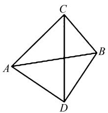
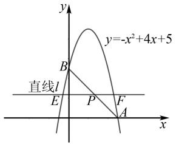
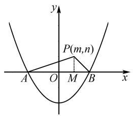

# 一元二次方程根的判别式在初中数学解题中的应用

# 嵇红娟

(江苏省南京市溧水区云鹤初级中学, 江苏 南京 211200)

摘 要:在初中数学中,一元二次方程根的判别式可用于判断一元二次方程是否有实数根以及实数根的个数,是一元二次方程中非常重要的概念.事实上,判别式在初中数学中的应用场景非常广泛,是解答初中数学问题的重要工具和桥梁.基于此,文章立足初中数学教学实践,依托相关习题,展示判别式在探寻数量关系、求代数值、求参数范围和求参数最值方面的应用,以此提高学生分析问题和解决问题的能力,提升学生的数学核心素养.

关键词:一元二次方程;判别式;解题;应用

中图分类号：G632

文献标识码:A

文章编号:1008-0333(2025)14-0011-03

对于一元二次方程 $ax^{2} + bx + c = 0 (a \neq 0)$ , $b^{2} - 4ac$ 叫做此一元二次方程根的判别式, 通常用 “ $\Delta$ ”表示. 通过比较判别式的值与 0 的大小关系, 可以确定一元二次方程是否有实数根以及有几个实数根 $^{[1]}$ . 判别式的值与 0 的大小关系有大于、小于和等于三种情况, 这是解答初中数学习题的重要隐含条件. 在初中数学教学中, 为使学生充分认识判别式在解题中的应用价值, 掌握相关的解题思路, 教师应注重判别式在解题中的应用, 提高学生运用这一隐含条件的意识及应用能力, 以此提升学生的解题能力.

# 1 利用判别式探寻参数关系

在初中数学中,探寻参数关系的一般思路是作差、作商构建新的数学式,通过比较与0或1的关系而得出对应的结论 $^{[2]}$ .但是对于部分综合性较强的习题,涉及一元二次方程与平面几何图形知识,探寻参数关系具有一定的复杂性,需要先运用几何知识推理证明,理顺角度、线段等之间的逻辑关系和数量关系,将得到的关系作为一元二次方程的辅助条件,

而后以判别式为依托进行判断. 在教学过程中, 教师应引导学生把握运用判别式探寻参数关系的关键点, 立足一元二次方程根的情况, 构建与判别式有关的不等或相等关系, 得出最终结果.

例 1 如图 1, 在四边形 ACBD 中, BC = a, AC = b, AB = c, 且关于 x 的方程 $(a + c)x^{2} + 2bx + c = a$ 有两个相等的实根. 若 CD 平分 $\angle ACB, AD \perp BD, AD$ 与 BC 为方程 $x^{2} - 2mx + n^{2} = 0$ 的两根, 探究 m 和 n 的数量关系, 并说明理由.

natural_image

Geometric diagram of a rhombus with vertices labeled A, B, C, D (no text or symbols beyond labels)

图 1 四边形 ACBD 示意图

解析 本题是一道一元二次方程与平面几何融合的综合性问题,考查的知识点较多,主要包括一元二次方程、勾股定理、圆的性质等知识.解答该题的关键在于先运用判别式判断 $\triangle ABC$ 的形状,得出A,

收稿日期:2025-02-15

作者简介:嵇红娟,硕士,一级教师,从事初中数学教学研究.

B, C, D 四点共圆, 然后借助圆的性质得出 AD = BC,
而后再次运用判别式计算、分析得出结果.

因为关于 x 的方程 $(a+c)x^{2}+2bx+c=a$ 有两个相等的实根，所以 $\Delta=(2b)^{2}-4(a+c)(c-a)=4b^{2}+4(a^{2}-c^{2})=0$ ，化简可得 $a^{2}+b^{2}=c^{2}$ 。由勾股定理逆定理可知 $\triangle ACB$ 为直角三角形，其中 $\angle ACB=90^{\circ}$ 。

因为 $AD \perp BD$ , 所以 $\angle ADB = 90^{\circ}$ , 即 $\angle ACB + \angle ADB = 180^{\circ}$ , 则 $A, B, C, D$ 四点共圆. 又因为 $CD$ 平分 $\angle ACB$ , 所以 $\angle ACD = \angle BCD$ , 所以 $AD = BD$ , 即方程 $x^{2} - 2mx + n^{2} = 0$ 有两相等实根, 所以 $\Delta = (2m)^{2} - 4n^{2} = 4m^{2} - 4n^{2} = 0$ , 即 $m^{2} = n^{2}$ . 由 $AD + BD = 2m > 0$ , $m > 0$ , 则 $n \neq 0$ . 当 $n > 0$ 时, $m = n$ ; 当 $n < 0$ 时, $m = -n$ .

# 2 利用判别式求代数式的值

代数式求值是初中数学中较为常见的问题,主要考查整式及分式的相关运算、整体代入思想等 $^{[3]}$ . 代数式求值问题灵活多样,有些问题命题角度较为新颖,虽然都是代数式求值问题,但是其所给的已知条件较为抽象,技巧性较强,采用常规方法往往难以找到突破口. 针对这样的问题,需要结合题干进行转化,而后构造一元二次方程,运用判别式挖掘参数之间的内在关系,通过讨论、计算,求出最终的值. 在教学过程中,教师应注重根据习题的难易程度,为学生详细展示解题过程,给学生留下深刻印象,加深学生对所学知识的理解.

例2 已知 $a, b$ 为正整数，且满足 $\frac{a + b}{a^2 + ab + b^2} = \frac{4}{49}$ ，则 $a + b$ 的值为（ ）.

A. 10

B. 12

C. 14

D. 16

解析 本题所给已知条件较少, 比较抽象, 对学生而言难度较大. 解题时需要根据题干已知条件引入正整数 k, 借助题干中的等式构建 a、b 之间的关系, 通过转化得出 $a + b$ 、ab 的表达式并构造一元二次方程, 结合一元二次方程有两个正整数解的条件, 利用判别式求出 k 的取值范围, 并逐一验证满足条件的 k 的值, 从而得出结果.

由 $\frac{a + b}{a^2 + ab + b^2} = \frac{4}{49}$ 变形得到 $49(a + b) = 4(a^2$

$+ab+b^{2}$ ). 因为 a, b 为正整数, 则存在正整数 k 满足 $a+b=4k, a^{2}+ab+b^{2}=49k$ , 即 $(a+b)^{2}-ab=49k$ , $ab=(a+b)^{2}-49k=16k^{2}-49k$ . 设关于 x 的方程 $x^{2}-4kx+(16k^{2}-49k)=0$ 有两个正整数解, 则 $\Delta=16k^{2}-4(16k^{2}-49k)\geqslant0$ , 解得 $0\leqslant k\leqslant\frac{49}{12}$ . 由于 k 为正整数, 则 k 可取 1, 2, 3, 4, 其中当 k 分别为 1, 2, 3 时, 方程 $x^{2}-4kx+(16k^{2}-49k)=0$ 无正整数根. 当 k=4 时, 方程 $x^{2}-4kx+(16k^{2}-49k)=0$ 为 $x^{2}-16x+60=0$ , 解得 $x_{1}=10, x_{2}=6$ , 则 $a+b=4k=4\times4=16$ , 选择 D.

# 3 利用判别式求参数范围

与参数范围有关的问题是初中数学常见问题之一,其考查的知识点较多,解题思路灵活多样.在解决与二次函数有关的参数范围问题时,一般需根据题意,利用数形结合思想寻找参数之间的不等关系,然后通过解不等式解决问题.当题干中涉及一元二次方程根与系数之间的关系时,应结合图象对题干条件进行等价转化,借助判别式构建不等关系,以此求得最终的结果.此种解题思路不太常见,在教学过程中,教师应注重解题引导,对关键环节给予必要的指导和点拨,使学生真正理解.

例 3 如图 2, 已知抛物线 $y = -x^{2} + 4x + 5$ 与 x 轴正半轴, y 轴分别交于 A、B 两点, 直线 l 在 x 轴上方并与 x 轴平行, 与抛物线分别交于 $E(x_{1}, y_{1})$ , $F(x_{2}, y_{2})$ , 与直线 AB 交于点 $P(x_{3}, y_{3})$ , 若整数 m 满足等式 $m(x_{1} + x_{2}) = x_{3}$ , 则 m 的取值范围是 \_\_\_\_.

text_image

y
y=-x²+4x+5
B
直线l
E
P
F
A
x

图 2 抛物线与直线 l 的关系示意图

解析 本题考查的知识点较多,综合性较强,难度较大.在求解过程中,需要根据题意画出函数图象,明确函数、直线之间的大致位置关系,构建对应的方程,并运用已知条件进行等价转化,以判别式为桥梁,求出 m 的取值范围.

根据题意,令 $-x^{2}+4x+5=0$ , 解得 $x_{1}=-1, x_{2}=5$ , 则 $A(5,0)$ . 令 x=0, 则 y=5, $B(0,5)$ . 设直线 AB 的方程为 $y=kx+b$ , 将 A、B 两点坐标代入得到 $\left\{\begin{aligned}5k+b=0,\\ b=5,\end{aligned}\right.$ 解得 $\left\{\begin{aligned}k&=-1,\\ b&=5.\end{aligned}\right.$ 从而可知直线 AB 的方程为 $y=-x+5$ . 设直线 l 的方程为 $y=n(n>0)$ , 根据题意可得 $y_{3}=-x_{3}+5=n$ , 则 $x_{3}=5-n$ . 联立方程组 $\left\{\begin{aligned}y&=-x^{2}+4x+5,\\ y&=n,\end{aligned}\right.$ 从而 $x^{2}-4x+n-5=0, \Delta=(-4)^{2}-4(n-5)=36-4n>0$ , 从而可得 n<9. 又因为 $x_{1}+x_{2}=4, m(x_{1}+x_{2})=x_{3}$ , 所以 4m=5-n, n=5-4m. 由 0<n<9 可得 0<5-4m<9, 解得 $-1<m<\frac{5}{4}$ .

# 4 利用判别式求参数最值

与参数有关的最值问题在初中数学中出现的频率较高,解题中常用的知识点有二次函数、三角形三边之间的关系及其他平面几何图形的性质,解题思路分为代数和几何两种思路.其中代数思路主要通过点坐标、数的运算将要求的参数转化成代数式,利用代数式的特点确定最值;几何思路需要结合平面几何图形,通过分析、推理出点或者线段的特殊关系,求出对应参数的最值 $^{[4]}$ .当然,部分问题可能需要将两种思路结合起来.

例 4 已知二次函数 $y = x^{2} - a (a > 0)$ 与 x 轴交于 A、B 两点 (A 在 B 的左侧)，平面上有任意点 P，若满足 PA = 2PB，则 $\triangle PAB$ 面积的最大值为 \_\_\_\_（用含有 a 的代数式表示）.

解析 从已知条件来看,此题创设的情境并不复杂,是二次函数与三角形相结合的问题.在解题过程中,可以画出对应的图形,设出点P的坐标,借助“PA=2PB”确定点P坐标满足的条件.同时,利用勾股定理表示出三角形的面积代数式,结合点P坐标满足的条件,可计算出三角形面积的最大值.

如图3, 设点 $P(m, n)$ . 令 $x^{2} - a = 0$ , 解得 $x = \pm \sqrt{a}$ , 所以 $A(-\sqrt{a}, 0)$ , $B(\sqrt{a}, 0)$ , $AB = 2\sqrt{a}$ . 过点 P 向 x 轴作垂线, 垂足为点 M, 则 $M(m, 0)$ . 由勾股定理可得 $PA^{2} = PM^{2} + AM^{2} = n^{2} + (m + \sqrt{a})^{2}$ , $PB^{2} = PM^{2} + BM^{2} = n^{2} + (\sqrt{a} - m)^{2}$ . 由 PA = 2PB, 则 $PA^{2}$

text_image

y
P(m,n)
A O M B x

图 3 二次函数图象和 $\triangle APB$ 的关系示意图

$= 4PB^{2}$ ，所以 $n^2 +(m + \sqrt{a})^2 = 4[n^2 +(\sqrt{a} -m)^2 ]$ ，展开得 $m^2 +2\sqrt{a} m + a + n^2 = 4m^2 -8\sqrt{a} m + 4a + 4n^2$ ，整理得 $3m^{2} - 10\sqrt{a} m + 3a + 3n^{2} = 0$ ，此一元二次方程有实根，则 $\triangle = (-10\sqrt{a})^2 -4\times 3(3a + 3n^2)\geqslant 0$ ，整理得 $16a - 9n^{2}\geqslant 0$ ，则 $-\frac{4\sqrt{a}}{3}\leqslant n\leqslant \frac{4\sqrt{a}}{3}$ 即 $0\leqslant |n|\leqslant \frac{4\sqrt{a}}{3}$ 又由 $S_{\triangle ABP} = \frac{1}{2} AB\cdot |n| = \sqrt{a}\cdot |n|$ ，当 $|n|$ 最大时 $S_{\triangle ABP}$ 最大，则其最大值为 $S_{\triangle ABP} = \sqrt{a}\cdot \frac{4\sqrt{a}}{3} = \frac{4}{3} a.$

# 5 结束语

判别式是一元二次方程的重要知识点,是解答初中数学问题的重要工具.在初中数学教学中,为使学生能够灵活利用判别式解答相关问题,教师应要求学生牢记判别式的计算公式,明确判别式表示的代数意义和几何意义.同时,为提高学生利用判别式解决问题的能力,教师还应多为学生展示判别式不同的应用情形,让学生从中体会应用方法,积累应用经验与技能,不断提高学生运用所学知识分析问题和解决问题的能力,提升其数学核心素养.

# 参考文献：

[1] 李德江. 根的判别式应用中应注意的几个问题 [J]. 数理天地(初中版), 2024(1): 2-3.  
[2] 王小学, 王书丽. 巧用判别式求解代数式的最值问题 [J]. 初中数学教与学, 2021(7): 41.  
[3] 苏如祥. 妙用判别式, 巧解数学题 [J]. 语数外学习 (初中版), 2020(11): 19-20.   
[4] 张田田. 根的判别式在解题中的应用 [J]. 初中生世界, 2020(35): 47-49.

[责任编辑:李慧娇]