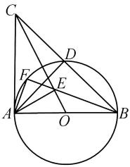
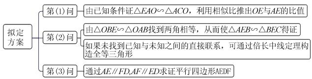
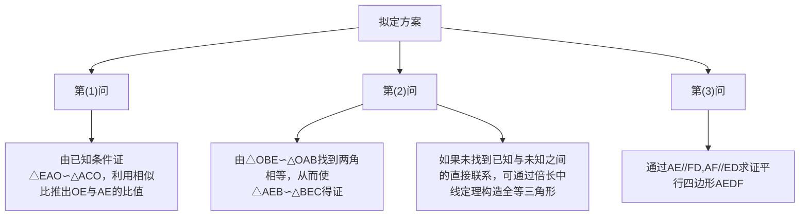
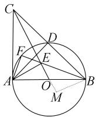
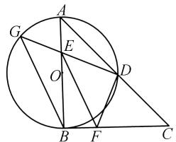

# 基于波利亚解题理论的中考数学试题分析

——以福建省 2024 年中考数学第 25 题为例

# 李见英

(贵州师范大学数学科学学院, 贵州 贵阳 550025)

摘 要:在初中数学教学中,培养学生的解题能力非常重要.基础知识和基本技能的掌握需要在解题过程中实现.波利亚“怎样解题表”呈现了一系列对解题过程极具帮助性的典型思维活动,为学生解题提供了一种行之有效的思维路径,它也是教师开展解题教学的有效工具.基于波利亚的解题理论,笔者以2024年福建省中考数学第25题为例,通过“弄清问题、拟定计划、实现计划、回顾”四个步骤探索解题思路的自然生成过程,以期促进教师的“教”与学生的“学”,不断提高学生运用所学知识分解问题和解决问题的能力,提升学生的数学核心素养.

关键词: 波利亚解题理论; 中考数学; 解题思路

中图分类号：G632

文献标识码：A

文章编号:1008-0333(2025)14-0059-04

在初中数学教学中,常常遇见学生陷入以下解题困境:拿到题不知如何入手,或不重视题干条件导致读完题目毫无思路又不断重读,或由于忽视答题目标,根据已知条件写了一长串的解答过程但不知道哪一步对解题是有用的,没有清晰的解题思路,只是凭主观感觉知道什么就写什么.波利亚《怎样解题》一书是数学教育和思维训练领域的经典著作,深入探讨了数学解题过程中的思维方法和规律.笔者以波利亚的解题思想为核心,尝试运用其提出的“怎样解题表”求解2024年福建省中考数学第25题,以此提高学生的解题能力,促进学生全面发展.

# 1 波利亚“怎样解题表”

波利亚是美籍匈牙利数学家、教育家,他非常重视解题在数学学习中的作用,致力于探索解题过程的一般规律,创造了“怎样解题表”,其揭示了解决数学问题的思维过程和思维方法,为解决数学问题指明了方向,具体内容见表1.

表 1 怎样解题表

<table><tr><td>步骤</td><td>环节</td><td>提示语与建议</td></tr><tr><td rowspan="3">一</td><td rowspan="3">弄清问题</td><td>未知数是什么?已知数是什么?条件是什么?</td></tr><tr><td>可能满足什么条件?</td></tr><tr><td>画草图,引入适当的符号.</td></tr><tr><td>二</td><td>拟定计划</td><td>1你是否见过类似的模型或题型?2你是否能联想起有关的定理和公式?3看着未知数,试想出一个具有相同未知数或相似未知数的熟悉的问题.4换一个方式叙述这个问题,回到定义看看!5你知道什么与此有关的问题吗?6你能否解决这个问题的一部分?7先解决一个特例试试.8你能否想出适于确定未知数的其他数据?9你是否利用了全部的条件?</td></tr><tr><td>三</td><td>实现计划</td><td>实现你的求解计划,检验每一步骤.你能否清楚地看出这一步骤是正确的?你能否证明这一步骤是正确的?</td></tr><tr><td>四</td><td>回顾</td><td>解答本题的关键之处是什么?你能否检验这个论证?你能否用不同的方法推导出这个结果?你能否把这个结果或方法用于其他问题?</td></tr></table>

收稿日期:2025-02-15

作者简介: 李见英, 研究生, 从事中学数学教学研究.

# 2 “怎样解题表”在中考试题中的应用

# 2.1 试题呈现

例 1 （2024 年福建省中考第 25 题）如图 1, 在 $\triangle ABC$ 中, $\angle BAC = 90^{\circ}, AB = AC$ , 以 AB 为直径的 $\odot O$ 交 BC 于点 D, $AE \perp OC$ , 垂足为 E, BE 延长线交 $\widehat{AD}$ 于点 F.

(1) 求 OE:AE 的值;  
(2) 求证: $\triangle AEB \sim \triangle BEC$ ;   
(3) 求证: AD 与 EF 互相平分.

text_image

Geometric diagram showing a circle with inscribed triangle ABC and additional points D, E, F, O, including connecting lines and chords.

图1 例1图

# 2.2 利用“怎样解题表”求解

# 2.2.1 弄清题目

波利亚强调,回答一个你尚未弄清的问题是愚蠢的 $^{[1]}$ .弄清问题是顺利解决问题的一个必要前提.根据“怎样解题表”可以提出下列问题.

问题1:你要求解的是什么? 求 OE:AE 的值, 证明 $\triangle AEB \sim \triangle BEC$ , 证明 AD 与 EF 互相平分.

问题 2: 已知是什么? $\angle BAC = 90^{\circ}, AB = AC, AB$ 为直径, $AE \perp OC$ .

追问 1: 从已知你能推导出什么? 从 $\angle BAC = 90^{\circ}, AB = AC$ 可以推导出 $\triangle ABC$ 为等腰直角三角形, $\angle ACB = \angle ABC = 45^{\circ}$ ; 从 AB 为直径可以推导出 $\angle AFB = \angle ADB = 90^{\circ}$ , 因为直径所对的圆周角是 $90^{\circ}$ ; 从 $AE \perp OC$ 可以推导出 $\angle AEO = \angle AEC = 90^{\circ}$ , $\angle AOE$ 与 $\angle EAO$ 互余.

根据“怎样解题表”的要求,把推导的结论逐一标注在图上,并根据需要引入适当的符号.

# 2.2.2 拟定计划

拟定计划是“怎样解题表”中引导解题思路的关键部分. 教师需要引导学生运用相关知识找到已知量与未知量之间的联系. 对于大量的常规题来说, 题意弄清楚了, 题型就很容易识别, 记忆中关于这类

题目的解法就“召之即来”. 如果找不到直接联系, 就对原来的问题做出某些必要的变更或修改, 或引进辅助问题, 为问题解决创造有利条件.

问题3:你是否见过类似的模型或题型?在学习过程中遇到过许多与相似三角形有关的问题,它们与这道题类似.

问题4:你是否能联想起有关的定理和公式?第(1)问和第(2)问属于相似三角形的常规题型,可以利用相似三角形的判定定理解决.在判断相似三角形时,可利用两角相等、两边对应成比例夹角相等、三边对应成比例、平行线分线段成比例等定理.对于第(3)问,根据以往数学活动经验,可以联想到平行四边形对角线互相平分,可能需要构造平行四边形,用平行四边形的性质定理解决问题.另外,整个图是由直角三角形和圆组合而成的,还有可能涉及直角三角形的性质、圆周角定理等.

问题 5: 题干中已知条件和未知量之间有什么联系?

第(1)问:由已知条件 $\angle BAC = 90^{\circ}$ 和 $AE \perp OC$ 可得 $\triangle EAO \sim \triangle ACO$ ，进一步运用相似三角形的性质即可推出 OE:AE 的值.

第(2)问:由(1)得到的相似比和 OA = OB, 易得 $\frac{OE}{OB} = \frac{OB}{OC}$ , 从而可得 $\triangle OBE \sim \triangle OAB$ , 所以 $\angle OBE = \angle OCB$ . 根据已知条件可得 $\angle ACB = \angle ABC = 45^{\circ}$ , 从而可得 $\angle BAE = \angle CBE$ , 从而由相似三角形的判定定理易证得 $\triangle AEB \sim \triangle BEC$ .

第(3)问:连接 DF 和 DE, 由圆周角定理可得 $\angle FAD = \angle FBD, \angle DFB = \angle DAB = 45^{\circ}$ , 从而可得 $AE \parallel FD$ . 由(2)可得 $\frac{AE}{BE} = \frac{AB}{BC} = \frac{2OA}{2BD}$ , 从而得到 $\triangle AEO \sim \triangle BED$ , 所以 $\angle BED = \angle AEO = 90^{\circ}$ . 由 $\angle AFB = \angle BED = 90^{\circ}$ 可得 $AF \parallel ED$ , 从而得到四边形 AEDF 是平行四边形, 所以 AD 与 EF 互相平分.

追问2:如果未找到已知条件和未知量之间直接的联系,仔细观察图形,你是否能根据图形特征联想到某些辅助元素?

根据图形结构特征,点 O 是圆心,AB 是直径,从而可知点 O 是 $\triangle AEB$ 的边 AB 的中点,故可考虑利用倍长中线定理构造全等三角形解决问题.

通过以上分析,对于第(1)问,由已知条件可证 $\triangle EAO \sim \triangle ACO$ ,进一步推出 $\frac{OE}{AE} = \frac{OA}{AC} = \frac{1}{2}$ . 对于第(2)问,由 $\triangle OBE \sim \triangle OAB$ 可得到两角相等,从而使 $\triangle AEB \sim \triangle BEC$ 得证;或如果未找到已知与未知之间直接的联系,可通过倍长中线定理构造全等三角形,找到两角相等或两边对应成比例夹角相等得到要证的一组相似三角形. 对于第(3)问,通过 $AE // FD, AF // ED$ 可证明四边形 $AEDF$ 是平行四边形. 据此,可初步拟定如图2所示的解题方案[2].

flowchart

图 2 初步拟定的解题方案

# 2.2.3 实现计划

此阶段比拟定计划阶段容易得多,只需按前面拟定的解题方案写出详细解题步骤.此处以第(2)问为例,展开论述.

解法 1 由(1)可知, $\triangle EAO\sim\triangle ACO$ ,所以 $\frac{OE}{OA}=\frac{OA}{OC}$ ,因为OA=OB,所以 $\frac{OE}{OB}=\frac{OB}{OC}$ .又因为 $\angle EOB=\angle BOC$ ,所以 $\triangle OBE\sim\triangle OCB$ ,所以 $\angle OCB=\angle OBE$ .又因为 $\angle ACB=\angle ABC=45^{\circ}$ ,所以 $\angle CBE=\angle ACO=\angle EAO$ ,所以 $\triangle AEB\sim\triangle BEC$ .

解法 2 如图 3, 延长 EO, 作 OM = OE, 连接 BM. 易得 $\triangle AOE \cong \triangle BOM$ (SAS), 所以 $\angle BAE = \angle ABM, AE = BM, \angle BMO = \angle AEO = 90^{\circ}$ . 因为 $\frac{OE}{AE} = \frac{1}{2}$ , 所以 BM = EM, 所以 $\angle MEB = \angle MBE = \angle MBO + \angle OBE = 45^{\circ}$ . 又因为 $\angle ABC = \angle CBE + \angle OBE = 45^{\circ}$ , 所以 $\angle CBE = \angle MBO = \angle EAO$ . 又因为 $\angle ACB = \angle ABC = 45^{\circ}$ , 由相似三角形的判定定理可得 $\angle EBA = \angle ECB$ , 所以 $\triangle AEB \sim \triangle BEC$ .

# 2.2.4 回顾

波利亚认为,回顾对学生的解题是重要而有益的.学生通过回顾完整的解答过程,重新审视解题步

text_image

Geometric diagram showing a circle with inscribed points and intersecting chords, labeled with letters A through M.

图3 解法2示意图

骤,并检查结果,不仅能巩固知识,还能发展他们的解题能力,促进学生全面发展 $^{[3]}$ .

问题6:你能用不同的方式推导出结论吗?

对于第(1)问,要求解的比值与直角三角形有关,除了利用相似三角形的性质求解外,还可利用锐角三角函数的有关知识解答;对于第(2)问,如果能找到第(1)问与第(2)问之间的联系,则可利用相似三角形的性质直接求解.若未能找到未知与已知之间的联系,则可通过引入辅助线构造全等三角形,利用全等三角形的性质解答.

问题 7: 解答本题的关键之处是什么?

对于第(1)问,关键在于充分利用 $\triangle OAC$ 与 $\triangle OEA$ 之间的相似关系;对于第(2)问,主要是理清相似比,并运用图中相等线段灵活转换得到新的相似比,或发现图形中可作辅助线的特征;对于第(3)问,关键在于利用相似三角形或圆周角定理找到两组平行线证得四边形AEDF是平行四边形.

问题 8:你能否把这结果或方法用于其他问题?

例 2 如图 4 所示, 在 Rt $\triangle ABC$ 中, $\angle ABC = 90^{\circ}$ , AB = CB, 以 AB 为直径的 $\odot O$ 交 AC 于点 D, 点 E 是 AB 边上一点, 且点 E 不与点 A、B 重合, DE 的延长线交 $\odot O$ 于点 G, DF $\perp DG$ , 且交 BC 于点 F.

(1) 求证: AE = BF;   
(2) 连接 GB, EF. 求证: $GB \parallel EF$ ;   
(3) 若 AE = 1, EB = 3, 求 DG 的长.

text_image

Geometric diagram with labeled points and lines, showing a circle intersecting a triangle and a quadrilateral

图 4 例 2 图

对于此题,首先梳理题干中的已知量和未知量,思考已知量和未知量之间的联系,并在图上作适当的标注. 对于第(1)问和第(2)问, 它们属于常规题型, 可以分别考虑利用全等三角形的性质和平行线的性质定理证明, 从而自然而然地在图上连接 $BD$ , 再根据圆周角定理得出结论. 对于第(3)问, 题目给出的条件稍微隐蔽一些, 但在提出问题“是否运用了所有条件?”时, 能够自然而然地联想到第(1)问和第(2)问所得的结论, 从而把 $AE = 1 = BF$ 转换过来, 然后根据勾股定理可求得 $EF$ , 进一步利用 $45^{\circ}$ 可以求得 $ED$ , 这样问题就解决了大半. 求 $GE$ 时, 关键在于根据条件提示利用 $\triangle GEB$ 与 $\triangle AED$ 相似解决问题. 由此可以看出, 在解题过程中, 波利亚“怎样解题表”可以对解题思路做到引导和提示, 有助于提高学生的解题能力.

# 3 “怎样解题表”在解题中的应用反思

# 3.1 在理解题目方面

首先,解题必须先弄清问题的文字叙述.在解题教学中,教师可以引导学生理清题意,要求学生从不同角度叙述问题.而学生应能流利地重述问题,指出问题的主要部分,即条件信息、目标信息和运算信息等.在提问过程中,教师不要错过这样的问题:未知数是什么?已知数据是什么?条件是什么?

在理解问题的过程中,学生应仔细从不同方面考虑问题的主要部分,不仅要读懂题目的文字描述,更要理解其背后的数学意义、逻辑关系和隐含条件,还要对题干进行细致入微的分析,为后续的解题过程奠定基础,切忌不重视题干条件而导致多次重读,或忽视解答目标而长篇大论.在解题过程中,如果问题和某一图形有关,则应该画出草图,灵活运用数形结合思想,或充分利用已有的图象信息,标出未知数和已知数据.如果一些对象需要给出名称,则应引入适当的符号,并在标注过程中考虑这些问题:所给条件可以进一步推导出什么解题信息,使它更靠近结果目标?给的条件是否充分,足以确定未知数?从而为问题解决创造条件.

# 3.2 在梳理解题思路方面

在梳理解题思路的过程中,寻找已知数与未知数之间的联系是关键,这就要求学生仔细分析题目给出的每一个条件,运用数学公式、定理、性质等理解它们之间的逻辑关系.有时候,这种联系可能不是

直接的,而是需要通过一系列步骤或转换才能找到.对于一些抽象或复杂的问题,引入图表或数学模型辅助理解,可以帮助学生更直观地看到已知数与未知数之间的关系.如果从已知数出发难以直接找到未知数,可尝试从未知数出发,思考需要哪些条件才能求解,这种逆向思维有时能为学生提供新的解题思路,有利于提升学生的解题能力.

# 3.3 在回顾反思方面

回顾解题过程可以看到,解题首先要弄清题意,从中捕捉有用的信息.除此之外,还要及时提取记忆中的有关信息,如相似三角形的性质定理和圆周角定理等.总的来说,回顾反思是解题过程中不可或缺的一环,这有助于学生发现其在解题思路和方法上的不足与缺陷,进而明确自己今后努力的方向.另外,回顾反思还可以引导学生总结和归纳成功的解题经验和方法,提高学生分析问题和解决问题的能力,为未来的解题活动提供有益的参考和借鉴.

# 4 结束语

笔者借助波利亚解题表的智慧指引,深入剖析了福建省2024年中考数学第25题的求解过程,不仅细致复原了从问题识别到策略构建,再到方案实施与回顾检验的每一步思维轨迹,揭示了解题关键环节的内在逻辑,且强调了元认知监控在解题活动中的关键作用,力求为读者呈现一个全面而深入的解题框架.回顾整个研究历程,可以深刻体会到波利亚“怎样解题表”作为一种启发式教学与自我反思工具的价值,它不仅为学生解题提供了一种行之有效的思维路径,提高学生的解题能力,也为教师的解题教学指明了方向.

# 参考文献：

[1] 刘云章, 赵雄辉. 数学解题思维策略: 波利亚著作选讲 [M]. 长沙: 湖南教育出版社, 1992.  
[2] 罗增儒. 怎样解答高考数学题(续1)[J]. 中学数学教学参考, 2018(19):30-34.  
[3] 波利亚. 怎样解题: 数学思维的新方法 [M]. 涂弘, 冯承天, 译. 上海: 上海科技教育出版社, 2011.

[责任编辑:李慧娇]